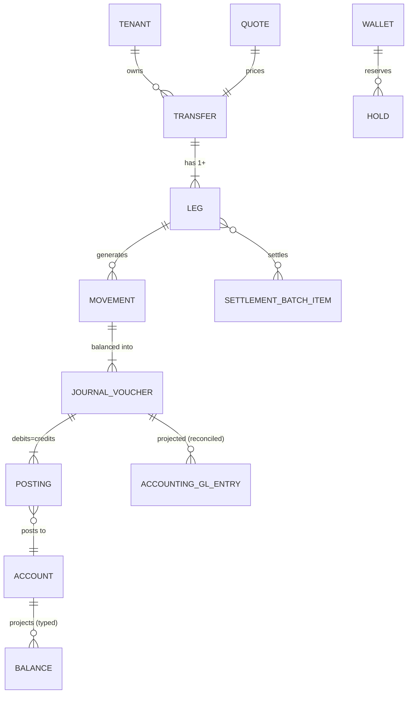
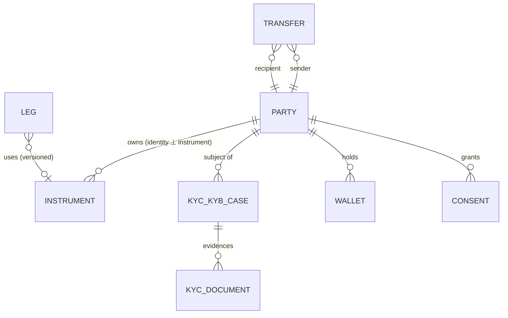
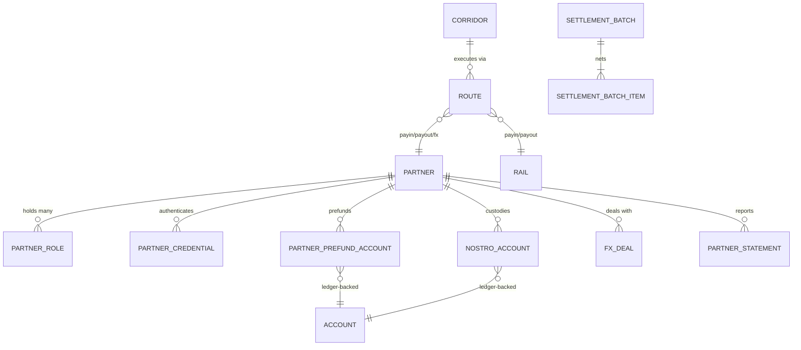
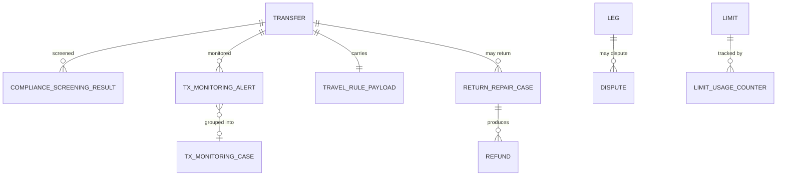
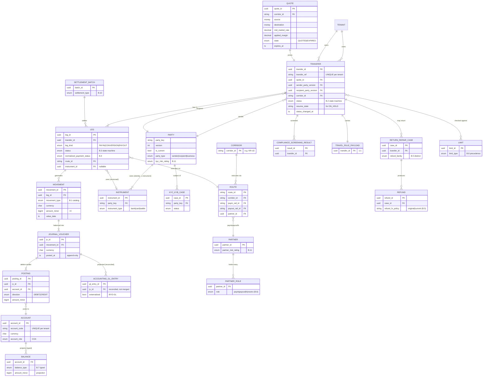
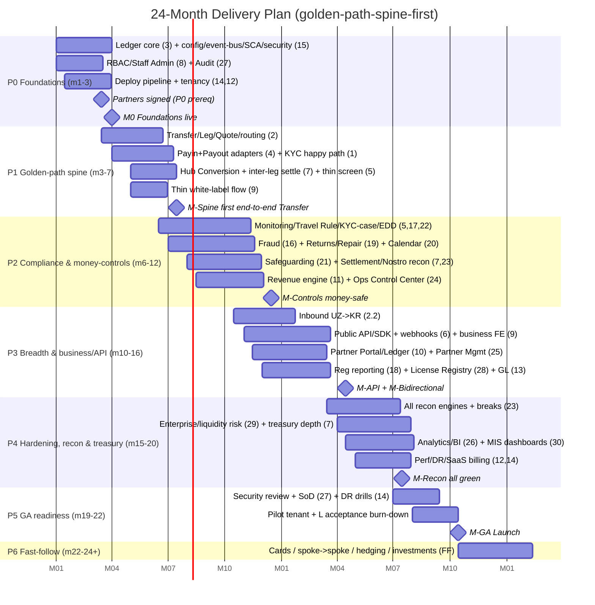
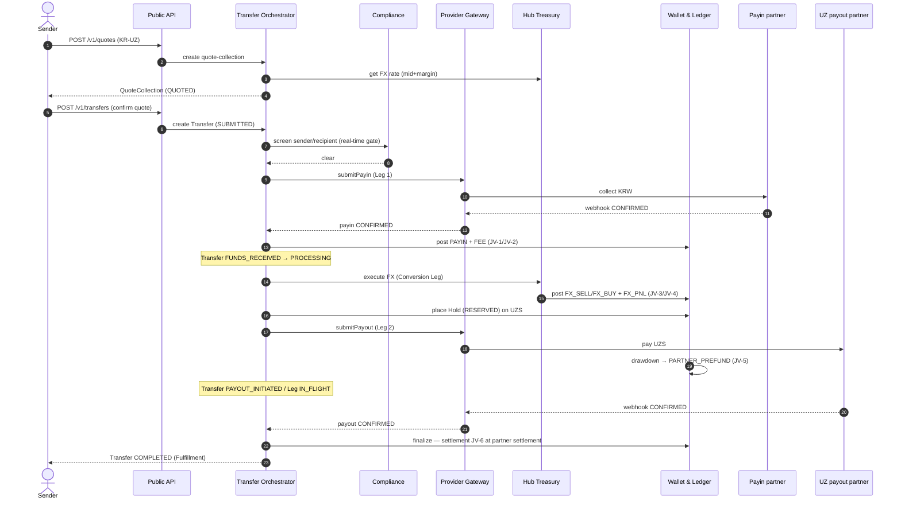
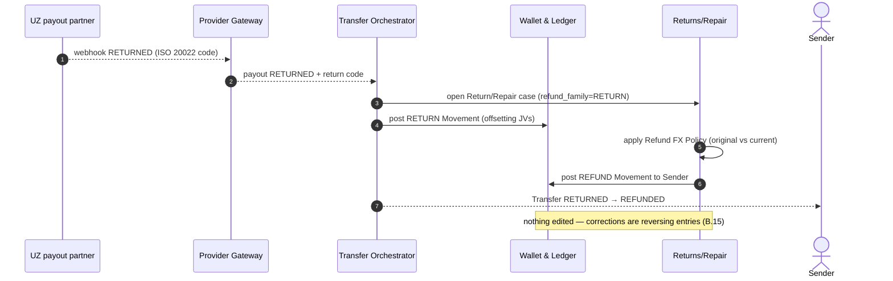
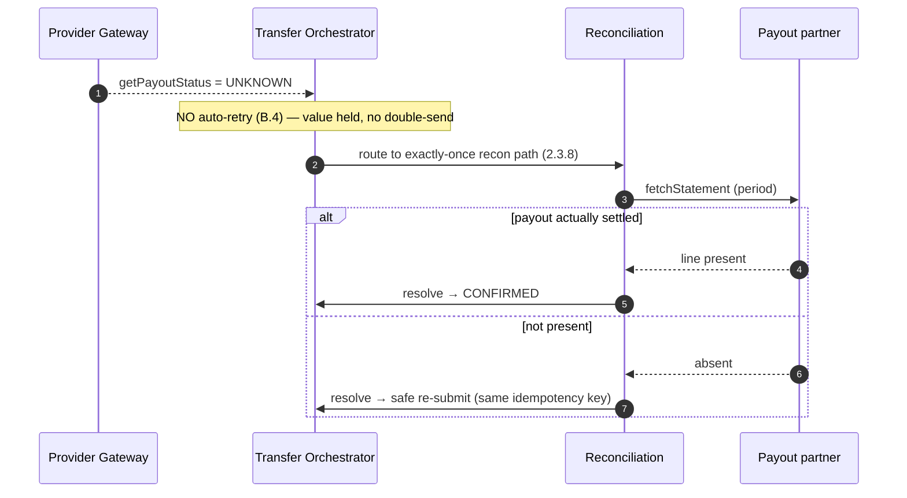

# Cross-Border Transfer Platform — Master Specification (v1)

Single source document, organized as chapters:
- **Part I — Business Scope & Product Requirements**
- **Part II — Detailed Feature List** (WBS spine)
- **Part III — Inferred Target Architecture (HLD)** (reverse-engineered from Nium + our requirements)
- **Part IV — Acceptance Criteria** (atomic, per-feature "definition of done" for all 30 epics)
- **Part V — Logical Data Model & ERD** (tech-agnostic entities, the double-entry ledger schema)
- **Part VI — API Contract (OpenAPI)** (headless public REST API; canonical Transfer field set)
- **Part VII — 24-Month Delivery Plan** (golden-path-spine-first; squads, phases, milestones)
- **Part VIII — Implementation Blueprint (Gap Closure)** (physical HLD, SLOs, security, seed CoA, sequences, admin API, UX, go-live)
- **Part IX — Engineering WBS (≤1-hour tasks)** (junior-executable task breakdown; foundational golden-path spine fully decomposed)
- **Part X — Complete Epic WBS (all 30 epics)** (every epic decomposed into ≤1-hour, junior-executable tasks `E{epic}-{nn}`)
- **Part XI — Maximal-Granularity Task Backlog (leaf level)** (parents exploded into ~10–30 min leaf tasks; multi-tranche, Tranche 1 = WS0–WS4)
- **Appendix A — Fee / Margin Configuration Schema**
- **Appendix B — Canonical Glossary & Core Models** (authoritative for all terminology)

---

# Part I — Business Scope & Product Requirements

## 0. Terminology & Canonical Models
**Appendix B (Canonical Glossary & Core Models) is the authoritative source of truth for all
terminology.** This PRD and `FEATURES.md` follow it; where any term is ambiguous, Appendix B governs.
Key canonical choices used throughout:
- **Transfer** = the customer-level money-movement object; **Leg** = an internal execution segment.
  "Transaction" is reserved for the accounting/monitoring context — not a synonym for Transfer.
- All money movement follows the **Transfer/Leg state machines** and the **normalized payment status
  set** defined in the glossary.
- The **refund family** (cancellation / reversal / return / recall / chargeback / refund) are distinct
  events per the glossary's money-event taxonomy — never conflated.
- "Balance", "limit", "reconciliation", "settlement", "partner", "risk score", and "real-time" each
  have a typed taxonomy in the glossary; specs must name the specific variant.
- Configuration follows the glossary precedence: `Route > Corridor > Tenant > Platform default`.

## 1. Product Vision
A **deployable, white-label cross-border payments platform** sold to licensed financial
entities (banks, EMIs, MSBs, remittance operators). Each customer runs their own isolated,
branded instance — turnkey consumer/business apps **and** a headless API/SDK — under their
own license. The platform operates as a **hub-and-spoke network** with **Korea as the
settlement hub**, proven on the **KR↔UZ** corridor and generalizing to spoke→spoke routes
(e.g., UZ→NP via KR).

## 2. Business Model
- **Type**: B2B software platform (not a regulated operator). We provide tooling; **tenants
  hold the license and own regulatory responsibility and filings.**
- **Delivery**: single-tenant, deployable to tenant cloud or on-prem.
- **Customers (tenants)**: licensed remittance operators, EMIs, MSBs, banks — initially
  Korea-based.
- **Monetization**: license/subscription + usage-based metering (per-transaction or volume
  tiers); optional managed-hosting and implementation services.

## 3. Scope Boundaries

**In scope (v1 / 56-month launch)**
- Multi-leg cross-border transfers: outbound (KR→spoke), inbound (spoke→KR), spoke→spoke via hub
- Funding (payin) and payout adapters, **bidirectional**, incl. KR payout into Korean banks
- **Local-collection accounts / Virtual Account Numbers (VANs)** per wallet-currency for inbound
  and business collections (promoted to launch per the Nium benchmark study)
- UZ payout rails: bank deposit, **Uzcard/Humo** card top-up, cash pickup
- FX conversion + hub treasury/liquidity + multi-leg ledger
- Routing engine with per-tenant allowed-route config
- **Mobile apps (iOS + Android)** for both **personal and business** onboarding & use, white-label
- White-label consumer + business web apps + public API/SDK + webhooks + sandbox
- KYC (ARC-based)/KYB, sanctions screening, transaction monitoring, case management
- **Staff admin console with role-based access control** (marketing, operations, CS, treasury,
  compliance, finance) + platform/fleet console
- **Partner portal + partner API** — partners monitor balances, routed inbound/outbound txns, settlement
- **Configurable partner ledger** — one consolidated ledger per partner OR segregated inbound/outbound
- Deployability: containerization, Helm/Terraform, install golden path, release/migration tooling
- Reconciliation, settlement, treasury dashboard
- Transaction economics & revenue engine (Section 5.11)
- **Full double-entry accounting / general ledger** — journal vouchers on every money movement,
  chart of accounts, Balance Sheet, P&L, trial balance, multi-currency with FX revaluation (Section 5.13)
- **Two reconciled ledgers** — operational ledger (source of truth) + separate accounting GL, with a
  **bring-your-own-GL option** to export/stream JVs to a tenant's own local accounting software

**Out of scope at launch (fast-follow)**
- Debit card issuing
- Investments / yield products
- Advanced ML fraud engine (basic rules at launch)
- Pooled multi-tenant SaaS, additional corridors beyond reference set

**Explicitly not our responsibility (tenant-owned)**
- Holding licenses, regulatory filings (SAR/CTR equivalents), choosing which routes are legally permitted

## 4. Actors / Personas
- **Platform operator (us)** — fleet/super-admin: versions, deployments, license keys, support.
- **Tenant staff (RBAC roles)** — the licensed entity's employees, each with a scoped role in the
  staff admin console:
  - **Marketing** — campaigns, referral/promo codes, fee/promo config (view), customer growth analytics.
  - **Operations** — transaction monitoring, holds/releases, payout exceptions, partner routing,
    reconciliation breaks.
  - **Customer Support (CS)** — customer/account lookup, transfer status, ticketing, limited PII access,
    refund initiation (with approval).
  - **Treasury** — hub liquidity/nostro positions, FX margin & hedging, partner prefunding/settlement,
    cash position.
  - **Compliance** — KYC/KYB review queues, sanctions/screening cases, SAR/filing workflow, audit logs.
  - **Finance/Accounting** — chart of accounts, journal vouchers, Balance Sheet/P&L, period close.
  - **Tenant admin** — manages users/roles, corridor/fee/rail config, branding, limits.
- **End-user — consumer** — individual sender/recipient (e.g., migrant worker KR→UZ).
- **End-user — business** — merchant/company using batch payouts + API.
- **Recipient** — may be a non-user (receives to bank/card/cash).
- **Partner** — payin/payout/FX/liquidity partner (UZ bank, Uzcard/Humo, cash-pickup network,
  liquidity provider). Integrates via API and logs into the **partner portal** to monitor balances,
  the inbound/outbound txns we route to them, settlement, and reconciliation.
- **Accountant / finance (tenant)** — reviews journal vouchers, chart of accounts, and financial
  statements (Balance Sheet, P&L, trial balance) produced by the accounting subsystem.

## 5. Functional Requirements (by module)

### 5.1 Onboarding & Identity
- Individual KYC: ID + liveness, ARC support, configurable KYC provider per tenant
- Business KYB: registration, UBO/directors, multi-user roles & permissions
- Risk-based onboarding tiers; document re-verification workflow

### 5.2 Transfers & Routing
- Quote: real-time FX (mid-market + configurable margin) + transparent fee, with ETA
- Flow types: outbound, inbound, spoke→spoke-via-hub
- Routing engine: corridor graph, leg composition, FX path selection, per-tenant allowed-route enforcement
- One-off, scheduled, recurring; recipient management; status tracking per leg
- Idempotent execution; per-leg failure handling, retries, reversals

### 5.3 Wallet & Operational Ledger
- Multi-currency balances; hold/convert
- Double-entry, immutable **operational ledger** — the **source of truth** for money movement and balances
- Multi-leg transfers as linked legs
- Local receiving account details (where supported)
- Emits events that the accounting GL (5.13) consumes; the two are **reconciled, not merged** (see 5.13)

### 5.4 Payin / Payout (provider abstraction)
- Pluggable adapters, bidirectional, per tenant/corridor
- KR: KRW bank transfer payin + payout into Korean banks (real-name verified)
- UZ: bank deposit, Uzcard/Humo top-up, cash pickup
- Adapter SDK so new rails are config + adapter, not a fork

### 5.5 Compliance
- Sanctions screening (OFAC/UN/EU + local) on sender and recipient, all legs
- Transaction monitoring rules engine (configurable thresholds, velocity, structuring)
- Case management + audit trail; tenant-configurable filing workflow

### 5.6 Business product & API
- Multi-currency business account, batch/CSV + API payouts
- Public REST API + webhooks, key management, sandbox, SDKs
- Statements, accounting integration hooks

### 5.7 Hub Treasury & Settlement
Operational treasury functions (not just dashboards). All actions are **maker/checker** controlled
(treasury role, Section 5.8) and **post JVs to the GL** (5.13) and update partner sub-ledgers (5.12).

**FX execution**
- Capture FX deals (**buy/sell**) against liquidity providers: rate, amount, counterparty, value/settlement date.
- **Buy** destination/spoke currency (e.g., UZS) to fund outbound payouts.
- **Sell USD received from inbound transfers** and buy hub/home currency (e.g., USD→KRW for KR payouts).
- Record dealt rate vs. mid-market → realized FX gain/loss; reconcile to FX margin income (5.11).
- Optional hedging deals (forwards) to manage open exposure.

**Partner prefunding**
- **Buy and send prefunding to partners**: initiate prefund → execute FX buy if needed → wire/transfer
  funds to the partner's account → update partner prefund balance (5.12) → post JV.
- Prefund thresholds & auto-replenish alerts (low-balance triggers per partner/currency).
- Track prefund vs. drawdown so the partner portal balance always reflects available float.

**Settlement**
- Net partner positions (consolidated or segregated per 5.12) on schedule or on demand.
- Generate settlement instructions/wires; mark settled; reconcile against partner statements.
- Inter-leg/hub settlement for spoke→spoke routes.

**Position, cash & nostro management**
- Real-time **FX position & exposure** by currency; position/concentration limits with alerts.
- **Nostro/bank account funding** and cash position across accounts and currencies.
- Liquidity dashboard: prefund balances, open positions, upcoming settlement obligations.
- Multi-leg reconciliation against partner statements; settlement reporting.

### 5.8 Staff Admin & Fleet (RBAC)
- **Staff admin console** with **role-based access control** — granular permissions per role
  (marketing, operations, CS, treasury, compliance, finance, tenant admin; see Section 4).
- RBAC engine: roles → permission sets → resource/action scopes; per-tenant configurable roles;
  least-privilege defaults; full audit of staff actions (who did what, when).
- Sensitive-action controls: maker/checker approvals (refunds, manual JVs, limit overrides),
  PII access gating, IP/2FA enforcement.
- Platform fleet console (us): versions, health/telemetry (opt-in), licensing, deployment status.

### 5.9 White-label front-ends
- **Mobile apps (iOS + Android)** — native or React Native; cover **both personal and business**
  onboarding (KYC/KYB), transfers, tracking, balances. White-label/themeable per tenant.
- **Web apps** — consumer + business; same feature parity as mobile where applicable.
- Multilingual KO/UZ/RU; branding/config system; **headless mode** for tenants building their own UI.

### 5.10 Deployability
- Docker + Helm + Terraform; one-pipeline install (provision → configure → smoke test → go-live)
- Versioned releases, backward-compatible DB migrations, rollback
- Lightweight control plane for licensing/telemetry/updates

### 5.11 Transaction Economics & Revenue Engine
On every transaction the platform must capture all revenue and cost line items **per leg and in
total**, persist them immutably on the ledger entry, and expose estimate-vs-actual reconciliation.

**Revenue points (income)**

Fees charged to the customer:
1. **Service / transfer fee** — flat and/or % per txn, with a minimum fee floor.
2. **Payin fee** — funding-method charge (Korea payin fee, card surcharge, bank-rail fee).
3. **Payout fee / method surcharge** — cash-pickup premium, Uzcard/Humo top-up fee, express deposit.
4. **Speed/tier fee** — premium for express vs. economy delivery.
5. **Inbound fee** — fee on spoke→KR transfers (payout into Korea).
6. **Cross-corridor routing fee** — extra charge on spoke→spoke-via-hub.
7. **Receiving fee** — fee on large/over-threshold receives.
8. **Rate-lock / forward fee** — charge to lock an FX rate for a window.

Margin-based income:
9. **FX margin (spread) income** — (offered rate − mid-market) × amount. Spoke→spoke captures
   **two FX margins** (origin→hub currency, hub→destination currency).
10. **Float / balance interest income** — interest on held balances and in-transit float.
11. **Liquidity/netting gains** — favorable netting at the hub reducing FX needs.

**Cost points (netted against revenue)**
1. **Payout cost paid to partner** — per rail (bank deposit, Uzcard/Humo, cash pickup, KR bank).
2. **Payin cost** — card processing/interchange, bank-rail collection fees.
3. **FX / liquidity cost** — provider spread + hedging cost + slippage.
4. **Hub settlement & nostro cost** — prefunding cost of capital, inter-leg wire/SWIFT/correspondent fees.
5. **Scheme / network fees** — card scheme and local-rail fees.
6. **Compliance cost per txn** — KYC verification + screening API calls.
7. **Refund / reversal / chargeback cost** (with provisioning).
8. **Platform fee** — what the tenant pays us per txn (tenant cost / our revenue).

**Per-transaction P&L**
```
Gross revenue = service fee + payin fee + payout surcharge + speed fee
              + routing fee + receiving fee + rate-lock fee
              + Σ FX margin (per leg) + attributed float interest

Total cost    = Σ payout cost (per leg) + payin cost + Σ FX/liquidity cost (per leg)
              + settlement/correspondent cost + scheme fees + compliance cost
              + refund/chargeback provision + platform fee

Net margin    = Gross revenue − Total cost
Margin %      = Net margin / send amount
```
**Multi-leg rule:** compute revenue and cost per leg (origin→hub, hub→destination) and roll up.

**Engine requirements**
- Quote-time **estimate** (projected margin before execution) and post-settlement **actuals**.
- Reconciliation of estimated vs. actual (partner invoices vs. expected costs).
- All fee/margin rules **configurable per tenant/corridor/route** (no code changes) — see Appendix A.
- Margin reporting: per-txn, per-corridor, per-tenant in tenant admin + fleet console.

**Platform-level revenue (our SaaS layer)**
- Per-transaction platform fee or revenue-share %, subscription/license fee, volume-tier overage,
  implementation/managed-hosting fees. Metered in the fleet/billing console.

### 5.12 Partner Portal & Partner Ledger
A third external surface (separate from end-user apps and tenant admin) for the rails/liquidity
partners we integrate via API.

**Partner portal**
- Partner authentication + role-based access (separate identity domain from end-users/tenant staff).
- **Real-time balance view** — current position(s) with the operator, updated as txns flow.
- **Routed transaction lists** — inbound txns (partner collects/pays in) and outbound txns
  (we route payouts to partner), with status, amounts, FX, and fees.
- **Statements & settlement reports** — periodic statements, settlement instructions, prefunding/nostro
  status, expected vs. received reconciliation.
- **Exceptions & disputes** — flag failed/returned payouts, raise/track reconciliation breaks.
- **API parity** — everything in the portal is also available via partner API + webhooks.

**Partner ledger (configurable)**
- Each partner has a **sub-ledger** in the general ledger tracking the net position (prefunded
  balance / payable / receivable) per currency.
- **Mode is configurable per partner/tenant:**
  - **Consolidated** — one ledger per partner; inbound and outbound net into a single balance.
  - **Segregated** — separate inbound and outbound ledgers/accounts per partner (and per currency),
    no netting across direction.
- Drives the portal balance display and the settlement/netting logic at the hub.

### 5.13 Accounting & General Ledger
The platform is a complete accounting system, not just a money-movement ledger. **Every transaction
and money movement generates journal voucher(s) (double-entry postings)** against a chart of accounts,
producing full financial statements.

**Two-ledger architecture (design decision)**
- The **operational ledger (5.3)** is the source of truth for money movement and balances.
- The **accounting GL is a separate, reconciled ledger** — it consumes operational events and posts
  JVs, but is **not merged** with the operational ledger. Rationale: tenants may want to keep books
  in their **own local accounting software**, so the accounting layer must be decoupled and replaceable.
- A **continuous reconciliation process** asserts the two always agree (operational balances ↔ GL
  control accounts), with exception alerts on any drift.
- **Bring-your-own-GL option (per tenant):** use the built-in GL, OR disable it and **export/stream
  JVs to an external accounting system** (standardized JV/trial-balance export + integration adapters,
  e.g., local Korean accounting packages or generic CSV/API). Reconciliation still runs against the
  operational ledger regardless of which GL is authoritative.

**Chart of Accounts (CoA)**
- Configurable CoA covering Assets, Liabilities, Equity, Income, Expense.
- Sub-ledgers: customer wallet liabilities, partner balances (per 5.12), nostro/bank accounts,
  fee income, FX margin income, float/interest income, payout/payin cost, liquidity cost,
  compliance cost, settlement cost, refund/chargeback provisions, platform-fee expense.

**Journal vouchers (JVs)**
- Each money-movement event (payin received, FX conversion, fee capture, payout to partner,
  refund/reversal, settlement, fee accrual) auto-generates a **balanced JV** (Σ debits = Σ credits).
- JVs are immutable, sequentially numbered, fully audited, and **linked back to the originating
  txn/leg** so the operational ledger (5.3) and the accounting GL always reconcile.
- Support for manual JVs (with approval workflow) for adjustments/corrections — never edit posted JVs;
  post reversing entries instead.

**Multi-currency**
- Postings carry transaction currency + reporting currency (KRW).
- **Period-end FX revaluation** of foreign-currency balances → unrealized FX gain/loss to P&L.
- Realized FX gain/loss recognized on conversion legs.

**Financial statements & reporting**
- **Trial balance**, **Balance Sheet**, **Profit & Loss (income statement)**, and cash position.
- Drill-down from any statement line → JVs → originating transactions.
- Per-period close process (lock period, no further postings to a closed period).
- Reports available in tenant admin (finance role) and exportable; revenue/margin from 5.11
  reconciles to P&L income lines.

**Worked example — outbound KR→UZ payout (illustrative postings)**
```
1. Payin received (KRW from customer):
     Dr  Nostro/Bank — KR (asset)            Cr  Customer payable (liability)
2. Fees & FX margin recognized:
     Dr  Customer payable                     Cr  Service fee income (income)
     Dr  Customer payable                     Cr  FX margin income (income)
3. Payout routed to UZ partner (UZS):
     Dr  Customer payable                     Cr  Partner balance — UZ (liability/sub-ledger)
4. Partner cost incurred:
     Dr  Payout cost (expense)                Cr  Partner balance — UZ
5. Settlement to partner (prefund draw / wire):
     Dr  Partner balance — UZ                 Cr  Nostro/Bank (asset)
```
Each step is a JV; the Partner balance sub-ledger (step 3–5) is exactly what the partner sees in
the portal, in either consolidated or segregated mode.

## 6. Non-Functional Requirements
- **Security**: PCI-DSS scope segmentation, encryption at rest/in transit, secrets mgmt, audit logging
- **Data residency**: honor Korea PIPA and per-deployment localization
- **Availability/SLA**: target 99.9%+ per instance; idempotency + reconciliation prevent double-spend
- **Performance**: real-time quotes; payout SLA per rail
- **Observability**: per-deployment metrics/logs/tracing, surfaceable to fleet console
- **Internationalization**: KO/UZ/RU at launch, extensible
- **Maintainability**: config-driven, no per-tenant code forks

## 7. Compliance Responsibility Boundary
| Platform provides | Tenant owns |
|---|---|
| KYC/KYB orchestration, screening engine, monitoring rules, case mgmt tooling, audit logs, route-enforcement controls | The license, threshold/policy decisions, filing of reports, deciding which routes are legally permitted |

## 8. Success Metrics (KPIs)
- **Time-to-deploy a new tenant** (golden-path target: days, not months)
- Reference deployment live (KR↔UZ both directions) by Month 18; UZ→NP-via-KR demonstrated by Month 21
- Transfer success rate, payout SLA adherence, reconciliation break rate
- FX margin capture vs. liquidity cost at hub
- # of routes/rails supported via config without code change

## 9. Assumptions & Constraints
- Tenants are already licensed (KR license assumed in hand for reference deployment)
- UZ payout + FX/liquidity partners signed in Phase 0
- Single-tenant deployable model (no pooled multi-tenancy in v1)
- 30+ eng, parallel consumer + business tracks, 24-month GA
- Cards/investments deferred

## 10. Phasing Summary
- **Launch (M24)**: hub-and-spoke transfers (all 3 flow types), wallet, business+API, compliance,
  both consoles, deployability, KR↔UZ reference + UZ→NP-via-KR proof
- **Fast-follow**: cards, investments/yield, advanced fraud, more corridors, pooled SaaS option

---

# Part II — Detailed Feature List

Hierarchically numbered (Epic → Feature → Sub-feature) for direct conversion into a WBS.
Numbering is the proposed WBS spine.

**Terminology:** all terms follow Appendix B — Canonical Glossary & Core Models
(authoritative). "Transfer" = customer-level object, "Leg" = execution segment; money flows follow the
glossary Transfer/Leg state machines and normalized payment status set; the refund family is the
glossary money-event taxonomy. Each leaf, when expanded into a full spec, must name the specific
variant of any typed term (balance/limit/reconciliation/settlement/partner/risk-score) and resolve
config scope per `Route > Corridor > Tenant > Platform`. (Glossary §N references = Appendix B §B.N.)

Legend — **Phase**: launch (L) / fast-follow (FF). **Surface**: BE (backend), MOB (mobile),
WEB (web), API, ADM (staff admin), PRT (partner portal), FLEET (platform console), INFRA.
Provenance tags: **(audit gap)** payments-veteran audit · **(dept review)** 20-department audit ·
**(Nium gap)** added from the Nium API benchmark study · **(Nium-arch)** inferred from
reverse-engineering Nium's backend (both see `NIUM_API_DEEP.md`) · **(Thunes gap)** added from the
Thunes API benchmark study (see `THUNES_API_DEEP.md`) · **(Ripple gap)** added from the Ripple
Payments Direct 2.0 benchmark study (see `RIPPLE_API_DEEP.md`) · **(Wise gap)** added from the
Wise Platform API benchmark study (see `WISE_API_DEEP.md`).

---

## 1. Identity & Onboarding
### 1.1 Individual KYC
- 1.1.1 Registration & account creation (email/phone, OTP) — L, BE/MOB/WEB
- 1.1.2 ID document capture & verification (provider-pluggable) — L
- 1.1.3 Liveness / selfie match — L
- 1.1.4 Korea ARC (Alien Registration Card) verification — L
- 1.1.5 Address & proof-of-funds capture — L
- 1.1.6 Risk-based onboarding tiers (limits per tier) — L
- 1.1.7 Re-verification / periodic refresh workflow — L
- 1.1.8 KYC status & decision audit trail — L
- 1.1.9 Versioned, immutable party/identity records — every PII change creates a new version
  (prior versions retained for audit); ACTIVE / DEACTIVATED lifecycle; each Transfer binds the
  exact identity version used at submit time — L (Ripple gap)
### 1.2 Business KYB
- 1.2.1 Business registration capture (company docs) — L
- 1.2.2 UBO / beneficial-owner identification & verification — L
- 1.2.3 Director / authorized-signatory verification — L
- 1.2.4 Business risk scoring & tiering — L
- 1.2.5 Multi-user invitation & linking to business entity — L
- 1.2.6 KYB re-verification workflow — L
### 1.3 KYC/KYB Provider Abstraction
- 1.3.1 Provider adapter interface (Onfido/Persona/etc.) — L
- 1.3.2 Per-tenant provider selection (config) — L
- 1.3.3 Fallback / multi-provider routing — FF
### 1.4 Onboarding Screening & Lifecycle (audit gap)
- 1.4.1 Sanctions/PEP/adverse-media screening at onboarding (not just at txn) — L
- 1.4.2 Identity dedup (one person, multiple accounts → mule prevention) — L
- 1.4.3 Document/ARC/visa expiry tracking → block on expiry — L
- 1.4.4 Step-up KYC as limits increase — L
- 1.4.5 Device binding at onboarding — L
- 1.4.6 Source-of-funds / source-of-wealth capture (threshold-driven) — L
- 1.4.7 Expected account usage capture (projected volumes/purpose) → seeds txn-monitoring baselines — L (Nium gap)
- 1.4.8 Tax-form collection (W-8/W-9-style where the jurisdiction requires) — L (Nium gap; legal review)
### 1.5 Customer Hierarchy (Nium gap)
- 1.5.1 Parent-child customer linkage (corporate subsidiaries, sub-accounts, family/reseller structures) — L
- 1.5.2 Hierarchy-aware limits, reporting & balance roll-up — L
- 1.5.3 Hierarchy model general enough to represent marketplace / sub-merchant structures
  (e.g. Company → Merchant → Account) with per-node settlement, limits & config — so collect-on-
  behalf-of and reseller models are supported by config, not a schema change — L (Thunes gap)

## 2. Transfers & Routing
### 2.1 Quoting
- 2.1.1 Real-time FX rate fetch (mid-market) + TTL — L, BE
- 2.1.2 Fee calculation (service/payin/payout/speed) from config — L
- 2.1.3 Quote object with ETA, breakdown, expiry — L
- 2.1.4 Rate-lock / forward quote — FF
- 2.1.5 Pre-transaction disclosure (total cost, FX rate, amount received, delivery
  date, cancellation rights) shown before confirm — L (audit gap)
- 2.1.6 Receipt/confirmation artifact with full disclosure — L (audit gap)
- 2.1.7 ETA driven by business-calendar / cut-offs (module 20) — L (audit gap)
- 2.1.8 Pre-flight payout validation / dry-run — validate a transfer against corridor rules
  before debit, returning a structured issues list — L (Nium gap)
- 2.1.9 Multi-rail quote collection — when a corridor has more than one eligible rail, return one
  quote per rail (each with its own FX, fee breakdown & ETA) so the caller compares price/speed
  before confirming; collapses to a single quote when only one rail applies — L (Ripple gap)
- 2.1.10 Multi-pay-in-method quote pricing — when a corridor supports more than one funding/pay-in
  method (e.g. bank transfer, direct debit, VAN credit, card), price each method separately (its own
  fee + ETA); composes with multi-rail quote collection (2.1.9) to form a pay-in-method × payout-rail
  price matrix so the caller compares funding options; collapses to one option when a single method
  applies — L (Wise gap)
### 2.2 Routing Engine
- 2.2.1 Corridor graph model (nodes=country/currency, edges=rails) — L, BE
- 2.2.2 Leg composition (origin→hub, hub→destination) — L
- 2.2.3 FX path selection across legs — L
- 2.2.4 Per-tenant allowed-route enforcement (enabled switch) — L
- 2.2.5 Flow-type handlers: outbound / inbound / spoke→spoke — L
- 2.2.6 Intra-family automatic rail selection — within an eligible rail set, auto-pick the physical
  rail by amount / speed / addressability / cost (e.g. instant rail under a threshold, else
  standard), so the caller need not name the specific rail; selection rule is config, not code — L (Ripple gap)
### 2.3 Transfer Lifecycle
- 2.3.1 Transfer creation & idempotency keys — L, BE
- 2.3.2 Recipient management (CRUD, validation per rail) — L
  - 2.3.2a Dynamic per-corridor beneficiary schema — required fields driven by metadata keyed on
    (country, currency, payout method); no hard-coded per-corridor forms — L (Nium gap)
  - 2.3.2b Schema Preview API — fetch the field set + validation rules for a corridor before
    beneficiary creation — L (Nium gap)
  - 2.3.2c Party ⊥ payout-instrument data model — PII/KYC lives once on a reusable party
    (originator or beneficiary); payout accounts (rail-specific details) attach as separate
    instruments; a Transfer references both. One party → many instruments — L (Ripple gap)
  - 2.3.2d Client external-reference dedup on parties — caller-supplied stable key (CRM/core-banking
    id), unique per tenant; collision returns/links the existing party rather than creating a
    duplicate (1:1 operator-record ↔ party mapping) — L (Ripple gap)
  - 2.3.2e Advisory multi-rail PII pre-validation — validate a party's captured PII against a named
    set of target rails at create/update time, surfacing missing fields early (advisory; does not
    restrict later instruments) — L (Ripple gap)
  - 2.3.2f Conditional dynamic requirements & transfer-level preview — the metadata-driven form
    engine (2.3.2a/b) generalizes to ALL captured data (beneficiary, originator, and purpose /
    source-of-funds / relationship compliance fields): a field can declare refresh-on-change so
    changing its value re-resolves the required field set (dependent/conditional fields), and a
    transfer-requirements preview returns the full required set + validation rules before submit — L (Wise gap)
- 2.3.3 Status tracking per Transfer/Leg state machines (Glossary §2–3) — L
- 2.3.4 Scheduled & recurring transfers — L
- 2.3.5 Per-leg failure handling, retries, reversals — L
- 2.3.6 Cancellation & refund initiation — L
- 2.3.7 Transfer history & receipts — L
- 2.3.8 Exactly-once payout guarantee (dedup + settlement-of-truth on partner
  timeout, prevents double-pay) — L (audit gap)
- 2.3.9 Confirmation of Payee / beneficiary name verification — L (audit gap)
  - 2.3.9a Proxy / alias resolution — resolve phone / card / alias → account (e.g., Uzcard/Humo by
    card or phone, mobile-addressed payouts) — L (Nium gap)
- 2.3.10 Purpose-of-remittance / purpose-code capture — L (audit gap)
  - 2.3.10a Structured per-corridor compliance fields — purpose code **plus** sender↔beneficiary
    relationship code and source-of-funds code, with valid-value sets driven by corridor config;
    used for screening/regulatory reporting, never forwarded to the beneficiary — L (Ripple gap)
- 2.3.11 Duplicate-transfer detection (beyond idempotency) — L (audit gap)
- 2.3.12 Payout confirmation handling (async partner confirms, polling,
  timeouts, escalation) — L (audit gap)
- 2.3.13 Funding-mode handling per Transfer — **prefunded** (debit wallet now), **credit**
  (operator extends credit, invoiced) or **JIT** (await external funding before payout, with a
  funding-window timeout); modes are config-gated and map onto the existing payin-clearing states
  (Glossary §2) — L (Ripple gap; credit/JIT gated by operator business model)

## 3. Wallet & Operational Ledger
- 3.1 Multi-currency balances per user/business (ledger/available/reserved/cleared per Glossary §7) — L, BE
- 3.2 Hold / convert between currencies — L
- 3.3 Double-entry immutable operational ledger (source of truth) — L
- 3.4 Multi-leg transfers as linked ledger legs — L
- 3.5 Local receiving / Virtual Account Number (VAN) issuance per wallet-currency — local-collection
  accounts (IBAN / sort code / ACH routing / payer-id as applicable) — L (Nium gap — promoted from fast-follow)
- 3.6 Event emission for accounting GL (5.13 / module 13) — L
- 3.7 Balance enquiry & statement APIs — L
- 3.8 Negative / below-zero balance detection, prevention & alerting — L (Nium gap)
- 3.9 Canonical posting-type / movement-type catalog — enumerated, typed ledger-entry kinds (payin,
  payout, FX buy/sell, fee, reversal, return, cancellation, prefund, drawdown, adjustment, …) that
  every JV posting carries; the authoritative set lives in Appendix B — L (Thunes gap)
- 3.10 Multi-state balance projection exposed in balance/statement APIs — distinguish **Expected**
  (anticipated incoming, e.g. collection in flight) from Ledger / Reserved / Available / Cleared
  (Glossary §7) so consumers never conflate not-yet-received funds with usable funds — L (Thunes gap)
- 3.11 Reconciliation-grade ledger rows — each posting carries available-balance **before/after**,
  a transaction-source tag, and the originating external reference (= transfer id); statement API
  offers both JSON and CSV export for finance reconciliation — L (Ripple gap)

## 4. Payin / Payout (Provider Abstraction)
### 4.1 Adapter Framework
- 4.1.1 Bidirectional adapter interface (payin + payout) — L, BE
- 4.1.2 Adapter SDK + sandbox/mocks — L
- 4.1.3 Per-tenant/corridor adapter selection (config) — L
- 4.1.4 Webhook/callback handling & status normalization to the canonical payment status set (Glossary §4) — L
- 4.1.5 Multiple payout partners per corridor + failover routing
  (outage/cost/speed) — L (audit gap)
- 4.1.6 Direction-asymmetric config (KR inbound rules ≠ outbound;
  no symmetry assumption) — L (audit gap)
- 4.1.7 Full pay-in operation model in the adapter framework — authorize → capture/charge → cancel
  (pre-capture) → refund (full/partial), with the payment-order state machine normalized to the
  canonical payment status set (Glossary §4); rails without a capture step use the degenerate
  single-step case — L (Thunes gap)
- 4.1.8 Rail-type-agnostic adapter model — one adapter interface spans any rail class (bank transfer,
  mobile wallet, cash pickup, card, RTP, on-chain/stablecoin, …); supporting a new rail type is an
  adapter + config, never a core change. On-chain/stablecoin payout (credit-party wallet-address
  fields + settlement adapter) is therefore supported without special-casing — L (Thunes gap)
- 4.1.9 **Config-driven connector framework (no-code partner integration)** — a generic Connector
  Runtime interprets a declarative, versioned **Connector Definition** (config-as-data) to implement
  the adapter SPI for a partner: transport, auth, endpoint binding, request/response field mapping
  (allow-listed pure transforms), status/return-code mapping, webhook verify+parse, idempotency,
  resilience, and statement/recon. Onboarding a REST/JSON partner is config, not code; a
  `code_adapter`/`hybrid` escape hatch covers rails the DSL cannot express. See VIII.6.3–VIII.6.6 — L, BE
- 4.1.10 Connector authoring, sandbox-certification, versioning & governance — schema-validated
  definitions, contract-test gate before activation, maker-checker publish, versioned/rollback,
  connector test console — L, ADM
- 4.1.11 **SWIFT MT payout rail (MT103 + MT202/COV)** — a `code_adapter` connector that
  serializes the normalized payout request into SWIFT FIN (customer credit MT103 + cover
  MT202/COV) with field mapping, formatting/validation, UETR, idempotency, and canonical-status
  mapping; generates message text for a SWIFT gateway (transmission/SR-validation external).
  Spec + tested reference implementation in VIII.15 — L, BE
### 4.2 Korea (KR) Rails
- 4.2.1 KRW bank transfer payin — L
- 4.2.2 KRW payout into Korean banks (real-name verified) — L
- 4.2.3 Card payin — FF
### 4.3 Uzbekistan (UZ) Rails
- 4.3.1 Bank deposit payout — L
- 4.3.2 Uzcard / Humo card top-up payout — L
- 4.3.3 Cash pickup payout — L
- 4.3.4 UZ payin (for inbound) — L
### 4.4 Additional Spokes
- 4.4.1 Nepal (NP) payout adapter (bank deposit) — FF
- 4.4.2 Adapter onboarding playbook for new rails — FF
  (any rail type — incl. on-chain/stablecoin — is an adapter under the rail-agnostic model 4.1.8)
### 4.5 Local Collection / Virtual Account Numbers (Nium gap)
- 4.5.1 Assign VAN(s) to a wallet per currency; map inbound credits → wallet (esp. inbound spoke→KR
  & business collections) — L
- 4.5.2 VAN source configuration per tenant/banking partner; routing-code metadata — L
- 4.5.3 Incoming-funds matching & wallet-funded events — L
### 4.6 Direct Debit & Mandates (Nium gap)
- 4.6.1 Mandate setup & lifecycle (create / amend / cancel) for pull funding — L
- 4.6.2 Micro-deposit / account verification before first debit — L
- 4.6.3 Pull-based wallet funding execution + return handling — L

## 5. Compliance
### 5.1 Sanctions Screening
- 5.1.1 Sender & recipient screening (all legs) — L, BE
- 5.1.2 List management (OFAC/UN/EU + local) — L
- 5.1.3 PEP / adverse-media screening — L
- 5.1.4 Provider abstraction (e.g., ComplyAdvantage) — L
- 5.1.5 List-version provenance on every hit (which list/version matched) — L (dept review)
- 5.1.6 False-positive / good-guy list governance (maker-checker) — L (dept review)
- 5.1.7 Fuzzy-match threshold tuning per list — L (dept review)
- 5.1.8 Synchronous payout-blocking screening (real-time gate) — L (dept review)
### 5.2 Transaction Monitoring
- 5.2.1 Rules engine (thresholds, velocity, structuring) — L
- 5.2.2 Per-tenant configurable rules — L
- 5.2.3 Real-time + batch monitoring — L
- 5.2.4 Rule backtesting / simulation against history before go-live — L (dept review)
- 5.2.5 Alert tuning + QA sampling — L (dept review)
- 5.2.6 Policy/threshold version registry — L (dept review)
### 5.3 Case Management
- 5.3.1 Alert/case queue & assignment — L
- 5.3.2 Investigation workflow & disposition — L
- 5.3.3 Filing workflow (SAR/STR equivalent, tenant-configurable) — L
- 5.3.4 Audit trail & evidence retention — L
- 5.3.5 Link / network analysis (mule rings, related parties) — L (dept review)
- 5.3.6 Lookback investigation tooling — L (dept review)
### 5.4 Limits & Controls
- 5.4.1 Per-txn / per-customer / annual limits enforcement — L
- 5.4.2 Hold / release / block actions — L
### 5.5 Ongoing Screening (audit gap)
- 5.5.1 Rescreen existing customer base on list updates — L
- 5.5.2 Ongoing PEP / adverse-media monitoring — L
- 5.5.3 Whitelisting & hit-disposition memory (reduce false positives) — L
- 5.5.4 Record-keeping & retention (5–7 yr) for screening decisions — L
### 5.6 Information Requests / RFI (Thunes gap)
- 5.6.1 RFI as a first-class, auditable resource on a held Transfer/Leg — raise → notify
  sender/business (and/or partner) → collect structured response + document attachments →
  review → resolve/reject, gating release of the held transfer — L
- 5.6.2 RFI lifecycle states + SLA/expiry (auto-action on no-response) tied to the Transfer hold — L
- 5.6.3 RFI surfaces: hosted response form (9.4.1), API, and staff/partner queue; full evidence
  trail retained with the compliance record (5.3.4) — L

## 6. Business Product & Public API
### 6.1 Business Account
- 6.1.1 Multi-currency business account — L
- 6.1.2 Multi-user roles & permissions (business side) — L
- 6.1.3 Statements & reporting — L
### 6.2 Batch Payouts
- 6.2.1 CSV upload + validation — L
- 6.2.2 Batch execution & per-item status — L
- 6.2.3 Approval workflow for batches — L
### 6.3 Public API & SDK
- 6.3.1 REST API (transfers, quotes, balances, recipients) — L, API
- 6.3.2 Webhooks (events, retries, signing) — L
  - 6.3.2a Defined webhook event catalog (Transfer/Leg lifecycle, payin incoming-funds/funded,
    payout lifecycle, FX conversion, VAN assignment, compliance status, balance events) — L (Nium gap)
  - 6.3.2b Delivery guarantees — at-least-once delivery, signed payloads (HMAC **or** asymmetric RSA
    with environment-specific published keys), per-event idempotency key, ordered-per-resource +
    consumer dedup, dead-letter queue + replay — L (Nium-arch; Wise gap)
  - 6.3.2c Self-contained event payloads — state-change events carry the reason/error code (signed)
    so consumers don't need a follow-up GET to learn why a Transfer failed/declined/returned;
    state-transition history endpoint remains the ordering source of truth — L (Ripple gap)
- 6.3.3 API key & secret management — L
- 6.3.4 Sandbox environment — L
  - 6.3.4a Sandbox lifecycle simulation — drive transfers/legs/payouts through states (incl.
    return / RFI triggers) for integration testing — L (Nium gap)
- 6.3.5 Client SDKs + API reference docs — L
- 6.3.6 Accounting integration hooks — L
- 6.3.7 Error model separates request-validation from account-condition errors — malformed/invalid
  requests vs resolvable account conditions (limit reached, insufficient balance, past-due invoice,
  account on hold) returned as a distinct class so callers can resolve-and-retry without code
  changes; prefixed, structured error envelope — L (Ripple gap)
- 6.3.8 Locale-aware responses & localization contract — the API always returns the stable machine
  `code` (and `issues[].code`) plus a default-locale (English) human `detail`/`message` for logs;
  clients localize from the code via the catalog (9.3.4). The API honors `Accept-Language` for
  server-rendered customer-facing surfaces — hosted components (9.4) and notifications (15.2.3) —
  resolving to an enabled locale (header → recipient/tenant default → platform default). Error
  `code`s and `issues[].code`s are guaranteed members of the closed, versioned catalog so client-side
  localization is total — L

## 7. Hub Treasury & Settlement
### 7.1 FX Execution
- 7.1.1 FX deal capture (buy/sell: rate, amount, counterparty, value date) — L, BE/ADM
- 7.1.2 Buy spoke currency to fund outbound payouts — L
- 7.1.3 Sell inbound USD → buy hub/home currency (USD→KRW) — L
- 7.1.4 Dealt-vs-mid rate capture → realized FX gain/loss — L
- 7.1.5 Forward / hedging deals — FF
### 7.2 Partner Prefunding
- 7.2.1 Prefund initiation (FX buy if needed → wire → update balance → JV) — L
- 7.2.2 Prefund thresholds & auto-replenish alerts — L
- 7.2.3 Prefund vs. drawdown tracking (feeds partner portal) — L
### 7.3 Settlement
- 7.3.1 Net partner positions (consolidated/segregated) — L
- 7.3.2 Settlement instruction / wire generation — L
- 7.3.3 Statement reconciliation & mark-settled — L
- 7.3.4 Inter-leg / hub settlement for spoke→spoke — L
### 7.4 Position, Cash & Nostro
- 7.4.1 Real-time FX position & exposure by currency — L
- 7.4.2 Position/concentration limits + alerts — L
- 7.4.3 Nostro/bank account funding & cash position — L
- 7.4.4 Liquidity dashboard — L
- 7.4.5 Maker/checker on all treasury actions — L
### 7.5 FX-Model & Working Capital (audit gap)
- 7.5.1 Per-corridor FX-execution model: FX-at-hub vs FX-at-partner
  (e.g., UZS converted locally by partner — margin sits at partner) — L
- 7.5.2 Working-capital / float model: prefund funding source & cost of capital — L
- 7.5.3 Weekend/holiday liquidity gap handling — L
- 7.5.4 Bank statement ingestion (MT940 / camt.053) for nostro recon — L
### 7.6 Dealing & Rate Management (dept review)
- 7.6.1 Rate-markup management (customer vs treasury-execution vs benchmark rate) — L
- 7.6.2 Multi-source rate redundancy & failover — L
- 7.6.3 Deal blotter & end-of-day position sign-off — L
- 7.6.4 Dealing limits per user/desk — L
- 7.6.5 Counterparty credit limits (partners & liquidity providers) — L
- 7.6.6 Intraday liquidity & cash-flow forecasting — L

## 8. Staff Admin & RBAC
### 8.1 RBAC Engine
- 8.1.1 Roles → permission sets → resource/action scopes — L, ADM/BE
- 8.1.2 Per-tenant configurable roles, least-privilege defaults — L
- 8.1.3 Staff action audit (who/what/when) — L
- 8.1.4 Maker/checker approvals (refunds, manual JVs, limit overrides) — L
- 8.1.5 PII access gating, 2FA, IP allowlist — L
### 8.2 Role Workspaces
- 8.2.1 Marketing (campaigns, promo/referral codes, growth analytics) — L
  - 8.2.1a Promo budget caps + abuse/fraud guardrails — L (dept review)
  - 8.2.1b Referral program engine — L (dept review)
  - 8.2.1c Segmentation / CRM integration — L (dept review)
  - 8.2.1d Attribution & funnel analytics — L (dept review)
  - 8.2.1e Lifecycle/retention messaging + churn analytics — L (dept review)
- 8.2.2 Operations (monitoring, holds, payout exceptions, routing, recon) — L
- 8.2.3 Customer Support (lookup, status, ticketing, refunds) — L
- 8.2.3a Regulated complaint management (SLAs, audit trail, escalation) — L (audit gap)
  - 8.2.3b 360° customer view with PII masking + agent-action audit — L (dept review)
  - 8.2.3c Transfer trace / recall request tooling — L (dept review)
  - 8.2.3d Knowledge base, canned responses, callback scheduling — L (dept review)
- 8.2.4 Treasury (links to module 7) — L
- 8.2.5 Compliance (links to module 5) — L
- 8.2.6 Finance/Accounting (links to module 13) — L
- 8.2.7 Tenant admin (user/role mgmt, corridor/fee/rail/branding/limits config) — L

## 9. White-label Front-ends
### 9.1 Mobile Apps (iOS + Android)
- 9.1.1 Personal onboarding flow (KYC) — L, MOB
- 9.1.2 Business onboarding flow (KYB) — L
- 9.1.3 Send money (quote → confirm → track) — L
- 9.1.4 Balances & multi-currency wallet — L
- 9.1.5 Recipients, scheduled/recurring transfers — L
- 9.1.6 Notifications & transfer tracking — L
- 9.1.7 White-label theming per tenant — L
### 9.2 Web Apps
- 9.2.1 Consumer web app (parity with mobile) — L, WEB
- 9.2.2 Business web app (batch, statements, API keys) — L
### 9.3 White-label System
- 9.3.1 Branding/theme config (logo, colors, copy) — L
- 9.3.2 Headless mode (tenant builds own UI) — L
- 9.3.3 Internationalization KO/UZ/RU — L
- 9.3.4 Localized error & system-message rendering — customer-facing apps render every API error and
  system message by mapping the stable machine `code` (and each `issues[].code`, incl. field-level
  validation) to localized copy from the canonical message catalog (15.2.4) for the resolved locale,
  so adding a language needs no backend change; missing translations fall back to the default locale
  (never a raw code/blank), with interpolated params (amounts/dates/currency) locale-formatted — L
### 9.4 Hosted / Embeddable Components (Nium gap)
- 9.4.1 Drop-in hosted forms — onboarding (KYC/KYB), beneficiary capture, RFI response — for tenants
  not building their own UI — L
- 9.4.2 Embeddable widgets with white-label theming + secure session handoff — L

## 10. Partner Portal & Partner Ledger
### 10.1 Partner Portal
- 10.1.1 Partner auth & RBAC (separate identity domain) — L, PRT
- 10.1.2 Real-time balance view (per currency) — L
- 10.1.3 Routed transaction lists (inbound + outbound) — L
- 10.1.4 Statements & settlement reports — L
- 10.1.5 Prefunding / nostro status — L
- 10.1.6 Exceptions & dispute tracking — L
- 10.1.7 Partner API + webhook parity — L
### 10.2 Partner Ledger
- 10.2.1 Per-partner sub-ledger (per currency) — L, BE
- 10.2.2 Consolidated mode (net inbound+outbound) — L
- 10.2.3 Segregated mode (separate inbound/outbound accounts) — L
- 10.2.4 Mode configurable per partner/tenant — L

## 11. Transaction Economics & Revenue Engine
### 11.1 Fee & Margin Config
- 11.1.1 Per-tenant/corridor/route fee+margin schema (Appendix A) — L, BE
- 11.1.2 Config versioning & validation — L
### 11.2 Computation
- 11.2.1 Quote-time estimate (projected margin) — L
- 11.2.2 Per-leg revenue & cost capture — L
- 11.2.3 Post-settlement actuals — L
- 11.2.4 Estimate-vs-actual reconciliation (partner invoices) — L
- 11.2.5 Margin attribution for FX-at-partner corridors (margin earned at
  partner vs hub split correctly) — L (audit gap)
### 11.3 Margin Reporting
- 11.3.1 Per-txn / per-corridor / per-tenant margin reports — L, ADM
- 11.3.2 Reconcile revenue to GL income lines — L

## 12. Platform / Fleet & SaaS Billing
- 12.1 Fleet console: versions, deployment status — L, FLEET
- 12.2 Health/telemetry (opt-in) — L
- 12.3 License key management & enforcement — L
- 12.4 Platform-fee metering (per-txn / rev-share) — L
- 12.5 Subscription & volume-tier billing — L
- 12.6 Implementation/managed-hosting service tracking — FF

## 13. Accounting & General Ledger
### 13.1 Core GL
- 13.1.1 Configurable Chart of Accounts — L, BE
- 13.1.2 Sub-ledgers (customer/partner/nostro/income/expense) — L
- 13.1.3 Journal voucher auto-generation per money-movement event — L
- 13.1.4 Balanced, immutable, sequentially-numbered JVs linked to txn/leg — L
- 13.1.5 Manual JV with approval workflow; reversing entries — L
- 13.1.6 Suspense / clearing / in-transit accounts + aging & breaks process
  (unmatched receipts, pending payouts, returns-in-limbo) — L (audit gap)
- 13.1.7 Accrual accounting for fees (accrued vs cash) — L (audit gap)
- 13.1.8 Tax handling (VAT/GST on fees, withholding) per jurisdiction — L (audit gap)
- 13.1.9 Inter-company accounting if hub & spoke are separate legal entities — L (dept review)
- 13.1.10 Tax return/reporting support per jurisdiction — L (dept review)
- 13.1.11 Transfer-pricing documentation for hub model — L (dept review)
### 13.2 Multi-currency
- 13.2.1 Txn-currency + reporting-currency (KRW) postings — L
- 13.2.2 Period-end FX revaluation (unrealized gain/loss) — L
- 13.2.3 Realized FX gain/loss on conversion legs — L
### 13.3 Two-Ledger Reconciliation
- 13.3.1 Operational ↔ GL continuous reconciliation — L
- 13.3.2 Drift exception alerts — L
### 13.4 Bring-Your-Own-GL
- 13.4.1 Enable/disable built-in GL per tenant — L
- 13.4.2 Standardized JV / trial-balance export — L
- 13.4.3 External accounting integration adapters (local KR / generic CSV/API) — L
### 13.5 Financial Statements
- 13.5.1 Trial balance — L
- 13.5.2 Balance Sheet — L
- 13.5.3 Profit & Loss (income statement) — L
- 13.5.4 Cash position — L
- 13.5.5 Drill-down (statement → JV → transaction) — L
- 13.5.6 Period close / lock — L

## 14. Deployability & Release
- 14.1 Containerization (Docker images) — L, INFRA
- 14.2 Helm charts + Kubernetes deploy — L
- 14.3 Terraform modules (tenant cloud / on-prem) — L
- 14.4 One-pipeline install golden path (provision→configure→smoke→go-live) — L
- 14.5 Versioned releases — L
- 14.6 Backward-compatible DB migrations + rollback — L
- 14.7 Control plane (licensing/telemetry/updates) — L
- 14.8 Per-tenant config management — L
- 14.9 DR / BCP with explicit RPO/RTO + restore drills — L (dept review)
- 14.10 API versioning & deprecation policy — L (dept review)
- 14.11 Rate limiting / throttling — L (dept review)
- 14.12 Incident management & on-call integration — L (dept review)
- 14.13 Capacity planning / load forecasting — L (dept review)

## 15. Cross-cutting
### 15.1 Security
- 15.1.1 PCI-DSS scope segmentation — L
- 15.1.2 Encryption at rest/in transit, secrets management — L
- 15.1.3 Audit logging (system-wide) — L
- 15.1.4 Penetration testing — L
- 15.1.5 Strong Customer Authentication (SCA) / step-up authentication framework — pluggable,
  region/tenant-config-gated challenge framework for the customer apps (Epic 9) and public API
  (Epic 6), triggered on sensitive operations (fund a transfer, view/export statements, add or
  modify a payee, high-risk reads & profile changes); supports challenge factors across knowledge
  (PIN/password), possession (device binding, OTP via SMS/voice/app) and inherence (biometric);
  satisfies PSD2 / EU-UK SCA where the tenant operates there and is a configurable no-op where not
  required; distinct from step-up KYC (1.4.4) and ATO step-up (16.3) — L (Wise gap)
### 15.2 Notifications
- 15.2.1 Email/SMS/push service — L
- 15.2.2 OTP, transfer status, compliance requests — L
- 15.2.3 Multilingual templates (KO/UZ/RU) — L
- 15.2.4 Canonical localized message & error-code catalog (config-as-data) — one versioned catalog
  mapping every error `code`, `issues[].code`, and system-message key → localized strings per enabled
  locale (with named interpolation params), consumed by the apps (9.3.4), hosted components (9.4),
  notification templates (15.2.3), and `Accept-Language` server rendering (6.3.8); tenant-extendable
  within platform-owned keys; per-locale completeness reporting, fallback-to-default with gap logging,
  and a stable-key contract so renaming/removing a key is a versioned, audited change — L
### 15.3 Observability
- 15.3.1 Metrics/logs/tracing per deployment — L
- 15.3.2 Surfaceable to fleet console — L
### 15.4 Data & Privacy
- 15.4.1 Korea PIPA compliance & data residency — L
- 15.4.2 Data retention & deletion policies — L
### 15.5 Configuration & Corridor Rules Engine (Nium-arch)
- 15.5.1 Unified config-as-data store — corridors, routes, fees/margins (Appendix A), limits,
  beneficiary schemas (2.3.2a), allowed-routes (2.2.4), rail attributes — runtime-queryable, versioned — L
- 15.5.2 Config precedence resolution `Route > Corridor > Tenant > Platform` (per Glossary §B) — L
- 15.5.3 New corridor/route onboarding by config only (no code deploy); validation + dry-run before publish — L
- 15.5.4 Config-change audit, staged rollout & rollback — L
### 15.6 Event-Driven Integration Backbone (Nium-arch)
- 15.6.1 Internal domain-event model — money-movement, compliance, payout, FX, balance events as the
  integration contract between modules (ledger, monitoring, notifications, partner portal) — L
- 15.6.2 Async outcome handling — long-running results (compliance decision, payout settlement, FX)
  surfaced via events, not blocking calls — L
- 15.6.3 One canonical event set feeds both the accounting GL (3.6 / 5.13) and external webhooks
  (6.3.2a), normalized to the Appendix B status set — L

## 16. Fraud & Device Intelligence (audit gap — moved to LAUNCH)
- 16.1 Device fingerprinting & device intelligence — L, BE
- 16.2 Velocity & behavioral rules (distinct from AML) — L
- 16.3 Account-takeover (ATO) detection & step-up auth — L
- 16.4 Authorized-push-payment (APP) scam detection & in-app warnings — L
- 16.5 Mule-account detection — L
- 16.6 Card-payin fraud + chargeback handling — L
- 16.7 Fraud case queue & disposition — L
- 16.8 Rule lifecycle management (versioning, champion/challenger) — L (dept review)
- 16.9 Blocklist management (maker-checker) — L (dept review)
- 16.10 False-positive feedback loop — L (dept review)
- 16.11 Scam-victim recovery / payment recall flow — L (dept review)
- 16.12 Chargeback representment workflow — L (dept review)
- 16.13 Consortium / shared fraud-signal integration — L (dept review)
- 16.14 ML-based scoring — FF

## 17. Travel Rule & Cross-Border Compliance Data (audit gap)
- 17.1 Originator + beneficiary data capture (name, account, address/ID) — L, BE
- 17.2 Data transmission with payment to receiving institution (FATF R.16) — L
- 17.3 Inbound travel-rule data validation & screening — L
- 17.4 Travel-rule record-keeping & retention — L
- 17.5 Threshold/format config per corridor — L

## 18. Regulatory Reporting (audit gap)
- 18.1 KoFIU STR (suspicious transaction report) generation & filing — L, BE
- 18.2 KoFIU CTR (currency transaction report, threshold) — L
- 18.3 Bank of Korea / FX Transactions Act cross-border reporting — L
- 18.4 Uzbekistan CBU reporting (via partner) — L
- 18.5 Report scheduling, submission tracking, audit trail — L
- 18.6 Examiner/audit-ready export & access — L
- 18.7 Per-corridor regulatory-report config framework — L

## 19. Returns, Repair & Exceptions (audit gap)
- 19.1 Returned-payment ingestion (closed/wrong account, name mismatch) — L, BE
- 19.2 Refund FX policy engine (original vs current rate; who bears spread) — L
- 19.3 Partial refunds & refund fees — L
- 19.4 Re-credit to sender (wallet/original method) — L
- 19.5 Payment repair queue (STP exceptions, manual fix) — L
- 19.6 Returns aging, suspense linkage (13.1.6), and recon — L
- 19.7 Standardized return-reason taxonomy — adopt ISO 20022 return codes — L (Nium gap)
- 19.8 Canonical payout-failure reason-code taxonomy — enumerated, normalized outbound-failure codes
  (account closed/blocked/frozen, wrong account/name/bank-code, tax-id mismatch, recipient-requested
  return, RFI expired, …), distinct from the return-reason codes (19.7); every partner failure maps
  to this set (raw partner reason retained) and the code is surfaced on failure events (6.3.2c) and
  feeds per-leg failure handling (2.3.5) — L (Wise gap)

## 20. Business Calendar & Cut-off Engine (audit gap)
- 20.1 Per-country / per-currency bank-holiday calendars — L, BE
- 20.2 Currency cut-off times & value-dating — L
- 20.3 ETA computation feeding quotes (2.1.7) — L
- 20.4 Settlement-window scheduling for treasury (module 7) — L

## 21. Safeguarding & Finance Controls (dept review — Finance)
- 21.1 Client-money safeguarding/segregation — daily reconciliation & reporting — L, BE
- 21.2 Safeguarding account vs liability matching (client funds fully covered) — L
- 21.3 Month-end close checklist & workflow — L
- 21.4 Journal approval hierarchy (multi-level) — L
- 21.5 Management accounts / management reporting — L
- 21.6 External-auditor data extracts & support — L
- 21.7 Company AP/AR (vendor/expense payments — not customer txns) — L
- 21.8 Cost allocation / cost centers — L

## 22. KYC Case Management & EDD (dept review — CDD Ops)
- 22.1 Manual review queue UI with risk flags & SLAs — L, ADM
- 22.2 Enhanced Due Diligence (EDD) workflow (high-risk/high-value) — L
- 22.3 Document re-request loop (pause clock, notify customer) — L
- 22.4 Rejected-applicant watchlist (block re-applies) — L
- 22.5 Four-eyes approval on high-risk decisions — L
- 22.6 Decisioning audit trail — L

## 23. Reconciliation & Breaks (dept review — Recon Ops)
- 23.1 Auto-match engine with configurable tolerance rules — L, BE
- 23.2 Multi-source recon (bank vs partner vs scheme vs internal) — L
- 23.3 Break investigation workflow — L
- 23.4 Unreconciled aging + suspense linkage (13.1.6) — L
- 23.5 Write-off approval workflow (maker-checker) — L

## 24. Operations Control Center (dept review — Payment Ops)
- 24.1 Real-time ops dashboard (queues, SLAs, throughput) — L, ADM
- 24.2 Stuck/at-risk payment detection & alerts — L
- 24.3 Bulk action / reprocess tooling (with audit) — L
- 24.4 Partner status/health monitoring surfaced to ops — L
- 24.5 Nostro funding / low-balance alerts — L
- 24.6 Negative / at-risk wallet balance alerts & remediation queue — L (Nium gap)

## 25. Partner Management — Internal (dept review — Partnerships)
- 25.1 Partner due-diligence & risk rating — L, ADM
- 25.2 Contract repository & terms tracking — L
- 25.3 Cost / rate-sheet versioning (feeds economics engine) — L
- 25.4 SLA performance scorecards — L
- 25.5 Periodic partner review workflow — L
- 25.6 Corridor/partner onboarding workflow (light up a new lane) — L

## 26. Analytics & BI Platform (dept review — Data)
- 26.1 Analytics data store / warehouse (CDC out of operational DBs) — L, INFRA
- 26.2 BI / self-serve dashboards — L
- 26.3 Regulatory data marts — L
- 26.4 Data quality, lineage & governance — L
- 26.5 Standard operational report pack (Nium gap): settlement report (v1 summary / v2 detail),
  negative-wallet-balance, client/tenant ledger summary, daily transaction & onboarding summaries,
  account-fees — L

## 27. Audit, Access & Segregation of Duties (dept review — InfoSec/Audit)
- 27.1 Segregation-of-duties (SoD) enforcement + reporting — L, BE
- 27.2 Read-only auditor role + control-evidence reporting — L
- 27.3 Periodic access recertification — L
- 27.4 SIEM export of audit/security events — L
- 27.5 HSM / key management + rotation — L
- 27.6 Data classification & handling — L
- 27.7 Change-management records — L

## 28. Regulatory & License Registry / Consent (dept review — Legal)
- 28.1 License/permission registry per corridor → drives allowed-route switch (2.2.4) — L, BE
- 28.2 T&C / consent version capture per user (which version accepted) — L
- 28.3 Regulatory obligations register — L
- 28.4 Data-processing agreements & disclosures tracking — L

## 29. Enterprise & Liquidity Risk (dept review — Risk)
- 29.1 Risk-appetite / KRI dashboard — L, ADM
- 29.2 Concentration limits (partner / corridor / currency / country) — L
- 29.3 Stress testing & scenario analysis — L
- 29.4 Counterparty credit exposure monitoring (ties to 7.6.5) — L

## 30. Management & Executive Reporting / MIS (dept review — Leadership)
- 30.1 Exec dashboards (P&L by corridor/product, volume trends) — L, ADM
- 30.2 Regulatory status overview — L
- 30.3 Board reporting pack generation — FF

---

## Notes for WBS conversion
- Each leaf node (x.y.z) is a candidate work package; estimate effort + assign an owning squad.
- Suggested squad mapping: Identity/Compliance (1,5,17,18,22,28), Payments/Routing (2,4,19,20,24),
  Ledger/Accounting/Finance (3,11,13,21,23), Treasury (7,10), Frontend (9), Business/API (6),
  Risk/Fraud (16,29), Data/BI (26), Platform/Tenancy + Deployability (12,14),
  Infra/Security/Audit (15,27), Commercial/CRM (8.2.1, 25), MIS (30).
- Phase tags (L/FF) seed the 24-month schedule: all L items are launch-critical; FF items are
  post-GA fast-follow (cards, additional spokes, hedging, etc.).

---

# Part III — Inferred Target Architecture (HLD)

> **Provenance & status.** This chapter is a *target architecture sketch* reverse-engineered
> from Nium's public API surface (see `NIUM_API_DEEP.md`) plus our own requirements. It is an
> **inference**, not a spec: where a claim rests on observed evidence it is flagged
> **(evidence)**; where it is our design decision it is flagged **(decision)**. Part I/II remain
> authoritative for *what* we build; this part proposes *how* and seeds a deeper HLD. Terminology
> follows Appendix B.

## III.1 Architectural Principles
- **Platform-first, single-tenant deployable.** Each tenant gets an isolated deployment; no shared
  data plane. The tenant holds the license; we ship the software. **(decision)**
- **Ledger is the source of truth.** A double-entry immutable operational ledger (Epic 3) is the
  spine; balances are projections, never the authority. Nium exposes balances but not a ledger —
  this is our deliberate divergence. **(decision)**
- **Config-as-data, not code.** Corridors, fees, limits, routes, and beneficiary schemas are
  versioned data resolved at runtime by precedence `Route > Corridor > Tenant > Platform`
  (Appendix B). A new corridor is a config change, not a release. **(decision)** Evidence: Nium's
  per-corridor dynamic beneficiary schema + Schema Preview implies a metadata-driven rules store
  behind their API. **(evidence)**
- **Event-driven core.** One canonical internal domain-event set is the single source feeding the
  ledger, webhooks, analytics, and async outcome handling. **(decision)** Evidence: Nium's
  async-via-webhook pattern for payout/FX/onboarding outcomes implies an internal event bus.
  **(evidence)**
- **Provider abstraction at the edge.** Payin/payout/FX/KYC providers sit behind adapters; the
  core speaks one normalized model (Appendix B status set, ISO 20022 return codes). **(decision)**

## III.2 Service Decomposition (logical)
Inferred service boundaries, grounded where possible in Nium's API seams (opaque `*HashId`
identifiers, versioned hostnames, and per-domain status vocabularies all hint at separately
deployed services). **(evidence for the seams; decision for our cut)**

| Domain service | Responsibility | Maps to Epic |
|---|---|---|
| Identity & Onboarding | Tenant/user/business hierarchy, KYC/KYB orchestration, case mgmt | 1, 22 |
| Transfer Orchestrator | Transfer/Leg state machines, routing, quoting, validate-before-send | 2 |
| Wallet & Ledger | Wallets, VAN issuance, double-entry posting, balance projections | 3, 4 |
| Provider Gateway | Payin/payout/FX/KYC adapters, normalization, returns/repair | 4, 19 |
| Compliance Engine | Screening, transaction monitoring rules, Travel Rule, reg reporting | 5, 17, 18 |
| Hub Treasury | FX execution, position netting, settlement scheduling | 7 |
| Economics Engine | Per-leg revenue/cost capture, fee/margin resolution | 11 |
| Accounting/GL | Reconciled GL, BYO-GL export | 13 |
| Config & Rules | Config-as-data store, precedence resolution, corridor rules | 15.5 |
| Event Backbone | Domain-event bus, webhook delivery, projections | 15.6, 6.3 |
| Public API/SDK | Headless API, hosted components, partner portal | 6, 9, 10 |

### III.2.1 Component & data-flow diagram (Mermaid)

High-level component view of one single-tenant deployment. Edges show the dominant data-flow
direction; the **Event Backbone** is the asynchronous spine (domain events fan out to the GL
projection, webhooks, and analytics). Provider adapters are the only components that talk to
external partners; the core speaks the normalized model (Appendix B). Terminology follows
Appendix B. **(decision; service seams partly evidence — see III.2)**

```mermaid
flowchart TB
    %% ---------- External actors ----------
    subgraph EXT["External actors"]
        CONS["Consumer app<br/>(iOS / Android / web)"]
        BIZ["Business app<br/>+ B2B integrator"]
        STAFF["Tenant staff<br/>(RBAC console)"]
        FLEET["Platform operator<br/>(fleet console)"]
        PORTAL["Partner portal user"]
    end

    %% ---------- Edge ----------
    subgraph EDGE["Edge / API surface"]
        PUB["Public API + SDK<br/>(/v1, OAuth2, API keys, SCA)"]
        WH["Webhook delivery<br/>(HMAC, at-least-once, DLQ)"]
        ADMIN["Admin / internal API<br/>(29 epics)"]
    end

    %% ---------- Core domain services ----------
    subgraph CORE["Core domain services"]
        IDN["Identity & Onboarding<br/>(KYC/KYB, case mgmt)"]
        ORCH["Transfer Orchestrator<br/>(Transfer/Leg SMs, routing, quoting)"]
        WALLET["Wallet & Ledger<br/>(double-entry, VAN, balances)"]
        COMP["Compliance Engine<br/>(screening, monitoring, Travel Rule, reg reporting)"]
        TREAS["Hub Treasury<br/>(FX, position netting, settlement)"]
        ECON["Economics Engine<br/>(fee/margin, revenue/cost)"]
        ACCT["Accounting / GL<br/>(reconciled GL, BYO-GL export)"]
    end

    %% ---------- Cross-cutting ----------
    subgraph XCUT["Cross-cutting platform services"]
        CFG["Config & Rules<br/>(config-as-data, Route&gt;Corridor&gt;Tenant&gt;Platform)"]
        BUS["Event Backbone<br/>(domain-event bus, projections)"]
        AUDIT["Audit Service<br/>(append-only, canonical)"]
        RBAC["RBAC / SCA / SoD"]
    end

    %% ---------- Provider gateway + partners ----------
    subgraph GW["Provider Gateway (adapters)"]
        PAYIN_A["Payin adapter"]
        PAYOUT_A["Payout adapter"]
        FX_A["FX / liquidity adapter"]
        KYC_A["KYC/KYB adapter"]
    end
    subgraph PART["External partners / rails"]
        PAYIN_P["Payin partner(s)"]
        UZPAY["UZ payout: bank deposit /<br/>Uzcard·Humo / cash pickup"]
        FXP["FX / liquidity provider"]
        NOSTRO["Banking / nostro partner<br/>(KR hub)"]
        KYCP["KYC/KYB provider"]
    end

    %% ---------- Data stores ----------
    subgraph DATA["Data stores"]
        LEDGER[("Operational ledger<br/>append-only · SoR")]
        CFGDB[("Config store<br/>versioned")]
        EVLOG[("Event log<br/>ordered-per-resource")]
        IDEM[("Idempotency store")]
        QUOTE[("Quote store<br/>short-TTL")]
        READ[("Read models /<br/>projections")]
    end

    %% ---------- Actor -> edge ----------
    CONS --> PUB
    BIZ --> PUB
    BIZ -. subscribes .- WH
    PORTAL --> ADMIN
    STAFF --> ADMIN
    FLEET --> ADMIN

    %% ---------- Edge -> core ----------
    PUB --> ORCH
    PUB --> IDN
    PUB --> WALLET
    ADMIN --> CORE
    ADMIN --> XCUT

    %% ---------- Core interactions ----------
    ORCH --> WALLET
    ORCH --> COMP
    ORCH --> ECON
    ORCH --> GW
    TREAS --> WALLET
    TREAS --> GW
    WALLET --> ACCT

    %% ---------- Gateway -> partners ----------
    PAYIN_A --> PAYIN_P
    PAYOUT_A --> UZPAY
    FX_A --> FXP
    KYC_A --> KYCP
    TREAS -. settles .- NOSTRO
    IDN --> KYC_A

    %% ---------- Config resolution ----------
    CFG --> ORCH
    CFG --> ECON
    CFG --> COMP
    CFG --> GW
    CFG --- CFGDB

    %% ---------- Event backbone fan-out ----------
    CORE -. emit events .-> BUS
    GW -. provider events .-> BUS
    BUS --> ACCT
    BUS --> WH
    BUS --> READ
    BUS --- EVLOG
    CORE -. emit .-> AUDIT

    %% ---------- Data ownership ----------
    WALLET --- LEDGER
    ORCH --- QUOTE
    EDGE --- IDEM
    ACCT --- READ
```



> **Reading the diagram.** Solid arrows = synchronous request/response (real-time tier, Appendix B
> §12); dashed = asynchronous event or settlement flow. The **Operational Ledger is the system of
> record**; **Read models / projections** (balances, transaction lists, reports) are rebuilt from the
> Event Backbone and are never authoritative. Concrete datastore technology, per-tenant
> service-vs-module deployment topology, and the adapter SPI remain **open** (III.6).

## III.3 Data Stores (inferred)
- **Operational ledger store** — append-only, immutable, double-entry; the system of record. **(decision)**
- **Config store** — versioned config-as-data (corridors, fees, limits, beneficiary schemas) with
  audit/rollout/rollback. **(decision)**
- **Event log / bus** — durable ordered-per-resource event stream; backs at-least-once webhook
  delivery, dead-letter + replay, and read-model projections. **(decision)**
- **Idempotency store** — keyed on `x-request-id`, first-result-wins (incl. errors), ≥24h
  retention. Evidence: Nium's documented idempotency contract. **(evidence)** — adopt verbatim.
- **Quote store** — short-TTL FX quotes/locks (QUOTED→EXPIRED), priced by markup + lock window.
  Evidence: Nium two-stage FX (create→execute) with `5min…24h` locks. **(evidence)**
- **Read models / projections** — balances, transaction lists, reports rebuilt from events; never
  authoritative. **(decision)**

## III.4 Cross-Cutting Architecture
- **Idempotency & retries** — POST-only idempotency keys end-to-end; safe replay on 5xx. **(evidence)**
- **Webhook delivery** — HMAC-signed payloads, at-least-once with consumer dedup, per-event
  idempotency key, ordered-per-resource, DLQ + replay (feature 6.3.2b). Deliberately stronger than
  Nium's at-most-once + static-key default. **(decision, improving on evidence)**
- **Status normalization** — one canonical status set (Appendix B) across all domains; adapters map
  provider-specific vocabularies in. Evidence: Nium uses divergent enums per domain — the exact
  ambiguity we avoid. **(evidence)**
- **Return-code taxonomy** — ISO 20022 return codes on returned payouts (feature 19.7). **(evidence)**
- **Validate-before-send** — pre-flight payout dry-run against corridor rules returning structured
  `issues[]` (feature 2.1.8). **(evidence)**

## III.5 Divergences From Nium (deliberate)
- Add the immutable double-entry **ledger as source of truth** (Nium exposes balances only).
- **Hub-and-spoke FX at the hub/partner**, not FX-inside-a-wallet.
- **Signed, at-least-once webhooks** vs Nium's at-most-once + static key.
- **One normalized status set** vs per-domain enums.

## III.6 Open Items For Full HLD
Out of scope for this PRD chapter; to be resolved in a dedicated design doc: concrete datastore
technology choices, service-vs-module deployment topology per tenant, partner-adapter SPI contract,
event schema registry, and the Transfer Money canonical field set (pull from Nium OpenAPI/Postman).

---

# Part IV — Acceptance Criteria

Verifiable "definition of done" for each launch (**L**) feature in the Part II WBS. Part II is the
feature *inventory*; this chapter turns each feature into atomic, individually-testable conditions an
engineer can estimate and QA can verify. It does not restate scope/rationale — read it against the
matching Part II ID.

## IV.0 Conventions
- **Keyed by feature ID.** `AC-2.1.3` = acceptance criteria for Part II feature `2.1.3`. IDs are
  authoritative; renumbering a Part II feature requires renumbering its AC.
- **Atomic granularity.** Each numbered line is one independently-verifiable check — the smallest
  task a single automated test (or a single manual QA step) can assert. Compound conditions are split
  until each line maps to exactly one assertion. This is the depth target for every epic.
- **Format.** Checks are phrased as Given/When/Then or as a single verifiable assertion.
  Negative/edge cases are marked **(neg)**. Concurrency/idempotency cases are marked **(conc)**.
  Observability assertions are marked **(obs)**. Config-key assertions are marked **(cfg)**.
- **Terminology.** All terms and state names (Transfer, Leg, QUOTED, EXPIRED, FUNDS_RECEIVED,
  Reserved/Available/Expected, Movement, JV, …) are quoted exactly from Appendix B.
- **"Done" means:** every check below is met, each is covered by an automated test (unit +
  integration) traceable to the check number, behaviour is observable in logs/metrics, and all config
  resolves per `Route > Corridor > Tenant > Platform`.
- **Scope.** Only **L** features get AC here; FF features get AC when promoted. Provenance tags
  carry over from Part II so traceability is preserved.
- **Status.** All 30 epics are specified at atomic depth (IV.1–IV.30). Epic 2 was the depth exemplar
  that locked the format. Each AC leaf should ultimately link to its automated test-case ID(s) once
  the test suite exists.

## IV.1 Epic 1 — Identity & Onboarding

### 1.1 Individual KYC

#### AC-1.1.1 Registration & account creation (email/phone, OTP)
1. Given a valid email or phone and verified OTP, when registration is submitted, then an account is created in an unverified state.
2. The OTP is single-use and expires per the configured TTL.
3. **(neg)** An expired or already-consumed OTP is rejected with a `otp-invalid` error and creates no account.
4. **(neg)** A registration attempt for an email/phone that already has an account does not create a duplicate.
5. **(neg)** Exceeding the configured OTP-request rate per identifier is throttled with a `otp-rate-limited` error.
6. **(cfg)** OTP TTL and resend-throttle resolve per `Route > Corridor > Tenant > Platform`.
7. **(obs)** Each OTP issue/verify emits a metric (channel, outcome) and repeated failures emit an alert.

#### AC-1.1.2 ID document capture & verification (provider-pluggable)
1. A submitted ID document is sent to the configured KYC provider via the adapter interface (AC-1.3.1).
2. The provider's verification result (pass/fail/refer + reason) is persisted against the party.
3. **(cfg)** The active provider resolves per `Route > Corridor > Tenant > Platform`.
4. **(neg)** An unsupported document type is rejected before any provider call with a typed error.
5. **(neg)** A provider timeout/unavailability leaves the verification in a retryable pending state, never a false pass.
6. **(obs)** Each verification emits a metric (provider id, latency, outcome).

#### AC-1.1.3 Liveness / selfie match
1. A liveness/selfie capture is submitted to the configured provider and a match score is returned.
2. The match score is persisted with the party and the document used for comparison.
3. **(cfg)** The pass threshold is config-driven per `Route > Corridor > Tenant > Platform`.
4. **(neg)** A score below threshold fails liveness and blocks tier advancement.
5. **(neg)** A spoof/presentation-attack signal from the provider fails the check regardless of score.

#### AC-1.1.4 Korea ARC (Alien Registration Card) verification
1. An ARC number plus required fields are validated against the Korean ARC verification source.
2. The ARC verification result and source response are persisted with the party.
3. ARC expiry date is captured and stored for expiry tracking (AC-1.4.3).
4. **(neg)** A structurally invalid ARC number is rejected before any external call.
5. **(neg)** An expired ARC fails verification and blocks onboarding completion.
6. **(neg)** A name/DOB mismatch between ARC and the ID document is surfaced and blocks pass.

#### AC-1.1.5 Address & proof-of-funds capture
1. Address fields are captured and validated against the jurisdiction's required field set.
2. A proof-of-funds document is captured and stored with type and timestamp.
3. **(cfg)** Whether proof-of-funds is mandatory resolves per `Tenant`/`Corridor` config.
4. **(neg)** A required address field left empty blocks save with a field-level error.

#### AC-1.1.6 Risk-based onboarding tiers (limits per tier)
1. A completed onboarding assigns a **KYC Risk Rating** that maps the party to a tier.
2. Each tier carries per-txn, per-period, and aggregate limits applied as **Regulatory/License Limit** and **Compliance/Risk Limit** per the §B.8 precedence.
3. **(cfg)** Tier-to-limit mappings are config-driven per `Tenant`/`Corridor`.
4. **(neg)** A Transfer exceeding the party's tier limit is blocked at execution-time (hard) per §B.8.
5. A quote-time breach surfaces a soft, informational limit warning per §B.8.
6. **(obs)** Each tier assignment records the inputs and rule version that produced it.

#### AC-1.1.7 Re-verification / periodic refresh workflow
1. **(cfg)** A refresh is scheduled per the party's tier/risk-driven interval.
2. When a refresh falls due, the party is flagged for re-verification.
3. **(neg)** A party past its refresh deadline without completion is restricted from new Transfers per policy.
4. A completed refresh records a new decision and resets the next-due date.

#### AC-1.1.8 KYC status & decision audit trail
1. Every KYC decision (pass/fail/refer/override) is written to the canonical Audit Service (§B.14) with actor, timestamp, and reason.
2. The trail is append-only; no decision record is mutable.
3. A manual override records the overriding actor and justification distinctly from the system decision.
4. **(neg)** A decision write that fails to persist blocks the status change (no decision without an audit record).

#### AC-1.1.9 Versioned, immutable party/identity records (Ripple gap)
1. Any PII change creates a new immutable party/identity version; prior versions are retained.
2. The party has an `ACTIVE` / `DEACTIVATED` lifecycle state.
3. Each Transfer binds the exact identity version in effect at submit time.
4. **(neg)** A historical Transfer's bound identity version does not change when the party's PII is later edited.
5. **(neg)** A `DEACTIVATED` party cannot be selected for a new Transfer.
6. **(conc)** Two simultaneous PII edits produce two ordered versions with no lost update.

### 1.2 Business KYB

#### AC-1.2.1 Business registration capture (company docs)
1. Company registration documents are captured with type, jurisdiction, and registration number.
2. Captured documents are stored immutably against the business entity.
3. **(neg)** A required company document missing for the jurisdiction blocks KYB submission.
4. **(neg)** A registration number failing its jurisdiction format rule is rejected with a field-level error.

#### AC-1.2.2 UBO / beneficial-owner identification & verification
1. Each declared UBO is captured with identity details and ownership percentage.
2. Each UBO is screened (AC-1.4.1) and individually verified.
3. **(cfg)** The ownership-percentage threshold that defines a UBO is config-driven.
4. **(neg)** Declared ownership not summing within the allowed tolerance blocks submission.
5. **(neg)** An unverified UBO blocks the business from reaching an active KYB state.

#### AC-1.2.3 Director / authorized-signatory verification
1. Each director/authorized signatory is captured and individually verified.
2. Signatory authority (which actions a signatory may authorize) is recorded.
3. **(neg)** An unverified authorized signatory cannot authorize transactions on behalf of the entity.

#### AC-1.2.4 Business risk scoring & tiering
1. A KYC Risk Rating (business variant) is computed from the entity's attributes and assigns a tier.
2. **(cfg)** Scoring inputs and tier bands are config-driven per `Tenant`.
3. The score and contributing factors are recorded for audit.
4. **(neg)** A business above the high-risk threshold is routed to enhanced due diligence, not auto-approved.

#### AC-1.2.5 Multi-user invitation & linking to business entity
1. An admin can invite users who, on acceptance, are linked to the business entity with a role.
2. **(neg)** An invitation token is single-use and expires per its TTL.
3. **(neg)** A user cannot act on behalf of an entity they are not linked to.
4. A revoked user immediately loses access to the entity.

#### AC-1.2.6 KYB re-verification workflow
1. **(cfg)** KYB refresh cadence is config-driven per risk tier.
2. A due refresh flags the entity for re-verification.
3. **(neg)** An entity past its KYB refresh deadline is restricted from new Transfers per policy.
4. A completed KYB refresh records a new decision and resets the next-due date.

### 1.3 KYC/KYB Provider Abstraction

#### AC-1.3.1 Provider adapter interface (Onfido/Persona/etc.)
1. All providers are invoked through one adapter interface; no provider-specific call exists in application code.
2. Each provider's native result is normalized to a common verification-result shape.
3. **(cfg)** Adding a new provider is an adapter + config change with no core code change.
4. **(neg)** An adapter returning an unmappable status surfaces `UNKNOWN`, never a false pass.

#### AC-1.3.2 Per-tenant provider selection (config)
1. **(cfg)** The active KYC/KYB provider resolves per `Route > Corridor > Tenant > Platform`.
2. Changing the selected provider takes effect without a code deploy.
3. **(neg)** A tenant with no provider configured fails closed with a `kyc-provider-missing` error (never a silent pass).
4. **(obs)** Each verification records which provider/config version served it.

### 1.4 Onboarding Screening & Lifecycle (audit gap)

#### AC-1.4.1 Sanctions/PEP/adverse-media screening at onboarding
1. A new party is screened against sanctions, PEP, and adverse-media lists at onboarding, not only at transaction time.
2. Each hit records the list and list-version that matched (cf. 5.1.5).
3. **(neg)** A confirmed sanctions hit blocks account activation.
4. A PEP/adverse-media hit routes to review rather than auto-block per policy.
5. **(obs)** Each screening emits a metric (lists checked, hit count, decision).

#### AC-1.4.2 Identity dedup (mule prevention)
1. A new party is checked against existing parties for matching identity attributes.
2. **(neg)** A match above threshold flags the account for review as a potential duplicate/mule.
3. **(cfg)** Match attributes and threshold are config-driven.
4. **(conc)** Two simultaneous registrations with the same identity attributes are both detected, not racing past the check.

#### AC-1.4.3 Document/ARC/visa expiry tracking → block on expiry
1. Expiry dates for ID documents, ARC, and visas are captured and tracked.
2. **(neg)** A party with an expired required document is blocked from new Transfers.
3. A pre-expiry warning is generated within the configured lead window.
4. **(cfg)** The pre-expiry lead window is config-driven.

#### AC-1.4.4 Step-up KYC as limits increase
1. Crossing a configured cumulative/volume threshold triggers a step-up KYC requirement.
2. **(neg)** A party that has not satisfied the step-up requirement is capped at the lower tier's limits.
3. **(cfg)** Step-up thresholds and required evidence are config-driven per `Tenant`/`Corridor`.
4. A completed step-up promotes the party's tier and applicable limits.

#### AC-1.4.5 Device binding at onboarding
1. A device fingerprint is captured and bound to the party at onboarding.
2. **(neg)** Activity from an unrecognized device triggers a configured step-up/verification.
3. The set of bound devices is auditable per party.

#### AC-1.4.6 Source-of-funds / source-of-wealth capture (threshold-driven)
1. **(cfg)** Source-of-funds/source-of-wealth capture is required when a configured threshold is crossed.
2. Captured declarations and supporting evidence are stored with the party.
3. **(neg)** A party over threshold without the capture is blocked from the higher limit band.

#### AC-1.4.7 Expected account usage capture (Nium gap)
1. Projected volumes and purpose are captured at onboarding.
2. The captured baseline is made available to transaction monitoring (Epic 5) to seed thresholds.
3. **(neg)** Subsequent activity materially exceeding the declared baseline is flaggable downstream.

#### AC-1.4.8 Tax-form collection (Nium gap; legal review)
1. **(cfg)** Whether a tax form (W-8/W-9-style) is required resolves per jurisdiction config.
2. A collected form is stored with its type, version, and timestamp.
3. **(neg)** A party in a jurisdiction requiring a tax form cannot complete onboarding without it.

### 1.5 Customer Hierarchy (Nium gap)

#### AC-1.5.1 Parent-child customer linkage
1. A customer can be linked to a parent, forming a parent-child hierarchy (subsidiaries, sub-accounts, reseller/family).
2. A node's parent is recorded and traversable in both directions.
3. **(neg)** A linkage creating a cycle is rejected.
4. **(neg)** Deactivating a parent does not silently orphan or delete child nodes.

#### AC-1.5.2 Hierarchy-aware limits, reporting & balance roll-up
1. Limits can be defined at a parent node and apply to (or aggregate across) its descendants per policy.
2. Reporting and **Ledger Balance** roll up across descendant nodes per §B.7.
3. **(cfg)** Whether limits aggregate up the hierarchy is config-driven.
4. **(neg)** A child Transfer that breaches a parent-level aggregate limit is blocked per §B.8.

#### AC-1.5.3 Marketplace / sub-merchant hierarchy by config (Thunes gap)
1. The hierarchy model represents Company → Merchant → Account structures with no schema change.
2. Per-node settlement, limits, and config are independently set at any level.
3. Collect-on-behalf-of and reseller models are expressible by config alone, not code.
4. **(neg)** A per-node setting at a child does not silently inherit a conflicting parent value outside the documented precedence.

## IV.2 Epic 2 — Transfers & Routing

### 2.1 Quoting

#### AC-2.1.1 Real-time FX rate fetch (mid-market) + TTL
1. Given a configured FX source for a supported pair, when a quote is requested, then exactly one
   mid-market rate is fetched and bound to the quote.
2. The quote persists: rate value, source id, fetch timestamp, and `rate_ttl` (seconds).
3. **(cfg)** `rate_ttl` defaults from Appendix A `fx.rate_ttl_seconds`; a Route/Corridor override
   takes precedence over the Platform default.
4. Given a cached rate still inside its TTL, when a second quote for the same pair is requested, then
   no upstream fetch occurs and the cached rate is reused.
5. Given a cached rate past its TTL, when a quote is requested, then a fresh fetch occurs.
6. **(neg)** Given the FX source is unavailable, when a quote is requested, then no quote is issued
   and a typed `rate-source-unavailable` error is returned.
7. **(neg)** Given a malformed/zero/negative rate from the source, when received, then it is rejected
   and not bound to any quote.
8. **(obs)** Every fetch emits a metric (source id, latency, hit/miss) and a failure emits an alert.

#### AC-2.1.2 Fee calculation from config
1. When a quote is built, then service, payin, payout, and speed fees are each computed and stored as
   separate line items (no single blended figure).
2. Each fee line records the config layer it resolved from (`Route`/`Corridor`/`Tenant`/`Platform`).
3. **(cfg)** Fee resolution honours precedence `Route > Corridor > Tenant > Platform`; a Route value
   masks a Tenant value for the same key.
4. Percentage, flat, and min/max-capped fee shapes each compute correctly per Appendix A.
5. The sum of fee line items equals the `total_fees` field exactly (no rounding drift).
6. **(neg)** Given no fee config resolves for the corridor, when a quote is requested, then it is
   refused with a `fee-config-missing` error (never silently zero).

#### AC-2.1.3 Quote object with ETA, breakdown, expiry
1. A quote object contains every field: `quote_id`, source amount+currency, destination
   amount+currency, mid-market rate, applied margin, itemised fees, total cost, amount received,
   ETA, `created_at`, `expires_at`.
2. On creation the quote is in state **QUOTED**.
3. At `expires_at` with no confirmation, the quote transitions **QUOTED → EXPIRED**.
4. **(neg)** Given an **EXPIRED** quote, when confirmation is attempted, then it is rejected with a
   `quote-expired` error and the caller is told to re-quote.
5. Monetary amounts are rounded per the ISO 4217 minor-unit of each currency.
6. **(cfg)** Rounding direction is a documented config value and is applied consistently across all
   amount fields.
7. `amount_received = (source_amount − fees) × rate` reconciles to the displayed figure within the
   currency minor-unit.

#### AC-2.1.5 Pre-transaction disclosure (audit gap)
1. Before confirm, the disclosure presents: total cost, FX rate, amount recipient receives, expected
   delivery date, cancellation rights — all sourced from the same `quote_id`.
2. The disclosed numbers byte-for-byte match the quote object (no recomputation drift).
3. **(neg)** A Transfer cannot be confirmed unless the disclosure was acknowledged.
4. The acknowledgement is recorded with `quote_id`, actor, and timestamp.

#### AC-2.1.6 Receipt / confirmation artifact (audit gap)
1. On confirmation a durable receipt is generated containing the full AC-2.1.5 disclosure plus
   `transfer_id` and confirmation timestamp.
2. The receipt is retrievable for the configured regulatory retention period.
3. The receipt is immutable; no update path mutates an issued receipt.
4. A correction issues a new versioned receipt that references the prior `receipt_id`.

#### AC-2.1.7 ETA driven by business-calendar / cut-offs (audit gap)
1. ETA is computed from the corridor business calendar + cut-off times (Epic 20), not a constant.
2. A quote requested after cut-off reflects the next valid processing window.
3. **(cfg)** Per-corridor holiday/weekend calendars are configurable and applied to the ETA.
4. **(neg)** A corridor with no calendar configured fails closed with a `calendar-missing` error
   rather than assuming 24×7.

#### AC-2.1.8 Pre-flight payout validation / dry-run (Nium gap)
1. Given a draft Transfer, when a dry-run is requested, then beneficiary-schema, limits, purpose
   code, and a screening pre-check are validated.
2. The response is a structured `issues[]` of `{field, code, message, severity}`.
3. An empty `issues[]` means the payout is expected to pass validation.
4. Dry-run posts no Movement, reserves no balance, and writes no ledger entry.
5. **(conc)** Two concurrent dry-runs on the same draft produce no shared side effects.

#### AC-2.1.9 Multi-rail quote collection (Ripple gap)
1. Given a corridor with >1 eligible rail, when a quote is requested, then the response is a
   collection of one quote per eligible rail.
2. Each member carries its own FX, itemised fees, and ETA.
3. Given exactly one eligible rail, the collection contains a single quote.
4. Each member is independently confirmable.
5. Each member is independently subject to **QUOTED → EXPIRED**.
6. **(neg)** Confirming one member does not consume or expire the siblings before their own
   `expires_at`.
7. **(neg)** Given zero eligible rails, the collection is empty and a `no-eligible-rail` error is
   returned rather than an empty success.

#### AC-2.1.10 Multi-pay-in-method quote pricing (Wise gap)
1. Given a corridor supporting >1 pay-in method, when a quote is requested, then each eligible pay-in
   method is priced separately with its own fee breakdown and ETA.
2. The result composes with AC-2.1.9: the response expresses a pay-in-method × payout-rail matrix
   (one priced option per valid combination).
3. **(cfg)** The set of eligible pay-in methods per corridor resolves per `Route > Corridor > Tenant > Platform`.
4. Given exactly one eligible pay-in method, the response collapses to a single option for that dimension.
5. Each priced option carries the same fee line-item structure as AC-2.1.2 (no blended figure).
6. **(neg)** A pay-in method ineligible for the amount/currency is excluded from the matrix, not priced at zero.
7. Each option in the matrix is independently confirmable and independently subject to **QUOTED → EXPIRED**.

### 2.2 Routing Engine

#### AC-2.2.1 Corridor graph model
1. Nodes model `(country, currency)`; edges model rails.
2. The graph answers "is X→Y supported and by which rails?" in a single query.
3. **(cfg)** Adding a node or edge is a data/config change with no code deploy.
4. **(neg)** Querying an unknown node returns a not-found result, not an exception.

#### AC-2.2.2 Leg composition (origin → hub, hub → destination)
1. Given an outbound KR→UZ Transfer, when routed, then Legs origin→hub (KR→KR-hub) and
   hub→destination (KR-hub→UZ) are created under one `transfer_id`.
2. Each Leg has its own state per the Leg state machine (Appendix B §3).
3. The Transfer state is derived from its Legs (not set independently).
4. Leg ordering/linkage is explicit (each Leg knows its predecessor/successor).
5. **(neg)** A corridor with no valid hub path is rejected at quote time with a `no-route` error.

#### AC-2.2.3 FX path selection across legs
1. Given a multi-leg route, when composed, then the FX conversion point(s) are selected per the
   hub-and-spoke model and recorded on the relevant Leg(s).
2. The chosen FX path is reflected consistently in the quote economics (Epic 11).
3. **(neg)** A route requiring an unconfigured conversion point is rejected, not silently single-hop.

#### AC-2.2.4 Per-tenant allowed-route enforcement
1. Given a tenant allowed-route config, when quoting/confirming on a disabled route, then it is
   blocked with a `route-not-enabled` error.
2. **(cfg)** Enabling/disabling a route is an audited, versioned config change with no code deploy.
3. **(obs)** Each block records tenant, route, and the config version that denied it.

#### AC-2.2.5 Flow-type handlers: outbound / inbound / spoke→spoke
1. Each flow type (outbound, inbound, spoke→spoke-via-hub) is handled by its own composition logic.
2. A Transfer is tagged with its flow type at creation.
3. **(cfg)** Direction-asymmetric rules apply: inbound config is resolved independently of outbound
   (no symmetry assumption; cf. 4.1.6).
4. **(neg)** A spoke→spoke Transfer with no via-hub path is rejected with `no-route`.

#### AC-2.2.6 Intra-family automatic rail selection (Ripple gap)
1. Given an eligible rail set, when routed, then the engine auto-selects the physical rail per the
   configured rule (amount / speed / addressability / cost).
2. **(cfg)** The selection rule (e.g. instant under threshold, else standard) is config, not code.
3. The selected rail and the rule that fired are recorded on the Leg.
4. **(neg)** Given no rail eligible for the amount, the Transfer is refused with `no-eligible-rail`.
5. Changing the threshold takes effect without a code deploy.

### 2.3 Transfer Lifecycle

#### AC-2.3.1 Transfer creation & idempotency keys
1. Given a confirm with an idempotency key, when first seen, then a `transfer_id` is created.
2. **(conc)** Retrying with the same key returns the same `transfer_id` and creates no duplicate
   Transfer or Movement.
3. Idempotency keys are retained ≥24h.
4. First-result-wins, including when the prior attempt returned 5xx.
5. **(neg)** Same key + materially different payload returns an `idempotency-conflict` error.
6. **(conc)** Two simultaneous requests with the same key resolve to one Transfer (no race-created
   duplicate).

#### AC-2.3.2 Recipient management (CRUD, validation per rail)
1. Recipients can be created, read, updated, and deactivated.
2. A recipient update does not mutate any historical Transfer that referenced the prior version.
3. On create/update, fields are validated against the corridor/rail schema (AC-2.3.2a).
4. **(neg)** A deactivated recipient cannot be selected for a new Transfer.

##### AC-2.3.2a Dynamic per-corridor beneficiary schema (Nium gap)
1. Required beneficiary fields resolve from metadata keyed on `(country, currency, payout_method)`.
2. No per-corridor form is hard-coded in application code.
3. **(cfg)** Adding a corridor's field set is a metadata change with no code deploy.
4. **(neg)** A field failing its metadata rule (regex/length/enum) blocks save with a field-level
   error.

##### AC-2.3.2b Schema Preview API (Nium gap)
1. Given a corridor, when Schema Preview is called, then the field set + validation rules are returned
   before any beneficiary creation.
2. The previewed schema is identical to what AC-2.3.2a enforces on create (zero drift).
3. **(obs)** A drift between preview and enforce is detectable by a shared-source contract test.

##### AC-2.3.2c Party ⊥ payout-instrument data model (Ripple gap)
1. PII/KYC is stored once on a reusable Party.
2. Payout accounts attach as separate Instruments.
3. A Transfer references both a Party and an Instrument.
4. One Party may own many Instruments.
5. Updating Party PII requires no re-entry of Instrument details (and vice versa).

##### AC-2.3.2d Client external-reference dedup on parties (Ripple gap)
1. A caller external reference is unique per tenant.
2. Creating a Party with an existing reference returns/links the existing Party (conflict semantics),
   not a duplicate.
3. The same external reference is reusable across different tenants without collision.
4. **(conc)** Two simultaneous creates with the same reference yield one Party.

##### AC-2.3.2e Advisory multi-rail PII pre-validation (Ripple gap)
1. Given a Party + named target rails, when validated, then missing/invalid PII per rail is returned
   as a structured list.
2. Validation is advisory: it does not block later Instrument creation.
3. Omitting it defers validation to Instrument/Transfer time (no silent pass).

##### AC-2.3.2f Conditional dynamic requirements & transfer-level preview (Wise gap)
1. The metadata-driven requirements engine resolves required fields for beneficiary, originator, and
   transfer-level compliance data (purpose / source-of-funds / relationship) from one config source.
2. A field may declare `refresh-on-change`; changing such a field's value re-resolves the required
   field set (dependent/conditional fields appear/disappear).
3. A transfer-requirements preview returns the full required field set + validation rules (regex,
   length, allowed-values) before submit, matching exactly what is enforced on submit (no drift).
4. **(cfg)** The required-field metadata resolves per `Route > Corridor > Tenant > Platform`.
5. **(neg)** Submitting with a now-required conditional field missing (after a refresh-on-change)
   is rejected with a field-level error.
6. **(neg)** A value outside a field's allowed-value set is rejected before any downstream call.
7. Adding/changing a corridor's conditional rules is a config change with no code deploy.

#### AC-2.3.3 Status tracking per Transfer/Leg state machines
1. Transfer/Leg states transition only along the Appendix B §2–3 state machines.
2. **(neg)** An illegal transition is rejected and logged with from/to/reason.
3. A transition history `{from, to, at, actor/cause}` is recorded per Transfer and per Leg.
4. The recorded history is the authoritative ordering source, not event arrival order
   (cf. 6.3.2b/6.3.2c).

#### AC-2.3.4 Scheduled & recurring transfers
1. A Transfer can be scheduled for a future date.
2. A recurring series creates a distinct Transfer per occurrence.
3. Each occurrence is quoted at execution time, not at schedule-creation time.
4. **(neg)** An occurrence that fails quoting/validation surfaces an actionable error and is recorded
   (never silently skipped).
5. A series can be paused/cancelled; future occurrences then do not fire.

#### AC-2.3.5 Per-leg failure handling, retries, reversals
1. A failed Leg transitions per the Leg state machine.
2. **(conc)** A retried Leg uses the exactly-once guarantee (AC-2.3.8); retries never double-pay.
3. A reversal of a completed upstream Leg posts compensating Movements (refund-family, Appendix B).
4. **(neg)** No code path performs a silent ledger edit in place of a compensating Movement.

#### AC-2.3.6 Cancellation & refund initiation
1. A Transfer in a cancellable state can be cancelled.
2. The correct refund-family member (cancellation/reversal/return) is selected per Appendix B.
3. The selected refund posts to the ledger.
4. **(neg)** A Transfer past the cancellable window is refused with `not-cancellable` and routed to
   returns/repair (Epic 19).

#### AC-2.3.7 Transfer history & receipts
1. Senders can list past Transfers with status.
2. Senders can retrieve the receipt artifact (AC-2.1.6) per Transfer.
3. **(neg)** No Transfer is listed that lacks corresponding Movements.
4. **(neg)** No Movement set exists without a corresponding listed Transfer (ledger↔history parity).

#### AC-2.3.8 Exactly-once payout guarantee (audit gap)
1. Given a partner timeout/ambiguous response, when reconciled, then partner settlement-of-truth
   determines the outcome.
2. **(neg)** No automatic blind retry occurs on an ambiguous response.
3. A dedup key is enforced at the payout boundary.
4. **(conc)** A duplicate payout to the same Leg is structurally impossible under concurrent attempts.

#### AC-2.3.9 Confirmation of Payee / beneficiary name verification (audit gap)
1. Where the corridor supports CoP, the beneficiary name is verified before payout.
2. A mismatch/partial match is surfaced to the sender with the verification result.
3. The CoP result is recorded with the Transfer.
4. **(neg)** Where CoP is unsupported, the Transfer proceeds but records "CoP unavailable" (not a
   false "verified").

##### AC-2.3.9a Proxy / alias resolution (Nium gap)
1. Given a proxy (phone/card/alias), when resolved, then the underlying account is returned
   (e.g. Uzcard/Humo by card or phone).
2. The resolution result is recorded.
3. **(neg)** An unresolvable alias blocks payout with an actionable error.

#### AC-2.3.10 Purpose-of-remittance / purpose-code capture (audit gap)
1. A purpose code is captured where the corridor requires it.
2. **(cfg)** Valid purpose-code values are corridor-config-driven.
3. **(neg)** A missing required purpose code blocks confirmation with a validation error.
4. **(neg)** A purpose code outside the corridor's valid set is rejected.

##### AC-2.3.10a Structured per-corridor compliance fields (Ripple gap)
1. Sender↔beneficiary relationship code is captured where required, with a config-driven value set.
2. Source-of-funds code is captured where required, with a config-driven value set.
3. These fields feed screening/regulatory reporting.
4. **(neg)** These fields are never forwarded to the beneficiary.

#### AC-2.3.11 Duplicate-transfer detection (audit gap)
1. Near-duplicate Transfers (same sender/beneficiary/amount within a window) are flagged.
2. **(cfg)** The detection window and action (confirm/hold) are config-driven.
3. The sender can confirm-anyway or cancel.
4. The decision is recorded with timestamp and actor.

#### AC-2.3.12 Payout confirmation handling (audit gap)
1. Async partner confirmations are handled via polling and/or callback.
2. **(cfg)** Timeouts and escalation thresholds are config-driven.
3. A Leg reaches its terminal success state only on confirmed payout.
4. **(neg)** A confirmation timeout escalates to ops (Epic 24), never auto-completes or silently
   fails.

#### AC-2.3.13 Funding-mode handling per Transfer (Ripple gap)
1. A Transfer carries a funding mode: **prefunded**, **credit**, or **JIT**.
2. **(cfg)** Allowed funding modes are gated by config per tenant/route.
3. **Prefunded:** confirmation reserves then debits the wallet per the lifecycle⟷ledger mapping.
4. **JIT:** the Transfer waits in the payin-clearing state (Appendix B §2) until funds arrive.
5. **(neg) JIT:** on funding-window timeout the Transfer is failed and any reservation released.
6. **Credit:** payout proceeds without prefunding.
7. **Credit:** the exposure is recorded against the operator's credit position for later invoicing.

## IV.3 Epic 3 — Wallet & Operational Ledger

#### AC-3.1 Multi-currency balances per user/business
1. A wallet holds a distinct balance record per currency for a given user/business; currencies do not co-mingle.
2. For each currency the wallet exposes **Ledger Balance**, **Reserved (Held)**, **Available**, and **Cleared** as separate fields (Appendix B §7).
3. **Available** is computed as `Ledger − Reserved` and never stored independently.
4. A balance read returns each value tagged with its currency and Appendix B balance type (never an unqualified "balance").
5. **(neg)** A read for a currency the wallet has never held returns a zero-balance record for that currency, not an error or a null.
6. Reserving funds for a pending payout increases **Reserved** and decreases **Available** by the same amount with no change to **Ledger Balance**.
7. **Cleared** advances only when the underlying payin/settlement is confirmed settled at bank/partner.
8. **(obs)** Each balance-affecting operation emits the currency, balance type, and delta.

#### AC-3.2 Hold / convert between currencies
1. A hold earmarks funds: moving amount from **Available** into **Reserved** within one currency.
2. A release returns a held amount from **Reserved** to **Available** within the same currency.
3. A conversion debits the source-currency wallet and credits the destination-currency wallet at the recorded rate within one atomic operation.
4. A conversion posts a Conversion Movement that generates balanced JV(s) (Appendix B §1).
5. The source debit and destination credit reconcile to the applied rate within each currency's ISO 4217 minor-unit.
6. **(neg)** A conversion exceeding **Available** in the source currency is rejected and posts nothing (cf. 3.8).
7. **(conc)** Two concurrent holds against the same wallet cannot jointly reserve more than **Available**.

#### AC-3.3 Double-entry immutable operational ledger (source of truth)
1. Every value-bearing Movement writes one or more Postings to the Operational Ledger (Appendix B §1).
2. For every JV, `Σ debits = Σ credits` exactly (balanced); an unbalanced JV is rejected and persists nothing.
3. Each Posting is a single debit OR single credit line (never both).
4. The Operational Ledger is append-only: no API path updates or deletes an existing Posting (Appendix B §15).
5. **(neg)** An attempt to mutate a posted entry in place is rejected; a typed `ledger-immutable` error is returned.
6. A correction is recorded only as an offsetting/reversing Movement that references the original (never an edit).
7. The Operational Ledger is the authoritative source of truth for money movement and balances; no balance is derived from a source other than its Postings.
8. Each Movement links to its originating `transfer_id`/`leg_id`.
9. **(conc)** Concurrent Movements against the same wallet serialize so no Posting is lost or double-applied.
10. **(obs)** Every posted JV emits an event carrying JV id, Movement type, and balanced-sum confirmation.

#### AC-3.4 Multi-leg transfers as linked ledger legs
1. A multi-leg Transfer posts ledger entries per Leg, each tagged with its `leg_id`.
2. The sum of per-Leg ledger effects reconciles to the Transfer's net money movement.
3. Leg postings preserve the predecessor/successor ordering of the Legs (Appendix B §3).
4. **(neg)** A Leg posting with no parent `transfer_id` is rejected.
5. Reversing one Leg posts a compensating Movement for that Leg only and leaves sibling-Leg postings intact.

#### AC-3.5 Local receiving / Virtual Account Number (VAN) issuance per wallet-currency (Nium gap — promoted from fast-follow)
1. A VAN can be issued for a wallet bound to exactly one wallet-currency.
2. The issued VAN carries the rail-appropriate identifier set (IBAN / sort code / ACH routing / payer-id as applicable).
3. An inbound credit to a VAN maps to the owning wallet and that VAN's currency.
4. A matched inbound credit posts a payin Movement and a corresponding JV.
5. Before receipt, anticipated inbound funds are reflected as **Expected**, not **Ledger**/**Available** (cf. 3.10).
6. On confirmed receipt, the amount moves from **Expected** into **Ledger**/**Available**.
7. **(neg)** A credit to an unknown/unassigned VAN does not fund any wallet and is routed to suspense for matching (13.1.6).
8. **(cfg)** VAN source/banking-partner and routing-code metadata resolve per `Route > Corridor > Tenant > Platform`.
9. **(neg)** Issuing a VAN for a currency the wallet does not support is refused.

#### AC-3.6 Event emission for accounting GL (module 13)
1. Every money-movement event emits a canonical domain event consumable by the accounting GL (13.1.3).
2. The emitted event carries Movement type, amounts, currency, and originating `transfer_id`/`leg_id`.
3. **(conc)** Each event carries a stable idempotency key so a GL consumer applies it exactly once.
4. The same canonical event set feeds both the GL and external webhooks (Appendix B; 15.6.3).
5. **(neg)** A Movement that fails to emit its accounting event is detectable and retried, never silently dropped.
6. **(obs)** Emission and consumer-acknowledgement are observable per event id.

#### AC-3.7 Balance enquiry & statement APIs
1. A balance-enquiry API returns all Appendix B §7 balance types per currency for a wallet.
2. **Real-time** balance reads meet the interactive tier (P95 < 2s, Appendix B §12).
3. A statement API returns the ordered Postings for a wallet over a requested period.
4. Each statement row identifies its Movement type, amount, currency, and originating `transfer_id`.
5. **(neg)** A statement request for an out-of-range/future period returns an empty result, not an error.
6. The statement's running balance reconciles to the current wallet balance with no drift.

#### AC-3.8 Negative / below-zero balance detection, prevention & alerting (Nium gap)
1. **(neg)** A debit that would drive **Available** below zero is rejected before any Posting is written.
2. The rejection returns a typed `insufficient-balance` account-condition error (resolve-and-retry class, cf. 6.3.7), not a request-validation error.
3. **(conc)** Concurrent debits cannot jointly overdraw a wallet (no race-driven negative balance).
4. A wallet that does reach a negative balance (e.g. fee/return correction) is detected and flagged.
5. **(obs)** A detected negative/at-risk balance raises an alert to the ops remediation queue (24.6).
6. **(cfg)** Whether a given account type may go negative (e.g. credit-funded) is config-gated per tenant/route.

#### AC-3.9 Canonical posting-type / movement-type catalog (Thunes gap)
1. Every Posting carries a movement-type drawn from the authoritative enumerated catalog (Appendix B; e.g. payin, payout, FX buy/sell, fee, reversal, return, cancellation, prefund, drawdown, adjustment).
2. **(neg)** A Posting with a movement-type outside the catalog is rejected.
3. Each JV records the Movement type for the event it represents.
4. The catalog is the single authoritative set; no module defines an ad-hoc local type.
5. Refund-family events use the correct distinct catalog member per Appendix B §5 (cancellation vs reversal vs return vs refund are not conflated).

#### AC-3.10 Multi-state balance projection exposed in balance/statement APIs (Thunes gap)
1. Balance/statement APIs expose **Expected** as a field distinct from Ledger / Reserved / Available / Cleared (Appendix B §7).
2. **Expected** reflects anticipated incoming funds (e.g. a collection/payin in flight) not yet received.
3. **Expected** funds are excluded from **Ledger Balance** and from **Available** until received.
4. On receipt, the amount leaves **Expected** and enters **Ledger**/**Available** in one transition.
5. **(neg)** No API conflates **Expected** with usable funds; a spend attempt against Expected-only funds is refused.

#### AC-3.11 Reconciliation-grade ledger rows (Ripple gap)
1. Each Posting records the **Available** balance **before** and **after** the posting for its wallet/currency.
2. The recorded after-balance of one Posting equals the before-balance of the next Posting on the same wallet/currency (continuity).
3. Each Posting carries a transaction-source tag.
4. Each Posting carries the originating external reference (= `transfer_id`).
5. The statement API exports the same rows in both JSON and CSV.
6. The JSON and CSV exports for the same period are row-for-row and value-for-value identical (zero drift).
7. **(neg)** A Posting missing before/after balance, source tag, or external reference is rejected as not reconciliation-grade.

## IV.4 Epic 4 — Payin / Payout (Provider Abstraction)

### 4.1 Adapter Framework

#### AC-4.1.1 Bidirectional adapter interface (payin + payout)
1. The adapter interface exposes both payin (collect) and payout (disburse) operations under one
   contract.
2. A single adapter implementation can register for payin only, payout only, or both.
3. Each adapter operation returns a result normalized to the canonical payment status set
   (Glossary §4); no raw rail status is exposed upstream (cf. AC-4.1.4).
4. **(neg)** An adapter that does not implement a required operation for its declared role fails
   registration rather than failing silently at call time.
5. **(obs)** Each adapter call emits a metric tagged with adapter id, direction (payin/payout), and
   normalized result status.

#### AC-4.1.2 Adapter SDK + sandbox/mocks
1. The SDK provides a mock adapter that implements the full interface for both directions.
2. A sandbox adapter can simulate each canonical payment status, including **UNKNOWN**.
3. **(neg)** The sandbox can simulate a rail timeout/ambiguous response and surface it as **UNKNOWN**
   (never an auto-success).
4. The SDK contract test suite passes against the mock without any live partner connection.

#### AC-4.1.3 Per-tenant/corridor adapter selection (config)
1. **(cfg)** The active adapter for a payin/payout Leg resolves from config per
   `Route > Corridor > Tenant > Platform`.
2. **(cfg)** A Route-scoped adapter selection masks a Tenant-scoped one for the same Leg.
3. Changing the selected adapter is a config change with no code deploy.
4. **(neg)** Given no adapter resolves for the corridor/direction, the Leg is refused with a typed
   `adapter-unconfigured` error (never a default-adapter fallback).
5. **(obs)** The resolved adapter id and config layer it came from are recorded on the Leg.

#### AC-4.1.4 Status normalization to canonical payment status set (Glossary §4)
1. Every adapter maps each native rail status to exactly one canonical value
   (`PENDING_SUBMISSION · SUBMITTED · ACCEPTED · IN_PROGRESS · CONFIRMED · REJECTED · RETURNED · FAILED · CANCELLED · UNKNOWN`).
2. **(neg)** A native status with no mapping resolves to **UNKNOWN**, never to a guessed terminal
   state.
3. **UNKNOWN** triggers the exactly-once reconciliation path (AC-2.3.8), never an automatic retry.
4. Inbound webhooks and polled status both pass through the same normalization map (no divergent
   paths).
5. **(conc)** Duplicate/out-of-order callbacks for one Leg do not regress a later canonical status to
   an earlier one.
6. **(obs)** Each normalization records `{native_status, canonical_status, adapter_id}` for audit.

#### AC-4.1.5 Multiple payout partners per corridor + failover routing (audit gap)
1. A corridor can have >1 eligible payout partner configured.
2. **(cfg)** Failover criteria (outage / cost / speed) are config-driven, not hard-coded.
3. Given the primary payout partner is unavailable, when payout is attempted, then the next eligible
   partner is selected per the configured order.
4. The selected partner and the failover reason are recorded on the Leg.
5. **(neg)** A failover never re-sends to a partner that already reached a non-**UNKNOWN** terminal
   state for that Leg (no double payout under failover).
6. **(neg)** Given all eligible partners are unavailable, the payout is held and escalated to ops
   (Epic 24), never auto-failed silently.
7. **(obs)** Each failover emits an event with from-partner, to-partner, and trigger reason.

#### AC-4.1.6 Direction-asymmetric config (audit gap)
1. **(cfg)** Inbound adapter/partner config resolves independently of outbound for the same corridor
   (no symmetry assumption).
2. Configuring an outbound rail for a corridor does not implicitly enable the inbound rail.
3. **(neg)** Given inbound is unconfigured for a corridor, an inbound Leg is refused even when
   outbound is configured.

#### AC-4.1.7 Full pay-in operation model (authorize → capture → cancel → refund) (Thunes gap)
1. The pay-in payment-order model supports authorize, capture/charge, cancel (pre-capture), and
   refund (full and partial) operations.
2. The payment-order state machine is normalized to the canonical payment status set (Glossary §4).
3. A capture transitions an authorized order toward **CONFIRMED**; the captured amount is recorded.
4. **(neg)** A cancel is only permitted pre-capture; cancelling a captured order is rejected with a
   typed error.
5. A partial refund records the refunded amount and leaves a residual captured balance.
6. **(neg)** A refund exceeding the captured amount is rejected.
7. Rails without a capture step use the degenerate single-step case (authorize+capture collapsed)
   and still expose the same canonical states.
8. **(conc)** Two capture attempts on one authorization yield at most one capture (idempotent).

#### AC-4.1.8 Rail-type-agnostic adapter model (Thunes gap)
1. One adapter interface spans bank transfer, mobile wallet, cash pickup, card, RTP, and
   on-chain/stablecoin rail classes.
2. Adding support for a new rail type is an adapter + config change with no core-code change.
3. On-chain/stablecoin payout is supported via the same interface, with credit-party wallet-address
   fields and a settlement adapter, without special-casing in core.
4. **(neg)** No rail class is referenced by name in core routing/lifecycle code (verified by a
   no-special-casing contract test).
5. Rail-class-specific instruction fields are carried in adapter metadata, not core schema.

### 4.2 Korea (KR) Rails

#### AC-4.2.1 KRW bank transfer payin
1. A KRW bank-transfer payin Leg collects funds from the sender and reaches **CONFIRMED** on cleared
   funds.
2. The payin transitions the Transfer **SUBMITTED → FUNDS_RECEIVED** on clearing (Appendix B §2).
3. **(neg)** A failed/returned KRW payin does not advance the Transfer to **FUNDS_RECEIVED**.
4. **(obs)** Payin clearing emits an event carrying amount, currency KRW, and the cleared timestamp.

#### AC-4.2.2 KRW payout into Korean banks (real-name verified)
1. A KRW payout Leg disburses into a Korean bank account.
2. Real-name verification is performed before payout; the result is recorded on the Leg.
3. **(neg)** A real-name verification mismatch blocks payout and routes to returns/repair (Epic 19).
4. The Leg reaches its terminal success state only on confirmed payout (cf. AC-2.3.12).

### 4.3 Uzbekistan (UZ) Rails

#### AC-4.3.1 Bank deposit payout
1. A UZS bank-deposit payout Leg disburses into an Uzbek bank account.
2. Beneficiary fields are validated against the corridor/rail schema (cf. AC-2.3.2a) before payout.
3. **(neg)** A rejected bank-deposit payout transitions the Leg to **REJECTED** and triggers a
   Return at Transfer level.

#### AC-4.3.2 Uzcard / Humo card top-up payout
1. A payout Leg can disburse to an Uzcard or Humo card.
2. The target card network (Uzcard/Humo) is recorded on the Leg.
3. A proxy (card/phone) is resolved to the underlying account before payout (cf. AC-2.3.9a).
4. **(neg)** An unresolvable/invalid card blocks payout with an actionable error and triggers a
   Return.

#### AC-4.3.3 Cash pickup payout
1. A cash-pickup payout Leg generates a pickup reference for the recipient.
2. The Leg reaches its terminal success state only on confirmed pickup, not on payout initiation.
3. **(neg)** An unclaimed cash-pickup past its expiry triggers a Return (funds come back) per the
   refund family (Appendix B §5).

#### AC-4.3.4 UZ payin (for inbound)
1. A UZS payin Leg collects funds for an inbound (UZ→KR) Transfer.
2. The payin uses inbound-direction config resolved independently of outbound (cf. AC-4.1.6).
3. **(neg)** A failed UZ payin does not advance the inbound Transfer to **FUNDS_RECEIVED**.

### 4.5 Local Collection / Virtual Account Numbers (Nium gap)

#### AC-4.5.1 Assign VAN(s) to a wallet per currency
1. A wallet can be assigned one or more VANs, one per currency.
2. An inbound credit to a VAN maps to its owning wallet and currency.
3. **(neg)** A credit to an unassigned/unknown VAN does not auto-create a wallet; it routes to
   suspense for investigation.
4. **(cfg)** VAN-per-currency assignment is config/data, no code deploy.

#### AC-4.5.2 VAN source configuration per tenant/banking partner
1. **(cfg)** The VAN source (banking partner) is configured per tenant.
2. Routing-code metadata for each VAN is stored and retrievable.
3. **(neg)** A VAN request with no configured source for the tenant is refused with a typed error.

#### AC-4.5.3 Incoming-funds matching & wallet-funded events
1. An inbound credit is matched to its VAN/wallet and emits a wallet-funded event.
2. The credited funds move from **Expected** to **Cleared/Available** on match (Appendix B §7).
3. **(neg)** An unmatched incoming credit remains **Expected** (not Available) and is queued for
   investigation, never auto-credited.
4. **(conc)** Duplicate credit notifications for one underlying receipt fund the wallet once.

### 4.6 Direct Debit & Mandates (Nium gap)

#### AC-4.6.1 Mandate setup & lifecycle (create / amend / cancel)
1. A mandate for pull funding can be created, amended, and cancelled.
2. Each mandate has an explicit lifecycle state and records its current state.
3. **(neg)** A pull-funding debit against a cancelled or non-active mandate is rejected.
4. Amending a mandate preserves the prior version for audit.

#### AC-4.6.2 Micro-deposit / account verification before first debit
1. Account verification (e.g. micro-deposit) is completed before the first debit on a mandate.
2. The verification result is recorded against the mandate.
3. **(neg)** A first debit attempted before successful verification is blocked.
4. **(neg)** A failed micro-deposit verification leaves the mandate non-active.

#### AC-4.6.3 Pull-based wallet funding execution + return handling
1. A pull debit against an active, verified mandate funds the wallet on success.
2. A returned/failed pull debit is handled via the refund family (Appendix B §5) and reverses any
   provisional credit.
3. **(neg)** A returned pull debit never leaves the wallet credited with unsettled funds.
4. **(obs)** Each pull debit and its return outcome emit an event with mandate id and amount.

## IV.5 Epic 5 — Compliance

### 5.1 Sanctions Screening

#### AC-5.1.1 Sender & recipient screening (all legs)
1. Given a Transfer, when screening runs, then both the sender Party and the recipient Party are
   screened (not sender only).
2. Screening covers every Leg of the Transfer, including hub→destination Legs on a spoke→spoke route.
3. Each screened name produces a recorded result `{party_ref, leg_id, decision, score, list_version}`.
4. A clear screen records a no-hit result rather than silently passing with no record.
5. **(neg)** Given a hit on any party on any Leg, when evaluated, then the Transfer is placed
   **ON_HOLD** and no payout Leg advances to **IN_FLIGHT**.
6. **(obs)** Each screening run emits a metric `{parties_screened, hits, latency}`.

#### AC-5.1.2 List management (OFAC/UN/EU + local)
1. OFAC, UN, EU, and configured local lists are each ingested as independently versioned datasets.
2. Each list version records `{list_id, version, source, ingested_at}`.
3. A new list version becomes active without a code deploy.
4. **(cfg)** The active list set per corridor resolves per `Route > Corridor > Tenant > Platform`.
5. **(neg)** Given a malformed or partial list-file ingest, when detected, then the prior active
   version is retained and the bad ingest is rejected (never a partial overwrite).
6. **(obs)** A list-update event records which lists changed version and when.

#### AC-5.1.3 PEP / adverse-media screening
1. Given a Party, when screened, then PEP status and adverse-media matches are evaluated as distinct
   categories from sanctions hits.
2. A PEP hit and an adverse-media hit are each recorded with their own category, score, and source.
3. A PEP match raises the Party's AML Risk but does not auto-reject (routed to case review).
4. **(neg)** Given a confirmed sanctions hit, when present alongside a PEP-only match, then the
   sanctions hit governs the block decision.

#### AC-5.1.4 Provider abstraction (e.g., ComplyAdvantage)
1. Screening is invoked through a provider-adapter interface; no provider SDK call is made from
   application code.
2. **(cfg)** The screening provider per tenant resolves per `Route > Corridor > Tenant > Platform`.
3. Each adapter normalizes provider output to the platform's `{decision, score, category,
   list_version}` shape.
4. **(neg)** Given the provider is unavailable, when a synchronous screen is required, then the
   Transfer fails closed (held), never auto-cleared.

#### AC-5.1.5 List-version provenance on every hit (dept review)
1. Every hit records the exact `list_id` and `version` that matched.
2. The recorded list version is the one active at screen time, not the current latest.
3. Re-opening a historical hit shows the original matching list version unchanged.
4. **(neg)** A hit with no resolvable list version is rejected as a malformed result, not stored
   blank.

#### AC-5.1.6 False-positive / good-guy list governance (maker-checker) (dept review)
1. Adding an entry to the good-guy (whitelist) list requires a maker and a separate checker actor.
2. **(neg)** A single actor cannot both create and approve the same good-guy entry.
3. Each good-guy entry records maker, checker, justification, and effective timestamp.
4. A good-guy entry suppresses only the specific matching basis recorded, not all future hits on the
   Party.
5. **(obs)** Every good-guy add/approve/revoke is written to the immutable compliance audit trail.

#### AC-5.1.7 Fuzzy-match threshold tuning per list (dept review)
1. **(cfg)** A match threshold is configurable per list and resolves per
   `Route > Corridor > Tenant > Platform`.
2. A name scoring at or above the threshold is a hit; below it is a no-hit.
3. Changing a threshold takes effect without a code deploy.
4. A threshold change is versioned and recorded with actor and timestamp.
5. **(neg)** Given no threshold configured for a list, when screening runs, then it fails closed
   rather than defaulting to pass.

#### AC-5.1.8 Synchronous payout-blocking screening (real-time gate) (dept review)
1. The payout-boundary screen is synchronous and completes within the Real-time tier (P95 < 2s).
2. **(neg)** A payout Leg cannot transition to **IN_FLIGHT** until the synchronous screen returns a
   clear result.
3. **(neg)** Given the gate times out or errors, when reached, then the payout is blocked and the
   Transfer goes **ON_HOLD** (fail-closed).
4. **(conc)** Concurrent payout attempts on the same Leg cannot bypass the gate (single gate
   evaluation governs).
5. **(obs)** Every gate decision emits `{transfer_id, leg_id, decision, latency}`.

### 5.2 Transaction Monitoring

#### AC-5.2.1 Rules engine (thresholds, velocity, structuring)
1. The engine evaluates threshold, velocity, and structuring rule types against Transfers.
2. A rule firing creates an alert recording the rule id, version, and the values that triggered it.
3. Velocity rules aggregate across a configured rolling window per Party.
4. Structuring detection flags multiple sub-threshold Transfers aggregating above a threshold.
5. **(neg)** A Transfer evaluated against a malformed rule definition is held for review, not passed
   silently.

#### AC-5.2.2 Per-tenant configurable rules
1. **(cfg)** Rule parameters resolve per `Route > Corridor > Tenant > Platform`.
2. A tenant rule override masks a Platform default for the same rule key.
3. Enabling/disabling a rule per tenant is a versioned config change with no code deploy.
4. **(obs)** Each rule evaluation records which config layer supplied the parameters.

#### AC-5.2.3 Real-time + batch monitoring
1. Real-time monitoring evaluates an eligible Transfer inline within the Real-time tier (P95 < 2s).
2. Batch monitoring re-evaluates historical Transfers on a configured schedule.
3. A rule can be designated real-time, batch, or both.
4. **(neg)** A real-time rule that cannot evaluate in time degrades to a batch alert, never to a
   silent skip.

#### AC-5.2.4 Rule backtesting / simulation against history before go-live (dept review)
1. A draft rule can be simulated against historical Transfers without creating live alerts.
2. The simulation reports projected alert volume and the matched historical Transfers.
3. **(neg)** A simulated rule posts no alert, no case, and no hold.
4. Promoting a simulated rule to live records the simulation run id it was validated against.

#### AC-5.2.5 Alert tuning + QA sampling (dept review)
1. A configurable sample of dispositioned alerts is drawn for QA review.
2. Each QA-sampled alert records the QA reviewer, outcome, and timestamp.
3. QA outcomes feed back as tuning inputs without mutating the original alert disposition.
4. **(obs)** QA sampling rate and pass/fail counts are reported per period.

#### AC-5.2.6 Policy/threshold version registry (dept review)
1. Every rule/threshold policy is stored as an immutable versioned entry.
2. Each alert references the exact policy version active when it fired.
3. **(neg)** No in-place edit mutates a published policy version; a change creates a new version.
4. The registry can reproduce the full active policy set as of any past timestamp.

### 5.3 Case Management

#### AC-5.3.1 Alert/case queue & assignment
1. Alerts land in a queue and can be assigned to an investigator.
2. Multiple related alerts can be grouped into one case.
3. An assignment records assignee and timestamp.
4. **(conc)** Two investigators cannot both claim the same unassigned alert (first claim wins).

#### AC-5.3.2 Investigation workflow & disposition
1. A case moves through defined investigation states to a recorded disposition.
2. Each disposition records the deciding actor, rationale, and timestamp.
3. **(neg)** A case cannot be closed without a recorded disposition.
4. A disposition of escalate-to-filing links the case to its filing (AC-5.3.3).

#### AC-5.3.3 Filing workflow (SAR/STR equivalent, tenant-configurable)
1. **(cfg)** The filing template/workflow per tenant resolves per `Tenant > Platform`.
2. A SAR/STR-equivalent filing is generated from a case with its supporting evidence linked.
3. A filing records submission reference, filer, and timestamp.
4. **(neg)** A filing cannot be submitted with required regulatory fields missing.
5. **(obs)** Each filing submission is written to the compliance audit trail.

#### AC-5.3.4 Audit trail & evidence retention
1. Every case action is recorded as an immutable audit entry `{actor, action, at}`.
2. Attached evidence (documents, screening hits, monitoring alerts) is retained for the configured
   retention period.
3. **(neg)** No path mutates or deletes a retained audit entry before its retention expiry.
4. Evidence is retrievable in full for any closed case within retention.

#### AC-5.3.5 Link / network analysis (mule rings, related parties) (dept review)
1. Given a Party, when analyzed, then related Parties linked by shared attributes
   (device, instrument, address, external reference) are surfaced.
2. A detected ring/cluster is recorded as a linked set referenceable from each member's case.
3. **(neg)** A coincidental single shared attribute below the link threshold does not assert a ring.

#### AC-5.3.6 Lookback investigation tooling (dept review)
1. A lookback can re-query historical Transfers for a Party over a chosen window.
2. The lookback assembles a chronological activity view across all of the Party's Transfers and Legs.
3. **(neg)** A lookback is read-only and posts no Movement or state change.

### 5.4 Limits & Controls

#### AC-5.4.1 Per-txn / per-customer / annual limits enforcement
1. Per-transaction, per-customer, and annual cumulative limits are each enforced as distinct checks.
2. Limits enforce in the precedence of Appendix B §B.8 (Regulatory > Compliance/Risk > Fraud > ...),
   most-restrictive first.
3. Quote-time enforcement is soft/informational; execution-time enforcement is hard/blocking.
4. **(neg)** A Transfer exceeding any applicable limit at execution-time is blocked regardless of
   other approvals.
5. **(conc)** Concurrent Transfers cannot both consume the last of an annual allowance
   (no over-limit race).

#### AC-5.4.2 Hold / release / block actions
1. A compliance hold places the Transfer **ON_HOLD** and moves affected funds to **Reserved (Held)**.
2. A release returns the Transfer to its prior resumable state and frees the **Reserved (Held)** funds
   to **Available**.
3. A block prevents any further Leg progression.
4. Each hold/release/block records actor, reason, and timestamp.
5. **(neg)** A released Transfer cannot resume past a payout Leg without the synchronous screening
   gate (AC-5.1.8) re-passing.

### 5.5 Ongoing Screening (audit gap)

#### AC-5.5.1 Rescreen existing customer base on list updates
1. Given a new active list version, when ingested, then the existing customer base is rescreened
   against the delta.
2. A new hit on an existing Party raises a case without requiring a new Transfer.
3. **(neg)** A list update producing no new matches creates no spurious cases.
4. **(obs)** Each rescreen run records list version, parties rescreened, and new hits.

#### AC-5.5.2 Ongoing PEP / adverse-media monitoring
1. Existing Parties are periodically re-evaluated for new PEP status and adverse-media.
2. A newly surfaced PEP/adverse-media match raises a case and updates the Party's AML Risk.
3. **(cfg)** The re-evaluation cadence resolves per `Tenant > Platform`.
4. **(neg)** A previously dispositioned match does not re-alert unless its basis materially changed.

#### AC-5.5.3 Whitelisting & hit-disposition memory (reduce false positives)
1. A prior good-guy/whitelist disposition suppresses re-alerting on the same matching basis.
2. The suppression is scoped to the exact basis recorded, not the whole Party.
3. **(neg)** A new matching basis on a whitelisted Party still raises an alert.
4. **(obs)** Suppressed-by-memory decisions are logged for auditability.

#### AC-5.5.4 Record-keeping & retention (5–7 yr) for screening decisions
1. Every screening decision is retained for the configured 5–7 year regulatory period.
2. **(cfg)** The retention period resolves per `Tenant > Platform` within the regulatory floor.
3. A retained screening decision is immutable.
4. **(neg)** No path deletes a screening decision before its retention expiry.

### 5.6 Information Requests / RFI (Thunes gap)

#### AC-5.6.1 RFI as a first-class, auditable resource on a held Transfer/Leg
1. An RFI is a first-class resource raised against a specific held Transfer or Leg.
2. Raising an RFI notifies the sender/business (and/or partner) and gates release of the held
   Transfer.
3. The RFI collects a structured response plus document attachments.
4. A reviewer can resolve or reject the RFI; resolve gates the held Transfer toward release, reject
   keeps it held.
5. **(neg)** A held Transfer with an open RFI cannot be released until the RFI is resolved.
6. **(obs)** Every RFI action records actor and timestamp.

#### AC-5.6.2 RFI lifecycle states + SLA/expiry (auto-action on no-response)
1. An RFI transitions through defined lifecycle states (raised → responded → reviewed →
   resolved/rejected).
2. **(cfg)** The RFI SLA/expiry window resolves per `Corridor > Tenant > Platform`.
3. **(neg)** Given no response by expiry, when the SLA lapses, then the configured auto-action fires
   on the tied Transfer hold (never an open-ended wait).
4. The SLA timer is bound to the Transfer hold and stops on response.

#### AC-5.6.3 RFI surfaces: hosted form, API, and staff/partner queue
1. An RFI is respondable via the hosted response form (9.4.1), the API, and the staff/partner queue.
2. A response submitted through any surface updates the same single RFI resource (no divergent
   copies).
3. The full RFI evidence trail is retained with the compliance record (AC-5.3.4).
4. **(neg)** A response to an already-resolved RFI is rejected, not appended.

## IV.6 Epic 6 — Business Product & Public API

### 6.1 Business Account

#### AC-6.1.1 Multi-currency business account
1. A business account holds balances in more than one currency, each balance tracked independently.
2. Each currency balance distinguishes **Ledger Balance**, **Reserved (Held)**, **Available**, and **Cleared** per Appendix B §7.
3. **(neg)** A request referencing "balance" without naming the taxonomy variant is rejected at the API contract (no ambiguous balance).
4. **(neg)** Opening a balance in an unsupported currency is refused with a typed `currency-not-supported` error.
5. **(cfg)** The set of currencies a business may hold is config-gated per tenant.
6. **(neg)** A debit exceeding **Available** is refused (no implicit overdraft); cf. negative-balance prevention (3.8).
7. **(obs)** Each balance read emits a metric tagged with currency and balance variant.

#### AC-6.1.2 Multi-user roles & permissions (business side)
1. A business entity can have more than one linked user, each bound to the entity.
2. Each user is assigned a role mapping to a permission set scoped to resource/action.
3. A permission check precedes every business action; lacking permission denies the action.
4. **(neg)** A user without the payout-approval permission cannot approve a batch (6.2.3).
5. **(cfg)** Role definitions and least-privilege defaults are configurable per tenant.
6. **(obs)** Every permission-denied event is recorded with user, action, and the role evaluated.
7. **(neg)** A deactivated business user cannot authenticate or perform any action.

#### AC-6.1.3 Statements & reporting
1. A business can request a statement for a chosen currency and date range.
2. Each statement row carries available-balance before/after, a transaction-source tag, and the originating external reference (= `transfer_id`); cf. 3.11.
3. The statement is offered in both JSON and CSV.
4. **(neg)** No statement row exists without a corresponding ledger Movement (statement↔ledger parity).
5. Statement totals reconcile to the sum of constituent Movements within the currency minor-unit.
6. **(neg)** A date range with no activity returns an empty statement, not an error.

### 6.2 Batch Payouts

#### AC-6.2.1 CSV upload + validation
1. A CSV batch upload is accepted and assigned a `batch_id`.
2. The file is validated against a published column schema before any execution.
3. Each row is validated for required fields, currency, amount, and recipient reference.
4. The response is a structured per-row `issues[]` of `{row, field, code, message, severity}`.
5. **(neg)** A row failing validation is marked invalid and is not eligible for execution.
6. **(neg)** A malformed/unparseable file is rejected wholesale with a `batch-parse-error`, posting no Movement.
7. **(cfg)** The maximum row count and file size per batch are config-gated.
8. Validation posts no Movement and reserves no balance.

#### AC-6.2.2 Batch execution & per-item status
1. On execution, each valid row creates exactly one Transfer under the parent `batch_id`.
2. Each batch item carries its own status derived from its Transfer/Leg state machines (Appendix B §2–3).
3. A partial-success batch reports per-item outcome (succeeded/failed) without failing the whole batch.
4. **(conc)** Re-executing the same `batch_id` creates no duplicate Transfers (idempotent at batch and item level).
5. **(neg)** An item that fails quoting/validation at execution surfaces an actionable error and is never silently skipped.
6. Batch-level status is derived from item statuses, not set independently.
7. **(obs)** Batch progress (counts by item status) is observable via metric and API.

#### AC-6.2.3 Approval workflow for batches
1. A batch above the configured threshold enters a pending-approval state before execution.
2. **(neg)** The user who created/submitted a batch cannot also approve it (maker≠checker).
3. **(cfg)** The approval threshold and required approver count are config-gated per tenant.
4. Approval records approver, timestamp, and `batch_id`.
5. **(neg)** An unapproved batch cannot execute.
6. A rejected batch is recorded with reason and posts no Movement.

### 6.3 Public API & SDK

#### AC-6.3.1 REST API (transfers, quotes, balances, recipients)
1. The transfers endpoint creates a Transfer and returns its `transfer_id` and state.
2. The quotes endpoint returns a quote object with every field per AC-2.1.3.
3. The balances endpoint returns balances explicitly tagged with the Appendix B §7 variant requested.
4. The recipients endpoint supports create, read, update, and deactivate (CRUD) per AC-2.3.2.
5. **(neg)** A request to a non-existent `transfer_id`/recipient returns a typed not-found, not a 5xx.
6. **(neg)** A request missing a required field returns a request-validation error (distinct from account-condition errors per 6.3.7).
7. **(conc)** Transfer creation honours the idempotency key per AC-2.3.1 (retry returns the same `transfer_id`).
8. **(obs)** Each endpoint emits latency and status-code metrics meeting the real-time tier P95<2s for quotes/balances (Appendix B §12).

#### AC-6.3.2 Webhooks (events, retries, signing)
1. A tenant can register one or more webhook endpoints.
2. **(cfg)** Per-endpoint subscribed event types are configurable.
3. **(neg)** Registering a non-HTTPS endpoint is rejected.

##### AC-6.3.2a Defined webhook event catalog (Nium gap)
1. Events are emitted for Transfer lifecycle transitions (Appendix B §2 states).
2. Events are emitted for Leg lifecycle transitions (Appendix B §3 states).
3. Events are emitted for payin incoming-funds and funded.
4. Events are emitted for payout lifecycle transitions.
5. Events are emitted for FX conversion completion.
6. Events are emitted for VAN assignment.
7. Events are emitted for compliance status changes.
8. Events are emitted for balance events.
9. **(neg)** No catalog event type is emitted that is absent from the published catalog (catalog is closed).
10. Every emitted event names exactly one canonical event type from the catalog.

##### AC-6.3.2b Delivery guarantees (Nium-arch)
1. Delivery is at-least-once: an undelivered event is retried until acknowledged or dead-lettered.
2. Each payload is HMAC-signed and the signature verifies against the endpoint's secret.
3. **(neg)** A payload whose HMAC fails verification is rejectable by the consumer and is flagged tamper-suspect.
4. Each event carries a per-event idempotency key stable across retries.
5. **(conc)** A consumer deduplicating on the idempotency key processes a redelivered event exactly once.
6. Events are delivered ordered-per-resource (same `transfer_id`/`leg_id` arrive in transition order).
7. **(conc)** Out-of-order arrival across resources does not violate per-resource ordering.
8. An event exhausting its retry budget is moved to a dead-letter queue (DLQ).
9. A DLQ event can be replayed without creating a duplicate at a deduplicating consumer.
10. **(obs)** Delivery attempts, retries, and DLQ depth are observable via metrics.

##### AC-6.3.2c Self-contained event payloads (Ripple gap)
1. A state-change event payload carries the reason/error code for the transition (signed within the payload).
2. A consumer can determine why a Transfer failed/declined/returned without a follow-up GET.
3. The state-transition history endpoint, not event arrival order, remains the authoritative ordering source (cf. AC-2.3.3).
4. **(neg)** An event omitting the reason code on a failure/return/decline transition is invalid and not emitted.

#### AC-6.3.3 API key & secret management
1. A tenant can create, list, and revoke API keys.
2. The secret is shown once at creation and stored only as a hash thereafter.
3. **(neg)** A revoked key is rejected on the next authenticated request.
4. **(cfg)** Per-key scopes restrict which endpoints/actions the key may call.
5. **(neg)** A key calling outside its scope is denied with an authorization error.
6. **(obs)** Key creation, use, and revocation are recorded to the canonical Audit Service (Appendix B §14).

#### AC-6.3.4 Sandbox environment
1. A sandbox environment is reachable with sandbox-scoped credentials, isolated from production data.
2. **(neg)** A sandbox key cannot authenticate against production (and vice versa).
3. Sandbox responses use the same schemas and error model as production.
4. **(neg)** No sandbox call posts a real Movement or real-money payout.

##### AC-6.3.4a Sandbox lifecycle simulation (Nium gap)
1. A caller can drive a sandbox Transfer through its state machine (Appendix B §2) on demand.
2. A caller can drive Legs and payouts through their states (Appendix B §3/§4).
3. Return and RFI conditions can be triggered for integration testing.
4. Simulated transitions emit the same webhook events as production (catalog 6.3.2a).
5. **(neg)** An illegal simulated transition is rejected per the state machine, mirroring production.

#### AC-6.3.5 Client SDKs + API reference docs
1. A client SDK is published for each supported language and authenticates against the REST API.
2. SDK methods exist for transfers, quotes, balances, and recipients.
3. API reference docs are generated from the same source contract the API enforces (zero drift).
4. **(obs)** A drift between docs/SDK and the live contract is detectable by a shared-source contract test.

#### AC-6.3.6 Accounting integration hooks
1. Ledger Movements emit GL-accounting events consumable by an external system (cf. 3.6/13).
2. Each emitted event carries the JV and posting detail required to reconcile.
3. **(neg)** No accounting hook mutates the operational ledger (read/emit only; Appendix B §15).

#### AC-6.3.7 Error model: request-validation vs account-condition (Ripple gap)
1. Malformed/invalid requests return a request-validation error class.
2. Resolvable account conditions (limit reached, insufficient balance, past-due invoice, account on hold) return a distinct account-condition error class.
3. Every error uses a prefixed, structured envelope `{code, message, ...}`.
4. **(neg)** An account-condition error is never returned under the request-validation class (and vice versa).
5. A caller can resolve an account-condition error and retry the same request unchanged with no code change.
6. Error codes are stable and documented per the published catalog.

#### AC-6.3.8 Locale-aware responses & localization contract
1. Every error response carries a stable machine `code`, and every entry in `issues[]` carries a `code`.
2. Each returned `code` and `issues[].code` is a member of the closed, versioned error-code catalog.
3. The error body includes a default-locale (English) human `detail`/`message` regardless of request locale.
4. **(cfg)** For server-rendered customer-facing surfaces (hosted components, notifications), `Accept-Language` resolves to an enabled locale via header → recipient/tenant default → platform default.
5. **(neg)** An `Accept-Language` value not in the enabled-locale set resolves to the configured default, never an error and never a raw/blank message.
6. **(neg)** The machine `code`/`issues[].code` values do not change with locale (only human text does).
7. **(obs)** The resolved response locale is observable on server-rendered surfaces.

## IV.7 Epic 7 — Hub Treasury & Settlement

### 7.1 FX Execution

#### AC-7.1.1 FX deal capture (buy/sell: rate, amount, counterparty, value date)
1. A captured FX deal records side (`buy`/`sell`), bought-currency+amount, sold-currency+amount, dealt rate, counterparty (an FX / Liquidity Provider per Appendix B.6), and value date.
2. A deal is identified by a stable `deal_id`.
3. The bought and sold amounts reconcile to the dealt rate within each currency's ISO 4217 minor-unit.
4. Every captured deal generates the corresponding Conversion Movement and balanced JV(s) (Σ debits = Σ credits).
5. **(neg)** A deal missing a required field (side, rate, amount, counterparty, or value date) is rejected and no JV is posted.
6. **(neg)** A deal naming a counterparty that is not a configured FX / Liquidity Provider is rejected.
7. **(neg)** A zero/negative rate or amount is rejected.
8. **(obs)** Deal capture emits a metric carrying `deal_id`, currency pair, side, and counterparty.

#### AC-7.1.2 Buy spoke currency to fund outbound payouts
1. Given an outbound payout requiring spoke currency, when a funding FX is needed, then a `buy` deal for the spoke currency is captured against the funding source.
2. The bought spoke-currency amount credits the balance designated for outbound payout funding.
3. The deal links to the funding need (corridor / partner) it was raised for.
4. **(neg)** A buy for an unsupported/unconfigured spoke currency is rejected.

#### AC-7.1.3 Sell inbound USD → buy hub/home currency (USD→KRW)
1. Given inbound USD to convert, when executed, then a single deal sells USD and buys the hub/home currency (e.g. KRW).
2. The sold USD and bought hub-currency amounts reconcile to the dealt rate within each minor-unit.
3. The conversion posts balanced JV(s) debiting the USD balance and crediting the hub-currency balance.
4. **(neg)** A sell exceeding the available USD balance is rejected (no negative balance per FEATURES 3.8).

#### AC-7.1.4 Dealt-vs-mid rate capture → realized FX gain/loss
1. Each deal records both the dealt rate and the mid-market rate at execution time.
2. Realized FX gain/loss is computed as (dealt − mid) × amount and stored on the deal.
3. The realized gain/loss posts to the ledger as its own typed JV posting, distinct from the principal conversion postings.
4. Realized gain/loss is distinguished from unrealized (mark-to-market) position revaluation (AC-7.4.1), never conflated.
5. **(neg)** A deal with no mid-market rate available at execution records the gap and does not silently default mid to the dealt rate.
6. **(obs)** Realized FX gain/loss per deal is reportable by currency pair and counterparty.

### 7.2 Partner Prefunding

#### AC-7.2.1 Prefund initiation (FX buy if needed → wire → update balance → JV)
1. Given a prefund request for a Payout Partner, when the target currency differs from the funding currency, then a `buy` FX deal is captured first; when it matches, no FX deal is raised.
2. After FX (if any), a Nostro/Bank Settlement wire instruction is generated to the partner.
3. On wire confirmation, the partner's Prefund Available balance (Appendix B.7) is increased by the wired amount.
4. Each step (FX, wire, balance update) posts balanced JV(s) and the steps are linked under one prefund operation id.
5. **(conc)** Retrying an in-flight prefund with the same operation id does not double-wire or double-credit Prefund Available.
6. **(neg)** A prefund to a counterparty not classified as a Payout or Banking/Nostro Partner is rejected.
7. **(obs)** Each prefund emits state transitions (initiated → FX done → wired → credited) to the audit service.

#### AC-7.2.2 Prefund thresholds & auto-replenish alerts
1. **(cfg)** A per-partner prefund low-water threshold resolves per `Route > Corridor > Tenant > Platform`.
2. When Prefund Available falls below the threshold, an auto-replenish alert fires naming the partner, currency, current and target levels.
3. The alert fires once per breach (not repeatedly per evaluation) until the level is restored above the threshold.
4. **(neg)** A partner with no threshold configured fails closed with a `prefund-threshold-missing` error rather than never alerting.

#### AC-7.2.3 Prefund vs. drawdown tracking (feeds partner portal)
1. Prefund Available is computed as prefunded − drawn-pending per Appendix B.7.
2. Each payout against the partner decrements drawn-pending; each confirmed settlement reconciles it.
3. The prefund/drawdown figures exposed to the partner portal (Epic 10) byte-for-byte match the treasury ledger figures (zero drift).
4. **(neg)** A drawdown that would drive Prefund Available below zero is blocked unless an explicit credit mode is configured.

### 7.3 Settlement

#### AC-7.3.1 Net partner positions (consolidated/segregated)
1. **(cfg)** A partner in consolidated mode nets inbound and outbound into a single position per currency.
2. **(cfg)** A partner in segregated mode computes separate inbound and outbound positions, never netted against each other.
3. The mode applied is resolved from the partner/tenant config (AC-10.2.4) and recorded on the computed position.
4. The net position equals the sum of its constituent unsettled Movements within each currency minor-unit.
5. **(neg)** Applying consolidated netting to a segregated-mode partner is rejected as a config violation.
6. **(obs)** Each position computation records the inputs (Movement set) and the mode used.

#### AC-7.3.2 Settlement instruction / wire generation
1. Given a netted partner position due for settlement, when generated, then a settlement instruction is produced naming pay/collect direction, amount, currency, value date, and beneficiary account.
2. The instruction is a Partner Settlement per Appendix B.10 (not a Fulfillment).
3. Each generated instruction carries a unique reference linking it to the position it settles.
4. **(conc)** Re-running generation for an already-instructed position returns the existing instruction, not a duplicate.
5. **(neg)** Generation against a zero net position produces no instruction.
6. **(obs)** Instruction generation emits an audit event with position id, amount, and direction.

#### AC-7.3.3 Statement reconciliation & mark-settled
1. Given a partner statement, when reconciled, then statement lines are matched to outstanding settlement instructions (Partner reconciliation per Appendix B.9).
2. A matched instruction transitions to settled and its Legs reach SETTLED.
3. **(neg)** An unmatched statement line is flagged as an exception, not auto-cleared.
4. **(neg)** A matched amount that differs from the instruction beyond tolerance is raised as a discrepancy, not silently marked settled.
5. Mark-settled posts the settlement JV and is immutable thereafter (corrections via reversing entries only).

#### AC-7.3.4 Inter-leg / hub settlement for spoke→spoke
1. Given a spoke→spoke Transfer, when its hub Leg settles, then an Inter-leg / Hub Settlement (Appendix B.10) moves value between the origin→hub and hub→destination Legs.
2. The hub settlement posts balanced JV(s) under the same `transfer_id`.
3. The two Legs' SETTLED transitions are linked to the single hub settlement event.
4. **(neg)** A spoke→spoke Transfer missing a configured hub settlement path is rejected, not settled single-hop.

### 7.4 Position, Cash & Nostro

#### AC-7.4.1 Real-time FX position & exposure by currency
1. The current open FX position per currency is computed from posted Conversion Movements and is readable at the interactive tier (P95 < 2s per Appendix B.12).
2. Exposure reflects unrealized (mark-to-market) revaluation against the current mid rate, distinct from realized gain/loss (AC-7.1.4).
3. A new deal updates the affected currency position without requiring a batch run.
4. **(neg)** A currency with no rate available is shown with a stale-rate flag rather than a fabricated valuation.
5. **(obs)** Position and exposure per currency are emitted as metrics.

#### AC-7.4.2 Position/concentration limits + alerts
1. **(cfg)** Per-currency Position/Concentration Limits (Appendix B.8) resolve per `Route > Corridor > Tenant > Platform`.
2. When an open position breaches its limit, an alert fires naming currency, position, and limit.
3. A deal that would breach a hard Position/Concentration Limit is blocked at execution time per the Appendix B.8 enforcement points.
4. **(neg)** A quote-time evaluation against the limit is soft/informational and does not block.
5. **(obs)** Each breach records the limit value and the deal that triggered it.

#### AC-7.4.3 Nostro/bank account funding & cash position
1. Each Nostro/Banking Partner account exposes a cash position distinguishing Cleared from Ledger balance (Appendix B.7).
2. Funding a nostro account posts a Nostro/Bank Settlement Movement and updates the cash position.
3. The aggregate cash position rolls up across nostro accounts per currency.
4. **(neg)** A funding movement to an unregistered nostro account is rejected.

#### AC-7.4.4 Liquidity dashboard
1. The liquidity dashboard shows, per currency, Available, Cleared, Expected, and Prefund Available balances using the exact Appendix B.7 names.
2. Each displayed figure is traceable to its source ledger/position computation.
3. The dashboard refreshes at the near-real-time tier (< 30s per Appendix B.12).
4. **(neg)** The dashboard never blends Expected into Available (not-yet-received funds shown separately).

#### AC-7.4.5 Maker/checker on all treasury actions
1. **(cfg)** Treasury actions (deal capture, prefund initiation, settlement instruction generation, limit change) are gated by a maker/checker control configurable per action type.
2. A maker submits an action that enters a pending state and executes no Movement until approved.
3. A checker distinct from the maker must approve before the action executes.
4. **(neg)** The same identity acting as both maker and checker on one action is rejected (four-eyes enforced).
5. **(neg)** An action rejected by the checker executes no Movement and is recorded with the rejection reason.
6. **(conc)** Two checkers approving the same pending action result in exactly one execution.
7. **(obs)** Maker and checker identities, timestamps, and the action payload are recorded in the audit service for every gated action.

### 7.5 FX-Model & Working Capital (audit gap)

#### AC-7.5.1 Per-corridor FX-execution model: FX-at-hub vs FX-at-partner
1. **(cfg)** Each corridor declares its FX-execution model (`FX-at-hub` or `FX-at-partner`), resolved per `Route > Corridor > Tenant > Platform`.
2. Under FX-at-hub, the Conversion Leg and its margin are recorded at the hub.
3. Under FX-at-partner, the conversion is performed by the partner and the margin is attributed to the partner (no hub-side Conversion Movement for that Leg).
4. The quote economics (Epic 11) reflect the corridor's declared model.
5. **(neg)** A corridor with no FX-execution model configured is refused with an `fx-model-missing` error rather than defaulting.

#### AC-7.5.2 Working-capital / float model: prefund funding source & cost of capital
1. **(cfg)** Each prefund records its funding source and an associated cost-of-capital rate.
2. The cost of capital accrued against outstanding prefund float is computed and reportable per partner/currency.
3. The float model distinguishes prefunded-but-undrawn from drawn-pending amounts (Appendix B.7).
4. **(neg)** A prefund with no funding source configured is rejected.

#### AC-7.5.3 Weekend/holiday liquidity gap handling
1. **(cfg)** Per-corridor business calendars (weekends/holidays) drive liquidity-gap projection.
2. Settlement and value dates falling on non-business days roll to the next valid business day.
3. The liquidity forecast surfaces the projected gap spanning a non-settlement window.
4. **(neg)** A corridor with no calendar configured fails closed with a `calendar-missing` error rather than assuming 24×7 liquidity.

#### AC-7.5.4 Bank statement ingestion (MT940 / camt.053) for nostro recon
1. Both MT940 and camt.053 statement formats are parsed into a normalized internal statement-line model.
2. Each parsed line carries value date, amount, currency, and bank reference.
3. Parsed lines feed Bank/Nostro reconciliation (Appendix B.9) against nostro Movements.
4. **(neg)** A malformed or unparsable statement file is rejected with a typed `statement-parse-error` and ingests zero lines (no partial silent import).
5. **(conc)** Re-ingesting the same statement file (same bank reference set) does not create duplicate statement lines.
6. **(obs)** Each ingestion records format, line count, and matched/unmatched counts.

### 7.6 Dealing & Rate Management (dept review)

#### AC-7.6.1 Rate-markup management (customer vs treasury-execution vs benchmark rate)
1. The system records three distinct rates per applicable quote/deal: customer rate, treasury-execution (dealt) rate, and benchmark (mid-market) rate.
2. **(cfg)** The customer markup over benchmark resolves per `Route > Corridor > Tenant > Platform`.
3. The customer-vs-execution spread is computed and reportable.
4. **(neg)** A configured markup outside the platform operator's guardrail bounds (Appendix B.13) is rejected.
5. **(neg)** The three rates are never collapsed into a single blended value.

#### AC-7.6.2 Multi-source rate redundancy & failover
1. Given more than one configured rate source, when the primary is unavailable, then the system fails over to the next configured source.
2. The rate source actually used is recorded on the quote/deal.
3. **(neg)** Given all rate sources unavailable, no rate is issued and a typed `no-rate-source` error is returned (never a stale fabricated rate).
4. **(obs)** Each failover emits an alert naming the failed source and the source taken up.

#### AC-7.6.3 Deal blotter & end-of-day position sign-off
1. The deal blotter lists all deals for the trading day with side, currencies, amounts, dealt rate, counterparty, and realized gain/loss.
2. **(neg)** A day's positions cannot be marked signed-off while any deal remains in an unconfirmed state.
3. EOD sign-off is recorded with the signing-off identity and timestamp and locks the day's blotter against edits.
4. A post-sign-off correction posts a reversing/adjusting Movement rather than editing a signed-off deal.
5. **(obs)** Sign-off and any post-sign-off adjustment are recorded in the audit service.

#### AC-7.6.4 Dealing limits per user/desk
1. **(cfg)** Treasury Dealing Limits (Appendix B.8) are configurable per dealer and per desk.
2. A deal exceeding the dealer's or desk's dealing limit is blocked at execution time.
3. The most-restrictive of the applicable dealer and desk limits governs.
4. **(neg)** A deal by an identity with no dealing limit configured is blocked rather than allowed unlimited.
5. **(obs)** Each block records the dealer/desk, the limit, and the attempted amount.

#### AC-7.6.5 Counterparty credit limits (partners & liquidity providers)
1. **(cfg)** A per-counterparty credit limit is configurable for partners and FX / Liquidity Providers.
2. Aggregate outstanding exposure to a counterparty is tracked against its credit limit.
3. A deal or prefund that would breach a counterparty's credit limit is blocked at execution time.
4. **(neg)** A counterparty with no credit limit configured is blocked rather than treated as unlimited.
5. **(obs)** Each breach records the counterparty, current exposure, and the limit.

#### AC-7.6.6 Intraday liquidity & cash-flow forecasting
1. An intraday forecast projects expected inflows and outflows per currency from scheduled settlements, prefunds, and Expected balances (Appendix B.7).
2. The forecast distinguishes confirmed (Cleared) from anticipated (Expected) cash.
3. The forecast updates intraday as Movements post.
4. **(neg)** A projected intraday shortfall against required liquidity raises an alert rather than passing silently.

## IV.8 Epic 8 — Staff Admin & RBAC

### 8.1 RBAC Engine

#### AC-8.1.1 Roles → permission sets → resource/action scopes
1. A Role is a named container that grants one or more permission sets.
2. A permission set enumerates `(resource, action)` scope tuples (e.g. `Transfer:read`, `JV:approve`).
3. A staff principal's effective permissions are the union of all permission sets across its assigned Roles.
4. An action on a resource is authorized only if a matching `(resource, action)` scope resolves for the principal.
5. **(neg)** An action with no matching scope is denied with a typed `permission-denied` error (deny-by-default; absence is not allow).
6. **(neg)** Removing a Role from a principal immediately revokes the scopes granted only by that Role on the next authorization check.
7. **(obs)** Every authorization decision (allow/deny) is emitted with principal, resource, action, and matched scope.

#### AC-8.1.2 Per-tenant configurable roles, least-privilege defaults
1. **(cfg)** A tenant admin can create/edit/delete Roles scoped to that tenant without a code deploy.
2. A tenant's Roles are isolated: a Role in tenant A is never assignable to a principal in tenant B.
3. A newly created principal with no Role has zero scopes (no implicit access).
4. **(cfg)** Default seeded Roles grant only the minimum scopes for their function (least-privilege).
5. **(neg)** A tenant admin cannot grant a scope that exceeds the platform guardrail set for that tenant.
6. **(neg)** Editing a Role to add a scope outside the tenant's allowed scope catalog is rejected.

#### AC-8.1.3 Staff action audit (who/what/when)
1. Every staff-initiated action records actor id, action, target resource id, and timestamp to the canonical Audit Service (Appendix B.14).
2. The audit entry captures before/after state (or a reference to it) for mutating actions.
3. Audit entries are immutable and append-only; no update or delete path mutates a recorded entry.
4. **(neg)** A staff action that fails authorization is still audited as a denied attempt.
5. **(obs)** Audit entries are queryable by actor, target resource, and time range.

#### AC-8.1.4 Maker/checker approvals (refunds, manual JVs, limit overrides)
1. A refund action enters a PENDING_APPROVAL state and posts no Movement until a checker approves.
2. A manual JV enters PENDING_APPROVAL and posts no Posting until a checker approves.
3. A limit override enters PENDING_APPROVAL and takes no effect until a checker approves.
4. **(neg)** The maker (the principal who initiated the action) cannot approve their own request (four-eyes).
5. **(neg)** A checker lacking the approve scope for that action type cannot approve it.
6. On approval, the action executes exactly once and records both maker and checker identities with timestamps.
7. **(neg)** On rejection, no Movement/Posting/override is applied and the rejection reason is recorded.
8. **(conc)** Two concurrent approvals of the same pending request result in a single execution (no double-apply).

#### AC-8.1.5 PII access gating, 2FA, IP allowlist
1. **(neg)** Access to a PII-classified resource is denied unless the principal holds the PII-access scope.
2. **(neg)** A PII-access action requires a satisfied 2FA factor on the session; without it the action is refused.
3. **(neg)** A request originating from an IP outside the tenant's configured allowlist is refused even with valid scopes.
4. **(cfg)** The IP allowlist is a runtime tenant-scoped config, audited and versioned.
5. **(obs)** Every PII-resource access (granted or denied) emits an audit entry with actor, resource, and the gating factors evaluated.

### 8.2 Role Workspaces

#### AC-8.2.1 Marketing (campaigns, promo/referral codes, growth analytics)
1. The Marketing workspace surfaces only campaign, promo/referral, and growth-analytics resources permitted by the Marketing scopes.
2. **(neg)** A Marketing principal without transfer/ledger scopes cannot read Transfer PII or post Movements from the workspace.
3. Creating/editing a campaign or promo code is recorded as a staff action (AC-8.1.3).

##### AC-8.2.1a Promo budget caps + abuse/fraud guardrails (dept review)
1. **(cfg)** Each promo defines a total budget cap; redemptions stop when the cap is reached.
2. **(neg)** A redemption that would exceed the budget cap is refused with a `promo-budget-exhausted` error.
3. **(cfg)** A per-customer redemption limit is enforced per promo.
4. **(neg)** A second redemption of a single-use promo by the same customer is refused.
5. Abuse guardrails (device/identity dedup, velocity) block redemptions flagged as same-actor multi-account.
6. **(obs)** Each blocked redemption records the guardrail rule that fired.

##### AC-8.2.1b Referral program engine (dept review)
1. A referral code maps a referrer to a reward rule.
2. A reward accrues to the referrer only when the referee's qualifying event (e.g. first completed Transfer) fires.
3. **(neg)** A self-referral (referrer = referee identity) accrues no reward.
4. **(cfg)** Reward amounts and qualifying events are config, not code.

##### AC-8.2.1c Segmentation / CRM integration (dept review)
1. Customers can be assigned to segments by configurable attribute rules.
2. **(neg)** Segment export of PII honours the PII-access gate (AC-8.1.5) for the exporting principal.
3. CRM sync records each outbound push as a staff/system action.

##### AC-8.2.1d Attribution & funnel analytics (dept review)
1. A conversion is attributed to exactly one campaign/referral source per the configured attribution model.
2. Funnel stage counts reconcile (each later stage ≤ its prior stage).
3. **(neg)** Analytics views expose aggregates only; raw PII is not returned without the PII-access scope.

##### AC-8.2.1e Lifecycle/retention messaging + churn analytics (dept review)
1. **(cfg)** Lifecycle message triggers (e.g. inactivity threshold) are configurable.
2. **(neg)** A customer who opted out of marketing messages is excluded from lifecycle sends.
3. A churn score is computed per the configured definition and is reproducible from its inputs.

#### AC-8.2.2 Operations (monitoring, holds, payout exceptions, routing, recon)
1. The Operations workspace exposes monitoring, hold/release, payout-exception, routing, and reconciliation resources permitted by Ops scopes.
2. An Ops principal can place a Transfer ON_HOLD and release it per the Appendix B.2 state machine.
3. **(neg)** An Ops principal cannot approve a refund or manual JV without the maker/checker flow (AC-8.1.4).
4. Each hold/release/exception action is recorded as a staff action with reason (AC-8.1.3).
5. **(neg)** An Ops action on a resource outside the workspace scope is denied.

#### AC-8.2.3 Customer Support (lookup, status, ticketing, refunds)
1. The Support workspace allows customer/Transfer lookup and status reads permitted by Support scopes.
2. A Support-initiated refund routes through maker/checker (AC-8.1.4) and posts no Movement on initiation.
3. **(neg)** A Support principal cannot view unmasked PII without the PII-access scope (AC-8.1.5).
4. Each lookup and ticket action is audited (AC-8.1.3).

##### AC-8.2.3a Regulated complaint management (SLAs, audit trail, escalation) (audit gap)
1. A complaint is a first-class record with category, opened-at timestamp, and an SLA due time.
2. **(cfg)** SLA targets per complaint category are configurable.
3. **(neg)** A complaint breaching its SLA is flagged and auto-escalated to the configured tier.
4. Every complaint state change is recorded immutably in the audit trail.
5. A complaint cannot be closed without a recorded disposition/resolution.
6. **(obs)** Open/breached complaint counts are reportable by category and assignee.

##### AC-8.2.3b 360° customer view with PII masking + agent-action audit (dept review)
1. The 360° view aggregates the customer's Transfers, balances, and cases on one screen.
2. **(neg)** PII fields render masked unless the agent holds the PII-access scope and satisfies 2FA.
3. Each unmask action is individually audited with actor, field, and timestamp.

##### AC-8.2.3c Transfer trace / recall request tooling (dept review)
1. An agent can trace a Transfer's Legs and their states from one tool.
2. A recall request creates a Recall money-event (Appendix B.5), not an in-place ledger edit.
3. **(neg)** A recall on a Transfer not in a recallable state is refused with a typed error.

##### AC-8.2.3d Knowledge base, canned responses, callback scheduling (dept review)
1. Canned responses are selectable and inserted into a ticket reply.
2. A scheduled callback persists with customer, agent, and due time.
3. **(neg)** A callback scheduled in the past is rejected.

#### AC-8.2.4 Treasury (links to module 7)
1. The Treasury workspace exposes only module-7 resources permitted by Treasury scopes.
2. **(neg)** Every treasury action requires the maker/checker flow per AC-7.4.5; single-actor execution is refused (four-eyes).
3. **(neg)** A non-Treasury principal cannot access the Treasury workspace.

#### AC-8.2.5 Compliance (links to module 5)
1. The Compliance workspace exposes only module-5 case/screening resources permitted by Compliance scopes.
2. **(neg)** A Compliance principal cannot post Movements or approve refunds from the workspace.
3. Each disposition action is audited (AC-8.1.3).

#### AC-8.2.6 Finance/Accounting (links to module 13)
1. The Finance workspace exposes only module-13 GL/reporting resources permitted by Finance scopes.
2. **(neg)** A manual JV created here routes through maker/checker (AC-8.1.4) before posting.
3. **(neg)** A Finance principal cannot place compliance holds or release ON_HOLD Transfers.

#### AC-8.2.7 Tenant admin (user/role mgmt, corridor/fee/rail/branding/limits config)
1. The Tenant admin workspace allows user/Role management and corridor/fee/rail/branding/limits config within tenant scope.
2. **(cfg)** Config changes are versioned and audited (AC-8.1.3).
3. **(neg)** A tenant admin cannot manage users or config of another tenant.
4. **(neg)** A tenant admin cannot set a fee/limit value outside the platform guardrail bounds (Appendix B.13).
5. **(neg)** A tenant admin cannot grant themselves a scope outside the tenant's allowed scope catalog (no privilege escalation).

## IV.9 Epic 9 — White-label Front-ends

### 9.1 Mobile Apps (iOS + Android)

#### AC-9.1.1 Personal onboarding flow (KYC)
1. A personal user can complete the KYC onboarding flow end-to-end on iOS and Android.
2. The flow collects each step required by the configured onboarding tier (Epic 1).
3. **(neg)** Submission with a missing required KYC field is blocked with a field-level error.
4. KYC decision/status is reflected back to the user in-app.
5. **(neg)** A user not passing KYC cannot reach send-money screens.

#### AC-9.1.2 Business onboarding flow (KYB)
1. A business user can complete the KYB onboarding flow on iOS and Android.
2. The flow captures company docs, UBO, and signatory steps (Epic 1.2).
3. **(neg)** Submission with a missing required KYB field is blocked with a field-level error.
4. Multi-user invitation links the invited user to the business entity (cf. 1.2.5).

#### AC-9.1.3 Send money (quote → confirm → track)
1. A user requests a quote, sees the AC-2.1.5 pre-transaction disclosure, and confirms.
2. The displayed disclosure numbers byte-for-byte match the underlying quote object.
3. **(neg)** Confirmation is blocked unless the disclosure was acknowledged.
4. **(neg)** Confirming an **EXPIRED** quote surfaces a `quote-expired` prompt to re-quote.
5. After confirm, the app tracks the Transfer through its Appendix B §2 states.
6. A receipt artifact (AC-2.1.6) is retrievable in-app post-confirmation.

#### AC-9.1.4 Balances & multi-currency wallet
1. The wallet displays each currency balance, labelled with the Appendix B §7 variant shown.
2. **(neg)** The UI never presents **Expected** funds as **Available**.
3. Balance refresh meets the near-real-time tier (<30s, Appendix B §12).

#### AC-9.1.5 Recipients, scheduled/recurring transfers
1. A user can create, edit, and deactivate recipients in-app (CRUD, AC-2.3.2).
2. Recipient fields are validated against the dynamic per-corridor schema (AC-2.3.2a).
3. A user can schedule a future-dated transfer and a recurring series.
4. **(neg)** A deactivated recipient cannot be selected for a new Transfer.

#### AC-9.1.6 Notifications & transfer tracking
1. The user receives a notification on each Transfer state change subscribed to.
2. Tracking reflects the authoritative transition history (cf. AC-2.3.3), not notification arrival order.
3. **(neg)** A failed/returned Transfer notification carries an actionable reason, not a generic message.

#### AC-9.1.7 White-label theming per tenant
1. The app renders the tenant's logo, colours, and copy from theme config (9.3.1).
2. **(cfg)** A theme change applies without an app code change/redeploy where runtime-configurable.
3. **(neg)** No competing tenant's branding is ever shown to a user of a given tenant.

### 9.2 Web Apps

#### AC-9.2.1 Consumer web app (parity with mobile)
1. The consumer web app supports onboarding, send, wallet, recipients, and tracking at parity with mobile (9.1.1–9.1.6).
2. The web disclosure and receipt are byte-for-byte identical to the mobile equivalents for the same `quote_id`.
3. **(neg)** Any capability gated off on mobile is equally gated on web (no parity bypass).

#### AC-9.2.2 Business web app (batch, statements, API keys)
1. The business web app supports batch upload/execution/approval (6.2.x).
2. The business web app exposes statements (6.1.3) with JSON/CSV export.
3. The business web app supports API key create/list/revoke (6.3.3).
4. **(neg)** A business user lacking the relevant permission cannot reach batch approval, statements, or key management (6.1.2).

### 9.3 White-label System

#### AC-9.3.1 Branding/theme config (logo, colors, copy)
1. A tenant can configure logo, colour palette, and copy strings.
2. **(cfg)** Theme values resolve per the precedence `Route > Corridor > Tenant > Platform default` where applicable.
3. **(neg)** An invalid asset (wrong format/oversized) is rejected with a validation error.
4. **(obs)** A theme change is recorded as an audited config change.

#### AC-9.3.2 Headless mode (tenant builds own UI)
1. In headless mode all front-end capabilities are reachable via the public API (6.3.1) with no bundled UI required.
2. **(neg)** Headless mode exposes no platform-default UI that overrides the tenant's own UI.
3. A tenant in headless mode still receives webhooks and uses sandbox identically (6.3.2/6.3.4).

#### AC-9.3.3 Internationalization KO/UZ/RU
1. UI strings render in Korean, Uzbek, and Russian per the selected locale.
2. **(neg)** A missing translation falls back to a configured default locale, never to a blank/raw key.
3. Locale affects date, number, and currency formatting consistently.
4. **(cfg)** The set of enabled locales is configurable per tenant.

#### AC-9.3.4 Localized error & system-message rendering
1. An API error shown to the user is rendered by mapping its `code` to localized copy from the catalog (15.2.4) for the resolved locale.
2. Each `issues[]` entry (incl. field-level validation) is rendered by mapping its `code` to localized copy, attached to the named `field`/`pointer`.
3. Interpolated params (amounts, dates, currency) in a localized message are formatted per the resolved locale.
4. **(neg)** A `code` with no translation for the resolved locale falls back to the default-locale string, never to the raw code or a blank.
5. **(obs)** A fallback-to-default render is observable so catalog gaps surface.
6. Adding a new enabled locale requires no backend/API change — only catalog entries.

### 9.4 Hosted / Embeddable Components (Nium gap)

#### AC-9.4.1 Drop-in hosted forms
1. A tenant can embed hosted onboarding (KYC/KYB), beneficiary capture, and RFI-response forms without building UI.
2. Hosted beneficiary capture renders fields from the dynamic per-corridor schema (AC-2.3.2a).
3. The hosted form enforces the same validation as the underlying API (zero drift).
4. **(neg)** A hosted form submission with an invalid field returns the field-level error inline, posting nothing.
5. Hosted forms render the tenant's white-label theme (9.3.1).

#### AC-9.4.2 Embeddable widgets with theming + secure session handoff
1. An embeddable widget loads scoped to a single tenant session.
2. The session handoff token is short-lived and single-use.
3. **(neg)** A reused or expired handoff token is rejected.
4. **(neg)** A widget token scoped to one user/tenant cannot access another user's/tenant's data.
5. The widget applies white-label theming per tenant (9.3.1).
6. **(obs)** Session handoff issuance and use are recorded to the Audit Service (Appendix B §14).

## IV.10 Epic 10 — Partner Portal & Partner Ledger

### 10.1 Partner Portal

#### AC-10.1.1 Partner auth & RBAC (separate identity domain)
1. Partner users authenticate against a separate identity domain, isolated from customer and staff-admin identity domains.
2. **(cfg)** Partner roles and their permissions are configurable; a partner user's actions are constrained to its role's grants.
3. A partner user sees and acts only within its own partner's data scope.
4. **(neg)** A partner credential cannot authenticate against the customer or staff-admin domain.
5. **(neg)** A partner user accessing another partner's data is denied and the attempt is recorded.
6. **(neg)** An action outside the user's role grants is denied with an authorization error.
7. **(obs)** Partner authentication and authorization decisions are emitted to the audit service.

#### AC-10.1.2 Real-time balance view (per currency)
1. The portal shows the partner's balance per currency using the exact Appendix B.7 names (Ledger, Reserved, Available, Cleared, Expected, Prefund Available).
2. Displayed balances match the partner sub-ledger (AC-10.2.1) byte-for-byte.
3. The view refreshes at the near-real-time tier (< 30s per Appendix B.12).
4. **(neg)** Expected funds are shown separately and never folded into Available.

#### AC-10.1.3 Routed transaction lists (inbound + outbound)
1. The portal lists Transfers/Legs routed through the partner, tagged inbound or outbound.
2. Each row shows status mapped to the normalized payment status set (Appendix B.4).
3. The list is scoped to the partner only (no cross-partner rows).
4. **(neg)** No listed row lacks a corresponding partner-ledger Movement (list↔ledger parity).

#### AC-10.1.4 Statements & settlement reports
1. The partner can retrieve statements covering a selected period.
2. Statement figures reconcile to the partner sub-ledger for the period.
3. Settlement reports list Partner Settlements (Appendix B.10) with reference, amount, direction, and value date.
4. Statements are exportable in both JSON and CSV.
5. **(neg)** A statement request for a period with no activity returns an empty statement, not an error.

#### AC-10.1.5 Prefunding / nostro status
1. The portal shows the partner's Prefund Available (prefunded − drawn-pending) per Appendix B.7.
2. Prefund/drawdown figures match treasury tracking (AC-7.2.3) with zero drift.
3. Nostro/settlement status for the partner is shown (instructed/wired/settled).
4. **(neg)** A low Prefund Available below the configured threshold (AC-7.2.2) is surfaced as a warning in the portal.

#### AC-10.1.6 Exceptions & dispute tracking
1. The partner can view exceptions raised against its Transfers/settlements (e.g. unmatched statement lines per AC-7.3.3).
2. Each exception carries a type, status, and reference to the affected Transfer/Leg or settlement.
3. A partner can record a dispute against an exception; the dispute is tracked through to resolution.
4. **(neg)** A dispute on a non-existent or out-of-scope reference is rejected.
5. **(obs)** Exception and dispute state changes are recorded in the audit service.

#### AC-10.1.7 Partner API + webhook parity
1. Every data view available in the portal UI (balances, transaction lists, statements, prefund/nostro status, exceptions) is available via partner API.
2. API responses for a given query match the portal UI for the same scope (zero drift).
3. **(cfg)** Webhooks are subscribable per event type and delivered for partner-scoped events (e.g. settlement, exception raised).
4. **(neg)** A webhook delivery failure is retried and surfaced; it is not silently dropped.
5. **(neg)** API access is scoped to the partner's own data identically to the UI (no broader API scope).

### 10.2 Partner Ledger

#### AC-10.2.1 Per-partner sub-ledger (per currency)
1. Each partner has a sub-ledger holding a separate balance per currency.
2. Every partner-affecting Movement (prefund, drawdown, settlement, return) posts to the partner sub-ledger as balanced JV postings.
3. The sub-ledger is append-only/immutable; corrections post reversing entries per Appendix B.15.
4. Each sub-ledger row carries available-balance before/after and the originating external reference (= `transfer_id`).
5. **(neg)** A Movement posting to a currency not held for the partner is rejected.
6. **(neg)** No partner balance is mutated except via a posted Movement.

#### AC-10.2.2 Consolidated mode (net inbound+outbound)
1. **(cfg)** In consolidated mode the partner holds one netted position per currency combining inbound and outbound.
2. The netted balance equals inbound minus outbound Movements within each currency minor-unit.
3. Settlement (AC-7.3.1) computes against the single netted position.
4. **(neg)** Consolidated mode does not maintain separate inbound/outbound account balances.

#### AC-10.2.3 Segregated mode (separate inbound/outbound accounts)
1. **(cfg)** In segregated mode the partner holds distinct inbound and outbound sub-accounts per currency.
2. Inbound and outbound balances are never netted against each other.
3. Settlement (AC-7.3.1) computes inbound and outbound positions independently.
4. **(neg)** A Movement is posted to the correct directional sub-account; a misdirected posting is rejected.

#### AC-10.2.4 Mode configurable per partner/tenant
1. **(cfg)** Ledger mode (consolidated/segregated) is configurable per partner and resolves per `Route > Corridor > Tenant > Platform`.
2. The configured mode governs position netting (AC-7.3.1) and sub-ledger structure (AC-10.2.2/10.2.3) consistently.
3. **(cfg)** A mode change is an audited, versioned config change with no code deploy.
4. **(neg)** A partner with no ledger mode configured is refused activation with a `partner-mode-missing` error rather than defaulting.

## IV.11 Epic 11 — Transaction Economics & Revenue Engine

### 11.1 Fee & Margin Config

#### AC-11.1.1 Per-tenant/corridor/route fee+margin schema (Appendix A)
1. A fee+margin schema is definable at Platform, Tenant, Corridor, and Route scope per Appendix A.
2. **(cfg)** Resolution honours precedence `Route > Corridor > Tenant > Platform`; a Route value masks a Tenant value for the same key.
3. The schema captures margin (FX markup) separately from each fee line (service/payin/payout/speed).
4. Percentage, flat, and min/max-capped shapes are each expressible and resolve correctly.
5. **(neg)** A schema value outside the platform guardrail bounds is rejected at save (Appendix B.13).
6. **(neg)** A quote requested where no fee/margin schema resolves is refused with a `fee-config-missing` error (never silently zero).

#### AC-11.1.2 Config versioning & validation
1. Each published schema change creates a new immutable version with author and timestamp.
2. A Transfer records the exact schema version used to compute its economics.
3. **(cfg)** A schema is validated and dry-run before publish; an invalid schema cannot be published.
4. **(neg)** Editing a published version in place is refused; changes create a new version.
5. A prior version remains retrievable for any Transfer that referenced it.
6. **(obs)** Each publish/rollback emits an audit entry with the version transition.

### 11.2 Computation

#### AC-11.2.1 Quote-time estimate (projected margin)
1. At quote time, a projected margin is computed from the resolved schema and bound to the quote.
2. Projected margin = projected revenue − projected cost, itemised per source.
3. The projection uses the same schema version recorded on the quote (no drift).
4. **(neg)** If cost inputs (e.g. partner rate) are unavailable, the projection is marked incomplete rather than assuming zero cost.
5. **(obs)** Projected margin is recorded with the quote for later estimate-vs-actual recon.

#### AC-11.2.2 Per-leg revenue & cost capture
1. Each Leg records its own revenue and cost components.
2. The sum of per-Leg revenue and cost reconciles to the Transfer-level totals (no drift).
3. A Conversion Leg records the dealt rate, mid rate, and the FX margin attributed to it.
4. **(neg)** A Leg missing a required cost component is flagged, not defaulted to zero.

#### AC-11.2.3 Post-settlement actuals
1. On settlement, actual revenue and actual cost are captured per Leg from settled values.
2. Actuals reference the Partner Settlement / Nostro Settlement events they derive from (Appendix B.10).
3. **(neg)** Actuals are not written until the underlying Leg reaches SETTLED (Appendix B.3).
4. Actual margin = actual revenue − actual cost, stored per Transfer and per Leg.

#### AC-11.2.4 Estimate-vs-actual reconciliation (partner invoices)
1. For each Transfer, projected economics are matched against post-settlement actuals (Economic reconciliation, Appendix B.9).
2. Partner-invoiced costs are ingested and matched to the corresponding Leg cost.
3. A variance beyond the configured tolerance is raised as a break.
4. **(neg)** An unmatched partner-invoice line (no corresponding Leg) is surfaced as an exception, not silently absorbed.
5. **(cfg)** The match tolerance is configurable and versioned.
6. **(obs)** Open economic breaks are reportable by corridor and partner.

#### AC-11.2.5 Margin attribution for FX-at-partner corridors (audit gap)
1. **(cfg)** A corridor's FX-execution model (FX-at-hub vs FX-at-partner) is configured per Appendix B / FEATURES 7.5.1.
2. For an FX-at-partner corridor, margin earned at the partner is attributed to the partner leg, not the hub.
3. For an FX-at-hub corridor, FX margin is attributed to the hub Conversion Leg.
4. The hub-vs-partner margin split sums to the total Transfer margin (no double-count, no gap).
5. **(neg)** A corridor with no FX-execution model configured fails closed rather than defaulting attribution.

### 11.3 Margin Reporting

#### AC-11.3.1 Per-txn / per-corridor / per-tenant margin reports
1. Margin is reportable at per-Transfer, per-corridor, and per-tenant aggregation levels.
2. A report distinguishes projected margin from actual margin.
3. Aggregated margin equals the sum of its constituent per-Transfer margins (no drift).
4. **(neg)** A report scoped to a tenant returns only that tenant's data (no cross-tenant leakage).
5. Reports honour the FX-at-partner attribution from AC-11.2.5.

#### AC-11.3.2 Reconcile revenue to GL income lines
1. Reported revenue reconciles to the corresponding GL income-line postings (FEATURES 13.5.3).
2. **(neg)** A revenue figure with no matching GL income posting is flagged as a break.
3. A drift between economics-engine revenue and GL income beyond tolerance raises an alert.
4. **(obs)** The revenue-to-GL reconciliation status is reportable per period.

## IV.12 Epic 12 — Platform / Fleet & SaaS Billing

#### AC-12.1 Fleet console: versions, deployment status
1. The fleet console lists each tenant deployment with its running software version and deployment status.
2. Version/status data refreshes within the near-real-time tier (§B.12, < 30s).
3. **(neg)** A deployment that fails to report health within its window is shown as stale/unknown, not silently healthy.
4. **(obs)** Each deployment status change is recorded with timestamp and prior/new state.
5. **(neg)** A fleet operator cannot view a deployment outside their authorized scope.

#### AC-12.2 Health/telemetry (opt-in)
1. **(cfg)** Telemetry reporting is opt-in per tenant and off by default.
2. When opted in, health metrics are reported to the fleet console on the configured interval.
3. **(neg)** A tenant that has not opted in transmits no telemetry.
4. **(obs)** A telemetry gap beyond the expected interval raises an alert in the console.

#### AC-12.3 License key management & enforcement
1. A license key encodes the tenant's entitlements (enabled corridors/features/limits) and validity window.
2. **(neg)** An expired license key blocks gated operations with a `license-expired` error.
3. **(neg)** An invalid/tampered license key is rejected and fails closed.
4. License-gated allowed-routes are enforced consistently with the License Registry (AC-28.1).
5. **(obs)** Each license enforcement decision is recorded with the key id/version that applied.
6. A license update takes effect without a code deploy.

#### AC-12.4 Platform-fee metering (per-txn / rev-share)
1. Each billable Movement emits a metered platform-fee event with tenant, amount basis, and rate.
2. **(cfg)** The fee model (per-txn flat vs rev-share percentage) resolves per `Tenant`/`Platform`.
3. Metered totals reconcile exactly to the underlying Movements with no drift.
4. **(conc)** A retried/duplicate Movement does not double-meter (dedup by Movement id).
5. **(neg)** A Movement with no resolvable platform-fee config is recorded as an exception, never silently unmetered.
6. **(obs)** Metering emits a metric of events counted vs Movements observed for parity monitoring.

#### AC-12.5 Subscription & volume-tier billing
1. A tenant's subscription plan and volume tier are recorded with their effective dates.
2. Billing computes the subscription charge plus volume-tier charges for a period from metered usage (AC-12.4).
3. **(cfg)** Tier bands and prices are config-driven per `Tenant`/`Platform`.
4. A mid-period plan/tier change is prorated per the documented rule.
5. **(neg)** Usage with no matching tier band is refused with a `billing-tier-missing` error, never billed at zero.
6. The invoice line items sum exactly to the invoice total (no rounding drift).

## IV.13 Epic 13 — Accounting & General Ledger

### 13.1 Core GL

#### AC-13.1.1 Configurable Chart of Accounts
1. A Chart of Accounts (CoA) defines accounts with code, name, and type (asset/liability/equity/income/expense).
2. **(cfg)** Adding/editing a CoA account is a config change resolving per `Route > Corridor > Tenant > Platform`, with no code deploy.
3. Every Posting references a valid CoA account.
4. **(neg)** A Posting to a non-existent or deactivated CoA account is rejected.
5. **(cfg)** CoA changes are versioned and audited (Appendix B §14).
6. A deactivated account retains its historical postings and cannot receive new ones.

#### AC-13.1.2 Sub-ledgers (customer/partner/nostro/income/expense)
1. Customer, partner, nostro, income, and expense sub-ledgers are each maintained as distinct sets of accounts.
2. Each Posting is attributed to exactly one sub-ledger.
3. The sum of a sub-ledger's account balances rolls up to its CoA control account exactly.
4. **(neg)** A sub-ledger total that diverges from its control account is flagged as a break (cf. 13.3).
5. Partner sub-ledger entries carry the partner identity (Appendix B §6).

#### AC-13.1.3 Journal voucher auto-generation per money-movement event
1. Each money-movement event (3.6) auto-generates the JV(s) for that Movement (Appendix B §1).
2. The generated JV's Movement type matches the source event's movement-type (3.9).
3. **(conc)** A replayed/duplicate event generates no duplicate JV (idempotent on the event key).
4. **(neg)** An event whose JV cannot be generated is routed to a clearing/suspense path (13.1.6), never dropped.
5. The generated JV links back to its originating `transfer_id`/`leg_id`.
6. **(obs)** Each auto-generation emits an event tying source-event id to the resulting JV id.

#### AC-13.1.4 Balanced, immutable, sequentially-numbered JVs linked to txn/leg
1. Each JV is balanced: `Σ debits = Σ credits` exactly.
2. **(neg)** An unbalanced JV is rejected and is not assigned a JV number.
3. JV numbers are assigned sequentially with no gaps and no reuse.
4. **(conc)** Concurrent JV creation yields a strictly increasing, contention-free sequence with no duplicate numbers.
5. Each JV is immutable: no path updates or deletes a posted JV (Appendix B §15).
6. **(neg)** An attempt to edit a posted JV is rejected with a typed immutability error.
7. A correction is a new reversing JV that references the original JV number (never an edit).
8. Each JV links to its originating `transfer_id` and/or `leg_id`.
9. **(obs)** The assigned JV number, balanced-sum, and txn/leg linkage are observable per JV.

#### AC-13.1.5 Manual JV with approval workflow; reversing entries
1. A staff user can draft a manual JV.
2. **(neg)** A manual JV does not post until approved (maker-checker; cf. 8.1.4).
3. **(neg)** The same user cannot both create and approve a manual JV.
4. A posted JV can be reversed, producing a new reversing JV referencing the original.
5. The reversing JV's debits/credits are the exact offset of the original's.
6. A manual/reversing JV is balanced and sequentially numbered like any JV (AC-13.1.4).
7. **(obs)** Maker, checker, and timestamps are recorded for each manual JV.

#### AC-13.1.6 Suspense / clearing / in-transit accounts + aging & breaks process (audit gap)
1. Unmatched receipts, pending payouts, and returns-in-limbo post to designated suspense/clearing/in-transit accounts.
2. A suspense item ages from its posting date.
3. **(cfg)** Aging buckets and break thresholds resolve per `Route > Corridor > Tenant > Platform`.
4. A suspense item is cleared only by an offsetting Posting that references it (never by edit).
5. **(neg)** An item exceeding its aging threshold is raised as a break for investigation (23.x).
6. **(obs)** Suspense balances and break counts are reportable by account and age bucket.

#### AC-13.1.7 Accrual accounting for fees (accrued vs cash) (audit gap)
1. A fee can be accrued (recognized) before it is settled in cash.
2. Accrual posts to an accrued-fee account; cash settlement posts a reversing/clearing entry against it.
3. The accrued-fee account nets to zero once the fee is cash-settled.
4. **(neg)** A cash fee settlement with no matching accrual is flagged.
5. Accrued vs cash fee balances are separately reportable.

#### AC-13.1.8 Tax handling (VAT/GST on fees, withholding) per jurisdiction (audit gap)
1. **(cfg)** Tax rates/rules (VAT/GST, withholding) resolve per jurisdiction via config precedence.
2. Tax on a fee is posted as a separate Posting/account, not blended into the fee line.
3. The taxable base, rate, and tax amount are each recorded.
4. **(neg)** A taxable event with no resolvable tax rule fails closed rather than posting zero tax.
5. Withholding reduces the net payable and posts to a withholding-payable account.

#### AC-13.1.9 Inter-company accounting if hub & spoke are separate legal entities (dept review)
1. **(cfg)** Whether hub and spoke are separate legal entities is config-driven per deployment.
2. When separate, an inter-entity Movement posts mirrored inter-company receivable/payable entries in each entity.
3. The inter-company receivable in one entity equals the payable in the other (eliminates on consolidation).
4. **(neg)** An inter-company entry without its mirror is flagged as a break.

#### AC-13.1.10 Tax return/reporting support per jurisdiction (dept review)
1. **(cfg)** Tax-report definitions are config-driven per jurisdiction.
2. A tax report aggregates the underlying tax Postings (13.1.8) for a period.
3. The report total reconciles to the sum of its source tax Postings.
4. **(neg)** A jurisdiction with no configured tax report is reported as unsupported, not silently empty.

#### AC-13.1.11 Transfer-pricing documentation for hub model (dept review)
1. Inter-entity charges (13.1.9) record the transfer-pricing basis applied.
2. **(cfg)** Transfer-pricing rates/methods are config-driven and versioned.
3. Supporting documentation is retrievable per inter-company charge for the retention period.

### 13.2 Multi-currency

#### AC-13.2.1 Txn-currency + reporting-currency (KRW) postings
1. Each Posting records its transaction-currency amount.
2. Each Posting also records the reporting-currency (KRW) amount at the applicable rate.
3. The reporting-currency amount derives from the transaction amount and the recorded rate within KRW minor-units.
4. **(cfg)** The reporting currency is config-driven (default KRW) and applied consistently across all Postings.
5. **(neg)** A Posting missing either currency amount is rejected.

#### AC-13.2.2 Period-end FX revaluation (unrealized gain/loss) (dept review)
1. At period end, open foreign-currency balances are revalued at the period-end rate.
2. The difference between carrying value and revalued value posts as unrealized FX gain/loss.
3. The revaluation JV is balanced and sequentially numbered (AC-13.1.4).
4. **(cfg)** The period-end revaluation rate source is config-driven.
5. **(neg)** A revaluation run with no resolvable period-end rate fails closed rather than posting zero.
6. The revaluation does not alter the underlying transaction-currency balances.

#### AC-13.2.3 Realized FX gain/loss on conversion legs
1. On a conversion Leg, the difference between the dealt rate and the recorded reference rate posts as realized FX gain/loss.
2. The realized gain/loss posts to a designated income/expense account.
3. The realized FX JV is balanced (AC-13.1.4).
4. **(neg)** A conversion Leg with no recorded dealt rate cannot post realized FX and is flagged.

### 13.3 Two-Ledger Reconciliation

#### AC-13.3.1 Operational ↔ GL continuous reconciliation
1. The Operational Ledger and Accounting GL are reconciled, not merged (Appendix B §15; B §9 Internal).
2. For each reconciliation cycle, the operational balance and the GL balance for the same scope are compared.
3. **(neg)** Any non-zero difference between operational and GL balances is recorded as a break.
4. A matched pair reconciles to zero difference.
5. Each money-movement event is traceable from its operational Posting to its GL JV and back (parity both directions).
6. **(neg)** An operational Posting with no corresponding GL JV is a break; a GL JV with no operational Posting is a break.
7. **(cfg)** The reconciliation cadence/tolerance resolves per config precedence.
8. **(obs)** Each cycle reports total compared, matched, and broken with amounts.

#### AC-13.3.2 Drift exception alerts
1. A reconciliation break (13.3.1) raises a drift exception alert.
2. **(cfg)** The drift threshold/severity for alerting is config-driven.
3. **(neg)** A drift below threshold is logged but does not page; above threshold escalates.
4. **(obs)** Each alert carries the scope, the operational vs GL amounts, and the difference.

### 13.4 Bring-Your-Own-GL

#### AC-13.4.1 Enable/disable built-in GL per tenant
1. **(cfg)** The built-in Accounting GL is enabled or disabled per tenant by config.
2. With the built-in GL disabled, the Operational Ledger remains the source of truth and continues posting (Appendix B §15).
3. **(neg)** Disabling the built-in GL does not disable or alter the Operational Ledger.
4. Toggling the setting is audited and versioned.

#### AC-13.4.2 Standardized JV / trial-balance export
1. JVs export in a standardized, documented schema.
2. A trial-balance export lists each account's debit/credit totals for a period.
3. The exported trial balance balances: `Σ debits = Σ credits`.
4. **(neg)** An export period that does not balance is refused with a diagnostic, not emitted as-is.
5. The export reconciles to the underlying Postings with no drift.

#### AC-13.4.3 External accounting integration adapters (local KR / generic CSV/API)
1. An adapter interface maps standardized JV/trial-balance output to an external accounting system (local KR / generic CSV / API).
2. **(cfg)** The active adapter is selected per tenant by config.
3. **(conc)** Each pushed JV carries an idempotency key so the external system applies it exactly once.
4. **(neg)** An adapter delivery failure is retried and surfaced, never silently dropped.
5. **(obs)** Delivery status per JV/batch is observable.

### 13.5 Financial Statements

#### AC-13.5.1 Trial balance
1. A trial balance lists every account's debit and credit totals for a period.
2. `Σ debits = Σ credits` across the trial balance.
3. Each line reconciles to the sum of that account's Postings for the period.
4. **(neg)** An out-of-range period returns an empty trial balance, not an error.

#### AC-13.5.2 Balance Sheet
1. The Balance Sheet presents assets, liabilities, and equity as of a date.
2. Assets = Liabilities + Equity (the statement balances).
3. Each line derives from its CoA account-type rollup (13.1.1).
4. Balances are presented in the reporting currency (13.2.1).

#### AC-13.5.3 Profit & Loss (income statement)
1. The P&L presents income and expense accounts over a period.
2. Net profit/loss equals income minus expense for the period.
3. The period's net result reconciles to the change in retained earnings on the Balance Sheet.
4. Realized and unrealized FX gain/loss (13.2.2/13.2.3) appear on their designated lines.

#### AC-13.5.4 Cash position
1. The cash position reports balances of nostro/bank/cash accounts as of a point in time.
2. The reported cash reconciles to the corresponding sub-ledger control balances (13.1.2).
3. Cash is reported per currency and in the reporting currency.

#### AC-13.5.5 Drill-down (statement → JV → transaction)
1. A statement line drills down to the JV(s) composing it.
2. A JV drills down to its originating Movement and `transfer_id`/`leg_id`.
3. The drilled-down JV postings sum back to the statement line exactly (no drift).
4. **(neg)** A statement line with no traceable JV is flagged as a reconciliation break.

#### AC-13.5.6 Period close / lock
1. Closing a period locks all JVs dated within it against new postings.
2. **(neg)** A posting dated into a closed period is rejected with a typed `period-closed` error.
3. A post-close correction posts to the next open period as a reversing/adjusting JV, never by editing the closed period.
4. **(neg)** Re-opening a closed period requires an audited, authorized action (maker-checker).
5. **(obs)** Close and lock actions record actor, period, and timestamp (Appendix B §14).
6. **(neg)** A period cannot be closed while its trial balance is unbalanced.

## IV.14 Epic 14 — Deployability & Release

#### AC-14.1 Containerization (Docker images)
1. Each deployable service builds to an OCI/Docker image from a pinned base image.
2. Image tags are immutable and carry the release version (cf. AC-14.5); `latest` is never deployed to production.
3. A built image runs as a non-root user.
4. **(obs)** Each image embeds build metadata labels (version, git sha, build timestamp) readable via image inspect.
5. **(neg)** A build with an unpinned/floating base tag fails the pipeline rather than producing an image.
6. The same image artifact is promoted unchanged across environments (no per-environment rebuild).

#### AC-14.2 Helm charts + Kubernetes deploy
1. A versioned Helm chart deploys every platform service to a Kubernetes cluster.
2. `helm install` followed by `helm upgrade` produces a running release with no manual post-steps.
3. Each chart exposes liveness and readiness probes; a pod is not routed traffic until ready.
4. **(cfg)** Per-tenant values are supplied via a values file/overlay, not chart edits (cf. AC-14.8).
5. **(neg)** A chart rendered with a required value missing fails `helm template`/lint before any apply.
6. **(neg)** `helm rollback` to the prior revision restores the previous running state.
7. **(obs)** A failed rollout is detectable (probe failure / rollout status), not reported as success.

#### AC-14.3 Terraform modules (tenant cloud / on-prem)
1. Reusable Terraform modules provision the target infrastructure for a tenant.
2. The same module set targets both a cloud profile and an on-prem profile via input variables.
3. `terraform plan` on an unchanged state yields a zero-change (no-drift) plan.
4. **(neg)** `terraform plan` surfaces and fails on out-of-band (manual) drift rather than silently reconciling.
5. State is stored in a remote backend with locking; concurrent applies cannot corrupt state.
6. **(conc)** A second `apply` while one holds the lock is blocked, not run in parallel.
7. **(obs)** Every apply records who/when and the resulting resource changes.

#### AC-14.4 One-pipeline install golden path (provision→configure→smoke→go-live)
1. A single pipeline executes the ordered stages provision → configure → smoke → go-live for a new tenant.
2. Each stage runs only after the prior stage reports success.
3. The `configure` stage loads the tenant config set (cf. AC-15.5.x) and validates it before proceeding.
4. The `smoke` stage executes an end-to-end golden-path check (e.g. a dry-run Transfer) against the live deployment.
5. **(neg)** A failed smoke stage blocks `go-live` and the tenant is not marked live.
6. **(neg)** A failure at any stage halts the pipeline with the failing stage identified (no partial go-live).
7. **(obs)** Each stage emits start/finish/outcome with a correlation id spanning the run.
8. Re-running the pipeline on an already-provisioned tenant is idempotent (no duplicate resources).

#### AC-14.5 Versioned releases
1. Every release carries a unique, monotonic version identifier following the documented scheme.
2. A deployed environment reports its running version via an endpoint/metric.
3. A release maps to an immutable set of image digests (cf. AC-14.1).
4. **(neg)** Deploying an unversioned/dirty build to production is rejected.
5. Each release links to its changelog and the migration set (cf. AC-14.6) it requires.

#### AC-14.6 Backward-compatible DB migrations + rollback
1. Each schema migration is forward-only-applied and idempotent on re-run.
2. A migration is backward-compatible with the prior application version (expand-then-contract), so old and new code run against the migrated schema during rollout.
3. **(neg)** A migration that would break the prior app version (destructive in one step) is rejected by the migration policy check.
4. Every migration ships with a tested rollback/down path or a documented compensating migration.
5. **(neg)** Rolling back the application without data loss is possible while a migration is in its expand phase.
6. **(conc)** A migration acquires a lock so two deployers cannot apply the same migration simultaneously.
7. **(obs)** Applied migration version is recorded and queryable per environment.

#### AC-14.7 Control plane (licensing/telemetry/updates)
1. A control plane tracks each deployment's license entitlements, telemetry, and available updates.
2. **(cfg)** Allowed-route enablement is gated by the License Registry; a route absent from the license cannot be enabled (cf. B.13, AC-2.2.4).
3. A deployment reports heartbeat telemetry (version, health) to the control plane.
4. **(neg)** A deployment whose license is expired/revoked is flagged and enforcement applies per policy (no silent continuation).
5. Update availability is published to deployments without forcing an automatic in-place upgrade.
6. **(obs)** Control-plane↔deployment communication failures raise an alert and do not silently drop telemetry.

#### AC-14.8 Per-tenant config management
1. Each tenant's configuration is isolated; one tenant's config read/write never returns or mutates another tenant's values.
2. **(cfg)** Tenant admins may set Tenant/Corridor/Route values only within Platform-operator guardrails (min/max bounds) per B.13.
3. **(neg)** A tenant value outside the platform guardrail is rejected at write time.
4. Config is supplied as data (cf. AC-15.5.1), requiring no code deploy to change a tenant value.
5. **(obs)** Every tenant config change is audited with actor, timestamp, before/after, and version (cf. AC-15.5.4).

#### AC-14.9 DR / BCP with explicit RPO/RTO + restore drills (dept review)
1. Documented RPO and RTO targets exist per deployment tier.
2. Backups run on a schedule sufficient to meet the stated RPO.
3. A restore drill restores from backup into an isolated environment and verifies data integrity.
4. The measured restore time is recorded and compared against the RTO target.
5. **(neg)** A backup that fails to restore (corrupt/incomplete) is detected by the drill and raises an alert, not marked successful.
6. **(obs)** Backup success/failure and last-successful-restore-drill timestamp are observable.
7. Failover to the DR site is exercised on a documented cadence and the result recorded.

#### AC-14.10 API versioning & deprecation policy (dept review)
1. Every public API request resolves to an explicit API version (path/header), never an implicit default that shifts.
2. A non-breaking change does not require a version bump; a breaking change requires a new version.
3. **(neg)** A breaking change shipped within an existing version is caught by a contract/compatibility test.
4. A deprecated version returns a deprecation signal (header/metadata) while remaining functional through its sunset window.
5. **(cfg)** The deprecation/sunset window length is a documented config value.
6. **(neg)** A request to a sunset (removed) version returns a typed `version-unsupported` error, not a silent fallback to another version.
7. **(obs)** Usage per API version is metered so deprecation impact is measurable.

#### AC-14.11 Rate limiting / throttling (dept review)
1. Requests are rate-limited per the configured key (tenant/API-client).
2. **(cfg)** Rate limits resolve per precedence `Route > Corridor > Tenant > Platform`.
3. **(neg)** A request exceeding the limit is rejected with a `429`/`rate-limited` typed error and a retry-after hint.
4. A response within the limit succeeds and exposes remaining-quota headers.
5. **(conc)** Concurrent bursts are counted correctly with no under-count race that lets the limit be exceeded.
6. **(neg)** One tenant exhausting its quota does not throttle another tenant (isolation).
7. **(obs)** Throttling events emit a metric (key, limit, count).

#### AC-14.12 Incident management & on-call integration (dept review)
1. A triggered alert creates an incident and pages the on-call route per severity.
2. **(cfg)** Severity-to-routing/escalation mapping is config-driven.
3. **(neg)** An unacknowledged page escalates to the next tier within the configured window (no silent drop).
4. Incident lifecycle states (open → acknowledged → resolved) are recorded with timestamps.
5. **(obs)** Time-to-acknowledge and time-to-resolve are captured per incident.
6. **(neg)** A failure of the paging integration itself raises a secondary alert.

#### AC-14.13 Capacity planning / load forecasting (dept review)
1. Capacity-relevant utilization metrics (throughput, saturation) are collected per deployment.
2. A forecast projects future load against current capacity headroom.
3. **(neg)** Projected exhaustion of a capacity threshold within the lead-time window raises a forecast alert.
4. **(cfg)** Capacity thresholds and forecast horizon are config-driven.
5. **(obs)** Forecast inputs and the resulting projection are recorded for review.

## IV.15 Epic 15 — Cross-cutting

### 15.1 Security

#### AC-15.1.1 PCI-DSS scope segmentation
1. Components that store/process/transmit cardholder data (CHD) are isolated into a defined PCI scope boundary.
2. **(neg)** A service outside the PCI scope cannot reach CHD stores (network/access policy denies it).
3. PAN is never persisted in logs, traces, or events in clear or full form (masked/tokenized only).
4. **(neg)** An attempt to write full PAN to a log/event sink is blocked or redacted, not stored.
5. The scope boundary (in-scope component inventory) is documented and verifiable against the deployment.
6. **(obs)** Cross-boundary access attempts are audited.

#### AC-15.1.2 Encryption at rest/in transit, secrets management
1. Data at rest is encrypted in all persistent stores.
2. Data in transit uses TLS for every service-to-service and external call.
3. **(neg)** A plaintext (non-TLS) connection attempt to a service endpoint is refused.
4. Secrets are stored in a secrets manager, never in source, images, or config files.
5. **(neg)** A build/deploy containing a hard-coded secret is blocked by a secret-scan check.
6. Secrets and encryption keys support rotation without downtime.
7. **(obs)** Secret access is audited (who/what/when).

#### AC-15.1.3 Audit logging (system-wide)
1. Every security- and money-relevant action records an audit entry with actor, action, target, timestamp, and outcome.
2. Audit log entries are append-only/immutable; no path mutates or deletes an issued entry.
3. **(neg)** An action that fails to write its audit entry does not silently complete (audit-or-abort).
4. Audit entries are retained for the configured regulatory retention period (cf. AC-15.4.2).
5. **(obs)** A gap/tampering in the audit sequence is detectable (sequence/hash chaining).
6. Audit records reference the canonical event set where applicable (cf. AC-15.6.3).

#### AC-15.1.4 Penetration testing
1. A penetration test is executed against the deployment on the documented cadence and before each major release.
2. Findings are recorded with severity and remediation owner.
3. **(neg)** An open critical/high finding past its SLA blocks the affected release (gating policy).
4. Each finding's remediation is verified by retest before closure.
5. **(obs)** Test scope, date, and finding status are recorded for audit.

#### AC-15.1.5 Strong Customer Authentication (SCA) / step-up authentication framework (Wise gap)
1. **(cfg)** A config-driven policy declares which operations require SCA per `Route > Corridor > Tenant > Platform`.
2. Given an SCA-required operation (fund a transfer, view/export statement, add/modify a payee,
   high-risk read/profile change), when attempted without a valid challenge, then it is blocked and a
   challenge is issued.
3. The framework supports challenge factors across knowledge (PIN/password), possession (device
   binding, OTP via SMS/voice/app), and inherence (biometric); the active factor set is config-driven.
4. A satisfied challenge yields a time-bound authorization scoped to the operation; expiry forces re-challenge.
5. **(neg)** A wrong/expired challenge response is rejected, increments a failure counter, and is rate-limited/locked-out per config.
6. **(cfg)** Where SCA is not required by config (jurisdiction/tenant), the operation proceeds with no challenge (configurable no-op).
7. The SCA factor set is pluggable: adding a factor provider is an adapter + config, not a core change.
8. **(obs)** Each challenge issue/verify/lockout emits an audited event (actor, factor, outcome) without logging secret material.
9. SCA is distinct from step-up KYC (AC-1.4.4) and ATO step-up (Epic 16) and does not satisfy or replace them.

### 15.2 Notifications

#### AC-15.2.1 Email/SMS/push service
1. A notification can be dispatched over email, SMS, and push channels via one service interface.
2. **(cfg)** Per-tenant channel provider selection is config-driven, no code change.
3. Delivery is attempted with retry on transient provider failure, bounded by a max-attempt config.
4. **(neg)** A permanently failed delivery is recorded as failed and surfaced, never marked sent.
5. **(conc)** A notification with an idempotency key is not sent twice on retry.
6. **(neg)** A send with no provider configured for the channel returns a typed `no-provider` error (not a silent drop).
7. **(obs)** Each send emits delivery outcome metrics per channel/provider.

#### AC-15.2.2 OTP, transfer status, compliance requests
1. An OTP notification carries a single-use code with a config-driven TTL.
2. **(neg)** An expired or already-used OTP is rejected with a typed error.
3. **(neg)** OTP verification is rate-limited; brute-force attempts beyond the threshold lock/back off.
4. A Transfer state change emits a status notification reflecting the exact Appendix B state.
5. A compliance information request triggers a notification to the affected party.
6. **(neg)** OTP codes are never written to logs/events in clear (cf. AC-15.1.3).
7. **(obs)** OTP send/verify outcomes are metered.

#### AC-15.2.3 Multilingual templates (KO/UZ/RU)
1. Each notification template is available in Korean, Uzbek, and Russian.
2. The template is selected by the recipient's resolved locale.
3. **(cfg)** The locale-resolution rule and default locale are config-driven.
4. **(neg)** A missing translation for the resolved locale falls back to the configured default locale and logs the gap (never sends an empty/untranslated body).
5. Template variable substitution renders correctly in each language's script.
6. **(obs)** Fallback-to-default events are observable so translation gaps surface.

#### AC-15.2.4 Canonical localized message & error-code catalog
1. The catalog maps every error `code`, `issues[].code`, and system-message key to a localized string per enabled locale.
2. A catalog entry supports named interpolation params referenced by message text.
3. The catalog is the single source consumed by apps (9.3.4), hosted components (9.4), notification templates (15.2.3), and `Accept-Language` rendering (6.3.8).
4. **(cfg)** A tenant can override/extend localized strings within platform-owned keys, scoped per the config precedence.
5. **(obs)** Per-locale completeness is reportable (which keys lack a translation for which enabled locale).
6. **(neg)** Renaming or removing a catalog key is a versioned, audited change — a live key is never silently dropped.
7. **(neg)** A lookup for a missing key/locale returns the default-locale string and logs the gap, never an empty string or the raw key.

### 15.3 Observability

#### AC-15.3.1 Metrics/logs/tracing per deployment
1. Each service emits metrics, structured logs, and distributed traces.
2. A single request is correlatable across services by a propagated trace/correlation id.
3. Logs are structured (machine-parseable) and stamped with tenant and trace id.
4. **(neg)** No log/trace/metric emits PII or PAN in clear (cf. AC-15.1.1/15.1.3).
5. **(neg)** A dropped/failed telemetry export raises an alert rather than silent loss.
6. Telemetry is partitioned by deployment so one tenant's signals are attributable and isolatable.

#### AC-15.3.2 Surfaceable to fleet console
1. Per-deployment metrics/health are aggregated and viewable in the fleet console.
2. Fleet console reflects each deployment's current health and version (cf. AC-14.5/14.7).
3. **(neg)** A deployment not reporting (stale telemetry) is shown as unknown/degraded, not as healthy.
4. **(cfg)** Which signals are surfaced per deployment is config-driven.
5. **(obs)** The freshness (last-received timestamp) of each deployment's signals is visible.

### 15.4 Data & Privacy

#### AC-15.4.1 Korea PIPA compliance & data residency
1. **(cfg)** Per-tenant data-residency region is configured and enforced for personal-data stores.
2. **(neg)** A write/replication of in-region personal data to an out-of-region store is blocked.
3. A data-subject access/consent record is captured and retrievable per PIPA requirements.
4. Cross-border transfer of personal data occurs only where a configured legal basis exists.
5. **(neg)** A cross-border transfer lacking a recorded legal basis is refused.
6. **(obs)** Residency-boundary access/transfer attempts are audited.

#### AC-15.4.2 Data retention & deletion policies
1. **(cfg)** Retention periods are configured per data class and honoured.
2. Data past its retention period is deleted/anonymized by a scheduled job.
3. **(neg)** A deletion request for data under a legal/regulatory hold is suspended, not executed, until the hold clears.
4. **(neg)** A deletion never removes records required for the regulatory retention of receipts/audit (cf. AC-2.1.6, AC-15.1.3) before their period elapses.
5. A data-subject erasure request is processed within the configured SLA, anonymizing where deletion conflicts with retention.
6. **(obs)** Each retention/deletion action is audited with data class, scope, and outcome.

### 15.5 Configuration & Corridor Rules Engine (Nium-arch)

#### AC-15.5.1 Unified config-as-data store
1. Corridors, routes, fees/margins (Appendix A), limits, beneficiary schemas (2.3.2a), allowed-routes (2.2.4), and rail attributes are all stored as data in one config store.
2. The store is runtime-queryable: a config value is resolvable at request time without a code deploy.
3. Every config object is versioned; prior versions are retained and addressable.
4. **(neg)** A config object failing its schema validation is rejected on write (never partially stored).
5. **(neg)** A query for a config key with no resolvable value returns a typed `config-missing` error, never a silent default of zero/empty.
6. **(obs)** Each config read resolves and records the version it read.

#### AC-15.5.2 Config precedence resolution `Route > Corridor > Tenant > Platform`
1. A config-key lookup resolves to the value at the most specific defined scope per `Route > Corridor > Tenant > Platform` (B.13).
2. A Route value masks a Corridor value for the same key; a Corridor value masks a Tenant value; a Tenant value masks a Platform default.
3. Given no Route/Corridor/Tenant value, the lookup resolves to the Platform default.
4. **(neg)** A Tenant/Corridor/Route value outside the Platform-operator guardrail (min/max) is rejected, not clamped silently.
5. **(neg)** A key undefined at every scope returns `config-missing` (cf. AC-15.5.1) rather than null.
6. **(obs)** Each resolution records the scope and version that supplied the winning value.
7. The resolved value is identical regardless of which engine (quoting, routing, limits) requests the same key in the same context.

#### AC-15.5.3 New corridor/route onboarding by config only (no code deploy)
1. A new corridor/route becomes operational through config writes alone, with no application code change or deploy.
2. **(neg)** Onboarding that references an undefined dependency (missing rail attribute / beneficiary schema) fails validation before publish.
3. A dry-run validates the proposed corridor/route end-to-end (resolves schema, fees, limits, allowed-route gating) without making it live.
4. The dry-run reports a structured `issues[]` of `{field, code, message, severity}` (cf. AC-2.1.8).
5. **(neg)** A corridor/route cannot be published while its dry-run reports any blocking issue.
6. **(neg)** Allowed-route publication is gated by the License Registry; an unlicensed route cannot be published live (cf. AC-14.7, B.13).
7. **(obs)** The dry-run result and publish decision are recorded with the config version.

#### AC-15.5.4 Config-change audit, staged rollout & rollback
1. Every config change records actor, timestamp, before/after values, and resulting version.
2. A config change can be rolled out to a staged subset (e.g. tenant/route cohort) before full publish.
3. **(neg)** A staged change does not affect scopes outside its cohort.
4. Rolling back a config object restores the prior version's resolved values exactly.
5. **(conc)** Two concurrent edits to the same config object are serialized; the losing writer is told its base version is stale (optimistic-concurrency conflict), no lost update.
6. **(neg)** A rollback never deletes the audit trail of the rolled-back version.
7. **(obs)** Rollout stage transitions and rollbacks emit audit events.

### 15.6 Event-Driven Integration Backbone (Nium-arch)

#### AC-15.6.1 Internal domain-event model
1. Money-movement, compliance, payout, FX, and balance events are published as typed internal domain events forming the inter-module integration contract.
2. Each event carries a stable schema, a unique event id, a type, an occurrence timestamp, and the originating `transfer_id`/`leg_id` where applicable.
3. Every Movement (Appendix B) emits at least one corresponding domain event.
4. **(neg)** A consumer schema change incompatible with the published event contract is caught by a contract test before release.
5. **(conc)** Event delivery is at-least-once; a consumer processing the same event id twice produces no duplicate side effect (idempotent consumption).
6. **(obs)** Publish and consume lag per event type is metered.

#### AC-15.6.2 Async outcome handling
1. Long-running outcomes (compliance decision, payout settlement, FX execution) are surfaced via events, not blocking synchronous calls.
2. The initiating request returns immediately with a pending/accepted result and the outcome arrives later as an event.
3. The outcome event transitions the Transfer/Leg only along the Appendix B state machines (cf. AC-2.3.3).
4. **(neg)** A late or never-arriving outcome triggers the configured timeout/escalation path (cf. AC-2.3.12), never an auto-complete.
5. **(conc)** Out-of-order outcome events are reconciled using recorded transition history as authoritative, not arrival order (cf. AC-2.3.3).
6. **(obs)** Outstanding (awaiting-outcome) counts per type are observable.

#### AC-15.6.3 One canonical event set feeds GL and webhooks
1. A single canonical event set feeds both the accounting GL (3.6 / 5.13) and external webhooks (6.3.2a).
2. Event statuses are normalized to the Appendix B status set; no raw rail status is emitted (cf. B.4).
3. The GL projection and the webhook projection derive from the same canonical event (no divergent second source).
4. **(neg)** A drift between the GL-fed view and the webhook-fed view for the same event is detectable by a shared-source contract/reconciliation test.
5. **(neg)** A canonical status value outside the Appendix B set is rejected at publish.
6. **(conc)** A webhook redelivery carries the same event id so external consumers can dedup (cf. AC-15.6.1).
7. **(obs)** Per-event fan-out to GL and webhook sinks is recorded.

## IV.16 Epic 16 — Fraud & Device Intelligence (audit gap — moved to LAUNCH)

#### AC-16.1 Device fingerprinting & device intelligence
1. A device fingerprint is captured on session/onboarding and bound to the actor (cf. 1.4.5).
2. A returning device is recognized and linked to its prior fingerprint.
3. **(neg)** A new/unrecognized device on a sensitive action raises a fraud signal and may trigger step-up (cf. AC-16.3).
4. Device intelligence attributes (e.g. emulator, tampering, geo/IP anomaly) are recorded on the event.
5. **(neg)** A spoofed/missing fingerprint is treated as higher-risk, not as a trusted device.
6. **(obs)** Captured device signals feed the Fraud Score (B.11).

#### AC-16.2 Velocity & behavioral rules (distinct from AML)
1. Velocity rules evaluate event frequency/amount over a window and are distinct from AML monitoring (B.11 Fraud Score vs AML Risk).
2. **(cfg)** Velocity thresholds and windows are config-driven and resolve per `Route > Corridor > Tenant > Platform`.
3. **(neg)** A Transfer breaching a Fraud Limit (B.8 §3) is blocked at execution-time regardless of other approvals.
4. A behavioral-anomaly rule flags deviation from the actor's expected-usage baseline (cf. 1.4.7).
5. **(conc)** Concurrent events are counted correctly against the velocity window with no under-count race.
6. **(neg)** Changing a velocity threshold takes effect without a code deploy.
7. **(obs)** Each rule evaluation records the rule id, inputs, and fired/not-fired outcome.

#### AC-16.3 Account-takeover (ATO) detection & step-up auth
1. ATO-indicative signals (new device, anomalous geo, credential-stuffing pattern) raise an ATO risk signal.
2. A sensitive action above the risk threshold triggers step-up authentication before proceeding.
3. **(neg)** The protected action does not proceed until step-up is satisfied.
4. **(neg)** A failed/abandoned step-up leaves the action blocked and records the attempt.
5. **(cfg)** Which actions require step-up and at what risk threshold is config-driven.
6. **(obs)** ATO signals and step-up outcomes are recorded and metered.

#### AC-16.4 Authorized-push-payment (APP) scam detection & in-app warnings
1. APP-scam risk indicators are evaluated before payout confirmation on a Transfer.
2. A high-risk Transfer surfaces an in-app warning to the sender before confirm.
3. The sender's acknowledgement (proceed/cancel) is recorded with timestamp and actor.
4. **(neg)** A high-risk Transfer cannot be confirmed without the warning being presented and acknowledged.
5. **(cfg)** Risk indicators/thresholds for warnings are config-driven.
6. **(obs)** Warning-shown and sender-decision events are metered for the false-positive loop (cf. AC-16.10).

#### AC-16.5 Mule-account detection
1. Mule-indicative patterns (rapid pass-through, fan-in/fan-out, shared device/identity) raise a mule signal.
2. Identity-dedup signals (one person, many accounts; cf. 1.4.2) feed mule detection.
3. **(neg)** An account flagged as a probable mule routes its Transfers to ON_HOLD for review, not auto-completed.
4. **(cfg)** Mule-pattern thresholds are config-driven.
5. **(obs)** Mule signals are recorded with the contributing indicators and feed the case queue (cf. AC-16.7).

#### AC-16.6 Card-payin fraud + chargeback handling
1. Card-payin fraud signals are evaluated at payin authorization.
2. **(neg)** A declined/fraud-flagged card payin does not advance the Transfer past payin (no payout on unfunded/fraudulent payin).
3. An inbound chargeback (B.5) on a card payin opens a dispute in a separate dispute state (not conflated with Return/Refund).
4. The chargeback links to the originating Transfer/Movement and pulls funds per B.5.
5. **(neg)** A chargeback is never auto-treated as a routine Refund/Return (taxonomy preserved).
6. **(obs)** Chargeback rate per tenant/issuer is metered.

#### AC-16.7 Fraud case queue & disposition
1. A fraud signal above the case threshold creates a case in the fraud queue.
2. A case records its triggering signals, the related Transfer/account, and its status.
3. An analyst can disposition a case (e.g. confirm-fraud / clear / escalate) and the decision is recorded with actor and timestamp.
4. **(neg)** A Transfer held pending a case stays ON_HOLD until dispositioned; it is never auto-released on timeout.
5. **(conc)** Two analysts cannot finalize conflicting dispositions on the same case (locking/last-writer rejected).
6. **(obs)** Case volumes, age, and disposition outcomes are metered.

#### AC-16.8 Rule lifecycle management (versioning, champion/challenger) (dept review)
1. Each fraud rule is versioned; activating a new version retains the prior version addressably.
2. A challenger rule runs in shadow alongside the champion, scoring without acting.
3. Champion and challenger outcomes are recorded side-by-side for comparison on identical events.
4. **(neg)** A challenger in shadow mode never blocks/holds a live Transfer.
5. Promoting a challenger to champion is an audited, versioned change.
6. **(neg)** Rolling back to the prior champion version restores its exact behaviour.
7. **(obs)** Per-version fire rate and decision outcomes are metered.

#### AC-16.9 Blocklist management (maker-checker) (dept review)
1. A blocklist entry (e.g. identity/device/instrument) requires a maker to propose and a distinct checker to approve before it is active.
2. **(neg)** The same actor cannot both make and approve the same blocklist change (segregation of duty).
3. An active blocklist entry blocks the matching actor/instrument at the enforcement point.
4. **(neg)** A pending (unapproved) entry does not enforce.
5. Removing/expiring an entry follows the same maker-checker flow.
6. **(obs)** Every blocklist add/approve/remove is audited with both actors and timestamps.

#### AC-16.10 False-positive feedback loop (dept review)
1. A dispositioned case (cf. AC-16.7) marked false-positive is fed back to the rule that fired.
2. Per-rule false-positive rate is computed from feedback.
3. **(neg)** A rule exceeding its configured false-positive threshold raises an alert for review (not silently auto-disabled unless config permits).
4. **(cfg)** False-positive thresholds are config-driven.
5. **(obs)** False-positive rates per rule/version are observable to support tuning (cf. AC-16.8).

#### AC-16.11 Scam-victim recovery / payment recall flow (dept review)
1. A recall (B.5) requests the partner to claw back a sent payout on a confirmed scam.
2. A successful recall transitions the Transfer to RETURNED and posts the appropriate refund-family Movement (B.5).
3. **(neg)** A recall is best-effort; a failed recall does not silently mark the Transfer recovered/REFUNDED.
4. The recall request, partner response, and outcome are recorded against the Transfer.
5. **(neg)** A recall is never conflated with a Cancellation/Chargeback in the taxonomy.
6. **(obs)** Recall attempt/success rates are metered.

#### AC-16.12 Chargeback representment workflow (dept review)
1. A chargeback (cf. AC-16.6) can be contested via a representment with assembled evidence.
2. Representment evidence is linked to the disputing Transfer/Movement.
3. Representment state transitions (submitted → won/lost) are recorded with timestamps.
4. **(neg)** A representment past the network/issuer deadline cannot be submitted and is recorded as forfeited.
5. The financial outcome (won/lost) posts the corresponding Movement.
6. **(obs)** Representment win/loss rates are metered.

#### AC-16.13 Consortium / shared fraud-signal integration (dept review)
1. Inbound consortium fraud signals are ingested and matched to local actors/instruments.
2. A matched consortium signal contributes to the Fraud Score (B.11) per its configured weight.
3. **(cfg)** Consortium-signal weight/trust is config-driven.
4. **(neg)** Outbound signal sharing forwards only the agreed fields and never beneficiary PII beyond the consortium contract.
5. **(neg)** A consortium-integration outage degrades gracefully (local rules still evaluate) and raises an alert, not a fail-open that ignores fraud.
6. **(obs)** Inbound/outbound consortium signal volumes and match rates are metered.

## IV.17 Epic 17 — Travel Rule & Cross-Border Compliance Data (audit gap)

#### AC-17.1 Originator + beneficiary data capture (name, account, address/ID)
1. For an in-scope Transfer, originator name, account/instrument identifier, and address or ID are
   captured.
2. Beneficiary name and account/instrument identifier are captured.
3. **(cfg)** The required field set per corridor resolves per `Route > Corridor > Tenant > Platform`.
4. **(neg)** A Transfer at or above the travel-rule threshold cannot be confirmed with a required
   originator/beneficiary field missing.
5. The captured data is bound to the exact identity version used at submit time (cf. 1.1.9).

#### AC-17.2 Data transmission with payment to receiving institution (FATF R.16)
1. Required originator and beneficiary data is transmitted with the payout Leg to the receiving
   institution per FATF R.16.
2. The travel-rule payload is recorded alongside the Leg with a transmission timestamp.
3. **(neg)** A payout cannot leave for an in-scope Transfer until the travel-rule payload is attached.
4. **(neg)** Travel-rule compliance fields are never forwarded to the beneficiary as remittance
   information (cf. 2.3.10a).
5. **(obs)** Each transmission records `{transfer_id, leg_id, fields_sent, at}`.

#### AC-17.3 Inbound travel-rule data validation & screening
1. Inbound originator/beneficiary data is validated against the expected schema on receipt.
2. The inbound originator and beneficiary names are screened (AC-5.1.1) before the inbound payout.
3. **(neg)** Given missing or malformed inbound travel-rule data, when received, then the inbound
   Transfer is placed **ON_HOLD** for an RFI rather than auto-completed.
4. The inbound data and its validation outcome are recorded with the Transfer.

#### AC-17.4 Travel-rule record-keeping & retention
1. Transmitted and received travel-rule data sets are retained for the configured regulatory period.
2. **(cfg)** The retention period resolves per `Corridor > Tenant > Platform` within the regulatory
   floor.
3. Retained travel-rule records are immutable.
4. **(neg)** No path deletes a travel-rule record before its retention expiry.

#### AC-17.5 Threshold/format config per corridor
1. **(cfg)** The travel-rule applicability threshold is configurable per corridor and resolves per
   `Route > Corridor > Tenant > Platform`.
2. **(cfg)** The transmission data format/standard is configurable per corridor.
3. A threshold or format change takes effect without a code deploy and is versioned.
4. **(neg)** A corridor with no travel-rule config configured fails closed (in-scope assumed) rather
   than skipping the rule.

## IV.18 Epic 18 — Regulatory Reporting (audit gap)

#### AC-18.1 KoFIU STR (suspicious transaction report) generation & filing
1. A KoFIU STR is generated from a case disposition that elects filing (cf. AC-5.3.3).
2. The STR is produced in the KoFIU-required format with all mandatory fields populated.
3. The filing records submission reference, filer, and timestamp.
4. **(neg)** An STR cannot be submitted with a mandatory KoFIU field missing or invalid.
5. **(obs)** Each STR submission is written to the immutable reporting audit trail.

#### AC-18.2 KoFIU CTR (currency transaction report, threshold)
1. A Transfer at or above the CTR currency threshold is detected and queued for a CTR.
2. **(cfg)** The CTR threshold is configurable and resolves per `Corridor > Tenant > Platform`.
3. Multiple same-day Transfers by one customer aggregate against the CTR threshold.
4. The CTR is generated in the KoFIU-required format.
5. **(neg)** A Transfer just below the threshold does not generate a CTR but remains subject to
   structuring monitoring (AC-5.2.1).

#### AC-18.3 Bank of Korea / FX Transactions Act cross-border reporting
1. In-scope cross-border Transfers are captured for Bank of Korea / FX Transactions Act reporting.
2. The report includes the purpose code and required FX-transaction fields (cf. 2.3.10).
3. **(cfg)** Reportability thresholds/criteria resolve per `Corridor > Tenant > Platform`.
4. **(neg)** A Transfer missing a required FX-reporting field is flagged for repair, not silently
   omitted from the report.

#### AC-18.4 Uzbekistan CBU reporting (via partner)
1. In-scope inbound/UZ-side Transfers are assembled into the CBU report set transmitted via the payout
   partner.
2. The partner-channel submission records the partner, reference, and timestamp.
3. **(neg)** Given the partner reporting channel is unavailable, when submission is due, then the
   report is queued and retried, never dropped.
4. **(obs)** CBU submission status is tracked per report.

#### AC-18.5 Report scheduling, submission tracking, audit trail
1. Each report type runs on its configured schedule/cadence.
2. Every submission tracks state (pending → submitted → acknowledged/rejected).
3. **(neg)** A rejected submission raises an actionable exception and is not marked complete.
4. Every generation and submission action is recorded in the immutable reporting audit trail.
5. **(cfg)** Per-report schedules resolve per `Corridor > Tenant > Platform`.

#### AC-18.6 Examiner/audit-ready export & access
1. An examiner can export any filed report and its supporting data for a chosen period.
2. The export reproduces the report exactly as filed, including the policy/list versions in effect.
3. **(neg)** Export access is permission-gated and every export is logged with actor and scope.
4. The export is retrievable for any report within its retention period.

#### AC-18.7 Per-corridor regulatory-report config framework
1. **(cfg)** A new regulatory report type can be defined per corridor via config (fields, format,
   threshold, schedule, channel) resolving per `Route > Corridor > Tenant > Platform`.
2. Adding or changing a report definition requires no code deploy.
3. A report definition change is versioned with actor and timestamp.
4. **(neg)** A report run against an incomplete/invalid definition fails closed and alerts, rather
   than producing a partial filing.

## IV.19 Epic 19 — Returns, Repair & Exceptions (audit gap)

#### AC-19.1 Returned-payment ingestion
1. A returned payment (closed/wrong account, name mismatch) is ingested and linked to its original
   Transfer/Leg.
2. Ingestion transitions the Transfer to **RETURNED** (Appendix B §2) and the Leg per its state
   machine.
3. **(neg)** A return that cannot be matched to an original Transfer routes to suspense/repair, never
   silently dropped.
4. The return reason is captured on ingestion.
5. **(obs)** Each ingested return emits an event with original `transfer_id`, amount, and reason.

#### AC-19.2 Refund FX policy engine
1. **(cfg)** The Refund FX Policy resolves whether a refund is valued at the original dealt rate or
   the current rate, per `Route > Corridor > Tenant > Platform`.
2. **(cfg)** The policy resolves who bears the FX spread (sender vs operator).
3. The applied rate, its basis (original/current), and spread-bearer are recorded on the refund.
4. **(neg)** Given no Refund FX Policy resolves, the refund is held with a `refund-policy-missing`
   error (never a silent default rate).
5. The refund posts to the ledger as a refund-family Movement (Appendix B §5), not an in-place edit.

#### AC-19.3 Partial refunds & refund fees
1. A partial refund returns less than the full amount and records the refunded portion.
2. **(cfg)** Refund fees are config-driven and applied per policy.
3. The sum of partial refunds against a Transfer never exceeds the refundable amount.
4. **(neg)** A refund (full + partials) exceeding the refundable amount is rejected.
5. Each partial refund posts its own refund-family Movement.

#### AC-19.4 Re-credit to sender (wallet / original method)
1. **(cfg)** The re-credit destination (wallet vs original payin method) resolves from config.
2. A successful re-credit transitions the Transfer to **REFUNDED** (terminal).
3. **(neg)** A re-credit to a closed/invalid destination routes to repair, not lost.
4. **(conc)** A retried re-credit credits the sender exactly once.

#### AC-19.5 Payment repair queue (STP exceptions, manual fix)
1. An STP exception creates a repair-queue item linked to its Transfer/Leg.
2. An operator can apply a manual fix and re-submit from the queue.
3. **(neg)** A repaired item re-enters the lifecycle without creating a duplicate Transfer or payout.
4. Each repair action records actor, timestamp, and before/after values.
5. **(obs)** Repair-queue depth and aging are exposed as metrics.

#### AC-19.6 Returns aging, suspense linkage, and recon
1. Each open return ages from its ingestion date and is bucketed by age.
2. A returned payment is linked to its suspense entry (cf. 13.1.6).
3. Returns reconciliation (Appendix B §9) matches returned funds received against expected returns.
4. **(neg)** A return with no matching incoming funds remains an open break (not auto-cleared).

#### AC-19.7 Standardized return-reason taxonomy — ISO 20022 return codes (Nium gap)
1. Every ingested return is mapped to an ISO 20022 return code.
2. **(neg)** A return reason with no ISO 20022 mapping is recorded as an explicit unmapped/`other`
   code, never blank.
3. The original raw partner reason is retained alongside the ISO 20022 code.
4. The taxonomy is the single source for return-reason reporting (no free-text-only reasons).

#### AC-19.8 Canonical payout-failure reason-code taxonomy (Wise gap)
1. An enumerated, normalized outbound payout-failure code set exists, distinct from the return-reason
   taxonomy (19.7).
2. Every partner payout failure is mapped to a code in this set.
3. The raw partner failure reason is retained alongside the normalized code.
4. **(neg)** A partner failure with no mapping is recorded as an explicit unmapped/`other` code, never blank.
5. The normalized code is surfaced on the failure event payload (AC-6.3.2c) without a follow-up GET.
6. The code feeds per-leg failure handling (AC-2.3.5) and is the single source for payout-failure reporting.
7. **(cfg)** Per-partner raw→canonical mappings are config, updatable without a code deploy.

## IV.20 Epic 20 — Business Calendar & Cut-off Engine (audit gap)

#### AC-20.1 Per-country / per-currency bank-holiday calendars
1. Bank-holiday calendars are configurable per country and per currency.
2. **(cfg)** Holiday/weekend entries are data/config with no code deploy.
3. A date query returns whether it is a business day for a given country/currency.
4. **(neg)** Querying a country/currency with no calendar configured fails closed with a
   `calendar-missing` error (never assumes 24×7; cf. AC-2.1.7).
5. Calendar changes are versioned and audited.

#### AC-20.2 Currency cut-off times & value-dating
1. **(cfg)** Each currency has configurable cut-off time(s) used for value-dating.
2. An instruction before cut-off is value-dated to the current business day.
3. An instruction after cut-off is value-dated to the next valid business day.
4. **(neg)** A currency with no cut-off configured fails closed rather than defaulting to "always
   open".
5. Cut-off evaluation accounts for the configured time zone of the currency/market.

#### AC-20.3 ETA computation feeding quotes (2.1.7)
1. ETA is computed from the relevant business calendars + cut-offs, not a constant.
2. The computed ETA is the value bound to the quote object (AC-2.1.7), with no divergent calculation.
3. A request after cut-off yields an ETA reflecting the next valid processing window.
4. **(neg)** A multi-leg route with any leg's calendar missing fails the ETA computation closed.

#### AC-20.4 Settlement-window scheduling for treasury (module 7)
1. **(cfg)** Settlement windows are scheduled per currency/partner using the calendar + cut-offs.
2. A settlement scheduled into a non-business day rolls to the next valid window.
3. **(neg)** A settlement cannot be scheduled into a date with no configured calendar.
4. **(obs)** Each scheduled window emits its computed value date for treasury (module 7) consumption.

## IV.21 Epic 21 — Safeguarding & Finance Controls (dept review — Finance)

#### AC-21.1 Client-money safeguarding/segregation — daily reconciliation & reporting
1. Client money is held in a designated safeguarding account distinct from operator funds.
2. **(neg)** A posting that would commingle operator funds into the safeguarding account is rejected.
3. A daily Safeguarding reconciliation (Appendix B.9) runs comparing safeguarding-account balance to client liability.
4. A reconciliation break beyond tolerance is raised and recorded.
5. A daily safeguarding report is generated and retained for the regulatory retention period.
6. **(obs)** The daily recon result (matched/break) emits a metric and a break emits an alert.

#### AC-21.2 Safeguarding account vs liability matching (client funds fully covered)
1. Total safeguarding-account Cleared balance is matched against total client liability.
2. **(neg)** A shortfall (safeguarded < liability) is raised immediately as a high-severity break.
3. A surplus is recorded and reportable.
4. The matching uses Cleared balance (Appendix B.7), not Ledger or Available.
5. **(obs)** The coverage ratio (safeguarded ÷ liability) is reported each run.

#### AC-21.3 Month-end close checklist & workflow
1. A month-end close is a workflow of ordered checklist items, each with an owner and status.
2. **(neg)** The period cannot be locked until every required checklist item is completed.
3. On lock, the period is closed and no further postings are accepted into it (FEATURES 13.5.6).
4. **(neg)** A posting attempt into a locked period is refused with a `period-locked` error.
5. Each checklist completion and the final lock are audited with actor and timestamp.

#### AC-21.4 Journal approval hierarchy (multi-level)
1. **(cfg)** A JV approval hierarchy defines ordered approval levels by amount threshold.
2. A manual JV requires approvals up to the level its amount triggers before posting.
3. **(neg)** A JV missing a required approval level cannot post.
4. **(neg)** The same principal cannot satisfy two distinct required approval levels (segregation of duties / four-eyes).
5. Each approval records level, approver, and timestamp.
6. **(conc)** Concurrent approvals at the same level resolve to a single recorded approval.

#### AC-21.5 Management accounts / management reporting
1. Management accounts are generated for a selected period from posted GL data.
2. Figures reconcile to the trial balance for the same period (FEATURES 13.5.1).
3. **(neg)** Management accounts exclude unposted/draft JVs.
4. Reports are reproducible: re-running for a closed period yields identical figures.

#### AC-21.6 External-auditor data extracts & support
1. An auditor-scoped extract of JVs, postings, and balances is generatable for a date range.
2. **(neg)** The auditor extract is read-only and grants no mutating scope.
3. The extract is immutable once generated and records who generated it and when.
4. Extracts are available in a documented machine-readable format (e.g. CSV).

#### AC-21.7 Company AP/AR (vendor/expense payments — not customer txns)
1. Vendor bills (AP) and receivables (AR) are tracked as records distinct from customer Transfers.
2. **(neg)** An AP/AR payment never posts to the client safeguarding account.
3. An AP payment posts a JV against operator (not client) accounts.
4. AP/AR aging is reportable by counterparty and due date.

#### AC-21.8 Cost allocation / cost centers
1. **(cfg)** Cost centers are configurable and assignable to expense postings.
2. An expense JV carries its cost-center tag.
3. **(neg)** An expense posting requiring a cost center but lacking one is rejected.
4. Cost is reportable by cost center and reconciles to total expense.

## IV.22 Epic 22 — KYC Case Management & EDD (dept review — CDD Ops)

#### AC-22.1 Manual review queue UI with risk flags & SLAs
1. Cases requiring manual review appear in a queue with their KYC Risk Rating flags (Appendix B.11).
2. Each case carries an SLA due time from its enqueue timestamp.
3. **(cfg)** SLA targets per risk tier are configurable.
4. **(neg)** A case breaching its SLA is flagged and surfaced for escalation.
5. A case can be assigned to a reviewer; assignment is recorded.
6. **(obs)** Queue depth and SLA-breach counts are reportable by risk tier and assignee.

#### AC-22.2 Enhanced Due Diligence (EDD) workflow (high-risk/high-value)
1. **(cfg)** EDD is triggered when a case meets the configured high-risk / high-value criteria.
2. An EDD case requires the additional EDD evidence items before a decision is permitted.
3. **(neg)** A high-risk case cannot be approved through the standard (non-EDD) path.
4. **(neg)** An EDD decision without all required evidence items is refused.
5. Each EDD step and its evidence are recorded in the decisioning audit trail.

#### AC-22.3 Document re-request loop (pause clock, notify customer)
1. A reviewer can request additional documents on an open case.
2. When a document re-request is raised, the case SLA clock pauses.
3. The customer is notified of the re-request with the required items.
4. On document receipt, the clock resumes from where it paused.
5. **(neg)** No decision can be made while the case is awaiting requested documents.
6. **(cfg)** A re-request has an expiry; on no-response the configured auto-action fires.

#### AC-22.4 Rejected-applicant watchlist (block re-applies)
1. A rejected applicant's identifying attributes are added to a rejected-applicant watchlist.
2. **(neg)** A new application matching a watchlist entry is blocked from auto-approval and routed to review.
3. Identity dedup (FEATURES 1.4.2) is applied so a re-apply under altered details still matches.
4. **(neg)** A watchlist entry cannot be removed without a recorded, authorized override.
5. Each watchlist match and any override are audited.

#### AC-22.5 Four-eyes approval on high-risk decisions
1. A high-risk KYC decision enters PENDING_APPROVAL and is not effective until a second approver confirms.
2. **(neg)** The reviewer who made the decision cannot also be the approver (four-eyes).
3. **(neg)** An approver lacking the high-risk-approval scope cannot approve.
4. Both reviewer and approver identities and timestamps are recorded.
5. **(neg)** On rejection by the approver, the decision does not take effect and the reason is recorded.
6. **(conc)** Two concurrent approvals of the same decision result in a single effective approval.

#### AC-22.6 Decisioning audit trail
1. Every KYC decision records the inputs, risk rating, decision, actor(s), and timestamp.
2. The audit trail is immutable and append-only (Appendix B.14).
3. A decision reversal is a new audited entry referencing the prior decision, never an in-place edit.
4. **(obs)** The decisioning trail is queryable by applicant, reviewer, and outcome.
5. Evidence attached to a decision is retained for the regulatory retention period.

## IV.23 Epic 23 — Reconciliation & Breaks (dept review — Recon Ops)

#### AC-23.1 Auto-match engine with configurable tolerance rules
1. The engine auto-matches records from two sources into matched pairs.
2. **(cfg)** Tolerance rules (amount delta, date window, reference keys) are config-driven.
3. A pair within tolerance is auto-matched; one outside tolerance is left as a break.
4. **(neg)** Two records outside tolerance are never force-matched.
5. **(conc)** Re-running the matcher on already-matched records is idempotent (no duplicate matches).
6. **(obs)** Match rate and unmatched count are emitted as metrics per run.

#### AC-23.2 Multi-source recon (bank vs partner vs scheme vs internal)
1. Each reconciliation names its source pair per the recon taxonomy (Appendix B §9) — never
   "reconciliation" unqualified.
2. Bank/Nostro, Partner, and Internal recon each run as distinct engines over their own source pair.
3. **(neg)** Records from mismatched source pairs are not cross-matched.
4. Each matched/unmatched result records which recon engine produced it.

#### AC-23.3 Break investigation workflow
1. An unmatched record creates a break case assignable to an investigator.
2. A break case has an explicit workflow state and records state transitions with actor + timestamp.
3. A break is resolvable by match, adjustment, or write-off (cf. AC-23.5).
4. **(neg)** A break cannot be closed without a recorded resolution reason.

#### AC-23.4 Unreconciled aging + suspense linkage (13.1.6)
1. Each open break ages from its creation date and is bucketed by age.
2. An unreconciled item is linked to its suspense entry (13.1.6).
3. **(neg)** A suspense entry with no linked break or Transfer is itself surfaced as an exception.
4. **(obs)** Aging buckets and total unreconciled value are exposed as metrics.

#### AC-23.5 Write-off approval workflow (maker-checker)
1. A write-off requires a maker to propose and a different checker to approve (four-eyes).
2. **(neg)** The same actor cannot both propose and approve a write-off.
3. An approved write-off posts a balanced JV (Appendix B §1) and closes the break.
4. The proposal and approval are each recorded with actor and timestamp.
5. **(neg)** A write-off above a configured threshold cannot be approved by the standard checker
   without the configured higher authority.

## IV.24 Epic 24 — Operations Control Center (dept review — Payment Ops)

#### AC-24.1 Real-time ops dashboard (queues, SLAs, throughput)
1. The dashboard shows live queue depths, SLA status, and throughput per the real-time tier (Appendix B.12, P95 < 2s reads).
2. Metrics are scoped to the viewing principal's tenant (no cross-tenant leakage).
3. **(neg)** A principal without the Ops dashboard scope cannot load it.
4. SLA-breaching items are visually distinguished and counted.
5. **(obs)** Dashboard figures derive from the same metric source as the underlying alerts (no divergent counts).

#### AC-24.2 Stuck/at-risk payment detection & alerts
1. **(cfg)** A Transfer/Leg exceeding its configured time-in-state threshold is flagged stuck/at-risk.
2. A stuck Transfer in PAYOUT_INITIATED awaiting confirmation past threshold raises an alert (Appendix B.2).
3. A Leg in UNKNOWN status (Appendix B.4) is surfaced as at-risk and routed to the exactly-once recon path, never auto-retried.
4. **(neg)** A Transfer progressing normally within thresholds raises no stuck alert.
5. **(obs)** Each stuck detection records the resource, state, and time-in-state that triggered it.

#### AC-24.3 Bulk action / reprocess tooling (with audit)
1. An Ops principal can select multiple Transfers/Legs and apply a reprocess action in bulk.
2. Each item in a bulk action is processed individually with its own success/failure result.
3. **(neg)** A bulk reprocess does not double-pay; each reprocessed payout honours the exactly-once guarantee (AC-2.3.8).
4. Every item in a bulk action is individually audited with actor, action, and result (AC-8.1.3).
5. **(neg)** A principal lacking the bulk-action scope cannot execute it.
6. **(conc)** The same item included twice in concurrent bulk runs is acted on once.

#### AC-24.4 Partner status/health monitoring surfaced to ops
1. Each Payout/Payin Partner's health status (Appendix B.6) is displayed in the ops view.
2. A partner outage/degradation surfaces an alert to ops.
3. **(obs)** Partner health derives from observed adapter outcomes/latency, not a static flag.
4. **(neg)** A stale health signal beyond its freshness window is shown as UNKNOWN, not healthy.

#### AC-24.5 Nostro funding / low-balance alerts
1. **(cfg)** A low-balance threshold per Nostro/Bank Partner account is configurable.
2. A Cleared balance (Appendix B.7) falling below threshold raises a funding alert.
3. **(neg)** A balance above threshold raises no alert.
4. **(obs)** The alert records the account, threshold, and observed balance.

#### AC-24.6 Negative / at-risk wallet balance alerts & remediation queue (Nium gap)
1. A wallet whose Available balance (Appendix B.7) goes negative or below its at-risk threshold raises an alert.
2. The affected wallet enters a remediation queue with the shortfall amount.
3. **(neg)** Negative-balance detection uses Available (Ledger − Reserved), not Ledger alone, so reserved funds are not double-counted.
4. A remediation item is not cleared until the balance is restored to or above zero/threshold.
5. **(neg)** A wallet brought back above threshold is removed from the remediation queue automatically.
6. **(obs)** Each negative-balance event records wallet id, currency, and the balance components at detection.

## IV.25 Epic 25 — Partner Management — Internal (dept review — Partnerships)

#### AC-25.1 Partner due-diligence & risk rating
1. A partner record captures due-diligence evidence and is assigned a **Partner Risk Rating** (Appendix B §11).
2. The partner taxonomy role(s) are recorded (Payin/Payout/FX-Liquidity/Banking-Nostro; Appendix B §6).
3. **(neg)** A partner without completed due-diligence cannot be activated for routing.
4. **(cfg)** Risk-rating bands and required DD items are configurable.
5. A re-rating creates a new versioned rating; prior ratings are retained for audit.
6. **(obs)** DD completion and rating changes are recorded to the Audit Service.

#### AC-25.2 Contract repository & terms tracking
1. Partner contracts are stored with effective and expiry dates.
2. An approaching contract expiry raises an alert ahead of the configured window.
3. **(neg)** No contract document can be mutated in place; an amendment creates a new version referencing the prior.
4. Contract terms link to the partner record and its roles.

#### AC-25.3 Cost / rate-sheet versioning (feeds economics engine)
1. A partner cost/rate-sheet is stored as an immutable, dated version.
2. **(neg)** Editing an issued rate-sheet in place is impossible; a change creates a new version.
3. The economics engine (Epic 11) reads the rate-sheet version effective at quote/settlement time.
4. **(neg)** A quote referencing a future or retired rate-sheet version is refused.
5. **(cfg)** Rate-sheet selection resolves per `Route > Corridor > Tenant > Platform`.
6. **(obs)** Each rate-sheet activation records actor, timestamp, and version.

#### AC-25.4 SLA performance scorecards
1. A partner scorecard computes SLA metrics (e.g. payout confirmation time, success rate) from actuals.
2. **(cfg)** SLA targets per partner/corridor are configurable.
3. **(neg)** A breach against a configured SLA target is flagged, not silently aggregated away.
4. Scorecard metrics are derived from recorded Movements/Leg confirmations, not manual entry.
5. **(obs)** Each computed score period is timestamped and reproducible from source data.

#### AC-25.5 Periodic partner review workflow
1. A review is scheduled per the configured cadence per partner.
2. **(neg)** An overdue review raises an escalation and is never auto-closed.
3. A review records reviewer, outcome, and timestamp.
4. **(neg)** Closing a review without a recorded outcome is blocked.

#### AC-25.6 Corridor/partner onboarding workflow (light up a new lane)
1. A new corridor/partner lane progresses through defined onboarding stages to activation.
2. **(neg)** A lane cannot activate until due-diligence (25.1), contract (25.2), and rate-sheet (25.3) are present.
3. Activating a lane is a versioned, audited config change with no code deploy.
4. **(cfg)** Allowed-route enablement for the new lane is gated by the License Registry (Appendix B §13, 28.1).
5. **(obs)** Each onboarding stage transition is recorded with actor and timestamp.

## IV.26 Epic 26 — Analytics & BI Platform (dept review — Data)

#### AC-26.1 Analytics data store / warehouse (CDC out of operational DBs)
1. Change-data-capture streams operational DB changes into the analytics warehouse.
2. CDC propagation meets the near-real-time tier (< 30s; Appendix B §12) under normal load.
3. **(neg)** A CDC pipeline failure raises an alert and does not silently drop changes.
4. Replayed/duplicate CDC events are deduplicated so warehouse rows are not double-applied.
5. **(obs)** CDC lag (source-to-warehouse) is emitted as a metric per stream.

#### AC-26.2 BI / self-serve dashboards
1. Authorized users can build self-serve dashboards over the warehouse.
2. **(neg)** A user cannot query data outside their tenant/authorization scope (row-level isolation).
3. Dashboard queries read from the warehouse, never directly from operational DBs.
4. A dashboard surfaces the as-of/freshness timestamp of its underlying data.

#### AC-26.3 Regulatory data marts
1. Regulatory data marts are populated from the warehouse on the required schedule.
2. Each mart field maps to a documented regulatory definition.
3. **(neg)** A mart load failing a completeness/quality check is not published.
4. Mart outputs are reproducible for a given as-of date.

#### AC-26.4 Data quality, lineage & governance
1. Each warehouse dataset records lineage back to its operational source.
2. **(cfg)** Data-quality rules (completeness, validity, freshness) are configurable per dataset.
3. **(neg)** A dataset failing a quality rule is flagged and the failure is surfaced, not silently
   passed.
4. **(obs)** Quality-rule pass/fail results are emitted as metrics.

#### AC-26.5 Standard operational report pack (Nium gap)
1. The pack produces a settlement report in v1 (summary) and v2 (detail) variants.
2. The pack produces a negative-wallet-balance report.
3. The pack produces a client/tenant ledger summary report.
4. The pack produces daily transaction and onboarding summary reports.
5. The pack produces an account-fees report.
6. **(neg)** A report run with incomplete underlying data is flagged as partial, not silently
   emitted as complete.
7. Each report records its as-of period and generation timestamp.

## IV.27 Epic 27 — Audit, Access & Segregation of Duties (dept review — InfoSec/Audit)

#### AC-27.1 Segregation-of-duties (SoD) enforcement + reporting
1. **(cfg)** SoD rules define conflicting permission pairs that one user may not simultaneously hold.
2. **(neg)** Assigning a user a role combination that violates an SoD rule is blocked at assignment time.
3. **(neg)** The maker of an action cannot be its checker (maker≠checker) at execution time.
4. An SoD violation report lists current and historical conflicts with the rule that fired.
5. **(obs)** Each SoD denial is recorded to the Audit Service with user, rule, and actions.
6. **(neg)** No emergency/override path silently bypasses an SoD rule without a recorded approval.

#### AC-27.2 Read-only auditor role + control-evidence reporting
1. The auditor role grants read access to control evidence across modules.
2. **(neg)** The auditor role cannot create, update, or delete any operational record.
3. **(neg)** The auditor role cannot mutate audit records themselves.
4. Control-evidence reports are reproducible from the append-only Audit Service (Appendix B §14).
5. **(obs)** Auditor read access to PII-bearing evidence is itself recorded as an audit event.

#### AC-27.3 Periodic access recertification
1. **(cfg)** A recertification cycle runs per the configured cadence per role/scope.
2. Each access grant is presented to a reviewer for confirm or revoke.
3. **(neg)** Access not recertified by the deadline is revoked (or flagged per policy), never auto-renewed silently.
4. A recertification decision records reviewer, grant, decision, and timestamp.
5. **(obs)** Recertification campaign status and outstanding items are observable.

#### AC-27.4 SIEM export of audit/security events
1. Audit and security events are exported to the configured SIEM destination.
2. Export is at-least-once; an undelivered batch is retried.
3. **(neg)** No exported event is mutated in transit (integrity verifiable).
4. **(neg)** An export-destination outage triggers an alert and buffers events rather than dropping them.
5. **(cfg)** The event categories and destination are configurable.
6. **(obs)** Export lag and failure counts are observable via metrics.

#### AC-27.5 HSM / key management + rotation
1. Cryptographic keys are generated and held in an HSM (or HSM-backed KMS).
2. **(neg)** Private key material is never exportable in plaintext from the HSM.
3. **(cfg)** Key rotation runs on the configured schedule per key.
4. After rotation, the prior key version remains available for verifying/decrypting historical data until retired.
5. **(neg)** A retired/compromised key is denied for new signing/encryption operations.
6. **(obs)** Every key create, rotate, use-for-sign, and retire event is recorded to the Audit Service.

#### AC-27.6 Data classification & handling
1. **(cfg)** Data elements are tagged with a classification (e.g. PII/financial/public) per policy.
2. Handling controls (masking, retention, access gating) are applied per classification.
3. **(neg)** A classified field cannot be returned to a caller lacking the matching access entitlement.
4. **(obs)** Access to highly-classified data is recorded to the Audit Service.

#### AC-27.7 Change-management records
1. Each production change is recorded with requester, approver, scope, and timestamp.
2. **(neg)** A change lacking the required approval is blocked from release (maker≠checker on change approval).
3. A change record links to the affected config version where applicable.
4. **(neg)** No change record can be edited in place; corrections append a new versioned record.
5. **(obs)** Change records are queryable and reconcilable against deployed config versions.

## IV.28 Epic 28 — Regulatory & License Registry / Consent (dept review — Legal)

#### AC-28.1 License/permission registry per corridor → drives allowed-route switch
1. Each corridor's licenses/permissions are recorded with scope and validity window in the registry.
2. The allowed-route enablement (AC-2.2.4) is gated by the registry per §B.13.
3. **(neg)** A route whose corridor has no valid license is blocked with a `route-not-licensed` error at quote and execution time.
4. **(neg)** An expired license disables its dependent routes automatically.
5. License-derived caps apply as the **Regulatory/License Limit** (hard, non-overridable) per §B.8.
6. **(cfg)** Registry entries are versioned, audited config changes with no code deploy.
7. **(obs)** Each license-driven block records the corridor, route, and registry entry/version that denied it.

#### AC-28.2 T&C / consent version capture per user
1. Each user's acceptance records the exact T&C/consent version accepted with actor and timestamp.
2. The consent record is immutable and append-only in the Audit Service (§B.14).
3. **(neg)** A user on an outdated required consent version is prompted and gated until re-acceptance per policy.
4. A new consent version does not retroactively alter prior acceptance records.
5. **(neg)** An action requiring consent cannot proceed without a recorded current-version acceptance.

#### AC-28.3 Regulatory obligations register
1. Each regulatory obligation is recorded with jurisdiction, description, owner, and due/recurrence schedule.
2. An obligation approaching its deadline raises a configured reminder.
3. **(neg)** An overdue obligation is flagged distinctly and not auto-closed.
4. Obligation status changes are recorded with actor and timestamp.

#### AC-28.4 Data-processing agreements & disclosures tracking
1. Each DPA/disclosure is recorded with counterparty, version, scope, and effective/expiry dates.
2. **(neg)** An expired or missing required DPA for a data flow is flagged.
3. A superseded DPA version is retained and linked to its replacement.
4. Disclosure records are auditable with actor and timestamp.

## IV.29 Epic 29 — Enterprise & Liquidity Risk (dept review — Risk)

#### AC-29.1 Risk-appetite / KRI dashboard
1. The dashboard presents each **Enterprise KRI** (§B.11) against its defined risk-appetite threshold.
2. **(neg)** A KRI breaching its threshold is visibly flagged (e.g. amber/red) per the configured band.
3. **(cfg)** KRI definitions and appetite thresholds are config-driven.
4. KRI values refresh within their defined performance tier (§B.12) and show the as-of timestamp.
5. **(obs)** A KRI threshold breach emits an alert to the risk owner.
6. **(neg)** A KRI with stale/missing source data is shown as stale, not as within-appetite.

#### AC-29.2 Concentration limits (partner / corridor / currency / country)
1. Concentration limits are defined per partner, corridor, currency, and country dimension.
2. Exposure per dimension is computed and compared against its limit as a **Position/Concentration Limit** (§B.8).
3. **(neg)** A Transfer/position that would breach a concentration limit is blocked or flagged per the configured enforcement point (§B.8).
4. **(cfg)** Limits and their enforcement mode (soft/hard) are config-driven per dimension.
5. **(obs)** Approaching a concentration limit (within a configured buffer) raises an early-warning alert.
6. **(neg)** A dimension with no configured limit is reported as unmonitored, never treated as unlimited silently.

#### AC-29.3 Stress testing & scenario analysis
1. A defined scenario (e.g. FX shock, partner default) can be run against the current portfolio.
2. The run outputs projected impact on exposures, liquidity, and KRIs.
3. Scenario definitions and run results are stored and reproducible from the same inputs.
4. **(neg)** A scenario referencing missing/incomplete data fails the run with a typed error rather than producing partial results presented as complete.

#### AC-29.4 Counterparty credit exposure monitoring (ties to 7.6.5)
1. Current credit exposure per counterparty is computed and tracked against its credit limit.
2. The exposure consumes the relevant balance/limit views consistently with §B.7/§B.8.
3. **(neg)** Exposure exceeding a counterparty's credit limit raises an alert and blocks further credit-funded Transfers to that counterparty per policy.
4. **(cfg)** Counterparty credit limits are config-driven and audited.
5. **(obs)** Each exposure-limit breach is recorded with counterparty, exposure, and limit version.

## IV.30 Epic 30 — Management & Executive Reporting / MIS (dept review — Leadership)

#### AC-30.1 Exec dashboards (P&L by corridor/product, volume trends)
1. The dashboard presents P&L broken down by corridor and product, plus volume trends over time.
2. Reported figures reconcile to the Accounting GL / Operational Ledger source within tolerance.
3. **(cfg)** Reporting period and currency-of-presentation are configurable.
4. Each panel shows its as-of timestamp and data freshness.
5. **(neg)** A period with incomplete source data is marked provisional, not presented as final.
6. **(neg)** A viewer cannot see corridors/products outside their authorized scope.

#### AC-30.2 Regulatory status overview
1. The overview aggregates regulatory obligation status (AC-28.3), license validity (AC-28.1), and consent currency (AC-28.2) into one management view.
2. **(neg)** Any overdue obligation or expired license is surfaced as a distinct exception.
3. The overview shows the as-of timestamp and source of each status.
4. **(neg)** A status with missing source data is shown as unknown, not as compliant.

---

# Part V — Logical Data Model & ERD

This chapter specifies the **logical** data model for the platform: the entities, attributes,
relationships, and integrity rules that engineers turn into physical schemas. It is **tech-agnostic** —
no DB vendor, no storage engine, no partitioning is assumed here (those are deferred to physical
design, §V.7). All names, state values, and taxonomies are governed by **Appendix B — Canonical
Glossary & Core Models**, which is authoritative; where this chapter abbreviates, Appendix B wins, and
no synonyms are introduced for defined terms. Two non-negotiable invariants frame everything below:
**(1)** the **Operational Ledger is the system of record** for money movement and balances; the
**Accounting GL** is a reconciled (not merged), optionally externalizable (BYO-GL) projection. **(2)**
Both ledgers are **append-only/immutable** — corrections are offsetting/reversing entries, never edits.

The model is laid out for the **single-tenant deployable**: one operator (the licensed tenant) per
deployment. Every business row is nonetheless `tenant_id`-scoped so the schema is identical whether
deployed single-tenant or (future) consolidated, and so cross-tenant leakage is structurally
impossible (§V.1).

---

## V.1 Conventions

| Convention | Rule |
|---|---|
| **Primary key (PK)** | Surrogate `uuid` per entity, named `<entity>_id`, opaque, server-generated, never reused. Shown as `PK` in tables. |
| **Foreign key (FK)** | `fk→Entity` in the type column; physical FK constraint unless noted "logical FK (cross-service)". Cross-service references are by opaque ID, not by composite natural keys. |
| **Natural / business keys** | Carried as `UNIQUE` attributes (e.g. `idempotency_key`, `van`, `transfer_ref`) distinct from the surrogate PK. Listed under key/constraint. |
| **Soft vs hard delete** | Reference/config data: **soft delete** (`is_active`/`deleted_at`) + version bump. Money-movement and audit data (Movement, JV, Posting, Operational Ledger entry, Accounting GL entry, Audit event): **no delete, no update** — append-only, immutable. Party: **immutable per version** (never updated in place; new version row instead). |
| **Versioning** | **Party** and **Config record** are *versioned-immutable*: a change writes a new `version` row sharing a stable `*_key` (logical identity); the current row is `is_current=true`. Quotes are immutable once issued (re-quote = new row). Instruments are mutable-with-audit but referenced from Legs by a snapshot/`instrument_version` to preserve point-in-time truth. |
| **Money representation** | Always a **pair**: integer `amount_minor` (`bigint`, minor units, no floats ever) + `currency` (`char(3)`, ISO 4217). The logical type `money` denotes this pair. Rates use `decimal(_, _)` (fixed-precision), never float. Mixed-currency rows (FX) carry both legs explicitly. |
| **Timestamps** | All `timestamptz` in **UTC**. Distinguish **event-time** (`occurred_at` — when the business event happened, may be backdated from a rail) from **ingest-time** (`recorded_at` — when our system persisted it). Ledger postings carry both plus an accounting `value_date` (date). |
| **Tenant scoping** | Every business row carries `tenant_id` (`fk→Tenant`, `NOT NULL`). In the single-tenant deployable this is a constant per deployment, but it is enforced everywhere so (a) row-level access predicates are uniform, (b) the same schema serves a future shared deployment, and (c) accidental cross-tenant joins fail closed. Platform-level rows (e.g. platform-default Config) use a reserved sentinel `tenant_id` for the operator/platform scope. |
| **Identifier strategy** | Internal PKs are opaque UUIDs and never leak semantics. **External-facing** IDs (API/customer/partner-visible) are separate human-shaped references (e.g. `transfer_ref`) generated independently, so internal keys can change without breaking external contracts. Partner/rail IDs are stored as `external_ref` attributes, never as PKs. |
| **Enums** | Logical `enum{...}` lists reproduce Appendix B verbatim (§V.5). Adapters normalize rail-native values into these before persistence. |
| **JSON** | `jsonb` is used only for genuinely open/extensible payloads (rail responses, screening evidence, config values, Travel Rule payloads). Anything queried or constrained is a typed column. |

---

## V.2 Entity catalog

Entities are grouped by the 11 services. Cross-service FKs are by opaque ID (logical FKs). Common
columns (`tenant_id`, `created_at`/`recorded_at`, `updated_at` where mutable) are omitted from tables
except where load-bearing.

### V.2.1 Identity & Onboarding service

**Tenant**

| column | type | key/constraint | notes |
|---|---|---|---|
| tenant_id | uuid | PK | the operator/licensed entity for this deployment |
| legal_name | string | NOT NULL | |
| home_jurisdiction | string | NOT NULL | e.g. KR |
| status | enum{ACTIVE,SUSPENDED} | NOT NULL | |

**Operator/Platform** — singleton describing the platform operator and global guardrails.

| column | type | key/constraint | notes |
|---|---|---|---|
| operator_id | uuid | PK | |
| name | string | NOT NULL | white-label vendor/operator |
| guardrail_config_id | fk→Config record | | min/max bounds tenant cannot exceed |

**User**

| column | type | key/constraint | notes |
|---|---|---|---|
| user_id | uuid | PK | |
| tenant_id | fk→Tenant | NOT NULL | |
| login | string | UNIQUE(tenant_id, login) | |
| status | enum{ACTIVE,DISABLED,LOCKED} | NOT NULL | |
| mfa_enrolled | boolean | NOT NULL | |

**Role / Permission / RoleAssignment / SoDRule** (RBAC + segregation-of-duties)

| column | type | key/constraint | notes |
|---|---|---|---|
| role_id | uuid | PK (Role) | |
| permission_id | uuid | PK (Permission) | atomic capability, e.g. `transfer.approve` |
| role_permission | (role_id, permission_id) | PK, composite | grant edge |
| assignment_id | uuid | PK (RoleAssignment) | |
| user_id / role_id | fk | NOT NULL | who has which role |
| sod_rule_id | uuid | PK (SoDRule) | |
| conflicting_permissions | jsonb | NOT NULL | mutually-exclusive set; maker ≠ checker (e.g. dealer vs settlement approver) |

**Party** — sender, recipient, or business; **versioned-immutable** (Party⊥Instrument).

| column | type | key/constraint | notes |
|---|---|---|---|
| party_id | uuid | PK | identifies *this version* |
| party_key | uuid | NOT NULL, indexed | stable logical identity across versions |
| version | int | UNIQUE(party_key, version) | |
| is_current | boolean | partial-unique(party_key) where true | exactly one current version |
| party_type | enum{SENDER,RECIPIENT,BUSINESS} | NOT NULL | |
| legal_name | string | NOT NULL | |
| identity_attrs | jsonb | | name, dob, address, gov-id refs (PII; encrypted at rest) |
| kyc_risk_rating | enum{LOW,MEDIUM,HIGH,PROHIBITED} | | KYC Risk Rating (B.11); copy of latest case outcome |
| effective_from / effective_to | timestamptz | | version validity window |

**Instrument** — financial instrument, **separate from identity**.

| column | type | key/constraint | notes |
|---|---|---|---|
| instrument_id | uuid | PK | |
| instrument_version | int | NOT NULL | snapshot point-in-time for Leg references |
| owner_party_key | fk→Party (by party_key) | NOT NULL | |
| instrument_type | enum{BANK_ACCOUNT,CARD,WALLET_HANDLE,CASH_PICKUP} | NOT NULL | |
| details | jsonb | | masked account/card/handle (PCI/PII boundary) |
| currency | char(3) | | denomination where applicable |
| status | enum{ACTIVE,SUSPENDED,EXPIRED} | NOT NULL | |

**KYC/KYB case**

| column | type | key/constraint | notes |
|---|---|---|---|
| case_id | uuid | PK | |
| subject_party_key | fk→Party | NOT NULL | |
| kind | enum{KYC,KYB} | NOT NULL | |
| status | enum{OPEN,IN_REVIEW,APPROVED,REJECTED,EDD} | NOT NULL | |
| risk_rating | enum{LOW,MEDIUM,HIGH,PROHIBITED} | | KYC Risk Rating (B.11) |
| decided_by / decided_at | fk→User / timestamptz | | maker-checker |

**KYC document**

| column | type | key/constraint | notes |
|---|---|---|---|
| document_id | uuid | PK | |
| case_id | fk→KYC/KYB case | NOT NULL | |
| doc_type | enum{ID,PROOF_OF_ADDRESS,REG_CERT,UBO_DECL,OTHER} | NOT NULL | |
| storage_ref | string | NOT NULL | object-store pointer; file not in DB |
| verification_status | enum{PENDING,VERIFIED,FAILED} | NOT NULL | |

### V.2.2 Transfer / Routing service

**Corridor** — a directed country/currency pair the operator may serve (e.g. KR→UZ).

| column | type | key/constraint | notes |
|---|---|---|---|
| corridor_id | uuid | PK | |
| origin_country / dest_country | char(2) | UNIQUE(tenant_id, origin, dest, send_ccy, recv_ccy) | |
| send_currency / recv_currency | char(3) | NOT NULL | |
| enabled | boolean | NOT NULL | gated by License Registry (B.13) |

**Route** — a concrete execution path within a Corridor (payin method × payout rail × providers).

| column | type | key/constraint | notes |
|---|---|---|---|
| route_id | uuid | PK | |
| corridor_id | fk→Corridor | NOT NULL | |
| payin_rail_id / payout_rail_id | fk→Rail | NOT NULL | |
| payin_partner_id / payout_partner_id | fk→Partner | NOT NULL | partner roles per B.6 |
| fx_provider_id | fk→Partner | | FX/Liquidity Provider role |
| priority | int | NOT NULL | routing rank |
| enabled | boolean | NOT NULL | |

**Rail** — a payment network/scheme abstraction (the thing an adapter speaks to).

| column | type | key/constraint | notes |
|---|---|---|---|
| rail_id | uuid | PK | |
| rail_type | enum{BANK_WIRE,LOCAL_ACH,CARD,WALLET,CASH_PICKUP,RTGS,INSTANT} | NOT NULL | |
| direction | enum{PAYIN,PAYOUT,BOTH} | NOT NULL | |
| currency | char(3) | | scheme currency |

**Provider / Partner** — one legal entity, multiple roles (B.6).

| column | type | key/constraint | notes |
|---|---|---|---|
| partner_id | uuid | PK | the legal entity |
| legal_name | string | NOT NULL | |
| partner_risk_rating | enum{LOW,MEDIUM,HIGH} | | Partner Risk Rating (B.11) |
| status | enum{ACTIVE,SUSPENDED,OFFBOARDED} | NOT NULL | |

**PartnerRole** — role edges (one partner ⇒ many roles).

| column | type | key/constraint | notes |
|---|---|---|---|
| partner_role_id | uuid | PK | |
| partner_id | fk→Partner | NOT NULL | |
| role | enum{PAYIN_PARTNER,PAYOUT_PARTNER,FX_LIQUIDITY_PROVIDER,BANKING_NOSTRO_PARTNER} | UNIQUE(partner_id, role) | exact B.6 names |

**PartnerCredential**

| column | type | key/constraint | notes |
|---|---|---|---|
| credential_id | uuid | PK | |
| partner_id | fk→Partner | NOT NULL | |
| kind | enum{API_KEY,MTLS_CERT,OAUTH,SFTP} | NOT NULL | |
| secret_ref | string | NOT NULL | vault pointer; secret never in DB |
| valid_from / valid_to | timestamptz | | rotation window |

**PartnerPrefundAccount** — operator's prefunded float held with/for a partner.

| column | type | key/constraint | notes |
|---|---|---|---|
| prefund_account_id | uuid | PK | |
| partner_id | fk→Partner | NOT NULL | |
| currency | char(3) | NOT NULL | |
| ledger_account_id | fk→Account | NOT NULL | balances projected from Ledger (B.7 Prefund Available) |

**Quote**

| column | type | key/constraint | notes |
|---|---|---|---|
| quote_id | uuid | PK | immutable once issued |
| route_id | fk→Route | NOT NULL | resolves payin-method × payout-rail pricing matrix |
| send_amount / recv_amount | money | NOT NULL | one side fixed, other derived |
| fx_rate | decimal(18,8) | NOT NULL | dealt mid + markup applied |
| markup_bps | decimal(9,4) | NOT NULL | margin component |
| fee_breakdown | jsonb | NOT NULL | itemized fees by type (transparent disclosure) |
| lock_window_ttl | interval | NOT NULL | quote TTL |
| expires_at | timestamptz | NOT NULL | drives EXPIRED |
| pricing_matrix_ref | fk→Fee/Margin config | NOT NULL | versioned config used |

**Transfer** — one customer instruction, one quote, one fee/FX disclosure (B.1).

| column | type | key/constraint | notes |
|---|---|---|---|
| transfer_id | uuid | PK | |
| transfer_ref | string | UNIQUE(tenant_id) | external-facing reference |
| quote_id | fk→Quote | NOT NULL, UNIQUE | one Transfer = one Quote |
| sender_party_key / recipient_party_key | fk→Party | NOT NULL | snapshot to version at submission |
| corridor_id / route_id | fk | NOT NULL | |
| status | enum{QUOTED,SUBMITTED,FUNDS_RECEIVED,PROCESSING,PAYOUT_INITIATED,COMPLETED,EXPIRED,ON_HOLD,CANCELLED,RETURNED,REFUNDED,FAILED} | NOT NULL | B.2 verbatim |
| send_amount / recv_amount | money | NOT NULL | from quote |
| purpose_code | string | | regulatory purpose of payment |

**Leg** — ordered internal segment against one rail/counterparty (B.1).

| column | type | key/constraint | notes |
|---|---|---|---|
| leg_id | uuid | PK | |
| transfer_id | fk→Transfer | NOT NULL | |
| sequence_no | int | UNIQUE(transfer_id, sequence_no) | predecessor/successor ordering |
| leg_kind | enum{PAYIN,PAYOUT,CONVERSION} | NOT NULL | B.1 event/leg kinds |
| rail_id / partner_id | fk | | counterparty for this Leg |
| instrument_id / instrument_version | fk→Instrument | | point-in-time instrument |
| status | enum{CREATED,PENDING,IN_FLIGHT,CONFIRMED,SETTLED,REJECTED,FAILED,REVERSED} | NOT NULL | B.3 verbatim |
| normalized_payment_status | enum{PENDING_SUBMISSION,SUBMITTED,ACCEPTED,IN_PROGRESS,CONFIRMED,REJECTED,RETURNED,FAILED,CANCELLED,UNKNOWN} | | B.4 (rail-adapter output) |
| amount | money | NOT NULL | leg-level amount |
| predecessor_leg_id | fk→Leg | | hub ordering (origin→hub→destination) |

### V.2.3 Wallet & Ledger service (system of record)

(Account, Movement, Journal Voucher, Posting, Operational/Accounting ledger entries are detailed in
**§V.4**; summarized here for the catalog.)

**Account** — chart-of-accounts node.

| column | type | key/constraint | notes |
|---|---|---|---|
| account_id | uuid | PK | |
| account_code | string | UNIQUE(tenant_id, account_code) | stable COA code |
| account_class | enum{ASSET,LIABILITY,INCOME,EXPENSE,EQUITY} | NOT NULL | sign/normal-balance rules follow |
| account_role | enum{OPERATOR_NOSTRO,PARTNER_PREFUND,CUSTOMER_WALLET,FX_PNL,FEE_INCOME,SUSPENSE_CLEARING,SAFEGUARDING} | NOT NULL | see §V.4 |
| currency | char(3) | NOT NULL | single-currency accounts |
| parent_account_id | fk→Account | | COA tree |

**Wallet** — a customer/operator value container; projects balances per B.7 from Ledger.

| column | type | key/constraint | notes |
|---|---|---|---|
| wallet_id | uuid | PK | |
| owner_party_key | fk→Party | | null for operator-owned |
| currency | char(3) | NOT NULL | one balance set per currency |
| ledger_account_id | fk→Account | NOT NULL, role=CUSTOMER_WALLET | |

**VAN** — virtual account number for collection/attribution of payins.

| column | type | key/constraint | notes |
|---|---|---|---|
| van_id | uuid | PK | |
| van | string | UNIQUE(tenant_id) | the issued number |
| wallet_id / partner_id | fk | NOT NULL | issuing bank partner + target wallet |
| status | enum{ACTIVE,RETIRED} | NOT NULL | |

**Balance (projection)** — typed per B.7; a read-model, not authoritative source.

| column | type | key/constraint | notes |
|---|---|---|---|
| balance_id | uuid | PK | |
| account_id / wallet_id | fk | NOT NULL | scope of the balance |
| balance_type | enum{LEDGER,RESERVED,AVAILABLE,CLEARED,EXPECTED,PREFUND_AVAILABLE} | UNIQUE(scope, balance_type, currency) | a row MUST specify which (B.7) |
| currency | char(3) | NOT NULL | |
| amount_minor | bigint | NOT NULL | derived; AVAILABLE = LEDGER − RESERVED |
| as_of | timestamptz | NOT NULL | projection watermark |

**Hold / Reservation** — earmarks ledger value (drives RESERVED).

| column | type | key/constraint | notes |
|---|---|---|---|
| hold_id | uuid | PK | |
| wallet_id / account_id | fk | NOT NULL | |
| transfer_id / leg_id | fk | | what the hold backs |
| reason | enum{PENDING_PAYOUT,COMPLIANCE_HOLD,FRAUD_HOLD} | NOT NULL | |
| amount | money | NOT NULL | |
| status | enum{ACTIVE,RELEASED,CONSUMED} | NOT NULL | release/consume posts Movements |

### V.2.4 Provider Gateway service

**RailAdapterCall / ProviderRequest** — outbound execution record per Leg attempt.

| column | type | key/constraint | notes |
|---|---|---|---|
| provider_request_id | uuid | PK | |
| leg_id | fk→Leg | NOT NULL | |
| partner_id / rail_id | fk | NOT NULL | |
| idempotency_key | string | UNIQUE(partner_id, idempotency_key) | exactly-once to rail |
| request_payload / response_payload | jsonb | | raw at boundary |
| native_status | string | | raw rail status |
| normalized_status | enum{...B.4...} | NOT NULL | mapped before upstream use |

**ProviderStatusEvent** — inbound rail callback normalized to B.4.

| column | type | key/constraint | notes |
|---|---|---|---|
| status_event_id | uuid | PK | |
| provider_request_id | fk | NOT NULL | |
| normalized_status | enum{...B.4...} | NOT NULL | UNKNOWN routes to reconciliation, never auto-retry |
| occurred_at / recorded_at | timestamptz | | event-time vs ingest-time |

### V.2.5 Compliance service

**ComplianceScreeningResult** — sanctions/PEP/adverse-media gate.

| column | type | key/constraint | notes |
|---|---|---|---|
| screening_id | uuid | PK | |
| subject_party_key / transfer_id | fk | | who/what was screened |
| screen_type | enum{SANCTIONS,PEP,ADVERSE_MEDIA} | NOT NULL | |
| outcome | enum{CLEAR,POTENTIAL_MATCH,CONFIRMED_MATCH} | NOT NULL | |
| evidence | jsonb | | match list hits |

**TransactionMonitoringAlert / Case** — "transaction monitoring" keeps its industry name (B.1).

| column | type | key/constraint | notes |
|---|---|---|---|
| alert_id | uuid | PK | |
| transfer_id / subject_party_key | fk | | |
| rule_ref | string | NOT NULL | triggering scenario |
| aml_risk | enum{LOW,MEDIUM,HIGH} | | AML Risk (B.11) |
| status | enum{OPEN,IN_REVIEW,ESCALATED,CLOSED_FALSE_POSITIVE,SAR_FILED} | NOT NULL | |
| case_id | fk→Case | | grouped alerts |

**TravelRulePayload** — originator/beneficiary info for the corridor.

| column | type | key/constraint | notes |
|---|---|---|---|
| travel_rule_id | uuid | PK | |
| transfer_id | fk→Transfer | NOT NULL, UNIQUE | |
| originator / beneficiary | jsonb | NOT NULL | name, address, account refs |
| protocol | enum{IVMS101,OTHER} | NOT NULL | |
| transmission_status | enum{PENDING,SENT,ACKED,FAILED} | NOT NULL | |

### V.2.6 Hub Treasury service

**NostroAccount** — operator account at a Banking/Nostro Partner.

| column | type | key/constraint | notes |
|---|---|---|---|
| nostro_account_id | uuid | PK | |
| partner_id | fk→Partner (role=BANKING_NOSTRO_PARTNER) | NOT NULL | |
| currency | char(3) | NOT NULL | |
| ledger_account_id | fk→Account (role=OPERATOR_NOSTRO) | NOT NULL | |
| external_account_ref | string | | bank-side IBAN/acct |

**FXPosition** — net dealt currency exposure (drives Position/Concentration limits).

| column | type | key/constraint | notes |
|---|---|---|---|
| fx_position_id | uuid | PK | |
| currency | char(3) | UNIQUE(tenant_id, currency, as_of) | |
| net_amount_minor | bigint | NOT NULL | signed long/short |
| as_of | timestamptz | NOT NULL | |

**FXDeal** — captured deal with an FX/Liquidity Provider.

| column | type | key/constraint | notes |
|---|---|---|---|
| fx_deal_id | uuid | PK | |
| counterparty_partner_id | fk→Partner | NOT NULL | FX/Liquidity Provider role |
| side | enum{BUY,SELL} | NOT NULL | |
| bought_amount / sold_amount | money | NOT NULL | both legs explicit |
| dealt_rate | decimal(18,8) | NOT NULL | |
| value_date | date | NOT NULL | |

**SettlementBatch** — typed per B.10 settlement taxonomy.

| column | type | key/constraint | notes |
|---|---|---|---|
| settlement_batch_id | uuid | PK | |
| settlement_type | enum{FULFILLMENT,PARTNER_SETTLEMENT,INTER_LEG_HUB_SETTLEMENT,NOSTRO_BANK_SETTLEMENT} | NOT NULL | exact B.10 names |
| counterparty_partner_id | fk→Partner | | for partner/nostro settlements |
| net_amount | money | | net position settled |
| value_date | date | NOT NULL | |
| status | enum{DRAFT,APPROVED,INSTRUCTED,SETTLED,FAILED} | NOT NULL | maker-checker on approval |

**SettlementBatchItem** — Legs/positions composing a batch.

| column | type | key/constraint | notes |
|---|---|---|---|
| batch_item_id | uuid | PK | |
| settlement_batch_id / leg_id | fk | NOT NULL | |
| amount | money | NOT NULL | |

**PartnerStatement** — partner-supplied statement for reconciliation.

| column | type | key/constraint | notes |
|---|---|---|---|
| partner_statement_id | uuid | PK | |
| partner_id | fk→Partner | NOT NULL | |
| period_start / period_end | date | | |
| source_ref | string | | file/feed pointer |

### V.2.7 Economics service

**Fee/Margin config** — versioned pricing inputs (pay-in-method × payout-rail matrix).

| column | type | key/constraint | notes |
|---|---|---|---|
| pricing_id | uuid | PK | |
| pricing_key | uuid | NOT NULL | stable identity across versions |
| version | int | UNIQUE(pricing_key, version) | |
| scope | enum{PLATFORM,TENANT,CORRIDOR,ROUTE} | NOT NULL | precedence Route>Corridor>Tenant>Platform |
| scope_ref_id | uuid | | the corridor/route/tenant it binds to |
| matrix | jsonb | NOT NULL | payin-method × payout-rail → {fee, markup_bps} |
| effective_from / effective_to | timestamptz | | |

**Limit** — typed and precedence-ordered (B.8).

| column | type | key/constraint | notes |
|---|---|---|---|
| limit_id | uuid | PK | |
| limit_type | enum{REGULATORY_LICENSE,COMPLIANCE_RISK,FRAUD,TREASURY_DEALING,POSITION_CONCENTRATION} | NOT NULL | precedence is the listed order |
| scope | enum{PLATFORM,TENANT,CORRIDOR,ROUTE,CUSTOMER,DEALER,PARTNER} | NOT NULL | |
| basis | enum{PER_TXN,PER_CUSTOMER_DAILY,ANNUAL,VELOCITY,EXPOSURE} | NOT NULL | |
| cap_amount | money | | the bound |
| enforcement | enum{SOFT_QUOTE_TIME,HARD_EXECUTION_TIME} | NOT NULL | B.8 enforcement points |

**LimitUsageCounter** — running consumption against a limit.

| column | type | key/constraint | notes |
|---|---|---|---|
| usage_id | uuid | PK | |
| limit_id | fk→Limit | NOT NULL | |
| subject_ref | uuid | | customer/dealer/partner the counter tracks |
| window_start / window_end | timestamptz | | rolling window |
| used_amount_minor | bigint | NOT NULL | atomically incremented at hard enforcement |

### V.2.8 Accounting / GL service

**Accounting GL entry** — append-only projection, reconciled (not merged) with Operational Ledger; BYO-GL replaceable. Detailed in §V.4.

**Reconciliation run** — typed per B.9.

| column | type | key/constraint | notes |
|---|---|---|---|
| recon_run_id | uuid | PK | |
| recon_type | enum{INTERNAL,BANK_NOSTRO,PARTNER,ECONOMIC,RETURNS,SAFEGUARDING} | NOT NULL | exact B.9 names |
| period_start / period_end | timestamptz | | |
| status | enum{RUNNING,COMPLETED,FAILED} | NOT NULL | |
| source_a_ref / source_b_ref | string | | the two sides matched |

**Reconciliation break** — an unmatched/mismatched item.

| column | type | key/constraint | notes |
|---|---|---|---|
| recon_break_id | uuid | PK | |
| recon_run_id | fk→Reconciliation run | NOT NULL | |
| break_type | enum{MISSING_A,MISSING_B,AMOUNT_MISMATCH,DATE_MISMATCH,DUPLICATE} | NOT NULL | |
| amount_delta | money | | |
| status | enum{OPEN,INVESTIGATING,RESOLVED,WRITTEN_OFF} | NOT NULL | |

### V.2.9 Returns / Refunds / Disputes (cross-service; Compliance+Treasury+Ledger)

**Return/Repair case**

| column | type | key/constraint | notes |
|---|---|---|---|
| return_case_id | uuid | PK | |
| transfer_id / leg_id | fk | NOT NULL | |
| refund_family | enum{CANCELLATION,REVERSAL,RETURN,RECALL,CHARGEBACK,REFUND} | NOT NULL | distinct B.5 members, not conflated |
| return_code | string | | ISO 20022 return reason |
| status | enum{OPEN,REPAIRING,RESOLVED,FAILED} | NOT NULL | |

**Refund**

| column | type | key/constraint | notes |
|---|---|---|---|
| refund_id | uuid | PK | |
| transfer_id | fk→Transfer | NOT NULL | |
| refund_family_origin | enum{CANCELLATION,REVERSAL,RETURN,RECALL,CHARGEBACK} | NOT NULL | which event led here |
| fx_policy | enum{ORIGINAL_RATE,CURRENT_RATE} | NOT NULL | Refund FX Policy (B.5) |
| spread_bearer | enum{TENANT,CUSTOMER,PARTNER} | NOT NULL | who bears the spread |
| refund_amount | money | NOT NULL | |

**Chargeback / Dispute**

| column | type | key/constraint | notes |
|---|---|---|---|
| dispute_id | uuid | PK | |
| transfer_id / leg_id | fk | NOT NULL | the card payin Leg |
| network_case_ref | string | | card network ID |
| status | enum{RECEIVED,REPRESENTED,WON,LOST,EXPIRED} | NOT NULL | representment workflow |

### V.2.10 Config & Rules service

**Config record** — versioned, scoped, config-as-data (B.13).

| column | type | key/constraint | notes |
|---|---|---|---|
| config_id | uuid | PK | this version |
| config_key | string | NOT NULL | stable setting key |
| version | int | UNIQUE(config_key, scope, scope_ref_id, version) | |
| binding | enum{DEPLOY_TIME,RUNTIME} | NOT NULL | B.13 |
| scope | enum{PLATFORM,TENANT,CORRIDOR,ROUTE} | NOT NULL | precedence Route>Corridor>Tenant>Platform |
| scope_ref_id | uuid | | bound entity |
| value | jsonb | NOT NULL | typed-validated on write |
| is_current | boolean | partial-unique per (config_key,scope,scope_ref_id) | |
| changed_by / changed_at | fk→User / timestamptz | | audited |

**Business calendar / cut-off**

| column | type | key/constraint | notes |
|---|---|---|---|
| calendar_id | uuid | PK | |
| scope | enum{CURRENCY,CORRIDOR,PARTNER} | NOT NULL | |
| holiday_dates | jsonb | | non-settlement days |
| cutoff_time / timezone | time / string | | per-rail value-date cutoff |

**License Registry entry & Consent**

| column | type | key/constraint | notes |
|---|---|---|---|
| license_id | uuid | PK | |
| jurisdiction | string | NOT NULL | |
| allowed_corridors | jsonb | NOT NULL | gates Corridor/Route enablement |
| limits_ref | fk→Limit | | regulatory/license caps |
| consent_id | uuid | PK (Consent) | |
| party_key / purpose | fk / string | NOT NULL | data-use/marketing consent, audited |

### V.2.11 Event Backbone & Public API services

**Webhook subscription**

| column | type | key/constraint | notes |
|---|---|---|---|
| subscription_id | uuid | PK | |
| target_url | string | NOT NULL | |
| event_types | jsonb | NOT NULL | Transfer/Leg lifecycle filters |
| secret_ref | string | NOT NULL | HMAC signing key (vault) |
| status | enum{ACTIVE,PAUSED,DISABLED} | NOT NULL | |

**Webhook delivery attempt**

| column | type | key/constraint | notes |
|---|---|---|---|
| delivery_id | uuid | PK | |
| subscription_id | fk | NOT NULL | |
| event_id | fk→(domain event) | NOT NULL | |
| attempt_no | int | NOT NULL | |
| http_status / outcome | int / enum{DELIVERED,RETRYING,FAILED} | | backoff schedule |

**Idempotency key record**

| column | type | key/constraint | notes |
|---|---|---|---|
| idempotency_id | uuid | PK | |
| idempotency_key | string | UNIQUE(tenant_id, endpoint, idempotency_key) | client-supplied |
| request_fingerprint | string | NOT NULL | detects key reuse with different body |
| response_snapshot | jsonb | | replayed on retry |
| expires_at | timestamptz | | retention window |

**Audit event** — single canonical append-only Audit Service (B.14).

| column | type | key/constraint | notes |
|---|---|---|---|
| audit_event_id | uuid | PK | append-only, immutable |
| actor_user_id / actor_system | fk / string | | who |
| action | string | NOT NULL | e.g. `transfer.status_change` |
| entity_type / entity_id | string / uuid | NOT NULL | what |
| before / after | jsonb | | state delta |
| occurred_at / recorded_at | timestamptz | NOT NULL | event vs ingest time |

**Notification**

| column | type | key/constraint | notes |
|---|---|---|---|
| notification_id | uuid | PK | |
| recipient_ref | string | NOT NULL | party/user/operator |
| channel | enum{EMAIL,SMS,PUSH,IN_APP} | NOT NULL | |
| template_key / status | string / enum{QUEUED,SENT,FAILED} | | |

---

## V.3 Relationships (ERD)

### V.3.1 Cardinality statements

Money-movement spine:

- `Tenant 1──* Transfer`
- `Quote 1──1 Transfer` (one Transfer = one Quote)
- `Transfer 1──* Leg` (1+; outbound = payin+payout; spoke→spoke = payin + ≥2 payout/FX Legs)
- `Leg 1──* Movement` (a Leg produces value-bearing events)
- `Movement 1──* JV` (every Movement generates Journal Voucher(s))
- `JV 1──* Posting` (≥2 postings; Σdebits = Σcredits)
- `Posting *──1 Account`
- `Posting *──1 Movement` (each posting traces to its originating Movement)
- `JV 1──* AccountingGLEntry` (GL projection; reconciled, not merged)

Identity / instrument:

- `Party (party_key) 1──* Party (versions)` (versioned-immutable)
- `Party 1──* Instrument` (identity ⊥ instrument)
- `Party 1──* KYC/KYB case 1──* KYC document`
- `Transfer *──1 Party` (sender) and `Transfer *──1 Party` (recipient) — by snapshot version
- `Leg *──0..1 Instrument` (payout/payin instrument, point-in-time)

Partner / treasury:

- `Partner 1──* PartnerRole` (one entity, many roles)
- `Partner 1──* PartnerCredential`
- `Partner 1──* PartnerPrefundAccount *──1 Account`
- `Partner 1──* NostroAccount *──1 Account`
- `Route *──1 Corridor`; `Route *──1 Rail (payin)`; `Route *──1 Rail (payout)`; `Route *──1 Partner` (payin/payout/FX)
- `SettlementBatch 1──* SettlementBatchItem *──1 Leg`
- `Partner 1──* PartnerStatement`; `Partner 1──* FXDeal`

Compliance:

- `Transfer 1──* ComplianceScreeningResult`
- `Transfer 1──* TransactionMonitoringAlert *──0..1 Case`
- `Transfer 1──1 TravelRulePayload`
- `Transfer 1──* Return/Repair case 1──* Refund`
- `Leg 1──* Dispute`

Cross-cutting:

- `Limit 1──* LimitUsageCounter`
- `Config record (config_key) 1──* Config record (versions)`
- `ReconciliationRun 1──* ReconciliationBreak`
- `WebhookSubscription 1──* WebhookDeliveryAttempt`
- every mutating entity `*──* Audit event` (logical; via Audit Service)

### V.3.2 Mermaid — core money-movement cluster



### V.3.3 Mermaid — identity / instrument cluster



### V.3.4 Mermaid — partner / treasury cluster



### V.3.5 Mermaid — compliance cluster



### V.3.6 Mermaid — consolidated ERD (cross-cluster, with key attributes)

A single diagram tying the four clusters together, with key attributes on the spine entities. This
is the integration view: it shows how the money-movement spine (V.3.2) joins identity (V.3.3),
partner/treasury (V.3.4), and compliance (V.3.5) through the shared **Transfer / Leg / Movement**
backbone. Attributes are illustrative of the keys/state columns named in V.5/V.6; full attribute
lists are per the entity catalog (V.2). Terminology and enum domains follow Appendix B.



> **Reading the diagram.** The spine **Transfer → Leg → Movement → JournalVoucher → Posting →
> Account** is immutable/append-only (V.6.3); the balanced-JV invariant (Σdebit=Σcredit per JV per
> currency, V.6.4) is enforced in the ledger service and independently verified by Internal
> reconciliation (B.9). Cross-service relationships are **logical FKs by opaque ID** — there are no
> physical cross-database constraints (V.6.3). Physical concerns (partitioning, indexing, encryption,
> locking) remain deferred to physical design (V.7).

---

## V.4 The double-entry ledger schema

The Operational Ledger is the **system of record**. The Accounting GL is a downstream, reconciled,
append-only projection (replaceable by BYO-GL). The model below is the heart of the platform.

### V.4.1 Chart of Accounts (Account)

`account_class` follows standard normal-balance sign rules; `account_role` enumerates the operational
roles the platform requires. Accounts are single-currency.

| account_role | account_class | normal balance | purpose |
|---|---|---|---|
| OPERATOR_NOSTRO | ASSET | debit | operator cash at a Banking/Nostro Partner (per currency/bank) |
| PARTNER_PREFUND | ASSET | debit | prefunded float held with a payout/payin partner (drives Prefund Available) |
| CUSTOMER_WALLET | LIABILITY | credit | money owed to a customer (held client money) |
| SAFEGUARDING | ASSET | debit | segregated client-money account (reconciled vs CUSTOMER_WALLET liability) |
| SUSPENSE_CLEARING | ASSET/LIABILITY | per-use | in-flight/unidentified funds awaiting match (e.g. payin clearing, payout in transit) |
| FX_PNL | INCOME/EXPENSE | per-sign | realized FX margin/loss at conversion |
| FEE_INCOME | INCOME | credit | fees earned per fee_breakdown |

### V.4.2 Movement

| column | type | key/constraint | notes |
|---|---|---|---|
| movement_id | uuid | PK | immutable |
| tenant_id | fk→Tenant | NOT NULL | |
| leg_id | fk→Leg | | originating Leg (null for non-Leg Movements: settlement, adjustment) |
| transfer_id | fk→Transfer | | denormalized for trace |
| movement_type | enum{PAYIN,PAYOUT,FX_BUY,FX_SELL,FEE,REVERSAL,RETURN,CANCELLATION,REFUND,PREFUND,DRAWDOWN,SETTLEMENT,ADJUSTMENT} | NOT NULL | authoritative catalog (Appendix B; refund-family members distinct) |
| amount | money | NOT NULL | event headline amount |
| occurred_at / recorded_at | timestamptz | NOT NULL | event-time vs ingest-time |
| reverses_movement_id | fk→Movement | | set for REVERSAL (offsetting, never edits) |

### V.4.3 Journal Voucher (JV)

| column | type | key/constraint | notes |
|---|---|---|---|
| jv_id | uuid | PK | immutable |
| movement_id | fk→Movement | NOT NULL | every Movement ⇒ 1+ JV |
| value_date | date | NOT NULL | accounting date |
| status | enum{POSTED,REVERSED} | NOT NULL | REVERSED is via a new offsetting JV, original row unchanged |
| balanced | boolean | CHECK (true) | application-enforced Σdebit=Σcredit; see §V.6 |

### V.4.4 Posting

| column | type | key/constraint | notes |
|---|---|---|---|
| posting_id | uuid | PK | immutable |
| jv_id | fk→JV | NOT NULL | |
| account_id | fk→Account | NOT NULL | |
| movement_id | fk→Movement | NOT NULL | trace |
| direction | enum{DEBIT,CREDIT} | NOT NULL | |
| amount_minor | bigint | NOT NULL, > 0 | always positive; sign carried by direction |
| currency | char(3) | NOT NULL | must match account currency |

### V.4.5 Operational Ledger entry vs Accounting GL entry

- **Operational Ledger entry** = the (Movement, JV, Posting) graph above — the source of truth for
  money and balances. Append-only; corrections post a REVERSAL Movement + offsetting JV.
- **Accounting GL entry** is a separate, append-only projection (own table, `gl_entry_id`,
  `jv_id` fk, COA mapping, period). It is **reconciled, not merged** (B.9 Internal reconciliation) and
  may be replaced by a tenant's external GL (BYO-GL) — in which case the platform emits the canonical
  event stream and the external system holds the GL.

### V.4.6 Balance projection per taxonomy (read model)

Balances are **derived**, never authoritative. The Balance read-model (V.2.3) is projected from
Postings + Holds:

| balance_type | derivation |
|---|---|
| LEDGER | Σ signed postings to the account (system-of-record total) |
| RESERVED (Held) | Σ active Hold/Reservation amounts against the account |
| AVAILABLE | LEDGER − RESERVED |
| CLEARED | Σ postings whose backing Movement is CONFIRMED/SETTLED at bank/partner |
| EXPECTED | anticipated incoming funds not yet received (in-flight payins) — NOT in LEDGER until received |
| PREFUND_AVAILABLE | prefunded − drawn-pending, on a PARTNER_PREFUND account |

### V.4.7 Worked example — KR→UZ outbound Transfer

Single Transfer, two Legs (payin KRW, payout UZS) plus an FX Conversion at hub. Amounts illustrative;
all `amount_minor` positive, sign by direction.

**Step 1 — Payin received (KRW collected; Leg PAYIN → CONFIRMED).** Movement `PAYIN` (KRW):

| JV | Posting | Account (role) | Dir | Amount |
|---|---|---|---|---|
| JV-1 | P-1 | OPERATOR_NOSTRO (KRW) | DEBIT | 1,000,000 KRW |
| JV-1 | P-2 | CUSTOMER_WALLET (KRW) | CREDIT | 1,000,000 KRW |

(Funds enter operator cash; we owe the customer. Fee captured separately:)

| JV | Posting | Account | Dir | Amount |
|---|---|---|---|---|
| JV-2 | P-3 | CUSTOMER_WALLET (KRW) | DEBIT | 10,000 KRW |
| JV-2 | P-4 | FEE_INCOME (KRW) | CREDIT | 10,000 KRW |

**Step 2 — FX conversion at hub (KRW→UZS; Leg CONVERSION).** Movements `FX_SELL` (KRW) + `FX_BUY` (UZS), bridged through SUSPENSE_CLEARING; FX margin to FX_PNL. Net dealt: 990,000 KRW → 9,000,000 UZS:

| JV | Posting | Account | Dir | Amount |
|---|---|---|---|---|
| JV-3 | P-5 | CUSTOMER_WALLET (KRW) | DEBIT | 990,000 KRW |
| JV-3 | P-6 | SUSPENSE_CLEARING (KRW) | CREDIT | 990,000 KRW |
| JV-4 | P-7 | SUSPENSE_CLEARING (UZS) | DEBIT | 9,000,000 UZS |
| JV-4 | P-8 | CUSTOMER_WALLET (UZS) | CREDIT | 8,950,000 UZS |
| JV-4 | P-9 | FX_PNL (UZS) | CREDIT | 50,000 UZS |

(Each JV balances within its own currency; cross-currency linkage is via the shared Movement/Leg, not a single mixed-currency JV.)

**Step 3 — Payout initiated (UZS sent to payout partner; Leg PAYOUT → IN_FLIGHT).** A Hold is placed (RESERVED), then on drawdown Movement `PAYOUT` debits the wallet liability and credits partner prefund (funds leave via partner float):

| JV | Posting | Account | Dir | Amount |
|---|---|---|---|---|
| JV-5 | P-10 | CUSTOMER_WALLET (UZS) | DEBIT | 8,950,000 UZS |
| JV-5 | P-11 | PARTNER_PREFUND (UZS) | CREDIT | 8,950,000 UZS |

(Until confirmed, the value sits as drawn-pending against Prefund Available; Transfer = PAYOUT_INITIATED, Leg = IN_FLIGHT.)

**Step 4 — Payout confirmed (recipient paid; Leg CONFIRMED→SETTLED, Transfer COMPLETED — Fulfillment, not "settlement").** Movement `SETTLEMENT`/drawdown finalization moves prefund to nostro at partner settlement; the customer-wallet liability is already extinguished. At partner settlement the operator's nostro reduces:

| JV | Posting | Account | Dir | Amount |
|---|---|---|---|---|
| JV-6 | P-12 | PARTNER_PREFUND (UZS) | DEBIT | 8,950,000 UZS |
| JV-6 | P-13 | OPERATOR_NOSTRO (UZS) | CREDIT | 8,950,000 UZS |

At each step Σdebits=Σcredits **per JV per currency**; nothing is ever updated — a Return at Step 3/4 would post a `RETURN`/`REVERSAL` Movement with offsetting JVs and a Refund per the Refund FX Policy.

---

## V.5 State & lifecycle columns

State-bearing entities, their enum lists (Appendix B verbatim), and transition recording:

| Entity | status column | enum values (Appendix B) |
|---|---|---|
| Transfer | `status` | QUOTED, SUBMITTED, FUNDS_RECEIVED, PROCESSING, PAYOUT_INITIATED, COMPLETED, EXPIRED, ON_HOLD, CANCELLED, RETURNED, REFUNDED, FAILED (B.2) |
| Leg | `status` | CREATED, PENDING, IN_FLIGHT, CONFIRMED, SETTLED, REJECTED, FAILED, REVERSED (B.3) |
| Leg / ProviderRequest | `normalized_payment_status` | PENDING_SUBMISSION, SUBMITTED, ACCEPTED, IN_PROGRESS, CONFIRMED, REJECTED, RETURNED, FAILED, CANCELLED, UNKNOWN (B.4) |
| Movement | `movement_type` | PAYIN, PAYOUT, FX_BUY, FX_SELL, FEE, REVERSAL, RETURN, CANCELLATION, REFUND, PREFUND, DRAWDOWN, SETTLEMENT, ADJUSTMENT (B.1/B.5 catalog) |
| Return/Repair case · Refund | `refund_family` | CANCELLATION, REVERSAL, RETURN, RECALL, CHARGEBACK, REFUND (B.5 — distinct, not conflated) |
| SettlementBatch | `settlement_type` | FULFILLMENT, PARTNER_SETTLEMENT, INTER_LEG_HUB_SETTLEMENT, NOSTRO_BANK_SETTLEMENT (B.10) |
| Reconciliation run | `recon_type` | INTERNAL, BANK_NOSTRO, PARTNER, ECONOMIC, RETURNS, SAFEGUARDING (B.9) |
| Limit | `limit_type` | REGULATORY_LICENSE, COMPLIANCE_RISK, FRAUD, TREASURY_DEALING, POSITION_CONCENTRATION (B.8) |
| Balance | `balance_type` | LEDGER, RESERVED, AVAILABLE, CLEARED, EXPECTED, PREFUND_AVAILABLE (B.7) |
| Party / KYC case | `kyc_risk_rating` / `risk_rating` | KYC Risk Rating (B.11) |

**Transition recording.** State changes are not silently overwritten:

- Each state-bearing entity carries `status`, `status_changed_at`, `status_changed_by`.
- A separate append-only `StateTransition` log (`entity_type`, `entity_id`, `from_state`,
  `to_state`, `reason`, `occurred_at`, `recorded_at`) records every transition along the B.2/B.3
  machines; illegal transitions are rejected at the application layer.
- Every transition also emits a canonical event to the **Audit Service** (B.14) and to the Event
  Backbone (the same event set feeds GL projection and webhooks).
- ON_HOLD is resumable: the prior active state is preserved (`resume_state`) so PROCESSING/etc. can
  continue after review.

---

## V.6 Keys, indexes & integrity

### V.6.1 Natural & business keys

| Entity | natural/business key |
|---|---|
| Transfer | `transfer_ref` UNIQUE per tenant |
| Party | (`party_key`, `version`) UNIQUE; one `is_current` per `party_key` |
| Config record | (`config_key`, `scope`, `scope_ref_id`, `version`) UNIQUE; one current |
| Fee/Margin config | (`pricing_key`, `version`) UNIQUE |
| VAN | `van` UNIQUE per tenant |
| Account | `account_code` UNIQUE per tenant |
| PartnerRole | (`partner_id`, `role`) UNIQUE |
| Idempotency key | (`tenant_id`, `endpoint`, `idempotency_key`) UNIQUE |
| ProviderRequest | (`partner_id`, `idempotency_key`) UNIQUE (exactly-once to rail) |
| TravelRulePayload | `transfer_id` UNIQUE (1:1) |

### V.6.2 Idempotency

- **Inbound API:** unique `(tenant_id, endpoint, idempotency_key)`; a replay with the same fingerprint
  returns the stored `response_snapshot`; a reuse with a different body is rejected (409).
- **Outbound to rails:** unique `(partner_id, idempotency_key)` on ProviderRequest guarantees a Leg is
  never double-submitted; the UNKNOWN normalized status routes to reconciliation, never auto-retry.

### V.6.3 FK graph integrity rules

- Posting → JV → Movement → Leg → Transfer → Quote/Party form the immutable money spine; **no
  cascading delete** anywhere on this spine (append-only).
- Reference data (Party, Instrument, Config, Partner) is **restrict-on-delete** (soft delete only);
  money rows must never dangle.
- Cross-service references are logical FKs by opaque ID; integrity is enforced by the owning service +
  reconciliation, not by physical cross-database constraints.

### V.6.4 DB-layer vs application-layer enforcement

| Enforced at DB | Enforced at application |
|---|---|
| PK/FK referential integrity within a service | Σdebit=Σcredit per JV per currency (multi-row invariant) |
| UNIQUE natural/business/idempotency keys | State-machine legality (B.2/B.3 allowed transitions) |
| NOT NULL, enum domain, `amount_minor > 0`, currency = account currency | Limit precedence & enforcement points (B.8 soft/hard) |
| append-only (no UPDATE/DELETE grants on ledger/audit tables) | Refund-family selection & Refund FX Policy (B.5) |
| partial-unique `is_current` per logical key | Config scope precedence resolution (Route>Corridor>Tenant>Platform) |
| `value_date`/timestamp NOT NULL | maker-checker / segregation-of-duties (SoDRule) |

The balanced-JV invariant is the one rule that cannot be a simple column CHECK (it spans the Posting
rows of a JV); it is enforced transactionally in the ledger service and **verified independently** by
the Internal reconciliation engine (B.9) as a defense-in-depth check.

---

## V.7 Open data-model items (deferred to physical design)

| Item | Note for physical design |
|---|---|
| Partitioning | Time-partition append-only high-volume tables (Posting, Movement, Audit event, ProviderStatusEvent, Webhook delivery attempt) by `recorded_at`; consider sub-partition by `tenant_id` for future shared deployments. |
| Sharding by tenant | Single-tenant deployable needs no sharding; the `tenant_id` column makes tenant-shard or schema-per-tenant a physical choice if consolidated later. |
| Retention & archival | PII (Party, KYC document, Travel Rule) retention/erasure vs immutable ledger/audit retention tension — define jurisdiction-driven retention windows, crypto-shredding for PII, cold-archive for aged ledger partitions. |
| Balance materialization | Choose between event-sourced on-read projection vs incrementally-materialized balance rows + periodic full recompute reconciliation; latency tier is real-time (P95<2s) for balance reads. |
| Indexing strategy | Hot-path indexes (Transfer by `transfer_ref`/status, Leg by transfer_id, Posting by account_id+value_date, LimitUsageCounter by subject+window) — concrete index set is physical. |
| Encryption | Column/field-level encryption boundaries for PII and instrument details; key management/rotation. |
| Secret storage | PartnerCredential/Webhook secrets are vault pointers; the vault integration is physical. |
| BYO-GL boundary | Exact contract/event schema for externalized Accounting GL and the Internal reconciliation interface. |
| GL period close | Accounting period/close-state modeling and locking semantics for the GL projection. |
| Concurrency | Optimistic vs pessimistic locking for LimitUsageCounter increments and balance updates under contention. |

---

# Part VI — API Contract (OpenAPI)

> **Authority:** All terms, object names, states, and enums in this chapter are governed by
> **Appendix B — Canonical Glossary & Core Models**. Where this chapter and Appendix B disagree,
> Appendix B wins. No synonyms are introduced. This chapter is the buildable contract for **Epic 6 —
> Business Product & Public API** (Part II §6) plus the hosted/white-label surfaces that consume the
> same public API.

## Scope, versioning, and ground rules

- **Headless public REST API.** This is the externally-contracted surface of the platform: the API a
  business customer (B2B), a white-label hosted UI, or a correspondent originator integrates against.
  Admin/internal/ops APIs (the other 29 epics) are out of scope here (see VI.7).
- **Versioning.** URL-versioned at `/v1`. Breaking changes ⇒ `/v2`; additive changes (new optional
  fields, new enum members on *open* enums, new endpoints) are non-breaking within a major version.
  Closed enums (Transfer/Leg states, normalized payment status, webhook event types) never gain
  members within a major version — that is a breaking change by definition (cf. AC-6.3.2a §9, catalog
  is closed).
- **Base URL is per-deployment.** Single-tenant deployable ⇒ each tenant/operator runs its own
  instance and owns the license. There is no shared multi-tenant host. Examples below use
  `https://api.{deployment}.example` for production and `https://api.sandbox.{deployment}.example`
  for the isolated sandbox (AC-6.3.4). The published webhook signing keys and OAuth issuer are
  **environment-specific** (sandbox ≠ production; a sandbox credential cannot authenticate against
  production and vice versa, AC-6.3.4 §2).
- **Schemas reuse Appendix B objects.** Every resource maps to a canonical object: **Transfer**
  (`transfer_id`), **Leg** (`leg_id`), **Quote** (`quote_id`), **Party** (sender/recipient/business,
  versioned & immutable per version), **Instrument** (bank account / card / wallet handle — `Party ⊥
  Instrument`, AC-2.3.2c), **Movement/JV/Posting**, **Wallet/VAN**, **Balance** (typed per Appendix B
  §7), **Partner**.
- **Auth model.** Three composable mechanisms:
  1. **OAuth2 client-credentials** (machine-to-machine B2B) — the primary scheme; bearer access
     tokens carry scope and sub-entity claims.
  2. **API keys** (tenant-issued, scoped, revocable; secret shown once, stored hashed — AC-6.3.3) —
     for simpler server-side integrations and the hosted surface's backend.
  3. **SCA / step-up auth** — a *pluggable, region/tenant config-gated* strong-customer-authentication
     layer (PSD2/EU-UK), surfaced as a `403` challenge → second-factor approval → signed re-request
     flow on sensitive operations (Epic 6 §806: fund a transfer, view/export statements, manage keys).
     **Distinct** from KYC step-up (onboarding) and ATO step-up (fraud). See VI.1.
- **Tenancy.** Because the deployment is single-tenant, the **tenant is implicit** (the deployment
  *is* the tenant) — there is no `tenant_id` in the public path or body. **Sub-entity / branch
  scoping** (a business entity, a branch, a sub-account) is carried in **token claims**
  (`sub_entity_id`, `branch_id`) and enforced server-side; resources are filtered to the caller's
  claim scope. A token may never read or act outside its claimed sub-entity.
- **Rail/provider-agnostic core (firm requirement).** The public schema **never names a specific
  rail, provider, or pay-in method** in its types. Rails, providers, and pay-in methods are
  config-driven enumerations surfaced only through the discovery endpoints (VI.3) and referenced by
  opaque IDs (`rail_id`, `payin_method_id`). Config resolves per **`Route > Corridor > Tenant >
  Platform default`** (Appendix B §13).

---

## VI.1 Cross-cutting API conventions

### Authentication & scopes

OAuth2 client-credentials issues a JWT access token. Scopes are coarse-grained per resource×action and
intersect with API-key scopes (AC-6.3.3 §4) — the effective permission is the intersection.

| Scope | Grants |
|---|---|
| `quotes:write` | create quotes |
| `quotes:read` | read quotes |
| `transfers:write` | create / cancel / refund Transfers, validate dry-run |
| `transfers:read` | read Transfers, Legs, status history |
| `recipients:write` | create/update/deactivate recipient Parties & Instruments |
| `recipients:read` | read Parties, Instruments, requirements discovery |
| `balances:read` | read typed Balances |
| `webhooks:admin` | manage webhook subscriptions |
| `discovery:read` | corridors / rails / pay-in methods / FX rates |

Token claims carried: `sub` (client/app id), `sub_entity_id`, `branch_id` (optional), `scope`, `env`
(`sandbox`|`production`), `acr` (auth-context-class — present and elevated only after SCA approval).
A call outside scope ⇒ `403` with error code `insufficient-scope` (an *authorization* error, distinct
from a request-validation error per AC-6.3.7).

### Idempotency

Two complementary mechanisms (firm requirement #1):

1. **`x-request-id` header — POST-only idempotency key.** Required on every POST. **First-result-wins,
   including when the first attempt returned a 5xx** (the stored result, success *or* error, is
   replayed). Retention **≥ 24h** (AC-2.3.1 §3). A retry with the same `x-request-id` but a
   *materially different* body ⇒ `409` `idempotency-conflict` (AC-2.3.1 §5). Two simultaneous requests
   with the same key resolve to one resource (AC-2.3.1 §6) — the loser blocks then replays the
   winner's stored result. Replayed responses carry header `x-idempotent-replay: true`.
2. **Body-level `internalId`** (Ripple pattern) — an optional caller-supplied stable id inside create
   bodies (Transfers, Parties). A retried create whose `internalId` already maps to a resource returns
   **`409`** with a `Location`/`existing` pointer to that resource rather than creating a duplicate.
   For Parties this is the tenant-unique external reference of AC-2.3.2d (conflict ⇒ link, not
   duplicate). `internalId` survives beyond the 24h `x-request-id` window and is the durable dedup key.

Precedence: if both are present and disagree (same `x-request-id`, different `internalId`), the request
is rejected `400` `idempotency-key-mismatch`.

### Pagination, filtering, sorting

- **Cursor pagination.** List endpoints accept `?limit=` (default 25, max 100) and `?cursor=`; the
  response envelope carries `{ "data": [...], "page": { "next_cursor": "…", "has_more": true } }`.
  Cursors are opaque, stable, and forward/back (`cursor` is signed). Offset pagination is not offered.
- **Filtering.** Per-resource documented filters via query params, e.g. `GET /v1/transfers?state=PROCESSING&corridor_id=KR-UZ&created_after=2026-05-01T00:00:00Z`.
  Unknown filter params ⇒ `400` `unknown-filter`.
- **Sorting.** `?sort=created_at` / `?sort=-created_at` (leading `-` = descending). Default per
  resource is `-created_at`.

### Error envelope (RFC 7807 problem+json)

`Content-Type: application/problem+json`. Every error body:

```json
{
  "type": "https://errors.{deployment}.example/quote-expired",
  "title": "Quote expired",
  "status": 409,
  "code": "quote-expired",
  "detail": "Quote qt_01J... expired at 2026-05-31T09:05:00Z; re-quote required.",
  "instance": "/v1/transfers",
  "request_id": "req_abc123",
  "issues": []
}
```

- `code` is drawn from the **canonical error-code catalog** (closed, versioned). Selected codes:
  `request-validation`, `not-found`, `insufficient-scope`, `idempotency-conflict`,
  `idempotency-key-mismatch`, `quote-expired`, `no-eligible-rail`, `currency-not-supported`,
  `calendar-missing`, `limit-exceeded`, `screening-block`, `sca-required`, `sca-invalid`,
  `recipient-deactivated`, `instrument-invalid`, `funds-insufficient` (debit > **Available**),
  `illegal-transition`, `webhook-endpoint-not-https`, `batch-parse-error`, `rate-limited`.
- **Request-validation vs account-condition.** A *missing/malformed field* ⇒ `request-validation`
  (`400`); an *account/business-condition* failure (e.g. deactivated recipient, insufficient
  Available balance) ⇒ a typed condition code (`422`/`409`) — these are kept distinct per AC-6.3.7 /
  AC-6.3.1 §6.
- **A non-existent `transfer_id`/recipient ⇒ typed `not-found` (`404`), never 5xx** (AC-6.3.1 §5).
- **`issues[]`** is the canonical structured-validation array, shape `{ pointer?, field?, code,
  message, severity }` where `severity ∈ {error, warning, info}` (aligns with AC-2.1.8 §2, AC-6.2.1 §4,
  AC-2.3.2f). Used by validate-before-send, batch validation, and requirements posting. An empty
  `issues[]` on a dry-run means "expected to pass" (AC-2.1.8 §3).
- **Localization (feature 6.3.8).** The `code` and every `issues[].code` are stable, closed-catalog
  members and do **not** vary by locale; `title`/`detail`/`issues[].message` are default-locale
  (English) human text for logs. **Clients localize from the `code`** via the canonical message
  catalog (feature 15.2.4, AC-9.3.4) — so adding a language needs no API change. The API honors
  `Accept-Language` only for **server-rendered** customer-facing surfaces (hosted components 9.4,
  notifications 15.2.3), resolving header → recipient/tenant default → platform default; an
  unsupported language resolves to the default, never an error (AC-6.3.8).

### Rate limiting

Real-time-tier endpoints (quotes, balance reads, screening gate) are protected to hold **P95 < 2s**
(Appendix B §12). Standard headers on every response: `RateLimit-Limit`, `RateLimit-Remaining`,
`RateLimit-Reset`. `429` ⇒ `rate-limited` with `Retry-After`.

### Request-id / correlation

- `x-request-id` — caller-supplied; also the POST idempotency key (above). Echoed in every response
  and in the problem body `request_id`.
- `x-correlation-id` — optional caller trace id propagated through Legs, Movements, and webhook
  deliveries for end-to-end tracing; never used for dedup.

### Content types

Requests/responses are `application/json` (UTF-8). Errors are `application/problem+json`. Statement
export (AC-6.1.3) additionally offers `text/csv` via `Accept: text/csv`. All timestamps are RFC 3339
UTC (`Z`). Monetary amounts are **minor-unit integer strings** with an explicit ISO 4217 `currency`
(never floats) — see `Money` (VI.4); rounding follows the configured direction (AC-2.1.3 §5–6).

### SCA / step-up challenge flow (firm requirement #6)

Config-gated per region/tenant. On a sensitive operation, if SCA is required and the token's `acr` is
insufficient:

1. Server responds **`403`** `application/problem+json` with `code: sca-required` and a `challenge`
   object:
   ```json
   {
     "code": "sca-required",
     "status": 403,
     "challenge": {
       "challenge_id": "sca_01J...",
       "factors": ["totp", "push", "sms_otp"],
       "expires_at": "2026-05-31T09:10:00Z",
       "binding": { "method": "POST", "path": "/v1/transfers", "body_hash": "sha256:…" }
     }
   }
   ```
   The `binding.body_hash` ties the challenge to the exact pending request (no replay against a
   different body).
2. Client completes the second factor out-of-band / via the SCA endpoint, obtaining a signed approval
   token.
3. Client **retries the identical request** with header `x-2fa-approval: <approval-token>` (and the
   same `x-request-id`, so the retry is still idempotent). Server verifies the approval is bound to
   `body_hash` and unexpired, elevates `acr`, and processes. A bad/expired approval ⇒ `403`
   `sca-invalid`.

SCA is a pluggable framework: the *factors* and *which operations trigger it* are config (`Route >
Corridor > Tenant > Platform`), not hard-coded.

### Webhook signature verification (firm requirement #5)

Every delivery carries:
- `X-Signature: t=<unix>,v1=<sig>` — signature over `t + "." + raw_body`.
- `X-Signature-Alg: hmac-sha256 | rsa-sha256` — the subscription chooses **HMAC-SHA256** *or*
  **asymmetric RSA (`SHA256withRSA`)**. RSA verification uses the **environment-specific published
  public key** (JWKS at `/.well-known/webhook-keys`); HMAC uses the per-endpoint shared secret.
- `X-Delivery-Id` — unique per delivery attempt's *event*, **stable across retries** (consumer
  dedup key, AC-6.3.2b §4–5).
- `X-Event-Id`, `X-Event-Type`, `X-Resource-Id`.

Consumers MUST reject on signature failure (tamper-suspect, AC-6.3.2b §3) and tolerate a clock-skew
window (recommended ±5 min) to mitigate replay.

---

## VI.2 Resource model overview

| Resource | Path(s) | Methods | Canonical object (App. B) | Epic 6 feature |
|---|---|---|---|---|
| Quotes | `/v1/quotes`, `/v1/quotes/{id}` | POST, GET | **Quote** | 6.3.1 (AC-2.1.3/2.1.9/2.1.10) |
| Account requirements | `/v1/account-requirements` | GET | Party/Instrument schema | 6.3.1 (AC-2.3.2a/2.3.2b) |
| Transfer requirements | `/v1/transfer-requirements` | GET | requirements (compliance) | 6.3.1 (AC-2.3.2f) |
| Recipients (Parties) | `/v1/recipients`, `/v1/recipients/{id}` | POST, GET, PATCH, DELETE | **Party** | 6.3.1 (AC-2.3.2) |
| Instruments | `/v1/recipients/{id}/instruments`, `/v1/instruments/{id}` | POST, GET, DELETE | **Instrument** | 6.3.1 (AC-2.3.2c) |
| Transfers | `/v1/transfers`, `/v1/transfers/{id}` | POST, GET | **Transfer** | 6.3.1 (AC-2.3.1) |
| Transfer validate | `/v1/transfers/validate` | POST | (dry-run) | 6.3.1 (AC-2.1.8) |
| Transfer legs | `/v1/transfers/{id}/legs` | GET | **Leg** | 6.3.1 (AC-2.3.3) |
| Transfer cancel | `/v1/transfers/{id}/cancel` | POST | Money-event: Cancellation | 6.3.1 (App. B §5) |
| Transfer refund | `/v1/transfers/{id}/refund` | POST | Money-event: Refund | 6.3.1 (App. B §5) |
| Balances | `/v1/balances` | GET | **Balance** (typed) | 6.1.1 (AC-6.1.1) |
| Statements | `/v1/statements` | GET (json/csv) | Movement-derived | 6.1.3 (AC-6.1.3) |
| Batches | `/v1/batches`, `/v1/batches/{id}` | POST, GET | Transfer (×N) | 6.2 (AC-6.2.*) |
| Webhook subscriptions | `/v1/webhooks`, `/v1/webhooks/{id}` | POST, GET, PATCH, DELETE | — | 6.3.2 |
| Webhook deliveries | `/v1/webhooks/{id}/deliveries`, `…/replay` | GET, POST | — | 6.3.2b (DLQ replay) |
| API keys | `/v1/api-keys`, `/v1/api-keys/{id}` | POST, GET, DELETE | — | 6.3.3 |
| Discovery: corridors | `/v1/corridors` | GET | Corridor (config) | 6.3.1 / App. B §13 |
| Discovery: rails | `/v1/rails` | GET | rail (config) | rail-agnostic |
| Discovery: pay-in methods | `/v1/payin-methods` | GET | payin method (config) | AC-2.1.10 |
| Discovery: FX rates | `/v1/fx-rates` | GET | indicative rate | 6.3.1 |

---

## VI.3 Endpoint specifications

### Quotes

#### `POST /v1/quotes` — create a quote-collection
- **Purpose.** Two-stage quote→execute, stage 1 (firm requirement #2). Returns a **quote-collection**:
  one **Quote** per *valid* `(payin_method × payout_rail)` combination for the corridor — the
  **pay-in-method × payout-rail matrix** (AC-2.1.9 + AC-2.1.10). Each member is independently
  confirmable and independently subject to `QUOTED → EXPIRED` (AC-2.1.9 §4–6).
- **Scope.** `quotes:write`.
- **Idempotency.** `x-request-id` required.
- **Key request fields.** `corridor_id` (string, config), `source` (`Money` — amount+currency) **or**
  `destination` (`Money`) with `amount_basis ∈ {source, destination}`; optional
  `payin_method_ids[]`, `rail_ids[]` to constrain the matrix; optional `recipient_id` &
  `instrument_id` (Party/Instrument) to refine ETA/eligibility; optional `lock` (bool) and
  `lock_ttl_seconds` (300…86400 — **5 min … 24 h**, default per config).
- **Success `201`.** A `QuoteCollection`:
  ```json
  {
    "quote_collection_id": "qc_01J...",
    "corridor_id": "KR-UZ",
    "amount_basis": "source",
    "quotes": [
      {
        "quote_id": "qt_01J...",
        "state": "QUOTED",
        "payin_method_id": "bank_transfer",
        "rail_id": "uz_bank_local",
        "source": { "amount": "1000000", "currency": "KRW" },
        "destination": { "amount": "9180000", "currency": "UZS" },
        "mid_market_rate": "9.4500",
        "applied_margin": "0.0120",
        "rate": "9.3366",
        "fees": [ { "code": "transfer_fee", "amount": "3000", "currency": "KRW" } ],
        "total_cost": { "amount": "1003000", "currency": "KRW" },
        "amount_received": { "amount": "9180000", "currency": "UZS" },
        "eta": { "earliest": "2026-05-31T11:00:00Z", "latest": "2026-06-01T11:00:00Z" },
        "lock": { "locked": true, "expires_at": "2026-05-31T09:10:00Z" },
        "created_at": "2026-05-31T09:05:00Z",
        "expires_at": "2026-05-31T09:10:00Z"
      }
    ]
  }
  ```
  Every member carries the full AC-2.1.3 field set (`quote_id`, source/destination amount+currency,
  `mid_market_rate`, `applied_margin`, itemised `fees`, `total_cost`, `amount_received`, `eta`,
  `created_at`, `expires_at`) and is in state **QUOTED**.
- **Errors.** Zero eligible rails ⇒ `422` `no-eligible-rail` (not an empty success, AC-2.1.9 §7);
  unsupported currency ⇒ `422` `currency-not-supported`; corridor with no calendar ⇒ `422`
  `calendar-missing` (fail-closed, AC-2.1.7 §4); limit breach at quote-time is **soft/informational**
  — surfaced in `issues[]` with `severity:"warning"`, not a hard block (App. B §8 quote-time = soft).

#### `GET /v1/quotes/{quote_id}` — read a quote
- **Scope.** `quotes:read`. Returns a single `Quote`. After `expires_at` with no confirm, `state` is
  **EXPIRED** (AC-2.1.3 §3).

### Recipients (Parties), Instruments, and dynamic requirements

#### `GET /v1/account-requirements` — dynamic field requirements (Schema-Preview)
- **Purpose.** Firm requirement #4 (Wise dual dynamic-form, beneficiary/Instrument half). Returns the
  **dynamic field requirements** for a recipient Party + payout Instrument given `(country, currency,
  rail_id)` — *before* any recipient/Instrument creation, identical to what create enforces (zero
  drift, AC-2.3.2b §2). Supports **conditional/dependent fields with `refresh-on-change`**: a field
  may declare `refresh_on_change: true`; once the client captures its value it re-calls the endpoint
  passing `values[]` and the dependent field set is re-resolved (AC-2.3.2f §2).
- **Scope.** `recipients:read`.
- **Query.** `country`, `currency`, `rail_id` (or `payin_method_id` for pay-in side); optional
  `values` (JSON map of already-captured fields, to re-resolve conditionals).
- **Success `200`.** A `RequirementsSet` (see VI.4 `Requirement`): an array of field descriptors,
  each `{ key, label, type, required, refresh_on_change, validation: { regex?, min_length?,
  max_length?, allowed_values? }, depends_on? }`. Resolution respects `Route > Corridor > Tenant >
  Platform` (AC-2.3.2f §4). The client posts back captured values on recipient/Instrument create.

#### `GET /v1/transfer-requirements` — transfer-level compliance requirements (Schema-Preview)
- **Purpose.** Firm requirement #4 (transfer half). Resolves required **transfer-level compliance
  data** (purpose / source-of-funds / relationship) + originator fields for `(corridor_id, rail_id,
  amount)` from the *same* metadata source as enforcement (AC-2.3.2f §1,§3). Same `refresh-on-change`
  conditional semantics; the previewed set matches submit-time enforcement exactly.
- **Scope.** `transfers:read`. **Success `200`.** A `RequirementsSet`.

#### `POST /v1/recipients` — create a recipient Party
- **Purpose.** Create a reusable **Party** (PII/KYC stored once; `Party ⊥ Instrument`, AC-2.3.2c).
  Parties are **versioned and immutable per version** — an update creates a new version and never
  mutates a historical Transfer's referenced version (AC-2.3.2 §2).
- **Scope.** `recipients:write`. **Idempotency.** `x-request-id` + body `internalId` (= tenant-unique
  external reference). A create with an existing `internalId` **links/returns the existing Party**,
  not a duplicate (`409` with pointer; AC-2.3.2d §2,§4).
- **Key fields.** `type ∈ {individual, business}`, `internalId` (external ref), `fields` (map matching
  `account-requirements`). Validated against the corridor/rail metadata schema; a field failing its
  metadata rule ⇒ `422` with field-level `issues[]` (AC-2.3.2a §4).
- **Success `201`.** `Party` (`party_id`, `version`, `type`, `status`, `created_at`).

#### `GET/PATCH/DELETE /v1/recipients/{party_id}`
- `GET` (`recipients:read`); `PATCH` creates a new immutable version; `DELETE` deactivates
  (`status: deactivated`) — a deactivated recipient cannot be selected for a new Transfer (`422`
  `recipient-deactivated`, AC-2.3.2 §4).

#### `POST /v1/recipients/{party_id}/instruments` — attach a payout Instrument
- **Purpose.** Attach a payout **Instrument** (bank account / card / wallet handle) to a Party. One
  Party may own many Instruments (AC-2.3.2c §4). The Instrument is rail-agnostic in shape; its
  required fields come from `account-requirements`.
- **Scope.** `recipients:write`. **Success `201`.** `Instrument` (`instrument_id`, `party_id`,
  `kind ∈ {bank_account, card, wallet}`, `currency`, `status`, masked `display`).
- **Errors.** Invalid against rail schema ⇒ `422` `instrument-invalid` with field `issues[]`.

> **Advisory multi-rail PII pre-validation** (AC-2.3.2e) is offered as
> `POST /v1/recipients/{party_id}/validate` returning `issues[]` per named target rail; it is
> advisory and does not block later Instrument creation.

### Transfers

#### `POST /v1/transfers` — create & confirm a Transfer from a quote
- **Purpose.** Two-stage quote→execute, stage 2 (firm requirement #2). Creates a **Transfer** by
  confirming exactly one `quote_id` (a single member of a quote-collection). Returns `transfer_id`
  and state (AC-6.3.1 §1).
- **Scope.** `transfers:write`. May require **SCA step-up** (`sca-required` flow) when config-gated
  (funding a transfer is a sensitive op, Epic 6 §806).
- **Idempotency.** `x-request-id` (first-result-wins incl. errors) + body `internalId` (409-dedup;
  retry returns the same `transfer_id`, no duplicate Transfer/Movement, AC-2.3.1 §2,§7).
- **Key request fields.**
  - `quote_id` (string → **Quote**, must be **QUOTED**, not **EXPIRED**).
  - `internalId` (string, durable dedup).
  - `sender` (`party_id` or inline → **Party**), `recipient` (`party_id` → **Party**),
    `instrument_id` (→ **Instrument**) — Transfer references *both* a Party and an Instrument
    (AC-2.3.2c §3).
  - `payment` (`{ payin_method_id }` — must match the confirmed Quote member).
  - `compliance` (map matching `transfer-requirements`: purpose code, source-of-funds, relationship).
  - **`originator` block (B2B third-party / correspondent create).** When the caller is a
    correspondent creating a Transfer **on behalf of a third party**, the actual originating
    sender/business is supplied here as a `Party` reference + role flag
    (`{ party_id, on_behalf_of: true, originator_reference }`); the API caller (token `sub`) is
    recorded as the *submitting* entity, the `originator` as the *value* originator. Both are captured
    for travel-rule/compliance.
  - `acknowledged_disclosure` (the AC-2.1.5 acknowledgement: `{ quote_id, acknowledged_at }`) —
    required; a Transfer cannot confirm without it.
- **Success `201`.** `Transfer` (full canonical field set, VI.4). Initial state **SUBMITTED** (quote
  confirmed; awaiting payin funds). `Location: /v1/transfers/{transfer_id}`.
- **Errors.** Expired quote ⇒ `409` `quote-expired` (re-quote, AC-2.1.3 §4); hard limit breach at
  execute-time ⇒ `422` `limit-exceeded` (execution-time = hard/blocking, App. B §8); screening block
  ⇒ `422` `screening-block` (Transfer may instead enter **ON_HOLD** if config routes to review);
  missing now-required conditional field ⇒ `422` field-level `issues[]` (AC-2.3.2f §5); debit > payout
  partner **Prefund Available** / business **Available** ⇒ `422` `funds-insufficient`.

#### `GET /v1/transfers/{transfer_id}` — read a Transfer
- **Scope.** `transfers:read`. Returns the `Transfer` with current `state` (one of the App. B §2 set)
  and embedded `status_history[]` (the authoritative ordering source, AC-2.3.3 §4). Unknown id ⇒
  `404` `not-found`.

#### `GET /v1/transfers/{transfer_id}/legs` — list the Transfer's Legs
- **Scope.** `transfers:read`. Returns `Leg[]`, each with `leg_id`, `kind ∈ {payin, payout,
  conversion}`, `state` (App. B §3: `CREATED|PENDING|IN_FLIGHT|CONFIRMED|SETTLED|REJECTED|FAILED|
  REVERSED`), and `payment_status` (the **normalized payment status** from the rail adapter:
  `PENDING_SUBMISSION|SUBMITTED|ACCEPTED|IN_PROGRESS|CONFIRMED|REJECTED|RETURNED|FAILED|CANCELLED|
  UNKNOWN`). Raw rail statuses are never exposed.

#### `POST /v1/transfers/{transfer_id}/cancel` — Cancellation (pre-payout)
- **Purpose.** Money-event **Cancellation** (App. B §5): stop a Transfer **before payout leaves the
  system**. Drives `→ CANCELLED → REFUNDED` (fee per policy).
- **Scope.** `transfers:write`. **Idempotency.** `x-request-id`.
- **Errors.** If payout has already left ⇒ `409` `illegal-transition` (use refund/return path instead).

#### `POST /v1/transfers/{transfer_id}/refund` — Refund
- **Purpose.** Money-event **Refund** (App. B §5): net return of money to the sender; the **Refund FX
  Policy** (per-tenant/corridor config) governs original-vs-current rate and who bears the spread.
  Drives `→ REFUNDED`.
- **Scope.** `transfers:write` (often SCA-gated). **Body.** optional `amount` (`Money`, default full),
  `reason`.

#### `POST /v1/transfers/validate` — validate-before-send (dry-run)
- **Purpose.** Firm requirement #3 / AC-2.1.8. Pre-flight payout **dry-run** against corridor rules:
  beneficiary/Instrument schema, limits, purpose code, and a screening pre-check. **Posts no Movement,
  reserves no balance, writes no ledger entry** (AC-2.1.8 §4); concurrent dry-runs share no side
  effects (§5).
- **Scope.** `transfers:write`. **Body.** the same shape as `POST /v1/transfers` but as a *draft*
  (quote_id optional; corridor/amount/recipient/instrument/compliance present).
- **Success `200`.** `{ "ok": <bool>, "issues": [ { "field": "purpose_code", "code":
  "required-field-missing", "message": "...", "severity": "error" } ] }`. **An empty `issues[]` means
  the payout is expected to pass** (AC-2.1.8 §3). Returns `200` even when issues exist — validation
  *reports*, it does not *fail* (this is the whole point: do not just fail at execute).

### Balances

#### `GET /v1/balances` — read typed balances
- **Purpose.** Multi-currency business-account balances (AC-6.1.1). Every balance field is **typed per
  Appendix B §7** — a request referencing "balance" without naming the variant is **rejected at the
  contract** (AC-6.1.1 §3); there is no ambiguous balance.
- **Scope.** `balances:read`. Real-time tier (P95 < 2s). **Query.** `currency` (optional filter),
  `variants[]` (subset of the taxonomy to return; default all).
- **Success `200`.**
  ```json
  {
    "balances": [
      {
        "currency": "KRW",
        "ledger_balance":     { "amount": "50000000", "currency": "KRW" },
        "reserved_held":      { "amount": "3000000",  "currency": "KRW" },
        "available":          { "amount": "47000000", "currency": "KRW" },
        "cleared":            { "amount": "47000000", "currency": "KRW" },
        "expected":           { "amount": "0",        "currency": "KRW" },
        "prefund_available":  { "amount": "12000000", "currency": "KRW" },
        "as_of": "2026-05-31T09:05:00Z"
      }
    ]
  }
  ```
  Field names map 1:1 to App. B §7: **Ledger Balance**, **Reserved (Held)**, **Available** (= Ledger −
  Reserved), **Cleared**, **Expected** (incoming, not yet received — NOT usable, NOT in Ledger),
  **Prefund Available** (partner prefund remaining). A debit exceeding **Available** elsewhere ⇒
  `funds-insufficient` (no implicit overdraft, AC-6.1.1 §6).
- **Errors.** Unsupported currency ⇒ `422` `currency-not-supported` (AC-6.1.1 §4).

### Webhooks

#### `POST /v1/webhooks` — create a subscription
- **Scope.** `webhooks:admin`. **Body.** `url` (**must be HTTPS** — else `422`
  `webhook-endpoint-not-https`, AC-6.3.2 §3), `event_types[]` (subset of the closed catalog, VI.5),
  `signing` (`{ alg: "hmac-sha256" | "rsa-sha256" }`). For HMAC the response returns the shared
  `secret` **once**; for RSA the platform's environment-specific public key is published at
  `/.well-known/webhook-keys`.
- **Success `201`.** `{ webhook_id, url, event_types, signing: { alg, key_id }, status }`.
- **CRUD.** `GET /v1/webhooks/{id}`, `PATCH` (change event_types/url), `DELETE`.

#### `GET /v1/webhooks/{id}/deliveries` & `POST …/deliveries/{delivery_id}/replay`
- **Delivery semantics (firm requirement #5 / AC-6.3.2b).** **At-least-once**;
  **ordered-per-resource** (same `transfer_id`/`leg_id` arrive in transition order; cross-resource
  order not guaranteed); generous **retry schedule** with exponential backoff; exhausted budget ⇒
  **DLQ**. `replay` re-delivers a DLQ'd or past event with the **same `X-Delivery-Id`** so a
  deduplicating consumer processes it exactly once (AC-6.3.2b §9). Delivery attempts / retries / DLQ
  depth are exposed as metrics (§10).
- **Self-contained payloads (AC-6.3.2c).** State-change events embed the transition `reason`/`code`
  **inside the signed payload** so a consumer can determine *why* a Transfer failed/returned/declined
  without a follow-up GET; a failure/return/decline event omitting the reason is invalid and not
  emitted.

### Discovery / config

All `GET`, scope `discovery:read`. These are the **only** place rails/providers/pay-in methods surface
(rail-agnostic core).

- `GET /v1/corridors` → enabled corridors (`corridor_id`, `source_country/currency`,
  `dest_country/currency`, `enabled`), gated by the License Registry (App. B §13).
- `GET /v1/rails` → eligible payout/payin rails per corridor as opaque `rail_id` + capabilities;
  no provider brand names.
- `GET /v1/payin-methods` → eligible pay-in methods (`payin_method_id`, e.g. bank-transfer/card)
  per corridor — drives the AC-2.1.10 pricing matrix.
- `GET /v1/fx-rates` → **indicative** mid-market rates (not a lock); the binding rate is the
  **Quote**'s. Real-time tier.

---

## VI.4 Canonical schema components

OpenAPI 3.1 `components.schemas` fragments. These are authoritative for the public contract and
**resolve the flagged open HLD item III.6 (the canonical Transfer field set)**.

```yaml
components:
  schemas:

    Money:
      type: object
      required: [amount, currency]
      properties:
        amount:   { type: string, description: "Minor-unit integer as string (ISO 4217 minor unit). Never a float." }
        currency: { type: string, minLength: 3, maxLength: 3, description: "ISO 4217 alpha-3" }

    Quote:
      type: object
      required: [quote_id, state, source, destination, mid_market_rate, applied_margin, rate, fees, total_cost, amount_received, eta, created_at, expires_at]
      properties:
        quote_id:        { type: string }
        quote_collection_id: { type: string }
        state:           { type: string, enum: [QUOTED, EXPIRED] }
        payin_method_id: { type: string, description: "config enum; pay-in side of the matrix" }
        rail_id:         { type: string, description: "config enum; payout side of the matrix" }
        source:          { $ref: '#/components/schemas/Money' }
        destination:     { $ref: '#/components/schemas/Money' }
        mid_market_rate: { type: string }
        applied_margin:  { type: string }
        rate:            { type: string, description: "effective customer rate (mid ± margin)" }
        fees:
          type: array
          items:
            type: object
            required: [code, amount, currency]
            properties:
              code:     { type: string }
              amount:   { type: string }
              currency: { type: string }
        total_cost:      { $ref: '#/components/schemas/Money' }
        amount_received: { $ref: '#/components/schemas/Money' }
        eta:
          type: object
          properties:
            earliest: { type: string, format: date-time }
            latest:   { type: string, format: date-time }
        lock:
          type: object
          properties:
            locked:     { type: boolean }
            expires_at: { type: string, format: date-time }
        created_at: { type: string, format: date-time }
        expires_at: { type: string, format: date-time, description: "TTL/lock window 300..86400s" }

    Transfer:        # ── CANONICAL Transfer field set (resolves HLD III.6) ──
      type: object
      required: [transfer_id, state, source, destination, quote_id, sender, recipient, instrument_id, created_at, updated_at]
      properties:
        transfer_id:    { type: string }
        internalId:     { type: string, description: "caller-supplied durable dedup key (Ripple pattern)" }
        state:
          type: string
          enum: [QUOTED, SUBMITTED, FUNDS_RECEIVED, PROCESSING, PAYOUT_INITIATED, COMPLETED, EXPIRED, ON_HOLD, CANCELLED, RETURNED, REFUNDED, FAILED]
        corridor_id:    { type: string }
        quote_id:       { type: string }
        source:         { $ref: '#/components/schemas/Money' }
        destination:    { $ref: '#/components/schemas/Money' }
        rate:           { type: string }
        fees:
          type: array
          items: { $ref: '#/components/schemas/Quote/properties/fees/items' }
        sender:         { $ref: '#/components/schemas/PartyRef' }
        recipient:      { $ref: '#/components/schemas/PartyRef' }
        instrument_id:  { type: string, description: "→ Instrument (Party ⊥ Instrument)" }
        payin_method_id:{ type: string }
        rail_id:        { type: string }
        originator:
          type: object
          description: "B2B third-party / correspondent create: the value originator when caller acts on-behalf-of"
          properties:
            party_id:            { type: string }
            on_behalf_of:        { type: boolean }
            originator_reference:{ type: string }
        compliance:
          type: object
          description: "purpose code / source-of-funds / relationship captured per transfer-requirements"
          additionalProperties: true
        legs:
          type: array
          items: { $ref: '#/components/schemas/Leg' }
        status_history:
          type: array
          description: "authoritative ordering source (AC-2.3.3 §4)"
          items:
            type: object
            required: [from, to, at]
            properties:
              from:  { type: string }
              to:    { type: string }
              at:    { type: string, format: date-time }
              cause: { type: string }
        reason_code: { type: string, description: "present on FAILED/RETURNED/CANCELLED" }
        batch_id:    { type: string, description: "set when created under a batch" }
        created_at:  { type: string, format: date-time }
        updated_at:  { type: string, format: date-time }

    PartyRef:
      type: object
      required: [party_id, version]
      properties:
        party_id: { type: string }
        version:  { type: integer, description: "immutable per version" }

    Party:
      type: object
      required: [party_id, version, type, status, created_at]
      properties:
        party_id:   { type: string }
        version:    { type: integer }
        type:       { type: string, enum: [individual, business] }
        internalId: { type: string, description: "tenant-unique external reference (dedup → link, not duplicate)" }
        status:     { type: string, enum: [active, deactivated] }
        fields:     { type: object, additionalProperties: true, description: "values captured per account-requirements" }
        created_at: { type: string, format: date-time }

    Instrument:
      type: object
      required: [instrument_id, party_id, kind, currency, status]
      properties:
        instrument_id: { type: string }
        party_id:      { type: string }
        kind:          { type: string, enum: [bank_account, card, wallet] }
        currency:      { type: string }
        display:       { type: string, description: "masked, e.g. ****1234" }
        fields:        { type: object, additionalProperties: true }
        status:        { type: string, enum: [active, deactivated] }

    Leg:
      type: object
      required: [leg_id, kind, state]
      properties:
        leg_id: { type: string }
        kind:   { type: string, enum: [payin, payout, conversion] }
        state:
          type: string
          enum: [CREATED, PENDING, IN_FLIGHT, CONFIRMED, SETTLED, REJECTED, FAILED, REVERSED]
        payment_status:
          type: string
          description: "normalized rail-adapter output (App. B §4)"
          enum: [PENDING_SUBMISSION, SUBMITTED, ACCEPTED, IN_PROGRESS, CONFIRMED, REJECTED, RETURNED, FAILED, CANCELLED, UNKNOWN]
        rail_id:     { type: string }
        reason_code: { type: string }

    Balance:        # every field states which taxonomy variant (App. B §7)
      type: object
      required: [currency, ledger_balance, reserved_held, available, cleared, as_of]
      properties:
        currency:          { type: string }
        ledger_balance:    { $ref: '#/components/schemas/Money' }
        reserved_held:     { $ref: '#/components/schemas/Money' }
        available:         { $ref: '#/components/schemas/Money', description: "Ledger − Reserved" }
        cleared:           { $ref: '#/components/schemas/Money' }
        expected:          { $ref: '#/components/schemas/Money', description: "incoming, not yet received; NOT in Ledger" }
        prefund_available: { $ref: '#/components/schemas/Money', description: "partner prefund remaining" }
        as_of:             { type: string, format: date-time }

    Issue:
      type: object
      required: [code, message, severity]
      properties:
        pointer:  { type: string }
        field:    { type: string }
        code:     { type: string }
        message:  { type: string }
        severity: { type: string, enum: [error, warning, info] }

    Requirement:
      type: object
      required: [key, type, required]
      properties:
        key:               { type: string }
        label:             { type: string }
        type:              { type: string, enum: [string, number, enum, date, boolean] }
        required:          { type: boolean }
        refresh_on_change: { type: boolean, default: false }
        depends_on:        { type: string, description: "key of the field this one is conditional on" }
        validation:
          type: object
          properties:
            regex:          { type: string }
            min_length:     { type: integer }
            max_length:     { type: integer }
            allowed_values: { type: array, items: { type: string } }

    Problem:        # RFC 7807 application/problem+json
      type: object
      required: [status, code, title]
      properties:
        type:       { type: string, format: uri }
        title:      { type: string }
        status:     { type: integer }
        code:       { type: string, description: "canonical error-code catalog member" }
        detail:     { type: string }
        instance:   { type: string }
        request_id: { type: string }
        issues:
          type: array
          items: { $ref: '#/components/schemas/Issue' }
        challenge:  { $ref: '#/components/schemas/ScaChallenge' }

    ScaChallenge:
      type: object
      required: [challenge_id, factors, expires_at]
      properties:
        challenge_id: { type: string }
        factors:      { type: array, items: { type: string, enum: [totp, push, sms_otp, webauthn] } }
        expires_at:   { type: string, format: date-time }
        binding:
          type: object
          properties:
            method:    { type: string }
            path:      { type: string }
            body_hash: { type: string }

    WebhookEvent:
      type: object
      required: [event_id, event_type, resource_type, resource_id, occurred_at, data]
      properties:
        event_id:      { type: string, description: "stable across retries (consumer dedup)" }
        event_type:    { type: string, description: "closed catalog member (VI.5)" }
        resource_type: { type: string, enum: [transfer, leg, quote, payout, payin, conversion, van, balance, compliance] }
        resource_id:   { type: string, description: "ordering key (ordered-per-resource)" }
        occurred_at:   { type: string, format: date-time }
        reason_code:   { type: string, description: "REQUIRED on failure/return/decline transitions (self-contained, AC-6.3.2c)" }
        data:          { type: object, additionalProperties: true }
```

---

## VI.5 Webhook event catalog

Closed, versioned set (AC-6.3.2a §9–10: no event emitted that is absent from the catalog; every event
names exactly one canonical type). State-transition events fire on the App. B §2/§3 machines.

| `event_type` | Trigger | Payload summary |
|---|---|---|
| `transfer.submitted` | Transfer → SUBMITTED (quote confirmed) | transfer_id, state, quote_id |
| `transfer.funds_received` | Transfer → FUNDS_RECEIVED (payin cleared) | transfer_id, payin leg ref |
| `transfer.processing` | Transfer → PROCESSING | transfer_id |
| `transfer.payout_initiated` | Transfer → PAYOUT_INITIATED | transfer_id, payout leg ref |
| `transfer.completed` | Transfer → COMPLETED (fulfillment) | transfer_id |
| `transfer.on_hold` | Transfer → ON_HOLD | transfer_id, **reason_code** |
| `transfer.cancelled` | Transfer → CANCELLED | transfer_id, **reason_code** |
| `transfer.returned` | Transfer → RETURNED (beneficiary/partner reject) | transfer_id, **reason_code** |
| `transfer.refunded` | Transfer → REFUNDED | transfer_id, refund amount, **reason_code** |
| `transfer.failed` | Transfer → FAILED (terminal) | transfer_id, **reason_code** |
| `transfer.expired` | Transfer → EXPIRED | transfer_id |
| `leg.pending` / `leg.in_flight` / `leg.confirmed` / `leg.settled` | Leg state transitions | leg_id, transfer_id, state, payment_status |
| `leg.rejected` / `leg.failed` / `leg.reversed` | Leg terminal/offset transitions | leg_id, **reason_code** |
| `quote.expired` | Quote → EXPIRED | quote_id |
| `payin.incoming` / `payin.funded` | payin funds incoming / funded | transfer_id, amount |
| `payout.initiated` / `payout.confirmed` / `payout.returned` | payout lifecycle | transfer_id, leg_id, payment_status, **reason_code** on returned |
| `conversion.completed` | FX conversion completion | leg_id, rate, source/destination Money |
| `van.assigned` | VAN assignment | van_id, currency |
| `compliance.status_changed` | compliance status change | transfer_id/party_id, from/to, **reason_code** |
| `balance.changed` | balance event | currency, affected variant, as_of |

**Signing & delivery guarantees.** HMAC-SHA256 **or** RSA `SHA256withRSA` (per subscription) over
`t.raw_body`; `X-Signature`/`X-Delivery-Id`. **At-least-once**, **ordered-per-resource** (by
`resource_id`), generous retry with backoff, **DLQ + replay** (same `X-Delivery-Id`). Failure /
return / decline events carry `reason_code` *inside the signed payload* (AC-6.3.2c). The
state-transition history endpoint (`GET /v1/transfers/{id}`) — not event arrival order — remains the
authoritative ordering source.

---

## VI.6 OpenAPI skeleton

Abbreviated but valid-shaped OpenAPI 3.1. `# ...` marks elided repetitive endpoints.

```yaml
openapi: 3.1.0
info:
  title: Cross-Border Money-Transfer Platform — Public API
  version: "1.0.0"
  description: >
    Headless public REST API (Epic 6). Single-tenant deployment: tenant is implicit;
    sub-entity/branch scoping via token claims. Terminology governed by Appendix B.
servers:
  - url: https://api.{deployment}.example/v1
    description: Production (per-deployment)
    variables: { deployment: { default: "acme" } }
  - url: https://api.sandbox.{deployment}.example/v1
    description: Sandbox (isolated; sandbox creds cannot reach production)
    variables: { deployment: { default: "acme" } }

security:
  - oauth2: [transfers:write]
  - apiKey: []

components:
  securitySchemes:
    oauth2:
      type: oauth2
      flows:
        clientCredentials:
          tokenUrl: https://auth.{deployment}.example/oauth2/token
          scopes:
            quotes:read: Read quotes
            quotes:write: Create quotes
            transfers:read: Read transfers/legs
            transfers:write: Create/cancel/refund/validate transfers
            recipients:read: Read parties/instruments/requirements
            recipients:write: Manage parties/instruments
            balances:read: Read typed balances
            webhooks:admin: Manage webhook subscriptions
            discovery:read: Read corridors/rails/payin-methods/fx-rates
    apiKey:
      type: apiKey
      in: header
      name: X-API-Key
    sca:                      # SCA / step-up: 403 challenge -> x-2fa-approval re-request
      type: apiKey
      in: header
      name: x-2fa-approval
      description: >
        Strong Customer Authentication approval token bound to the pending request body_hash.
        Presented after a 403 `sca-required` Problem carrying a ScaChallenge.

  parameters:
    XRequestId:
      name: x-request-id
      in: header
      required: true
      schema: { type: string }
      description: POST idempotency key; first-result-wins incl. errors; retained >=24h.
    Cursor:   { name: cursor, in: query, schema: { type: string } }
    Limit:    { name: limit, in: query, schema: { type: integer, default: 25, maximum: 100 } }

  responses:
    Problem:
      description: Error (RFC 7807)
      content:
        application/problem+json:
          schema: { $ref: '#/components/schemas/Problem' }

  schemas:
    # ── see VI.4 for full definitions ──
    Money:        { $ref: './schemas.yaml#/Money' }
    Quote:        { $ref: './schemas.yaml#/Quote' }
    Transfer:     { $ref: './schemas.yaml#/Transfer' }
    Leg:          { $ref: './schemas.yaml#/Leg' }
    Party:        { $ref: './schemas.yaml#/Party' }
    Instrument:   { $ref: './schemas.yaml#/Instrument' }
    Balance:      { $ref: './schemas.yaml#/Balance' }
    Issue:        { $ref: './schemas.yaml#/Issue' }
    Requirement:  { $ref: './schemas.yaml#/Requirement' }
    Problem:      { $ref: './schemas.yaml#/Problem' }
    ScaChallenge: { $ref: './schemas.yaml#/ScaChallenge' }
    WebhookEvent: { $ref: './schemas.yaml#/WebhookEvent' }

paths:
  /quotes:
    post:
      summary: Create a quote-collection (payin-method x payout-rail matrix)
      security: [ { oauth2: [quotes:write] } ]
      parameters: [ { $ref: '#/components/parameters/XRequestId' } ]
      requestBody:
        required: true
        content:
          application/json:
            schema:
              type: object
              required: [corridor_id, amount_basis]
              properties:
                corridor_id:     { type: string }
                amount_basis:    { type: string, enum: [source, destination] }
                source:          { $ref: '#/components/schemas/Money' }
                destination:     { $ref: '#/components/schemas/Money' }
                payin_method_ids:{ type: array, items: { type: string } }
                rail_ids:        { type: array, items: { type: string } }
                lock:            { type: boolean }
                lock_ttl_seconds:{ type: integer, minimum: 300, maximum: 86400 }
      responses:
        '201':
          description: Quote collection
          content:
            application/json:
              schema:
                type: object
                properties:
                  quote_collection_id: { type: string }
                  quotes: { type: array, items: { $ref: '#/components/schemas/Quote' } }
        '422': { $ref: '#/components/responses/Problem' }   # no-eligible-rail, currency-not-supported, calendar-missing

  /quotes/{quote_id}:
    get:
      summary: Read a quote
      security: [ { oauth2: [quotes:read] } ]
      parameters: [ { name: quote_id, in: path, required: true, schema: { type: string } } ]
      responses:
        '200': { description: Quote, content: { application/json: { schema: { $ref: '#/components/schemas/Quote' } } } }
        '404': { $ref: '#/components/responses/Problem' }

  /transfers:
    post:
      summary: Create & confirm a Transfer from a quote_id
      security: [ { oauth2: [transfers:write] }, { sca: [] } ]
      parameters: [ { $ref: '#/components/parameters/XRequestId' } ]
      requestBody:
        required: true
        content:
          application/json:
            schema:
              type: object
              required: [quote_id, recipient, instrument_id, acknowledged_disclosure]
              properties:
                quote_id:      { type: string }
                internalId:    { type: string }
                sender:        { type: object }
                recipient:     { $ref: '#/components/schemas/Party' }
                instrument_id: { type: string }
                payment:       { type: object, properties: { payin_method_id: { type: string } } }
                compliance:    { type: object, additionalProperties: true }
                originator:    { type: object }
                acknowledged_disclosure:
                  type: object
                  properties: { quote_id: { type: string }, acknowledged_at: { type: string, format: date-time } }
      responses:
        '201':
          description: Transfer created (state SUBMITTED)
          headers: { Location: { schema: { type: string } } }
          content: { application/json: { schema: { $ref: '#/components/schemas/Transfer' } } }
        '403': { $ref: '#/components/responses/Problem' }   # sca-required (carries ScaChallenge)
        '409': { $ref: '#/components/responses/Problem' }   # quote-expired, idempotency-conflict
        '422': { $ref: '#/components/responses/Problem' }   # limit-exceeded, screening-block, funds-insufficient

  /transfers/validate:
    post:
      summary: Validate-before-send (dry-run; posts no Movement)
      security: [ { oauth2: [transfers:write] } ]
      parameters: [ { $ref: '#/components/parameters/XRequestId' } ]
      requestBody:
        required: true
        content: { application/json: { schema: { type: object } } }
      responses:
        '200':
          description: Validation result (200 even when issues exist)
          content:
            application/json:
              schema:
                type: object
                required: [ok, issues]
                properties:
                  ok:     { type: boolean }
                  issues: { type: array, items: { $ref: '#/components/schemas/Issue' } }

  /transfers/{transfer_id}:
    get:
      summary: Read a Transfer (with authoritative status_history)
      security: [ { oauth2: [transfers:read] } ]
      parameters: [ { name: transfer_id, in: path, required: true, schema: { type: string } } ]
      responses:
        '200': { description: Transfer, content: { application/json: { schema: { $ref: '#/components/schemas/Transfer' } } } }
        '404': { $ref: '#/components/responses/Problem' }
  # ... /transfers/{id}/legs (GET), /transfers/{id}/cancel (POST), /transfers/{id}/refund (POST) ...

  /balances:
    get:
      summary: Read typed balances (App. B §7 variants)
      security: [ { oauth2: [balances:read] } ]
      parameters:
        - { name: currency, in: query, schema: { type: string } }
        - { name: variants, in: query, schema: { type: array, items: { type: string } } }
      responses:
        '200':
          description: Typed balances
          content:
            application/json:
              schema:
                type: object
                properties:
                  balances: { type: array, items: { $ref: '#/components/schemas/Balance' } }
        '422': { $ref: '#/components/responses/Problem' }   # currency-not-supported

  /webhooks:
    post:
      summary: Create a webhook subscription
      security: [ { oauth2: [webhooks:admin] } ]
      parameters: [ { $ref: '#/components/parameters/XRequestId' } ]
      requestBody:
        required: true
        content:
          application/json:
            schema:
              type: object
              required: [url, event_types, signing]
              properties:
                url:         { type: string, format: uri, description: "MUST be https" }
                event_types: { type: array, items: { type: string } }
                signing:     { type: object, properties: { alg: { type: string, enum: [hmac-sha256, rsa-sha256] } } }
      responses:
        '201': { description: Subscription created }
        '422': { $ref: '#/components/responses/Problem' }   # webhook-endpoint-not-https
  # ... /webhooks/{id} (GET/PATCH/DELETE), /webhooks/{id}/deliveries (GET), .../replay (POST) ...
  # ... /account-requirements (GET), /transfer-requirements (GET) ...
  # ... /recipients (POST/GET), /recipients/{id} (GET/PATCH/DELETE), /recipients/{id}/instruments (POST) ...
  # ... /statements (GET json/csv), /batches (POST/GET), /api-keys (POST/GET/DELETE) ...
  # ... /corridors (GET), /rails (GET), /payin-methods (GET), /fx-rates (GET) ...
```

---

## VI.7 Open API items

Deferred to subsequent contract chapters / revisions:

1. **Full path coverage for all 30 epics' admin & internal APIs** — onboarding/KYC, compliance/AML
   case management, treasury & FX dealing, partner & nostro management, ledger/GL & reconciliation
   engines, settlement runs, fraud, audit-export, license-registry/config admin. This chapter covers
   only the Epic 6 public surface.
2. **Batch payouts deep contract** — the CSV column schema, `POST /v1/batches` upload, per-row
   `issues[]`, maker≠checker approval state machine, and per-item status derivation (AC-6.2.*) are
   referenced in VI.2/VI.5 but their full request/response shapes are deferred.
3. **SDK generation** — official client SDKs (TypeScript, Python, Java, Go) generated from the
   OpenAPI document; versioning/release policy and codegen pipeline TBD.
4. **gRPC internal contracts** — the rail-adapter ↔ core and inter-service contracts (protobuf) for
   the rail-agnostic core; these are *internal* and not part of the public REST surface.
5. **Long-running operation pattern** — whether async-heavy operations (large batches, statement
   exports) adopt a standard `202 + operation polling / callback` envelope.
6. **Pagination cursor signing key rotation** and **OAuth scope granularity** (resource-instance-level
   scopes vs the coarse resource×action scopes defined here) — pending security review.

---

# Part VII — 24-Month Delivery Plan

> **Status & authority.** This chapter is a *plan*, not a spec. Part I/II remain authoritative for
> scope; **Appendix B governs all terminology** (Transfer, Leg, Quote, Movement/JV/Posting, Operational
> Ledger, Corridor/Route/Rail, Partner, etc. — reused verbatim below). This plan sequences the **30
> epics of Part II** into 6 phases over 24 months, mapped to squads and to the existing **L (launch) /
> FF (fast-follow)** phase tags. The per-feature **Definition of Done is the Part IV acceptance
> criteria** (AC-x.y.z keyed to each Part II feature ID).

## Goals & philosophy

- **Golden-path-spine-first.** Before breadth, we build one **thin but complete** outbound **Transfer**
  on the launch **Corridor** KR→UZ: a single Transfer that can be **Quoted → KYC'd → funded (Payin Leg)
  → screened → converted at hub (Conversion Leg) → paid out (Payout Leg) → ledgered (Movements/JVs in
  the Operational Ledger) → reconciled** end-to-end. Every later phase widens this spine (inbound,
  spoke→spoke, business, breadth of compliance/treasury) rather than building parallel half-stacks.
- **Ledger is the spine, not an afterthought.** Epic 3 (Wallet & Operational Ledger) and Epic 15
  (cross-cutting: config-as-data, event backbone, SCA/step-up framework, observability, security) are
  built **first** as enablers, because every Movement must produce balanced JVs from the very first
  Transfer.
- **Config-as-data.** A new Corridor/Route is a config change, not a release (Appendix B §B.13,
  precedence `Route > Corridor > Tenant > Platform`). This lets P3+ add corridors without re-cutting code.
- **All L features are launch-critical and land by GA.** FF (cards, additional spokes, hedging,
  investments, extra pay-in methods, ML scoring) is post-GA.

## GA definition ("launch")

GA is declared when **all of the following** hold:
1. **KR↔UZ both directions** live (outbound KR→UZ and inbound UZ→KR), as real Transfers on real rails.
2. **Every Part II feature tagged L is delivered** and passes its Part IV acceptance criteria.
3. **One live tenant** is deployed (single-tenant deployable; the tenant/operator holds the license),
   white-label consumer app + headless Public API both live.
4. All **phase quality gates** (VII.6) passed: security review, recon proven on real settlement data,
   DR + runbooks, complete audit trail (single canonical Audit Service, §B.14), SoD enforced.

## Assumptions & hard dependencies

- **Phase 0 prerequisite (PRD assumption):** UZ **Payout Partner(s)** (bank deposit + Uzcard/Humo) and
  **FX / Liquidity Provider** + **Banking/Nostro Partner** at the KR hub are **signed in Phase 0**. The
  schedule slips if these slip — they gate the spine.
- The **tenant/operator holds the license** and the License Registry (Epic 28) gates allowed Routes;
  we ship software, we are not the regulated party.
- Infra (tenant cloud/on-prem target), provider sandbox access, and ISO 20022 / camt.053 / MT940
  statement feeds are available by P0 exit.

---

## VII.1 Team topology

Total **~33 engineers** in 12 delivery squads, plus **~14 shared-function staff** (platform/SRE, QA,
security, EM/PM/design). Squad-to-epic ownership follows the PRD WBS notes verbatim.

| Squad | Eng | Owns epics | Charter |
|---|---|---|---|
| **Identity/Compliance** | 4 | 1, 5, 17, 18, 22, 28 | Identity & onboarding, KYC/KYB & case mgmt/EDD, screening & monitoring, Travel Rule, reg reporting, License Registry/consent |
| **Payments/Routing** | 4 | 2, 4, 19, 20, 24 | Transfer/Leg state machines, routing, Quote, provider abstraction (Payin/Payout), returns/repair/exceptions, calendar & cut-off, Ops Control Center |
| **Ledger/Accounting/Finance** | 4 | 3, 11, 13, 21, 23 | Operational Ledger & wallets, transaction economics/revenue engine, Accounting GL, safeguarding, reconciliation & breaks |
| **Treasury** | 3 | 7, 10 | Hub treasury, FX execution, position netting, settlement, partner ledger & portal |
| **Frontend** | 3 | 9 | White-label consumer + business front-ends, hosted components |
| **Business/API** | 3 | 6 | Business product, headless Public API/SDK, webhooks (signed) |
| **Risk/Fraud** | 2 | 16, 29 | Fraud & device intelligence, enterprise & liquidity risk |
| **Data/BI** | 2 | 26 | Analytics & BI platform, event ingestion → warehouse |
| **Platform/Tenancy + Deployability** | 3 | 12, 14 | SaaS billing/fleet, deployability & release tooling, tenant provisioning |
| **Infra/Security/Audit** | 3 | 15, 27 | Config-as-data, event backbone, SCA/step-up auth framework, observability, security, Audit Service, SoD |
| **Commercial/CRM** | 1 | 8.2.1, 25 | CRM hooks, internal Partner Management |
| **MIS** | 1 | 8, 30 | Staff Admin & RBAC (whole of epic 8 — needed early for ops), MIS/exec dashboards |

> **Note:** Epic **8 (Staff Admin & RBAC)** is needed **early** for ops; it is delivered by the MIS
> squad in P0–P1 (RBAC first), then MIS dashboards (30) come late (P4–P5).

**Shared functions (~14):** Platform/SRE (4) — CI/CD, deploy pipeline support to epic 14, runtime;
QA/SDET (4) — acceptance-test automation against Part IV criteria; Security (2) — threat modeling, the
security-review gate; EM/PM/Design (4). Total org **~47 people, ~33 hands-on engineers** (30+).

---

## VII.2 Phase plan (6 phases over 24 months)

| Phase | Months | Theme |
|---|---|---|
| **P0 Foundations** | m1–3 | Enablers: ledger spine, config-as-data, event backbone, RBAC, deploy pipeline; partners signed |
| **P1 Golden-path spine** | m3–7 | One thin end-to-end KR→UZ outbound Transfer, ledgered & reconciled |
| **P2 Compliance & money-controls** | m6–12 | Real screening/monitoring, Travel Rule, returns/repair, safeguarding, treasury settlement |
| **P3 Breadth & business/API** | m10–16 | Inbound UZ→KR, business product + Public API, partner portal, revenue engine, reg reporting |
| **P4 Hardening, recon & treasury depth** | m15–20 | All recon engines green, fraud/enterprise risk, BI, MIS, performance/DR |
| **P5 GA readiness & launch** | m19–22 | Gate-pass: security review, audit/SoD, DR drills, pilot → first live tenant GA |
| **P6 Post-GA fast-follow** | m22–24+ | Cards, additional spokes, hedging, investments, more pay-in methods |

### P0 — Foundations (m1–3)
- **Objective:** stand up the enablers everything else depends on; sign partners.
- **In scope:** **3** Operational Ledger core (double-entry, immutable, Movement→JV→Posting; balance
  projections per §B.7); **15** config-as-data store + event backbone + SCA/step-up framework +
  observability + security baseline; **14** deploy pipeline + tenant provisioning skeleton; **8** RBAC
  + staff admin (auth, roles, SoD primitives); **1.1** identity/customer model skeleton; **27** Audit
  Service (canonical, append-only). **Partner contracts signed** (UZ Payout, FX/Liquidity, Nostro).
- **Exit / demo:** post a hand-crafted balanced JV through the Operational Ledger and read back
  Ledger/Available balances; resolve a Corridor config by precedence; emit a domain event consumed by a
  webhook stub; a staff user logs in under RBAC with an audit event recorded; CI deploys a tenant to a
  clean environment.
- **Dependencies:** none upstream (this *is* the foundation); partner legal must close by exit.

### P1 — Golden-path spine (m3–7)
- **Objective:** the single thin **KR→UZ outbound Transfer**, end-to-end, real sandbox rails.
- **In scope:** **2** Transfer/Leg state machines + **Quote** + routing (single Route KR→UZ); **4** one
  Payin adapter (KR collection) + one Payout adapter (UZ bank deposit) normalized to the §B.4 status
  set; **3.10** Expected balance for in-flight Payin; **7.1/7.3.4** minimal hub Conversion Leg + inter-leg
  settlement; **5.1** thin sanctions/watchlist screening gate (real-time, P95<2s); **9** thin
  white-label consumer flow (quote → confirm → status); **1** KYC happy path (single provider).
- **Exit / demo:** **M-Spine** — a real sandbox KR→UZ Transfer traverses `QUOTED → SUBMITTED →
  FUNDS_RECEIVED → PROCESSING → PAYOUT_INITIATED → COMPLETED`; every Movement produced balanced JVs;
  an Internal recon (Operational Ledger ↔ a thin GL view) ties out for that one Transfer.
- **Dependencies:** P0 ledger + event bus + config + RBAC; signed UZ Payout + FX partners.

### P2 — Compliance & money-controls (m6–12)
- **Objective:** make the spine *safe and correct enough to handle money*, not just demo.
- **In scope:** **5** transaction monitoring rules + thresholds (limit taxonomy §B.8); **17** Travel
  Rule data capture/exchange; **22** KYC case management & EDD; **16** fraud & device intelligence
  (rules-based; ML is FF); **19** returns/repair/exceptions (Return/Recall/Reversal per §B.5) + **20**
  business calendar & cut-off engine; **21** safeguarding & finance controls (client money ↔ client
  liability); **7.3** Partner Settlement + **7.5.4** Bank/Nostro recon ingestion; **24** Ops Control
  Center v1; **11** transaction economics/revenue engine (per-Leg cost/revenue capture).
- **Exit / demo:** **M-Controls** — a Transfer can be put `ON_HOLD` by a monitoring rule and resumed;
  a Payout RETURNED → Refund per Refund FX Policy, fully ledgered; safeguarding recon and one Partner
  Settlement run tie out; economics engine books estimated margin per Transfer.
- **Dependencies:** P1 spine; event backbone (P0) for monitoring/fraud feeds.

### P3 — Breadth & business/API (m10–16)
- **Objective:** add the **inbound direction**, the **business track**, and external surfaces.
- **In scope:** **2.2** inbound **UZ→KR** Route (both directions = GA requirement); **6** business
  product + headless **Public API/SDK** + signed webhooks; **9** business front-end + hosted
  components; **10** Partner Portal & Partner Ledger; **25** internal Partner Management; **18**
  regulatory reporting; **28** License Registry/consent enforcement on Routes; **11** revenue engine
  full fee/margin resolution (Appendix A schema); **13** Accounting GL + BYO-GL export.
- **Exit / demo:** **M-Bidirectional + M-API** — inbound UZ→KR Transfer completes & ledgers; a third
  party creates a Transfer via the Public API with a signed webhook callback; a Partner views their
  Partner Ledger in the portal; one regulatory report generated.
- **Dependencies:** P1/P2 spine + controls; config-as-data (P0) to add the inbound Corridor/Route.

### P4 — Hardening, recon & treasury depth (m15–20)
- **Objective:** prove correctness at scale; close all recon engines; risk + analytics.
- **In scope:** **23** all six recon engines green (Internal, Bank/Nostro, Partner, Economic, Returns,
  Safeguarding — §B.9) + breaks workflow; **29** enterprise & liquidity risk (KRIs, stress, counterparty
  exposure); **7** treasury depth (position netting, dealing limits §B.8); **26** Analytics & BI
  platform; **30** MIS/exec dashboards; **16** fraud tuning; performance to §B.12 tiers; **12** SaaS
  billing/fleet; **14** release/DR tooling matured.
- **Exit / demo:** **M-Recon** — all recon engines tie out daily on real settlement data with a working
  breaks queue; exec dashboard shows P&L by Corridor; load test meets P95<2s on quote/screen/balance.
- **Dependencies:** P2/P3 (recon needs real Partner Settlement + GL data).

### P5 — GA readiness & launch (m19–22)
- **Objective:** pass every gate, run a pilot, declare **GA**.
- **In scope:** full **security review**; **27** SoD + access certification; **14** DR drills +
  runbooks; pen-test remediation; pilot with a friendly tenant on real low-value Transfers; backlog
  burn-down of remaining L acceptance criteria.
- **Exit / demo:** **M-GA** — first live tenant in production; KR↔UZ both directions live; 100% of L
  acceptance criteria pass; all gates signed off.
- **Dependencies:** everything above; partner production credentials.

### P6 — Post-GA fast-follow (m22–24+)
- **Objective:** ship the FF backlog (see VII.7) on the now-stable spine.

---

## VII.3 Milestone & dependency map

| Milestone | Target month | Capability unlocked | Owning squad(s) | Hard dependency |
|---|---|---|---|---|
| **M0** Foundations live | m3 | Ledger posts JVs; config precedence resolves; event bus + RBAC + Audit + deploy pipeline | Ledger/Finance, Infra/Security, Platform, MIS | Partners signed (P0 prereq) |
| **M1** First Quote | m4 | Transfer QUOTED with FX+fee+expiry on KR→UZ | Payments/Routing | M0 (config, ledger) |
| **M2** First Payin | m5 | KR Payin Leg → FUNDS_RECEIVED, Expected→Ledger balance | Payments/Routing, Ledger | M1 |
| **M-Spine** First end-to-end Transfer | m7 | KR→UZ Transfer COMPLETED, fully ledgered, Internal recon ties out | Payments, Ledger, Treasury, Compliance, Frontend | M2 + UZ Payout + FX partner |
| **M-Controls** Money-safe | m12 | Monitoring/holds, Returns→Refund, safeguarding & Partner Settlement recon | Identity/Compliance, Ledger, Treasury, Risk | M-Spine |
| **M-Bidirectional** Inbound live | m14 | UZ→KR Transfer completes | Payments, Treasury, Compliance | M-Controls + config |
| **M-API** Public API live | m16 | Third-party Transfer via signed Public API + Partner Portal | Business/API, Treasury, Frontend | M-Controls |
| **M-Recon** All recon green | m19 | 6 recon engines tie out daily + breaks queue; BI/MIS dashboards | Ledger/Finance, Data/BI, MIS, Treasury | M-API |
| **M-GA** Launch | m22 | First live tenant; KR↔UZ both directions; all L AC pass; gates signed | All | M-Recon + security/DR/SoD gates |
| **M-FF1** Cards + spoke | m24+ | Card payin; UZ→NP-via-KR spoke→spoke | Payments, Treasury | M-GA |



---

## VII.4 Epic sequencing table

| Epic # | Title | Squad | Phase(s) | L/FF | Key dependency |
|---|---|---|---|---|---|
| 3 | Wallet & Operational Ledger | Ledger/Finance | P0 | L | none — foundational enabler |
| 15 | Cross-cutting (config-as-data, event backbone, SCA/step-up, observability, security) | Infra/Security | P0 | L | none — foundational enabler |
| 14 | Deployability & Release | Platform/Tenancy | P0, P4–P5 | L | none — foundational |
| 8 | Staff Admin & RBAC | MIS | P0–P1 (RBAC early) | L | 15 (auth/SCA framework) |
| 27 | Audit, Access & Segregation of Duties | Infra/Security | P0, P5 | L | 8, 15 |
| 1 | Identity & Onboarding | Identity/Compliance | P1 (happy path), P2 | L | 8, 15, KYC provider |
| 2 | Transfers & Routing | Payments/Routing | P1, P3 (inbound) | L | 3, 15 (config/events) |
| 4 | Payin/Payout (Provider Abstraction) | Payments/Routing | P1, P3 | L (card payin FF) | 2, 3; signed Payin/Payout Partners |
| 5 | Compliance | Identity/Compliance | P1 (thin), P2 | L | 1, 2, event backbone |
| 7 | Hub Treasury & Settlement | Treasury | P1 (thin), P2, P4 (depth) | L (hedging FF) | 3, 4; FX/Liquidity + Nostro Partners |
| 9 | White-label Front-ends | Frontend | P1 (consumer), P3 (business) | L | 2, 6 (for business FE) |
| 19 | Returns, Repair & Exceptions | Payments/Routing | P2 | L | 2, 4, 3 (refund JVs) |
| 17 | Travel Rule & Cross-Border Compliance Data | Identity/Compliance | P2 | L | 5, 1 |
| 22 | KYC Case Management & EDD | Identity/Compliance | P2 | L | 1, 5 |
| 16 | Fraud & Device Intelligence | Risk/Fraud | P2 (rules), P4 (tune) | L (ML scoring FF) | 15 event backbone, 2 |
| 20 | Business Calendar & Cut-off Engine | Payments/Routing | P2 | L | 2, 7 |
| 21 | Safeguarding & Finance Controls | Ledger/Finance | P2 | L | 3, 7 |
| 24 | Operations Control Center | Payments/Routing | P2, P4 | L | 2, 5, 19, event backbone |
| 11 | Transaction Economics & Revenue Engine | Ledger/Finance | P2, P3 | L | 3, Appendix A fee config |
| 6 | Business Product & Public API | Business/API | P3 | L | 2, 1, 15 (signed webhooks) |
| 10 | Partner Portal & Partner Ledger | Treasury | P3 | L | 7, 3, 25 |
| 25 | Partner Management (Internal) | Commercial/CRM | P3 | L | 7, 10 |
| 18 | Regulatory Reporting | Identity/Compliance | P3 | L | 5, 17, 13 |
| 28 | Regulatory & License Registry / Consent | Identity/Compliance | P3 | L | 1, 2 (gates Routes) |
| 13 | Accounting & General Ledger | Ledger/Finance | P3 | L | 3 (Operational Ledger ↔ GL recon) |
| 23 | Reconciliation & Breaks | Ledger/Finance | P2 (internal), P4 (all 6) | L | 3, 7, 13, 19, 21 |
| 29 | Enterprise & Liquidity Risk | Risk/Fraud | P4 | L | 7, 11, 26 |
| 26 | Analytics & BI Platform | Data/BI | P4 | L | 15 event backbone (all domain events) |
| 30 | MIS/Exec dashboards | MIS | P4 | L (board pack FF) | 26, 11, 13 |
| 12 | Platform/Fleet & SaaS Billing | Platform/Tenancy | P0 (skeleton), P4 | L (managed-hosting tracking FF) | 14 |

---

## VII.5 Critical path

**Longest dependency chain to the first live Transfer (M-Spine):**

```
Partners signed (P0) ─▶ 3 Operational Ledger ─▶ 15 config-as-data + event backbone
   ─▶ 2 Transfer/Leg + Quote + routing ─▶ 4 Payin & Payout adapters
   ─▶ 7 hub Conversion + inter-leg settlement ─▶ 5 screening gate
   ─▶ Internal recon ties out  ⇒  M-Spine (m7)
```

**Critical chain to GA (M-GA):**

```
M-Spine ─▶ 5/17/22 compliance + 19 returns + 21 safeguarding (P2)
   ─▶ 2.2 inbound UZ→KR + 6 Public API + 13 GL + 28 License Registry (P3)
   ─▶ 23 all-recon-green + 26/29/30 (P4)
   ─▶ security review + 27 SoD + 14 DR drills + pilot (P5)  ⇒  M-GA (m22)
```

The **ledger → transfer → adapters → settlement → recon** spine is the true critical path; compliance
breadth (P2) and inbound/API breadth (P3) overlap it but each gates GA.

**Top delivery risks & mitigations:**

| Risk | Impact | Mitigation |
|---|---|---|
| **Partner readiness** (UZ Payout, FX/Liquidity, Nostro not signed/sandboxed in P0) | Slips M-Spine and everything after — this is the #1 schedule risk | Make partner signature a **P0 exit gate**; sign ≥2 UZ Payout Partners for redundancy; build adapters against documented APIs in parallel with contracting; thin Provider Gateway so a swap is config, not code |
| **Compliance sign-off** (monitoring rules, Travel Rule, reg reporting acceptance by tenant's regulator) | Can block GA even if software is done | Engage tenant compliance from P2; treat Part IV AC for epics 5/17/18/28 as the regulator-facing evidence; dry-run reports in P3 not P5 |
| **Ledger correctness** (unbalanced JVs, drift between Operational Ledger and balances/GL) | Corrupts money — non-negotiable | Double-entry invariants enforced in P0; property-based + conc tests on every Movement; Internal recon proven at M-Spine, not deferred; append-only/reversing-only (§B.15) |
| **FX & settlement** (rate sourcing, inter-leg/hub settlement, Nostro recon mismatches) | Margin leakage, stuck funds | Build Economic recon (11.2.4) + Nostro recon (7.5.4) early in P2; Treasury dealing limits (§B.8) before scaling volume |
| **Recon backlog discovered late** | P4 overrun pushes GA | Stand up all 6 recon engines (§B.9) incrementally from P2; daily breaks queue from M-Controls |

---

## VII.6 Definition of Done & quality gates

**Per-feature DoD.** A Part II feature is Done only when its **Part IV acceptance criteria pass**
(AC-x.y.z ↔ Part II x.y.z), including the marked variants: **(neg)** negative/abuse cases, **(conc)**
concurrency, **(obs)** observability assertions, **(cfg)** config-precedence behavior. FF features have
no AC and are out of scope until P6. Standard DoD additions per feature: emits domain events to the
backbone; emits audit events to the canonical Audit Service (§B.14); honors config precedence
(`Route > Corridor > Tenant > Platform`); meets its §B.12 performance tier (real-time P95<2s where
applicable).

**Phase gates (must pass to exit the phase):**

| Gate | Required at | Criterion |
|---|---|---|
| **Ledger-correctness gate** | exit P0, re-checked each phase | All Movements produce balanced JVs; append-only/reversing-only proven |
| **Spine gate** | exit P1 (M-Spine) | One real KR→UZ Transfer COMPLETED end-to-end; Internal recon ties out |
| **Recon-proven gate** | exit P4 (M-Recon) | All 6 recon engines tie out daily on real settlement data; breaks queue worked |
| **Security review** | P5 | Threat model closed, pen-test remediated, SCA/step-up framework verified, secrets/keys hardened |
| **Audit & SoD gate** | P5 | Complete immutable audit trail per module; SoD enforced; access certification run |
| **DR/runbook gate** | P5 | DR drill executed within RTO/RPO; runbooks for payout failure (19.8 taxonomy), recon breaks, hold/resume |
| **GA gate** | M-GA | 100% of L acceptance criteria pass; KR↔UZ both directions live; one live tenant; all gates above signed |

---

## VII.7 Fast-follow backlog (post-GA, m22–30)

FF items are explicitly the post-GA backlog (Part II tags + PRD assumptions). Rough sequencing on the
now-stable spine:

| Months | FF item | PRD ref | Notes |
|---|---|---|---|
| m22–24 | **Card payin** | 4.2.3 | Adds chargeback/dispute money-event (§B.5) — needs representment workflow |
| m22–25 | **Additional spokes (spoke→spoke), e.g. UZ→NP-via-KR** | 4.4.1 NP payout adapter, 4.4.2 adapter onboarding playbook | New Corridor/Route = config; spoke→spoke = Payin + ≥2 Payout/FX Legs through the hub |
| m24–27 | **Treasury hedging / forward deals** & **rate-lock/forward quote** | 7.1.5, 2.1.4 | Forward/hedging deals on top of treasury depth from P4 |
| m24–28 | **Multi-provider / fallback routing** | 1.3.3 | Provider redundancy + auto rail routing |
| m25–28 | **ML-based fraud scoring** | 16.14 | Upgrades the P2 rules-based engine using accumulated event data |
| m26–30 | **Investments product** | (FF track) | New product track on the established ledger/economics spine |
| m26–30 | **More pay-in methods** & **managed-hosting service tracking** | 12.6 | Broaden Payin coverage; commercial tooling |
| m28–30 | **Board reporting pack generation** | 30.3 | On top of MIS/exec dashboards delivered in P4 |

---

# Part VIII — Implementation Blueprint (Gap Closure)

> **Status & authority.** This part closes the gaps between the *specification* (Parts I–VII) and a
> *runnable* platform. It is **subordinate to Appendix B** (terminology) and to Parts I/II (scope).
> Tags: **(decision)** = ratified here; **(proposal)** = a sensible default to ratify in design
> review; **[EXTERNAL]** = a value/artifact that **cannot** be authored in this document because it
> depends on a signed partner, a tenant policy, or a legal/regulatory fact (per §7 the tenant owns
> these). `[EXTERNAL]` placeholders are deliberate TODOs, not omissions. This part resolves the open
> items in **III.6**, **V.7**, and **VI.7**, and the absent content identified in the gap analysis.

## VIII.0 How this maps to the gaps

| # | Gap (from analysis) | Bucket | Closed by |
|---|---|---|---|
| 1 | Physical architecture / tech choices / topology | deferred (III.6) | VIII.1 |
| 2 | Physical data design (partitioning, indexing, locking, encryption) | deferred (V.7) | VIII.1.4 |
| 3 | Partner-adapter SPI contract | deferred (III.6) | VIII.6.1 |
| 4 | Quantified NFRs / SLOs (TPS, latency, RPO/RTO, payout SLA) | absent | VIII.2 |
| 5 | Security architecture (threat model, keys, secrets, PCI scope) | absent | VIII.3 |
| 6 | Seed Chart of Accounts | absent | VIII.4 |
| 7 | Populated reference/seed config (corridors, limits, calendars) | absent | VIII.5 |
| 8 | Partner integration specs (real APIs/settlement files) | external | VIII.6.2 (template) |
| 9 | Internal/admin API contracts (29 epics) | deferred (VI.7) | VIII.8 |
| 10 | UX: screens, journeys, white-label tokens | absent | VIII.9 |
| 11 | Golden-path & exception sequence diagrams | absent | VIII.7 |
| 12 | System-level test strategy | absent | VIII.10 |
| 13 | Observability SLI/SLO + alerting + incident severity | absent | VIII.11 |
| 14 | Go-live: environments, cutover, nostro pre-funding | absent | VIII.12 |
| 15 | Jurisdiction-specific compliance values | external | VIII.13 (register) |
| 8b | **No-code partner connector framework** (enhancement on Epic 4) | enhancement | VIII.6.3–VIII.6.6 + AC-4.1.9/4.1.10 |
| 8c | **SWIFT MT payout rail** (MT103 + MT202/COV) reference impl | enhancement | VIII.15 + AC-4.1.11 |
| 16 | Consolidated dependency register | — | VIII.14 |

---

## VIII.1 Physical architecture (closes III.6 + V.7)

### VIII.1.1 Reference technology stack **(proposal)**
Concrete defaults for a single-tenant deployment. Each is a proposal to ratify; the architecture
does not depend on any one product — interfaces (adapter SPI, event schema, config store API) are
the contract, implementations are swappable.

| Concern | Default | Rationale / constraint |
|---|---|---|
| Operational ledger + relational data | **PostgreSQL 15+** | ACID, partitioning, `REVOKE UPDATE/DELETE` for append-only (V.6.4); one logical DB per service. |
| Event backbone | **Kafka / Redpanda** | Ordered-per-partition (key = resource id) satisfies "ordered-per-resource" (III.4); DLQ + replay (15.6). |
| Idempotency + quote stores | **Redis** (AOF-persisted) | TTL-native (quote 5 min–24 h; idempotency ≥24 h, V.6.2). |
| Read-model search / lists | **OpenSearch** | Transaction lists, case queues, audit search (projections, never authoritative). |
| Document/object store | **S3-compatible** | KYC docs, statements, report artifacts; SSE + lifecycle to cold archive (V.7). |
| Secrets | **HashiCorp Vault** (or cloud KMS-backed) | PartnerCredential/webhook secrets are vault pointers (V.7). |
| Key management | **KMS + HSM-backed CMKs** | Webhook-signing keys, field-level PII encryption keys (VIII.3.2). |
| Runtime | **Kubernetes** (per 14.2) | Helm-deployed (14.2), Terraform-provisioned (14.3). |
| API gateway / edge | **Envoy/Kong** + OAuth2 introspection | Scope enforcement, rate limiting, mTLS to services. |
| Observability | **OpenTelemetry → Prometheus + Loki + Tempo** | Metrics/logs/traces surfaceable to fleet console (§6, 15.3). |

### VIII.1.2 Deployment topology **(decision)**
- **One isolated deployment per tenant** (no shared data plane — III.1). Default packaging: a single
  Kubernetes **namespace per environment**, services as separate Deployments, stateful stores either
  in-cluster (operators) or managed (cloud) per the tenant's infra choice.
- **Service-vs-module knob:** services are independently deployable but ship as one Helm umbrella;
  small tenants may run co-located (modular monolith mode), large tenants scale hot services
  (Transfer Orchestrator, Wallet & Ledger, Provider Gateway) horizontally. The seam is the event
  backbone + logical-FK-by-opaque-id rule (V.6.3), so co-location vs split is a packaging choice, not
  a code change. **(decision)**
- **Network zones:** edge (gateway) → app tier → data tier; PII/ledger stores in the most-restricted
  zone; provider egress only from the Provider Gateway through an allow-listed egress proxy.

### VIII.1.3 Event schema registry **(decision; closes III.6)**
- All domain events carry an envelope: `{event_id, event_type, event_version, occurred_at,
  recorded_at, tenant_id, resource_type, resource_id, sequence, payload, trace_id}`.
- **Schema registry** (Avro/JSON-Schema) enforces compatibility; closed event types (the webhook
  catalog VI.5) are versioned exactly like the public API — additive within a major, breaking ⇒ new
  major. Event types and webhook types share one source of truth.
- **Ordering & delivery:** partition key = `resource_id`; consumers dedupe on `event_id`;
  at-least-once internally, mapped to at-least-once signed webhooks externally (III.4).

### VIII.1.4 Physical data design **(proposal; closes V.7)**

| Item | Decision |
|---|---|
| Partitioning | Range-partition append-only hot tables (`Posting`, `Movement`, `JournalVoucher`, audit event, `ProviderStatusEvent`, webhook attempt) **monthly by `recorded_at`**; attach/detach for archival. |
| Indexing | Hot-path indexes: `Transfer(transfer_ref)`, `Transfer(status, created_at)`, `Leg(transfer_id)`, `Posting(account_id, value_date)`, `Movement(leg_id)`, `LimitUsageCounter(subject, window)`. |
| Concurrency | `LimitUsageCounter` and balance increments use **optimistic locking** (`version` column, retry on conflict); ledger posting is transactional with `SERIALIZABLE` on the JV insert. |
| Encryption | **Field-level** AES-GCM for PII (Party identifiers, KYC fields, Travel Rule payload) with per-tenant CMK; envelope encryption; **crypto-shred** on erasure (V.7). |
| Retention | Two regimes: **immutable** (ledger/audit — retained per jurisdiction, archived cold) vs **erasable** (PII — jurisdiction retention window then crypto-shred). Window values are `[EXTERNAL]` per VIII.13. |
| Balance materialization | Incrementally-materialized balance rows **+** periodic full recompute reconciled against the ledger (defense-in-depth, B.9 Internal recon). Read SLO real-time tier (VIII.2). |
| GL period close | `AccountingPeriod(status: OPEN→CLOSING→CLOSED)`; posting to a CLOSED period is rejected; close runs trial-balance + FX revaluation (13.2) before lock. |

---

## VIII.2 Quantified NFRs & SLO catalog (closes §6 / B.12 depth)

### VIII.2.1 Latency & availability SLOs **(proposal)**
Builds on the B.12 performance tiers. SLOs are per-deployment, measured at the API gateway.

| SLO | Target | Tier (B.12) |
|---|---|---|
| Quote create (`POST /v1/quotes`) | P95 < 2 s, P99 < 4 s | Real-time |
| Balance read | P95 < 1 s | Real-time |
| Screening gate (inline) | P95 < 2 s | Real-time |
| Transfer submit → acknowledged | P95 < 3 s | Real-time |
| Status propagation (rail → webhook) | < 30 s P95 | Near-real-time |
| Portal balance refresh | < 30 s | Near-real-time |
| Reporting / settlement runs | within scheduled window | Batch |
| **Availability** (per instance) | **99.9%** core money path; 99.5% admin/portal | — |
| **Error budget** | 0.1% / 30-day rolling; burn-rate alerts at 2%/h (fast), 5%/6h (slow) | — |

### VIII.2.2 Resilience targets **(proposal — ratify against tenant RbF)**
- **RPO ≤ 5 min** (streaming WAL/replica for ledger + event log; object store cross-region).
- **RTO ≤ 1 h** for the core money path; ≤ 4 h for analytics/BI.
- **Restore drills** quarterly with evidence (satisfies 14.9 AC).
- **No-double-spend invariant** holds across failover: idempotency store + `ProviderRequest` unique
  key (V.6.2) survive failover (persisted), and `UNKNOWN` rail status never auto-retries (B.4).

### VIII.2.3 Throughput & capacity
- **Sizing input is `[EXTERNAL]`** — derived from the tenant's forecast TPS and peak (e.g., payday
  spikes on KR→UZ). The capacity model (14.13) takes `{peak_quotes_per_s, peak_transfers_per_s,
  avg_legs_per_transfer, screening_calls_per_transfer}` and sizes Orchestrator/Ledger/Gateway
  replicas + Kafka partitions. **Reference load profile to be filled at Phase 0.** The platform
  scales horizontally on the three hot services (VIII.1.2); ledger write is the throughput ceiling
  and is the primary capacity-test target (VIII.10).

---

## VIII.3 Security architecture (closes §6 one-liner)

### VIII.3.1 Threat model (STRIDE summary) **(decision)**
| Threat | Surface | Control |
|---|---|---|
| **Spoofing** | API callers, webhooks, partners | OAuth2 + API keys (hashed, shown once); mTLS service-to-service; HMAC-signed inbound/outbound webhooks (III.4). |
| **Tampering** | Ledger, config, in-transit | Append-only ledger (revoked UPDATE/DELETE); signed config versions; TLS 1.2+ everywhere; event envelope integrity. |
| **Repudiation** | Staff & maker-checker actions | Canonical Audit Service (B.14) append-only; SoD/maker-checker on sensitive ops (VIII.8). |
| **Information disclosure** | PII, instruments, secrets | Field-level encryption (VIII.1.4); secrets in Vault; least-privilege RBAC; PII access logged. |
| **Denial of service** | Edge, quote/screening | Gateway rate limits per client/scope; quote TTL; bulkheads on provider calls; circuit breakers. |
| **Elevation of privilege** | RBAC, token scope | Scope intersection (VI.1); sub-entity claim enforcement; SCA step-up on sensitive ops; no token acts outside its claim. |

### VIII.3.2 Key & secret management **(decision)**
- **Key hierarchy:** KMS root CMK (HSM-backed) → per-tenant data-encryption keys (PII) and
  webhook-signing keys; **rotation** quarterly with overlap windows; old signing keys retained for
  verification of historical webhooks until consumer cutover.
- **Secrets:** PartnerCredential and webhook secrets are **vault pointers** (V.7), never in DB or
  config; short-lived dynamic DB credentials where supported; no secret in logs (redaction in 15.3).

### VIII.3.3 PCI-DSS scope **(decision)**
- Cards are **out of scope at launch** (Part I), but **card payin and Uzcard/Humo payout touch card
  data**. Decision: the platform **does not store PAN**; card flows are tokenized at the
  provider/gateway edge so the deployment targets **PCI-DSS SAQ-A / SAQ A-EP** scope, not full
  storage. Confirm exact SAQ level with the acquiring partner `[EXTERNAL]`. CDE is isolated to the
  Provider Gateway zone.

### VIII.3.4 Secure SDLC & assurance
- SAST + dependency scanning in CI (gate on 14.x pipeline); DAST against staging; **annual
  third-party penetration test** + the security-review quality gate (VII.6) before GA; vulnerability
  SLA: critical < 7 days, high < 30 days.

---

## VIII.4 Seed Chart of Accounts (closes the CoA enumeration gap)

Concrete reference CoA for the KR reference tenant, consistent with the worked example (V.4.7) and
13.1.1. Code scheme: `1xxx` asset, `2xxx` liability, `3xxx` equity, `4xxx` income, `5xxx` expense.
Per-currency sub-accounts use a currency suffix (`-KRW`, `-UZS`, `-USD`). Suspense/clearing per
13.1.6. **(decision)**

| Code | Account (role) | Type | Normal balance | Notes |
|---|---|---|---|---|
| 1000 | OPERATOR_NOSTRO | Asset | Debit | Per currency; operator cash at banking/nostro partner. |
| 1100 | PARTNER_PREFUND | Asset | Debit | Per payout partner; "Prefund Available" backing (B.7). |
| 1200 | IN_TRANSIT_PAYOUT | Asset | Debit | Value sent to rail, not yet confirmed. |
| 1900 | SUSPENSE_CLEARING | Asset/contra | Debit | Unmatched receipts, returns-in-limbo (13.1.6); aged. |
| 2000 | CUSTOMER_WALLET | Liability | Credit | Per customer per currency; what we owe customers. |
| 2100 | SAFEGUARDING_CLIENT_MONEY | Liability | Credit | Client-money liability mirrored vs safeguarding asset (21.1). |
| 2200 | UNAPPLIED_RECEIPTS | Liability | Credit | Payin received, not yet applied to a Transfer. |
| 3000 | RETAINED_EARNINGS / EQUITY | Equity | Credit | Opening capital, retained P&L. |
| 4000 | FEE_INCOME | Income | Credit | Transfer/fixed fees (Appendix A). |
| 4100 | FX_PNL (FX margin) | Income | Credit | Spread over mid-market (Appendix A `fx_margin`). |
| 5000 | LIQUIDITY_COST | Expense | Debit | Provider FX spread/hedging cost (Appendix A `liquidity_cost`). |
| 5100 | PARTNER_PAYOUT_COST | Expense | Debit | Per-payout partner cost (Appendix A `partner_cost`). |
| 5200 | RAIL_FEES | Expense | Debit | Payin/rail charges borne by operator. |

> The opening trial balance and per-currency instances are seeded at go-live (VIII.12.3). Every
> Movement type (B.1) maps to a posting pattern over these accounts; V.4.7 is the canonical worked
> example.

---

## VIII.5 Reference config & seed-data register (closes populated-config gap)

The **schemas** exist (Appendix A; config-as-data 15.5). What a running deployment additionally needs
is the **populated reference set**, seeded as versioned config (precedence `Route > Corridor > Tenant
> Platform`). Values below are the seed inventory; jurisdiction/partner-derived numbers are
`[EXTERNAL]` (VIII.13 / VIII.6.2).

| Config set | Source | Status |
|---|---|---|
| Corridors & routes (KR→UZ, UZ→KR, UZ→NP-via-KR) | Appendix A + 2.2 | Seedable now (route graph + flow types). |
| Fee & margin tables per route | Appendix A | Template seeded; **rates `[EXTERNAL]`** (commercial). |
| Rail attributes (cutoffs, min/max, currencies) | 4.2/4.3 + partner | **`[EXTERNAL]`** per signed rail. |
| Beneficiary/originator dynamic schemas per rail | 2.3.2a | Seedable from rail field specs (`[EXTERNAL]` field lists). |
| Business calendars / holidays (KR, UZ) | Epic 20 | **`[EXTERNAL]`** — load official KR/UZ holiday calendars per year. |
| Limit values (regulatory, compliance, fraud, dealing) | B.8 / Epic 28 | **`[EXTERNAL]`** — regulatory caps are tenant/legal (VIII.13). |
| Sanctions list subscriptions (OFAC/UN/EU/local) | 5.1.2 | List **ingestion** seedable; **data feeds `[EXTERNAL]`** (vendor/subscription). |
| FX rate source binding | Appendix A `fx.rate_source` | Bind to signed FX provider `[EXTERNAL]`. |
| RBAC roles → permission grid | Epic 8 | Seedable now (VIII.9.2 grid). |
| Notification templates (KO/UZ/RU) | 15.2 | Seedable; copy authored in VIII.9. |

---

## VIII.6 Provider integration (closes III.6 SPI; scaffolds external specs)

### VIII.6.1 Partner-adapter SPI contract **(decision)**
The normalized interface every adapter implements; the core speaks only this (provider vocabularies
map *in*). Outputs use the normalized payment status set (B.4) and ISO 20022 return codes (19.7).

| Operation | Direction | Contract (normalized) |
|---|---|---|
| `getFxRate(corridor, pair)` | sync | Returns mid + provider rate + TTL; feeds Quote. |
| `executeFx(deal)` | sync/async | Confirms an `FXDeal`; emits event; idempotent on `idempotency_key`. |
| `submitPayin(leg, instrument)` | async | Returns provider ref + initial normalized status; webhook on change. |
| `getPayinStatus(ref)` | sync | Normalized status; `UNKNOWN` ⇒ reconciliation path (B.4). |
| `submitPayout(leg, instrument)` | async | Idempotent via `ProviderRequest(partner_id, idempotency_key)` (V.6.2). |
| `getPayoutStatus(ref)` | sync | Normalized status; `RETURNED` carries ISO 20022 return code. |
| `fetchStatement(period)` | batch | Normalized statement lines for Partner reconciliation (B.9). |
| `ingestWebhook(payload, sig)` | inbound | Verify signature; map to normalized status; dedupe. |
| `capabilities()` | sync | Declares supported methods/currencies/cutoffs for discovery (VI.3). |

**Non-functional adapter rules:** per-partner circuit breaker + timeout + retry budget; all calls
traced; secrets via vault pointer; every request/response persisted as `ProviderRequest` /
`ProviderStatusEvent` for audit and recon.

### VIII.6.2 Per-partner integration-spec template (one per signed partner — content `[EXTERNAL]`)
A running platform needs one completed copy of this per partner. The template is authored here; the
**values are filled at Phase 0 from the signed partner's documentation** — they cannot be invented.

```
Partner: ____________________  Roles (B.6): [ payin | payout | fx | nostro ]
Environments:        sandbox base URL ____  prod base URL ____   [EXTERNAL]
Auth:                [ oauth2 | api-key | mTLS | signed-request ]  rotation ____  [EXTERNAL]
Endpoints:           submit / status / cancel / statement (paths + verbs)        [EXTERNAL]
Idempotency:         key mechanism + retention                                    [EXTERNAL]
Status mapping:      provider status  →  normalized (B.4)        (full table)     [EXTERNAL]
Return/repair codes: provider reason  →  ISO 20022 return code (19.7)             [EXTERNAL]
Webhooks:            events, signature scheme, retry/ordering                     [EXTERNAL]
Settlement:          file format (camt.053/MT940/CSV), cycle, cutoff, value-date  [EXTERNAL]
Recon:               statement format + match keys (B.9 Partner recon)            [EXTERNAL]
Limits/min-max:      per-txn, daily, currency precision                           [EXTERNAL]
Calendars:           processing days, cutoffs, holidays                           [EXTERNAL]
Contacts/SLA:        support, incident, settlement-break process                  [EXTERNAL]
```

Phase-0 partners requiring a completed template (per Part VII assumptions): **UZ payout** (bank
deposit + Uzcard/Humo + cash pickup), **FX/liquidity provider**, **KR banking/nostro partner**, plus
**KYC/KYB** and **sanctions-data** vendors.

---

### VIII.6.3 Config-driven connector framework (no-code partner integration) **(decision)**

Goal: **onboard a partner API by writing a config artifact, not adapter code.** A single generic
**Connector Runtime** inside the Provider Gateway interprets a versioned, declarative **Connector
Definition** (config-as-data, 15.5) and thereby implements the adapter SPI (VIII.6.1) for that
partner. The VIII.6.2 template's `[EXTERNAL]` fields are exactly the *values* a Connector Definition
supplies — so completing the template ≡ authoring a connector.

What "no-code" covers and what it does **not** (stated honestly so it isn't over-promised):
- **Covered declaratively:** REST/JSON (and form/XML) partners — transport, auth, endpoint binding,
  request/response **field mapping with a fixed transform library**, status/return-code mapping,
  webhook verify+parse, idempotency, polling, resilience, and statement files (CSV/camt.053/MT940
  column mapping). This is the large majority of payin/payout/FX/KYC partners.
- **Escape hatch (still code, reviewed):** rails the DSL cannot express — stateful/multi-step session
  auth, bespoke cryptographic signing, on-chain/stablecoin, binary or SOAP-with-session protocols —
  use a **code adapter** or a **custom transform plugin** (an allow-listed, reviewed function), via a
  `mode: declarative | code_adapter | hybrid` switch. Core never special-cases a rail (inherits
  AC-4.1.8); both modes present the same SPI.

**Safety model (because the connector is data):** transforms are a **fixed, allow-listed, pure**
function set — **no loops, no I/O, no network, no arbitrary code**. Secrets are **vault pointers**
only (never inline). A definition is **schema-validated** before save, must **pass a contract-test
run against the partner sandbox before activation**, and publishing a change is **maker-checker +
audited** (VIII.8.1). Definitions are versioned config with rollback (15.5; precedence `Route >
Corridor > Tenant > Platform`).

**Transform library (allow-listed, pure):** `static`, `source` (read a normalized field), `concat`,
`concat_nonempty`, `split`, `upper`/`lower`/`title`, `trim`, `truncate(n)`, `pad`, `default`,
`coalesce`, `if` (ternary, no nesting beyond depth N), `regex_extract`, `lookup(table)` (config
lookup tables, e.g. bank-code maps), `transliterate(scheme)` (e.g. `hangul_latin`),
`date_format(fmt, tz)`, `to_minor_units(currency)` / `from_minor_units`, `number_format(dp)`,
`country_iso`, `currency_code`. The **normalized context** a mapping reads from is the canonical
Appendix B object graph for the call — `transfer`, `leg`, `quote`, `sender`/`recipient` (Party),
`instrument`, `amount` (typed `Money`), `corridor`, `route`.

### VIII.6.4 Connector Definition schema (YAML) + worked Globe IME example

A Connector Definition is the buildable artifact. One per partner (per environment values resolved
from secrets/config). Annotated example for **Globe IME, NP bank-deposit payout**, showing the
`full_name := first + " " + last` mapping from the prior discussion, NPR minor-unit handling, status
mapping, webhook verify, idempotency, and resilience.

```yaml
connector:
  id: globeime-np
  partner_id: prt_globeime
  roles: [payout]                       # B.6
  mode: declarative                     # declarative | code_adapter | hybrid
  version: 3                            # versioned config-as-data (15.5)
  capabilities:                         # surfaced to discovery (VI.3)
    methods: [bank_deposit]
    currencies: [NPR]
    cutoffs_ref: cfg://calendars/np     # [EXTERNAL] partner calendar
    min_amount_minor: 10000             # NPR minor units
    max_amount_minor: 50000000

  transport:
    base_url_ref: vault://globeime/base_url        # sandbox≠prod (VI.1)
    protocol: rest_json
    tls: { mtls: false }

  auth:                                  # secrets are vault pointers, never inline
    type: oauth2_client_credentials      # | api_key | hmac | mtls
    token_url_ref: vault://globeime/token_url
    client_id_ref: vault://globeime/client_id
    client_secret_ref: vault://globeime/client_secret
    scopes: [payout.write]
    token_cache_ttl_s: 1800

  idempotency:
    header: X-Idempotency-Key
    value: { source: leg.idempotency_key }   # ties to ProviderRequest unique key (V.6.2)

  resilience:
    timeout_ms: 8000
    retries: 2
    retry_on: [502, 503, 504, timeout]
    circuit_breaker: { error_rate_pct: 50, window_s: 60, cooldown_s: 30 }
    # ambiguous/no-map ⇒ UNKNOWN ⇒ reconciliation, never auto-retry (B.4 / AC-4.1.4)

  operations:
    submitPayout:                        # maps the SPI op (VIII.6.1) to the partner endpoint
      method: POST
      path: /api/v2/remit/create
      headers: { Content-Type: application/json }
      request:                           # build partner body from normalized context
        body:
          referenceId:   { source: transfer.transfer_ref }
          payoutMethod:  { static: BANK }
          # ── the name mapping from the prior discussion ──
          beneficiaryName:
            value: truncate(title(concat_nonempty(recipient.first_name, " ", recipient.last_name)), 60)
          beneficiaryNameLatin:
            value: transliterate(concat_nonempty(recipient.first_name, " ", recipient.last_name), hangul_latin)
          bankCode:      { value: lookup(np_bank_codes, instrument.bank_id) }
          accountNumber: { source: instrument.account_number }   # e.g. 0211939494
          amount:        { value: from_minor_units(amount.amount_minor, NPR) }  # NPR has 2 dp
          currency:      { static: NPR }
          purposeCode:   { source: transfer.purpose_code }
      response:                          # parse partner reply
        provider_ref: { source: $.data.txnId }
        status_from:  { source: $.data.status }
        status_map:                      # native → canonical (B.4)
          SUCCESS: CONFIRMED
          PENDING: IN_PROGRESS
          QUEUED:  ACCEPTED
          FAILED:  FAILED
          RETURNED: RETURNED
          # any value not listed ⇒ UNKNOWN (AC-4.1.4 §2)
        return_code_map:                 # native reason → ISO 20022 (19.7)
          INVALID_ACCOUNT: AC01
          ACCOUNT_CLOSED:  AC04
          NAME_MISMATCH:   BE04

    getPayoutStatus:
      method: GET
      path: /api/v2/remit/status/{provider_ref}
      response:
        status_from: { source: $.status }
        status_map: { SUCCESS: CONFIRMED, PENDING: IN_PROGRESS, FAILED: FAILED, RETURNED: RETURNED }

  webhooks:
    verify: { scheme: hmac_sha256, signature_header: X-Signature, secret_ref: vault://globeime/wh_secret }
    parse:
      provider_ref: { source: $.txnId }
      status_from:  { source: $.status }
      status_map:   { SUCCESS: CONFIRMED, FAILED: FAILED, RETURNED: RETURNED }
    dedupe_key: { value: concat(source($.txnId), "-", source($.status)) }

  statement:                             # for Partner reconciliation (B.9)
    format: csv
    schema: { ref: transfer.transfer_ref, amount: from_minor_units, status: status_from }
    match_keys: [ref, amount]
```

Authoring an integration is then: fill this YAML, point the secret refs at the vault, run the
sandbox contract test, get the publish approved. **No adapter code is written.**

### VIII.6.5 Acceptance criteria (Connector Framework)

#### AC-4.1.9 Config-driven connector runtime
1. A partner integration is expressible **entirely as a versioned Connector Definition**; adding a
   partner is a **config change with no core or adapter code deploy** **(cfg)**.
2. One generic runtime executes a Connector Definition implementing the **full SPI (VIII.6.1)** for
   the partner's declared roles (payin/payout/fx/status/statement).
3. Request mappings build the partner request **only** from the normalized Appendix B context via the
   **allow-listed transform library**; **(neg)** a definition referencing a non-allow-listed function
   or attempting I/O fails **validation**, never executes.
4. `beneficiaryName` built as `concat_nonempty(first," ",last)` produces the partner's full-name
   field; `truncate(n)` enforces the rail max length; `transliterate` applies where declared
   (worked example VIII.6.4).
5. Monetary fields map with the **correct ISO-4217 minor units** for the target currency; **(neg)** a
   precision/`amount_minor` mismatch is rejected before send.
6. Response/webhook mappings extract `provider_ref` and map native status → canonical (B.4); an
   unmapped native status ⇒ **UNKNOWN** ⇒ reconciliation (AC-2.3.8), **never** a guessed terminal
   state or auto-retry (reuses AC-4.1.4).
7. Auth (`oauth2_client_credentials | api_key | hmac | mtls`) is configured declaratively; **(neg)**
   a secret supplied **inline** (not as a vault pointer) fails validation.
8. Webhook signature verification is config-declared; **(neg)** a bad signature is rejected; the
   dedupe key is extracted per the definition.
9. The outbound request carries the declared idempotency key; **(conc)** a replay does not double-act
   (ties to the `ProviderRequest(partner_id, idempotency_key)` unique key, V.6.2).
10. A Connector Definition is **schema-validated** before save; **(neg)** an invalid definition is
    rejected with field-level errors.
11. A connector **cannot be activated** until its **contract-test suite passes against the partner
    sandbox** (extends AC-4.1.2); **(obs)** activation, version, and rollback are audited; publishing
    a change requires **maker-checker** (VIII.8.1) **(cfg)**.
12. Declared resilience (timeout/retry/circuit-breaker) is honored; **(neg)** a retry never re-sends
    to a partner already at a non-**UNKNOWN** terminal state for that Leg (no double payout; reuses
    AC-4.1.5 §5).
13. Statement mapping (`csv|camt053|mt940`) parses to the normalized statement-line model with the
    declared `match_keys` (feeds Partner reconciliation, B.9 / AC-2.x).
14. **(cfg)** A connector may declare `mode: code_adapter | hybrid` for rails the DSL cannot express;
    core treats declarative and code connectors uniformly — **no rail-name special-casing** (reuses
    AC-4.1.8 §4).

#### AC-4.1.10 Connector authoring, versioning & governance
1. Connector Definitions are **versioned config** (15.5) resolving per `Route > Corridor > Tenant >
   Platform`; rollback restores the prior version.
2. **(obs)** Every connector create/activate/rollback emits an audit event (B.14) with actor,
   version, and diff.
3. **(neg)** Publishing a connector change without the second (checker) approval is rejected (SoD).
4. A **connector test console** runs the sandbox contract suite and shows request/response + the
   resolved canonical status for each SPI op before activation.
5. **(cfg)** Lookup tables (e.g., bank-code maps) referenced by mappings are themselves versioned
   config, editable without code.

### VIII.6.6 How it fits (architecture)

The Connector Runtime is a component of the **Provider Gateway** (III.2). It does not change the
core: the core still calls the **SPI (VIII.6.1)**; the runtime is one SPI implementation that
interprets definitions. This preserves every existing guarantee — normalized status set (B.4),
exactly-once `ProviderRequest` (V.6.2), `UNKNOWN`→reconciliation, signed webhooks, validate-before-
send — while moving the per-partner *specifics* from code into governed config. The result: the
VIII.6.2 integration template and this schema are two views of the same thing, and Phase-0 partner
onboarding (UZ payout, FX/liquidity, KR nostro, **and the Globe IME / NP example**) becomes a config
+ certification task rather than an engineering task — except for the explicit code-adapter escape
hatch.

## VIII.7 Golden-path & exception sequence diagrams (closes flow-diagram gap)

### VIII.7.1 Happy path — KR→UZ outbound Transfer



### VIII.7.2 Exception — payout returned by beneficiary bank



### VIII.7.3 Exception — UNKNOWN rail status → exactly-once reconciliation



---

## VIII.8 Internal / Admin API (closes VI.7 for the other 29 epics)

### VIII.8.1 Conventions **(decision)**
Admin APIs reuse the public-API cross-cutting rules (VI.1): `/v1` versioning, `x-request-id`
idempotency, typed errors, OAuth2. **Additions for internal use:**
- **RBAC scopes per role** (VIII.9.2 grid), enforced as `scope ∩ role-grant`.
- **Maker-checker / SoD:** sensitive mutations (refund approve, limit override, partner settlement,
  config publish, manual ledger adjustment) require a second approver; the `SoDRule` is enforced at
  the application layer (V.6.4) and recorded in the Audit Service (B.14).
- **Full audit:** every admin call emits an audit event; PII reads are logged with reason codes.

### VIII.8.2 Resource catalog (by epic) — same conventions, deferred shapes filled per need
Identity/case (`/admin/parties`, `/admin/cases`), Ops (`/admin/transfers/{id}/hold|release`,
`/admin/payout-exceptions`), Compliance (`/admin/alerts`, `/admin/screening`, `/admin/reports`),
Treasury (`/admin/positions`, `/admin/prefunding`, `/admin/settlements`), Economics
(`/admin/pricing`), Accounting (`/admin/gl`, `/admin/periods`), Config (`/admin/config`,
`/admin/routes`, `/admin/limits`), Partner portal (`/partner/balances`, `/partner/transactions`,
`/partner/statements`), Fleet (`/fleet/tenants`, `/fleet/releases`, `/fleet/licenses`).

### VIII.8.3 Exemplar endpoints
- **`POST /admin/transfers/{id}/hold`** — scope `ops:write`; body `{reason}`; moves Transfer→ON_HOLD
  preserving `resume_state`; emits audit + event; **(neg)** holding a COMPLETED Transfer ⇒ 409.
- **`POST /admin/refunds`** — scope `cs:write` (maker) → `ops:approve` (checker); applies Refund FX
  Policy (B.5); idempotent; **(neg)** single-actor maker=checker ⇒ 403 SoD violation.
- **`POST /admin/settlements/run`** — scope `treasury:write` + approval; nets a partner position
  (B.10 Partner Settlement); produces `SettlementBatch`; **(obs)** emits break count.

---

## VIII.9 UX blueprint (closes UX gap)

### VIII.9.1 Screen inventory & key journeys
- **Consumer app:** onboarding/KYC, home/balances, new transfer (quote→recipient→review→fund),
  recipient management, transfer status/timeline, history, notifications, support.
- **Business app:** the above + batch payout upload/review, API keys, statements, sub-users/roles.
- **Staff workspaces (6):** per Part I §4 — Marketing, Operations, CS, Treasury, Compliance,
  Finance — each scoped to its RBAC role (VIII.9.2).
- **Partner portal:** balances (typed, B.7), routed inbound/outbound txns, settlement, statements,
  reconciliation breaks.
- **Fleet console:** tenants, releases/versions, license keys, health/observability rollup.

**Three reference journeys (flow specs):** (1) *First transfer with KYC* — register → KYC tier →
quote → recipient dynamic-fields (2.3.2b) → review (rate/fee/ETA) → SCA step-up → fund → live status.
(2) *Ops hold/release* — alert → case → hold (reason) → investigate → release/refund (maker-checker).
(3) *Treasury settlement* — position view → prefund check → run settlement → confirm → recon break
queue.

### VIII.9.2 RBAC permission grid **(decision)**
Seed grid (✓ = allowed; A = requires approval/maker-checker):

| Capability | Mktg | Ops | CS | Treasury | Compliance | Finance | Tenant-admin |
|---|---|---|---|---|---|---|---|
| Customer/transfer lookup | – | ✓ | ✓ | – | ✓ | – | ✓ |
| Hold / release transfer | – | ✓ | – | – | ✓ | – | ✓ |
| Initiate refund | – | A | A | – | – | – | ✓ |
| View PII (full) | – | partial | partial | – | ✓ | – | ✓ |
| Pricing / fee config | view | – | – | – | – | – | ✓ |
| Treasury / settlement | – | – | – | ✓ | – | – | ✓ |
| Case / SAR workflow | – | – | – | – | ✓ | – | – |
| GL / period close | – | – | – | – | – | ✓ | ✓ |
| Users / roles / branding | – | – | – | – | – | – | ✓ |

### VIII.9.3 White-label design-token spec **(decision; closes 9.3 theming)**
Theming is **tokens, not forks** (§6 maintainability). Per-tenant token set: `brand.primary`,
`brand.secondary`, `brand.onPrimary`, `surface`, `text`, `radius`, `font.family`, `font.scale`,
`logo.light/dark`, `favicon`, `email.header`, `app.icon`. Tokens drive web, mobile, hosted
components (9.4), and notification templates; a tenant change is a config publish (15.5), never a
release. Copy/content authored per locale **KO/UZ/RU** (15.2) with named interpolation params.

---

## VIII.10 System-level test strategy (closes test gap)

AC (Part IV) define unit/integration "done." This adds the system layer:
- **Test pyramid:** unit + integration (per-AC, automated, traceable to AC id) → contract tests
  (adapter SPI VIII.6.1, against provider sandboxes) → end-to-end golden-path (VIII.7.1) → non-func.
- **Financial-integrity tests:** property/fuzz test the **balanced-JV invariant** (Σdebit=Σcredit per
  JV per currency) and idempotency/`UNKNOWN` no-double-spend (V.6.2) under concurrency.
- **Performance/load:** drive the reference load profile (VIII.2.3) to validate SLOs; ledger-write
  ceiling is the headline target; soak + payday-spike scenarios.
- **Partner certification:** run the contract + e2e suite against each signed partner's sandbox
  before that rail goes live (gates the rail, not GA-wide).
- **Security:** SAST/DAST in CI; annual pen-test (VIII.3.4); secrets-scanning.
- **Resilience/DR:** quarterly failover + restore drills proving RPO/RTO (VIII.2.2, 14.9); chaos on
  provider timeouts → circuit-breaker behavior.
- **UAT:** per role-workspace against the journeys (VIII.9.1).
- **Test data:** synthetic PII only in non-prod; masked/seeded datasets; no prod PII downstream.

---

## VIII.11 Observability, SLIs/SLOs & incident response (closes ops gap)

### VIII.11.1 SLI catalog (golden signals)
Per service: **latency** (P50/95/99), **traffic** (req/s, events/s), **errors** (5xx rate, DLQ
depth), **saturation** (CPU/mem, DB connections, Kafka lag). Money-path SLIs additionally:
quote→fund conversion latency, payout confirmation latency, **reconciliation break rate**, suspense
aging (13.1.6), webhook delivery success/lag.

### VIII.11.2 Alerting **(proposal)**
- SLO **burn-rate** alerts (fast 2%/1h, slow 5%/6h) on the core money path.
- Threshold alerts: DLQ depth > 0 sustained, Kafka consumer lag > 30 s (near-real-time tier breach),
  `UNKNOWN`-status backlog, suspense item aged beyond policy, nostro/prefund low-balance (24.5).

### VIII.11.3 Incident severity matrix **(decision)**
| Sev | Definition | Response |
|---|---|---|
| **SEV1** | Money path down / suspected double-spend / fund loss / breach | Immediate page, war-room, exec + (tenant) regulator-notify path. |
| **SEV2** | Degraded money path / SLO breach / rail down | Page on-call; mitigate; partner escalation. |
| **SEV3** | Single non-critical feature degraded | Ticket; next business day. |
| **SEV4** | Cosmetic / no customer impact | Backlog. |

On-call rotation + runbooks (VIII.12.4) per service; postmortems for SEV1/2.

---

## VIII.12 Go-live mechanics (closes go-live gap)

### VIII.12.1 Environment matrix **(decision)**
`dev` → `CI` (ephemeral) → `test/QA` → `staging` (prod-like, partner sandboxes) → `sandbox`
(external, isolated, per VI.1) → `production`. Sandbox and production credentials/keys are
**environment-specific and non-interchangeable** (AC-6.3.4).

### VIII.12.2 Cutover runbook (per tenant)
Provision (Terraform 14.3) → deploy (Helm 14.2) → seed config + CoA (VIII.4/VIII.5) → bind partners
(VIII.6.2 completed) → smoke (install pipeline 14.4) → **controlled pilot** (limited routes/limits) →
recon proven on real settlement data (VII.6 gate) → **go-live** flips License Registry allowed-routes
(Epic 28). Rollback = `helm rollback` (AC-14.2 §6) + config version revert.

### VIII.12.3 Nostro pre-funding & opening balances **(decision)**
- **Pre-funding `[EXTERNAL]` amounts:** operator funds KR nostro and each partner prefund account to
  cover expected float + buffer (treasury sets thresholds; low-balance alerts 24.5). Amounts derive
  from the load/volume forecast (VIII.2.3).
- **Opening-balance JVs:** seed equity/nostro opening balances as the period's first balanced JVs
  (against `3000 EQUITY` / `1000 OPERATOR_NOSTRO`), producing the opening trial balance before the
  first customer Transfer. Posting is append-only (B.15) like any other.

### VIII.12.4 Runbooks (the GA-gate references these — authored as deliverables)
Minimum set: DR failover/restore; rail-down failover/manual payout; reconciliation-break workup;
suspense-aging clearance; webhook DLQ replay; partner settlement-break; nostro low-balance; key
rotation; period-close. Each is a deliverable gated by VII.6, templated against the incident matrix
(VIII.11.3).

---

## VIII.13 Jurisdiction-compliance config register (external; tenant/legal-owned)

Per §7 the **tenant owns** thresholds, filing, and which routes are legal. This register names the
parameters and their **authority source**; values are `[EXTERNAL]` and set by the tenant's
compliance/legal function at Phase 0. The platform enforces whatever is configured (config-as-data,
precedence `Route > Corridor > Tenant > Platform`); it does **not** ship legal thresholds.

| Parameter | Authority (source) | Value |
|---|---|---|
| CTR threshold (KR) | KoFIU (tenant policy) | `[EXTERNAL]` |
| STR trigger criteria | KoFIU / tenant policy | `[EXTERNAL]` |
| Travel Rule threshold + payload format (per corridor) | FATF R.16 as implemented locally | `[EXTERNAL]` |
| Per-txn / per-customer / annual limits | License (Epic 28) | `[EXTERNAL]` |
| UZ inbound/payout reporting obligations | UZ regulator (tenant policy) | `[EXTERNAL]` |
| Data residency / localization | KR PIPA; UZ localization law | `[EXTERNAL]` |
| Retention windows per data class | Per-jurisdiction law | `[EXTERNAL]` |
| Sanctions list set (incl. local) | OFAC/UN/EU + KR/UZ local | List set `[EXTERNAL]`; engine seedable (5.1.2) |

> These are deliberately not asserted here: regulatory thresholds change and are jurisdiction- and
> license-specific. Stating a number in this document would risk being wrong and is the tenant's
> regulatory responsibility (§7). The **mechanism** to enforce them is fully built (Epics 5, 17, 18,
> 28); only the **values** are external.

---

## VIII.14 Consolidated dependency / residual-gap register

| Item | Type | Closed by | Residual owner | Blocking phase |
|---|---|---|---|---|
| Physical stack / topology | deferred → **closed (proposal)** | VIII.1 | Architecture review to ratify | P0 |
| Physical data design | deferred → **closed (proposal)** | VIII.1.4 | DBA to implement DDL | P0–P1 |
| Adapter SPI | deferred → **closed (decision)** | VIII.6.1 | Gateway squad | P0 |
| Event schema registry | deferred → **closed (decision)** | VIII.1.3 | Infra squad | P0 |
| Quantified SLOs | absent → **closed (proposal)** | VIII.2 | SRE to instrument | P0–P1 |
| Security architecture | absent → **closed** | VIII.3 | Security; pen-test before GA | P0→GA |
| Seed Chart of Accounts | absent → **closed (decision)** | VIII.4 | Finance to confirm | P0 |
| Reference config seed | absent → **partially closed** | VIII.5 | Mixed; some `[EXTERNAL]` | P0 |
| Internal/admin API | deferred → **conventions + exemplars closed** | VIII.8 | Per-epic squads fill shapes | P1–P5 |
| UX screens/journeys/tokens | absent → **closed (spec)** | VIII.9 | Design to produce visuals | P1 |
| Sequence diagrams | absent → **closed** | VIII.7 | — | done |
| Test strategy | absent → **closed** | VIII.10 | QA to build suites | P0–P5 |
| Observability/incident | absent → **closed** | VIII.11 | SRE | P0–P1 |
| Go-live mechanics | absent → **closed** | VIII.12 | Platform/Treasury | P0 + per-tenant |
| **Partner integration specs** | **external** | VIII.6.2 template | **Partnerships — Phase 0 signings** | **P0 (hard gate)** |
| **Jurisdiction compliance values** | **external** | VIII.13 register | **Tenant Legal/Compliance** | **P0** |
| Provider deep-dive docs (`*_API_DEEP.md`) | external | — | Research; not authorable here | P0 |
| `FEATURES.md` (AC keying) | missing companion | — | Reconstruct from Part II if needed | P0 |

> **Bottom line:** every gap that is *specifiable from the platform's own logic* is now closed in
> Parts I–VIII. The residual blockers to a *running* platform are **(a)** ratifying the proposals in
> design review, and **(b)** the two genuinely external dependencies — **signed partner integration
> specs** and **tenant legal/regulatory values** — which gate go-live regardless of documentation and
> are owned outside engineering per §7.

---

## VIII.15 SWIFT MT Payout Rail — Specification & Reference Implementation

> **What this is.** A buildable, tested payout rail that serializes the platform's normalized payout
> request into **SWIFT FIN** messages — **MT103** (single customer credit transfer) and
> **MT202 / MT202 COV** (general financial-institution transfer / cover). It implements the payout
> slice of the adapter SPI (VIII.6.1) and is the **`code_adapter` exemplar** the connector framework
> anticipates (VIII.6.3, VIII.6.6): SWIFT FIN formatting is precisely what the no-code DSL cannot
> express. Terminology and the canonical status set follow Appendix B. The full reference source is
> embedded in VIII.15.7. **(decision; transmission layer external)**

### VIII.15.1 Overview, scope & limits
- **Produces** the FIN message **text** (Blocks 1–5) ready to hand to a SWIFT gateway / service
  bureau, with SWIFT-style formatting: decimal-comma amounts (per ISO-4217 minor units), `YYMMDD`
  value dates, the SWIFT `'x'` character set, BIC length checks, `4*35x` party/narrative blocks,
  UETR (`{121:}`), and the COV validation flag (`{119:COV}`).
- **Idempotent**: the same idempotency key returns the same payout and messages — no double-send —
  mirroring the `ProviderRequest(partner_id, idempotency_key)` uniqueness rule (V.6.2).
- **Does NOT** transmit over SWIFTNet (requires SWIFT accreditation + Alliance/network or a bureau)
  and is **NOT** a substitute for full SWIFT Standards-Release field/network validation (MVR/SR) or
  BIC-directory verification. The `{5:{CHK:…}}` trailer is computed by the interface on transmission.
- BICs used in examples are **illustrative placeholders**, not real institution identifiers.

### VIII.15.2 Message structures
- **MT103 (customer credit):** Block 4 carries `:20:` (sender reference), `:23B:` (CRED), `:32A:`
  (value date / currency / settled amount), `:50K:` (ordering customer), optional `:52A:`/`:53A:`/
  `:56A:`/`:57A:` (institution chain), `:59:` (beneficiary customer, incl. account), `:70:`
  (remittance info), `:71A:` (charges OUR/SHA/BEN), optional `:72:`/`:77B:`.
- **MT202 COV (cover/settlement):** sequence A is the FI-to-FI transfer (`:20:`, `:21:` = the
  MT103 `:20:`, `:32A:`, institution chain, `:58A:` beneficiary institution); sequence B repeats the
  **underlying customer credit transfer** (`:50K:`, `:57A:`, `:59:`, `:70:`). Block 3 carries
  `{119:COV}` and the **shared payment UETR**.

### VIII.15.3 Field mapping (normalized model → SWIFT tags)

| Normalized field | MT103 | MT202 COV |
|---|---|---|
| `transfer_ref`+`leg_id` | `:20:` Sender's Reference | `:21:` Related Reference (links to MT103) |
| derived cover ref | — | `:20:` Transaction Reference |
| `bank_operation_code` | `:23B:` (CRED) | — |
| `value_date`+`currency`+`amount_minor` | `:32A:` | `:32A:` |
| `ordering_customer` (Party) | `:50K:` | seq B `:50K:` |
| `ordering_institution_bic` | `:52A:` | `:52A:` |
| `senders_correspondent_bic` | `:53A:` | `:53A:` |
| `intermediary_bic` | `:56A:` | `:56A:` |
| `beneficiary_bank_bic` (account-with-institution) | `:57A:` | `:57A:` (+ seq B) |
| `cover_beneficiary_institution_bic` | — | `:58A:` Beneficiary Institution |
| `beneficiary_customer` (Party, incl. account) | `:59:` | seq B `:59:` |
| `remittance_info` | `:70:` | seq B `:70:` |
| `charges` | `:71A:` (OUR/SHA/BEN) | — |
| `regulatory_reporting` | `:77B:` | — |
| (generated) | `{121:}` UETR | `{119:COV}` + shared `{121:}` |

### VIII.15.4 Formatting, validation, idempotency & canonical status
- **Amounts** format to the currency's ISO-4217 minor units with a mandatory decimal comma; 0-dp
  currencies (KRW, JPY) keep a trailing comma (`100000,`); 3-dp (KWD) use three places.
- **References** `:20:`/`:21:` are `≤16x`, sanitised (no leading/trailing `/`, no `//`).
- **Validation** before any message is emitted: BIC length (8/11), `:71A:` ∈ {OUR,SHA,BEN}, `:23B:`
  code, positive amount, `'x'` charset on every field; failure ⇒ result status **REJECTED** (a
  validation error, **not** `UNKNOWN`).
- **Status mapping (Appendix B §4):** message generation ⇒ **SUBMITTED** (handed to gateway). A
  gateway ACK/NAK or gpi update later drives **CONFIRMED / REJECTED / RETURNED**; an
  ambiguous/no-status case ⇒ **UNKNOWN** ⇒ reconciliation, never an auto-retry (reuses AC-4.1.4).

### VIII.15.5 Connector declaration & HTTP contract
- **Connector (code_adapter):** a Connector Definition (VIII.6.4) for this rail declares
  `mode: code_adapter` and binds to this implementation; the rest of the platform (routing, ledger
  postings per V.4.7, idempotency, reconciliation) is unchanged — core never special-cases the rail
  (AC-4.1.8).
- **HTTP:** `POST /v1/payouts` with header `X-Idempotency-Key`; body maps 1:1 to `PayoutRequest`.
  Returns **201** `{payout_id, canonical_status, uetr, sender_reference, cover_reference, messages}`;
  a validation failure returns **422**. `GET /health` for liveness.

### VIII.15.6 Sample output (illustrative; UETR/CHK generated per message)

```text
payout_id        : po_00000001
canonical_status : SUBMITTED
UETR             : 7ad84ed7-fd9c-4c30-80fe-d84d1af08e06
MT103 :20:       : TXN20260603A-LEG
MT202 :20:       : CScover-LEG2PAYO

================= MT103 (customer credit) =================

{1:F01OPERKRSEAXXX0000000000}{2:I103CORRUSNYAXXXN}{3:{121:7ad84ed7-fd9c-4c30-80fe-d84d1af08e06}}
{4:
:20:TXN20260603A-LEG
:23B:CRED
:32A:260603NPR9206,05
:50K:/KR29010203040506
HONG GILDONG
123 TEHERAN-RO, GANGNAM-GU
SEOUL
:52A:OPERKRSEXXX
:53A:CORRUSNYXXX
:57A:GLBBNPKAXXX
:59:/0211939494
RAM BAHADUR THAPA
WARD 5, KATHMANDU
NP
:70:/INV/REMITTANCE FAMILY SUPPORT
:71A:SHA
:77B:/BENEFRES/NP
-}
{5:{CHK:000000000000}}

=============== MT202 COV (cover / settlement) ===============

{1:F01OPERKRSEAXXX0000000000}{2:I202CORRUSNYAXXXN}{3:{119:COV}{121:7ad84ed7-fd9c-4c30-80fe-d84d1af08e06}}
{4:
:20:CScover-LEG2PAYO
:21:TXN20260603A-LEG
:32A:260603NPR9206,05
:52A:OPERKRSEXXX
:53A:CORRUSNYXXX
:57A:GLBBNPKAXXX
:58A:GLBBNPKAXXX
:50K:/KR29010203040506
HONG GILDONG
123 TEHERAN-RO, GANGNAM-GU
SEOUL
:57A:GLBBNPKAXXX
:59:/0211939494
RAM BAHADUR THAPA
WARD 5, KATHMANDU
NP
:70:/INV/REMITTANCE FAMILY SUPPORT
-}
{5:{CHK:000000000000}}
```

### VIII.15.7 Acceptance criteria

#### AC-4.1.11 SWIFT MT payout rail (MT103 + MT202/COV)
1. The service serializes **MT103** (customer credit) and, when cover is requested, **MT202 COV**
   (with `{119:COV}` and a sequence-B underlying customer) from **one** normalized `PayoutRequest`.
2. `:32A:` uses ISO-4217 minor units (decimal comma; trailing comma for 0-dp currencies);
   **(neg)** a wrong-precision amount is rejected before send.
3. `:20:`/`:21:` are `≤16x` and sanitised; the MT202 `:21:` equals the MT103 `:20:` (cover linkage).
4. Each message carries a UETR (`{121:}`); the cover **shares** the MT103 UETR.
5. The beneficiary account appears on `:59:` (and seq-B `:59:` for COV); the ordering customer on
   `:50K:`.
6. **(neg)** An invalid BIC (not 8/11) or `:71A:` ∉ {OUR,SHA,BEN} is rejected with a typed error and
   **no** message is emitted; result status = **REJECTED** (validation failure, not `UNKNOWN`).
7. Generation yields canonical status **SUBMITTED**; **(cfg)** a gateway ACK/NAK/gpi update maps to
   **CONFIRMED/REJECTED/RETURNED**, and an ambiguous/no-status case ⇒ **UNKNOWN** ⇒ reconciliation,
   never an auto-retry (reuses AC-4.1.4).
8. **(conc)** The same `X-Idempotency-Key` returns the same payout (same `payout_id`, UETR, messages)
   — no double-send (ties to `ProviderRequest` uniqueness, V.6.2).
9. The runtime implements the **payout slice of the adapter SPI** (VIII.6.1) in **`code_adapter`**
   mode (VIII.6.3); core routing/ledger/recon are unchanged.
10. **(obs)** Every field is restricted to the SWIFT `'x'` set; out-of-set characters are rejected.
11. **HTTP:** `POST /v1/payouts` (with `X-Idempotency-Key`) returns **201** with
    `{canonical_status, uetr, references, messages}`; a validation failure returns **422**.

### VIII.15.8 Reference implementation (full source)

The complete, tested bundle (Python; stdlib core + FastAPI HTTP layer; 18 unit tests). This is the
authoritative listing of the artifacts produced for this rail.

#### **`swift_mt.py`** — SWIFT FIN serializer + validator (MT103, MT202/COV), stdlib only

```python
"""
swift_mt.py — SWIFT FIN message construction for payouts (MT103 + MT202/MT202COV).

Scope & honesty:
  * This builds the FIN *message text* (Blocks 1-5) for MT103 (single customer credit
    transfer) and MT202 / MT202 COV (general financial-institution transfer / cover).
  * It covers the mandatory fields and the most commonly used optional fields, with
    SWIFT-style formatting (decimal comma amounts, YYMMDD value dates, 'x' charset,
    BIC length checks, 4*35x party blocks) and structural validation.
  * It is a *reference* implementation: it is NOT a substitute for full SWIFT Standards
    Release field/network validation rules (MVR/SR), BIC-directory verification, or
    SWIFTNet transmission. Output is ready to hand to a SWIFT gateway / service bureau.

Dependencies: Python standard library only.
"""
from __future__ import annotations

import re
import uuid
from dataclasses import dataclass, field
from datetime import date
from decimal import Decimal, ROUND_HALF_UP
from typing import List, Optional


# --------------------------------------------------------------------------- #
# Formatting helpers
# --------------------------------------------------------------------------- #

# ISO 4217 minor units for currencies we format here; default 2.
CURRENCY_DECIMALS = {
    "JPY": 0, "KRW": 0, "VND": 0, "CLP": 0, "ISK": 0,
    "BHD": 3, "KWD": 3, "OMR": 3, "TND": 3,
    "NPR": 2, "USD": 2, "EUR": 2, "GBP": 2, "INR": 2, "UZS": 2,
}

# SWIFT 'x' character set (FIN text). Newlines (CrLf) are handled separately.
_X_CHARSET = re.compile(r"^[A-Za-z0-9/\-?:().,'+ ]*$")
_BIC_RE = re.compile(r"^[A-Z]{6}[A-Z0-9]{2}([A-Z0-9]{3})?$")  # 8 or 11


class SwiftFormatError(ValueError):
    """Raised when a value cannot be represented in a SWIFT field."""


def minor_to_decimal(amount_minor: int, currency: str) -> Decimal:
    dp = CURRENCY_DECIMALS.get(currency.upper(), 2)
    return (Decimal(amount_minor) / (Decimal(10) ** dp)).quantize(
        Decimal(1).scaleb(-dp), rounding=ROUND_HALF_UP
    )


def format_amount(amount: Decimal, currency: str) -> str:
    """SWIFT amount: digits with a mandatory decimal comma, no thousands separators.
    Currencies with 0 decimals still carry a trailing comma (e.g. KRW '100000,')."""
    dp = CURRENCY_DECIMALS.get(currency.upper(), 2)
    q = amount.quantize(Decimal(1).scaleb(-dp), rounding=ROUND_HALF_UP)
    sign, digits, exp = q.as_tuple()
    if sign:
        raise SwiftFormatError("amount must be non-negative")
    s = f"{q:.{dp}f}"
    intpart, _, frac = s.partition(".")
    out = intpart + "," + frac  # comma is the decimal separator; trailing comma if dp==0
    if len(out.replace(",", "")) > 15:
        raise SwiftFormatError("amount exceeds 15 digits")
    return out


def format_value_date(d: date) -> str:
    return d.strftime("%y%m%d")


def check_charset(text: str, field_name: str) -> str:
    for line in text.split("\n"):
        if not _X_CHARSET.match(line):
            bad = set(ch for ch in line if not _X_CHARSET.match(ch))
            raise SwiftFormatError(f"{field_name}: chars not in SWIFT x-set: {sorted(bad)}")
    return text


def check_bic(bic: str, field_name: str) -> str:
    b = bic.strip().upper()
    if not _BIC_RE.match(b):
        raise SwiftFormatError(f"{field_name}: invalid BIC '{bic}' (need 8 or 11 chars)")
    return b


def truncate_lines(lines: List[str], max_lines: int, width: int = 35) -> List[str]:
    """Coerce a set of free-text lines into n*width (SWIFT party/narrative blocks)."""
    out: List[str] = []
    for ln in lines:
        ln = (ln or "").strip()
        while ln and len(out) < max_lines:
            out.append(ln[:width])
            ln = ln[width:]
        if len(out) >= max_lines:
            break
    return out


def ref16(value: str) -> str:
    """Field 20/21 reference: <=16x, no leading/trailing '/', no '//'."""
    v = re.sub(r"[^A-Za-z0-9/\-?:().,'+ ]", "", value).strip("/")[:16]
    v = v.replace("//", "/")
    if not v:
        raise SwiftFormatError("reference (:20:/:21:) is empty after sanitisation")
    return v


# --------------------------------------------------------------------------- #
# Domain models (kept independent of the platform; the service maps onto these)
# --------------------------------------------------------------------------- #

@dataclass
class Customer:
    """An ordering or beneficiary customer (a person/business)."""
    name: str
    address_lines: List[str] = field(default_factory=list)
    account: Optional[str] = None      # IBAN or local account number (e.g. 0211939494)
    country: Optional[str] = None      # ISO-3166 alpha-2, used in address tail


@dataclass
class Institution:
    """A financial institution identified primarily by BIC (option A)."""
    bic: str
    name: Optional[str] = None
    account: Optional[str] = None


# --------------------------------------------------------------------------- #
# Header / trailer blocks
# --------------------------------------------------------------------------- #

def _lt_address(bic: str, branch: str = "XXX") -> str:
    """12-char logical-terminal address: 8-char BIC + LT code 'A' + 3-char branch."""
    b8 = check_bic(bic, "header-bic")[:8]
    return f"{b8}A{branch}"


def block1(sender_bic: str, session: str = "0000", seq: str = "000000") -> str:
    return "{1:F01" + _lt_address(sender_bic) + session + seq + "}"


def block2_input(msg_type: str, receiver_bic: str, priority: str = "N") -> str:
    return "{2:I" + msg_type + _lt_address(receiver_bic) + priority + "}"


def block3(uetr: str, bank_priority: Optional[str] = None) -> str:
    parts = ""
    if bank_priority:
        parts += "{113:" + bank_priority + "}"
    parts += "{121:" + uetr + "}"      # UETR — mandatory in the gpi era
    return "{3:" + parts + "}"


def block5() -> str:
    # CHK is computed by the SWIFT interface on transmission; placeholder here.
    return "{5:{CHK:000000000000}}"


# --------------------------------------------------------------------------- #
# Field renderers (Block 4 tags)
# --------------------------------------------------------------------------- #

def render_customer_50K(c: Customer) -> str:
    lines = []
    if c.account:
        lines.append("/" + c.account)
    body = truncate_lines([c.name] + list(c.address_lines), 4 - len(lines))
    block = "\n".join(lines + body)
    return ":50K:" + check_charset(block, ":50K:")


def render_beneficiary_59(c: Customer) -> str:
    lines = []
    if c.account:
        lines.append("/" + c.account)
    tail = list(c.address_lines)
    if c.country:
        tail = tail + [c.country]
    body = truncate_lines([c.name] + tail, 4 - len(lines))
    block = "\n".join(lines + body)
    return ":59:" + check_charset(block, ":59:")


def render_institution_A(tag: str, inst: Institution) -> str:
    out = ""
    if inst.account:
        out += "/" + inst.account + "\n"
    out += check_bic(inst.bic, tag)
    return f":{tag}:" + out


def render_narrative(tag: str, text: str, max_lines: int = 4) -> str:
    body = "\n".join(truncate_lines((text or "").split("\n"), max_lines))
    return f":{tag}:" + check_charset(body, f":{tag}:")


# --------------------------------------------------------------------------- #
# MT103 — Single Customer Credit Transfer
# --------------------------------------------------------------------------- #

@dataclass
class MT103:
    sender_bic: str
    receiver_bic: str
    sender_reference: str                 # :20:
    value_date: date                      # :32A:
    currency: str
    amount: Decimal
    ordering_customer: Customer           # :50K:
    beneficiary_customer: Customer        # :59:
    bank_operation_code: str = "CRED"     # :23B:
    details_of_charges: str = "SHA"       # :71A: OUR/SHA/BEN
    instructed_currency: Optional[str] = None   # :33B:
    instructed_amount: Optional[Decimal] = None
    ordering_institution: Optional[Institution] = None        # :52A:
    senders_correspondent: Optional[Institution] = None       # :53A:
    intermediary_institution: Optional[Institution] = None    # :56A:
    account_with_institution: Optional[Institution] = None     # :57A:
    remittance_info: Optional[str] = None                     # :70:
    sender_to_receiver_info: Optional[str] = None             # :72:
    regulatory_reporting: Optional[str] = None                # :77B:
    uetr: str = field(default_factory=lambda: str(uuid.uuid4()))

    MSG_TYPE = "103"

    def validate(self) -> List[str]:
        errs: List[str] = []
        if self.details_of_charges not in ("OUR", "SHA", "BEN"):
            errs.append(":71A: must be OUR/SHA/BEN")
        if self.bank_operation_code not in ("CRED", "SPRI", "SSTD", "SPAY"):
            errs.append(":23B: invalid bank operation code")
        if self.amount <= 0:
            errs.append(":32A: amount must be > 0")
        try:
            check_bic(self.sender_bic, "sender")
            check_bic(self.receiver_bic, "receiver")
        except SwiftFormatError as e:
            errs.append(str(e))
        if not self.beneficiary_customer.name:
            errs.append(":59: beneficiary name required")
        return errs

    def block4(self) -> str:
        errs = self.validate()
        if errs:
            raise SwiftFormatError("MT103 invalid: " + "; ".join(errs))
        L = ["{4:"]
        L.append(":20:" + ref16(self.sender_reference))
        L.append(":23B:" + self.bank_operation_code)
        L.append(":32A:" + format_value_date(self.value_date)
                 + self.currency.upper() + format_amount(self.amount, self.currency))
        if self.instructed_amount is not None and self.instructed_currency:
            L.append(":33B:" + self.instructed_currency.upper()
                     + format_amount(self.instructed_amount, self.instructed_currency))
        L.append(render_customer_50K(self.ordering_customer))
        if self.ordering_institution:
            L.append(render_institution_A("52A", self.ordering_institution))
        if self.senders_correspondent:
            L.append(render_institution_A("53A", self.senders_correspondent))
        if self.intermediary_institution:
            L.append(render_institution_A("56A", self.intermediary_institution))
        if self.account_with_institution:
            L.append(render_institution_A("57A", self.account_with_institution))
        L.append(render_beneficiary_59(self.beneficiary_customer))
        if self.remittance_info:
            L.append(render_narrative("70", self.remittance_info))
        L.append(":71A:" + self.details_of_charges)
        if self.sender_to_receiver_info:
            L.append(render_narrative("72", self.sender_to_receiver_info, 6))
        if self.regulatory_reporting:
            L.append(render_narrative("77B", self.regulatory_reporting, 3))
        L.append("-}")
        return "\n".join(L)

    def build(self) -> str:
        return (block1(self.sender_bic)
                + block2_input(self.MSG_TYPE, self.receiver_bic)
                + block3(self.uetr)
                + "\n" + self.block4() + "\n"
                + block5())


# --------------------------------------------------------------------------- #
# MT202 / MT202 COV — General Financial Institution Transfer (+ cover)
# --------------------------------------------------------------------------- #

@dataclass
class MT202:
    sender_bic: str
    receiver_bic: str
    transaction_reference: str            # :20:
    related_reference: str                # :21: (the MT103 :20: for a cover, else NONREF)
    value_date: date
    currency: str
    amount: Decimal
    beneficiary_institution: Institution  # :58A:
    ordering_institution: Optional[Institution] = None    # :52A:
    senders_correspondent: Optional[Institution] = None   # :53A:
    receivers_correspondent: Optional[Institution] = None  # :54A:
    intermediary: Optional[Institution] = None            # :56A:
    account_with_institution: Optional[Institution] = None  # :57A:
    sender_to_receiver_info: Optional[str] = None         # :72:
    # COV sequence B (underlying customer credit transfer):
    cover: bool = False
    ordering_customer: Optional[Customer] = None          # seq B :50K:
    beneficiary_customer: Optional[Customer] = None        # seq B :59:
    cov_remittance_info: Optional[str] = None             # seq B :70:
    uetr: str = field(default_factory=lambda: str(uuid.uuid4()))

    @property
    def MSG_TYPE(self) -> str:
        return "202"

    def validate(self) -> List[str]:
        errs: List[str] = []
        if self.amount <= 0:
            errs.append(":32A: amount must be > 0")
        try:
            check_bic(self.sender_bic, "sender")
            check_bic(self.receiver_bic, "receiver")
            check_bic(self.beneficiary_institution.bic, ":58A:")
        except SwiftFormatError as e:
            errs.append(str(e))
        if self.cover and not (self.ordering_customer and self.beneficiary_customer):
            errs.append("COV requires sequence-B ordering & beneficiary customers")
        return errs

    def block4(self) -> str:
        errs = self.validate()
        if errs:
            raise SwiftFormatError("MT202 invalid: " + "; ".join(errs))
        L = ["{4:"]
        # Sequence A — the FI-to-FI transfer
        L.append(":20:" + ref16(self.transaction_reference))
        L.append(":21:" + (ref16(self.related_reference)
                           if self.related_reference.upper() != "NONREF" else "NONREF"))
        L.append(":32A:" + format_value_date(self.value_date)
                 + self.currency.upper() + format_amount(self.amount, self.currency))
        if self.ordering_institution:
            L.append(render_institution_A("52A", self.ordering_institution))
        if self.senders_correspondent:
            L.append(render_institution_A("53A", self.senders_correspondent))
        if self.receivers_correspondent:
            L.append(render_institution_A("54A", self.receivers_correspondent))
        if self.intermediary:
            L.append(render_institution_A("56A", self.intermediary))
        if self.account_with_institution:
            L.append(render_institution_A("57A", self.account_with_institution))
        L.append(render_institution_A("58A", self.beneficiary_institution))
        if self.sender_to_receiver_info:
            L.append(render_narrative("72", self.sender_to_receiver_info, 6))
        # Sequence B — underlying customer credit transfer (COV only)
        if self.cover:
            L.append(render_customer_50K(self.ordering_customer))
            if self.account_with_institution:
                L.append(render_institution_A("57A", self.account_with_institution))
            L.append(render_beneficiary_59(self.beneficiary_customer))
            if self.cov_remittance_info:
                L.append(render_narrative("70", self.cov_remittance_info))
        L.append("-}")
        return "\n".join(L)

    def build(self) -> str:
        mt = "202"
        if self.cover:
            # COV is MT202 with validation flag {119:COV} in block 3
            b3 = "{3:{119:COV}{121:" + self.uetr + "}}"
        else:
            b3 = block3(self.uetr)
        return (block1(self.sender_bic)
                + block2_input(mt, self.receiver_bic)
                + b3
                + "\n" + self.block4() + "\n"
                + block5())


# --------------------------------------------------------------------------- #
# Minimal tag parser (for round-trip sanity checks / debugging)
# --------------------------------------------------------------------------- #

def extract_block4_tags(message: str) -> dict:
    m = re.search(r"\{4:(.*?)-\}", message, re.S)
    if not m:
        return {}
    tags: dict = {}
    for tm in re.finditer(r":(\d{2}[A-Z]?):((?:(?!\n:)[\s\S])*)", m.group(1)):
        tags.setdefault(tm.group(1), []).append(tm.group(2).strip("\n"))
    return tags
```

#### **`payout_service.py`** — normalized `PayoutRequest` → messages; idempotency; canonical status (the `code_adapter`)

```python
"""
payout_service.py — maps the platform's normalized payout model onto SWIFT MT103/MT202.

In PRD terms this is the SWIFT connector running in `code_adapter` mode (VIII.6.3 escape
hatch): it implements the payout slice of the adapter SPI (VIII.6.1) —
  submitPayout(leg, instrument) -> normalized result with provider refs + canonical status.

It does NOT transmit over SWIFTNet; it returns the FIN message(s) ready for a gateway, with a
canonical status of SUBMITTED (handed off). A real gateway ACK/NAK or gpi update would later
drive CONFIRMED / REJECTED / RETURNED / UNKNOWN (Appendix B §4).
"""
from __future__ import annotations

from dataclasses import dataclass, field
from datetime import date
from decimal import Decimal
from typing import Dict, Optional

from swift_mt import (
    Customer, Institution, MT103, MT202, minor_to_decimal, ref16, SwiftFormatError,
)

# Canonical payment status set (Appendix B §4)
CANONICAL_STATUSES = {
    "PENDING_SUBMISSION", "SUBMITTED", "ACCEPTED", "IN_PROGRESS",
    "CONFIRMED", "REJECTED", "RETURNED", "FAILED", "CANCELLED", "UNKNOWN",
}


@dataclass
class PartyIn:
    name: str
    account: Optional[str] = None
    address_lines: list = field(default_factory=list)
    country: Optional[str] = None


@dataclass
class PayoutRequest:
    """Normalized payout request (aligned to Transfer/Leg/Party/Instrument/Money)."""
    transfer_ref: str
    leg_id: str
    idempotency_key: str
    amount_minor: int
    currency: str
    value_date: date
    # Parties
    ordering_customer: PartyIn
    beneficiary_customer: PartyIn
    # Routing (BICs). Illustrative placeholders unless wired to a real correspondent network.
    ordering_institution_bic: str          # the sending/operator bank (:52A:)
    beneficiary_bank_bic: str              # account-with-institution (:57A:) — e.g. Globe IME
    receiver_bic: str                      # who receives the MT103 (correspondent / AWI)
    senders_correspondent_bic: Optional[str] = None   # :53A:
    intermediary_bic: Optional[str] = None             # :56A:
    # Charges & info
    charges: str = "SHA"                   # OUR/SHA/BEN
    remittance_info: Optional[str] = None
    regulatory_reporting: Optional[str] = None
    purpose_code: Optional[str] = None
    # Cover (settlement) leg
    send_cover: bool = True
    cover_receiver_bic: Optional[str] = None     # receiver of the MT202 COV
    cover_beneficiary_institution_bic: Optional[str] = None  # :58A: (defaults to AWI)


@dataclass
class PayoutResult:
    payout_id: str
    idempotency_key: str
    canonical_status: str
    uetr: str
    sender_reference: str             # MT103 :20:
    cover_reference: Optional[str]    # MT202 :20:
    messages: Dict[str, str]          # {"MT103": "...", "MT202COV": "..."}
    errors: list = field(default_factory=list)


def _cust(p: PartyIn) -> Customer:
    return Customer(name=p.name, account=p.account,
                    address_lines=list(p.address_lines), country=p.country)


class PayoutService:
    """Builds SWIFT payout messages from normalized requests, idempotently."""

    def __init__(self) -> None:
        self._by_idem: Dict[str, PayoutResult] = {}
        self._seq = 0

    def create_payout(self, req: PayoutRequest) -> PayoutResult:
        # Idempotency: same key -> same result (no double-send). Ties to ProviderRequest
        # (partner_id, idempotency_key) uniqueness in the PRD (V.6.2).
        if req.idempotency_key in self._by_idem:
            return self._by_idem[req.idempotency_key]

        self._seq += 1
        payout_id = f"po_{self._seq:08d}"
        amount = minor_to_decimal(req.amount_minor, req.currency)
        # :20: from the leg; :21:/cover :20: derived deterministically.
        mt103_ref = ref16(req.transfer_ref + "-" + req.leg_id)
        cover_ref = ref16("CScover-" + req.leg_id)

        awi = Institution(bic=req.beneficiary_bank_bic)

        try:
            mt103 = MT103(
                sender_bic=req.ordering_institution_bic,
                receiver_bic=req.receiver_bic,
                sender_reference=mt103_ref,
                value_date=req.value_date,
                currency=req.currency,
                amount=amount,
                ordering_customer=_cust(req.ordering_customer),
                beneficiary_customer=_cust(req.beneficiary_customer),
                details_of_charges=req.charges,
                ordering_institution=Institution(bic=req.ordering_institution_bic),
                senders_correspondent=(Institution(bic=req.senders_correspondent_bic)
                                       if req.senders_correspondent_bic else None),
                intermediary_institution=(Institution(bic=req.intermediary_bic)
                                          if req.intermediary_bic else None),
                account_with_institution=awi,
                remittance_info=req.remittance_info,
                regulatory_reporting=req.regulatory_reporting,
            )
            messages = {"MT103": mt103.build()}
            cover_reference = None

            if req.send_cover:
                ben_inst_bic = req.cover_beneficiary_institution_bic or req.beneficiary_bank_bic
                mt202 = MT202(
                    sender_bic=req.ordering_institution_bic,
                    receiver_bic=(req.cover_receiver_bic
                                  or req.senders_correspondent_bic
                                  or req.receiver_bic),
                    transaction_reference=cover_ref,
                    related_reference=mt103_ref,           # links the cover to the MT103
                    value_date=req.value_date,
                    currency=req.currency,
                    amount=amount,
                    beneficiary_institution=Institution(bic=ben_inst_bic),
                    ordering_institution=Institution(bic=req.ordering_institution_bic),
                    senders_correspondent=(Institution(bic=req.senders_correspondent_bic)
                                           if req.senders_correspondent_bic else None),
                    account_with_institution=awi,
                    cover=True,
                    ordering_customer=_cust(req.ordering_customer),
                    beneficiary_customer=_cust(req.beneficiary_customer),
                    cov_remittance_info=req.remittance_info,
                    uetr=mt103.uetr,                       # cover shares the payment UETR
                )
                messages["MT202COV"] = mt202.build()
                cover_reference = cover_ref

            result = PayoutResult(
                payout_id=payout_id,
                idempotency_key=req.idempotency_key,
                canonical_status="SUBMITTED",   # handed to the SWIFT gateway
                uetr=mt103.uetr,
                sender_reference=mt103_ref,
                cover_reference=cover_reference,
                messages=messages,
            )
        except SwiftFormatError as e:
            # Bad/unmappable input -> REJECTED (a validation failure, not UNKNOWN).
            result = PayoutResult(
                payout_id=payout_id,
                idempotency_key=req.idempotency_key,
                canonical_status="REJECTED",
                uetr="",
                sender_reference=mt103_ref,
                cover_reference=None,
                messages={},
                errors=[str(e)],
            )

        self._by_idem[req.idempotency_key] = result
        return result
```

#### **`api.py`** — FastAPI HTTP layer (`POST /v1/payouts`)

```python
"""
api.py — HTTP layer for the SWIFT payout service.

Run:
    pip install fastapi uvicorn pydantic
    uvicorn api:app --reload
Then POST /v1/payouts with the JSON body shown in README.md.

This exposes the normalized payout endpoint; the body maps 1:1 onto PayoutRequest, and the
response carries the canonical status plus the generated MT103 / MT202COV message text.
"""
from __future__ import annotations

from datetime import date
from typing import List, Optional, Dict

from fastapi import FastAPI, Header, HTTPException
from pydantic import BaseModel, Field

from payout_service import PayoutService, PayoutRequest, PartyIn

app = FastAPI(title="SWIFT MT Payout API", version="1.0.0")
_service = PayoutService()


class PartyModel(BaseModel):
    name: str
    account: Optional[str] = None
    address_lines: List[str] = Field(default_factory=list)
    country: Optional[str] = None


class PayoutRequestModel(BaseModel):
    transfer_ref: str
    leg_id: str
    amount_minor: int = Field(gt=0)
    currency: str
    value_date: date
    ordering_customer: PartyModel
    beneficiary_customer: PartyModel
    ordering_institution_bic: str
    beneficiary_bank_bic: str
    receiver_bic: str
    senders_correspondent_bic: Optional[str] = None
    intermediary_bic: Optional[str] = None
    charges: str = "SHA"
    remittance_info: Optional[str] = None
    regulatory_reporting: Optional[str] = None
    purpose_code: Optional[str] = None
    send_cover: bool = True
    cover_receiver_bic: Optional[str] = None
    cover_beneficiary_institution_bic: Optional[str] = None


class PayoutResponse(BaseModel):
    payout_id: str
    canonical_status: str
    uetr: str
    sender_reference: str
    cover_reference: Optional[str]
    messages: Dict[str, str]
    errors: List[str]


@app.post("/v1/payouts", response_model=PayoutResponse, status_code=201)
def create_payout(body: PayoutRequestModel,
                  idempotency_key: str = Header(..., alias="X-Idempotency-Key")):
    req = PayoutRequest(
        transfer_ref=body.transfer_ref,
        leg_id=body.leg_id,
        idempotency_key=idempotency_key,
        amount_minor=body.amount_minor,
        currency=body.currency,
        value_date=body.value_date,
        ordering_customer=PartyIn(**body.ordering_customer.model_dump()),
        beneficiary_customer=PartyIn(**body.beneficiary_customer.model_dump()),
        ordering_institution_bic=body.ordering_institution_bic,
        beneficiary_bank_bic=body.beneficiary_bank_bic,
        receiver_bic=body.receiver_bic,
        senders_correspondent_bic=body.senders_correspondent_bic,
        intermediary_bic=body.intermediary_bic,
        charges=body.charges,
        remittance_info=body.remittance_info,
        regulatory_reporting=body.regulatory_reporting,
        purpose_code=body.purpose_code,
        send_cover=body.send_cover,
        cover_receiver_bic=body.cover_receiver_bic,
        cover_beneficiary_institution_bic=body.cover_beneficiary_institution_bic,
    )
    result = _service.create_payout(req)
    if result.canonical_status == "REJECTED":
        raise HTTPException(status_code=422, detail={"errors": result.errors})
    return PayoutResponse(
        payout_id=result.payout_id,
        canonical_status=result.canonical_status,
        uetr=result.uetr,
        sender_reference=result.sender_reference,
        cover_reference=result.cover_reference,
        messages=result.messages,
        errors=result.errors,
    )


@app.get("/health")
def health():
    return {"status": "ok"}
```

#### **`test_swift_mt.py`** — 18 unit tests (`python -m unittest -v`)

```python
"""test_swift_mt.py — run with:  python -m unittest -v   (no pytest needed)."""
import unittest
from datetime import date
from decimal import Decimal

from swift_mt import (
    format_amount, format_value_date, minor_to_decimal, check_bic, ref16,
    SwiftFormatError, extract_block4_tags, MT103, MT202, Customer, Institution,
)
from payout_service import PayoutService, PayoutRequest, PartyIn
from demo import build_example


class TestFormatting(unittest.TestCase):
    def test_amount_two_dp(self):
        self.assertEqual(format_amount(Decimal("9206.05"), "NPR"), "9206,05")

    def test_amount_zero_dp_keeps_trailing_comma(self):
        self.assertEqual(format_amount(Decimal("100000"), "KRW"), "100000,")

    def test_amount_three_dp(self):
        self.assertEqual(format_amount(Decimal("12.5"), "KWD"), "12,500")

    def test_minor_to_decimal(self):
        self.assertEqual(minor_to_decimal(920605, "NPR"), Decimal("9206.05"))
        self.assertEqual(minor_to_decimal(100000, "KRW"), Decimal("100000"))

    def test_value_date(self):
        self.assertEqual(format_value_date(date(2026, 6, 3)), "260603")

    def test_bic_lengths(self):
        self.assertEqual(check_bic("glbbnpka", "x"), "GLBBNPKA")
        self.assertEqual(check_bic("OPERKRSEXXX", "x"), "OPERKRSEXXX")
        with self.assertRaises(SwiftFormatError):
            check_bic("SHORT", "x")

    def test_ref16(self):
        self.assertEqual(ref16("/TXN//123/"), "TXN/123")
        self.assertLessEqual(len(ref16("A" * 40)), 16)
        with self.assertRaises(SwiftFormatError):
            ref16("////")


class TestMT103(unittest.TestCase):
    def _mt(self, **over):
        base = dict(
            sender_bic="OPERKRSEXXX", receiver_bic="CORRUSNYXXX",
            sender_reference="REF123", value_date=date(2026, 6, 3),
            currency="NPR", amount=Decimal("9206.05"),
            ordering_customer=Customer("HONG GILDONG", account="KR29010203040506"),
            beneficiary_customer=Customer("RAM THAPA", account="0211939494", country="NP"),
            account_with_institution=Institution("GLBBNPKAXXX"),
        )
        base.update(over)
        return MT103(**base)

    def test_builds_and_has_blocks(self):
        msg = self._mt().build()
        for blk in ("{1:F01", "{2:I103", "{3:", "{4:", "-}", "{5:"):
            self.assertIn(blk, msg)

    def test_mandatory_tags_present(self):
        tags = extract_block4_tags(self._mt().build())
        for t in ("20", "23B", "32A", "50K", "59", "71A"):
            self.assertIn(t, tags, f"missing :{t}:")

    def test_32A_format(self):
        tags = extract_block4_tags(self._mt().build())
        self.assertEqual(tags["32A"][0], "260603NPR9206,05")

    def test_beneficiary_account_line(self):
        tags = extract_block4_tags(self._mt().build())
        self.assertTrue(tags["59"][0].startswith("/0211939494"))

    def test_invalid_charges_rejected(self):
        with self.assertRaises(SwiftFormatError):
            self._mt(details_of_charges="ZZZ").build()

    def test_uetr_in_block3(self):
        self.assertIn(":121:" if False else "{121:", self._mt().build())


class TestMT202COV(unittest.TestCase):
    def _cov(self):
        return MT202(
            sender_bic="OPERKRSEXXX", receiver_bic="CORRUSNYXXX",
            transaction_reference="COVREF1", related_reference="REF123",
            value_date=date(2026, 6, 3), currency="NPR", amount=Decimal("9206.05"),
            beneficiary_institution=Institution("GLBBNPKAXXX"),
            ordering_institution=Institution("OPERKRSEXXX"),
            account_with_institution=Institution("GLBBNPKAXXX"),
            cover=True,
            ordering_customer=Customer("HONG GILDONG", account="KR29010203040506"),
            beneficiary_customer=Customer("RAM THAPA", account="0211939494", country="NP"),
        )

    def test_cov_flag_and_seqB(self):
        msg = self._cov().build()
        self.assertIn("{119:COV}", msg)
        tags = extract_block4_tags(msg)
        # seq A institution + seq B customer fields both present
        self.assertIn("58A", tags)
        self.assertIn("50K", tags)
        self.assertIn("59", tags)
        self.assertEqual(tags["21"][0], "REF123")

    def test_cov_requires_customers(self):
        m = self._cov()
        m.ordering_customer = None
        with self.assertRaises(SwiftFormatError):
            m.build()


class TestPayoutService(unittest.TestCase):
    def test_example_builds_both_messages(self):
        svc = build_example()
        res = list(svc._by_idem.values())[0]
        self.assertEqual(res.canonical_status, "SUBMITTED")
        self.assertIn("MT103", res.messages)
        self.assertIn("MT202COV", res.messages)

    def test_idempotency_same_result(self):
        svc = PayoutService()
        req = PayoutRequest(
            transfer_ref="T1", leg_id="L1", idempotency_key="k1",
            amount_minor=920605, currency="NPR", value_date=date(2026, 6, 3),
            ordering_customer=PartyIn("HONG GILDONG", account="KR29"),
            beneficiary_customer=PartyIn("RAM THAPA", account="0211939494", country="NP"),
            ordering_institution_bic="OPERKRSEXXX", beneficiary_bank_bic="GLBBNPKAXXX",
            receiver_bic="CORRUSNYXXX",
        )
        r1 = svc.create_payout(req)
        r2 = svc.create_payout(req)
        self.assertEqual(r1.payout_id, r2.payout_id)          # no double-send
        self.assertEqual(r1.uetr, r2.uetr)

    def test_bad_bic_rejected(self):
        svc = PayoutService()
        req = PayoutRequest(
            transfer_ref="T2", leg_id="L2", idempotency_key="k2",
            amount_minor=920605, currency="NPR", value_date=date(2026, 6, 3),
            ordering_customer=PartyIn("A"), beneficiary_customer=PartyIn("B", account="1"),
            ordering_institution_bic="BAD", beneficiary_bank_bic="GLBBNPKAXXX",
            receiver_bic="CORRUSNYXXX",
        )
        res = svc.create_payout(req)
        self.assertEqual(res.canonical_status, "REJECTED")
        self.assertTrue(res.errors)


if __name__ == "__main__":
    unittest.main(verbosity=2)
```

#### **`demo.py`** — KR→Nepal / Globe IME example that prints the sample in VIII.15.6

```python
"""demo.py — build the KR -> Nepal (Globe IME) payout and print the SWIFT messages.

Uses the running example from the PRD discussion: a customer credit to Globe IME account
0211939494. BICs here are ILLUSTRATIVE placeholders, not real institution identifiers.
"""
from datetime import date
from payout_service import PayoutService, PayoutRequest, PartyIn


def build_example() -> PayoutService:
    svc = PayoutService()
    req = PayoutRequest(
        transfer_ref="TXN20260603A",
        leg_id="LEG2PAYOUT",
        idempotency_key="idem-9f2c-0001",
        amount_minor=920605,            # NPR 9,206.05 (2 dp)
        currency="NPR",
        value_date=date(2026, 6, 3),
        ordering_customer=PartyIn(
            name="HONG GILDONG",
            account="KR29010203040506",
            address_lines=["123 TEHERAN-RO, GANGNAM-GU", "SEOUL"],
            country="KR",
        ),
        beneficiary_customer=PartyIn(
            name="RAM BAHADUR THAPA",
            account="0211939494",
            address_lines=["WARD 5, KATHMANDU"],
            country="NP",
        ),
        # ----- routing (illustrative BICs) -----
        ordering_institution_bic="OPERKRSEXXX",   # operator's KR bank
        beneficiary_bank_bic="GLBBNPKAXXX",       # Globe IME Bank (account-with-institution)
        receiver_bic="CORRUSNYXXX",               # USD/NPR correspondent receiving the MT103
        senders_correspondent_bic="CORRUSNYXXX",
        charges="SHA",
        remittance_info="/INV/REMITTANCE FAMILY SUPPORT",
        regulatory_reporting="/BENEFRES/NP",
        purpose_code="FAML",
        send_cover=True,
        cover_receiver_bic="CORRUSNYXXX",
        cover_beneficiary_institution_bic="GLBBNPKAXXX",
    )
    svc.create_payout(req)
    return svc


if __name__ == "__main__":
    svc = build_example()
    res = list(svc._by_idem.values())[0]
    print(f"payout_id        : {res.payout_id}")
    print(f"canonical_status : {res.canonical_status}")
    print(f"UETR             : {res.uetr}")
    print(f"MT103 :20:       : {res.sender_reference}")
    print(f"MT202 :20:       : {res.cover_reference}")
    print("\n================= MT103 (customer credit) =================\n")
    print(res.messages["MT103"])
    print("\n=============== MT202 COV (cover / settlement) ===============\n")
    print(res.messages["MT202COV"])
```


# Part IX — Engineering WBS (≤1-hour tasks)

> **What this is.** A build-ready Work Breakdown Structure where every leaf is a task a **junior
> engineer can complete in ≤1 hour**, with enough description to act without further design. It
> decomposes Part II features (and their Part IV acceptance criteria) into executable units. This is
> *engineering* WBS — it sits below Part II (feature WBS) and Part VII (phasing).
>
> **Scope of this revision.** A full ≤1h decomposition of all 30 epics is ~2,000+ tasks. This part
> fully decomposes the **foundational golden-path spine** (the Phase-0/Phase-1 build order from Part
> VII: scaffolding → canonical libs → ledger → transfers → FX → provider gateway → connector
> framework → SWIFT rail → public API → identity/beneficiary → economics). Every other epic is listed
> in the coverage map (IX.0.3) with an estimate and extends by the identical method (IX.12).

## IX.0 Conventions

### IX.0.1 How to use
Work top-to-bottom within a workstream; respect `deps`. A task is **done** only when its `✓ Done`
check passes **and** its code is reviewed and merged with tests green. Every task maps to a Part II
feature and/or Part IV AC (shown inline as `→ AC-x` / `→ Epic n` / `→ VIII.x`). Terminology is per
Appendix B.

### IX.0.2 Task schema
Each task is one line group:
`**ID — Title** · *estimate* · deps: …` then a 1–3 sentence junior-facing **description** (what to
do, where, how), then `✓ Done:` (the observable completion check). IDs are `WS{n}-{nn}`.

### IX.0.3 Full-scope coverage map (epic → est. ≤1h tasks → status)
Estimates are planning ballparks for the remaining decomposition.

| Epic (Part II) | Est. tasks | In this tranche |
|---|---|---|
| 0. Environment & scaffolding (VIII.1/VIII.12) | 24 | ✅ WS0 (18) |
| Canonical foundations (Appendix B / III.4) | 18 | ✅ WS1 (8) |
| 3. Wallet & Operational Ledger | 26 | ✅ WS2 (16 core) |
| 2. Transfers & Routing | 30 | ✅ WS3 (12 core) |
| 7. Hub Treasury & Settlement (FX slice) | 14 | ✅ WS4 (5 core) |
| 4. Payin/Payout — Provider Abstraction | 22 | ✅ WS5 (9) |
| 4.1.9–10 No-code Connector Framework (VIII.6) | 24 | ✅ WS6 (14) |
| 4.1.11 SWIFT MT payout rail (VIII.15) | 12 | ✅ WS7 (7; built) |
| 6. Business Product & Public API | 24 | ✅ WS8 (10 skeleton) |
| 1. Identity & Onboarding + 2.3.2 beneficiary | 22 | ✅ WS9 (7 core) |
| 11. Transaction Economics & Revenue | 12 | ✅ WS10 (5) |
| 5. Compliance | ~120 | ✅ generated (XI.7/XI.8) |
| 13. Accounting & General Ledger | ~70 | ✅ generated (XI.7/XI.8) |
| 8. Staff Admin & RBAC | ~70 | ✅ generated (XI.7/XI.8) |
| 9. White-label Front-ends | ~140 | ✅ generated (XI.7/XI.8) |
| 10. Partner Portal & Ledger | ~60 | ✅ generated (XI.7/XI.8) |
| 12. Platform/Fleet & SaaS Billing | ~50 | ✅ generated (XI.7/XI.8) |
| 14. Deployability & Release | ~50 | ⬜ pending (WS0 seeds it) |
| 15. Cross-cutting (config/notif/i18n/events) | ~90 | ⬜ partial in WS1/WS8 |
| 16–30 (fraud, travel rule, reg reporting, returns, calendar, safeguarding, KYC cases, recon, ops, partner mgmt, analytics, audit, license, risk, MIS) | ~700 | ✅ generated (XI.7/XI.8) |
| **Approx. total** | **~2,000+** | **111 here** |

---

## IX.1 WS0 — Project & environment scaffolding  (→ VIII.1, VIII.12, Epic 14)

**WS0-01 — Initialize monorepo & layout** · *45m* · deps: none
Create the Git repo with `/services`, `/libs`, `/deploy`, `/config`, `/docs`. Add `.editorconfig`,
`.gitignore`, and a top-level `README` describing the layout and the "one logical DB per service"
rule (VIII.1.2).
✓ Done: repo clones and the README renders the layout.

**WS0-02 — Linter + formatter + pre-commit** · *45m* · deps: WS0-01
Add the language linter/formatter (e.g., ruff+black for Python) and a `pre-commit` config running
them on staged files.
✓ Done: `pre-commit run --all-files` passes on the empty repo.

**WS0-03 — Makefile / task runner** · *30m* · deps: WS0-02
Add a `Makefile` with `make lint`, `make test`, `make run`, `make migrate`. Each target prints help
if prerequisites are missing.
✓ Done: `make lint` and `make test` exit 0 on an empty test.

**WS0-04 — CI pipeline (lint + unit tests)** · *1h* · deps: WS0-03
Add a CI workflow that on every PR runs `make lint` and `make test` and blocks merge on failure
(seeds AC-14.x).
✓ Done: a PR shows the CI check; a deliberately failing test red-blocks merge.

**WS0-05 — Service skeleton (1 deployable)** · *1h* · deps: WS0-03
Scaffold one runnable service (HTTP health endpoint, config loader, structured logging, graceful
shutdown). This is the template every domain service is copied from.
✓ Done: service starts; `GET /health` returns `{"status":"ok"}`.

**WS0-06 — PostgreSQL local + connection pool** · *45m* · deps: WS0-05
Add a local Postgres (docker-compose) and a pooled DB client in the service with health-checked
connectivity (VIII.1.1).
✓ Done: service `/health` reports DB reachable.

**WS0-07 — Migration tool wiring** · *45m* · deps: WS0-06
Add a migrations tool (e.g., Alembic/Flyway), an empty baseline migration, and `make migrate`.
✓ Done: `make migrate` applies baseline; re-running is a no-op.

**WS0-08 — Append-only grant pattern (DB role)** · *45m* · deps: WS0-07
Create a DB role for ledger tables with `INSERT/SELECT` only (`REVOKE UPDATE,DELETE`), to enforce
immutability at the engine (VIII.1.4, AC-3.3 §4).
✓ Done: a manual `UPDATE` on a test ledger table fails for that role.

**WS0-09 — Redis local (idempotency/cache/quote TTL)** · *30m* · deps: WS0-05
Add Redis (docker-compose) and a client with TTL helpers (VIII.1.1).
✓ Done: service can `set`/`get` a key with TTL.

**WS0-10 — Event bus local (Kafka/Redpanda)** · *1h* · deps: WS0-05
Add a local broker and a thin publish/subscribe wrapper keyed by `resource_id` (ordered-per-resource,
III.4).
✓ Done: a test publishes and consumes one message on a topic.

**WS0-11 — Secrets via vault pointer** · *45m* · deps: WS0-05
Add a secrets client that resolves `vault://…` references; forbid inline secrets in config
(VIII.3.2). Use env-backed dev stub.
✓ Done: a `vault://` ref resolves in dev; an inline secret in config fails validation.

**WS0-12 — OpenTelemetry traces+metrics+logs** · *1h* · deps: WS0-05
Wire OTel SDK; every request carries a `trace_id`; export to local collector (VIII.1.1, VIII.11).
✓ Done: a request produces a trace span and a metric visible locally.

**WS0-13 — Config-as-data store skeleton** · *1h* · deps: WS0-07
Create a versioned config table + read API resolving by precedence `Route>Corridor>Tenant>Platform`
(returns the most specific) (15.5, AC-4.1.3).
✓ Done: unit test shows a Route value masks a Tenant value for the same key.

**WS0-14 — Typed error model** · *45m* · deps: WS0-05
Define the error envelope `{code, message, issues[]{field,code}}` and base classes for
request-validation vs account-condition vs ledger errors (VI.1, AC-6.3.7).
✓ Done: an endpoint returns the typed shape; unit test asserts fields.

**WS0-15 — Helm chart stub** · *45m* · deps: WS0-05
Add a minimal Helm chart deploying the skeleton service with values for image/replicas (AC-14.2).
✓ Done: `helm template` renders valid manifests.

**WS0-16 — Terraform module stub** · *45m* · deps: none
Add a Terraform module skeleton for one environment (network + a managed DB placeholder) with vars
(AC-14.3).
✓ Done: `terraform validate` passes.

**WS0-17 — Test data factory** · *45m* · deps: WS0-05
Add a factory module producing synthetic Party/Transfer/Money fixtures (synthetic PII only,
VIII.10).
✓ Done: a test builds a valid Transfer fixture in one call.

**WS0-18 — Contract-test harness** · *45m* · deps: WS0-04
Add a place + runner for adapter/SPI contract tests, runnable without live partners (extends
AC-4.1.2).
✓ Done: an empty contract suite runs in CI.

---

## IX.2 WS1 — Canonical foundations  (→ Appendix B, III.4)

**WS1-01 — Money value type** · *1h* · deps: WS0-05
Implement an immutable `Money{amount_minor:int, currency}` with arithmetic that refuses mixed
currencies and an ISO-4217 minor-unit table (KRW/JPY=0, NPR/USD=2, KWD=3…).
✓ Done: tests cover minor↔major, mixed-currency add raises, rounding per currency.

**WS1-02 — Appendix B enums as code** · *1h* · deps: WS0-05
Encode the canonical enums verbatim: Movement types (B.1), Transfer states (B.2), Leg states (B.3),
normalized payment status (B.4), refund families (B.5), partner roles (B.6), balance types (B.7).
✓ Done: a test asserts each enum's members match Appendix B exactly.

**WS1-03 — Transfer state machine** · *1h* · deps: WS1-02
Implement allowed Transfer transitions (B.2) as a transition table; expose `can(from,to)` and
`apply()`; record `{from,to,at,cause}` history.
✓ Done: a legal transition succeeds; an illegal one raises and logs (AC-2.3.3).

**WS1-04 — Leg state machine** · *45m* · deps: WS1-02
Same pattern for Leg states (B.3), including the `IN_FLIGHT`/`CONFIRMED`/`RETURNED` paths.
✓ Done: unit tests cover legal + illegal transitions.

**WS1-05 — Event envelope** · *45m* · deps: WS0-10
Define the domain-event envelope `{event_id,type,version,occurred_at,recorded_at,tenant_id,
resource_type,resource_id,sequence,payload,trace_id}` (VIII.1.3).
✓ Done: a published event validates against the envelope schema.

**WS1-06 — Event publisher with idempotency key** · *45m* · deps: WS1-05
Wrap the bus publish so each event carries a stable idempotency key and partition key =
`resource_id` (AC-3.6).
✓ Done: re-publishing the same logical event dedupes downstream by `event_id`.

**WS1-07 — Idempotency store + decorator** · *1h* · deps: WS0-09
Implement an idempotency-key store (Redis, TTL ≥24h) and a handler decorator that returns the stored
response on replay (V.6.2, VI.1).
✓ Done: two identical requests with one key produce one effect and the same response.

**WS1-08 — ISO 20022 return-code table** · *30m* · deps: WS1-02
Encode the return/repair reason codes used for `RETURNED` legs (e.g., AC01/AC04/BE04) as a lookup
(19.7).
✓ Done: lookup returns a known code; unknown maps to `other`.

---

## IX.3 WS2 — Wallet & Operational Ledger  (→ Epic 3, VIII.4, V.4–V.6)

**WS2-01 — Account & Chart-of-Accounts tables** · *1h* · deps: WS0-07
Create `account{account_id,account_code,currency,account_role}` with unique `account_code` per
tenant; seed the reference CoA (VIII.4).
✓ Done: migration creates accounts; the seed CoA loads; duplicate code rejected.

**WS2-02 — Posting & JournalVoucher tables (append-only)** · *1h* · deps: WS2-01, WS0-08
Create `journal_voucher` and `posting{posting_id,jv_id,account_id,direction,amount_minor}`,
append-only, monthly range-partitioned by `recorded_at` (VIII.1.4).
✓ Done: insert works; `UPDATE`/`DELETE` rejected; partition exists.

**WS2-03 — Movement table** · *45m* · deps: WS2-02
Create `movement{movement_id,leg_id,movement_type,currency,amount_minor,value_date}` linked to JVs
(B.1).
✓ Done: a movement row links to ≥1 JV.

**WS2-04 — Post-JV service (transactional)** · *1h* · deps: WS2-02
Implement `post_jv(movement, postings[])` in one DB transaction; each posting is a single debit OR
credit line (AC-3.3 §3).
✓ Done: a balanced JV persists atomically; partial failure rolls back.

**WS2-05 — Balanced-JV invariant** · *45m* · deps: WS2-04
Enforce `Σdebits = Σcredits` per JV per currency before commit; reject with typed
`ledger-unbalanced`, persist nothing (AC-3.3 §2).
✓ Done: unbalanced JV rejected; nothing written (unit test).

**WS2-06 — Immutability error path** · *30m* · deps: WS2-04
Any API attempt to mutate a posted entry returns typed `ledger-immutable` (AC-3.3 §5).
✓ Done: test asserts the typed error and no mutation.

**WS2-07 — Reversal/correction movement** · *45m* · deps: WS2-04
Implement corrections as a new offsetting Movement that references the original (never an edit)
(AC-3.3 §6, B.15).
✓ Done: a reversal posts compensating JVs referencing the original.

**WS2-08 — Balance projection (typed)** · *1h* · deps: WS2-04
Project per-account, per-currency balances exposing Ledger, Reserved, Available(=Ledger−Reserved),
Cleared (B.7); rebuilt from postings, never authoritative (AC-3.1).
✓ Done: reads return all four typed values; Available is computed not stored.

**WS2-09 — Hold / reserve / release** · *1h* · deps: WS2-08
Implement reserve (Available→Reserved) and release within one currency; optimistic-lock the counter
(AC-3.2, VIII.1.4).
✓ Done: reserve lowers Available; release restores; concurrent reserves can't overdraw (AC-3.8 conc).

**WS2-10 — Negative-balance prevention** · *45m* · deps: WS2-08
Reject any debit that would drive Available <0 before writing; typed `insufficient-balance`
(AC-3.8).
✓ Done: over-debit rejected, nothing posted; concurrent debits can't overdraw.

**WS2-11 — Multi-leg posting tags** · *30m* · deps: WS2-03
Tag each posting with its `leg_id` and parent `transfer_id`; reject a leg posting with no parent
(AC-3.4).
✓ Done: postings carry leg/transfer ids; orphan posting rejected.

**WS2-12 — GL accounting event emission** · *45m* · deps: WS2-04, WS1-06
On every posted JV, emit the canonical accounting event (type, amounts, currency, transfer/leg ids)
with idempotency key (AC-3.6).
✓ Done: a posted JV emits exactly one consumable event.

**WS2-13 — Balance enquiry API** · *45m* · deps: WS2-08
Expose `GET balances` returning every B.7 type per currency, tagged with currency (AC-3.7, real-time
tier).
✓ Done: endpoint returns typed balances; unknown currency returns zero-record not error.

**WS2-14 — Statement API** · *45m* · deps: WS2-08
Expose ordered postings for a wallet over a period with running balance reconciling to current
(AC-3.7 §6).
✓ Done: statement rows carry movement type/amount/currency/transfer_id; running balance matches.

**WS2-15 — Suspense/clearing handling** · *45m* · deps: WS2-01
Route unmatched receipts to `SUSPENSE_CLEARING` with an age timestamp (13.1.6, VIII.4).
✓ Done: an unmatched credit lands in suspense with an age field.

**WS2-16 — Worked-example posting test (KR→NP)** · *45m* · deps: WS2-04
Encode the V.4.7-style golden-path postings (payin, fee, FX, payout, cost) as an integration test
using the seed CoA.
✓ Done: the full sequence posts and every JV balances per currency.

---

## IX.4 WS3 — Transfers & Routing (core)  (→ Epic 2, VI)

**WS3-01 — Transfer & Leg tables** · *1h* · deps: WS1-03, WS1-04
Create `transfer` (with `transfer_ref` unique per tenant, status, resume_state) and `leg`
(leg_kind, status, route_id) tables (V.5).
✓ Done: migration creates tables; duplicate `transfer_ref` per tenant rejected.

**WS3-02 — Corridor & Route config** · *45m* · deps: WS0-13
Model corridors and routes (`corridor_id`, payin/payout rail, partner) in config-as-data; seed KR→NP
outbound (2.2, Appendix A).
✓ Done: KR→NP route resolves from config.

**WS3-03 — Route resolution** · *1h* · deps: WS3-02
Implement route selection for a (corridor, method); refuse with `adapter-unconfigured` when none
resolves (AC-4.1.3 §4).
✓ Done: KR→NP resolves a route; an unconfigured corridor is refused.

**WS3-04 — Quote: mid-rate fetch (stub source)** · *45m* · deps: WS0-13
Bind an FX rate source (stub returning a mid rate per pair) via config `fx.rate_source` (Appendix A,
VIII.5).
✓ Done: a KRW→NPR mid rate is returned from the configured source.

**WS3-05 — Quote: apply margin & fee** · *1h* · deps: WS3-04, WS1-01
Compute customer rate = mid×(1−margin) and itemize the transfer fee from Appendix A; produce a
QuoteCollection with TTL (AC-2.1.3).
✓ Done: a 0.2% margin + 5,000 KRW fee yields the expected recipient amount + itemized fee (unit test).

**WS3-06 — Quote store (short TTL)** · *30m* · deps: WS0-09
Persist quotes in Redis with expiry; expired quote is unusable (B.12).
✓ Done: a quote expires after its TTL and is rejected on use.

**WS3-07 — Create Transfer (SUBMITTED)** · *1h* · deps: WS3-01, WS3-05
Implement transfer creation from a confirmed quote; assign `transfer_ref`; idempotent via key
(AC-2.x, WS1-07).
✓ Done: a transfer is created in `SUBMITTED`; replay returns the same transfer.

**WS3-08 — Legs from route** · *45m* · deps: WS3-03, WS3-07
Generate payin/conversion/payout Legs per the resolved route with predecessor ordering (AC-3.4 §3).
✓ Done: a KR→NP transfer yields payin+conversion+payout legs in order.

**WS3-09 — Status tracking + history** · *45m* · deps: WS1-03
Drive Transfer/Leg transitions only via the state machines; record transition history as the
authoritative ordering (AC-2.3.3).
✓ Done: illegal transition rejected; history reflects order, not arrival time.

**WS3-10 — Duplicate-transfer detection** · *45m* · deps: WS3-07
Flag near-duplicates (same sender/beneficiary/amount within a config window); allow confirm-anyway
(AC-2.3.11).
✓ Done: a duplicate within the window is flagged; user can confirm or cancel.

**WS3-11 — Funding-mode gate (prefunded/JIT/credit)** · *45m* · deps: WS3-07
Carry a funding mode and gate by config; JIT waits in payin-clearing until funds arrive (AC-2.3.13).
✓ Done: each mode behaves per AC; JIT timeout fails the transfer and releases reservations.

**WS3-12 — Transfer-requirements preview** · *45m* · deps: WS9-04
Return the resolved required field set + validation rules before submit, matching enforcement
(AC-2.3.2f).
✓ Done: preview equals what submit enforces (shared-source contract test).

---

## IX.5 WS4 — FX / Conversion (core)  (→ Epic 7, V.4.7)

**WS4-01 — FXDeal model** · *45m* · deps: WS1-01
Model an `fx_deal{deal_id,pair,mid_rate,applied_margin,source}` recorded at execution (Appendix A).
✓ Done: a deal persists with its rate components.

**WS4-02 — Conversion leg execution** · *1h* · deps: WS4-01, WS2-04
Execute the conversion: debit source-currency, credit destination-currency in one atomic op at the
recorded rate (AC-3.2 §3-5).
✓ Done: source debit and destination credit reconcile to the rate within each currency's minor unit.

**WS4-03 — FX postings (sell/buy + margin)** · *45m* · deps: WS4-02, WS2-01
Post the FX JVs bridging via `SUSPENSE_CLEARING`, crediting `FX_PNL` with the margin (V.4.7 JV-3/JV-4,
VIII.4).
✓ Done: FX JVs balance per currency; margin lands in FX_PNL.

**WS4-04 — Idempotent FX execute** · *30m* · deps: WS4-01, WS1-07
Make `executeFx` idempotent on the leg's idempotency key (no double conversion).
✓ Done: two executes for one leg yield one deal.

**WS4-05 — Reserve before payout** · *30m* · deps: WS2-09, WS4-02
After conversion, reserve destination-currency for the payout leg (golden path) (V.4.7 JV-5).
✓ Done: destination Available drops by the payout amount; reservation recorded.

---

## IX.6 WS5 — Provider Gateway & Adapter SPI  (→ Epic 4, VIII.6.1)

**WS5-01 — Adapter SPI interface** · *1h* · deps: WS1-02
Define the SPI (VIII.6.1): `getFxRate, executeFx, submitPayin, getPayinStatus, submitPayout,
getPayoutStatus, fetchStatement, ingestWebhook, capabilities`, all returning normalized types.
✓ Done: interface compiles; a no-op adapter implements it.

**WS5-02 — Adapter registry + role check** · *45m* · deps: WS5-01
Register adapters by role (payin/payout/fx); an adapter missing a required op for its role fails
registration (AC-4.1.1 §4).
✓ Done: incomplete adapter rejected at registration, not call time.

**WS5-03 — Adapter selection from config** · *45m* · deps: WS0-13, WS5-02
Resolve the active adapter per `Route>Corridor>Tenant>Platform`; record the resolved id + layer on
the Leg (AC-4.1.3).
✓ Done: route-scoped selection masks tenant-scoped; resolution recorded.

**WS5-04 — Status normalization map** · *45m* · deps: WS1-02
Map native→canonical (B.4); unmapped ⇒ `UNKNOWN`; record `{native,canonical,adapter_id}` (AC-4.1.4).
✓ Done: known status maps; unknown ⇒ UNKNOWN; mapping logged.

**WS5-05 — ProviderRequest idempotency** · *45m* · deps: WS0-07
Persist `provider_request{partner_id, idempotency_key}` unique; survive restart (V.6.2).
✓ Done: duplicate submit reuses the record; no double send.

**WS5-06 — UNKNOWN → reconciliation hook** · *45m* · deps: WS5-04
On `UNKNOWN`, route to the exactly-once reconciliation path; never auto-retry (AC-4.1.4 §3, AC-2.3.8).
✓ Done: an UNKNOWN result enqueues recon, no retry fired (unit test).

**WS5-07 — Mock/sandbox adapter** · *45m* · deps: WS5-01, WS0-18
Implement a sandbox adapter simulating each canonical status incl. UNKNOWN/timeout (AC-4.1.2).
✓ Done: contract suite passes against the mock with no live partner.

**WS5-08 — Failover across payout partners** · *45m* · deps: WS5-03
Select the next eligible payout partner on outage per config; never re-send to a partner already at
a non-UNKNOWN terminal (AC-4.1.5).
✓ Done: failover picks the next partner; no double payout under failover.

**WS5-09 — Payout posting on confirm** · *45m* · deps: WS2-04, WS5-04
On confirmed payout, finalize the reservation→prefund drawdown postings (V.4.7 JV-5/JV-6).
✓ Done: confirmed payout posts the drawdown; reserved balance clears.

---

## IX.7 WS6 — No-code Connector Framework  (→ VIII.6.3–6.6, AC-4.1.9/4.1.10)

**WS6-01 — Connector Definition schema** · *1h* · deps: WS0-13
Define + validate the Connector Definition schema (VIII.6.4): transport, auth, operations, mappings,
webhooks, idempotency, resilience, statement, capabilities, `mode`.
✓ Done: a valid definition loads; an invalid one is rejected with field-level errors (AC-4.1.10).

**WS6-02 — Normalized context builder** · *45m* · deps: WS3-08
Assemble the Appendix B object graph (`transfer, leg, quote, sender, recipient, instrument, amount,
corridor, route`) passed to mappings.
✓ Done: a mapping can read `recipient.first_name`, `amount.amount_minor`, etc.

**WS6-03 — Transform library: strings** · *1h* · deps: WS6-02
Implement pure transforms `static, source, concat, concat_nonempty, split, upper/lower/title, trim,
truncate, pad, default, coalesce` (no I/O) (VIII.6.3).
✓ Done: unit tests cover each; a non-allow-listed name is rejected.

**WS6-04 — Transform library: money/date/lookup** · *1h* · deps: WS6-03, WS1-01
Implement `to_minor_units/from_minor_units, number_format, date_format(tz), lookup(table),
regex_extract, country_iso, currency_code, transliterate(scheme)`.
✓ Done: `from_minor_units(920605,NPR)`→`9206,05`; lookup/transliterate covered.

**WS6-05 — Request mapping engine** · *1h* · deps: WS6-03
Build the partner request (body/headers/query) from the definition's mappings over the normalized
context; reject I/O or non-allow-listed funcs (AC-4.1.9 §3).
✓ Done: a sample mapping builds the expected JSON body; `full_name:=concat(first," ",last)` works.

**WS6-06 — Response/status mapping** · *45m* · deps: WS5-04
Extract `provider_ref` + apply `status_map`/`return_code_map`; unmapped ⇒ UNKNOWN (AC-4.1.9 §6).
✓ Done: a sample response maps to a canonical status; unknown ⇒ UNKNOWN.

**WS6-07 — Auth handler: API key + OAuth2** · *1h* · deps: WS0-11
Implement api-key and oauth2-client-credentials auth from vault-pointer secrets, with token cache;
inline secret ⇒ validation error (AC-4.1.9 §7).
✓ Done: both schemes authenticate against a stub; inline secret rejected.

**WS6-08 — Auth handler: HMAC + mTLS** · *45m* · deps: WS6-07
Add HMAC-signed-request and mTLS auth options.
✓ Done: an HMAC request carries a valid signature header; mTLS uses the configured cert ref.

**WS6-09 — Webhook verify + parse** · *45m* · deps: WS6-06
Verify inbound webhook signature per the definition; parse via the response pipeline; extract dedupe
key (AC-4.1.9 §8).
✓ Done: a valid signature parses; a bad one is rejected; duplicate webhook deduped.

**WS6-10 — Outbound idempotency from definition** · *30m* · deps: WS5-05
Attach the declared idempotency header/value to outbound requests; replay-safe (AC-4.1.9 §9).
✓ Done: replay carries the same key and does not double-act.

**WS6-11 — Resilience (timeout/retry/breaker)** · *45m* · deps: WS5-08
Apply per-connector timeout/retry/circuit-breaker; retry never re-sends to a non-UNKNOWN terminal
(AC-4.1.9 §12).
✓ Done: a timeout retries within budget; breaker opens on threshold; no double payout.

**WS6-12 — Statement mapping (CSV/camt/MT940)** · *1h* · deps: WS6-04
Parse a partner statement to the normalized statement-line model using declared `match_keys`
(AC-4.1.9 §13).
✓ Done: a sample CSV statement parses to normalized lines with match keys.

**WS6-13 — Connector versioning + maker-checker publish** · *45m* · deps: WS0-13
Version connector definitions; publishing requires a second approver; audit the change (AC-4.1.10).
✓ Done: single-actor publish rejected (SoD); version + diff audited.

**WS6-14 — Connector test console hook** · *45m* · deps: WS5-07, WS6-05
Provide an endpoint that runs the sandbox contract suite for a definition and returns request/
response + resolved canonical status per op (AC-4.1.10 §4).
✓ Done: console returns per-op results before activation.

---

## IX.8 WS7 — SWIFT MT Payout Rail  (→ VIII.15, AC-4.1.11)

> Most of this rail is **already implemented** in VIII.15.8 (`swift_mt.py`, `payout_service.py`,
> `api.py`, tests, demo). Tasks marked **DONE** point at that source; the rest wire it into the
> platform spine.

**WS7-01 — MT103/MT202 serializer** · *1h* · **DONE (VIII.15.8 `swift_mt.py`)**
Build Blocks 1–5, tag renderers, amount/date/charset/BIC formatting.
✓ Done: 18 unit tests pass (`python -m unittest`).

**WS7-02 — Payout service mapping** · *1h* · **DONE (VIII.15.8 `payout_service.py`)**
Map normalized PayoutRequest → MT103 (+MT202 COV); idempotency; canonical status.
✓ Done: demo prints valid MT103 + MT202 COV; idempotent.

**WS7-03 — HTTP endpoint** · *45m* · **DONE (VIII.15.8 `api.py`)**
`POST /v1/payouts` with `X-Idempotency-Key`; 201/422.
✓ Done: end-to-end test returns 201 with messages; bad input → 422.

**WS7-04 — Register as `code_adapter` connector** · *45m* · deps: WS6-01, WS7-02
Add a Connector Definition `mode: code_adapter` binding this implementation as the SWIFT payout
adapter (VIII.6.3, VIII.15.5).
✓ Done: route resolution selects the SWIFT adapter for the SWIFT payout rail.

**WS7-05 — Ledger postings on SWIFT payout** · *45m* · deps: WS5-09, WS7-02
On submit, post the reservation/prefund drawdown; on confirm, finalize (V.4.7).
✓ Done: a SWIFT payout posts the correct JVs and clears the reservation.

**WS7-06 — Persist generated messages + UETR** · *30m* · deps: WS7-02, WS0-07
Store the FIN message text, UETR, and references against the Leg for audit/recon.
✓ Done: messages + UETR retrievable by leg_id.

**WS7-07 — Inbound confirmation stub (ACK/NAK)** · *45m* · deps: WS5-04, WS7-06
Add a handler that maps a gateway ACK/NAK (stub) to CONFIRMED/REJECTED; ambiguous ⇒ UNKNOWN→recon
(AC-4.1.11 §7).
✓ Done: ACK→CONFIRMED, NAK→REJECTED, silence→UNKNOWN (unit test).

---

## IX.9 WS8 — Business Product & Public API (skeleton)  (→ Epic 6, VI)

**WS8-01 — API gateway + `/v1` routing** · *45m* · deps: WS0-05
Stand up the gateway with `/v1` prefix, request-id propagation, and per-route rate-limit config
(VI.1).
✓ Done: a `/v1/health` route returns through the gateway with a request id.

**WS8-02 — OAuth2 + API-key auth** · *1h* · deps: WS8-01, WS0-11
Implement OAuth2 introspection and hashed API keys (shown once); enforce scope intersection (VI.1).
✓ Done: a scoped token reaches an endpoint; an out-of-scope call is 403.

**WS8-03 — Idempotency on POST** · *30m* · deps: WS1-07, WS8-01
Require `x-request-id`/idempotency on POSTs via the decorator (VI.1).
✓ Done: duplicate POST returns the stored response.

**WS8-04 — `POST /v1/quotes`** · *45m* · deps: WS3-05
Expose quote creation returning a QuoteCollection (real-time tier) (VI, AC-2.1.3).
✓ Done: returns a quote with rate/fee/expiry; P95<2s locally.

**WS8-05 — `POST /v1/transfers`** · *45m* · deps: WS3-07
Expose transfer creation from a quote; idempotent (VI).
✓ Done: creates a transfer; replay returns same.

**WS8-06 — `GET /v1/transfers/{id}`** · *30m* · deps: WS3-09
Return transfer + leg statuses and the transition history (VI).
✓ Done: returns canonical states and history.

**WS8-07 — `GET /v1/balances`** · *30m* · deps: WS2-13
Surface the typed balances endpoint through the public API (VI).
✓ Done: returns B.7 balances per currency.

**WS8-08 — `GET /v1/account-requirements`** · *45m* · deps: WS9-04
Return the dynamic beneficiary schema (fields + validation) for a corridor (AC-2.3.2b).
✓ Done: preview equals create-time enforcement (zero drift).

**WS8-09 — Webhook delivery (HMAC, retry, DLQ)** · *1h* · deps: WS1-05
Deliver domain events as signed webhooks, at-least-once, with retry + DLQ (15.6, III.4).
✓ Done: a subscribed endpoint receives a signed event; failures retry then DLQ.

**WS8-10 — Error localization mapping** · *30m* · deps: WS0-14
Render each error `code`/`issues[].code` to localized copy from the catalog (15.2.4).
✓ Done: a validation error renders localized field-level copy.

---

## IX.10 WS9 — Identity & Beneficiary Schema (core)  (→ Epic 1, 2.3.2)

**WS9-01 — Party model (PII ⊥ instrument)** · *1h* · deps: WS0-07
Create reusable `party` (PII/KYC) separate from `instrument` (payout accounts); a Transfer references
both (AC-2.3.2c).
✓ Done: updating Party PII needs no instrument re-entry, and vice-versa.

**WS9-02 — Party external-reference dedup** · *45m* · deps: WS9-01
Caller external ref unique per tenant; creating with an existing ref links the existing Party
(AC-2.3.2d).
✓ Done: duplicate ref links not duplicates; concurrent creates yield one.

**WS9-03 — Instrument CRUD + per-rail validation** · *45m* · deps: WS9-01, WS9-04
CRUD payout instruments; validate fields against the corridor/rail schema on save (AC-2.3.2).
✓ Done: a bad field blocks save with a field-level error.

**WS9-04 — Dynamic beneficiary schema engine** · *1h* · deps: WS0-13
Resolve required beneficiary fields from metadata keyed on `(country,currency,payout_method)`; no
hard-coded forms (AC-2.3.2a).
✓ Done: adding a corridor's field set is config-only; a rule violation blocks save.

**WS9-05 — Conditional/refresh-on-change fields** · *45m* · deps: WS9-04
Support `refresh-on-change` re-resolving the field set (dependent fields appear/disappear)
(AC-2.3.2f §2).
✓ Done: changing a driver field re-resolves required fields.

**WS9-06 — KYC case stub + status** · *45m* · deps: WS9-01
Create a `kyc_case{status}` against a Party with a stubbed provider result normalized to a common
shape (Epic 1, AC-1.x).
✓ Done: a case opens and records a normalized verification result.

**WS9-07 — Name mapping fields on Party** · *30m* · deps: WS9-01
Store `first_name`/`last_name` (and optional `full_name`) so connector mappings can compose them
(ties WS6-05, VIII.6.4).
✓ Done: a connector mapping reads first/last to build `full_name`.

---

## IX.11 WS10 — Transaction Economics & Revenue  (→ Epic 11, 5.11)

**WS10-01 — Fee/margin resolution** · *45m* · deps: WS0-13
Resolve fee + FX margin for a (route) from Appendix A config by precedence (11.1).
✓ Done: KR→NP returns the configured fee + margin.

**WS10-02 — Per-leg revenue/cost capture** · *45m* · deps: WS2-12
Capture FEE_INCOME, FX_PNL (revenue) and PARTNER_PAYOUT_COST, LIQUIDITY_COST (cost) per leg from
postings (11.2, VIII.4).
✓ Done: a completed transfer records its revenue and cost lines.

**WS10-03 — Margin computation (gross/net)** · *45m* · deps: WS10-02
Compute gross revenue (fee + margin) and net (− costs) per transfer in reporting currency (11.2).
✓ Done: the KR→NP example yields gross 5,190 KRW and net ≈4,160 KRW (unit test).

**WS10-04 — Estimated vs actual margin** · *30m* · deps: WS10-03
Record estimated margin at quote and actual at settlement; expose the variance (11.2/11.3).
✓ Done: estimated and actual are both stored and diffable.

**WS10-05 — Revenue event for analytics/GL** · *30m* · deps: WS10-03, WS1-06
Emit a revenue event per completed transfer for BI/GL consumers (11.3).
✓ Done: a completed transfer emits one revenue event.

---

## IX.12 Extending the WBS (method)

To decompose a pending epic into the same ≤1h format:
1. Take the epic's Part II features and their Part IV ACs.
2. Split each AC into the smallest verifiable engineering steps (schema → service → API → event →
   test), each ≤1h, each with a `✓ Done` mapped to that AC clause.
3. Order by dependency; prefix IDs with the next `WS{n}`.
4. Keep a one-line junior description: *what to do, where, how*.

Highest-value next tranches (per Part VII risk-first ordering): **WS11 Compliance (Epic 5)** —
screening gate, monitoring, Travel Rule payload (Epic 17), reg-reporting (Epic 18); **WS12 Accounting
GL (Epic 13)**; **WS13 Returns/Repair (Epic 19)**; **WS14 Reconciliation/Breaks (Epic 23)**; **WS15
Staff Admin & RBAC (Epic 8)**. Ask to generate any of these and they will be appended here in the
identical schema.

# Part X — Complete Epic WBS (all 30 epics)

> Decomposes **every** epic (1–30) into ≤1-hour, junior-executable tasks (`E{epic}-{nn}`), same
> schema as Part IX (`ID · estimate · deps`, then description, then `✓ Done`). Together with Part IX
> (foundational spine, WS0–WS10) this covers the full system. Where Part IX already built an epic's
> core, the epic header points there and only the **remaining** tasks are listed. Terminology per
> Appendix B; tasks map to Part II features / Part IV ACs.
>
> **Depth note (honest):** epics with effectively unbounded surface — **5 Compliance, 9 Front-ends,
> 13 Accounting** — are decomposed to a solid *working* depth, not exhaustively; each names where
> further fragmentation goes. Estimates are planning ballparks.

---

## X.1 Epic 1 — Identity & Onboarding  *(core: IX WS9)*

**E1-01 — Onboarding state machine** · *1h* · deps: WS9-01
Model `REGISTERED→KYC_PENDING→VERIFIED→ACTIVE` (+ `REJECTED`,`SUSPENDED`) with allowed transitions and
history. Drive customer status from it.
✓ Done: legal transitions pass, illegal rejected+logged.

**E1-02 — KYC tier model + tier→limit map** · *45m* · deps: WS0-13
Define tiers (e.g., LITE/STANDARD/FULL) and map each to limits via config (per tenant/corridor).
✓ Done: a tier resolves its limit set; tier change re-resolves limits.

**E1-03 — Identity document capture + encrypted storage** · *1h* · deps: WS0-11
Upload ID documents to the object store with field-level encryption + lifecycle; store metadata, not
the file, in the DB.
✓ Done: a document uploads encrypted and is retrievable by case id.

**E1-04 — KYC/KYB provider adapter (via connector)** · *1h* · deps: WS6-05, WS9-06
Implement the KYC provider as a connector that normalizes the provider result to
`{decision,score,category,reasons}`.
✓ Done: sandbox provider returns a normalized verification result.

**E1-05 — Onboarding screening call** · *45m* · deps: E5-03
At onboarding, screen the party (sanctions/PEP) and block activation on a hit pending review.
✓ Done: a simulated hit holds activation and opens a case.

**E1-06 — Liveness/selfie verification hook** · *45m* · deps: E1-04
Add an optional liveness step via the provider adapter; record pass/fail on the case.
✓ Done: liveness result recorded; failure routes to resubmission.

**E1-07 — KYB business onboarding + UBO capture** · *1h* · deps: E1-01
Capture business entity fields and beneficial owners (each a Party); link UBOs to the business.
✓ Done: a business with ≥1 UBO is created and links resolve.

**E1-08 — Risk rating assignment** · *45m* · deps: WS1-02
Assign `kyc_risk_rating` (B.11) at onboarding from a config-driven rules matrix (country/PEP/product).
✓ Done: a party receives a rating; inputs change the rating deterministically.

**E1-09 — Periodic re-KYC scheduler** · *45m* · deps: E1-01
Schedule re-verification by risk tier; flag due parties for review (feeds Epic 22).
✓ Done: a party past its review interval is flagged due.

**E1-10 — Consent & T&C capture at signup** · *45m* · deps: E28-03
Record consent + the versioned T&C accepted, with timestamp and version id.
✓ Done: signup stores consent + T&C version; missing consent blocks activation.

**E1-11 — Jurisdiction field validation** · *45m* · deps: WS9-04
Validate name/address/phone/id formats per jurisdiction via the dynamic schema.
✓ Done: an invalid KR/NP field is rejected with a field-level error.

**E1-12 — Onboarding events + webhook** · *30m* · deps: WS1-05
Emit `onboarding.status_changed` events consumable by webhooks (Epic 6).
✓ Done: each status change emits one event.

**E1-13 — KYC failure resubmission flow** · *45m* · deps: E1-01
On verification failure, move to a resubmission state and allow re-upload without re-creating the
party.
✓ Done: a failed party can resubmit and re-verify.

**E1-14 — Onboarding audit trail** · *30m* · deps: E27-02
Write an audit event for each onboarding action incl. PII access reason.
✓ Done: actions appear in the audit log with actor + reason.

---

## X.2 Epic 2 — Transfers & Routing  *(core: IX WS3)*

**E2-01 — Scheduled transfers** · *45m* · deps: WS3-07
Allow a future `execute_at`; a scheduler submits the transfer at that time.
✓ Done: a scheduled transfer executes at its time, not before.

**E2-02 — Recurring transfers (rrule)** · *1h* · deps: E2-01
Support recurrence (rrule) generating child transfers; respect end/count.
✓ Done: a weekly rule generates the expected occurrences.

**E2-03 — Transfer cancellation (pre-payout)** · *45m* · deps: WS3-09
Allow cancel before payout submission; release reservations; reject post-payout (typed error).
✓ Done: pre-payout cancel succeeds + releases funds; post-payout cancel rejected.

**E2-04 — Purpose-code capture + validation** · *30m* · deps: WS0-13
Capture a corridor-config-driven purpose code; reject missing/invalid (AC-2.3.10).
✓ Done: a valid code passes; missing/out-of-set rejected.

**E2-05 — Relationship & source-of-funds capture** · *45m* · deps: WS9-04
Capture sender↔beneficiary relationship + source-of-funds (config value sets); never forwarded to
beneficiary (AC-2.3.10a).
✓ Done: fields captured + fed to screening; not in payout payload.

**E2-06 — Batch transfer upload (CSV)** · *1h* · deps: WS3-07
Accept a CSV batch; validate each row against the schema; report per-row errors.
✓ Done: a mixed-validity batch returns per-row pass/fail.

**E2-07 — Batch processing + partial failure** · *45m* · deps: E2-06
Process valid rows; isolate failures; produce a batch summary.
✓ Done: valid rows create transfers; failed rows don't block the batch.

**E2-08 — Multi-rail selection (cost/speed)** · *45m* · deps: WS3-03
When >1 route exists, select by configured objective (cost/speed); record the choice.
✓ Done: selection follows config and is recorded on the leg.

**E2-09 — Re-pricing on quote expiry** · *30m* · deps: WS3-06
If the quote expired at submit, refuse and offer a fresh quote.
✓ Done: expired-quote submit is rejected with a re-quote pointer.

**E2-10 — Transfer list/search API** · *45m* · deps: WS3-01
List transfers with filters (status/date/party) + cursor pagination.
✓ Done: filtered, paginated results return deterministically.

**E2-11 — Transfer trace view** · *45m* · deps: WS2-11
Return a transfer with its legs, movements, and postings for support/audit.
✓ Done: the full money trace renders for one transfer.

**E2-12 — Transfer metadata/notes** · *30m* · deps: WS3-01
Allow caller metadata + internal notes on a transfer (audited).
✓ Done: metadata persists and is returned; notes audited.

**E2-13 — Cutoff-aware ETA** · *45m* · deps: E20-03
Compute payout ETA using the corridor calendar + cutoffs (Epic 20).
✓ Done: ETA reflects the next valid value date after cutoff.

**E2-14 — Confirmation polling+callback reconcile** · *45m* · deps: WS5-06
Reconcile async confirmations via poll and callback into one canonical status (AC-2.3.12).
✓ Done: poll and callback converge; no divergent state.

**E2-15 — Transfer external-ref dedup** · *30m* · deps: WS3-07
Caller external ref unique per tenant; duplicate links the existing transfer.
✓ Done: duplicate ref returns the original transfer.

**E2-16 — Hold/resume on compliance** · *45m* · deps: E5-05
Move a transfer to `ON_HOLD` preserving `resume_state`; resume continues the flow (B.2).
✓ Done: hold then resume continues from the saved state.

---

## X.3 Epic 3 — Wallet & Operational Ledger  *(core: IX WS2)*

**E3-01 — VAN issuance per wallet-currency** · *1h* · deps: WS2-01
Issue a Virtual Account Number bound to one wallet-currency with the rail identifier set
(IBAN/sort/ACH) (AC-3.5).
✓ Done: a VAN issues for a supported currency; unsupported refused.

**E3-02 — Inbound credit → VAN matching** · *45m* · deps: E3-01
Map an inbound credit to the owning wallet/currency; unmatched → suspense (AC-3.5 §7).
✓ Done: matched credit posts a payin JV; unknown VAN → suspense.

**E3-03 — Expected balance handling** · *45m* · deps: WS2-08
Reflect anticipated inbound as `Expected`, moving to `Ledger/Available` on confirmed receipt (B.7).
✓ Done: expected→available transition on confirmation.

**E3-04 — Cleared balance advancement** · *30m* · deps: WS2-08
Advance `Cleared` only when payin/settlement confirms settled at bank/partner (AC-3.1 §7).
✓ Done: Cleared advances only on settlement.

**E3-05 — Per-currency statement export** · *45m* · deps: WS2-14
Export statements (CSV) per wallet-currency for a period.
✓ Done: export matches the statement API rows.

**E3-06 — Ledger reconciliation hook (internal)** · *45m* · deps: WS2-08
Periodically recompute balances from postings and assert equality to materialized (B.9 internal).
✓ Done: a seeded drift is detected by the check.

**E3-07 — Multi-leg reconcile to net** · *30m* · deps: WS2-11
Assert the sum of per-leg ledger effects equals the transfer's net movement (AC-3.4 §2).
✓ Done: a multi-leg transfer reconciles to net.

**E3-08 — Concurrency serialization test** · *45m* · deps: WS2-04
Prove concurrent movements on one wallet serialize (no lost/double posting) (AC-3.3 §9).
✓ Done: concurrent test shows no double-apply.

**E3-09 — Balance event emission** · *30m* · deps: WS2-12
Emit currency+type+delta on each balance-affecting op (AC-3.1 §8).
✓ Done: each op emits the tagged delta.

**E3-10 — Suspense aging report** · *45m* · deps: WS2-15
Report suspense items by age; flag beyond policy (13.1.6).
✓ Done: aged items appear with age + flag.

---

## X.4 Epic 4 — Payin / Payout (Provider Abstraction)  *(core: IX WS5–WS7)*

**E4-01 — Payin authorize operation** · *45m* · deps: WS5-01
Implement payin authorize in the SPI; record the authorized amount + order state (AC-4.1.7).
✓ Done: an authorization moves the order toward CONFIRMED on capture.

**E4-02 — Payin capture/charge** · *45m* · deps: E4-01
Capture an authorized order; idempotent (two captures → one) (AC-4.1.7 §8).
✓ Done: capture records the amount; double-capture prevented.

**E4-03 — Payin cancel (pre-capture)** · *30m* · deps: E4-01
Cancel only pre-capture; cancelling a captured order is rejected (AC-4.1.7 §4).
✓ Done: pre-capture cancel ok; post-capture rejected.

**E4-04 — Payin refund (full/partial)** · *45m* · deps: E4-02
Refund captured amounts; partial leaves residual; over-refund rejected (AC-4.1.7 §5-6).
✓ Done: partial refund leaves residual; over-refund rejected.

**E4-05 — Rail-type-agnostic conformance test** · *45m* · deps: WS5-07
Contract-test the SPI across bank/wallet/cash/card classes via mocks; no rail name in core (AC-4.1.8).
✓ Done: no-special-casing test passes for all classes.

**E4-06 — Direction-asymmetric config test** · *30m* · deps: WS5-03
Prove inbound config is independent of outbound for a corridor (AC-4.1.6).
✓ Done: outbound configured ≠ inbound enabled.

**E4-07 — Payout-failure reason taxonomy** · *45m* · deps: WS1-08
Implement the normalized outbound payout-failure code set, distinct from return reasons; raw retained
(19.8).
✓ Done: a partner failure maps to a normalized code; unmapped→`other`.

**E4-08 — Cash-pickup payout adapter (sandbox)** · *45m* · deps: WS6-05
Add a cash-pickup payout connector with a reference/PIN field set (sandbox).
✓ Done: a cash payout produces a pickup reference.

**E4-09 — Wallet payout adapter (sandbox)** · *45m* · deps: WS6-05
Add a mobile-wallet payout connector (msisdn field set) (sandbox).
✓ Done: a wallet payout succeeds against the mock.

**E4-10 — Local-rail (Uzcard/Humo-style) connector** · *45m* · deps: WS6-05
Add a card-network payout connector with card-token field set (sandbox).
✓ Done: a card payout succeeds against the mock.

**E4-11 — Capabilities discovery surface** · *30m* · deps: WS5-01
Expose `capabilities()` (methods/currencies/cutoffs) per adapter to discovery (VI.3).
✓ Done: discovery lists a connector's capabilities.

**E4-12 — Provider event ingestion → backbone** · *30m* · deps: WS1-05
Normalize provider webhook/poll events onto the event backbone (III.4).
✓ Done: a provider event appears as a normalized domain event.

---

## X.5 Epic 5 — Compliance  *(full; depth note: rules/lists are open-ended)*

**E5-01 — Screening provider adapter** · *1h* · deps: WS6-05
Implement sanctions/PEP/adverse-media screening as a connector normalizing to
`{decision,score,category,reasons}` (AC-5.1).
✓ Done: sandbox returns a normalized screening result.

**E5-02 — Sanctions list ingestion** · *1h* · deps: WS0-07
Ingest list feeds (OFAC/UN/EU/local) into a searchable store; versioned per list (5.1.2).
✓ Done: a list loads + is queryable; version recorded.

**E5-03 — Name/entity screening match** · *1h* · deps: E5-02
Implement fuzzy name matching (incl. transliteration) returning candidate hits with scores.
✓ Done: a known name hits; a clean name passes.

**E5-04 — Real-time screening gate** · *45m* · deps: E5-03
Inline screen sender/recipient on transfer submit within the real-time tier; block on hit (B.12).
✓ Done: clear→proceed, hit→hold; P95<2s locally.

**E5-05 — Compliance hold + case open** · *45m* · deps: E2-16
On a hit, place the transfer on hold and open a screening case linked to the transfer.
✓ Done: a hit creates a case and holds the transfer.

**E5-06 — Alert model + queue** · *45m* · deps: E5-05
Model alerts with status + assignment; expose a triage queue.
✓ Done: alerts appear in a queue and can be assigned.

**E5-07 — Disposition workflow (clear/escalate/block)** · *45m* · deps: E5-06
Allow analysts to disposition alerts with reason codes; record decision + actor.
✓ Done: a disposition resolves the alert + records audit.

**E5-08 — Transaction monitoring rules engine** · *1h* · deps: WS0-13
Evaluate config-driven rules (velocity/amount/structuring) on transfers; raise alerts on breach.
✓ Done: a structuring pattern raises an alert; clean traffic doesn't.

**E5-09 — Ongoing/periodic re-screening** · *45m* · deps: E5-03
Re-screen existing parties when lists update; raise alerts on new hits.
✓ Done: a list update re-screens and flags a newly-matching party.

**E5-10 — Threshold/limit config (compliance)** · *30m* · deps: WS0-13
Make monitoring thresholds tenant/corridor config (values external, VIII.13).
✓ Done: a threshold change alters alerting without code.

**E5-11 — SAR/STR drafting handoff** · *45m* · deps: E5-07, E18-02
From an escalated case, draft a report payload for regulatory reporting (Epic 18).
✓ Done: an escalation produces a draft report record.

**E5-12 — Watchlist whitelisting/false-positive mgmt** · *45m* · deps: E5-06
Allow reviewed false positives to be suppressed with expiry + audit.
✓ Done: a whitelisted match is suppressed until expiry.

**E5-13 — Screening result retention + audit** · *30m* · deps: E27-02
Persist every screening result against the transfer/party with audit (5.1).
✓ Done: results retrievable + audited.

**E5-14 — Risk-based screening intensity** · *45m* · deps: E1-08
Vary screening depth by party/partner risk rating (B.11).
✓ Done: higher-risk parties trigger deeper screening.

**E5-15 — Compliance dashboard metrics** · *30m* · deps: E5-06
Surface alert volume, SLA, hit rate, backlog (feeds Epic 30).
✓ Done: metrics render for a period.

> **Further fragmentation (E5):** per-rule tuning, model thresholds, adverse-media sources,
> case-management depth (Epic 22), and Travel Rule (Epic 17) each add finer tasks.

---

## X.6 Epic 6 — Business Product & Public API  *(core: IX WS8)*

**E6-01 — API key lifecycle** · *45m* · deps: WS8-02
Create/rotate/revoke API keys (hashed, shown once); scope per key.
✓ Done: a key authenticates; revoked key 401s.

**E6-02 — OAuth2 client registration** · *45m* · deps: WS8-02
Register OAuth2 clients with scopes; issue client credentials.
✓ Done: a client obtains a scoped token.

**E6-03 — Sub-user / role management (business)** · *45m* · deps: E8-02
Business admins create sub-users with scoped roles.
✓ Done: a sub-user acts only within its role.

**E6-04 — Hosted payment/quote component** · *1h* · deps: WS8-04, E9-09
Serve an embeddable hosted component (iframe/SDK) for quote+pay (9.4).
✓ Done: the component renders + creates a transfer.

**E6-05 — Batch API endpoint** · *45m* · deps: E2-06
Expose `POST /v1/transfers:batch`; returns per-item results.
✓ Done: batch endpoint returns per-item status.

**E6-06 — Pagination + filtering conventions** · *30m* · deps: WS8-01
Standardize cursor pagination + filter params across list endpoints (VI.1).
✓ Done: list endpoints share the convention.

**E6-07 — Idempotency conformance tests** · *30m* · deps: WS8-03
Contract-test idempotency across all POSTs (VI.1).
✓ Done: replay tests pass for each POST.

**E6-08 — Webhook subscription management** · *45m* · deps: WS8-09
CRUD webhook endpoints + secrets; list event types (VI.5).
✓ Done: a subscription receives matching events.

**E6-09 — Webhook delivery retries + DLQ visibility** · *45m* · deps: WS8-09
Expose delivery attempts + DLQ status to the caller (15.6).
✓ Done: failed deliveries show attempts + DLQ entry.

**E6-10 — OpenAPI spec generation** · *45m* · deps: WS8-05
Generate/publish the OpenAPI doc from the routes (Part VI).
✓ Done: `/openapi.json` validates and matches routes.

**E6-11 — Rate-limit policy per client/scope** · *30m* · deps: WS8-01
Configurable rate limits returning 429 + retry-after.
✓ Done: exceeding the limit returns 429.

**E6-12 — Sandbox vs production key isolation** · *30m* · deps: WS8-02
Enforce environment-bound credentials (non-interchangeable) (AC-6.3.4).
✓ Done: a sandbox key fails against production.

**E6-13 — Error catalog + localized rendering** · *30m* · deps: WS8-10
Map every error code to localized copy per locale (15.2.4).
✓ Done: errors render localized field-level copy.

**E6-14 — Transfer status webhook payloads** · *30m* · deps: WS8-09
Emit transfer/leg status webhooks carrying canonical status + normalized failure code (AC-6.3.2c).
✓ Done: status webhook includes the normalized code without a follow-up GET.

**E6-15 — API versioning + deprecation policy** · *30m* · deps: WS8-01
Document `/v1` additive vs breaking rules; add a deprecation header mechanism (VI.1).
✓ Done: a deprecated route returns the deprecation header.

**E6-16 — Account-requirements drift test** · *30m* · deps: WS8-08
Contract-test that requirements preview == enforcement (AC-2.3.2b §2).
✓ Done: zero-drift test passes.

---

## X.7 Epic 7 — Hub Treasury & Settlement  *(FX core: IX WS4)*

**E7-01 — Position model per currency/partner** · *45m* · deps: WS2-01
Track operator positions (long/short) per currency and per partner.
✓ Done: positions update as movements post.

**E7-02 — Prefund account management** · *45m* · deps: WS2-01
Manage per-partner prefund balances + low-balance thresholds (24.5).
✓ Done: prefund balance reads; low-balance alert fires.

**E7-03 — FX rate source binding (live)** · *45m* · deps: WS3-04
Bind a real FX provider via connector; cache with TTL (Appendix A).
✓ Done: live mid rate fetched + cached.

**E7-04 — Margin/spread application audit** · *30m* · deps: WS4-03
Record applied margin vs mid per deal for revenue attribution (11.2).
✓ Done: each deal logs mid + margin.

**E7-05 — Position netting** · *45m* · deps: E7-01
Net offsetting flows per currency to compute settlement obligations (B.10).
✓ Done: netting yields the expected net per currency.

**E7-06 — Settlement batch model** · *45m* · deps: E7-05
Create `settlement_batch` grouping legs by `settlement_type` (B.10).
✓ Done: a batch groups the right legs.

**E7-07 — Partner settlement run** · *45m* · deps: E7-06
Run a netted settlement for a partner; produce instructions + postings (VIII.8.3).
✓ Done: a run nets a position and posts settlement JVs.

**E7-08 — Nostro reconciliation** · *45m* · deps: E23-04
Reconcile nostro statements vs ledger; raise breaks (B.9).
✓ Done: a mismatch raises a break.

**E7-09 — FX revaluation (period)** · *45m* · deps: E13-05
Revalue open FX positions at period rates; post reval entries (13.2).
✓ Done: reval posts P&L entries at period close.

**E7-10 — Liquidity threshold alerts** · *30m* · deps: E7-02
Alert when currency liquidity falls below threshold (Epic 29).
✓ Done: low liquidity fires an alert.

**E7-11 — Hedging hook (optional)** · *30m* · deps: E7-01
Expose a hook to record a hedge against a position (cost → LIQUIDITY_COST).
✓ Done: a hedge records and posts its cost.

**E7-12 — Settlement instruction export** · *45m* · deps: E7-07
Export settlement instructions (file/API) for the banking partner.
✓ Done: an instruction file/record is produced.

**E7-13 — Settlement break workflow** · *45m* · deps: E23-05
Route settlement mismatches to a break queue with resolution.
✓ Done: a break can be worked to resolution.

**E7-14 — Value-date handling on settlement** · *30m* · deps: E20-03
Apply correct value dates using the calendar/cutoffs (Epic 20).
✓ Done: settlement uses valid value dates.

**E7-15 — Treasury dashboard** · *30m* · deps: E7-01
Surface positions, prefund, settlement status, breaks (feeds Epic 30).
✓ Done: dashboard renders current treasury state.

**E7-16 — Multi-currency cash position report** · *30m* · deps: E7-01
Report cash position across currencies for treasury.
✓ Done: report sums positions per currency.

**E7-17 — Prefund top-up workflow** · *30m* · deps: E7-02
Record a prefund top-up + post the corresponding asset entry.
✓ Done: a top-up increases prefund + posts a JV.

**E7-18 — Settlement audit trail** · *30m* · deps: E27-02
Audit every settlement run + break resolution.
✓ Done: settlement actions appear in the audit log.

---

## X.8 Epic 8 — Staff Admin & RBAC  *(full)*

**E8-01 — Role + permission model** · *1h* · deps: WS0-07
Model roles, permissions, and role→permission grants (VIII.9.2 grid).
✓ Done: a role resolves its permission set.

**E8-02 — Staff user management** · *45m* · deps: E8-01
CRUD staff users; assign roles; deactivate.
✓ Done: a user gets a role and is gated by it.

**E8-03 — Scope/permission enforcement middleware** · *45m* · deps: E8-01
Enforce `scope ∩ role-grant` on admin endpoints; 403 on miss (VIII.8.1).
✓ Done: an out-of-permission call is 403.

**E8-04 — SoD rule engine** · *45m* · deps: E8-01
Define segregation-of-duties rules; block conflicting role combos (VIII.8.1).
✓ Done: a conflicting assignment is blocked.

**E8-05 — Maker-checker workflow** · *1h* · deps: E8-04
Generic maker→checker approval for sensitive actions; single-actor blocked (VIII.8.3).
✓ Done: maker=checker rejected; two-actor approves.

**E8-06 — Admin audit logging** · *30m* · deps: E27-02
Every admin action emits an audit event with actor + reason.
✓ Done: admin actions appear in the audit log.

**E8-07 — PII access logging + reason codes** · *45m* · deps: E27-02
Log PII reads with a required reason; partial-masking by role (VIII.9.2).
✓ Done: a PII read requires + records a reason.

**E8-08 — Session management + timeout** · *45m* · deps: WS8-02
Staff sessions with idle timeout + revocation.
✓ Done: an idle session expires; revocation invalidates.

**E8-09 — Step-up auth (SCA) for sensitive ops** · *45m* · deps: WS8-02
Require SCA step-up bound to the request body hash for sensitive admin ops (VI.1).
✓ Done: a sensitive op requires step-up tied to the request.

**E8-10 — Workspace scoping (6 depts)** · *45m* · deps: E8-01
Scope each workspace (Mktg/Ops/CS/Treasury/Compliance/Finance) to its role.
✓ Done: a workspace shows only permitted capabilities.

**E8-11 — Impersonation guardrails** · *45m* · deps: E8-06
Allow support impersonation only with approval + full audit + banner.
✓ Done: impersonation requires approval + is audited.

**E8-12 — Role change audit + review** · *30m* · deps: E27-03
Record role changes; feed periodic access review (Epic 27).
✓ Done: role changes appear in the access-review feed.

**E8-13 — Permission grid seed loader** · *30m* · deps: E8-01
Seed the VIII.9.2 grid as config; editable without code.
✓ Done: the seed grid loads + is editable.

**E8-14 — Admin transfer hold/release endpoint** · *30m* · deps: E2-16
`POST /admin/transfers/{id}/hold|release` with reason (VIII.8.3).
✓ Done: hold/release works; holding a COMPLETED transfer → 409.

**E8-15 — Admin refund (maker-checker)** · *45m* · deps: E8-05, E19-04
`POST /admin/refunds` maker→checker applying refund FX policy (VIII.8.3).
✓ Done: single-actor refund 403; two-actor applies.

**E8-16 — Login/access anomaly alerts** · *30m* · deps: E16-03
Alert on staff login anomalies (geo/velocity).
✓ Done: an anomalous login raises an alert.

**E8-17 — Admin API rate limiting** · *30m* · deps: WS8-01
Rate-limit admin endpoints per user.
✓ Done: excessive admin calls 429.

**E8-18 — RBAC contract tests** · *30m* · deps: E8-03
Contract-test the grid: each role's allowed/denied matrix.
✓ Done: matrix tests pass.

**E8-19 — Break-glass emergency access** · *45m* · deps: E8-11
Time-boxed elevated access with mandatory post-hoc review.
✓ Done: break-glass expires + is flagged for review.

**E8-20 — Admin notifications preferences** · *30m* · deps: E15-04
Per-user admin notification routing/preferences.
✓ Done: a user's alerts route per preference.

---

## X.9 Epic 9 — White-label Front-ends  *(full working depth; UI is open-ended)*

> Built on the design-token system (VIII.9.3). Each screen task = build the screen wired to its API +
> states (loading/empty/error) + i18n + token theming. Further fragmentation = per-component + per-
> breakpoint + a11y audits.

**E9-01 — Design-token system** · *1h* · deps: WS0-05
Implement the token set (color/type/spacing/radius/logo) consumed by web + mobile (VIII.9.3).
✓ Done: changing a tenant token re-themes the app (no rebuild).

**E9-02 — Component library base** · *45m* · deps: E9-01
Build core themed components (button/input/list/modal/toast) from tokens.
✓ Done: components render per active tokens.

**E9-03 — i18n framework (KO/UZ/RU/EN)** · *45m* · deps: E9-02
Wire locale loading + interpolation; fall back to default locale.
✓ Done: switching locale swaps copy with named params.

**E9-04 — Auth screens (login/register)** · *45m* · deps: WS8-02
Build login/register wired to auth; handle errors + step-up.
✓ Done: a user logs in/registers; errors render localized.

**E9-05 — Onboarding/KYC wizard** · *1h* · deps: E1-01, WS8-08
Multi-step KYC capture (fields + doc upload) driven by the dynamic schema.
✓ Done: a user completes KYC; conditional fields behave.

**E9-06 — Home / balances screen** · *45m* · deps: WS8-07
Show typed balances per currency with refresh.
✓ Done: balances render per currency.

**E9-07 — New-transfer: quote step** · *45m* · deps: WS8-04
Amount entry → live quote (rate/fee/ETA) with expiry countdown.
✓ Done: quote renders + expires.

**E9-08 — New-transfer: recipient step** · *45m* · deps: WS8-08
Recipient selection/creation with dynamic beneficiary fields + validation.
✓ Done: recipient fields adapt to corridor + validate.

**E9-09 — New-transfer: review + confirm** · *45m* · deps: WS8-05
Review (rate/fee/recipient/ETA) → SCA → submit.
✓ Done: confirm creates a transfer with step-up.

**E9-10 — Transfer status timeline** · *45m* · deps: WS8-06
Show leg-by-leg status timeline from transfer history.
✓ Done: timeline reflects canonical states live.

**E9-11 — Transfer history list** · *45m* · deps: E2-10
Paginated history with filters + detail drill-in.
✓ Done: history paginates + filters.

**E9-12 — Recipient management** · *45m* · deps: WS9-03
CRUD recipients with per-rail validation.
✓ Done: recipients CRUD with field-level errors.

**E9-13 — Notifications/inbox** · *45m* · deps: E15-04
In-app notifications list + read state.
✓ Done: notifications render + mark read.

**E9-14 — Support/help + error states** · *30m* · deps: E9-03
Help section + consistent error/empty/loading components.
✓ Done: states render consistently across screens.

**E9-15 — Business app: dashboard** · *45m* · deps: E9-06
Business overview (balances, recent transfers, payouts).
✓ Done: dashboard renders business data.

**E9-16 — Business app: batch upload UI** · *45m* · deps: E2-06
Upload CSV batch + per-row result view.
✓ Done: batch upload shows per-row status.

**E9-17 — Business app: API keys UI** · *45m* · deps: E6-01
Manage API keys (create/rotate/revoke; show-once).
✓ Done: keys managed; secret shown once.

**E9-18 — Business app: sub-users/roles UI** · *45m* · deps: E6-03
Manage sub-users + role assignment.
✓ Done: sub-users created + scoped.

**E9-19 — Statements/export UI** · *30m* · deps: E3-05
View + export statements.
✓ Done: statement export downloads.

**E9-20 — Hosted component (embeddable)** · *1h* · deps: E6-04
Build the embeddable quote+pay widget themable per tenant.
✓ Done: the widget embeds + transacts.

**E9-21 — Accessibility pass (WCAG AA core)** · *45m* · deps: E9-02
Keyboard nav, focus, contrast, labels on core flows.
✓ Done: core flows pass an automated a11y check.

**E9-22 — Responsive/mobile layout pass** · *45m* · deps: E9-02
Ensure core screens work at mobile breakpoints.
✓ Done: core screens usable on mobile widths.

**E9-23 — White-label theming per tenant load** · *30m* · deps: E9-01
Load tenant tokens at runtime from config.
✓ Done: two tenants render distinct themes.

**E9-24 — Push/notification registration (mobile)** · *45m* · deps: E15-04
Register device tokens + receive push.
✓ Done: a device registers + receives a push.

**E9-25 — Forced-upgrade / version gate (mobile)** · *30m* · deps: E12-03
Block below-min app versions with an upgrade prompt.
✓ Done: an old version is gated.

**E9-26 — Front-end telemetry** · *30m* · deps: WS0-12
Emit client events/errors for analytics (Epic 26).
✓ Done: client errors surface in telemetry.

> **Further fragmentation (E9):** every screen splits into states, components, and a11y/i18n tasks;
> a real FE backlog here is ~120+ tasks.

---

## X.10 Epic 10 — Partner Portal & Partner Ledger  *(full)*

**E10-01 — Partner portal auth** · *45m* · deps: WS8-02
Partner login scoped to one partner's data.
✓ Done: a partner user sees only its data.

**E10-02 — Partner ledger model** · *45m* · deps: WS2-01
Per-partner ledger (prefund, payouts, fees) with typed balances (B.7).
✓ Done: partner balances render typed.

**E10-03 — Partner balances view** · *30m* · deps: E10-02
Show prefund available/reserved/cleared per currency.
✓ Done: balances render per currency.

**E10-04 — Routed transactions list** · *45m* · deps: E2-10
List inbound/outbound transactions routed to the partner.
✓ Done: routed txns paginate + filter.

**E10-05 — Partner statements** · *45m* · deps: E3-05
Generate/download partner statements per period.
✓ Done: statement matches ledger.

**E10-06 — Settlement view** · *45m* · deps: E7-07
Show settlement batches + status to the partner.
✓ Done: settlements render with status.

**E10-07 — Reconciliation break view** · *45m* · deps: E23-05
Surface partner recon breaks + status.
✓ Done: breaks render for the partner.

**E10-08 — Partner statement upload (recon)** · *45m* · deps: WS6-12
Allow partner statement upload feeding recon.
✓ Done: an uploaded statement parses to normalized lines.

**E10-09 — Partner API credentials** · *30m* · deps: E6-01
Issue partner API keys scoped to partner endpoints.
✓ Done: a partner key reaches only partner APIs.

**E10-10 — Partner webhooks** · *30m* · deps: E6-08
Partner-scoped event subscriptions.
✓ Done: a partner subscription receives its events.

**E10-11 — Partner prefund top-up request** · *30m* · deps: E7-17
Partner submits a top-up notification.
✓ Done: a top-up request records + alerts treasury.

**E10-12 — Partner dashboard** · *30m* · deps: E10-03
Overview of volume/balances/breaks for the partner.
✓ Done: dashboard renders partner KPIs.

**E10-13 — Partner ledger reconcile to ops ledger** · *45m* · deps: E3-06
Assert partner ledger reconciles to the operational ledger.
✓ Done: a seeded mismatch is detected.

**E10-14 — Partner role scoping (portal RBAC)** · *30m* · deps: E8-01
Partner-side roles (viewer/admin).
✓ Done: partner roles gate actions.

**E10-15 — Partner statement export formats** · *30m* · deps: E10-05
Export CSV + camt-style statement.
✓ Done: both formats export.

**E10-16 — Partner audit trail** · *30m* · deps: E27-02
Audit partner-portal actions.
✓ Done: partner actions audited.

---

## X.11 Epic 11 — Transaction Economics & Revenue  *(core: IX WS10)*

**E11-01 — Fee plan model** · *45m* · deps: WS0-13
Model fee plans (flat/percent/tiered) per route/tenant (Appendix A).
✓ Done: a tiered plan computes correctly.

**E11-02 — Cost model capture** · *30m* · deps: WS10-02
Capture liquidity + partner costs per leg (VIII.4).
✓ Done: costs recorded per leg.

**E11-03 — FX P&L attribution** · *45m* · deps: E7-04
Attribute FX margin vs liquidity cost to FX_PNL/LIQUIDITY_COST (V.4.7).
✓ Done: FX P&L splits margin vs cost.

**E11-04 — Revenue recognition rules** · *45m* · deps: WS10-03
Recognize fee/margin revenue on the right lifecycle event.
✓ Done: revenue recognized at the defined event.

**E11-05 — Per-corridor profitability report** · *30m* · deps: WS10-03
Report margin by corridor/route for a period.
✓ Done: report shows per-corridor net.

**E11-06 — Promo/discount handling** · *30m* · deps: E11-01
Apply promotional fee discounts with audit.
✓ Done: a promo reduces fee + is audited.

**E11-07 — Revenue reconciliation to GL** · *45m* · deps: E13-02
Reconcile revenue events to GL revenue accounts.
✓ Done: revenue events reconcile to GL.

**E11-08 — Margin variance alerting** · *30m* · deps: WS10-04
Alert when actual margin deviates from estimate beyond threshold.
✓ Done: a large variance fires an alert.

---

## X.12 Epic 12 — Platform / Fleet & SaaS Billing  *(full)*

**E12-01 — Tenant provisioning** · *1h* · deps: WS0-16
Provision a tenant deployment (namespace + DB + config seed) via automation (VIII.12.2).
✓ Done: a new tenant provisions to a smoke-passing state.

**E12-02 — Fleet console: tenant registry** · *45m* · deps: E12-01
List tenants + status + version.
✓ Done: tenants render with version/status.

**E12-03 — Version/release management** · *45m* · deps: WS0-15
Track deployed versions per tenant; min-version policy (E9-25).
✓ Done: versions tracked; min-version enforced.

**E12-04 — License key issuance** · *45m* · deps: E28-01
Issue/rotate license keys per tenant gating allowed routes (Epic 28).
✓ Done: a license key gates routes.

**E12-05 — Usage metering** · *45m* · deps: WS1-05
Meter billable events (transfers/volume/API calls) per tenant.
✓ Done: metered counters increment per event.

**E12-06 — SaaS billing computation** · *45m* · deps: E12-05
Compute invoices from metered usage + plan.
✓ Done: an invoice computes from usage.

**E12-07 — Invoice generation/export** · *30m* · deps: E12-06
Generate invoice artifacts (PDF/CSV).
✓ Done: an invoice exports.

**E12-08 — Tenant config management UI** · *45m* · deps: WS0-13
Edit tenant config (corridors/fees/limits) with versioning.
✓ Done: a config edit versions + publishes.

**E12-09 — Fleet health rollup** · *45m* · deps: WS0-12
Aggregate per-tenant health/SLO into a fleet view (VIII.11).
✓ Done: fleet view shows per-tenant health.

**E12-10 — Release rollout/rollback control** · *45m* · deps: WS0-15
Trigger deploy + rollback per tenant from the console.
✓ Done: rollback restores prior version.

**E12-11 — Tenant suspension/offboarding** · *45m* · deps: E12-02
Suspend/offboard a tenant with data-handling controls.
✓ Done: a suspended tenant is gated; offboarding documented.

**E12-12 — Plan/feature-flag management** · *30m* · deps: E15-08
Toggle tenant features/plans via flags.
✓ Done: a flag toggles a tenant feature.

**E12-13 — Billing reconciliation** · *30m* · deps: E12-06
Reconcile invoiced vs metered usage.
✓ Done: invoice reconciles to meter.

**E12-14 — Fleet audit + change log** · *30m* · deps: E27-02
Audit fleet/tenant actions.
✓ Done: fleet actions audited.

**E12-15 — Tenant onboarding runbook automation** · *45m* · deps: E12-01
Encode the cutover runbook (VIII.12.2) as guided steps.
✓ Done: provisioning follows the runbook steps.

**E12-16 — Per-tenant secrets/key bootstrap** · *30m* · deps: WS0-11
Bootstrap tenant secrets/keys into the vault.
✓ Done: tenant secrets resolve post-provision.

**E12-17 — Usage/billing dashboard** · *30m* · deps: E12-05
Surface usage + revenue per tenant.
✓ Done: dashboard renders tenant usage.

**E12-18 — Multi-tenant isolation test** · *45m* · deps: E12-01
Assert no cross-tenant data access (III.1).
✓ Done: cross-tenant access attempt fails.

---

## X.13 Epic 13 — Accounting & General Ledger  *(full working depth)*

**E13-01 — Chart-of-accounts management** · *45m* · deps: WS2-01
CRUD CoA (codes/roles/currency) with validation (13.1.1, VIII.4).
✓ Done: CoA edits validate; duplicate code rejected.

**E13-02 — GL projection from ledger (reconciled)** · *1h* · deps: WS2-12
Project ledger JVs into the accounting GL — reconciled, not merged (B.9, V.5).
✓ Done: GL entries mirror JVs + reconcile, not duplicate.

**E13-03 — Accounting period model** · *45m* · deps: E13-01
`accounting_period{OPEN→CLOSING→CLOSED}`; reject posting to CLOSED (VIII.1.4).
✓ Done: posting to a closed period rejected.

**E13-04 — Trial balance** · *45m* · deps: E13-02
Compute a trial balance per period (debits=credits).
✓ Done: trial balance balances for a period.

**E13-05 — Period close workflow** · *1h* · deps: E13-03, E13-04
Close runs trial balance + FX reval (E7-09) then locks.
✓ Done: close locks after balanced trial + reval.

**E13-06 — FX revaluation entries** · *45m* · deps: E7-09
Post revaluation entries for open positions at period rates (13.2).
✓ Done: reval entries post at close.

**E13-07 — BYO-GL export** · *1h* · deps: E13-02
Export GL entries in a configurable external format for a tenant's own GL (V.7).
✓ Done: a BYO-GL export validates against a mapping.

**E13-08 — Journal entry API (manual, controlled)** · *45m* · deps: E8-05
Allow manual adjusting journals via maker-checker (append-only).
✓ Done: a manual journal posts via approval; single-actor blocked.

**E13-09 — Sub-ledger ↔ GL reconciliation** · *45m* · deps: E13-02
Reconcile wallet/partner sub-ledgers to GL control accounts.
✓ Done: a seeded mismatch is detected.

**E13-10 — Financial statements (P&L/BS)** · *1h* · deps: E13-04
Generate P&L + balance sheet for a period from the GL.
✓ Done: statements generate + tie to trial balance.

**E13-11 — Account mapping (Movement→posting pattern)** · *45m* · deps: WS2-03
Maintain the Movement-type→posting-pattern map (B.1, V.4.7).
✓ Done: each Movement type maps to a balanced pattern.

**E13-12 — Multi-currency GL handling** · *45m* · deps: E13-02
Maintain GL per currency + base-currency translation.
✓ Done: GL reports per currency + translated base.

**E13-13 — Suspense/clearing GL controls** · *30m* · deps: WS2-15
GL controls for suspense with aging reconciliation (13.1.6).
✓ Done: suspense control reconciles + ages.

**E13-14 — Intercompany/tenant separation** · *30m* · deps: E12-18
Ensure GL is per-tenant isolated.
✓ Done: GL scoped per tenant.

**E13-15 — GL audit trail** · *30m* · deps: E27-02
Audit GL postings/closes/exports.
✓ Done: GL actions audited.

**E13-16 — Reconciliation report (GL vs ledger)** · *45m* · deps: E13-02
Report any divergence between GL and operational ledger.
✓ Done: report shows zero drift on clean data.

**E13-17 — Period-close checklist + sign-off** · *30m* · deps: E13-05
Checklist + sign-off gating close.
✓ Done: close requires checklist completion.

**E13-18 — Tax/withholding fields (config)** · *30m* · deps: E13-08
Capture configurable tax/withholding lines where applicable.
✓ Done: a tax line posts to the configured account.

**E13-19 — Opening-balance seeding** · *30m* · deps: WS2-04
Seed opening balances as the period's first balanced JVs (VIII.12.3).
✓ Done: opening trial balance established.

**E13-20 — GL export scheduler** · *30m* · deps: E13-07
Schedule periodic BYO-GL exports.
✓ Done: exports run on schedule.

**E13-21 — Adjusting/reversing entry support** · *30m* · deps: WS2-07
Post adjusting + reversing entries referencing originals (B.15).
✓ Done: reversals reference originals; no edits.

**E13-22 — Accounting dashboard** · *30m* · deps: E13-04
Surface trial balance, close status, breaks.
✓ Done: dashboard renders accounting state.

> **Further fragmentation (E13):** report definitions, per-jurisdiction tax, and BYO-GL connector
> mappings add finer tasks.

---

## X.14 Epic 14 — Deployability & Release  *(seeded: IX WS0)*

**E14-01 — Full Helm chart (all services)** · *1h* · deps: WS0-15
Umbrella chart deploying every service with per-service values (AC-14.2).
✓ Done: `helm template` renders the full stack.

**E14-02 — Terraform per-environment modules** · *1h* · deps: WS0-16
Modules for dev/test/staging/sandbox/prod infra (AC-14.3).
✓ Done: `terraform validate` passes per env.

**E14-03 — CI/CD pipeline (build→test→deploy)** · *1h* · deps: WS0-04
Pipeline building images, running tests, deploying to staging on merge.
✓ Done: a merge deploys to staging green.

**E14-04 — Install/smoke pipeline** · *45m* · deps: E14-01
Post-deploy smoke checks (health, golden-path probe) (AC-14.4).
✓ Done: smoke passes/fails the deploy gate.

**E14-05 — Blue/green or canary deploy** · *45m* · deps: E14-03
Progressive rollout with health gating.
✓ Done: a canary promotes on healthy metrics.

**E14-06 — Rollback automation** · *30m* · deps: E14-03
One-command rollback (helm + config revert) (VIII.12.2).
✓ Done: rollback restores prior version + config.

**E14-07 — Secrets management in pipeline** · *45m* · deps: WS0-11
Inject secrets via vault, never in images/logs (VIII.3.2).
✓ Done: no secret appears in image/logs; vault-sourced at runtime.

**E14-08 — DB migration in pipeline (safe)** · *45m* · deps: WS0-07
Run migrations with backward-compatible gating.
✓ Done: a migration runs in deploy without downtime on additive change.

**E14-09 — Environment promotion flow** · *30m* · deps: E14-03
Promote a build dev→staging→prod with approvals.
✓ Done: promotion requires approval per env.

**E14-10 — Observability dashboards as code** · *45m* · deps: WS0-12
Provision SLI dashboards + alerts as code (VIII.11).
✓ Done: dashboards deploy with the stack.

**E14-11 — Backup + restore automation** · *45m* · deps: WS0-06
Automated backups + a restore job (RPO/RTO, VIII.2.2).
✓ Done: a restore drill recovers to a checkpoint.

**E14-12 — DR failover runbook + drill** · *45m* · deps: E14-11
Encode failover steps; quarterly drill evidence (AC-14.9).
✓ Done: a failover drill meets RTO target.

**E14-13 — Container image hardening + scan** · *30m* · deps: WS0-04
Minimal base images + vulnerability scan gate (VIII.3.4).
✓ Done: a critical CVE blocks the build.

**E14-14 — SAST/dependency scan gate** · *30m* · deps: WS0-04
SAST + dep scanning in CI with severity gates.
✓ Done: a high finding blocks merge per policy.

**E14-15 — Config promotion + versioning** · *30m* · deps: WS0-13
Promote config across envs with version control + rollback.
✓ Done: config promotes + rolls back per env.

**E14-16 — Release notes + changelog automation** · *30m* · deps: E14-03
Generate changelog/release notes from merged PRs.
✓ Done: a release produces notes.

**E14-17 — Capacity/load test harness** · *45m* · deps: WS0-18
Drive the reference load profile to validate SLOs (VIII.2.3, VIII.10).
✓ Done: a load run reports against SLO targets.

**E14-18 — Zero-downtime deploy verification** · *30m* · deps: E14-05
Verify no dropped requests during a rolling deploy.
✓ Done: a deploy shows zero 5xx from rollout.

---

## X.15 Epic 15 — Cross-cutting (config, notifications, i18n, events, audit)  *(partial: IX WS1/WS8)*

**E15-01 — Config-as-data full CRUD + precedence** · *1h* · deps: WS0-13
Complete config CRUD with `Route>Corridor>Tenant>Platform` resolution + versioning (15.5).
✓ Done: precedence + version/rollback verified.

**E15-02 — Config validation + schema registry** · *45m* · deps: E15-01
Validate config objects against schemas before publish.
✓ Done: invalid config rejected with field errors.

**E15-03 — Lookup tables management** · *30m* · deps: E15-01
Versioned lookup tables (bank codes, mappings) for connectors (VIII.6.4).
✓ Done: a lookup table edits without code.

**E15-04 — Notification service (multi-channel)** · *1h* · deps: WS1-05
Send email/SMS/push from events via templates.
✓ Done: an event triggers a templated notification.

**E15-05 — Notification templates (KO/UZ/RU/EN)** · *45m* · deps: E15-04, E9-03
Localized templates with named params (15.2).
✓ Done: a template renders per locale.

**E15-06 — Event backbone + schema registry** · *45m* · deps: WS1-05
Enforce event envelope + compatibility (additive/breaking) (VIII.1.3).
✓ Done: a breaking event change requires a new version.

**E15-07 — Webhook delivery service** · *45m* · deps: WS8-09
At-least-once signed delivery + retries + DLQ (15.6).
✓ Done: delivery retries then DLQs on persistent failure.

**E15-08 — Feature flag service** · *30m* · deps: WS0-13
Flags resolvable per tenant/route.
✓ Done: a flag toggles behavior per scope.

**E15-09 — Audit service (canonical, append-only)** · *1h* · deps: WS0-08
Central append-only audit with canonical event shape (B.14).
✓ Done: audit events write append-only + are queryable.

**E15-10 — Idempotency service (shared)** · *30m* · deps: WS1-07
Expose idempotency as a shared library/service (V.6.2).
✓ Done: services share one idempotency mechanism.

**E15-11 — Localization catalog management** · *30m* · deps: E9-03
Manage translation strings centrally.
✓ Done: adding a string propagates to clients.

**E15-12 — Structured logging + redaction** · *30m* · deps: WS0-12
Structured logs with PII redaction (15.3).
✓ Done: PII is redacted in logs.

**E15-13 — Tracing propagation across services** · *30m* · deps: WS0-12
Propagate `trace_id` end-to-end incl. async events (VIII.1.3).
✓ Done: a trace spans API→service→event.

**E15-14 — Scheduler/job framework** · *45m* · deps: WS0-05
Reliable scheduled jobs (re-KYC, settlement, reports) with retries.
✓ Done: a scheduled job runs + retries on failure.

**E15-15 — Outbox pattern for events** · *45m* · deps: WS1-06
Transactional outbox so DB write + event publish are atomic.
✓ Done: no event lost on crash between write + publish.

**E15-16 — Reference-data service** · *30m* · deps: E15-01
Serve currencies/countries/calendars as reference data.
✓ Done: reference data is queryable.

**E15-17 — Config audit + change approval** · *30m* · deps: E15-09
Config changes audited + maker-checker on publish (VIII.6.13).
✓ Done: a config publish requires approval + is audited.

**E15-18 — Rate-limit + quota service** · *30m* · deps: WS8-01
Central rate-limit/quota enforcement.
✓ Done: limits enforced consistently.

**E15-19 — Health/readiness conventions** · *30m* · deps: WS0-05
Standard liveness/readiness across services.
✓ Done: all services expose health/readiness.

**E15-20 — Event replay tooling** · *30m* · deps: E15-06
Replay events from the log for projection rebuilds (III.4).
✓ Done: a projection rebuilds from replay.

---

## X.16 Epic 16 — Fraud & Device Intelligence  *(full)*

**E16-01 — Device fingerprint capture** · *45m* · deps: E9-04
Capture device/browser fingerprint on auth + transfer.
✓ Done: a device fingerprint is recorded per session.

**E16-02 — Velocity rules** · *45m* · deps: WS0-13
Config-driven velocity checks (count/amount per window).
✓ Done: exceeding velocity flags the transfer.

**E16-03 — Risk scoring engine** · *1h* · deps: E16-01
Compute a fraud score from signals (device/velocity/geo/behavior).
✓ Done: a risky pattern yields a high score.

**E16-04 — Fraud rules → action (allow/review/block)** · *45m* · deps: E16-03
Map scores/rules to actions with config thresholds.
✓ Done: thresholds drive allow/review/block.

**E16-05 — Fraud case linkage** · *30m* · deps: E5-06
Link fraud flags to cases/alerts (Epic 5/24).
✓ Done: a fraud flag opens/links a case.

**E16-06 — Geo/IP anomaly detection** · *30m* · deps: E16-01
Flag improbable geo/IP changes.
✓ Done: an impossible-travel event flags.

**E16-07 — Device allow/deny lists** · *30m* · deps: E16-01
Manage trusted/blocked devices.
✓ Done: a blocked device is denied.

**E16-08 — Behavioral signals capture** · *30m* · deps: E16-01
Capture behavioral signals (typing/session patterns) for scoring.
✓ Done: signals feed the score.

**E16-09 — Fraud feedback loop** · *30m* · deps: E16-03
Record confirmed fraud/chargebacks to tune rules.
✓ Done: a confirmed-fraud label updates feedback data.

**E16-10 — Step-up trigger on risk** · *30m* · deps: E8-09
Trigger SCA step-up on elevated fraud score.
✓ Done: a high score forces step-up.

**E16-11 — Fraud monitoring dashboard** · *30m* · deps: E16-03
Surface fraud rates, blocks, score distribution.
✓ Done: dashboard renders fraud metrics.

**E16-12 — Duplicate/mule detection** · *30m* · deps: E2-15
Detect repeated beneficiaries/accounts across senders (mule patterns).
✓ Done: a shared-beneficiary pattern flags.

**E16-13 — Fraud rules config + versioning** · *30m* · deps: E15-01
Manage fraud rules as versioned config.
✓ Done: a rule change versions without code.

**E16-14 — Provider fraud-tool integration** · *45m* · deps: WS6-05
Integrate an external device/fraud provider via connector.
✓ Done: provider signals enrich the score.

**E16-15 — Fraud audit trail** · *30m* · deps: E27-02
Audit fraud decisions + overrides.
✓ Done: fraud actions audited.

**E16-16 — Fraud event emission** · *30m* · deps: WS1-05
Emit fraud-decision events for analytics.
✓ Done: a decision emits an event.

---

## X.17 Epic 17 — Travel Rule & Cross-Border Compliance Data  *(full)*

**E17-01 — Travel Rule payload model** · *45m* · deps: WS0-07
Model the originator/beneficiary payload (IVMS101-style fields) per transfer (1:1) (B.5 §Travel Rule).
✓ Done: a payload persists 1:1 with a transfer.

**E17-02 — Threshold evaluation** · *30m* · deps: WS0-13
Decide when the Travel Rule applies by configurable per-corridor threshold (value external, VIII.13).
✓ Done: above-threshold transfers require a payload.

**E17-03 — Originator data assembly** · *30m* · deps: WS9-01
Assemble originator data from the verified Party.
✓ Done: originator fields populate from Party.

**E17-04 — Beneficiary data assembly** · *30m* · deps: WS9-03
Assemble beneficiary data from the instrument/recipient.
✓ Done: beneficiary fields populate.

**E17-05 — Payload validation** · *30m* · deps: E17-01
Validate required fields/formats before transmission; block on missing.
✓ Done: an incomplete payload blocks submit.

**E17-06 — Counterparty VASP transmission** · *45m* · deps: WS6-05
Transmit the payload to the counterparty VASP via a connector (protocol external).
✓ Done: a payload transmits to the sandbox counterparty.

**E17-07 — Inbound Travel Rule ingestion** · *45m* · deps: WS6-09
Ingest inbound counterparty payloads + attach to the inbound transfer.
✓ Done: an inbound payload attaches + validates.

**E17-08 — Data-minimization + encryption** · *30m* · deps: VIII.3.2
Encrypt payloads; share only required fields (never to beneficiary directly).
✓ Done: payload stored encrypted; not exposed to beneficiary.

**E17-09 — Sunrise/optional-counterparty handling** · *30m* · deps: E17-06
Handle counterparties not yet supporting Travel Rule per policy.
✓ Done: a non-supporting counterparty follows the configured path.

**E17-10 — Travel Rule audit** · *30m* · deps: E27-02
Audit payload creation/transmission/ingestion.
✓ Done: Travel Rule actions audited.

**E17-11 — Format mapping (IVMS101 ↔ internal)** · *45m* · deps: E17-01
Map internal fields ↔ the interchange format via the connector mapping.
✓ Done: round-trip mapping preserves required fields.

**E17-12 — Travel Rule status on transfer** · *30m* · deps: E17-05
Surface Travel Rule status (required/sent/received/na) on the transfer.
✓ Done: status reflects payload state.

**E17-13 — Retransmission/repair on failure** · *30m* · deps: E17-06
Retry/repair failed transmissions without duplicating.
✓ Done: a failed transmission retries safely.

**E17-14 — Travel Rule reporting feed** · *30m* · deps: E18-01
Feed Travel Rule data into regulatory reporting where required.
✓ Done: data flows to the reporting mart.

---

## X.18 Epic 18 — Regulatory Reporting  *(full)*

**E18-01 — Report definition framework** · *1h* · deps: WS0-13
Define reports as config (fields→regulatory definitions, schedule) (18.x).
✓ Done: a report definition loads + validates.

**E18-02 — STR/SAR report builder** · *45m* · deps: E5-11
Build suspicious-transaction reports from escalated cases.
✓ Done: an escalation produces a structured STR.

**E18-03 — CTR/threshold report builder** · *45m* · deps: E18-01
Build threshold (e.g., CTR) reports from qualifying transactions (threshold external, VIII.13).
✓ Done: qualifying transactions populate a CTR.

**E18-04 — Reporting data mart** · *45m* · deps: E26-02
Build the mart feeding reports; each field maps to a documented definition (4023).
✓ Done: mart fields map to definitions.

**E18-05 — Report scheduling** · *30m* · deps: E15-14
Schedule periodic report generation.
✓ Done: reports generate on schedule.

**E18-06 — Submission/export adapter** · *45m* · deps: WS6-05
Export/submit reports in the regulator's format (format external).
✓ Done: a report exports in the configured format.

**E18-07 — Report review + sign-off** · *30m* · deps: E8-05
Maker-checker sign-off before submission.
✓ Done: submission requires approval.

**E18-08 — Submission tracking + receipts** · *30m* · deps: E18-06
Track submission status + store receipts.
✓ Done: a submission records status + receipt.

**E18-09 — Report audit trail** · *30m* · deps: E27-02
Audit report generation/submission.
✓ Done: report actions audited.

**E18-10 — Regulatory calendar** · *30m* · deps: E20-01
Track reporting due dates per jurisdiction.
✓ Done: due dates surface + alert.

**E18-11 — Data lineage for report fields** · *30m* · deps: E18-04
Trace each report field to its source data.
✓ Done: lineage resolves for a field.

**E18-12 — Amended/corrected report handling** · *30m* · deps: E18-02
Submit corrections referencing the original.
✓ Done: a correction references the original submission.

**E18-13 — Retention of submitted reports** · *30m* · deps: VIII.1.4
Retain submitted reports per jurisdiction retention (external).
✓ Done: reports retained per configured window.

**E18-14 — Reporting dashboard** · *30m* · deps: E18-08
Surface report status/volume/overdue.
✓ Done: dashboard renders reporting state.

**E18-15 — Ad-hoc regulator query export** · *30m* · deps: E18-04
Export an ad-hoc dataset for a regulator request.
✓ Done: an ad-hoc export produces a dataset.

**E18-16 — Threshold aggregation (structuring view)** · *30m* · deps: E5-08
Aggregate related transactions for threshold reporting.
✓ Done: linked transactions aggregate correctly.

---

## X.19 Epic 19 — Returns, Repair & Exceptions  *(full)*

**E19-01 — Return/repair case model** · *45m* · deps: WS3-01
Model cases with `refund_family` (RETURN/REFUND/RECALL/REVERSAL distinct) (B.5).
✓ Done: a case records its distinct family.

**E19-02 — Payout return ingestion** · *45m* · deps: WS5-04
Ingest a `RETURNED` payout with an ISO 20022 return code; open a return case.
✓ Done: a returned payout opens a case with the code.

**E19-03 — Refund FX Policy engine** · *1h* · deps: WS3-05
Apply original-rate vs current-rate policy + fee refundability per config (19.2, B.5).
✓ Done: each policy yields the correct refund amount.

**E19-04 — Refund execution + postings** · *45m* · deps: WS2-07
Execute a refund to the sender via reversing/offsetting Movements (never edits) (B.15).
✓ Done: a refund posts offsetting JVs; balances correct.

**E19-05 — Partial refund** · *30m* · deps: E19-04
Support partial refunds leaving a residual.
✓ Done: partial refund leaves a tracked residual.

**E19-06 — Repair queue (fix-and-resubmit)** · *45m* · deps: E24-02
Queue repairable failures (e.g., name/account fix) for resubmission.
✓ Done: a repaired item resubmits successfully.

**E19-07 — Return reason → ISO 20022 mapping** · *30m* · deps: WS1-08
Map partner return reasons to ISO 20022; unmapped→`other` (AC-19.x).
✓ Done: mapping resolves; unmapped explicit.

**E19-08 — Recall handling** · *30m* · deps: E19-01
Handle inbound recall requests on a completed transfer per policy.
✓ Done: a recall follows the configured path.

**E19-09 — Reversal handling** · *30m* · deps: E19-04
Process reversals as compensating Movements referencing originals.
✓ Done: a reversal references the original.

**E19-10 — Customer refund status surfacing** · *30m* · deps: E9-10
Surface refund status (REFUNDED/partial) to the customer.
✓ Done: refund status renders.

**E19-11 — Refund idempotency** · *30m* · deps: WS1-07
Make refund execution idempotent (no double refund).
✓ Done: a replayed refund executes once.

**E19-12 — Exception escalation to ops** · *30m* · deps: E24-04
Escalate unrepairable exceptions to ops (Epic 24).
✓ Done: an unrepairable case escalates.

**E19-13 — Return/refund reporting** · *30m* · deps: E26-02
Report return/refund volumes + reasons.
✓ Done: report renders by reason.

**E19-14 — Refund FX P&L capture** · *30m* · deps: E11-03
Capture FX gain/loss arising from refunds.
✓ Done: refund FX P&L posts where applicable.

**E19-15 — SLA timers on cases** · *30m* · deps: E20-05
Track case SLAs; alert on breach.
✓ Done: an SLA breach alerts.

**E19-16 — Returns audit trail** · *30m* · deps: E27-02
Audit case actions + refund decisions.
✓ Done: case actions audited.

**E19-17 — Bulk return handling** · *30m* · deps: E19-02
Handle batch returns (e.g., partner file of failures).
✓ Done: a return file opens cases per item.

**E19-18 — Customer-initiated cancellation→refund** · *30m* · deps: E2-03
Convert a permitted cancellation into a refund flow.
✓ Done: a cancel produces a refund per policy.

---

## X.20 Epic 20 — Business Calendar & Cut-off Engine  *(full)*

**E20-01 — Calendar model + holiday loading** · *45m* · deps: WS0-13
Model per-country calendars; load official holidays per year (external data) (Epic 20).
✓ Done: a country calendar loads holidays.

**E20-02 — Cut-off time configuration** · *30m* · deps: E20-01
Configure per-rail/partner cut-off times + timezones.
✓ Done: cut-offs resolve per rail.

**E20-03 — Value-date calculation** · *45m* · deps: E20-02
Compute the next valid value date given calendar + cut-off.
✓ Done: post-cutoff requests roll to the next business day.

**E20-04 — Business-day arithmetic** · *30m* · deps: E20-01
Add/subtract business days respecting holidays.
✓ Done: business-day math skips holidays/weekends.

**E20-05 — SLA window engine** · *30m* · deps: E20-04
Compute SLA deadlines in business time.
✓ Done: SLA deadlines respect business calendar.

**E20-06 — Holiday calendar admin** · *30m* · deps: E20-01
Admin UI/API to manage calendars.
✓ Done: a holiday edit takes effect.

**E20-07 — Multi-timezone handling** · *30m* · deps: E20-02
Handle cut-offs across sender/recipient/partner timezones.
✓ Done: cut-off respects the relevant timezone.

**E20-08 — Calendar-aware scheduling** · *30m* · deps: E15-14
Make schedulers calendar-aware (skip non-business days).
✓ Done: a scheduled job skips holidays.

**E20-09 — Cut-off breach handling** · *30m* · deps: E20-03
Behavior when a transfer misses cut-off (next-day + notify).
✓ Done: a missed cut-off reschedules + notifies.

**E20-10 — Calendar config versioning** · *30m* · deps: E15-01
Version calendars as config.
✓ Done: calendar versions + rolls back.

**E20-11 — ETA surfacing using calendar** · *30m* · deps: E2-13
Provide accurate ETAs from the calendar engine.
✓ Done: ETA matches value-date logic.

**E20-12 — Calendar tests (KR/UZ/NP)** · *30m* · deps: E20-03
Test value-date/cut-off for the launch corridors.
✓ Done: corridor calendar tests pass.

---

## X.21 Epic 21 — Safeguarding & Finance Controls  *(full)*

**E21-01 — Safeguarding account model** · *45m* · deps: WS2-01
Model safeguarding (client-money) accounts mirrored by a client-money liability (VIII.4).
✓ Done: safeguarding asset ↔ client-money liability mirror.

**E21-02 — Client-money liability tracking** · *30m* · deps: E21-01
Track total client-money owed vs safeguarded.
✓ Done: liability equals safeguarded balance.

**E21-03 — Daily safeguarding reconciliation** · *45m* · deps: E23-02
Reconcile safeguarded funds vs client-money liability daily; raise breaks.
✓ Done: a shortfall raises a break.

**E21-04 — Safeguarding threshold alerts** · *30m* · deps: E7-10
Alert on safeguarding shortfalls/excess.
✓ Done: a breach alerts.

**E21-05 — Segregation enforcement** · *30m* · deps: E21-01
Prevent client money from funding operational expenses.
✓ Done: a disallowed transfer is blocked.

**E21-06 — Finance attestation workflow** · *30m* · deps: E8-05
Periodic attestation/sign-off of safeguarding.
✓ Done: attestation recorded with sign-off.

**E21-07 — Safeguarding reporting** · *30m* · deps: E26-02
Report safeguarding position over time.
✓ Done: report renders position.

**E21-08 — Reconciliation evidence retention** · *30m* · deps: VIII.1.4
Retain reconciliation evidence per policy.
✓ Done: evidence retained + retrievable.

**E21-09 — Safeguarding GL controls** · *30m* · deps: E13-09
GL control accounts for safeguarding reconcile to sub-ledger.
✓ Done: controls reconcile.

**E21-10 — Daily control checklist** · *30m* · deps: E21-03
Finance daily controls checklist + sign-off.
✓ Done: checklist gates day-close.

**E21-11 — Safeguarding audit trail** · *30m* · deps: E27-02
Audit safeguarding movements + attestations.
✓ Done: actions audited.

**E21-12 — Buffer/own-funds management** · *30m* · deps: E21-02
Track operator buffer vs client money.
✓ Done: buffer tracked separately.

**E21-13 — Safeguarding dashboard** · *30m* · deps: E21-02
Surface safeguarding health.
✓ Done: dashboard renders.

**E21-14 — Reconciliation break workflow (finance)** · *30m* · deps: E23-05
Work safeguarding breaks to resolution.
✓ Done: a break resolves with audit.

---

## X.22 Epic 22 — KYC Case Management & EDD  *(full)*

**E22-01 — Case workflow model** · *45m* · deps: E1-01
Model KYC cases (open→in-review→decision) with assignment.
✓ Done: a case moves through states with audit.

**E22-02 — EDD trigger rules** · *45m* · deps: E1-08
Trigger enhanced due diligence by risk/PEP/jurisdiction (config).
✓ Done: a high-risk party triggers EDD.

**E22-03 — Document request workflow** · *30m* · deps: E1-03
Request additional documents; track receipt.
✓ Done: a request tracks until fulfilled.

**E22-04 — Case queue + assignment** · *30m* · deps: E22-01
Triage queue with assignment + SLA.
✓ Done: cases queue + assign.

**E22-05 — Decision recording (approve/decline/EDD)** · *30m* · deps: E22-01
Record decisions with reason codes + actor.
✓ Done: a decision records + audits.

**E22-06 — Periodic review scheduling** · *30m* · deps: E1-09
Schedule periodic KYC reviews by risk tier.
✓ Done: due reviews open cases.

**E22-07 — UBO/ownership verification** · *30m* · deps: E1-07
Verify beneficial ownership for businesses.
✓ Done: UBO verification recorded.

**E22-08 — Adverse media review** · *30m* · deps: E5-01
Attach adverse-media findings to a case.
✓ Done: findings attach + inform decision.

**E22-09 — Case notes + collaboration** · *30m* · deps: E22-01
Internal notes + history on cases.
✓ Done: notes persist + audit.

**E22-10 — Case → screening linkage** · *30m* · deps: E5-05
Link screening hits to KYC cases.
✓ Done: a hit links to the case.

**E22-11 — Maker-checker on high-risk approvals** · *30m* · deps: E8-05
Require dual approval for high-risk onboarding.
✓ Done: high-risk approval needs two actors.

**E22-12 — Case SLA + escalation** · *30m* · deps: E20-05
SLA timers + escalation on breach.
✓ Done: breaches escalate.

**E22-13 — Case audit trail** · *30m* · deps: E27-02
Audit case actions + decisions.
✓ Done: actions audited.

**E22-14 — KYC case dashboard** · *30m* · deps: E22-04
Surface case volume/SLA/decisions.
✓ Done: dashboard renders case metrics.

---

## X.23 Epic 23 — Reconciliation & Breaks  *(full)*

**E23-01 — Statement ingestion (multi-format)** · *45m* · deps: WS6-12
Ingest partner/bank statements (camt.053/MT940/CSV) into normalized lines.
✓ Done: each format parses to normalized lines.

**E23-02 — Internal reconciliation** · *45m* · deps: WS2-08
Reconcile balances/postings internally (ledger vs projections) (B.9).
✓ Done: a seeded internal drift is detected.

**E23-03 — Match engine** · *1h* · deps: E23-01
Match statement lines to ledger movements on configured keys.
✓ Done: matches auto-clear; unmatched flagged.

**E23-04 — Partner/nostro reconciliation** · *45m* · deps: E23-03
Reconcile partner/nostro statements vs ledger.
✓ Done: mismatches raise breaks.

**E23-05 — Break workflow** · *45m* · deps: E23-03
Model breaks (open→investigating→resolved) with assignment + reason.
✓ Done: a break works to resolution with audit.

**E23-06 — Break aging + alerts** · *30m* · deps: E23-05
Age breaks; alert beyond threshold.
✓ Done: aged breaks alert.

**E23-07 — Auto-match rule config** · *30m* · deps: E15-01
Configurable match tolerances/keys.
✓ Done: a rule change alters matching.

**E23-08 — Suspense resolution** · *30m* · deps: WS2-15
Resolve suspense items via match/manual posting.
✓ Done: a suspense item clears on match.

**E23-09 — Reconciliation reports** · *30m* · deps: E23-03
Report match rate, breaks, aging.
✓ Done: report renders recon KPIs.

**E23-10 — Three-way reconciliation** · *45m* · deps: E23-04
Reconcile ledger ↔ partner statement ↔ bank statement.
✓ Done: a three-way mismatch is isolated.

**E23-11 — Manual match override (controlled)** · *30m* · deps: E8-05
Allow manual match with approval + audit.
✓ Done: a manual match requires approval.

**E23-12 — Reconciliation scheduling** · *30m* · deps: E15-14
Schedule recurring recon runs.
✓ Done: recon runs on schedule.

**E23-13 — Break root-cause tagging** · *30m* · deps: E23-05
Tag break causes for analytics.
✓ Done: breaks carry cause tags.

**E23-14 — Reconciliation audit trail** · *30m* · deps: E27-02
Audit recon runs + match decisions.
✓ Done: recon actions audited.

**E23-15 — Settlement reconciliation linkage** · *30m* · deps: E7-08
Link recon breaks to settlement runs.
✓ Done: a settlement break links to its run.

**E23-16 — Reconciliation dashboard** · *30m* · deps: E23-09
Surface recon health + open breaks.
✓ Done: dashboard renders recon state.

**E23-17 — Exactly-once recon for UNKNOWN** · *45m* · deps: WS5-06
Resolve `UNKNOWN` payouts via statement evidence (AC-2.3.8, VIII.7.3).
✓ Done: an UNKNOWN resolves to confirmed/safe-resubmit via statement.

**E23-18 — Reconciliation data retention** · *30m* · deps: VIII.1.4
Retain recon artifacts per policy.
✓ Done: artifacts retained + retrievable.

---

## X.24 Epic 24 — Operations Control Center  *(full)*

**E24-01 — Ops queue framework** · *45m* · deps: WS0-05
Generic work queues (holds/exceptions/breaks) with assignment + SLA.
✓ Done: items queue + assign with SLA.

**E24-02 — Payout exception handling** · *45m* · deps: WS5-04
Surface failed/held payouts for ops action (retry/repair/refund).
✓ Done: an exception is actionable.

**E24-03 — Manual hold/release** · *30m* · deps: E8-14
Ops place/release holds with reason (B.2).
✓ Done: hold/release works + audits.

**E24-04 — Escalation routing** · *45m* · deps: E24-01
Route items to the right team by type/severity (config).
✓ Done: severity routes per config.

**E24-05 — Manual intervention (controlled)** · *45m* · deps: E8-05
Allow manual interventions (e.g., re-trigger) via maker-checker.
✓ Done: an intervention requires approval + audits.

**E24-06 — Ops alerting (queues/SLAs)** · *30m* · deps: E15-04
Alert on queue depth/SLA breach.
✓ Done: a breach alerts.

**E24-07 — Bulk actions** · *30m* · deps: E24-01
Bulk-action queue items (with guardrails).
✓ Done: a bulk action applies + audits.

**E24-08 — Incident severity mapping** · *30m* · deps: VIII.11.3
Map ops incidents to SEV1–4 + response (VIII.11.3).
✓ Done: an incident gets a severity + response path.

**E24-09 — Runbook links per exception type** · *30m* · deps: VIII.12.4
Attach the relevant runbook to each exception type.
✓ Done: an exception links its runbook.

**E24-10 — Low-balance/prefund alerts surfacing** · *30m* · deps: E7-02
Surface treasury low-balance alerts in ops.
✓ Done: low-balance shows in ops.

**E24-11 — Transfer search/intervene tool** · *30m* · deps: E2-11
Find a transfer + take permitted actions.
✓ Done: ops can locate + act on a transfer.

**E24-12 — Ops dashboard** · *30m* · deps: E24-01
Surface queues, SLAs, exceptions, incidents.
✓ Done: dashboard renders ops state.

**E24-13 — On-call/notification integration** · *30m* · deps: E15-04
Page on-call for SEV1/2 (VIII.11.3).
✓ Done: a SEV1 pages on-call.

**E24-14 — Ops audit trail** · *30m* · deps: E27-02
Audit ops actions + interventions.
✓ Done: ops actions audited.

**E24-15 — Reconciliation/break handoff** · *30m* · deps: E23-05
Hand off breaks between ops/finance.
✓ Done: a break reassigns across teams.

**E24-16 — Postmortem capture (SEV1/2)** · *30m* · deps: E24-08
Capture postmortems for major incidents.
✓ Done: a SEV1 records a postmortem.

---

## X.25 Epic 25 — Partner Management (Internal)  *(full)*

**E25-01 — Partner registry model** · *45m* · deps: WS0-07
Model partners with roles (payin/payout/fx/nostro) (B.6) and status.
✓ Done: a partner records roles + status.

**E25-02 — Partner role assignment** · *30m* · deps: E25-01
Assign multiple roles per partner.
✓ Done: a partner holds >1 role.

**E25-03 — Partner capabilities + corridors** · *30m* · deps: E4-11
Record supported methods/currencies/corridors per partner.
✓ Done: capabilities feed routing/discovery.

**E25-04 — Partner contract/terms metadata** · *30m* · deps: E25-01
Store contract terms (fees, cut-offs, SLAs) metadata.
✓ Done: terms attach to the partner.

**E25-05 — Partner risk rating** · *30m* · deps: E1-08
Assign partner risk rating (B.11) feeding due diligence.
✓ Done: a partner gets a rating.

**E25-06 — Partner onboarding workflow** · *45m* · deps: E25-01
Workflow to onboard a partner (connector + config + certification).
✓ Done: a partner onboards to an active state.

**E25-07 — Partner connector binding** · *30m* · deps: WS6-13
Bind a partner to its connector definition + version.
✓ Done: a partner uses its bound connector.

**E25-08 — Partner performance metrics** · *30m* · deps: E26-02
Track success rate/latency/cost per partner.
✓ Done: performance metrics render.

**E25-09 — Partner cost configuration** · *30m* · deps: E11-02
Configure per-partner costs feeding economics.
✓ Done: partner costs flow to P&L.

**E25-10 — Partner status/availability control** · *30m* · deps: E4-08
Enable/disable a partner; affects routing/failover.
✓ Done: disabling a partner triggers failover.

**E25-11 — Partner SLA monitoring** · *30m* · deps: E25-08
Monitor partner SLAs; alert on breach.
✓ Done: an SLA breach alerts.

**E25-12 — Partner audit trail** · *30m* · deps: E27-02
Audit partner config changes.
✓ Done: changes audited.

---

## X.26 Epic 26 — Analytics & BI Platform  *(full)*

**E26-01 — Event/data pipeline (ETL)** · *1h* · deps: E15-06
Stream domain events into an analytics store (ELT/ETL).
✓ Done: events land in the analytics store.

**E26-02 — Data marts (transfers/revenue/compliance)** · *45m* · deps: E26-01
Build core marts with documented field definitions.
✓ Done: marts query with mapped definitions.

**E26-03 — Metric definitions catalog** · *30m* · deps: E26-02
Central, versioned metric definitions (single source).
✓ Done: a metric resolves to one definition.

**E26-04 — Dashboard framework** · *45m* · deps: E26-02
Reusable dashboards over the marts.
✓ Done: a dashboard renders from a mart.

**E26-05 — Scheduled report exports** · *30m* · deps: E15-14
Schedule analytics exports (CSV/feed).
✓ Done: an export runs on schedule.

**E26-06 — Funnel/conversion analytics** · *30m* · deps: E26-02
Track onboarding/transfer funnels.
✓ Done: a funnel renders.

**E26-07 — Cohort/retention analytics** · *30m* · deps: E26-02
Cohort + retention views.
✓ Done: a cohort view renders.

**E26-08 — Data quality checks** · *30m* · deps: E26-01
Validate pipeline freshness/completeness; alert on gaps.
✓ Done: a stale feed alerts.

**E26-09 — Self-serve query access (governed)** · *30m* · deps: E8-03
Governed analyst query access (no PII without permission).
✓ Done: PII columns gated by role.

**E26-10 — Real-time KPI tiles** · *30m* · deps: E26-04
Near-real-time KPI tiles (volume/success).
✓ Done: tiles update near-real-time.

**E26-11 — Data lineage + cataloging** · *30m* · deps: E26-02
Catalog datasets with lineage.
✓ Done: lineage resolves for a mart field.

**E26-12 — BI access audit** · *30m* · deps: E27-02
Audit analytics access (esp. PII).
✓ Done: access audited.

**E26-13 — Export to external BI tools** · *30m* · deps: E26-05
Connector/feed to external BI.
✓ Done: external tool reads the feed.

**E26-14 — Anomaly detection on metrics** · *30m* · deps: E26-10
Flag metric anomalies (e.g., success-rate drop).
✓ Done: an anomaly alerts.

---

## X.27 Epic 27 — Audit, Access & Segregation of Duties  *(full)*

**E27-01 — Immutable audit store** · *45m* · deps: WS0-08
Append-only audit store (B.14) — no update/delete path.
✓ Done: audit writes are immutable.

**E27-02 — Canonical audit event API** · *45m* · deps: E27-01
Standard audit-event emit API used by all services (actor, action, target, reason, before/after).
✓ Done: services emit via one API; events queryable.

**E27-03 — Periodic access reviews** · *45m* · deps: E8-12
Generate access-review campaigns; reviewers attest/revoke.
✓ Done: a review campaign produces attestations.

**E27-04 — SoD rule definitions + enforcement** · *45m* · deps: E8-04
Define + enforce SoD across roles/actions.
✓ Done: a SoD conflict is blocked + logged.

**E27-05 — Privileged-action logging** · *30m* · deps: E27-02
Log all privileged/admin actions with full context.
✓ Done: privileged actions appear with context.

**E27-06 — Audit search + filters** · *30m* · deps: E27-01
Search audit by actor/target/time/action.
✓ Done: filtered audit search works.

**E27-07 — Evidence export (audit pack)** · *30m* · deps: E27-06
Export an audit pack for examiners.
✓ Done: an audit pack exports.

**E27-08 — Tamper-evidence (hash chain)** · *45m* · deps: E27-01
Hash-chain audit entries for tamper-evidence.
✓ Done: altering an entry breaks the chain check.

**E27-09 — PII access reason enforcement** · *30m* · deps: E8-07
Require + log reasons for PII access everywhere.
✓ Done: PII reads without reason are blocked.

**E27-10 — Access certification reporting** · *30m* · deps: E27-03
Report on completed/pending certifications.
✓ Done: certification status reports.

**E27-11 — Segregation matrix maintenance** · *30m* · deps: E27-04
Maintain the SoD matrix as versioned config.
✓ Done: matrix edits version + apply.

**E27-12 — Retention + legal hold** · *30m* · deps: VIII.1.4
Retain audit per policy + support legal hold.
✓ Done: a legal hold prevents expiry.

**E27-13 — Audit dashboard** · *30m* · deps: E27-06
Surface audit volume + anomalies.
✓ Done: dashboard renders audit state.

**E27-14 — Audit completeness check** · *30m* · deps: E27-02
Detect actions missing audit (gap detection).
✓ Done: an un-audited action is flagged.

---

## X.28 Epic 28 — Regulatory & License Registry / Consent  *(full)*

**E28-01 — License registry model** · *45m* · deps: WS0-07
Model licenses, jurisdictions, and permitted activities/routes.
✓ Done: a license records its scope.

**E28-02 — Allowed-route gating** · *45m* · deps: E28-01, WS3-03
Gate route availability by license scope (refuse unlicensed routes).
✓ Done: an unlicensed route is refused.

**E28-03 — Consent capture + versioning** · *45m* · deps: WS0-13
Capture consents + versioned T&C/privacy; record acceptance.
✓ Done: consent records with version + timestamp.

**E28-04 — T&C/privacy version management** · *30m* · deps: E28-03
Manage document versions; require re-consent on change.
✓ Done: a new version triggers re-consent.

**E28-05 — License expiry/renewal tracking** · *30m* · deps: E28-01
Track license validity; alert before expiry.
✓ Done: an expiring license alerts.

**E28-06 — Jurisdiction parameter registry** · *30m* · deps: VIII.13
Hold jurisdiction compliance parameters (values external, VIII.13).
✓ Done: parameters resolve per jurisdiction.

**E28-07 — Consent withdrawal handling** · *30m* · deps: E28-03
Handle consent withdrawal + downstream effects.
✓ Done: withdrawal is recorded + enforced.

**E28-08 — Data-residency policy enforcement** · *30m* · deps: VIII.13
Enforce configured data-residency constraints.
✓ Done: data placement follows the policy.

**E28-09 — Regulatory change log** · *30m* · deps: E27-02
Log changes to licenses/parameters.
✓ Done: changes audited.

**E28-10 — License-aware onboarding gating** · *30m* · deps: E1-01
Gate onboarding by jurisdiction licensing.
✓ Done: an unlicensed jurisdiction blocks onboarding.

**E28-11 — Consent receipt to customer** · *30m* · deps: E15-04
Provide a consent receipt/record to the customer.
✓ Done: a consent receipt is issued.

**E28-12 — License/consent dashboard** · *30m* · deps: E28-05
Surface license status + consent coverage.
✓ Done: dashboard renders status.

---

## X.29 Epic 29 — Enterprise & Liquidity Risk  *(full)*

**E29-01 — Exposure tracking model** · *45m* · deps: E7-01
Track operator exposure per partner/currency/counterparty.
✓ Done: exposure updates with activity.

**E29-02 — Credit position tracking** · *45m* · deps: WS3-11
Track credit (JIT/credit funding) exposure per route/tenant (AC-2.3.13).
✓ Done: credit exposure is recorded for later invoicing.

**E29-03 — Risk limits + breach handling** · *45m* · deps: WS0-13
Configurable risk limits; block/alert on breach (B.8).
✓ Done: a limit breach blocks/alerts.

**E29-04 — Liquidity risk dashboard** · *30m* · deps: E7-15
Surface liquidity/exposure/limit utilization.
✓ Done: dashboard renders risk state.

**E29-05 — Concentration risk view** · *30m* · deps: E29-01
Flag concentration (single partner/currency).
✓ Done: high concentration flags.

**E29-06 — Stress scenario calculation** · *30m* · deps: E29-01
Compute exposure under simple stress scenarios.
✓ Done: a scenario produces stressed exposure.

**E29-07 — Limit configuration + precedence** · *30m* · deps: E15-01
Manage risk limits as config with precedence (B.8).
✓ Done: limit precedence resolves.

**E29-08 — Counterparty risk monitoring** · *30m* · deps: E25-05
Monitor counterparty/partner risk over time.
✓ Done: rising counterparty risk alerts.

**E29-09 — Liquidity forecasting** · *30m* · deps: E7-02
Forecast liquidity needs from pipeline + settlement cycles.
✓ Done: a forecast renders for a horizon.

**E29-10 — Risk alerting** · *30m* · deps: E15-04
Alert on limit/exposure/liquidity breaches.
✓ Done: breaches alert.

**E29-11 — Risk reporting** · *30m* · deps: E26-02
Report exposure/limits/utilization for a period.
✓ Done: report renders.

**E29-12 — Risk audit trail** · *30m* · deps: E27-02
Audit limit changes + overrides.
✓ Done: changes audited.

---

## X.30 Epic 30 — Management & Executive Reporting / MIS  *(full)*

**E30-01 — KPI definition catalog (exec)** · *45m* · deps: E26-03
Define exec KPIs (volume, revenue, margin, success rate, compliance SLA).
✓ Done: each KPI resolves to one definition.

**E30-02 — Executive dashboard** · *45m* · deps: E26-04
Cross-domain exec dashboard from the marts.
✓ Done: dashboard renders exec KPIs.

**E30-03 — Scheduled MIS distribution** · *30m* · deps: E26-05
Schedule + distribute MIS packs to leadership.
✓ Done: an MIS pack distributes on schedule.

**E30-04 — Revenue/margin MIS** · *30m* · deps: E11-05
Exec revenue/margin views by corridor/partner.
✓ Done: revenue MIS renders.

**E30-05 — Operational MIS (SLA/throughput)** · *30m* · deps: E24-12
Exec operational health views.
✓ Done: ops MIS renders.

**E30-06 — Compliance MIS** · *30m* · deps: E5-15
Exec compliance posture (alerts/cases/reports).
✓ Done: compliance MIS renders.

**E30-07 — Board-pack export** · *30m* · deps: E30-02
Export a periodic board pack (PDF).
✓ Done: a board pack exports.

**E30-08 — Target vs actual tracking** · *30m* · deps: E30-01
Track KPIs vs targets with variance.
✓ Done: variance renders per KPI.

**E30-09 — Trend/forecast views** · *30m* · deps: E26-02
Trend + simple forecast for key KPIs.
✓ Done: a trend/forecast renders.

**E30-10 — MIS access control + audit** · *30m* · deps: E27-02
Restrict + audit MIS access.
✓ Done: MIS access gated + audited.

---

## X.31 Completion & continuation

This part decomposes all 30 epics into ≤1-hour, junior-executable tasks. Counts here are pragmatic
working depth; the three open-ended epics (**5 Compliance, 9 Front-ends, 13 Accounting**) carry
explicit "further fragmentation" notes where finer tasks live. To reach maximal granularity
(~2,000), expand each `✓ Done` clause into its own schema→service→API→event→test steps using the
method in IX.12. Suggested execution order remains the Part VII risk-first sequence: golden-path
spine (Part IX) → Compliance/Travel Rule/Reporting (E5/E17/E18) → Accounting/Recon/Safeguarding
(E13/E23/E21) → Treasury/Settlement (E7) → Admin/RBAC/Audit (E8/E27) → Front-ends/Portal (E9/E10) →
Fleet/Billing (E12) → Risk/MIS (E29/E30).

# Part XI — Maximal-Granularity Task Backlog (leaf level)

> Explodes each Part IX/X task into **leaf tasks** (`PARENT.n`) of ~10–30 minutes: a single
> imperative step a junior performs, with an inline `→ done:` check. Same conventions as Parts IX/X;
> terminology per Appendix B.
>
> **This is a multi-turn build.** Maximal granularity across the system is ~2,500–3,000 leaves —
> more than one document pass can hold. Expansion proceeds **one unit per tranche** (a workstream or
> epic at a time); the tracker (XI.0) shows status. **Tranche 1 = WS0–WS4** (golden-path backend
> bedrock). Maximal granularity is most valuable for correctness-critical bedrock (ledger,
> idempotency, state machines); for CRUD/UI epics later, leaves are kept terse to avoid boilerplate.

## XI.0 Expansion tracker

| Unit | Parent tasks | Leaf expansion |
|---|---|---|
| WS0 Scaffolding | 18 | ✅ Tranche 1 (XI.1) |
| WS1 Canonical foundations | 8 | ✅ Tranche 1 (XI.2) |
| WS2 Wallet & Ledger | 16 | ✅ Tranche 1 (XI.3) |
| WS3 Transfers & Routing | 12 | ✅ Tranche 1 (XI.4) |
| WS4 FX / Conversion | 5 | ✅ Tranche 1 (XI.5) |
| WS5 Provider Gateway & SPI | 9 | ✅ Tranche 2 (XI.6) |
| WS6 Connector Framework | 14 | ✅ generated (XI.7/XI.8) |
| WS7 SWIFT Payout Rail | 7 | ✅ generated (XI.7/XI.8) |
| WS8 Public API | 10 | ✅ generated (XI.7/XI.8) |
| WS9 Identity & Beneficiary | 7 | ✅ generated (XI.7/XI.8) |
| WS10 Economics & Revenue | 5 | ✅ generated (XI.7/XI.8) |
| E1 Identity & Onboarding | 14 | ✅ generated (XI.7/XI.8) |
| E2 Transfers & Routing | 16 | ✅ generated (XI.7/XI.8) |
| E3 Wallet & Ledger | 10 | ✅ generated (XI.7/XI.8) |
| E4 Payin/Payout Abstraction | 12 | ✅ generated (XI.7/XI.8) |
| E5 Compliance | 15 | ✅ generated (XI.7/XI.8) |
| E6 Business Product & API | 16 | ✅ generated (XI.7/XI.8) |
| E7 Treasury & Settlement | 18 | ✅ generated (XI.7/XI.8) |
| E8 Staff Admin & RBAC | 20 | ✅ generated (XI.7/XI.8) |
| E9 White-label Front-ends | 26 | ✅ generated (XI.7/XI.8) |
| E10 Partner Portal | 16 | ✅ generated (XI.7/XI.8) |
| E11 Economics & Revenue | 8 | ✅ generated (XI.7/XI.8) |
| E12 Fleet & SaaS Billing | 18 | ✅ generated (XI.7/XI.8) |
| E13 Accounting & GL | 22 | ✅ generated (XI.7/XI.8) |
| E14 Deployability & Release | 18 | ✅ generated (XI.7/XI.8) |
| E15 Cross-cutting | 20 | ✅ generated (XI.7/XI.8) |
| E16 Fraud & Device | 16 | ✅ generated (XI.7/XI.8) |
| E17 Travel Rule | 14 | ✅ generated (XI.7/XI.8) |
| E18 Regulatory Reporting | 16 | ✅ generated (XI.7/XI.8) |
| E19 Returns/Repair | 18 | ✅ generated (XI.7/XI.8) |
| E20 Calendar & Cut-off | 12 | ✅ generated (XI.7/XI.8) |
| E21 Safeguarding | 14 | ✅ generated (XI.7/XI.8) |
| E22 KYC Case Mgmt | 14 | ✅ generated (XI.7/XI.8) |
| E23 Reconciliation & Breaks | 18 | ✅ generated (XI.7/XI.8) |
| E24 Ops Control Center | 16 | ✅ generated (XI.7/XI.8) |
| E25 Partner Mgmt | 12 | ✅ generated (XI.7/XI.8) |
| E26 Analytics & BI | 14 | ✅ generated (XI.7/XI.8) |
| E27 Audit/Access/SoD | 14 | ✅ generated (XI.7/XI.8) |
| E28 License/Consent | 12 | ✅ generated (XI.7/XI.8) |
| E29 Enterprise/Liquidity Risk | 12 | ✅ generated (XI.7/XI.8) |
| E30 Exec Reporting/MIS | 10 | ✅ generated (XI.7/XI.8) |
| **Total parents** | **572** | **572 of 572 covered — 569 leaf-expanded + WS7-01..03 already built (VIII.15.8) · ~2018 leaves** |

---

## XI.1 WS0 — Project & environment scaffolding (leaf level)

**WS0-01 Initialize monorepo & layout** → 4
- **WS0-01.1** *(15m)* Create the Git repo and top-level dirs `/services /libs /deploy /config /docs`; commit. → done: dirs exist in a fresh clone.
- **WS0-01.2** *(10m)* Add `.gitignore` (language + IDE) and `.editorconfig` (indent, line endings, charset). → done: both files committed.
- **WS0-01.3** *(20m)* Write `README.md` documenting the layout and the "one logical DB per service" rule (VIII.1.2). → done: README renders the layout.
- **WS0-01.4** *(10m)* Add `CODEOWNERS` and a PR template. → done: a new PR shows the template.

**WS0-02 Linter + formatter + pre-commit** → 3
- **WS0-02.1** *(15m)* Add formatter+linter config (e.g., ruff+black) with the agreed rule set. → done: config present and parses.
- **WS0-02.2** *(15m)* Add a `pre-commit` config running format+lint on staged files. → done: `pre-commit install` succeeds.
- **WS0-02.3** *(15m)* Run once across the repo to baseline. → done: `pre-commit run --all-files` is green.

**WS0-03 Makefile / task runner** → 3
- **WS0-03.1** *(15m)* Create `Makefile` with a default `help` target listing targets. → done: `make` prints help.
- **WS0-03.2** *(15m)* Add `lint` and `test` targets invoking the tools. → done: both run and exit 0 on empty.
- **WS0-03.3** *(15m)* Add `run` and `migrate` targets that guard on missing prerequisites. → done: targets print a clear error if prereqs absent.

**WS0-04 CI pipeline (lint + unit tests)** → 4
- **WS0-04.1** *(15m)* Add a CI workflow triggered on PR. → done: workflow appears on a PR.
- **WS0-04.2** *(15m)* Add steps: checkout, set up runtime, cache deps. → done: deps cache between runs.
- **WS0-04.3** *(15m)* Add steps: `make lint` then `make test`, fail-fast. → done: a failing test red-blocks the PR.
- **WS0-04.4** *(10m)* Require the check on the protected branch. → done: merge is blocked while red.

**WS0-05 Service skeleton (1 deployable)** → 6
- **WS0-05.1** *(15m)* Scaffold the service package + entrypoint. → done: the process starts.
- **WS0-05.2** *(20m)* Add a config loader (env + file) validated against a schema. → done: malformed config fails fast.
- **WS0-05.3** *(15m)* Add a structured (JSON) logger. → done: logs emit as JSON.
- **WS0-05.4** *(15m)* Add the HTTP server + `GET /health`. → done: `/health` returns `{"status":"ok"}`.
- **WS0-05.5** *(20m)* Add graceful shutdown (SIGTERM drains in-flight). → done: shutdown waits for in-flight requests.
- **WS0-05.6** *(20m)* Add a minimal-base Dockerfile. → done: image builds and runs `/health`.

**WS0-06 PostgreSQL local + connection pool** → 3
- **WS0-06.1** *(15m)* Add docker-compose Postgres. → done: DB reachable locally.
- **WS0-06.2** *(20m)* Add a pooled DB client with connect retry. → done: pool connects + recovers.
- **WS0-06.3** *(10m)* Wire a DB check into `/health`. → done: `/health` reports DB reachable.

**WS0-07 Migration tool wiring** → 3
- **WS0-07.1** *(15m)* Add the migration tool + config. → done: tool initialized.
- **WS0-07.2** *(10m)* Add a baseline (empty) migration. → done: `make migrate` applies baseline.
- **WS0-07.3** *(10m)* Ensure re-running is a no-op. → done: second `make migrate` changes nothing.

**WS0-08 Append-only grant pattern (DB role)** → 3
- **WS0-08.1** *(10m)* Create a DB role for ledger tables. → done: role exists.
- **WS0-08.2** *(15m)* Grant `INSERT,SELECT`; `REVOKE UPDATE,DELETE`. → done: grants verified.
- **WS0-08.3** *(15m)* Test a manual `UPDATE`/`DELETE` fails for the role. → done: mutation denied.

**WS0-09 Redis (idempotency/quote/cache)** → 2
- **WS0-09.1** *(10m)* Add docker-compose Redis (AOF persistence). → done: reachable.
- **WS0-09.2** *(15m)* Add a client with TTL `set`/`get` helpers. → done: a TTL key expires on time.

**WS0-10 Event bus local (Kafka/Redpanda)** → 4
- **WS0-10.1** *(15m)* Add a local broker via compose. → done: broker is up.
- **WS0-10.2** *(20m)* Add a publish wrapper keyed by `resource_id`. → done: publishes to a topic with the key.
- **WS0-10.3** *(20m)* Add a subscribe/consumer wrapper. → done: consumes a message.
- **WS0-10.4** *(15m)* Add a publish→consume roundtrip test. → done: roundtrip passes.

**WS0-11 Secrets via vault pointer** → 3
- **WS0-11.1** *(15m)* Define a secrets-client interface resolving `vault://…`. → done: interface defined.
- **WS0-11.2** *(15m)* Add a dev stub backed by env vars. → done: a `vault://` ref resolves in dev.
- **WS0-11.3** *(15m)* Make config validation reject inline secrets. → done: an inline secret in config is rejected.

**WS0-12 OpenTelemetry traces+metrics+logs** → 4
- **WS0-12.1** *(15m)* Add the OTel SDK + resource attributes. → done: SDK initializes.
- **WS0-12.2** *(20m)* Instrument HTTP so each request has a span + `trace_id`. → done: a request produces a span.
- **WS0-12.3** *(15m)* Add a metrics exporter. → done: a counter metric exports.
- **WS0-12.4** *(15m)* Correlate logs with `trace_id`. → done: logs carry the trace id.

**WS0-13 Config-as-data store skeleton** → 5
- **WS0-13.1** *(15m)* Create the config table `(key, scope, scope_id, value, version)`. → done: table exists.
- **WS0-13.2** *(25m)* Implement the resolver with precedence `Route>Corridor>Tenant>Platform`. → done: most-specific value wins.
- **WS0-13.3** *(10m)* Add the `get(key, context)` API. → done: returns the resolved value.
- **WS0-13.4** *(15m)* Add versioning (new version row on write; old retained). → done: history retained.
- **WS0-13.5** *(15m)* Test precedence + versioning. → done: a Route value masks a Tenant value; rollback restores prior.

**WS0-14 Typed error model** → 3
- **WS0-14.1** *(10m)* Define the envelope `{code,message,issues[]{field,code}}`. → done: shape defined.
- **WS0-14.2** *(15m)* Add base classes (request-validation / account-condition / ledger). → done: each raises the envelope.
- **WS0-14.3** *(15m)* Wire to the HTTP handler (map class → status). → done: an endpoint returns the typed shape.

**WS0-15 Helm chart stub** → 2
- **WS0-15.1** *(20m)* Add a chart skeleton (`Chart.yaml`, `values.yaml`, a Deployment). → done: `helm template` renders valid manifests.
- **WS0-15.2** *(10m)* Add values for image/replicas + health probes. → done: probes present in rendered output.

**WS0-16 Terraform module stub** → 2
- **WS0-16.1** *(20m)* Add a module skeleton (network + managed-DB placeholder). → done: `terraform validate` passes.
- **WS0-16.2** *(10m)* Add typed variables + outputs. → done: vars/outputs declared.

**WS0-17 Test data factory** → 2
- **WS0-17.1** *(15m)* Add a factory for `Party`/`Money` fixtures (synthetic PII only). → done: builds a valid `Money`.
- **WS0-17.2** *(15m)* Add a factory for a `Transfer` fixture. → done: builds a valid `Transfer` in one call.

**WS0-18 Contract-test harness** → 2
- **WS0-18.1** *(15m)* Add a contract-test runner + folder. → done: an empty suite runs.
- **WS0-18.2** *(10m)* Wire it into CI. → done: the contract suite runs in CI.

---

## XI.2 WS1 — Canonical foundations (leaf level)

**WS1-01 Money value type** → 6
- **WS1-01.1** *(15m)* Define immutable `Money{amount_minor:int, currency}`. → done: instances are immutable.
- **WS1-01.2** *(15m)* Add the ISO-4217 minor-unit table (KRW/JPY=0, NPR/USD=2, KWD=3, …). → done: table covers the launch currencies.
- **WS1-01.3** *(15m)* Implement minor↔major conversion. → done: `920605 NPR` ↔ `9206.05`.
- **WS1-01.4** *(15m)* Implement same-currency add/subtract. → done: arithmetic correct.
- **WS1-01.5** *(10m)* Make mixed-currency operations raise. → done: `KRW + NPR` raises.
- **WS1-01.6** *(15m)* Add per-currency rounding (HALF_UP). → done: rounding matches currency dp.

**WS1-02 Appendix B enums as code** → 4
- **WS1-02.1** *(15m)* Encode Movement types (B.1). → done: members match B.1.
- **WS1-02.2** *(15m)* Encode Transfer (B.2) + Leg (B.3) states. → done: members match.
- **WS1-02.3** *(15m)* Encode payment status (B.4), refund families (B.5), partner roles (B.6), balance types (B.7). → done: members match.
- **WS1-02.4** *(15m)* Add a test asserting each enum == Appendix B. → done: test passes.

**WS1-03 Transfer state machine** → 4
- **WS1-03.1** *(20m)* Encode the B.2 transition table. → done: table covers all B.2 transitions.
- **WS1-03.2** *(15m)* Implement `can(from,to)` + `apply()`. → done: a legal transition succeeds.
- **WS1-03.3** *(10m)* Reject illegal transitions with a typed error + log. → done: an illegal transition is rejected+logged.
- **WS1-03.4** *(15m)* Record transition history `{from,to,at,cause}`. → done: history rows written.

**WS1-04 Leg state machine** → 3
- **WS1-04.1** *(20m)* Encode the B.3 transition table (incl. IN_FLIGHT/CONFIRMED/RETURNED). → done: table complete.
- **WS1-04.2** *(15m)* Implement apply + guards. → done: legal transitions pass.
- **WS1-04.3** *(10m)* Test legal + illegal transitions. → done: tests pass.

**WS1-05 Event envelope** → 3
- **WS1-05.1** *(15m)* Define the envelope schema (VIII.1.3 fields). → done: schema defined.
- **WS1-05.2** *(15m)* Add a builder filling `recorded_at`/`sequence`/`trace_id`. → done: builder produces valid envelopes.
- **WS1-05.3** *(10m)* Validate + reject malformed envelopes. → done: a malformed event is rejected.

**WS1-06 Event publisher with idempotency key** → 3
- **WS1-06.1** *(15m)* Derive a stable per-event idempotency key. → done: key is deterministic for the same logical event.
- **WS1-06.2** *(10m)* Set partition key = `resource_id`. → done: one resource's events share a partition.
- **WS1-06.3** *(15m)* Add downstream dedupe by `event_id`. → done: a replayed event dedupes.

**WS1-07 Idempotency store + decorator** → 4
- **WS1-07.1** *(15m)* Define the store interface (key→response, TTL≥24h). → done: interface defined.
- **WS1-07.2** *(15m)* Add the Redis implementation (persisted). → done: entries survive a restart.
- **WS1-07.3** *(15m)* Add a handler decorator returning the stored response on replay. → done: replay returns the same response.
- **WS1-07.4** *(15m)* Ensure one effect under concurrent replays. → done: race produces a single effect.

**WS1-08 ISO 20022 return-code table** → 2
- **WS1-08.1** *(15m)* Encode the return/repair reason-code lookup (AC01/AC04/BE04, …). → done: known codes resolve.
- **WS1-08.2** *(10m)* Map unknown reasons → `other`. → done: an unknown reason maps explicitly.

---

## XI.3 WS2 — Wallet & Operational Ledger (leaf level)

**WS2-01 Account & Chart-of-Accounts tables** → 4
- **WS2-01.1** *(20m)* Create `account{account_id,account_code,currency,account_role}` with `account_code` unique per tenant. → done: table + unique constraint.
- **WS2-01.2** *(20m)* Seed the reference CoA from VIII.4. → done: all seed accounts load.
- **WS2-01.3** *(10m)* Reject duplicate `account_code`. → done: a duplicate insert is rejected.
- **WS2-01.4** *(10m)* Add lookup by `account_code`/role. → done: lookup returns the account.

**WS2-02 Posting & JournalVoucher (append-only)** → 5
- **WS2-02.1** *(15m)* Create `journal_voucher{jv_id,currency,posted_at}`. → done: table exists.
- **WS2-02.2** *(15m)* Create `posting{posting_id,jv_id,account_id,direction,amount_minor}`. → done: table exists.
- **WS2-02.3** *(20m)* Monthly range-partition `posting`/`journal_voucher` by `recorded_at`. → done: current partition exists.
- **WS2-02.4** *(10m)* Apply the append-only role (WS0-08). → done: UPDATE/DELETE denied.
- **WS2-02.5** *(15m)* Add FKs `posting→jv`, `posting→account`. → done: orphan posting rejected.

**WS2-03 Movement table** → 3
- **WS2-03.1** *(15m)* Create `movement{movement_id,leg_id,movement_type,currency,amount_minor,value_date}`. → done: table exists.
- **WS2-03.2** *(10m)* Link a movement to its JV(s). → done: a movement references ≥1 JV.
- **WS2-03.3** *(10m)* Constrain `movement_type` to the B.1 enum. → done: an invalid type is rejected.

**WS2-04 Post-JV service (transactional)** → 6
- **WS2-04.1** *(20m)* Define `post_jv(movement, postings[])` + input validation (non-empty; each posting one currency). → done: invalid input raises.
- **WS2-04.2** *(15m)* Open a DB transaction; insert the JV. → done: JV inserted within a txn.
- **WS2-04.3** *(15m)* Insert the postings. → done: postings persist.
- **WS2-04.4** *(10m)* Link the movement. → done: movement linked to the JV.
- **WS2-04.5** *(15m)* Ensure a partial failure rolls back. → done: an induced mid-write failure leaves nothing.
- **WS2-04.6** *(10m)* Emit nothing until commit. → done: no partial state observable pre-commit.

**WS2-05 Balanced-JV invariant** → 3
- **WS2-05.1** *(15m)* Compute Σdebit and Σcredit per currency for the JV. → done: sums correct.
- **WS2-05.2** *(10m)* Reject if unequal with `ledger-unbalanced`. → done: an unbalanced JV is rejected.
- **WS2-05.3** *(10m)* Persist nothing on reject. → done: nothing written on rejection.

**WS2-06 Immutability error path** → 2
- **WS2-06.1** *(10m)* Map any mutation attempt to `ledger-immutable`. → done: typed error returned.
- **WS2-06.2** *(10m)* Test no mutation occurs. → done: row unchanged.

**WS2-07 Reversal/correction movement** → 3
- **WS2-07.1** *(15m)* Build offsetting postings referencing the original. → done: offsets computed.
- **WS2-07.2** *(15m)* Post them as a new Movement referencing the original. → done: reversal posts.
- **WS2-07.3** *(10m)* Test the net effect is zero. → done: balances net out.

**WS2-08 Balance projection (typed)** → 5
- **WS2-08.1** *(15m)* Create the per-account/currency balance projection table. → done: table exists.
- **WS2-08.2** *(15m)* Compute `Ledger` from postings. → done: Ledger correct.
- **WS2-08.3** *(15m)* Compute `Reserved` and `Available = Ledger − Reserved`. → done: Available is computed, not stored.
- **WS2-08.4** *(15m)* Compute `Cleared` (settlement-confirmed). → done: Cleared advances only on settlement.
- **WS2-08.5** *(15m)* Add a rebuild-from-postings job. → done: rebuild equals incremental.

**WS2-09 Hold / reserve / release** → 4
- **WS2-09.1** *(15m)* Implement reserve (Available→Reserved). → done: Available drops.
- **WS2-09.2** *(15m)* Implement release (Reserved→Available). → done: Available restored.
- **WS2-09.3** *(15m)* Add optimistic locking (version) on the counter. → done: a conflicting update retries.
- **WS2-09.4** *(15m)* Test concurrency: no over-reserve. → done: parallel reserves can't overdraw.

**WS2-10 Negative-balance prevention** → 3
- **WS2-10.1** *(15m)* Pre-check `Available ≥ debit` before writing. → done: over-debit rejected pre-write.
- **WS2-10.2** *(10m)* Return typed `insufficient-balance`. → done: typed error.
- **WS2-10.3** *(15m)* Test concurrency: no overdraw under race. → done: verified.

**WS2-11 Multi-leg posting tags** → 2
- **WS2-11.1** *(10m)* Add `leg_id` + `transfer_id` to postings. → done: tags present.
- **WS2-11.2** *(10m)* Reject a leg posting with no parent transfer. → done: orphan rejected.

**WS2-12 GL accounting event emission** → 3
- **WS2-12.1** *(15m)* Build the accounting event on a posted JV. → done: event built with amounts/currency/ids.
- **WS2-12.2** *(10m)* Attach the idempotency key. → done: event keyed.
- **WS2-12.3** *(10m)* Publish exactly one event per JV. → done: single consumable event.

**WS2-13 Balance enquiry API** → 3
- **WS2-13.1** *(15m)* Add `GET balances`. → done: returns typed balances.
- **WS2-13.2** *(10m)* Break out per currency. → done: per-currency rows.
- **WS2-13.3** *(10m)* Return a zero record for an unknown currency (not an error). → done: zero record.

**WS2-14 Statement API** → 3
- **WS2-14.1** *(15m)* Return ordered postings for a period. → done: ordered output.
- **WS2-14.2** *(15m)* Compute a running balance. → done: running balance reconciles to current.
- **WS2-14.3** *(10m)* Include type/amount/currency/transfer_id per row. → done: fields present.

**WS2-15 Suspense/clearing handling** → 2
- **WS2-15.1** *(15m)* Route unmatched receipts to `SUSPENSE_CLEARING`. → done: unmatched lands in suspense.
- **WS2-15.2** *(10m)* Set an age timestamp. → done: age field populated.

**WS2-16 Worked-example posting test (KR→NP)** → 3
- **WS2-16.1** *(15m)* Encode payin + fee postings. → done: posts and balances.
- **WS2-16.2** *(20m)* Encode FX + payout + cost postings (V.4.7). → done: posts and balances.
- **WS2-16.3** *(10m)* Assert every JV balances per currency. → done: integration test passes.

---

## XI.4 WS3 — Transfers & Routing (leaf level)

**WS3-01 Transfer & Leg tables** → 4
- **WS3-01.1** *(20m)* Create `transfer{transfer_id,transfer_ref,status,resume_state,…}`, `transfer_ref` unique per tenant. → done: table + constraint.
- **WS3-01.2** *(15m)* Create `leg{leg_id,transfer_id,leg_kind,status,route_id}`. → done: table exists.
- **WS3-01.3** *(10m)* Add indexes `(status,created_at)`, `(transfer_id)`. → done: indexes present.
- **WS3-01.4** *(10m)* Reject duplicate `transfer_ref` per tenant. → done: duplicate rejected.

**WS3-02 Corridor & Route config** → 3
- **WS3-02.1** *(15m)* Model corridor objects in config. → done: a corridor resolves.
- **WS3-02.2** *(15m)* Model route objects (payin rail, payout rail, partner). → done: a route resolves.
- **WS3-02.3** *(10m)* Seed KR→NP outbound. → done: KR→NP route present.

**WS3-03 Route resolution** → 3
- **WS3-03.1** *(20m)* Resolve a route for `(corridor, method)`. → done: KR→NP resolves a route.
- **WS3-03.2** *(10m)* Apply config precedence. → done: route-scoped beats tenant-scoped.
- **WS3-03.3** *(10m)* Refuse with `adapter-unconfigured` when none resolves. → done: unconfigured corridor refused.

**WS3-04 Quote: mid-rate fetch (stub source)** → 2
- **WS3-04.1** *(15m)* Define the rate-source interface. → done: interface defined.
- **WS3-04.2** *(15m)* Add a stub returning a mid rate per pair via config binding. → done: KRW→NPR mid returned.

**WS3-05 Quote: apply margin & fee** → 5
- **WS3-05.1** *(15m)* Compute customer rate = `mid×(1−margin)`. → done: rate matches for 0.2%.
- **WS3-05.2** *(15m)* Itemize the transfer fee from Appendix A. → done: fee line emitted.
- **WS3-05.3** *(15m)* Handle `amount_basis` (source vs destination). → done: both bases compute correctly.
- **WS3-05.4** *(15m)* Build a `QuoteCollection` with TTL. → done: quote carries expiry.
- **WS3-05.5** *(10m)* Test: 100,000 KRW, 0.2% margin, 5,000 KRW fee → recipient ≈ 9,206 NPR. → done: assertion passes.

**WS3-06 Quote store (short TTL)** → 2
- **WS3-06.1** *(15m)* Persist quotes in Redis with expiry. → done: quote stored with TTL.
- **WS3-06.2** *(10m)* Reject use of an expired quote. → done: expired-quote use rejected.

**WS3-07 Create Transfer (SUBMITTED)** → 4
- **WS3-07.1** *(15m)* Create a transfer from a confirmed quote. → done: transfer created.
- **WS3-07.2** *(10m)* Assign `transfer_ref`. → done: ref assigned + unique.
- **WS3-07.3** *(15m)* Make creation idempotent via key (WS1-07). → done: replay returns the same transfer.
- **WS3-07.4** *(10m)* Set initial state SUBMITTED. → done: state is SUBMITTED.

**WS3-08 Legs from route** → 3
- **WS3-08.1** *(15m)* Generate payin/conversion/payout legs from the route. → done: legs created.
- **WS3-08.2** *(15m)* Set predecessor ordering between legs. → done: ordering recorded.
- **WS3-08.3** *(10m)* Test KR→NP yields payin+conversion+payout in order. → done: test passes.

**WS3-09 Status tracking + history** → 3
- **WS3-09.1** *(15m)* Drive Transfer/Leg transitions via the state machines only. → done: direct status writes are blocked.
- **WS3-09.2** *(10m)* Record transition history as the authoritative ordering. → done: order reflects history, not arrival.
- **WS3-09.3** *(10m)* Reject illegal transitions. → done: rejected + logged.

**WS3-10 Duplicate-transfer detection** → 2
- **WS3-10.1** *(15m)* Detect near-duplicates (same sender/beneficiary/amount within a config window). → done: a duplicate is flagged.
- **WS3-10.2** *(10m)* Allow explicit confirm-anyway. → done: user can confirm or cancel.

**WS3-11 Funding-mode gate (prefunded/JIT/credit)** → 3
- **WS3-11.1** *(10m)* Carry the funding mode on the transfer. → done: mode persisted.
- **WS3-11.2** *(15m)* JIT waits in payin-clearing until funds arrive. → done: JIT holds until funded.
- **WS3-11.3** *(15m)* JIT timeout fails the transfer + releases reservations. → done: timeout fails + releases.

**WS3-12 Transfer-requirements preview** → 2
- **WS3-12.1** *(15m)* Return the resolved required field set + rules. → done: preview returns fields/rules.
- **WS3-12.2** *(10m)* Ensure preview == submit-time enforcement (shared source). → done: zero-drift test passes.

---

## XI.5 WS4 — FX / Conversion (leaf level)

**WS4-01 FXDeal model** → 3
- **WS4-01.1** *(15m)* Model `fx_deal{deal_id,pair,mid_rate,applied_margin,source}`. → done: table exists.
- **WS4-01.2** *(10m)* Record mid + margin + source at execution. → done: components stored.
- **WS4-01.3** *(10m)* Persist the deal against the conversion leg. → done: deal links to leg.

**WS4-02 Conversion leg execution** → 4
- **WS4-02.1** *(15m)* Debit the source-currency balance. → done: source debited.
- **WS4-02.2** *(15m)* Credit the destination-currency balance. → done: destination credited.
- **WS4-02.3** *(15m)* Make both legs one atomic operation. → done: partial failure rolls back.
- **WS4-02.4** *(10m)* Execute at the recorded deal rate. → done: amounts match the rate.

**WS4-03 FX postings (sell/buy + margin)** → 4
- **WS4-03.1** *(15m)* Post the sell-side (source) entry. → done: source posting balances.
- **WS4-03.2** *(15m)* Post the buy-side (destination) entry. → done: destination posting balances.
- **WS4-03.3** *(10m)* Bridge currencies via `SUSPENSE_CLEARING`. → done: bridge entries present.
- **WS4-03.4** *(15m)* Credit the margin to `FX_PNL`. → done: margin lands in FX_PNL; JVs balance per currency.

**WS4-04 Idempotent FX execute** → 2
- **WS4-04.1** *(10m)* Key `executeFx` on the leg's idempotency key. → done: keyed.
- **WS4-04.2** *(10m)* Two executes for one leg → one deal. → done: no double conversion.

**WS4-05 Reserve before payout** → 2
- **WS4-05.1** *(10m)* Reserve destination-currency for the payout leg. → done: destination Available drops.
- **WS4-05.2** *(10m)* Record the reservation against the payout leg. → done: reservation recorded (V.4.7 JV-5).

---

## XI.6 WS5 — Provider Gateway & Adapter SPI (leaf level)

**WS5-01 Adapter SPI interface** → 5
- **WS5-01.1** *(20m)* Define the SPI with all operations (`getFxRate, executeFx, submitPayin, getPayinStatus, submitPayout, getPayoutStatus, fetchStatement, ingestWebhook, capabilities`). → done: interface compiles.
- **WS5-01.2** *(20m)* Define normalized request/response DTOs (`PayinRequest, PayoutRequest, StatusResult, StatementLine`) referencing Appendix B objects. → done: DTOs defined + typed.
- **WS5-01.3** *(15m)* Make result types carry `provider_ref` + canonical status (B.4). → done: a result exposes ref + canonical status.
- **WS5-01.4** *(15m)* Add an abstract base adapter implementing the interface (no-op). → done: base adapter satisfies the SPI.
- **WS5-01.5** *(10m)* Document each op mapping to its AC-4.1 clause. → done: each op has a doc + AC ref.

**WS5-02 Adapter registry + role check** → 4
- **WS5-02.1** *(15m)* Create an adapter registry keyed by id + declared roles (payin/payout/fx). → done: register + lookup works.
- **WS5-02.2** *(10m)* Declare the required ops per role. → done: role→required-ops map exists.
- **WS5-02.3** *(15m)* Validate at registration that an adapter implements its role's required ops. → done: an incomplete adapter is rejected at registration, not call time.
- **WS5-02.4** *(10m)* Expose lookup by `(role, id)`. → done: lookup returns the adapter.

**WS5-03 Adapter selection from config** → 4
- **WS5-03.1** *(20m)* Resolve the active adapter id from config per `Route>Corridor>Tenant>Platform`. → done: resolution returns an id.
- **WS5-03.2** *(15m)* Instantiate the resolved adapter. → done: an adapter instance is returned.
- **WS5-03.3** *(15m)* Record the resolved adapter id + precedence layer on the Leg. → done: the leg carries the resolution.
- **WS5-03.4** *(10m)* Test route-scoped selection masks tenant-scoped. → done: precedence test passes.

**WS5-04 Status normalization map** → 4
- **WS5-04.1** *(15m)* Define a per-adapter native→canonical status-map structure. → done: structure defined.
- **WS5-04.2** *(15m)* Implement mapping with unmapped → `UNKNOWN`. → done: known maps; unmapped → UNKNOWN.
- **WS5-04.3** *(10m)* Record `{native, canonical, adapter_id}` on each status event. → done: recorded.
- **WS5-04.4** *(10m)* Test the map incl. the unknown fallback. → done: test passes.

**WS5-05 ProviderRequest idempotency** → 4
- **WS5-05.1** *(15m)* Create `provider_request{partner_id, idempotency_key, ref, status}` with unique `(partner_id, idempotency_key)` (V.6.2). → done: table + unique constraint.
- **WS5-05.2** *(15m)* Write the record before calling the partner. → done: record precedes the outbound call.
- **WS5-05.3** *(15m)* On a duplicate key, reuse the existing record (no second call). → done: duplicate reuses; no double send.
- **WS5-05.4** *(10m)* Ensure the record survives a restart. → done: persisted across restart.

**WS5-06 UNKNOWN → reconciliation hook** → 3
- **WS5-06.1** *(15m)* On an `UNKNOWN` result, enqueue to the exactly-once reconciliation path (AC-2.3.8). → done: UNKNOWN enqueues recon.
- **WS5-06.2** *(10m)* Suppress any auto-retry on `UNKNOWN`. → done: no retry is fired.
- **WS5-06.3** *(10m)* Test: an `UNKNOWN` result does not auto-retry and is queued. → done: test passes.

**WS5-07 Mock/sandbox adapter** → 4
- **WS5-07.1** *(15m)* Implement a sandbox adapter implementing the SPI. → done: it registers + responds.
- **WS5-07.2** *(15m)* Simulate each canonical status (CONFIRMED/IN_PROGRESS/REJECTED/RETURNED). → done: each status reachable.
- **WS5-07.3** *(10m)* Simulate `UNKNOWN` + timeout. → done: both reachable.
- **WS5-07.4** *(10m)* Run the contract suite (WS0-18) against it. → done: contract suite green with no live partner.

**WS5-08 Failover across payout partners** → 4
- **WS5-08.1** *(15m)* Maintain an eligible-partner ordering per route. → done: ordering resolves.
- **WS5-08.2** *(15m)* On partner outage, select the next eligible partner. → done: failover picks the next partner.
- **WS5-08.3** *(15m)* Guard: never re-send to a partner already at a non-`UNKNOWN` terminal for that leg. → done: no double payout under failover.
- **WS5-08.4** *(10m)* Test failover + the double-payout guard. → done: test passes.

**WS5-09 Payout posting on confirm** → 4
- **WS5-09.1** *(15m)* On a confirmed payout, finalize the reservation. → done: the reservation clears.
- **WS5-09.2** *(15m)* Post the prefund drawdown JV against `PARTNER_PREFUND` (V.4.7 JV-5/JV-6). → done: drawdown posts and balances.
- **WS5-09.3** *(10m)* Move the leg to CONFIRMED via the state machine. → done: leg is CONFIRMED.
- **WS5-09.4** *(10m)* Test postings balance + the reservation clears. → done: test passes.

---

## XI.7 WS6–WS10 — leaf level (pattern-generated)

> Generated from each parent's title/estimate/done-check using the standard schema→service→API→event→test decomposition. Consistent and junior-followable; refine per parent in sprint planning. Hand-authored bedrock is WS0–WS5 (XI.1–XI.6).


### WS6 — No-code Connector Framework

**WS6-01 Connector Definition schema** → 5
- **WS6-01.1** *(15m)* Define the connector mapping/fields for “Connector Definition schema”. → done: mapping defined.
- **WS6-01.2** *(15m)* Wire auth via vault-pointer secrets for “Connector Definition schema”. → done: authenticates in sandbox.
- **WS6-01.3** *(10m)* Build the request + parse the response for “Connector Definition schema”. → done: request/response mapped.
- **WS6-01.4** *(15m)* Map native status/errors → canonical for “Connector Definition schema”. → done: unmapped → UNKNOWN.
- **WS6-01.5** *(10m)* Add idempotency + retry/circuit-breaker for “Connector Definition schema”. → done: no double-send.

**WS6-02 Normalized context builder** → 4
- **WS6-02.1** *(15m)* Define inputs/outputs + acceptance for “Normalized context builder”. → done: contract defined.
- **WS6-02.2** *(15m)* Implement the core logic for “Normalized context builder”. → done: happy path works.
- **WS6-02.3** *(10m)* Handle edge cases + validation for “Normalized context builder”. → done: invalid inputs handled.
- **WS6-02.4** *(15m)* Wire into the surrounding flow for “Normalized context builder”. → done: integrated end-to-end.

**WS6-03 Transform library: strings** → 5
- **WS6-03.1** *(15m)* Define inputs/outputs + acceptance for “Transform library: strings”. → done: contract defined.
- **WS6-03.2** *(15m)* Implement the core logic for “Transform library: strings”. → done: happy path works.
- **WS6-03.3** *(10m)* Handle edge cases + validation for “Transform library: strings”. → done: invalid inputs handled.
- **WS6-03.4** *(15m)* Wire into the surrounding flow for “Transform library: strings”. → done: integrated end-to-end.
- **WS6-03.5** *(10m)* Add metrics/logging for “Transform library: strings”. → done: observable.

**WS6-04 Transform library: money/date/lookup** → 5
- **WS6-04.1** *(15m)* Define the config schema for “Transform library: money/date/lookup”. → done: schema validates.
- **WS6-04.2** *(15m)* Add resolver + precedence for “Transform library: money/date/lookup”. → done: most-specific wins.
- **WS6-04.3** *(10m)* Add versioning + rollback for “Transform library: money/date/lookup”. → done: rollback restores prior.
- **WS6-04.4** *(15m)* Add maker-checker on publish for “Transform library: money/date/lookup”. → done: single-actor publish blocked.
- **WS6-04.5** *(10m)* Add validation + tests for “Transform library: money/date/lookup”. → done: `from_minor_units(920605,NPR)`→`9206,05`; lookup/transliterate covered.

**WS6-05 Request mapping engine** → 5
- **WS6-05.1** *(15m)* Define inputs + rule structure for “Request mapping engine”. → done: inputs/rules modeled.
- **WS6-05.2** *(15m)* Implement evaluation/computation for “Request mapping engine”. → done: correct on a known case.
- **WS6-05.3** *(10m)* Make thresholds/params config-driven for “Request mapping engine”. → done: params change behavior, no code.
- **WS6-05.4** *(15m)* Handle boundary/edge cases for “Request mapping engine”. → done: edges handled.
- **WS6-05.5** *(10m)* Emit results/alerts for “Request mapping engine”. → done: result emitted.

**WS6-06 Response/status mapping** → 4
- **WS6-06.1** *(15m)* Define inputs/outputs + acceptance for “Response/status mapping”. → done: contract defined.
- **WS6-06.2** *(15m)* Implement the core logic for “Response/status mapping”. → done: happy path works.
- **WS6-06.3** *(10m)* Handle edge cases + validation for “Response/status mapping”. → done: invalid inputs handled.
- **WS6-06.4** *(15m)* Wire into the surrounding flow for “Response/status mapping”. → done: integrated end-to-end.

**WS6-07 Auth handler: API key + OAuth2** → 5
- **WS6-07.1** *(15m)* Define the route + request schema for “Auth handler: API key + OAuth2”. → done: route registered.
- **WS6-07.2** *(15m)* Add request validation for “Auth handler: API key + OAuth2”. → done: bad input → typed 4xx.
- **WS6-07.3** *(10m)* Enforce auth/scope for “Auth handler: API key + OAuth2”. → done: out-of-scope → 403.
- **WS6-07.4** *(15m)* Call domain logic + map the response for “Auth handler: API key + OAuth2”. → done: valid request → 2xx.
- **WS6-07.5** *(10m)* Add idempotency/pagination where applicable for “Auth handler: API key + OAuth2”. → done: replay/paging behaves.

**WS6-08 Auth handler: HMAC + mTLS** → 4
- **WS6-08.1** *(15m)* Define inputs/outputs + acceptance for “Auth handler: HMAC + mTLS”. → done: contract defined.
- **WS6-08.2** *(15m)* Implement the core logic for “Auth handler: HMAC + mTLS”. → done: happy path works.
- **WS6-08.3** *(10m)* Handle edge cases + validation for “Auth handler: HMAC + mTLS”. → done: invalid inputs handled.
- **WS6-08.4** *(15m)* Wire into the surrounding flow for “Auth handler: HMAC + mTLS”. → done: integrated end-to-end.

**WS6-09 Webhook verify + parse** → 4
- **WS6-09.1** *(15m)* Define the event/payload schema for “Webhook verify + parse”. → done: schema defined.
- **WS6-09.2** *(15m)* Emit/deliver on the trigger for “Webhook verify + parse”. → done: trigger produces it.
- **WS6-09.3** *(10m)* Sign + add retry/DLQ/dedupe for “Webhook verify + parse”. → done: failure retries then DLQs.
- **WS6-09.4** *(15m)* Add a consumer/handler for “Webhook verify + parse”. → done: consumer processes it.

**WS6-10 Outbound idempotency from definition** → 3
- **WS6-10.1** *(15m)* Define inputs/outputs + acceptance for “Outbound idempotency from definition”. → done: contract defined.
- **WS6-10.2** *(15m)* Implement the core logic for “Outbound idempotency from definition”. → done: happy path works.
- **WS6-10.3** *(10m)* Handle edge cases + validation for “Outbound idempotency from definition”. → done: invalid inputs handled.

**WS6-11 Resilience (timeout/retry/breaker)** → 4
- **WS6-11.1** *(15m)* Define inputs/outputs + acceptance for “Resilience (timeout/retry/breaker)”. → done: contract defined.
- **WS6-11.2** *(15m)* Implement the core logic for “Resilience (timeout/retry/breaker)”. → done: happy path works.
- **WS6-11.3** *(10m)* Handle edge cases + validation for “Resilience (timeout/retry/breaker)”. → done: invalid inputs handled.
- **WS6-11.4** *(15m)* Wire into the surrounding flow for “Resilience (timeout/retry/breaker)”. → done: integrated end-to-end.

**WS6-12 Statement mapping (CSV/camt/MT940)** → 5
- **WS6-12.1** *(15m)* Define inputs/outputs + acceptance for “Statement mapping (CSV/camt/MT940)”. → done: contract defined.
- **WS6-12.2** *(15m)* Implement the core logic for “Statement mapping (CSV/camt/MT940)”. → done: happy path works.
- **WS6-12.3** *(10m)* Handle edge cases + validation for “Statement mapping (CSV/camt/MT940)”. → done: invalid inputs handled.
- **WS6-12.4** *(15m)* Wire into the surrounding flow for “Statement mapping (CSV/camt/MT940)”. → done: integrated end-to-end.
- **WS6-12.5** *(10m)* Add metrics/logging for “Statement mapping (CSV/camt/MT940)”. → done: observable.

**WS6-13 Connector versioning + maker-checker publish** → 4
- **WS6-13.1** *(15m)* Define the connector mapping/fields for “Connector versioning + maker-checker publish”. → done: mapping defined.
- **WS6-13.2** *(15m)* Wire auth via vault-pointer secrets for “Connector versioning + maker-checker publish”. → done: authenticates in sandbox.
- **WS6-13.3** *(10m)* Build the request + parse the response for “Connector versioning + maker-checker publish”. → done: request/response mapped.
- **WS6-13.4** *(15m)* Map native status/errors → canonical for “Connector versioning + maker-checker publish”. → done: unmapped → UNKNOWN.

**WS6-14 Connector test console hook** → 4
- **WS6-14.1** *(15m)* Define the connector mapping/fields for “Connector test console hook”. → done: mapping defined.
- **WS6-14.2** *(15m)* Wire auth via vault-pointer secrets for “Connector test console hook”. → done: authenticates in sandbox.
- **WS6-14.3** *(10m)* Build the request + parse the response for “Connector test console hook”. → done: request/response mapped.
- **WS6-14.4** *(15m)* Map native status/errors → canonical for “Connector test console hook”. → done: unmapped → UNKNOWN.


### WS7 — SWIFT MT Payout Rail

> WS7-01..03 (serializer, payout-service mapping, HTTP endpoint) are **already built** and tested in VIII.15.8 — no leaf expansion needed. WS7-04..07 (wiring into the spine) are expanded below.

**WS7-04 Register as `code_adapter` connector** → 4
- **WS7-04.1** *(15m)* Define the connector mapping/fields for “Register as `code_adapter` connector”. → done: mapping defined.
- **WS7-04.2** *(15m)* Wire auth via vault-pointer secrets for “Register as `code_adapter` connector”. → done: authenticates in sandbox.
- **WS7-04.3** *(10m)* Build the request + parse the response for “Register as `code_adapter` connector”. → done: request/response mapped.
- **WS7-04.4** *(15m)* Map native status/errors → canonical for “Register as `code_adapter` connector”. → done: unmapped → UNKNOWN.

**WS7-05 Ledger postings on SWIFT payout** → 4
- **WS7-05.1** *(15m)* Define the table/schema for “Ledger postings on SWIFT payout”. → done: table created.
- **WS7-05.2** *(15m)* Write the migration for “Ledger postings on SWIFT payout”. → done: migration applies + reverts.
- **WS7-05.3** *(10m)* Add constraints/keys/uniqueness for “Ledger postings on SWIFT payout”. → done: invalid rows rejected.
- **WS7-05.4** *(15m)* Add indexes for hot reads on “Ledger postings on SWIFT payout”. → done: indexes present.

**WS7-06 Persist generated messages + UETR** → 3
- **WS7-06.1** *(15m)* Define inputs/outputs + acceptance for “Persist generated messages + UETR”. → done: contract defined.
- **WS7-06.2** *(15m)* Implement the core logic for “Persist generated messages + UETR”. → done: happy path works.
- **WS7-06.3** *(10m)* Handle edge cases + validation for “Persist generated messages + UETR”. → done: invalid inputs handled.

**WS7-07 Inbound confirmation stub (ACK/NAK)** → 4
- **WS7-07.1** *(15m)* Define inputs/outputs + acceptance for “Inbound confirmation stub (ACK/NAK)”. → done: contract defined.
- **WS7-07.2** *(15m)* Implement the core logic for “Inbound confirmation stub (ACK/NAK)”. → done: happy path works.
- **WS7-07.3** *(10m)* Handle edge cases + validation for “Inbound confirmation stub (ACK/NAK)”. → done: invalid inputs handled.
- **WS7-07.4** *(15m)* Wire into the surrounding flow for “Inbound confirmation stub (ACK/NAK)”. → done: integrated end-to-end.


### WS8 — Business Product & Public API

**WS8-01 API gateway + `/v1` routing** → 4
- **WS8-01.1** *(15m)* Define the route + request schema for “API gateway + `/v1` routing”. → done: route registered.
- **WS8-01.2** *(15m)* Add request validation for “API gateway + `/v1` routing”. → done: bad input → typed 4xx.
- **WS8-01.3** *(10m)* Enforce auth/scope for “API gateway + `/v1` routing”. → done: out-of-scope → 403.
- **WS8-01.4** *(15m)* Call domain logic + map the response for “API gateway + `/v1` routing”. → done: valid request → 2xx.

**WS8-02 OAuth2 + API-key auth** → 5
- **WS8-02.1** *(15m)* Define the route + request schema for “OAuth2 + API-key auth”. → done: route registered.
- **WS8-02.2** *(15m)* Add request validation for “OAuth2 + API-key auth”. → done: bad input → typed 4xx.
- **WS8-02.3** *(10m)* Enforce auth/scope for “OAuth2 + API-key auth”. → done: out-of-scope → 403.
- **WS8-02.4** *(15m)* Call domain logic + map the response for “OAuth2 + API-key auth”. → done: valid request → 2xx.
- **WS8-02.5** *(10m)* Add idempotency/pagination where applicable for “OAuth2 + API-key auth”. → done: replay/paging behaves.

**WS8-03 Idempotency on POST** → 3
- **WS8-03.1** *(15m)* Define inputs/outputs + acceptance for “Idempotency on POST”. → done: contract defined.
- **WS8-03.2** *(15m)* Implement the core logic for “Idempotency on POST”. → done: happy path works.
- **WS8-03.3** *(10m)* Handle edge cases + validation for “Idempotency on POST”. → done: invalid inputs handled.

**WS8-04 `POST /v1/quotes`** → 4
- **WS8-04.1** *(15m)* Define inputs/outputs + acceptance for “`POST /v1/quotes`”. → done: contract defined.
- **WS8-04.2** *(15m)* Implement the core logic for “`POST /v1/quotes`”. → done: happy path works.
- **WS8-04.3** *(10m)* Handle edge cases + validation for “`POST /v1/quotes`”. → done: invalid inputs handled.
- **WS8-04.4** *(15m)* Wire into the surrounding flow for “`POST /v1/quotes`”. → done: integrated end-to-end.

**WS8-05 `POST /v1/transfers`** → 4
- **WS8-05.1** *(15m)* Define inputs/outputs + acceptance for “`POST /v1/transfers`”. → done: contract defined.
- **WS8-05.2** *(15m)* Implement the core logic for “`POST /v1/transfers`”. → done: happy path works.
- **WS8-05.3** *(10m)* Handle edge cases + validation for “`POST /v1/transfers`”. → done: invalid inputs handled.
- **WS8-05.4** *(15m)* Wire into the surrounding flow for “`POST /v1/transfers`”. → done: integrated end-to-end.

**WS8-06 `GET /v1/transfers/{id}`** → 3
- **WS8-06.1** *(15m)* Define inputs/outputs + acceptance for “`GET /v1/transfers/{id}`”. → done: contract defined.
- **WS8-06.2** *(15m)* Implement the core logic for “`GET /v1/transfers/{id}`”. → done: happy path works.
- **WS8-06.3** *(10m)* Handle edge cases + validation for “`GET /v1/transfers/{id}`”. → done: invalid inputs handled.

**WS8-07 `GET /v1/balances`** → 3
- **WS8-07.1** *(15m)* Define inputs/outputs + acceptance for “`GET /v1/balances`”. → done: contract defined.
- **WS8-07.2** *(15m)* Implement the core logic for “`GET /v1/balances`”. → done: happy path works.
- **WS8-07.3** *(10m)* Handle edge cases + validation for “`GET /v1/balances`”. → done: invalid inputs handled.

**WS8-08 `GET /v1/account-requirements`** → 4
- **WS8-08.1** *(15m)* Define the table/schema for “`GET /v1/account-requirements`”. → done: table created.
- **WS8-08.2** *(15m)* Write the migration for “`GET /v1/account-requirements`”. → done: migration applies + reverts.
- **WS8-08.3** *(10m)* Add constraints/keys/uniqueness for “`GET /v1/account-requirements`”. → done: invalid rows rejected.
- **WS8-08.4** *(15m)* Add indexes for hot reads on “`GET /v1/account-requirements`”. → done: indexes present.

**WS8-09 Webhook delivery (HMAC, retry, DLQ)** → 5
- **WS8-09.1** *(15m)* Define the event/payload schema for “Webhook delivery (HMAC, retry, DLQ)”. → done: schema defined.
- **WS8-09.2** *(15m)* Emit/deliver on the trigger for “Webhook delivery (HMAC, retry, DLQ)”. → done: trigger produces it.
- **WS8-09.3** *(10m)* Sign + add retry/DLQ/dedupe for “Webhook delivery (HMAC, retry, DLQ)”. → done: failure retries then DLQs.
- **WS8-09.4** *(15m)* Add a consumer/handler for “Webhook delivery (HMAC, retry, DLQ)”. → done: consumer processes it.
- **WS8-09.5** *(10m)* Add tests for “Webhook delivery (HMAC, retry, DLQ)”. → done: a subscribed endpoint receives a signed event; failures retry then DLQ.

**WS8-10 Error localization mapping** → 3
- **WS8-10.1** *(15m)* Define inputs/outputs + acceptance for “Error localization mapping”. → done: contract defined.
- **WS8-10.2** *(15m)* Implement the core logic for “Error localization mapping”. → done: happy path works.
- **WS8-10.3** *(10m)* Handle edge cases + validation for “Error localization mapping”. → done: invalid inputs handled.


### WS9 — Identity & Beneficiary Schema

**WS9-01 Party model (PII ⊥ instrument)** → 5
- **WS9-01.1** *(15m)* Define the table/schema for “Party model (PII ⊥ instrument)”. → done: table created.
- **WS9-01.2** *(15m)* Write the migration for “Party model (PII ⊥ instrument)”. → done: migration applies + reverts.
- **WS9-01.3** *(10m)* Add constraints/keys/uniqueness for “Party model (PII ⊥ instrument)”. → done: invalid rows rejected.
- **WS9-01.4** *(15m)* Add indexes for hot reads on “Party model (PII ⊥ instrument)”. → done: indexes present.
- **WS9-01.5** *(10m)* Add read/lookup accessors for “Party model (PII ⊥ instrument)”. → done: lookup returns rows.

**WS9-02 Party external-reference dedup** → 4
- **WS9-02.1** *(15m)* Define inputs/outputs + acceptance for “Party external-reference dedup”. → done: contract defined.
- **WS9-02.2** *(15m)* Implement the core logic for “Party external-reference dedup”. → done: happy path works.
- **WS9-02.3** *(10m)* Handle edge cases + validation for “Party external-reference dedup”. → done: invalid inputs handled.
- **WS9-02.4** *(15m)* Wire into the surrounding flow for “Party external-reference dedup”. → done: integrated end-to-end.

**WS9-03 Instrument CRUD + per-rail validation** → 4
- **WS9-03.1** *(15m)* Define inputs/outputs + acceptance for “Instrument CRUD + per-rail validation”. → done: contract defined.
- **WS9-03.2** *(15m)* Implement the core logic for “Instrument CRUD + per-rail validation”. → done: happy path works.
- **WS9-03.3** *(10m)* Handle edge cases + validation for “Instrument CRUD + per-rail validation”. → done: invalid inputs handled.
- **WS9-03.4** *(15m)* Wire into the surrounding flow for “Instrument CRUD + per-rail validation”. → done: integrated end-to-end.

**WS9-04 Dynamic beneficiary schema engine** → 5
- **WS9-04.1** *(15m)* Define inputs + rule structure for “Dynamic beneficiary schema engine”. → done: inputs/rules modeled.
- **WS9-04.2** *(15m)* Implement evaluation/computation for “Dynamic beneficiary schema engine”. → done: correct on a known case.
- **WS9-04.3** *(10m)* Make thresholds/params config-driven for “Dynamic beneficiary schema engine”. → done: params change behavior, no code.
- **WS9-04.4** *(15m)* Handle boundary/edge cases for “Dynamic beneficiary schema engine”. → done: edges handled.
- **WS9-04.5** *(10m)* Emit results/alerts for “Dynamic beneficiary schema engine”. → done: result emitted.

**WS9-05 Conditional/refresh-on-change fields** → 4
- **WS9-05.1** *(15m)* Define inputs/outputs + acceptance for “Conditional/refresh-on-change fields”. → done: contract defined.
- **WS9-05.2** *(15m)* Implement the core logic for “Conditional/refresh-on-change fields”. → done: happy path works.
- **WS9-05.3** *(10m)* Handle edge cases + validation for “Conditional/refresh-on-change fields”. → done: invalid inputs handled.
- **WS9-05.4** *(15m)* Wire into the surrounding flow for “Conditional/refresh-on-change fields”. → done: integrated end-to-end.

**WS9-06 KYC case stub + status** → 4
- **WS9-06.1** *(15m)* Model states + transitions for “KYC case stub + status”. → done: states modeled.
- **WS9-06.2** *(15m)* Add assignment/ownership for “KYC case stub + status”. → done: items assignable.
- **WS9-06.3** *(10m)* Implement actions/decisions for “KYC case stub + status”. → done: actions record + audit.
- **WS9-06.4** *(15m)* Add SLA/escalation hooks for “KYC case stub + status”. → done: SLA breach escalates.

**WS9-07 Name mapping fields on Party** → 3
- **WS9-07.1** *(15m)* Define inputs/outputs + acceptance for “Name mapping fields on Party”. → done: contract defined.
- **WS9-07.2** *(15m)* Implement the core logic for “Name mapping fields on Party”. → done: happy path works.
- **WS9-07.3** *(10m)* Handle edge cases + validation for “Name mapping fields on Party”. → done: invalid inputs handled.


### WS10 — Transaction Economics & Revenue

**WS10-01 Fee/margin resolution** → 4
- **WS10-01.1** *(15m)* Define inputs/outputs + acceptance for “Fee/margin resolution”. → done: contract defined.
- **WS10-01.2** *(15m)* Implement the core logic for “Fee/margin resolution”. → done: happy path works.
- **WS10-01.3** *(10m)* Handle edge cases + validation for “Fee/margin resolution”. → done: invalid inputs handled.
- **WS10-01.4** *(15m)* Wire into the surrounding flow for “Fee/margin resolution”. → done: integrated end-to-end.

**WS10-02 Per-leg revenue/cost capture** → 4
- **WS10-02.1** *(15m)* Define inputs/outputs + acceptance for “Per-leg revenue/cost capture”. → done: contract defined.
- **WS10-02.2** *(15m)* Implement the core logic for “Per-leg revenue/cost capture”. → done: happy path works.
- **WS10-02.3** *(10m)* Handle edge cases + validation for “Per-leg revenue/cost capture”. → done: invalid inputs handled.
- **WS10-02.4** *(15m)* Wire into the surrounding flow for “Per-leg revenue/cost capture”. → done: integrated end-to-end.

**WS10-03 Margin computation (gross/net)** → 4
- **WS10-03.1** *(15m)* Define inputs + rule structure for “Margin computation (gross/net)”. → done: inputs/rules modeled.
- **WS10-03.2** *(15m)* Implement evaluation/computation for “Margin computation (gross/net)”. → done: correct on a known case.
- **WS10-03.3** *(10m)* Make thresholds/params config-driven for “Margin computation (gross/net)”. → done: params change behavior, no code.
- **WS10-03.4** *(15m)* Handle boundary/edge cases for “Margin computation (gross/net)”. → done: edges handled.

**WS10-04 Estimated vs actual margin** → 3
- **WS10-04.1** *(15m)* Define inputs/outputs + acceptance for “Estimated vs actual margin”. → done: contract defined.
- **WS10-04.2** *(15m)* Implement the core logic for “Estimated vs actual margin”. → done: happy path works.
- **WS10-04.3** *(10m)* Handle edge cases + validation for “Estimated vs actual margin”. → done: invalid inputs handled.

**WS10-05 Revenue event for analytics/GL** → 3
- **WS10-05.1** *(15m)* Define the query/mart fields for “Revenue event for analytics/GL”. → done: data source returns rows.
- **WS10-05.2** *(15m)* Build the render/tiles for “Revenue event for analytics/GL”. → done: view renders.
- **WS10-05.3** *(10m)* Add filters/date range for “Revenue event for analytics/GL”. → done: filters apply.

---

## XI.8 Epics E1–E30 — leaf level (pattern-generated)

> Same generation method as XI.7. The open-ended UI/CRUD epics (E9, E10, E26, E30) are intentionally terse to avoid boilerplate; correctness-critical logic should be hand-refined to the WS0–WS5 standard before build.


### Epic 1 — Identity & Onboarding

**E1-01 Onboarding state machine** → 5
- **E1-01.1** *(15m)* Define inputs/outputs + acceptance for “Onboarding state machine”. → done: contract defined.
- **E1-01.2** *(15m)* Implement the core logic for “Onboarding state machine”. → done: happy path works.
- **E1-01.3** *(10m)* Handle edge cases + validation for “Onboarding state machine”. → done: invalid inputs handled.
- **E1-01.4** *(15m)* Wire into the surrounding flow for “Onboarding state machine”. → done: integrated end-to-end.
- **E1-01.5** *(10m)* Add metrics/logging for “Onboarding state machine”. → done: observable.

**E1-02 KYC tier model + tier→limit map** → 4
- **E1-02.1** *(15m)* Define inputs + rule structure for “KYC tier model + tier→limit map”. → done: inputs/rules modeled.
- **E1-02.2** *(15m)* Implement evaluation/computation for “KYC tier model + tier→limit map”. → done: correct on a known case.
- **E1-02.3** *(10m)* Make thresholds/params config-driven for “KYC tier model + tier→limit map”. → done: params change behavior, no code.
- **E1-02.4** *(15m)* Handle boundary/edge cases for “KYC tier model + tier→limit map”. → done: edges handled.

**E1-03 Identity document capture + encrypted storage** → 5
- **E1-03.1** *(15m)* Define inputs/outputs + acceptance for “Identity document capture + encrypted storage”. → done: contract defined.
- **E1-03.2** *(15m)* Implement the core logic for “Identity document capture + encrypted storage”. → done: happy path works.
- **E1-03.3** *(10m)* Handle edge cases + validation for “Identity document capture + encrypted storage”. → done: invalid inputs handled.
- **E1-03.4** *(15m)* Wire into the surrounding flow for “Identity document capture + encrypted storage”. → done: integrated end-to-end.
- **E1-03.5** *(10m)* Add metrics/logging for “Identity document capture + encrypted storage”. → done: observable.

**E1-04 KYC/KYB provider adapter (via connector)** → 5
- **E1-04.1** *(15m)* Define the connector mapping/fields for “KYC/KYB provider adapter (via connector)”. → done: mapping defined.
- **E1-04.2** *(15m)* Wire auth via vault-pointer secrets for “KYC/KYB provider adapter (via connector)”. → done: authenticates in sandbox.
- **E1-04.3** *(10m)* Build the request + parse the response for “KYC/KYB provider adapter (via connector)”. → done: request/response mapped.
- **E1-04.4** *(15m)* Map native status/errors → canonical for “KYC/KYB provider adapter (via connector)”. → done: unmapped → UNKNOWN.
- **E1-04.5** *(10m)* Add idempotency + retry/circuit-breaker for “KYC/KYB provider adapter (via connector)”. → done: no double-send.

**E1-05 Onboarding screening call** → 4
- **E1-05.1** *(15m)* Build the screen/component scaffold for “Onboarding screening call”. → done: renders from tokens.
- **E1-05.2** *(15m)* Wire the API + loading/empty/error states for “Onboarding screening call”. → done: states handled.
- **E1-05.3** *(10m)* Add i18n keys (KO/UZ/RU/EN) for “Onboarding screening call”. → done: localized copy.
- **E1-05.4** *(15m)* Add a11y labels + keyboard nav for “Onboarding screening call”. → done: passes a11y check.

**E1-06 Liveness/selfie verification hook** → 4
- **E1-06.1** *(15m)* Define inputs/outputs + acceptance for “Liveness/selfie verification hook”. → done: contract defined.
- **E1-06.2** *(15m)* Implement the core logic for “Liveness/selfie verification hook”. → done: happy path works.
- **E1-06.3** *(10m)* Handle edge cases + validation for “Liveness/selfie verification hook”. → done: invalid inputs handled.
- **E1-06.4** *(15m)* Wire into the surrounding flow for “Liveness/selfie verification hook”. → done: integrated end-to-end.

**E1-07 KYB business onboarding + UBO capture** → 5
- **E1-07.1** *(15m)* Define inputs/outputs + acceptance for “KYB business onboarding + UBO capture”. → done: contract defined.
- **E1-07.2** *(15m)* Implement the core logic for “KYB business onboarding + UBO capture”. → done: happy path works.
- **E1-07.3** *(10m)* Handle edge cases + validation for “KYB business onboarding + UBO capture”. → done: invalid inputs handled.
- **E1-07.4** *(15m)* Wire into the surrounding flow for “KYB business onboarding + UBO capture”. → done: integrated end-to-end.
- **E1-07.5** *(10m)* Add metrics/logging for “KYB business onboarding + UBO capture”. → done: observable.

**E1-08 Risk rating assignment** → 4
- **E1-08.1** *(15m)* Define inputs/outputs + acceptance for “Risk rating assignment”. → done: contract defined.
- **E1-08.2** *(15m)* Implement the core logic for “Risk rating assignment”. → done: happy path works.
- **E1-08.3** *(10m)* Handle edge cases + validation for “Risk rating assignment”. → done: invalid inputs handled.
- **E1-08.4** *(15m)* Wire into the surrounding flow for “Risk rating assignment”. → done: integrated end-to-end.

**E1-09 Periodic re-KYC scheduler** → 4
- **E1-09.1** *(15m)* Define inputs/outputs + acceptance for “Periodic re-KYC scheduler”. → done: contract defined.
- **E1-09.2** *(15m)* Implement the core logic for “Periodic re-KYC scheduler”. → done: happy path works.
- **E1-09.3** *(10m)* Handle edge cases + validation for “Periodic re-KYC scheduler”. → done: invalid inputs handled.
- **E1-09.4** *(15m)* Wire into the surrounding flow for “Periodic re-KYC scheduler”. → done: integrated end-to-end.

**E1-10 Consent & T&C capture at signup** → 4
- **E1-10.1** *(15m)* Define inputs/outputs + acceptance for “Consent & T&C capture at signup”. → done: contract defined.
- **E1-10.2** *(15m)* Implement the core logic for “Consent & T&C capture at signup”. → done: happy path works.
- **E1-10.3** *(10m)* Handle edge cases + validation for “Consent & T&C capture at signup”. → done: invalid inputs handled.
- **E1-10.4** *(15m)* Wire into the surrounding flow for “Consent & T&C capture at signup”. → done: integrated end-to-end.

**E1-11 Jurisdiction field validation** → 4
- **E1-11.1** *(15m)* Define inputs/outputs + acceptance for “Jurisdiction field validation”. → done: contract defined.
- **E1-11.2** *(15m)* Implement the core logic for “Jurisdiction field validation”. → done: happy path works.
- **E1-11.3** *(10m)* Handle edge cases + validation for “Jurisdiction field validation”. → done: invalid inputs handled.
- **E1-11.4** *(15m)* Wire into the surrounding flow for “Jurisdiction field validation”. → done: integrated end-to-end.

**E1-12 Onboarding events + webhook** → 3
- **E1-12.1** *(15m)* Define the event/payload schema for “Onboarding events + webhook”. → done: schema defined.
- **E1-12.2** *(15m)* Emit/deliver on the trigger for “Onboarding events + webhook”. → done: trigger produces it.
- **E1-12.3** *(10m)* Sign + add retry/DLQ/dedupe for “Onboarding events + webhook”. → done: failure retries then DLQs.

**E1-13 KYC failure resubmission flow** → 4
- **E1-13.1** *(15m)* Define the event/payload schema for “KYC failure resubmission flow”. → done: schema defined.
- **E1-13.2** *(15m)* Emit/deliver on the trigger for “KYC failure resubmission flow”. → done: trigger produces it.
- **E1-13.3** *(10m)* Sign + add retry/DLQ/dedupe for “KYC failure resubmission flow”. → done: failure retries then DLQs.
- **E1-13.4** *(15m)* Add a consumer/handler for “KYC failure resubmission flow”. → done: consumer processes it.

**E1-14 Onboarding audit trail** → 3
- **E1-14.1** *(15m)* Define the canonical audit event for “Onboarding audit trail”. → done: event shape defined.
- **E1-14.2** *(15m)* Emit on each action (actor/reason) for “Onboarding audit trail”. → done: actions emit audit.
- **E1-14.3** *(10m)* Add query/search for “Onboarding audit trail”. → done: audit searchable.


### Epic 2 — Transfers & Routing

**E2-01 Scheduled transfers** → 4
- **E2-01.1** *(15m)* Define inputs/outputs + acceptance for “Scheduled transfers”. → done: contract defined.
- **E2-01.2** *(15m)* Implement the core logic for “Scheduled transfers”. → done: happy path works.
- **E2-01.3** *(10m)* Handle edge cases + validation for “Scheduled transfers”. → done: invalid inputs handled.
- **E2-01.4** *(15m)* Wire into the surrounding flow for “Scheduled transfers”. → done: integrated end-to-end.

**E2-02 Recurring transfers (rrule)** → 5
- **E2-02.1** *(15m)* Define inputs/outputs + acceptance for “Recurring transfers (rrule)”. → done: contract defined.
- **E2-02.2** *(15m)* Implement the core logic for “Recurring transfers (rrule)”. → done: happy path works.
- **E2-02.3** *(10m)* Handle edge cases + validation for “Recurring transfers (rrule)”. → done: invalid inputs handled.
- **E2-02.4** *(15m)* Wire into the surrounding flow for “Recurring transfers (rrule)”. → done: integrated end-to-end.
- **E2-02.5** *(10m)* Add metrics/logging for “Recurring transfers (rrule)”. → done: observable.

**E2-03 Transfer cancellation (pre-payout)** → 4
- **E2-03.1** *(15m)* Define inputs/outputs + acceptance for “Transfer cancellation (pre-payout)”. → done: contract defined.
- **E2-03.2** *(15m)* Implement the core logic for “Transfer cancellation (pre-payout)”. → done: happy path works.
- **E2-03.3** *(10m)* Handle edge cases + validation for “Transfer cancellation (pre-payout)”. → done: invalid inputs handled.
- **E2-03.4** *(15m)* Wire into the surrounding flow for “Transfer cancellation (pre-payout)”. → done: integrated end-to-end.

**E2-04 Purpose-code capture + validation** → 3
- **E2-04.1** *(15m)* Define inputs/outputs + acceptance for “Purpose-code capture + validation”. → done: contract defined.
- **E2-04.2** *(15m)* Implement the core logic for “Purpose-code capture + validation”. → done: happy path works.
- **E2-04.3** *(10m)* Handle edge cases + validation for “Purpose-code capture + validation”. → done: invalid inputs handled.

**E2-05 Relationship & source-of-funds capture** → 4
- **E2-05.1** *(15m)* Define inputs/outputs + acceptance for “Relationship & source-of-funds capture”. → done: contract defined.
- **E2-05.2** *(15m)* Implement the core logic for “Relationship & source-of-funds capture”. → done: happy path works.
- **E2-05.3** *(10m)* Handle edge cases + validation for “Relationship & source-of-funds capture”. → done: invalid inputs handled.
- **E2-05.4** *(15m)* Wire into the surrounding flow for “Relationship & source-of-funds capture”. → done: integrated end-to-end.

**E2-06 Batch transfer upload (CSV)** → 5
- **E2-06.1** *(15m)* Define inputs/outputs + acceptance for “Batch transfer upload (CSV)”. → done: contract defined.
- **E2-06.2** *(15m)* Implement the core logic for “Batch transfer upload (CSV)”. → done: happy path works.
- **E2-06.3** *(10m)* Handle edge cases + validation for “Batch transfer upload (CSV)”. → done: invalid inputs handled.
- **E2-06.4** *(15m)* Wire into the surrounding flow for “Batch transfer upload (CSV)”. → done: integrated end-to-end.
- **E2-06.5** *(10m)* Add metrics/logging for “Batch transfer upload (CSV)”. → done: observable.

**E2-07 Batch processing + partial failure** → 4
- **E2-07.1** *(15m)* Define inputs/outputs + acceptance for “Batch processing + partial failure”. → done: contract defined.
- **E2-07.2** *(15m)* Implement the core logic for “Batch processing + partial failure”. → done: happy path works.
- **E2-07.3** *(10m)* Handle edge cases + validation for “Batch processing + partial failure”. → done: invalid inputs handled.
- **E2-07.4** *(15m)* Wire into the surrounding flow for “Batch processing + partial failure”. → done: integrated end-to-end.

**E2-08 Multi-rail selection (cost/speed)** → 4
- **E2-08.1** *(15m)* Define inputs/outputs + acceptance for “Multi-rail selection (cost/speed)”. → done: contract defined.
- **E2-08.2** *(15m)* Implement the core logic for “Multi-rail selection (cost/speed)”. → done: happy path works.
- **E2-08.3** *(10m)* Handle edge cases + validation for “Multi-rail selection (cost/speed)”. → done: invalid inputs handled.
- **E2-08.4** *(15m)* Wire into the surrounding flow for “Multi-rail selection (cost/speed)”. → done: integrated end-to-end.

**E2-09 Re-pricing on quote expiry** → 3
- **E2-09.1** *(15m)* Define inputs/outputs + acceptance for “Re-pricing on quote expiry”. → done: contract defined.
- **E2-09.2** *(15m)* Implement the core logic for “Re-pricing on quote expiry”. → done: happy path works.
- **E2-09.3** *(10m)* Handle edge cases + validation for “Re-pricing on quote expiry”. → done: invalid inputs handled.

**E2-10 Transfer list/search API** → 4
- **E2-10.1** *(15m)* Define the route + request schema for “Transfer list/search API”. → done: route registered.
- **E2-10.2** *(15m)* Add request validation for “Transfer list/search API”. → done: bad input → typed 4xx.
- **E2-10.3** *(10m)* Enforce auth/scope for “Transfer list/search API”. → done: out-of-scope → 403.
- **E2-10.4** *(15m)* Call domain logic + map the response for “Transfer list/search API”. → done: valid request → 2xx.

**E2-11 Transfer trace view** → 4
- **E2-11.1** *(15m)* Define inputs/outputs + acceptance for “Transfer trace view”. → done: contract defined.
- **E2-11.2** *(15m)* Implement the core logic for “Transfer trace view”. → done: happy path works.
- **E2-11.3** *(10m)* Handle edge cases + validation for “Transfer trace view”. → done: invalid inputs handled.
- **E2-11.4** *(15m)* Wire into the surrounding flow for “Transfer trace view”. → done: integrated end-to-end.

**E2-12 Transfer metadata/notes** → 3
- **E2-12.1** *(15m)* Define inputs/outputs + acceptance for “Transfer metadata/notes”. → done: contract defined.
- **E2-12.2** *(15m)* Implement the core logic for “Transfer metadata/notes”. → done: happy path works.
- **E2-12.3** *(10m)* Handle edge cases + validation for “Transfer metadata/notes”. → done: invalid inputs handled.

**E2-13 Cutoff-aware ETA** → 4
- **E2-13.1** *(15m)* Define inputs/outputs + acceptance for “Cutoff-aware ETA”. → done: contract defined.
- **E2-13.2** *(15m)* Implement the core logic for “Cutoff-aware ETA”. → done: happy path works.
- **E2-13.3** *(10m)* Handle edge cases + validation for “Cutoff-aware ETA”. → done: invalid inputs handled.
- **E2-13.4** *(15m)* Wire into the surrounding flow for “Cutoff-aware ETA”. → done: integrated end-to-end.

**E2-14 Confirmation polling+callback reconcile** → 4
- **E2-14.1** *(15m)* Define inputs + rule structure for “Confirmation polling+callback reconcile”. → done: inputs/rules modeled.
- **E2-14.2** *(15m)* Implement evaluation/computation for “Confirmation polling+callback reconcile”. → done: correct on a known case.
- **E2-14.3** *(10m)* Make thresholds/params config-driven for “Confirmation polling+callback reconcile”. → done: params change behavior, no code.
- **E2-14.4** *(15m)* Handle boundary/edge cases for “Confirmation polling+callback reconcile”. → done: edges handled.

**E2-15 Transfer external-ref dedup** → 3
- **E2-15.1** *(15m)* Define inputs/outputs + acceptance for “Transfer external-ref dedup”. → done: contract defined.
- **E2-15.2** *(15m)* Implement the core logic for “Transfer external-ref dedup”. → done: happy path works.
- **E2-15.3** *(10m)* Handle edge cases + validation for “Transfer external-ref dedup”. → done: invalid inputs handled.

**E2-16 Hold/resume on compliance** → 4
- **E2-16.1** *(15m)* Define inputs/outputs + acceptance for “Hold/resume on compliance”. → done: contract defined.
- **E2-16.2** *(15m)* Implement the core logic for “Hold/resume on compliance”. → done: happy path works.
- **E2-16.3** *(10m)* Handle edge cases + validation for “Hold/resume on compliance”. → done: invalid inputs handled.
- **E2-16.4** *(15m)* Wire into the surrounding flow for “Hold/resume on compliance”. → done: integrated end-to-end.


### Epic 3 — Wallet & Operational Ledger

**E3-01 VAN issuance per wallet-currency** → 5
- **E3-01.1** *(15m)* Define inputs/outputs + acceptance for “VAN issuance per wallet-currency”. → done: contract defined.
- **E3-01.2** *(15m)* Implement the core logic for “VAN issuance per wallet-currency”. → done: happy path works.
- **E3-01.3** *(10m)* Handle edge cases + validation for “VAN issuance per wallet-currency”. → done: invalid inputs handled.
- **E3-01.4** *(15m)* Wire into the surrounding flow for “VAN issuance per wallet-currency”. → done: integrated end-to-end.
- **E3-01.5** *(10m)* Add metrics/logging for “VAN issuance per wallet-currency”. → done: observable.

**E3-02 Inbound credit → VAN matching** → 4
- **E3-02.1** *(15m)* Define inputs + rule structure for “Inbound credit → VAN matching”. → done: inputs/rules modeled.
- **E3-02.2** *(15m)* Implement evaluation/computation for “Inbound credit → VAN matching”. → done: correct on a known case.
- **E3-02.3** *(10m)* Make thresholds/params config-driven for “Inbound credit → VAN matching”. → done: params change behavior, no code.
- **E3-02.4** *(15m)* Handle boundary/edge cases for “Inbound credit → VAN matching”. → done: edges handled.

**E3-03 Expected balance handling** → 4
- **E3-03.1** *(15m)* Define inputs/outputs + acceptance for “Expected balance handling”. → done: contract defined.
- **E3-03.2** *(15m)* Implement the core logic for “Expected balance handling”. → done: happy path works.
- **E3-03.3** *(10m)* Handle edge cases + validation for “Expected balance handling”. → done: invalid inputs handled.
- **E3-03.4** *(15m)* Wire into the surrounding flow for “Expected balance handling”. → done: integrated end-to-end.

**E3-04 Cleared balance advancement** → 3
- **E3-04.1** *(15m)* Define inputs/outputs + acceptance for “Cleared balance advancement”. → done: contract defined.
- **E3-04.2** *(15m)* Implement the core logic for “Cleared balance advancement”. → done: happy path works.
- **E3-04.3** *(10m)* Handle edge cases + validation for “Cleared balance advancement”. → done: invalid inputs handled.

**E3-05 Per-currency statement export** → 4
- **E3-05.1** *(15m)* Define the query/mart fields for “Per-currency statement export”. → done: data source returns rows.
- **E3-05.2** *(15m)* Build the render/tiles for “Per-currency statement export”. → done: view renders.
- **E3-05.3** *(10m)* Add filters/date range for “Per-currency statement export”. → done: filters apply.
- **E3-05.4** *(15m)* Add export (CSV/PDF) for “Per-currency statement export”. → done: export downloads.

**E3-06 Ledger reconciliation hook (internal)** → 4
- **E3-06.1** *(15m)* Define inputs + rule structure for “Ledger reconciliation hook (internal)”. → done: inputs/rules modeled.
- **E3-06.2** *(15m)* Implement evaluation/computation for “Ledger reconciliation hook (internal)”. → done: correct on a known case.
- **E3-06.3** *(10m)* Make thresholds/params config-driven for “Ledger reconciliation hook (internal)”. → done: params change behavior, no code.
- **E3-06.4** *(15m)* Handle boundary/edge cases for “Ledger reconciliation hook (internal)”. → done: edges handled.

**E3-07 Multi-leg reconcile to net** → 3
- **E3-07.1** *(15m)* Define inputs + rule structure for “Multi-leg reconcile to net”. → done: inputs/rules modeled.
- **E3-07.2** *(15m)* Implement evaluation/computation for “Multi-leg reconcile to net”. → done: correct on a known case.
- **E3-07.3** *(10m)* Make thresholds/params config-driven for “Multi-leg reconcile to net”. → done: params change behavior, no code.

**E3-08 Concurrency serialization test** → 4
- **E3-08.1** *(15m)* Define inputs/outputs + acceptance for “Concurrency serialization test”. → done: contract defined.
- **E3-08.2** *(15m)* Implement the core logic for “Concurrency serialization test”. → done: happy path works.
- **E3-08.3** *(10m)* Handle edge cases + validation for “Concurrency serialization test”. → done: invalid inputs handled.
- **E3-08.4** *(15m)* Wire into the surrounding flow for “Concurrency serialization test”. → done: integrated end-to-end.

**E3-09 Balance event emission** → 3
- **E3-09.1** *(15m)* Define the event/payload schema for “Balance event emission”. → done: schema defined.
- **E3-09.2** *(15m)* Emit/deliver on the trigger for “Balance event emission”. → done: trigger produces it.
- **E3-09.3** *(10m)* Sign + add retry/DLQ/dedupe for “Balance event emission”. → done: failure retries then DLQs.

**E3-10 Suspense aging report** → 4
- **E3-10.1** *(15m)* Define the query/mart fields for “Suspense aging report”. → done: data source returns rows.
- **E3-10.2** *(15m)* Build the render/tiles for “Suspense aging report”. → done: view renders.
- **E3-10.3** *(10m)* Add filters/date range for “Suspense aging report”. → done: filters apply.
- **E3-10.4** *(15m)* Add export (CSV/PDF) for “Suspense aging report”. → done: export downloads.


### Epic 4 — Payin/Payout Abstraction

**E4-01 Payin authorize operation** → 4
- **E4-01.1** *(15m)* Define inputs/outputs + acceptance for “Payin authorize operation”. → done: contract defined.
- **E4-01.2** *(15m)* Implement the core logic for “Payin authorize operation”. → done: happy path works.
- **E4-01.3** *(10m)* Handle edge cases + validation for “Payin authorize operation”. → done: invalid inputs handled.
- **E4-01.4** *(15m)* Wire into the surrounding flow for “Payin authorize operation”. → done: integrated end-to-end.

**E4-02 Payin capture/charge** → 4
- **E4-02.1** *(15m)* Define inputs/outputs + acceptance for “Payin capture/charge”. → done: contract defined.
- **E4-02.2** *(15m)* Implement the core logic for “Payin capture/charge”. → done: happy path works.
- **E4-02.3** *(10m)* Handle edge cases + validation for “Payin capture/charge”. → done: invalid inputs handled.
- **E4-02.4** *(15m)* Wire into the surrounding flow for “Payin capture/charge”. → done: integrated end-to-end.

**E4-03 Payin cancel (pre-capture)** → 3
- **E4-03.1** *(15m)* Define inputs/outputs + acceptance for “Payin cancel (pre-capture)”. → done: contract defined.
- **E4-03.2** *(15m)* Implement the core logic for “Payin cancel (pre-capture)”. → done: happy path works.
- **E4-03.3** *(10m)* Handle edge cases + validation for “Payin cancel (pre-capture)”. → done: invalid inputs handled.

**E4-04 Payin refund (full/partial)** → 4
- **E4-04.1** *(15m)* Define inputs/outputs + acceptance for “Payin refund (full/partial)”. → done: contract defined.
- **E4-04.2** *(15m)* Implement the core logic for “Payin refund (full/partial)”. → done: happy path works.
- **E4-04.3** *(10m)* Handle edge cases + validation for “Payin refund (full/partial)”. → done: invalid inputs handled.
- **E4-04.4** *(15m)* Wire into the surrounding flow for “Payin refund (full/partial)”. → done: integrated end-to-end.

**E4-05 Rail-type-agnostic conformance test** → 4
- **E4-05.1** *(15m)* Define inputs/outputs + acceptance for “Rail-type-agnostic conformance test”. → done: contract defined.
- **E4-05.2** *(15m)* Implement the core logic for “Rail-type-agnostic conformance test”. → done: happy path works.
- **E4-05.3** *(10m)* Handle edge cases + validation for “Rail-type-agnostic conformance test”. → done: invalid inputs handled.
- **E4-05.4** *(15m)* Wire into the surrounding flow for “Rail-type-agnostic conformance test”. → done: integrated end-to-end.

**E4-06 Direction-asymmetric config test** → 3
- **E4-06.1** *(15m)* Define the query/mart fields for “Direction-asymmetric config test”. → done: data source returns rows.
- **E4-06.2** *(15m)* Build the render/tiles for “Direction-asymmetric config test”. → done: view renders.
- **E4-06.3** *(10m)* Add filters/date range for “Direction-asymmetric config test”. → done: filters apply.

**E4-07 Payout-failure reason taxonomy** → 4
- **E4-07.1** *(15m)* Define inputs/outputs + acceptance for “Payout-failure reason taxonomy”. → done: contract defined.
- **E4-07.2** *(15m)* Implement the core logic for “Payout-failure reason taxonomy”. → done: happy path works.
- **E4-07.3** *(10m)* Handle edge cases + validation for “Payout-failure reason taxonomy”. → done: invalid inputs handled.
- **E4-07.4** *(15m)* Wire into the surrounding flow for “Payout-failure reason taxonomy”. → done: integrated end-to-end.

**E4-08 Cash-pickup payout adapter (sandbox)** → 4
- **E4-08.1** *(15m)* Define the connector mapping/fields for “Cash-pickup payout adapter (sandbox)”. → done: mapping defined.
- **E4-08.2** *(15m)* Wire auth via vault-pointer secrets for “Cash-pickup payout adapter (sandbox)”. → done: authenticates in sandbox.
- **E4-08.3** *(10m)* Build the request + parse the response for “Cash-pickup payout adapter (sandbox)”. → done: request/response mapped.
- **E4-08.4** *(15m)* Map native status/errors → canonical for “Cash-pickup payout adapter (sandbox)”. → done: unmapped → UNKNOWN.

**E4-09 Wallet payout adapter (sandbox)** → 4
- **E4-09.1** *(15m)* Define the connector mapping/fields for “Wallet payout adapter (sandbox)”. → done: mapping defined.
- **E4-09.2** *(15m)* Wire auth via vault-pointer secrets for “Wallet payout adapter (sandbox)”. → done: authenticates in sandbox.
- **E4-09.3** *(10m)* Build the request + parse the response for “Wallet payout adapter (sandbox)”. → done: request/response mapped.
- **E4-09.4** *(15m)* Map native status/errors → canonical for “Wallet payout adapter (sandbox)”. → done: unmapped → UNKNOWN.

**E4-10 Local-rail (Uzcard/Humo-style) connector** → 4
- **E4-10.1** *(15m)* Define the connector mapping/fields for “Local-rail (Uzcard/Humo-style) connector”. → done: mapping defined.
- **E4-10.2** *(15m)* Wire auth via vault-pointer secrets for “Local-rail (Uzcard/Humo-style) connector”. → done: authenticates in sandbox.
- **E4-10.3** *(10m)* Build the request + parse the response for “Local-rail (Uzcard/Humo-style) connector”. → done: request/response mapped.
- **E4-10.4** *(15m)* Map native status/errors → canonical for “Local-rail (Uzcard/Humo-style) connector”. → done: unmapped → UNKNOWN.

**E4-11 Capabilities discovery surface** → 3
- **E4-11.1** *(15m)* Define inputs/outputs + acceptance for “Capabilities discovery surface”. → done: contract defined.
- **E4-11.2** *(15m)* Implement the core logic for “Capabilities discovery surface”. → done: happy path works.
- **E4-11.3** *(10m)* Handle edge cases + validation for “Capabilities discovery surface”. → done: invalid inputs handled.

**E4-12 Provider event ingestion → backbone** → 3
- **E4-12.1** *(15m)* Define the event/payload schema for “Provider event ingestion → backbone”. → done: schema defined.
- **E4-12.2** *(15m)* Emit/deliver on the trigger for “Provider event ingestion → backbone”. → done: trigger produces it.
- **E4-12.3** *(10m)* Sign + add retry/DLQ/dedupe for “Provider event ingestion → backbone”. → done: failure retries then DLQs.


### Epic 5 — Compliance

**E5-01 Screening provider adapter** → 5
- **E5-01.1** *(15m)* Build the screen/component scaffold for “Screening provider adapter”. → done: renders from tokens.
- **E5-01.2** *(15m)* Wire the API + loading/empty/error states for “Screening provider adapter”. → done: states handled.
- **E5-01.3** *(10m)* Add i18n keys (KO/UZ/RU/EN) for “Screening provider adapter”. → done: localized copy.
- **E5-01.4** *(15m)* Add a11y labels + keyboard nav for “Screening provider adapter”. → done: passes a11y check.
- **E5-01.5** *(10m)* Make it responsive for “Screening provider adapter”. → done: usable on mobile.

**E5-02 Sanctions list ingestion** → 5
- **E5-02.1** *(15m)* Define the connector mapping/fields for “Sanctions list ingestion”. → done: mapping defined.
- **E5-02.2** *(15m)* Wire auth via vault-pointer secrets for “Sanctions list ingestion”. → done: authenticates in sandbox.
- **E5-02.3** *(10m)* Build the request + parse the response for “Sanctions list ingestion”. → done: request/response mapped.
- **E5-02.4** *(15m)* Map native status/errors → canonical for “Sanctions list ingestion”. → done: unmapped → UNKNOWN.
- **E5-02.5** *(10m)* Add idempotency + retry/circuit-breaker for “Sanctions list ingestion”. → done: no double-send.

**E5-03 Name/entity screening match** → 5
- **E5-03.1** *(15m)* Build the screen/component scaffold for “Name/entity screening match”. → done: renders from tokens.
- **E5-03.2** *(15m)* Wire the API + loading/empty/error states for “Name/entity screening match”. → done: states handled.
- **E5-03.3** *(10m)* Add i18n keys (KO/UZ/RU/EN) for “Name/entity screening match”. → done: localized copy.
- **E5-03.4** *(15m)* Add a11y labels + keyboard nav for “Name/entity screening match”. → done: passes a11y check.
- **E5-03.5** *(10m)* Make it responsive for “Name/entity screening match”. → done: usable on mobile.

**E5-04 Real-time screening gate** → 4
- **E5-04.1** *(15m)* Build the screen/component scaffold for “Real-time screening gate”. → done: renders from tokens.
- **E5-04.2** *(15m)* Wire the API + loading/empty/error states for “Real-time screening gate”. → done: states handled.
- **E5-04.3** *(10m)* Add i18n keys (KO/UZ/RU/EN) for “Real-time screening gate”. → done: localized copy.
- **E5-04.4** *(15m)* Add a11y labels + keyboard nav for “Real-time screening gate”. → done: passes a11y check.

**E5-05 Compliance hold + case open** → 4
- **E5-05.1** *(15m)* Model states + transitions for “Compliance hold + case open”. → done: states modeled.
- **E5-05.2** *(15m)* Add assignment/ownership for “Compliance hold + case open”. → done: items assignable.
- **E5-05.3** *(10m)* Implement actions/decisions for “Compliance hold + case open”. → done: actions record + audit.
- **E5-05.4** *(15m)* Add SLA/escalation hooks for “Compliance hold + case open”. → done: SLA breach escalates.

**E5-06 Alert model + queue** → 4
- **E5-06.1** *(15m)* Model states + transitions for “Alert model + queue”. → done: states modeled.
- **E5-06.2** *(15m)* Add assignment/ownership for “Alert model + queue”. → done: items assignable.
- **E5-06.3** *(10m)* Implement actions/decisions for “Alert model + queue”. → done: actions record + audit.
- **E5-06.4** *(15m)* Add SLA/escalation hooks for “Alert model + queue”. → done: SLA breach escalates.

**E5-07 Disposition workflow (clear/escalate/block)** → 4
- **E5-07.1** *(15m)* Model states + transitions for “Disposition workflow (clear/escalate/block)”. → done: states modeled.
- **E5-07.2** *(15m)* Add assignment/ownership for “Disposition workflow (clear/escalate/block)”. → done: items assignable.
- **E5-07.3** *(10m)* Implement actions/decisions for “Disposition workflow (clear/escalate/block)”. → done: actions record + audit.
- **E5-07.4** *(15m)* Add SLA/escalation hooks for “Disposition workflow (clear/escalate/block)”. → done: SLA breach escalates.

**E5-08 Transaction monitoring rules engine** → 5
- **E5-08.1** *(15m)* Define inputs + rule structure for “Transaction monitoring rules engine”. → done: inputs/rules modeled.
- **E5-08.2** *(15m)* Implement evaluation/computation for “Transaction monitoring rules engine”. → done: correct on a known case.
- **E5-08.3** *(10m)* Make thresholds/params config-driven for “Transaction monitoring rules engine”. → done: params change behavior, no code.
- **E5-08.4** *(15m)* Handle boundary/edge cases for “Transaction monitoring rules engine”. → done: edges handled.
- **E5-08.5** *(10m)* Emit results/alerts for “Transaction monitoring rules engine”. → done: result emitted.

**E5-09 Ongoing/periodic re-screening** → 4
- **E5-09.1** *(15m)* Build the screen/component scaffold for “Ongoing/periodic re-screening”. → done: renders from tokens.
- **E5-09.2** *(15m)* Wire the API + loading/empty/error states for “Ongoing/periodic re-screening”. → done: states handled.
- **E5-09.3** *(10m)* Add i18n keys (KO/UZ/RU/EN) for “Ongoing/periodic re-screening”. → done: localized copy.
- **E5-09.4** *(15m)* Add a11y labels + keyboard nav for “Ongoing/periodic re-screening”. → done: passes a11y check.

**E5-10 Threshold/limit config (compliance)** → 3
- **E5-10.1** *(15m)* Define inputs + rule structure for “Threshold/limit config (compliance)”. → done: inputs/rules modeled.
- **E5-10.2** *(15m)* Implement evaluation/computation for “Threshold/limit config (compliance)”. → done: correct on a known case.
- **E5-10.3** *(10m)* Make thresholds/params config-driven for “Threshold/limit config (compliance)”. → done: params change behavior, no code.

**E5-11 SAR/STR drafting handoff** → 4
- **E5-11.1** *(15m)* Define inputs/outputs + acceptance for “SAR/STR drafting handoff”. → done: contract defined.
- **E5-11.2** *(15m)* Implement the core logic for “SAR/STR drafting handoff”. → done: happy path works.
- **E5-11.3** *(10m)* Handle edge cases + validation for “SAR/STR drafting handoff”. → done: invalid inputs handled.
- **E5-11.4** *(15m)* Wire into the surrounding flow for “SAR/STR drafting handoff”. → done: integrated end-to-end.

**E5-12 Watchlist whitelisting/false-positive mgmt** → 4
- **E5-12.1** *(15m)* Define inputs/outputs + acceptance for “Watchlist whitelisting/false-positive mgmt”. → done: contract defined.
- **E5-12.2** *(15m)* Implement the core logic for “Watchlist whitelisting/false-positive mgmt”. → done: happy path works.
- **E5-12.3** *(10m)* Handle edge cases + validation for “Watchlist whitelisting/false-positive mgmt”. → done: invalid inputs handled.
- **E5-12.4** *(15m)* Wire into the surrounding flow for “Watchlist whitelisting/false-positive mgmt”. → done: integrated end-to-end.

**E5-13 Screening result retention + audit** → 3
- **E5-13.1** *(15m)* Define the canonical audit event for “Screening result retention + audit”. → done: event shape defined.
- **E5-13.2** *(15m)* Emit on each action (actor/reason) for “Screening result retention + audit”. → done: actions emit audit.
- **E5-13.3** *(10m)* Add query/search for “Screening result retention + audit”. → done: audit searchable.

**E5-14 Risk-based screening intensity** → 4
- **E5-14.1** *(15m)* Build the screen/component scaffold for “Risk-based screening intensity”. → done: renders from tokens.
- **E5-14.2** *(15m)* Wire the API + loading/empty/error states for “Risk-based screening intensity”. → done: states handled.
- **E5-14.3** *(10m)* Add i18n keys (KO/UZ/RU/EN) for “Risk-based screening intensity”. → done: localized copy.
- **E5-14.4** *(15m)* Add a11y labels + keyboard nav for “Risk-based screening intensity”. → done: passes a11y check.

**E5-15 Compliance dashboard metrics** → 3
- **E5-15.1** *(15m)* Define the query/mart fields for “Compliance dashboard metrics”. → done: data source returns rows.
- **E5-15.2** *(15m)* Build the render/tiles for “Compliance dashboard metrics”. → done: view renders.
- **E5-15.3** *(10m)* Add filters/date range for “Compliance dashboard metrics”. → done: filters apply.


### Epic 6 — Business Product & Public API

**E6-01 API key lifecycle** → 4
- **E6-01.1** *(15m)* Define the route + request schema for “API key lifecycle”. → done: route registered.
- **E6-01.2** *(15m)* Add request validation for “API key lifecycle”. → done: bad input → typed 4xx.
- **E6-01.3** *(10m)* Enforce auth/scope for “API key lifecycle”. → done: out-of-scope → 403.
- **E6-01.4** *(15m)* Call domain logic + map the response for “API key lifecycle”. → done: valid request → 2xx.

**E6-02 OAuth2 client registration** → 4
- **E6-02.1** *(15m)* Define inputs/outputs + acceptance for “OAuth2 client registration”. → done: contract defined.
- **E6-02.2** *(15m)* Implement the core logic for “OAuth2 client registration”. → done: happy path works.
- **E6-02.3** *(10m)* Handle edge cases + validation for “OAuth2 client registration”. → done: invalid inputs handled.
- **E6-02.4** *(15m)* Wire into the surrounding flow for “OAuth2 client registration”. → done: integrated end-to-end.

**E6-03 Sub-user / role management (business)** → 4
- **E6-03.1** *(15m)* Define inputs/outputs + acceptance for “Sub-user / role management (business)”. → done: contract defined.
- **E6-03.2** *(15m)* Implement the core logic for “Sub-user / role management (business)”. → done: happy path works.
- **E6-03.3** *(10m)* Handle edge cases + validation for “Sub-user / role management (business)”. → done: invalid inputs handled.
- **E6-03.4** *(15m)* Wire into the surrounding flow for “Sub-user / role management (business)”. → done: integrated end-to-end.

**E6-04 Hosted payment/quote component** → 5
- **E6-04.1** *(15m)* Build the screen/component scaffold for “Hosted payment/quote component”. → done: renders from tokens.
- **E6-04.2** *(15m)* Wire the API + loading/empty/error states for “Hosted payment/quote component”. → done: states handled.
- **E6-04.3** *(10m)* Add i18n keys (KO/UZ/RU/EN) for “Hosted payment/quote component”. → done: localized copy.
- **E6-04.4** *(15m)* Add a11y labels + keyboard nav for “Hosted payment/quote component”. → done: passes a11y check.
- **E6-04.5** *(10m)* Make it responsive for “Hosted payment/quote component”. → done: usable on mobile.

**E6-05 Batch API endpoint** → 4
- **E6-05.1** *(15m)* Define the route + request schema for “Batch API endpoint”. → done: route registered.
- **E6-05.2** *(15m)* Add request validation for “Batch API endpoint”. → done: bad input → typed 4xx.
- **E6-05.3** *(10m)* Enforce auth/scope for “Batch API endpoint”. → done: out-of-scope → 403.
- **E6-05.4** *(15m)* Call domain logic + map the response for “Batch API endpoint”. → done: valid request → 2xx.

**E6-06 Pagination + filtering conventions** → 3
- **E6-06.1** *(15m)* Define the route + request schema for “Pagination + filtering conventions”. → done: route registered.
- **E6-06.2** *(15m)* Add request validation for “Pagination + filtering conventions”. → done: bad input → typed 4xx.
- **E6-06.3** *(10m)* Enforce auth/scope for “Pagination + filtering conventions”. → done: out-of-scope → 403.

**E6-07 Idempotency conformance tests** → 3
- **E6-07.1** *(15m)* Define inputs/outputs + acceptance for “Idempotency conformance tests”. → done: contract defined.
- **E6-07.2** *(15m)* Implement the core logic for “Idempotency conformance tests”. → done: happy path works.
- **E6-07.3** *(10m)* Handle edge cases + validation for “Idempotency conformance tests”. → done: invalid inputs handled.

**E6-08 Webhook subscription management** → 4
- **E6-08.1** *(15m)* Define the event/payload schema for “Webhook subscription management”. → done: schema defined.
- **E6-08.2** *(15m)* Emit/deliver on the trigger for “Webhook subscription management”. → done: trigger produces it.
- **E6-08.3** *(10m)* Sign + add retry/DLQ/dedupe for “Webhook subscription management”. → done: failure retries then DLQs.
- **E6-08.4** *(15m)* Add a consumer/handler for “Webhook subscription management”. → done: consumer processes it.

**E6-09 Webhook delivery retries + DLQ visibility** → 4
- **E6-09.1** *(15m)* Define the event/payload schema for “Webhook delivery retries + DLQ visibility”. → done: schema defined.
- **E6-09.2** *(15m)* Emit/deliver on the trigger for “Webhook delivery retries + DLQ visibility”. → done: trigger produces it.
- **E6-09.3** *(10m)* Sign + add retry/DLQ/dedupe for “Webhook delivery retries + DLQ visibility”. → done: failure retries then DLQs.
- **E6-09.4** *(15m)* Add a consumer/handler for “Webhook delivery retries + DLQ visibility”. → done: consumer processes it.

**E6-10 OpenAPI spec generation** → 4
- **E6-10.1** *(15m)* Define the route + request schema for “OpenAPI spec generation”. → done: route registered.
- **E6-10.2** *(15m)* Add request validation for “OpenAPI spec generation”. → done: bad input → typed 4xx.
- **E6-10.3** *(10m)* Enforce auth/scope for “OpenAPI spec generation”. → done: out-of-scope → 403.
- **E6-10.4** *(15m)* Call domain logic + map the response for “OpenAPI spec generation”. → done: valid request → 2xx.

**E6-11 Rate-limit policy per client/scope** → 3
- **E6-11.1** *(15m)* Define the route + request schema for “Rate-limit policy per client/scope”. → done: route registered.
- **E6-11.2** *(15m)* Add request validation for “Rate-limit policy per client/scope”. → done: bad input → typed 4xx.
- **E6-11.3** *(10m)* Enforce auth/scope for “Rate-limit policy per client/scope”. → done: out-of-scope → 403.

**E6-12 Sandbox vs production key isolation** → 3
- **E6-12.1** *(15m)* Define inputs/outputs + acceptance for “Sandbox vs production key isolation”. → done: contract defined.
- **E6-12.2** *(15m)* Implement the core logic for “Sandbox vs production key isolation”. → done: happy path works.
- **E6-12.3** *(10m)* Handle edge cases + validation for “Sandbox vs production key isolation”. → done: invalid inputs handled.

**E6-13 Error catalog + localized rendering** → 3
- **E6-13.1** *(15m)* Define inputs/outputs + acceptance for “Error catalog + localized rendering”. → done: contract defined.
- **E6-13.2** *(15m)* Implement the core logic for “Error catalog + localized rendering”. → done: happy path works.
- **E6-13.3** *(10m)* Handle edge cases + validation for “Error catalog + localized rendering”. → done: invalid inputs handled.

**E6-14 Transfer status webhook payloads** → 3
- **E6-14.1** *(15m)* Define the event/payload schema for “Transfer status webhook payloads”. → done: schema defined.
- **E6-14.2** *(15m)* Emit/deliver on the trigger for “Transfer status webhook payloads”. → done: trigger produces it.
- **E6-14.3** *(10m)* Sign + add retry/DLQ/dedupe for “Transfer status webhook payloads”. → done: failure retries then DLQs.

**E6-15 API versioning + deprecation policy** → 3
- **E6-15.1** *(15m)* Define the route + request schema for “API versioning + deprecation policy”. → done: route registered.
- **E6-15.2** *(15m)* Add request validation for “API versioning + deprecation policy”. → done: bad input → typed 4xx.
- **E6-15.3** *(10m)* Enforce auth/scope for “API versioning + deprecation policy”. → done: out-of-scope → 403.

**E6-16 Account-requirements drift test** → 3
- **E6-16.1** *(15m)* Define the table/schema for “Account-requirements drift test”. → done: table created.
- **E6-16.2** *(15m)* Write the migration for “Account-requirements drift test”. → done: migration applies + reverts.
- **E6-16.3** *(10m)* Add constraints/keys/uniqueness for “Account-requirements drift test”. → done: invalid rows rejected.


### Epic 7 — Hub Treasury & Settlement

**E7-01 Position model per currency/partner** → 4
- **E7-01.1** *(15m)* Define the table/schema for “Position model per currency/partner”. → done: table created.
- **E7-01.2** *(15m)* Write the migration for “Position model per currency/partner”. → done: migration applies + reverts.
- **E7-01.3** *(10m)* Add constraints/keys/uniqueness for “Position model per currency/partner”. → done: invalid rows rejected.
- **E7-01.4** *(15m)* Add indexes for hot reads on “Position model per currency/partner”. → done: indexes present.

**E7-02 Prefund account management** → 4
- **E7-02.1** *(15m)* Define the table/schema for “Prefund account management”. → done: table created.
- **E7-02.2** *(15m)* Write the migration for “Prefund account management”. → done: migration applies + reverts.
- **E7-02.3** *(10m)* Add constraints/keys/uniqueness for “Prefund account management”. → done: invalid rows rejected.
- **E7-02.4** *(15m)* Add indexes for hot reads on “Prefund account management”. → done: indexes present.

**E7-03 FX rate source binding (live)** → 4
- **E7-03.1** *(15m)* Define inputs/outputs + acceptance for “FX rate source binding (live)”. → done: contract defined.
- **E7-03.2** *(15m)* Implement the core logic for “FX rate source binding (live)”. → done: happy path works.
- **E7-03.3** *(10m)* Handle edge cases + validation for “FX rate source binding (live)”. → done: invalid inputs handled.
- **E7-03.4** *(15m)* Wire into the surrounding flow for “FX rate source binding (live)”. → done: integrated end-to-end.

**E7-04 Margin/spread application audit** → 3
- **E7-04.1** *(15m)* Define the canonical audit event for “Margin/spread application audit”. → done: event shape defined.
- **E7-04.2** *(15m)* Emit on each action (actor/reason) for “Margin/spread application audit”. → done: actions emit audit.
- **E7-04.3** *(10m)* Add query/search for “Margin/spread application audit”. → done: audit searchable.

**E7-05 Position netting** → 4
- **E7-05.1** *(15m)* Define inputs + rule structure for “Position netting”. → done: inputs/rules modeled.
- **E7-05.2** *(15m)* Implement evaluation/computation for “Position netting”. → done: correct on a known case.
- **E7-05.3** *(10m)* Make thresholds/params config-driven for “Position netting”. → done: params change behavior, no code.
- **E7-05.4** *(15m)* Handle boundary/edge cases for “Position netting”. → done: edges handled.

**E7-06 Settlement batch model** → 4
- **E7-06.1** *(15m)* Define the table/schema for “Settlement batch model”. → done: table created.
- **E7-06.2** *(15m)* Write the migration for “Settlement batch model”. → done: migration applies + reverts.
- **E7-06.3** *(10m)* Add constraints/keys/uniqueness for “Settlement batch model”. → done: invalid rows rejected.
- **E7-06.4** *(15m)* Add indexes for hot reads on “Settlement batch model”. → done: indexes present.

**E7-07 Partner settlement run** → 4
- **E7-07.1** *(15m)* Define inputs/outputs + acceptance for “Partner settlement run”. → done: contract defined.
- **E7-07.2** *(15m)* Implement the core logic for “Partner settlement run”. → done: happy path works.
- **E7-07.3** *(10m)* Handle edge cases + validation for “Partner settlement run”. → done: invalid inputs handled.
- **E7-07.4** *(15m)* Wire into the surrounding flow for “Partner settlement run”. → done: integrated end-to-end.

**E7-08 Nostro reconciliation** → 4
- **E7-08.1** *(15m)* Define inputs + rule structure for “Nostro reconciliation”. → done: inputs/rules modeled.
- **E7-08.2** *(15m)* Implement evaluation/computation for “Nostro reconciliation”. → done: correct on a known case.
- **E7-08.3** *(10m)* Make thresholds/params config-driven for “Nostro reconciliation”. → done: params change behavior, no code.
- **E7-08.4** *(15m)* Handle boundary/edge cases for “Nostro reconciliation”. → done: edges handled.

**E7-09 FX revaluation (period)** → 4
- **E7-09.1** *(15m)* Define inputs + rule structure for “FX revaluation (period)”. → done: inputs/rules modeled.
- **E7-09.2** *(15m)* Implement evaluation/computation for “FX revaluation (period)”. → done: correct on a known case.
- **E7-09.3** *(10m)* Make thresholds/params config-driven for “FX revaluation (period)”. → done: params change behavior, no code.
- **E7-09.4** *(15m)* Handle boundary/edge cases for “FX revaluation (period)”. → done: edges handled.

**E7-10 Liquidity threshold alerts** → 3
- **E7-10.1** *(15m)* Define inputs + rule structure for “Liquidity threshold alerts”. → done: inputs/rules modeled.
- **E7-10.2** *(15m)* Implement evaluation/computation for “Liquidity threshold alerts”. → done: correct on a known case.
- **E7-10.3** *(10m)* Make thresholds/params config-driven for “Liquidity threshold alerts”. → done: params change behavior, no code.

**E7-11 Hedging hook (optional)** → 3
- **E7-11.1** *(15m)* Define inputs/outputs + acceptance for “Hedging hook (optional)”. → done: contract defined.
- **E7-11.2** *(15m)* Implement the core logic for “Hedging hook (optional)”. → done: happy path works.
- **E7-11.3** *(10m)* Handle edge cases + validation for “Hedging hook (optional)”. → done: invalid inputs handled.

**E7-12 Settlement instruction export** → 4
- **E7-12.1** *(15m)* Define inputs/outputs + acceptance for “Settlement instruction export”. → done: contract defined.
- **E7-12.2** *(15m)* Implement the core logic for “Settlement instruction export”. → done: happy path works.
- **E7-12.3** *(10m)* Handle edge cases + validation for “Settlement instruction export”. → done: invalid inputs handled.
- **E7-12.4** *(15m)* Wire into the surrounding flow for “Settlement instruction export”. → done: integrated end-to-end.

**E7-13 Settlement break workflow** → 4
- **E7-13.1** *(15m)* Model states + transitions for “Settlement break workflow”. → done: states modeled.
- **E7-13.2** *(15m)* Add assignment/ownership for “Settlement break workflow”. → done: items assignable.
- **E7-13.3** *(10m)* Implement actions/decisions for “Settlement break workflow”. → done: actions record + audit.
- **E7-13.4** *(15m)* Add SLA/escalation hooks for “Settlement break workflow”. → done: SLA breach escalates.

**E7-14 Value-date handling on settlement** → 3
- **E7-14.1** *(15m)* Define inputs/outputs + acceptance for “Value-date handling on settlement”. → done: contract defined.
- **E7-14.2** *(15m)* Implement the core logic for “Value-date handling on settlement”. → done: happy path works.
- **E7-14.3** *(10m)* Handle edge cases + validation for “Value-date handling on settlement”. → done: invalid inputs handled.

**E7-15 Treasury dashboard** → 3
- **E7-15.1** *(15m)* Define the query/mart fields for “Treasury dashboard”. → done: data source returns rows.
- **E7-15.2** *(15m)* Build the render/tiles for “Treasury dashboard”. → done: view renders.
- **E7-15.3** *(10m)* Add filters/date range for “Treasury dashboard”. → done: filters apply.

**E7-16 Multi-currency cash position report** → 3
- **E7-16.1** *(15m)* Define the query/mart fields for “Multi-currency cash position report”. → done: data source returns rows.
- **E7-16.2** *(15m)* Build the render/tiles for “Multi-currency cash position report”. → done: view renders.
- **E7-16.3** *(10m)* Add filters/date range for “Multi-currency cash position report”. → done: filters apply.

**E7-17 Prefund top-up workflow** → 3
- **E7-17.1** *(15m)* Model states + transitions for “Prefund top-up workflow”. → done: states modeled.
- **E7-17.2** *(15m)* Add assignment/ownership for “Prefund top-up workflow”. → done: items assignable.
- **E7-17.3** *(10m)* Implement actions/decisions for “Prefund top-up workflow”. → done: actions record + audit.

**E7-18 Settlement audit trail** → 3
- **E7-18.1** *(15m)* Define the canonical audit event for “Settlement audit trail”. → done: event shape defined.
- **E7-18.2** *(15m)* Emit on each action (actor/reason) for “Settlement audit trail”. → done: actions emit audit.
- **E7-18.3** *(10m)* Add query/search for “Settlement audit trail”. → done: audit searchable.


### Epic 8 — Staff Admin & RBAC

**E8-01 Role + permission model** → 5
- **E8-01.1** *(15m)* Define the table/schema for “Role + permission model”. → done: table created.
- **E8-01.2** *(15m)* Write the migration for “Role + permission model”. → done: migration applies + reverts.
- **E8-01.3** *(10m)* Add constraints/keys/uniqueness for “Role + permission model”. → done: invalid rows rejected.
- **E8-01.4** *(15m)* Add indexes for hot reads on “Role + permission model”. → done: indexes present.
- **E8-01.5** *(10m)* Add read/lookup accessors for “Role + permission model”. → done: lookup returns rows.

**E8-02 Staff user management** → 4
- **E8-02.1** *(15m)* Define inputs/outputs + acceptance for “Staff user management”. → done: contract defined.
- **E8-02.2** *(15m)* Implement the core logic for “Staff user management”. → done: happy path works.
- **E8-02.3** *(10m)* Handle edge cases + validation for “Staff user management”. → done: invalid inputs handled.
- **E8-02.4** *(15m)* Wire into the surrounding flow for “Staff user management”. → done: integrated end-to-end.

**E8-03 Scope/permission enforcement middleware** → 4
- **E8-03.1** *(15m)* Define inputs/outputs + acceptance for “Scope/permission enforcement middleware”. → done: contract defined.
- **E8-03.2** *(15m)* Implement the core logic for “Scope/permission enforcement middleware”. → done: happy path works.
- **E8-03.3** *(10m)* Handle edge cases + validation for “Scope/permission enforcement middleware”. → done: invalid inputs handled.
- **E8-03.4** *(15m)* Wire into the surrounding flow for “Scope/permission enforcement middleware”. → done: integrated end-to-end.

**E8-04 SoD rule engine** → 4
- **E8-04.1** *(15m)* Define inputs + rule structure for “SoD rule engine”. → done: inputs/rules modeled.
- **E8-04.2** *(15m)* Implement evaluation/computation for “SoD rule engine”. → done: correct on a known case.
- **E8-04.3** *(10m)* Make thresholds/params config-driven for “SoD rule engine”. → done: params change behavior, no code.
- **E8-04.4** *(15m)* Handle boundary/edge cases for “SoD rule engine”. → done: edges handled.

**E8-05 Maker-checker workflow** → 5
- **E8-05.1** *(15m)* Model states + transitions for “Maker-checker workflow”. → done: states modeled.
- **E8-05.2** *(15m)* Add assignment/ownership for “Maker-checker workflow”. → done: items assignable.
- **E8-05.3** *(10m)* Implement actions/decisions for “Maker-checker workflow”. → done: actions record + audit.
- **E8-05.4** *(15m)* Add SLA/escalation hooks for “Maker-checker workflow”. → done: SLA breach escalates.
- **E8-05.5** *(10m)* Surface the queue/list for “Maker-checker workflow”. → done: queue renders.

**E8-06 Admin audit logging** → 3
- **E8-06.1** *(15m)* Define the canonical audit event for “Admin audit logging”. → done: event shape defined.
- **E8-06.2** *(15m)* Emit on each action (actor/reason) for “Admin audit logging”. → done: actions emit audit.
- **E8-06.3** *(10m)* Add query/search for “Admin audit logging”. → done: audit searchable.

**E8-07 PII access logging + reason codes** → 4
- **E8-07.1** *(15m)* Define inputs/outputs + acceptance for “PII access logging + reason codes”. → done: contract defined.
- **E8-07.2** *(15m)* Implement the core logic for “PII access logging + reason codes”. → done: happy path works.
- **E8-07.3** *(10m)* Handle edge cases + validation for “PII access logging + reason codes”. → done: invalid inputs handled.
- **E8-07.4** *(15m)* Wire into the surrounding flow for “PII access logging + reason codes”. → done: integrated end-to-end.

**E8-08 Session management + timeout** → 4
- **E8-08.1** *(15m)* Define inputs/outputs + acceptance for “Session management + timeout”. → done: contract defined.
- **E8-08.2** *(15m)* Implement the core logic for “Session management + timeout”. → done: happy path works.
- **E8-08.3** *(10m)* Handle edge cases + validation for “Session management + timeout”. → done: invalid inputs handled.
- **E8-08.4** *(15m)* Wire into the surrounding flow for “Session management + timeout”. → done: integrated end-to-end.

**E8-09 Step-up auth (SCA) for sensitive ops** → 4
- **E8-09.1** *(15m)* Define inputs/outputs + acceptance for “Step-up auth (SCA) for sensitive ops”. → done: contract defined.
- **E8-09.2** *(15m)* Implement the core logic for “Step-up auth (SCA) for sensitive ops”. → done: happy path works.
- **E8-09.3** *(10m)* Handle edge cases + validation for “Step-up auth (SCA) for sensitive ops”. → done: invalid inputs handled.
- **E8-09.4** *(15m)* Wire into the surrounding flow for “Step-up auth (SCA) for sensitive ops”. → done: integrated end-to-end.

**E8-10 Workspace scoping (6 depts)** → 4
- **E8-10.1** *(15m)* Define inputs/outputs + acceptance for “Workspace scoping (6 depts)”. → done: contract defined.
- **E8-10.2** *(15m)* Implement the core logic for “Workspace scoping (6 depts)”. → done: happy path works.
- **E8-10.3** *(10m)* Handle edge cases + validation for “Workspace scoping (6 depts)”. → done: invalid inputs handled.
- **E8-10.4** *(15m)* Wire into the surrounding flow for “Workspace scoping (6 depts)”. → done: integrated end-to-end.

**E8-11 Impersonation guardrails** → 4
- **E8-11.1** *(15m)* Define inputs/outputs + acceptance for “Impersonation guardrails”. → done: contract defined.
- **E8-11.2** *(15m)* Implement the core logic for “Impersonation guardrails”. → done: happy path works.
- **E8-11.3** *(10m)* Handle edge cases + validation for “Impersonation guardrails”. → done: invalid inputs handled.
- **E8-11.4** *(15m)* Wire into the surrounding flow for “Impersonation guardrails”. → done: integrated end-to-end.

**E8-12 Role change audit + review** → 3
- **E8-12.1** *(15m)* Define the canonical audit event for “Role change audit + review”. → done: event shape defined.
- **E8-12.2** *(15m)* Emit on each action (actor/reason) for “Role change audit + review”. → done: actions emit audit.
- **E8-12.3** *(10m)* Add query/search for “Role change audit + review”. → done: audit searchable.

**E8-13 Permission grid seed loader** → 3
- **E8-13.1** *(15m)* Define the config schema for “Permission grid seed loader”. → done: schema validates.
- **E8-13.2** *(15m)* Add resolver + precedence for “Permission grid seed loader”. → done: most-specific wins.
- **E8-13.3** *(10m)* Add versioning + rollback for “Permission grid seed loader”. → done: rollback restores prior.

**E8-14 Admin transfer hold/release endpoint** → 3
- **E8-14.1** *(15m)* Define the route + request schema for “Admin transfer hold/release endpoint”. → done: route registered.
- **E8-14.2** *(15m)* Add request validation for “Admin transfer hold/release endpoint”. → done: bad input → typed 4xx.
- **E8-14.3** *(10m)* Enforce auth/scope for “Admin transfer hold/release endpoint”. → done: out-of-scope → 403.

**E8-15 Admin refund (maker-checker)** → 4
- **E8-15.1** *(15m)* Model states + transitions for “Admin refund (maker-checker)”. → done: states modeled.
- **E8-15.2** *(15m)* Add assignment/ownership for “Admin refund (maker-checker)”. → done: items assignable.
- **E8-15.3** *(10m)* Implement actions/decisions for “Admin refund (maker-checker)”. → done: actions record + audit.
- **E8-15.4** *(15m)* Add SLA/escalation hooks for “Admin refund (maker-checker)”. → done: SLA breach escalates.

**E8-16 Login/access anomaly alerts** → 3
- **E8-16.1** *(15m)* Define inputs/outputs + acceptance for “Login/access anomaly alerts”. → done: contract defined.
- **E8-16.2** *(15m)* Implement the core logic for “Login/access anomaly alerts”. → done: happy path works.
- **E8-16.3** *(10m)* Handle edge cases + validation for “Login/access anomaly alerts”. → done: invalid inputs handled.

**E8-17 Admin API rate limiting** → 3
- **E8-17.1** *(15m)* Define the route + request schema for “Admin API rate limiting”. → done: route registered.
- **E8-17.2** *(15m)* Add request validation for “Admin API rate limiting”. → done: bad input → typed 4xx.
- **E8-17.3** *(10m)* Enforce auth/scope for “Admin API rate limiting”. → done: out-of-scope → 403.

**E8-18 RBAC contract tests** → 3
- **E8-18.1** *(15m)* Define inputs/outputs + acceptance for “RBAC contract tests”. → done: contract defined.
- **E8-18.2** *(15m)* Implement the core logic for “RBAC contract tests”. → done: happy path works.
- **E8-18.3** *(10m)* Handle edge cases + validation for “RBAC contract tests”. → done: invalid inputs handled.

**E8-19 Break-glass emergency access** → 4
- **E8-19.1** *(15m)* Define inputs/outputs + acceptance for “Break-glass emergency access”. → done: contract defined.
- **E8-19.2** *(15m)* Implement the core logic for “Break-glass emergency access”. → done: happy path works.
- **E8-19.3** *(10m)* Handle edge cases + validation for “Break-glass emergency access”. → done: invalid inputs handled.
- **E8-19.4** *(15m)* Wire into the surrounding flow for “Break-glass emergency access”. → done: integrated end-to-end.

**E8-20 Admin notifications preferences** → 3
- **E8-20.1** *(15m)* Define the event/payload schema for “Admin notifications preferences”. → done: schema defined.
- **E8-20.2** *(15m)* Emit/deliver on the trigger for “Admin notifications preferences”. → done: trigger produces it.
- **E8-20.3** *(10m)* Sign + add retry/DLQ/dedupe for “Admin notifications preferences”. → done: failure retries then DLQs.


### Epic 9 — White-label Front-ends

**E9-01 Design-token system** → 5
- **E9-01.1** *(15m)* Build the screen/component scaffold for “Design-token system”. → done: renders from tokens.
- **E9-01.2** *(15m)* Wire the API + loading/empty/error states for “Design-token system”. → done: states handled.
- **E9-01.3** *(10m)* Add i18n keys (KO/UZ/RU/EN) for “Design-token system”. → done: localized copy.
- **E9-01.4** *(15m)* Add a11y labels + keyboard nav for “Design-token system”. → done: passes a11y check.
- **E9-01.5** *(10m)* Make it responsive for “Design-token system”. → done: usable on mobile.

**E9-02 Component library base** → 4
- **E9-02.1** *(15m)* Build the screen/component scaffold for “Component library base”. → done: renders from tokens.
- **E9-02.2** *(15m)* Wire the API + loading/empty/error states for “Component library base”. → done: states handled.
- **E9-02.3** *(10m)* Add i18n keys (KO/UZ/RU/EN) for “Component library base”. → done: localized copy.
- **E9-02.4** *(15m)* Add a11y labels + keyboard nav for “Component library base”. → done: passes a11y check.

**E9-03 i18n framework (KO/UZ/RU/EN)** → 4
- **E9-03.1** *(15m)* Define inputs/outputs + acceptance for “i18n framework (KO/UZ/RU/EN)”. → done: contract defined.
- **E9-03.2** *(15m)* Implement the core logic for “i18n framework (KO/UZ/RU/EN)”. → done: happy path works.
- **E9-03.3** *(10m)* Handle edge cases + validation for “i18n framework (KO/UZ/RU/EN)”. → done: invalid inputs handled.
- **E9-03.4** *(15m)* Wire into the surrounding flow for “i18n framework (KO/UZ/RU/EN)”. → done: integrated end-to-end.

**E9-04 Auth screens (login/register)** → 4
- **E9-04.1** *(15m)* Build the screen/component scaffold for “Auth screens (login/register)”. → done: renders from tokens.
- **E9-04.2** *(15m)* Wire the API + loading/empty/error states for “Auth screens (login/register)”. → done: states handled.
- **E9-04.3** *(10m)* Add i18n keys (KO/UZ/RU/EN) for “Auth screens (login/register)”. → done: localized copy.
- **E9-04.4** *(15m)* Add a11y labels + keyboard nav for “Auth screens (login/register)”. → done: passes a11y check.

**E9-05 Onboarding/KYC wizard** → 5
- **E9-05.1** *(15m)* Build the screen/component scaffold for “Onboarding/KYC wizard”. → done: renders from tokens.
- **E9-05.2** *(15m)* Wire the API + loading/empty/error states for “Onboarding/KYC wizard”. → done: states handled.
- **E9-05.3** *(10m)* Add i18n keys (KO/UZ/RU/EN) for “Onboarding/KYC wizard”. → done: localized copy.
- **E9-05.4** *(15m)* Add a11y labels + keyboard nav for “Onboarding/KYC wizard”. → done: passes a11y check.
- **E9-05.5** *(10m)* Make it responsive for “Onboarding/KYC wizard”. → done: usable on mobile.

**E9-06 Home / balances screen** → 4
- **E9-06.1** *(15m)* Build the screen/component scaffold for “Home / balances screen”. → done: renders from tokens.
- **E9-06.2** *(15m)* Wire the API + loading/empty/error states for “Home / balances screen”. → done: states handled.
- **E9-06.3** *(10m)* Add i18n keys (KO/UZ/RU/EN) for “Home / balances screen”. → done: localized copy.
- **E9-06.4** *(15m)* Add a11y labels + keyboard nav for “Home / balances screen”. → done: passes a11y check.

**E9-07 New-transfer: quote step** → 4
- **E9-07.1** *(15m)* Define inputs/outputs + acceptance for “New-transfer: quote step”. → done: contract defined.
- **E9-07.2** *(15m)* Implement the core logic for “New-transfer: quote step”. → done: happy path works.
- **E9-07.3** *(10m)* Handle edge cases + validation for “New-transfer: quote step”. → done: invalid inputs handled.
- **E9-07.4** *(15m)* Wire into the surrounding flow for “New-transfer: quote step”. → done: integrated end-to-end.

**E9-08 New-transfer: recipient step** → 4
- **E9-08.1** *(15m)* Define inputs/outputs + acceptance for “New-transfer: recipient step”. → done: contract defined.
- **E9-08.2** *(15m)* Implement the core logic for “New-transfer: recipient step”. → done: happy path works.
- **E9-08.3** *(10m)* Handle edge cases + validation for “New-transfer: recipient step”. → done: invalid inputs handled.
- **E9-08.4** *(15m)* Wire into the surrounding flow for “New-transfer: recipient step”. → done: integrated end-to-end.

**E9-09 New-transfer: review + confirm** → 4
- **E9-09.1** *(15m)* Model states + transitions for “New-transfer: review + confirm”. → done: states modeled.
- **E9-09.2** *(15m)* Add assignment/ownership for “New-transfer: review + confirm”. → done: items assignable.
- **E9-09.3** *(10m)* Implement actions/decisions for “New-transfer: review + confirm”. → done: actions record + audit.
- **E9-09.4** *(15m)* Add SLA/escalation hooks for “New-transfer: review + confirm”. → done: SLA breach escalates.

**E9-10 Transfer status timeline** → 4
- **E9-10.1** *(15m)* Build the screen/component scaffold for “Transfer status timeline”. → done: renders from tokens.
- **E9-10.2** *(15m)* Wire the API + loading/empty/error states for “Transfer status timeline”. → done: states handled.
- **E9-10.3** *(10m)* Add i18n keys (KO/UZ/RU/EN) for “Transfer status timeline”. → done: localized copy.
- **E9-10.4** *(15m)* Add a11y labels + keyboard nav for “Transfer status timeline”. → done: passes a11y check.

**E9-11 Transfer history list** → 4
- **E9-11.1** *(15m)* Define inputs/outputs + acceptance for “Transfer history list”. → done: contract defined.
- **E9-11.2** *(15m)* Implement the core logic for “Transfer history list”. → done: happy path works.
- **E9-11.3** *(10m)* Handle edge cases + validation for “Transfer history list”. → done: invalid inputs handled.
- **E9-11.4** *(15m)* Wire into the surrounding flow for “Transfer history list”. → done: integrated end-to-end.

**E9-12 Recipient management** → 4
- **E9-12.1** *(15m)* Define inputs/outputs + acceptance for “Recipient management”. → done: contract defined.
- **E9-12.2** *(15m)* Implement the core logic for “Recipient management”. → done: happy path works.
- **E9-12.3** *(10m)* Handle edge cases + validation for “Recipient management”. → done: invalid inputs handled.
- **E9-12.4** *(15m)* Wire into the surrounding flow for “Recipient management”. → done: integrated end-to-end.

**E9-13 Notifications/inbox** → 4
- **E9-13.1** *(15m)* Build the screen/component scaffold for “Notifications/inbox”. → done: renders from tokens.
- **E9-13.2** *(15m)* Wire the API + loading/empty/error states for “Notifications/inbox”. → done: states handled.
- **E9-13.3** *(10m)* Add i18n keys (KO/UZ/RU/EN) for “Notifications/inbox”. → done: localized copy.
- **E9-13.4** *(15m)* Add a11y labels + keyboard nav for “Notifications/inbox”. → done: passes a11y check.

**E9-14 Support/help + error states** → 3
- **E9-14.1** *(15m)* Build the screen/component scaffold for “Support/help + error states”. → done: renders from tokens.
- **E9-14.2** *(15m)* Wire the API + loading/empty/error states for “Support/help + error states”. → done: states handled.
- **E9-14.3** *(10m)* Add i18n keys (KO/UZ/RU/EN) for “Support/help + error states”. → done: localized copy.

**E9-15 Business app: dashboard** → 4
- **E9-15.1** *(15m)* Define the query/mart fields for “Business app: dashboard”. → done: data source returns rows.
- **E9-15.2** *(15m)* Build the render/tiles for “Business app: dashboard”. → done: view renders.
- **E9-15.3** *(10m)* Add filters/date range for “Business app: dashboard”. → done: filters apply.
- **E9-15.4** *(15m)* Add export (CSV/PDF) for “Business app: dashboard”. → done: export downloads.

**E9-16 Business app: batch upload UI** → 4
- **E9-16.1** *(15m)* Define inputs/outputs + acceptance for “Business app: batch upload UI”. → done: contract defined.
- **E9-16.2** *(15m)* Implement the core logic for “Business app: batch upload UI”. → done: happy path works.
- **E9-16.3** *(10m)* Handle edge cases + validation for “Business app: batch upload UI”. → done: invalid inputs handled.
- **E9-16.4** *(15m)* Wire into the surrounding flow for “Business app: batch upload UI”. → done: integrated end-to-end.

**E9-17 Business app: API keys UI** → 4
- **E9-17.1** *(15m)* Define the route + request schema for “Business app: API keys UI”. → done: route registered.
- **E9-17.2** *(15m)* Add request validation for “Business app: API keys UI”. → done: bad input → typed 4xx.
- **E9-17.3** *(10m)* Enforce auth/scope for “Business app: API keys UI”. → done: out-of-scope → 403.
- **E9-17.4** *(15m)* Call domain logic + map the response for “Business app: API keys UI”. → done: valid request → 2xx.

**E9-18 Business app: sub-users/roles UI** → 4
- **E9-18.1** *(15m)* Define inputs/outputs + acceptance for “Business app: sub-users/roles UI”. → done: contract defined.
- **E9-18.2** *(15m)* Implement the core logic for “Business app: sub-users/roles UI”. → done: happy path works.
- **E9-18.3** *(10m)* Handle edge cases + validation for “Business app: sub-users/roles UI”. → done: invalid inputs handled.
- **E9-18.4** *(15m)* Wire into the surrounding flow for “Business app: sub-users/roles UI”. → done: integrated end-to-end.

**E9-19 Statements/export UI** → 3
- **E9-19.1** *(15m)* Define inputs/outputs + acceptance for “Statements/export UI”. → done: contract defined.
- **E9-19.2** *(15m)* Implement the core logic for “Statements/export UI”. → done: happy path works.
- **E9-19.3** *(10m)* Handle edge cases + validation for “Statements/export UI”. → done: invalid inputs handled.

**E9-20 Hosted component (embeddable)** → 5
- **E9-20.1** *(15m)* Build the screen/component scaffold for “Hosted component (embeddable)”. → done: renders from tokens.
- **E9-20.2** *(15m)* Wire the API + loading/empty/error states for “Hosted component (embeddable)”. → done: states handled.
- **E9-20.3** *(10m)* Add i18n keys (KO/UZ/RU/EN) for “Hosted component (embeddable)”. → done: localized copy.
- **E9-20.4** *(15m)* Add a11y labels + keyboard nav for “Hosted component (embeddable)”. → done: passes a11y check.
- **E9-20.5** *(10m)* Make it responsive for “Hosted component (embeddable)”. → done: usable on mobile.

**E9-21 Accessibility pass (WCAG AA core)** → 4
- **E9-21.1** *(15m)* Define inputs/outputs + acceptance for “Accessibility pass (WCAG AA core)”. → done: contract defined.
- **E9-21.2** *(15m)* Implement the core logic for “Accessibility pass (WCAG AA core)”. → done: happy path works.
- **E9-21.3** *(10m)* Handle edge cases + validation for “Accessibility pass (WCAG AA core)”. → done: invalid inputs handled.
- **E9-21.4** *(15m)* Wire into the surrounding flow for “Accessibility pass (WCAG AA core)”. → done: integrated end-to-end.

**E9-22 Responsive/mobile layout pass** → 4
- **E9-22.1** *(15m)* Define inputs/outputs + acceptance for “Responsive/mobile layout pass”. → done: contract defined.
- **E9-22.2** *(15m)* Implement the core logic for “Responsive/mobile layout pass”. → done: happy path works.
- **E9-22.3** *(10m)* Handle edge cases + validation for “Responsive/mobile layout pass”. → done: invalid inputs handled.
- **E9-22.4** *(15m)* Wire into the surrounding flow for “Responsive/mobile layout pass”. → done: integrated end-to-end.

**E9-23 White-label theming per tenant load** → 3
- **E9-23.1** *(15m)* Build the screen/component scaffold for “White-label theming per tenant load”. → done: renders from tokens.
- **E9-23.2** *(15m)* Wire the API + loading/empty/error states for “White-label theming per tenant load”. → done: states handled.
- **E9-23.3** *(10m)* Add i18n keys (KO/UZ/RU/EN) for “White-label theming per tenant load”. → done: localized copy.

**E9-24 Push/notification registration (mobile)** → 4
- **E9-24.1** *(15m)* Build the screen/component scaffold for “Push/notification registration (mobile)”. → done: renders from tokens.
- **E9-24.2** *(15m)* Wire the API + loading/empty/error states for “Push/notification registration (mobile)”. → done: states handled.
- **E9-24.3** *(10m)* Add i18n keys (KO/UZ/RU/EN) for “Push/notification registration (mobile)”. → done: localized copy.
- **E9-24.4** *(15m)* Add a11y labels + keyboard nav for “Push/notification registration (mobile)”. → done: passes a11y check.

**E9-25 Forced-upgrade / version gate (mobile)** → 3
- **E9-25.1** *(15m)* Build the screen/component scaffold for “Forced-upgrade / version gate (mobile)”. → done: renders from tokens.
- **E9-25.2** *(15m)* Wire the API + loading/empty/error states for “Forced-upgrade / version gate (mobile)”. → done: states handled.
- **E9-25.3** *(10m)* Add i18n keys (KO/UZ/RU/EN) for “Forced-upgrade / version gate (mobile)”. → done: localized copy.

**E9-26 Front-end telemetry** → 3
- **E9-26.1** *(15m)* Build the screen/component scaffold for “Front-end telemetry”. → done: renders from tokens.
- **E9-26.2** *(15m)* Wire the API + loading/empty/error states for “Front-end telemetry”. → done: states handled.
- **E9-26.3** *(10m)* Add i18n keys (KO/UZ/RU/EN) for “Front-end telemetry”. → done: localized copy.


### Epic 10 — Partner Portal & Ledger

**E10-01 Partner portal auth** → 4
- **E10-01.1** *(15m)* Define inputs/outputs + acceptance for “Partner portal auth”. → done: contract defined.
- **E10-01.2** *(15m)* Implement the core logic for “Partner portal auth”. → done: happy path works.
- **E10-01.3** *(10m)* Handle edge cases + validation for “Partner portal auth”. → done: invalid inputs handled.
- **E10-01.4** *(15m)* Wire into the surrounding flow for “Partner portal auth”. → done: integrated end-to-end.

**E10-02 Partner ledger model** → 4
- **E10-02.1** *(15m)* Define the table/schema for “Partner ledger model”. → done: table created.
- **E10-02.2** *(15m)* Write the migration for “Partner ledger model”. → done: migration applies + reverts.
- **E10-02.3** *(10m)* Add constraints/keys/uniqueness for “Partner ledger model”. → done: invalid rows rejected.
- **E10-02.4** *(15m)* Add indexes for hot reads on “Partner ledger model”. → done: indexes present.

**E10-03 Partner balances view** → 3
- **E10-03.1** *(15m)* Define inputs/outputs + acceptance for “Partner balances view”. → done: contract defined.
- **E10-03.2** *(15m)* Implement the core logic for “Partner balances view”. → done: happy path works.
- **E10-03.3** *(10m)* Handle edge cases + validation for “Partner balances view”. → done: invalid inputs handled.

**E10-04 Routed transactions list** → 4
- **E10-04.1** *(15m)* Define inputs/outputs + acceptance for “Routed transactions list”. → done: contract defined.
- **E10-04.2** *(15m)* Implement the core logic for “Routed transactions list”. → done: happy path works.
- **E10-04.3** *(10m)* Handle edge cases + validation for “Routed transactions list”. → done: invalid inputs handled.
- **E10-04.4** *(15m)* Wire into the surrounding flow for “Routed transactions list”. → done: integrated end-to-end.

**E10-05 Partner statements** → 4
- **E10-05.1** *(15m)* Define inputs/outputs + acceptance for “Partner statements”. → done: contract defined.
- **E10-05.2** *(15m)* Implement the core logic for “Partner statements”. → done: happy path works.
- **E10-05.3** *(10m)* Handle edge cases + validation for “Partner statements”. → done: invalid inputs handled.
- **E10-05.4** *(15m)* Wire into the surrounding flow for “Partner statements”. → done: integrated end-to-end.

**E10-06 Settlement view** → 4
- **E10-06.1** *(15m)* Define inputs/outputs + acceptance for “Settlement view”. → done: contract defined.
- **E10-06.2** *(15m)* Implement the core logic for “Settlement view”. → done: happy path works.
- **E10-06.3** *(10m)* Handle edge cases + validation for “Settlement view”. → done: invalid inputs handled.
- **E10-06.4** *(15m)* Wire into the surrounding flow for “Settlement view”. → done: integrated end-to-end.

**E10-07 Reconciliation break view** → 4
- **E10-07.1** *(15m)* Define inputs + rule structure for “Reconciliation break view”. → done: inputs/rules modeled.
- **E10-07.2** *(15m)* Implement evaluation/computation for “Reconciliation break view”. → done: correct on a known case.
- **E10-07.3** *(10m)* Make thresholds/params config-driven for “Reconciliation break view”. → done: params change behavior, no code.
- **E10-07.4** *(15m)* Handle boundary/edge cases for “Reconciliation break view”. → done: edges handled.

**E10-08 Partner statement upload (recon)** → 4
- **E10-08.1** *(15m)* Define inputs/outputs + acceptance for “Partner statement upload (recon)”. → done: contract defined.
- **E10-08.2** *(15m)* Implement the core logic for “Partner statement upload (recon)”. → done: happy path works.
- **E10-08.3** *(10m)* Handle edge cases + validation for “Partner statement upload (recon)”. → done: invalid inputs handled.
- **E10-08.4** *(15m)* Wire into the surrounding flow for “Partner statement upload (recon)”. → done: integrated end-to-end.

**E10-09 Partner API credentials** → 3
- **E10-09.1** *(15m)* Define the route + request schema for “Partner API credentials”. → done: route registered.
- **E10-09.2** *(15m)* Add request validation for “Partner API credentials”. → done: bad input → typed 4xx.
- **E10-09.3** *(10m)* Enforce auth/scope for “Partner API credentials”. → done: out-of-scope → 403.

**E10-10 Partner webhooks** → 3
- **E10-10.1** *(15m)* Define the event/payload schema for “Partner webhooks”. → done: schema defined.
- **E10-10.2** *(15m)* Emit/deliver on the trigger for “Partner webhooks”. → done: trigger produces it.
- **E10-10.3** *(10m)* Sign + add retry/DLQ/dedupe for “Partner webhooks”. → done: failure retries then DLQs.

**E10-11 Partner prefund top-up request** → 3
- **E10-11.1** *(15m)* Define inputs/outputs + acceptance for “Partner prefund top-up request”. → done: contract defined.
- **E10-11.2** *(15m)* Implement the core logic for “Partner prefund top-up request”. → done: happy path works.
- **E10-11.3** *(10m)* Handle edge cases + validation for “Partner prefund top-up request”. → done: invalid inputs handled.

**E10-12 Partner dashboard** → 3
- **E10-12.1** *(15m)* Define the query/mart fields for “Partner dashboard”. → done: data source returns rows.
- **E10-12.2** *(15m)* Build the render/tiles for “Partner dashboard”. → done: view renders.
- **E10-12.3** *(10m)* Add filters/date range for “Partner dashboard”. → done: filters apply.

**E10-13 Partner ledger reconcile to ops ledger** → 4
- **E10-13.1** *(15m)* Define inputs + rule structure for “Partner ledger reconcile to ops ledger”. → done: inputs/rules modeled.
- **E10-13.2** *(15m)* Implement evaluation/computation for “Partner ledger reconcile to ops ledger”. → done: correct on a known case.
- **E10-13.3** *(10m)* Make thresholds/params config-driven for “Partner ledger reconcile to ops ledger”. → done: params change behavior, no code.
- **E10-13.4** *(15m)* Handle boundary/edge cases for “Partner ledger reconcile to ops ledger”. → done: edges handled.

**E10-14 Partner role scoping (portal RBAC)** → 3
- **E10-14.1** *(15m)* Define inputs/outputs + acceptance for “Partner role scoping (portal RBAC)”. → done: contract defined.
- **E10-14.2** *(15m)* Implement the core logic for “Partner role scoping (portal RBAC)”. → done: happy path works.
- **E10-14.3** *(10m)* Handle edge cases + validation for “Partner role scoping (portal RBAC)”. → done: invalid inputs handled.

**E10-15 Partner statement export formats** → 3
- **E10-15.1** *(15m)* Define the query/mart fields for “Partner statement export formats”. → done: data source returns rows.
- **E10-15.2** *(15m)* Build the render/tiles for “Partner statement export formats”. → done: view renders.
- **E10-15.3** *(10m)* Add filters/date range for “Partner statement export formats”. → done: filters apply.

**E10-16 Partner audit trail** → 3
- **E10-16.1** *(15m)* Define the canonical audit event for “Partner audit trail”. → done: event shape defined.
- **E10-16.2** *(15m)* Emit on each action (actor/reason) for “Partner audit trail”. → done: actions emit audit.
- **E10-16.3** *(10m)* Add query/search for “Partner audit trail”. → done: audit searchable.


### Epic 11 — Transaction Economics & Revenue

**E11-01 Fee plan model** → 4
- **E11-01.1** *(15m)* Define the table/schema for “Fee plan model”. → done: table created.
- **E11-01.2** *(15m)* Write the migration for “Fee plan model”. → done: migration applies + reverts.
- **E11-01.3** *(10m)* Add constraints/keys/uniqueness for “Fee plan model”. → done: invalid rows rejected.
- **E11-01.4** *(15m)* Add indexes for hot reads on “Fee plan model”. → done: indexes present.

**E11-02 Cost model capture** → 3
- **E11-02.1** *(15m)* Define the table/schema for “Cost model capture”. → done: table created.
- **E11-02.2** *(15m)* Write the migration for “Cost model capture”. → done: migration applies + reverts.
- **E11-02.3** *(10m)* Add constraints/keys/uniqueness for “Cost model capture”. → done: invalid rows rejected.

**E11-03 FX P&L attribution** → 4
- **E11-03.1** *(15m)* Define inputs/outputs + acceptance for “FX P&L attribution”. → done: contract defined.
- **E11-03.2** *(15m)* Implement the core logic for “FX P&L attribution”. → done: happy path works.
- **E11-03.3** *(10m)* Handle edge cases + validation for “FX P&L attribution”. → done: invalid inputs handled.
- **E11-03.4** *(15m)* Wire into the surrounding flow for “FX P&L attribution”. → done: integrated end-to-end.

**E11-04 Revenue recognition rules** → 4
- **E11-04.1** *(15m)* Define inputs + rule structure for “Revenue recognition rules”. → done: inputs/rules modeled.
- **E11-04.2** *(15m)* Implement evaluation/computation for “Revenue recognition rules”. → done: correct on a known case.
- **E11-04.3** *(10m)* Make thresholds/params config-driven for “Revenue recognition rules”. → done: params change behavior, no code.
- **E11-04.4** *(15m)* Handle boundary/edge cases for “Revenue recognition rules”. → done: edges handled.

**E11-05 Per-corridor profitability report** → 3
- **E11-05.1** *(15m)* Define the query/mart fields for “Per-corridor profitability report”. → done: data source returns rows.
- **E11-05.2** *(15m)* Build the render/tiles for “Per-corridor profitability report”. → done: view renders.
- **E11-05.3** *(10m)* Add filters/date range for “Per-corridor profitability report”. → done: filters apply.

**E11-06 Promo/discount handling** → 3
- **E11-06.1** *(15m)* Define inputs/outputs + acceptance for “Promo/discount handling”. → done: contract defined.
- **E11-06.2** *(15m)* Implement the core logic for “Promo/discount handling”. → done: happy path works.
- **E11-06.3** *(10m)* Handle edge cases + validation for “Promo/discount handling”. → done: invalid inputs handled.

**E11-07 Revenue reconciliation to GL** → 4
- **E11-07.1** *(15m)* Define inputs + rule structure for “Revenue reconciliation to GL”. → done: inputs/rules modeled.
- **E11-07.2** *(15m)* Implement evaluation/computation for “Revenue reconciliation to GL”. → done: correct on a known case.
- **E11-07.3** *(10m)* Make thresholds/params config-driven for “Revenue reconciliation to GL”. → done: params change behavior, no code.
- **E11-07.4** *(15m)* Handle boundary/edge cases for “Revenue reconciliation to GL”. → done: edges handled.

**E11-08 Margin variance alerting** → 3
- **E11-08.1** *(15m)* Define inputs/outputs + acceptance for “Margin variance alerting”. → done: contract defined.
- **E11-08.2** *(15m)* Implement the core logic for “Margin variance alerting”. → done: happy path works.
- **E11-08.3** *(10m)* Handle edge cases + validation for “Margin variance alerting”. → done: invalid inputs handled.


### Epic 12 — Platform/Fleet & SaaS Billing

**E12-01 Tenant provisioning** → 5
- **E12-01.1** *(15m)* Define inputs/outputs + acceptance for “Tenant provisioning”. → done: contract defined.
- **E12-01.2** *(15m)* Implement the core logic for “Tenant provisioning”. → done: happy path works.
- **E12-01.3** *(10m)* Handle edge cases + validation for “Tenant provisioning”. → done: invalid inputs handled.
- **E12-01.4** *(15m)* Wire into the surrounding flow for “Tenant provisioning”. → done: integrated end-to-end.
- **E12-01.5** *(10m)* Add metrics/logging for “Tenant provisioning”. → done: observable.

**E12-02 Fleet console: tenant registry** → 4
- **E12-02.1** *(15m)* Define the table/schema for “Fleet console: tenant registry”. → done: table created.
- **E12-02.2** *(15m)* Write the migration for “Fleet console: tenant registry”. → done: migration applies + reverts.
- **E12-02.3** *(10m)* Add constraints/keys/uniqueness for “Fleet console: tenant registry”. → done: invalid rows rejected.
- **E12-02.4** *(15m)* Add indexes for hot reads on “Fleet console: tenant registry”. → done: indexes present.

**E12-03 Version/release management** → 4
- **E12-03.1** *(15m)* Define inputs/outputs + acceptance for “Version/release management”. → done: contract defined.
- **E12-03.2** *(15m)* Implement the core logic for “Version/release management”. → done: happy path works.
- **E12-03.3** *(10m)* Handle edge cases + validation for “Version/release management”. → done: invalid inputs handled.
- **E12-03.4** *(15m)* Wire into the surrounding flow for “Version/release management”. → done: integrated end-to-end.

**E12-04 License key issuance** → 4
- **E12-04.1** *(15m)* Define inputs/outputs + acceptance for “License key issuance”. → done: contract defined.
- **E12-04.2** *(15m)* Implement the core logic for “License key issuance”. → done: happy path works.
- **E12-04.3** *(10m)* Handle edge cases + validation for “License key issuance”. → done: invalid inputs handled.
- **E12-04.4** *(15m)* Wire into the surrounding flow for “License key issuance”. → done: integrated end-to-end.

**E12-05 Usage metering** → 4
- **E12-05.1** *(15m)* Define inputs/outputs + acceptance for “Usage metering”. → done: contract defined.
- **E12-05.2** *(15m)* Implement the core logic for “Usage metering”. → done: happy path works.
- **E12-05.3** *(10m)* Handle edge cases + validation for “Usage metering”. → done: invalid inputs handled.
- **E12-05.4** *(15m)* Wire into the surrounding flow for “Usage metering”. → done: integrated end-to-end.

**E12-06 SaaS billing computation** → 4
- **E12-06.1** *(15m)* Define inputs + rule structure for “SaaS billing computation”. → done: inputs/rules modeled.
- **E12-06.2** *(15m)* Implement evaluation/computation for “SaaS billing computation”. → done: correct on a known case.
- **E12-06.3** *(10m)* Make thresholds/params config-driven for “SaaS billing computation”. → done: params change behavior, no code.
- **E12-06.4** *(15m)* Handle boundary/edge cases for “SaaS billing computation”. → done: edges handled.

**E12-07 Invoice generation/export** → 3
- **E12-07.1** *(15m)* Define inputs/outputs + acceptance for “Invoice generation/export”. → done: contract defined.
- **E12-07.2** *(15m)* Implement the core logic for “Invoice generation/export”. → done: happy path works.
- **E12-07.3** *(10m)* Handle edge cases + validation for “Invoice generation/export”. → done: invalid inputs handled.

**E12-08 Tenant config management UI** → 4
- **E12-08.1** *(15m)* Define the config schema for “Tenant config management UI”. → done: schema validates.
- **E12-08.2** *(15m)* Add resolver + precedence for “Tenant config management UI”. → done: most-specific wins.
- **E12-08.3** *(10m)* Add versioning + rollback for “Tenant config management UI”. → done: rollback restores prior.
- **E12-08.4** *(15m)* Add maker-checker on publish for “Tenant config management UI”. → done: single-actor publish blocked.

**E12-09 Fleet health rollup** → 4
- **E12-09.1** *(15m)* Define inputs/outputs + acceptance for “Fleet health rollup”. → done: contract defined.
- **E12-09.2** *(15m)* Implement the core logic for “Fleet health rollup”. → done: happy path works.
- **E12-09.3** *(10m)* Handle edge cases + validation for “Fleet health rollup”. → done: invalid inputs handled.
- **E12-09.4** *(15m)* Wire into the surrounding flow for “Fleet health rollup”. → done: integrated end-to-end.

**E12-10 Release rollout/rollback control** → 4
- **E12-10.1** *(15m)* Define inputs/outputs + acceptance for “Release rollout/rollback control”. → done: contract defined.
- **E12-10.2** *(15m)* Implement the core logic for “Release rollout/rollback control”. → done: happy path works.
- **E12-10.3** *(10m)* Handle edge cases + validation for “Release rollout/rollback control”. → done: invalid inputs handled.
- **E12-10.4** *(15m)* Wire into the surrounding flow for “Release rollout/rollback control”. → done: integrated end-to-end.

**E12-11 Tenant suspension/offboarding** → 4
- **E12-11.1** *(15m)* Define inputs/outputs + acceptance for “Tenant suspension/offboarding”. → done: contract defined.
- **E12-11.2** *(15m)* Implement the core logic for “Tenant suspension/offboarding”. → done: happy path works.
- **E12-11.3** *(10m)* Handle edge cases + validation for “Tenant suspension/offboarding”. → done: invalid inputs handled.
- **E12-11.4** *(15m)* Wire into the surrounding flow for “Tenant suspension/offboarding”. → done: integrated end-to-end.

**E12-12 Plan/feature-flag management** → 3
- **E12-12.1** *(15m)* Define the config schema for “Plan/feature-flag management”. → done: schema validates.
- **E12-12.2** *(15m)* Add resolver + precedence for “Plan/feature-flag management”. → done: most-specific wins.
- **E12-12.3** *(10m)* Add versioning + rollback for “Plan/feature-flag management”. → done: rollback restores prior.

**E12-13 Billing reconciliation** → 3
- **E12-13.1** *(15m)* Define inputs + rule structure for “Billing reconciliation”. → done: inputs/rules modeled.
- **E12-13.2** *(15m)* Implement evaluation/computation for “Billing reconciliation”. → done: correct on a known case.
- **E12-13.3** *(10m)* Make thresholds/params config-driven for “Billing reconciliation”. → done: params change behavior, no code.

**E12-14 Fleet audit + change log** → 3
- **E12-14.1** *(15m)* Define the canonical audit event for “Fleet audit + change log”. → done: event shape defined.
- **E12-14.2** *(15m)* Emit on each action (actor/reason) for “Fleet audit + change log”. → done: actions emit audit.
- **E12-14.3** *(10m)* Add query/search for “Fleet audit + change log”. → done: audit searchable.

**E12-15 Tenant onboarding runbook automation** → 4
- **E12-15.1** *(15m)* Define inputs/outputs + acceptance for “Tenant onboarding runbook automation”. → done: contract defined.
- **E12-15.2** *(15m)* Implement the core logic for “Tenant onboarding runbook automation”. → done: happy path works.
- **E12-15.3** *(10m)* Handle edge cases + validation for “Tenant onboarding runbook automation”. → done: invalid inputs handled.
- **E12-15.4** *(15m)* Wire into the surrounding flow for “Tenant onboarding runbook automation”. → done: integrated end-to-end.

**E12-16 Per-tenant secrets/key bootstrap** → 3
- **E12-16.1** *(15m)* Define inputs/outputs + acceptance for “Per-tenant secrets/key bootstrap”. → done: contract defined.
- **E12-16.2** *(15m)* Implement the core logic for “Per-tenant secrets/key bootstrap”. → done: happy path works.
- **E12-16.3** *(10m)* Handle edge cases + validation for “Per-tenant secrets/key bootstrap”. → done: invalid inputs handled.

**E12-17 Usage/billing dashboard** → 3
- **E12-17.1** *(15m)* Define the query/mart fields for “Usage/billing dashboard”. → done: data source returns rows.
- **E12-17.2** *(15m)* Build the render/tiles for “Usage/billing dashboard”. → done: view renders.
- **E12-17.3** *(10m)* Add filters/date range for “Usage/billing dashboard”. → done: filters apply.

**E12-18 Multi-tenant isolation test** → 4
- **E12-18.1** *(15m)* Define inputs/outputs + acceptance for “Multi-tenant isolation test”. → done: contract defined.
- **E12-18.2** *(15m)* Implement the core logic for “Multi-tenant isolation test”. → done: happy path works.
- **E12-18.3** *(10m)* Handle edge cases + validation for “Multi-tenant isolation test”. → done: invalid inputs handled.
- **E12-18.4** *(15m)* Wire into the surrounding flow for “Multi-tenant isolation test”. → done: integrated end-to-end.


### Epic 13 — Accounting & General Ledger

**E13-01 Chart-of-accounts management** → 4
- **E13-01.1** *(15m)* Define the table/schema for “Chart-of-accounts management”. → done: table created.
- **E13-01.2** *(15m)* Write the migration for “Chart-of-accounts management”. → done: migration applies + reverts.
- **E13-01.3** *(10m)* Add constraints/keys/uniqueness for “Chart-of-accounts management”. → done: invalid rows rejected.
- **E13-01.4** *(15m)* Add indexes for hot reads on “Chart-of-accounts management”. → done: indexes present.

**E13-02 GL projection from ledger (reconciled)** → 5
- **E13-02.1** *(15m)* Define inputs + rule structure for “GL projection from ledger (reconciled)”. → done: inputs/rules modeled.
- **E13-02.2** *(15m)* Implement evaluation/computation for “GL projection from ledger (reconciled)”. → done: correct on a known case.
- **E13-02.3** *(10m)* Make thresholds/params config-driven for “GL projection from ledger (reconciled)”. → done: params change behavior, no code.
- **E13-02.4** *(15m)* Handle boundary/edge cases for “GL projection from ledger (reconciled)”. → done: edges handled.
- **E13-02.5** *(10m)* Emit results/alerts for “GL projection from ledger (reconciled)”. → done: result emitted.

**E13-03 Accounting period model** → 4
- **E13-03.1** *(15m)* Define the table/schema for “Accounting period model”. → done: table created.
- **E13-03.2** *(15m)* Write the migration for “Accounting period model”. → done: migration applies + reverts.
- **E13-03.3** *(10m)* Add constraints/keys/uniqueness for “Accounting period model”. → done: invalid rows rejected.
- **E13-03.4** *(15m)* Add indexes for hot reads on “Accounting period model”. → done: indexes present.

**E13-04 Trial balance** → 4
- **E13-04.1** *(15m)* Define inputs/outputs + acceptance for “Trial balance”. → done: contract defined.
- **E13-04.2** *(15m)* Implement the core logic for “Trial balance”. → done: happy path works.
- **E13-04.3** *(10m)* Handle edge cases + validation for “Trial balance”. → done: invalid inputs handled.
- **E13-04.4** *(15m)* Wire into the surrounding flow for “Trial balance”. → done: integrated end-to-end.

**E13-05 Period close workflow** → 5
- **E13-05.1** *(15m)* Model states + transitions for “Period close workflow”. → done: states modeled.
- **E13-05.2** *(15m)* Add assignment/ownership for “Period close workflow”. → done: items assignable.
- **E13-05.3** *(10m)* Implement actions/decisions for “Period close workflow”. → done: actions record + audit.
- **E13-05.4** *(15m)* Add SLA/escalation hooks for “Period close workflow”. → done: SLA breach escalates.
- **E13-05.5** *(10m)* Surface the queue/list for “Period close workflow”. → done: queue renders.

**E13-06 FX revaluation entries** → 4
- **E13-06.1** *(15m)* Define inputs + rule structure for “FX revaluation entries”. → done: inputs/rules modeled.
- **E13-06.2** *(15m)* Implement evaluation/computation for “FX revaluation entries”. → done: correct on a known case.
- **E13-06.3** *(10m)* Make thresholds/params config-driven for “FX revaluation entries”. → done: params change behavior, no code.
- **E13-06.4** *(15m)* Handle boundary/edge cases for “FX revaluation entries”. → done: edges handled.

**E13-07 BYO-GL export** → 5
- **E13-07.1** *(15m)* Define inputs/outputs + acceptance for “BYO-GL export”. → done: contract defined.
- **E13-07.2** *(15m)* Implement the core logic for “BYO-GL export”. → done: happy path works.
- **E13-07.3** *(10m)* Handle edge cases + validation for “BYO-GL export”. → done: invalid inputs handled.
- **E13-07.4** *(15m)* Wire into the surrounding flow for “BYO-GL export”. → done: integrated end-to-end.
- **E13-07.5** *(10m)* Add metrics/logging for “BYO-GL export”. → done: observable.

**E13-08 Journal entry API (manual, controlled)** → 4
- **E13-08.1** *(15m)* Define the route + request schema for “Journal entry API (manual, controlled)”. → done: route registered.
- **E13-08.2** *(15m)* Add request validation for “Journal entry API (manual, controlled)”. → done: bad input → typed 4xx.
- **E13-08.3** *(10m)* Enforce auth/scope for “Journal entry API (manual, controlled)”. → done: out-of-scope → 403.
- **E13-08.4** *(15m)* Call domain logic + map the response for “Journal entry API (manual, controlled)”. → done: valid request → 2xx.

**E13-09 Sub-ledger ↔ GL reconciliation** → 4
- **E13-09.1** *(15m)* Define inputs + rule structure for “Sub-ledger ↔ GL reconciliation”. → done: inputs/rules modeled.
- **E13-09.2** *(15m)* Implement evaluation/computation for “Sub-ledger ↔ GL reconciliation”. → done: correct on a known case.
- **E13-09.3** *(10m)* Make thresholds/params config-driven for “Sub-ledger ↔ GL reconciliation”. → done: params change behavior, no code.
- **E13-09.4** *(15m)* Handle boundary/edge cases for “Sub-ledger ↔ GL reconciliation”. → done: edges handled.

**E13-10 Financial statements (P&L/BS)** → 5
- **E13-10.1** *(15m)* Define inputs/outputs + acceptance for “Financial statements (P&L/BS)”. → done: contract defined.
- **E13-10.2** *(15m)* Implement the core logic for “Financial statements (P&L/BS)”. → done: happy path works.
- **E13-10.3** *(10m)* Handle edge cases + validation for “Financial statements (P&L/BS)”. → done: invalid inputs handled.
- **E13-10.4** *(15m)* Wire into the surrounding flow for “Financial statements (P&L/BS)”. → done: integrated end-to-end.
- **E13-10.5** *(10m)* Add metrics/logging for “Financial statements (P&L/BS)”. → done: observable.

**E13-11 Account mapping (Movement→posting pattern)** → 4
- **E13-11.1** *(15m)* Define the table/schema for “Account mapping (Movement→posting pattern)”. → done: table created.
- **E13-11.2** *(15m)* Write the migration for “Account mapping (Movement→posting pattern)”. → done: migration applies + reverts.
- **E13-11.3** *(10m)* Add constraints/keys/uniqueness for “Account mapping (Movement→posting pattern)”. → done: invalid rows rejected.
- **E13-11.4** *(15m)* Add indexes for hot reads on “Account mapping (Movement→posting pattern)”. → done: indexes present.

**E13-12 Multi-currency GL handling** → 4
- **E13-12.1** *(15m)* Define inputs/outputs + acceptance for “Multi-currency GL handling”. → done: contract defined.
- **E13-12.2** *(15m)* Implement the core logic for “Multi-currency GL handling”. → done: happy path works.
- **E13-12.3** *(10m)* Handle edge cases + validation for “Multi-currency GL handling”. → done: invalid inputs handled.
- **E13-12.4** *(15m)* Wire into the surrounding flow for “Multi-currency GL handling”. → done: integrated end-to-end.

**E13-13 Suspense/clearing GL controls** → 3
- **E13-13.1** *(15m)* Define inputs/outputs + acceptance for “Suspense/clearing GL controls”. → done: contract defined.
- **E13-13.2** *(15m)* Implement the core logic for “Suspense/clearing GL controls”. → done: happy path works.
- **E13-13.3** *(10m)* Handle edge cases + validation for “Suspense/clearing GL controls”. → done: invalid inputs handled.

**E13-14 Intercompany/tenant separation** → 3
- **E13-14.1** *(15m)* Define inputs/outputs + acceptance for “Intercompany/tenant separation”. → done: contract defined.
- **E13-14.2** *(15m)* Implement the core logic for “Intercompany/tenant separation”. → done: happy path works.
- **E13-14.3** *(10m)* Handle edge cases + validation for “Intercompany/tenant separation”. → done: invalid inputs handled.

**E13-15 GL audit trail** → 3
- **E13-15.1** *(15m)* Define the canonical audit event for “GL audit trail”. → done: event shape defined.
- **E13-15.2** *(15m)* Emit on each action (actor/reason) for “GL audit trail”. → done: actions emit audit.
- **E13-15.3** *(10m)* Add query/search for “GL audit trail”. → done: audit searchable.

**E13-16 Reconciliation report (GL vs ledger)** → 4
- **E13-16.1** *(15m)* Define the query/mart fields for “Reconciliation report (GL vs ledger)”. → done: data source returns rows.
- **E13-16.2** *(15m)* Build the render/tiles for “Reconciliation report (GL vs ledger)”. → done: view renders.
- **E13-16.3** *(10m)* Add filters/date range for “Reconciliation report (GL vs ledger)”. → done: filters apply.
- **E13-16.4** *(15m)* Add export (CSV/PDF) for “Reconciliation report (GL vs ledger)”. → done: export downloads.

**E13-17 Period-close checklist + sign-off** → 3
- **E13-17.1** *(15m)* Model states + transitions for “Period-close checklist + sign-off”. → done: states modeled.
- **E13-17.2** *(15m)* Add assignment/ownership for “Period-close checklist + sign-off”. → done: items assignable.
- **E13-17.3** *(10m)* Implement actions/decisions for “Period-close checklist + sign-off”. → done: actions record + audit.

**E13-18 Tax/withholding fields (config)** → 3
- **E13-18.1** *(15m)* Define the config schema for “Tax/withholding fields (config)”. → done: schema validates.
- **E13-18.2** *(15m)* Add resolver + precedence for “Tax/withholding fields (config)”. → done: most-specific wins.
- **E13-18.3** *(10m)* Add versioning + rollback for “Tax/withholding fields (config)”. → done: rollback restores prior.

**E13-19 Opening-balance seeding** → 3
- **E13-19.1** *(15m)* Define the config schema for “Opening-balance seeding”. → done: schema validates.
- **E13-19.2** *(15m)* Add resolver + precedence for “Opening-balance seeding”. → done: most-specific wins.
- **E13-19.3** *(10m)* Add versioning + rollback for “Opening-balance seeding”. → done: rollback restores prior.

**E13-20 GL export scheduler** → 3
- **E13-20.1** *(15m)* Define inputs/outputs + acceptance for “GL export scheduler”. → done: contract defined.
- **E13-20.2** *(15m)* Implement the core logic for “GL export scheduler”. → done: happy path works.
- **E13-20.3** *(10m)* Handle edge cases + validation for “GL export scheduler”. → done: invalid inputs handled.

**E13-21 Adjusting/reversing entry support** → 3
- **E13-21.1** *(15m)* Define inputs/outputs + acceptance for “Adjusting/reversing entry support”. → done: contract defined.
- **E13-21.2** *(15m)* Implement the core logic for “Adjusting/reversing entry support”. → done: happy path works.
- **E13-21.3** *(10m)* Handle edge cases + validation for “Adjusting/reversing entry support”. → done: invalid inputs handled.

**E13-22 Accounting dashboard** → 3
- **E13-22.1** *(15m)* Define the query/mart fields for “Accounting dashboard”. → done: data source returns rows.
- **E13-22.2** *(15m)* Build the render/tiles for “Accounting dashboard”. → done: view renders.
- **E13-22.3** *(10m)* Add filters/date range for “Accounting dashboard”. → done: filters apply.


### Epic 14 — Deployability & Release

**E14-01 Full Helm chart (all services)** → 5
- **E14-01.1** *(15m)* Define inputs/outputs + acceptance for “Full Helm chart (all services)”. → done: contract defined.
- **E14-01.2** *(15m)* Implement the core logic for “Full Helm chart (all services)”. → done: happy path works.
- **E14-01.3** *(10m)* Handle edge cases + validation for “Full Helm chart (all services)”. → done: invalid inputs handled.
- **E14-01.4** *(15m)* Wire into the surrounding flow for “Full Helm chart (all services)”. → done: integrated end-to-end.
- **E14-01.5** *(10m)* Add metrics/logging for “Full Helm chart (all services)”. → done: observable.

**E14-02 Terraform per-environment modules** → 5
- **E14-02.1** *(15m)* Define inputs/outputs + acceptance for “Terraform per-environment modules”. → done: contract defined.
- **E14-02.2** *(15m)* Implement the core logic for “Terraform per-environment modules”. → done: happy path works.
- **E14-02.3** *(10m)* Handle edge cases + validation for “Terraform per-environment modules”. → done: invalid inputs handled.
- **E14-02.4** *(15m)* Wire into the surrounding flow for “Terraform per-environment modules”. → done: integrated end-to-end.
- **E14-02.5** *(10m)* Add metrics/logging for “Terraform per-environment modules”. → done: observable.

**E14-03 CI/CD pipeline (build→test→deploy)** → 5
- **E14-03.1** *(15m)* Define inputs/outputs + acceptance for “CI/CD pipeline (build→test→deploy)”. → done: contract defined.
- **E14-03.2** *(15m)* Implement the core logic for “CI/CD pipeline (build→test→deploy)”. → done: happy path works.
- **E14-03.3** *(10m)* Handle edge cases + validation for “CI/CD pipeline (build→test→deploy)”. → done: invalid inputs handled.
- **E14-03.4** *(15m)* Wire into the surrounding flow for “CI/CD pipeline (build→test→deploy)”. → done: integrated end-to-end.
- **E14-03.5** *(10m)* Add metrics/logging for “CI/CD pipeline (build→test→deploy)”. → done: observable.

**E14-04 Install/smoke pipeline** → 4
- **E14-04.1** *(15m)* Define inputs/outputs + acceptance for “Install/smoke pipeline”. → done: contract defined.
- **E14-04.2** *(15m)* Implement the core logic for “Install/smoke pipeline”. → done: happy path works.
- **E14-04.3** *(10m)* Handle edge cases + validation for “Install/smoke pipeline”. → done: invalid inputs handled.
- **E14-04.4** *(15m)* Wire into the surrounding flow for “Install/smoke pipeline”. → done: integrated end-to-end.

**E14-05 Blue/green or canary deploy** → 4
- **E14-05.1** *(15m)* Define inputs/outputs + acceptance for “Blue/green or canary deploy”. → done: contract defined.
- **E14-05.2** *(15m)* Implement the core logic for “Blue/green or canary deploy”. → done: happy path works.
- **E14-05.3** *(10m)* Handle edge cases + validation for “Blue/green or canary deploy”. → done: invalid inputs handled.
- **E14-05.4** *(15m)* Wire into the surrounding flow for “Blue/green or canary deploy”. → done: integrated end-to-end.

**E14-06 Rollback automation** → 3
- **E14-06.1** *(15m)* Define inputs/outputs + acceptance for “Rollback automation”. → done: contract defined.
- **E14-06.2** *(15m)* Implement the core logic for “Rollback automation”. → done: happy path works.
- **E14-06.3** *(10m)* Handle edge cases + validation for “Rollback automation”. → done: invalid inputs handled.

**E14-07 Secrets management in pipeline** → 4
- **E14-07.1** *(15m)* Define inputs/outputs + acceptance for “Secrets management in pipeline”. → done: contract defined.
- **E14-07.2** *(15m)* Implement the core logic for “Secrets management in pipeline”. → done: happy path works.
- **E14-07.3** *(10m)* Handle edge cases + validation for “Secrets management in pipeline”. → done: invalid inputs handled.
- **E14-07.4** *(15m)* Wire into the surrounding flow for “Secrets management in pipeline”. → done: integrated end-to-end.

**E14-08 DB migration in pipeline (safe)** → 4
- **E14-08.1** *(15m)* Define inputs/outputs + acceptance for “DB migration in pipeline (safe)”. → done: contract defined.
- **E14-08.2** *(15m)* Implement the core logic for “DB migration in pipeline (safe)”. → done: happy path works.
- **E14-08.3** *(10m)* Handle edge cases + validation for “DB migration in pipeline (safe)”. → done: invalid inputs handled.
- **E14-08.4** *(15m)* Wire into the surrounding flow for “DB migration in pipeline (safe)”. → done: integrated end-to-end.

**E14-09 Environment promotion flow** → 3
- **E14-09.1** *(15m)* Define inputs/outputs + acceptance for “Environment promotion flow”. → done: contract defined.
- **E14-09.2** *(15m)* Implement the core logic for “Environment promotion flow”. → done: happy path works.
- **E14-09.3** *(10m)* Handle edge cases + validation for “Environment promotion flow”. → done: invalid inputs handled.

**E14-10 Observability dashboards as code** → 4
- **E14-10.1** *(15m)* Define the query/mart fields for “Observability dashboards as code”. → done: data source returns rows.
- **E14-10.2** *(15m)* Build the render/tiles for “Observability dashboards as code”. → done: view renders.
- **E14-10.3** *(10m)* Add filters/date range for “Observability dashboards as code”. → done: filters apply.
- **E14-10.4** *(15m)* Add export (CSV/PDF) for “Observability dashboards as code”. → done: export downloads.

**E14-11 Backup + restore automation** → 4
- **E14-11.1** *(15m)* Define the table/schema for “Backup + restore automation”. → done: table created.
- **E14-11.2** *(15m)* Write the migration for “Backup + restore automation”. → done: migration applies + reverts.
- **E14-11.3** *(10m)* Add constraints/keys/uniqueness for “Backup + restore automation”. → done: invalid rows rejected.
- **E14-11.4** *(15m)* Add indexes for hot reads on “Backup + restore automation”. → done: indexes present.

**E14-12 DR failover runbook + drill** → 4
- **E14-12.1** *(15m)* Define inputs/outputs + acceptance for “DR failover runbook + drill”. → done: contract defined.
- **E14-12.2** *(15m)* Implement the core logic for “DR failover runbook + drill”. → done: happy path works.
- **E14-12.3** *(10m)* Handle edge cases + validation for “DR failover runbook + drill”. → done: invalid inputs handled.
- **E14-12.4** *(15m)* Wire into the surrounding flow for “DR failover runbook + drill”. → done: integrated end-to-end.

**E14-13 Container image hardening + scan** → 3
- **E14-13.1** *(15m)* Define inputs/outputs + acceptance for “Container image hardening + scan”. → done: contract defined.
- **E14-13.2** *(15m)* Implement the core logic for “Container image hardening + scan”. → done: happy path works.
- **E14-13.3** *(10m)* Handle edge cases + validation for “Container image hardening + scan”. → done: invalid inputs handled.

**E14-14 SAST/dependency scan gate** → 3
- **E14-14.1** *(15m)* Define inputs/outputs + acceptance for “SAST/dependency scan gate”. → done: contract defined.
- **E14-14.2** *(15m)* Implement the core logic for “SAST/dependency scan gate”. → done: happy path works.
- **E14-14.3** *(10m)* Handle edge cases + validation for “SAST/dependency scan gate”. → done: invalid inputs handled.

**E14-15 Config promotion + versioning** → 3
- **E14-15.1** *(15m)* Define the config schema for “Config promotion + versioning”. → done: schema validates.
- **E14-15.2** *(15m)* Add resolver + precedence for “Config promotion + versioning”. → done: most-specific wins.
- **E14-15.3** *(10m)* Add versioning + rollback for “Config promotion + versioning”. → done: rollback restores prior.

**E14-16 Release notes + changelog automation** → 3
- **E14-16.1** *(15m)* Define inputs/outputs + acceptance for “Release notes + changelog automation”. → done: contract defined.
- **E14-16.2** *(15m)* Implement the core logic for “Release notes + changelog automation”. → done: happy path works.
- **E14-16.3** *(10m)* Handle edge cases + validation for “Release notes + changelog automation”. → done: invalid inputs handled.

**E14-17 Capacity/load test harness** → 4
- **E14-17.1** *(15m)* Define inputs/outputs + acceptance for “Capacity/load test harness”. → done: contract defined.
- **E14-17.2** *(15m)* Implement the core logic for “Capacity/load test harness”. → done: happy path works.
- **E14-17.3** *(10m)* Handle edge cases + validation for “Capacity/load test harness”. → done: invalid inputs handled.
- **E14-17.4** *(15m)* Wire into the surrounding flow for “Capacity/load test harness”. → done: integrated end-to-end.

**E14-18 Zero-downtime deploy verification** → 3
- **E14-18.1** *(15m)* Define inputs/outputs + acceptance for “Zero-downtime deploy verification”. → done: contract defined.
- **E14-18.2** *(15m)* Implement the core logic for “Zero-downtime deploy verification”. → done: happy path works.
- **E14-18.3** *(10m)* Handle edge cases + validation for “Zero-downtime deploy verification”. → done: invalid inputs handled.


### Epic 15 — Cross-cutting

**E15-01 Config-as-data full CRUD + precedence** → 5
- **E15-01.1** *(15m)* Define the config schema for “Config-as-data full CRUD + precedence”. → done: schema validates.
- **E15-01.2** *(15m)* Add resolver + precedence for “Config-as-data full CRUD + precedence”. → done: most-specific wins.
- **E15-01.3** *(10m)* Add versioning + rollback for “Config-as-data full CRUD + precedence”. → done: rollback restores prior.
- **E15-01.4** *(15m)* Add maker-checker on publish for “Config-as-data full CRUD + precedence”. → done: single-actor publish blocked.
- **E15-01.5** *(10m)* Add validation + tests for “Config-as-data full CRUD + precedence”. → done: precedence + version/rollback verified.

**E15-02 Config validation + schema registry** → 4
- **E15-02.1** *(15m)* Define the config schema for “Config validation + schema registry”. → done: schema validates.
- **E15-02.2** *(15m)* Add resolver + precedence for “Config validation + schema registry”. → done: most-specific wins.
- **E15-02.3** *(10m)* Add versioning + rollback for “Config validation + schema registry”. → done: rollback restores prior.
- **E15-02.4** *(15m)* Add maker-checker on publish for “Config validation + schema registry”. → done: single-actor publish blocked.

**E15-03 Lookup tables management** → 3
- **E15-03.1** *(15m)* Define the config schema for “Lookup tables management”. → done: schema validates.
- **E15-03.2** *(15m)* Add resolver + precedence for “Lookup tables management”. → done: most-specific wins.
- **E15-03.3** *(10m)* Add versioning + rollback for “Lookup tables management”. → done: rollback restores prior.

**E15-04 Notification service (multi-channel)** → 5
- **E15-04.1** *(15m)* Define the event/payload schema for “Notification service (multi-channel)”. → done: schema defined.
- **E15-04.2** *(15m)* Emit/deliver on the trigger for “Notification service (multi-channel)”. → done: trigger produces it.
- **E15-04.3** *(10m)* Sign + add retry/DLQ/dedupe for “Notification service (multi-channel)”. → done: failure retries then DLQs.
- **E15-04.4** *(15m)* Add a consumer/handler for “Notification service (multi-channel)”. → done: consumer processes it.
- **E15-04.5** *(10m)* Add tests for “Notification service (multi-channel)”. → done: an event triggers a templated notification.

**E15-05 Notification templates (KO/UZ/RU/EN)** → 4
- **E15-05.1** *(15m)* Define the event/payload schema for “Notification templates (KO/UZ/RU/EN)”. → done: schema defined.
- **E15-05.2** *(15m)* Emit/deliver on the trigger for “Notification templates (KO/UZ/RU/EN)”. → done: trigger produces it.
- **E15-05.3** *(10m)* Sign + add retry/DLQ/dedupe for “Notification templates (KO/UZ/RU/EN)”. → done: failure retries then DLQs.
- **E15-05.4** *(15m)* Add a consumer/handler for “Notification templates (KO/UZ/RU/EN)”. → done: consumer processes it.

**E15-06 Event backbone + schema registry** → 4
- **E15-06.1** *(15m)* Define the event/payload schema for “Event backbone + schema registry”. → done: schema defined.
- **E15-06.2** *(15m)* Emit/deliver on the trigger for “Event backbone + schema registry”. → done: trigger produces it.
- **E15-06.3** *(10m)* Sign + add retry/DLQ/dedupe for “Event backbone + schema registry”. → done: failure retries then DLQs.
- **E15-06.4** *(15m)* Add a consumer/handler for “Event backbone + schema registry”. → done: consumer processes it.

**E15-07 Webhook delivery service** → 4
- **E15-07.1** *(15m)* Define the event/payload schema for “Webhook delivery service”. → done: schema defined.
- **E15-07.2** *(15m)* Emit/deliver on the trigger for “Webhook delivery service”. → done: trigger produces it.
- **E15-07.3** *(10m)* Sign + add retry/DLQ/dedupe for “Webhook delivery service”. → done: failure retries then DLQs.
- **E15-07.4** *(15m)* Add a consumer/handler for “Webhook delivery service”. → done: consumer processes it.

**E15-08 Feature flag service** → 3
- **E15-08.1** *(15m)* Define the config schema for “Feature flag service”. → done: schema validates.
- **E15-08.2** *(15m)* Add resolver + precedence for “Feature flag service”. → done: most-specific wins.
- **E15-08.3** *(10m)* Add versioning + rollback for “Feature flag service”. → done: rollback restores prior.

**E15-09 Audit service (canonical, append-only)** → 5
- **E15-09.1** *(15m)* Define the canonical audit event for “Audit service (canonical, append-only)”. → done: event shape defined.
- **E15-09.2** *(15m)* Emit on each action (actor/reason) for “Audit service (canonical, append-only)”. → done: actions emit audit.
- **E15-09.3** *(10m)* Add query/search for “Audit service (canonical, append-only)”. → done: audit searchable.
- **E15-09.4** *(15m)* Add retention/immutability for “Audit service (canonical, append-only)”. → done: append-only + retained.
- **E15-09.5** *(10m)* Add tests for “Audit service (canonical, append-only)”. → done: audit events write append-only + are queryable.

**E15-10 Idempotency service (shared)** → 3
- **E15-10.1** *(15m)* Define inputs/outputs + acceptance for “Idempotency service (shared)”. → done: contract defined.
- **E15-10.2** *(15m)* Implement the core logic for “Idempotency service (shared)”. → done: happy path works.
- **E15-10.3** *(10m)* Handle edge cases + validation for “Idempotency service (shared)”. → done: invalid inputs handled.

**E15-11 Localization catalog management** → 3
- **E15-11.1** *(15m)* Define inputs/outputs + acceptance for “Localization catalog management”. → done: contract defined.
- **E15-11.2** *(15m)* Implement the core logic for “Localization catalog management”. → done: happy path works.
- **E15-11.3** *(10m)* Handle edge cases + validation for “Localization catalog management”. → done: invalid inputs handled.

**E15-12 Structured logging + redaction** → 3
- **E15-12.1** *(15m)* Define inputs/outputs + acceptance for “Structured logging + redaction”. → done: contract defined.
- **E15-12.2** *(15m)* Implement the core logic for “Structured logging + redaction”. → done: happy path works.
- **E15-12.3** *(10m)* Handle edge cases + validation for “Structured logging + redaction”. → done: invalid inputs handled.

**E15-13 Tracing propagation across services** → 3
- **E15-13.1** *(15m)* Define inputs/outputs + acceptance for “Tracing propagation across services”. → done: contract defined.
- **E15-13.2** *(15m)* Implement the core logic for “Tracing propagation across services”. → done: happy path works.
- **E15-13.3** *(10m)* Handle edge cases + validation for “Tracing propagation across services”. → done: invalid inputs handled.

**E15-14 Scheduler/job framework** → 4
- **E15-14.1** *(15m)* Define inputs/outputs + acceptance for “Scheduler/job framework”. → done: contract defined.
- **E15-14.2** *(15m)* Implement the core logic for “Scheduler/job framework”. → done: happy path works.
- **E15-14.3** *(10m)* Handle edge cases + validation for “Scheduler/job framework”. → done: invalid inputs handled.
- **E15-14.4** *(15m)* Wire into the surrounding flow for “Scheduler/job framework”. → done: integrated end-to-end.

**E15-15 Outbox pattern for events** → 4
- **E15-15.1** *(15m)* Define inputs/outputs + acceptance for “Outbox pattern for events”. → done: contract defined.
- **E15-15.2** *(15m)* Implement the core logic for “Outbox pattern for events”. → done: happy path works.
- **E15-15.3** *(10m)* Handle edge cases + validation for “Outbox pattern for events”. → done: invalid inputs handled.
- **E15-15.4** *(15m)* Wire into the surrounding flow for “Outbox pattern for events”. → done: integrated end-to-end.

**E15-16 Reference-data service** → 3
- **E15-16.1** *(15m)* Define inputs/outputs + acceptance for “Reference-data service”. → done: contract defined.
- **E15-16.2** *(15m)* Implement the core logic for “Reference-data service”. → done: happy path works.
- **E15-16.3** *(10m)* Handle edge cases + validation for “Reference-data service”. → done: invalid inputs handled.

**E15-17 Config audit + change approval** → 3
- **E15-17.1** *(15m)* Define the canonical audit event for “Config audit + change approval”. → done: event shape defined.
- **E15-17.2** *(15m)* Emit on each action (actor/reason) for “Config audit + change approval”. → done: actions emit audit.
- **E15-17.3** *(10m)* Add query/search for “Config audit + change approval”. → done: audit searchable.

**E15-18 Rate-limit + quota service** → 3
- **E15-18.1** *(15m)* Define the route + request schema for “Rate-limit + quota service”. → done: route registered.
- **E15-18.2** *(15m)* Add request validation for “Rate-limit + quota service”. → done: bad input → typed 4xx.
- **E15-18.3** *(10m)* Enforce auth/scope for “Rate-limit + quota service”. → done: out-of-scope → 403.

**E15-19 Health/readiness conventions** → 3
- **E15-19.1** *(15m)* Define inputs/outputs + acceptance for “Health/readiness conventions”. → done: contract defined.
- **E15-19.2** *(15m)* Implement the core logic for “Health/readiness conventions”. → done: happy path works.
- **E15-19.3** *(10m)* Handle edge cases + validation for “Health/readiness conventions”. → done: invalid inputs handled.

**E15-20 Event replay tooling** → 3
- **E15-20.1** *(15m)* Define the event/payload schema for “Event replay tooling”. → done: schema defined.
- **E15-20.2** *(15m)* Emit/deliver on the trigger for “Event replay tooling”. → done: trigger produces it.
- **E15-20.3** *(10m)* Sign + add retry/DLQ/dedupe for “Event replay tooling”. → done: failure retries then DLQs.


### Epic 16 — Fraud & Device Intelligence

**E16-01 Device fingerprint capture** → 4
- **E16-01.1** *(15m)* Define inputs/outputs + acceptance for “Device fingerprint capture”. → done: contract defined.
- **E16-01.2** *(15m)* Implement the core logic for “Device fingerprint capture”. → done: happy path works.
- **E16-01.3** *(10m)* Handle edge cases + validation for “Device fingerprint capture”. → done: invalid inputs handled.
- **E16-01.4** *(15m)* Wire into the surrounding flow for “Device fingerprint capture”. → done: integrated end-to-end.

**E16-02 Velocity rules** → 4
- **E16-02.1** *(15m)* Define inputs + rule structure for “Velocity rules”. → done: inputs/rules modeled.
- **E16-02.2** *(15m)* Implement evaluation/computation for “Velocity rules”. → done: correct on a known case.
- **E16-02.3** *(10m)* Make thresholds/params config-driven for “Velocity rules”. → done: params change behavior, no code.
- **E16-02.4** *(15m)* Handle boundary/edge cases for “Velocity rules”. → done: edges handled.

**E16-03 Risk scoring engine** → 5
- **E16-03.1** *(15m)* Define inputs + rule structure for “Risk scoring engine”. → done: inputs/rules modeled.
- **E16-03.2** *(15m)* Implement evaluation/computation for “Risk scoring engine”. → done: correct on a known case.
- **E16-03.3** *(10m)* Make thresholds/params config-driven for “Risk scoring engine”. → done: params change behavior, no code.
- **E16-03.4** *(15m)* Handle boundary/edge cases for “Risk scoring engine”. → done: edges handled.
- **E16-03.5** *(10m)* Emit results/alerts for “Risk scoring engine”. → done: result emitted.

**E16-04 Fraud rules → action (allow/review/block)** → 4
- **E16-04.1** *(15m)* Define inputs + rule structure for “Fraud rules → action (allow/review/block)”. → done: inputs/rules modeled.
- **E16-04.2** *(15m)* Implement evaluation/computation for “Fraud rules → action (allow/review/block)”. → done: correct on a known case.
- **E16-04.3** *(10m)* Make thresholds/params config-driven for “Fraud rules → action (allow/review/block)”. → done: params change behavior, no code.
- **E16-04.4** *(15m)* Handle boundary/edge cases for “Fraud rules → action (allow/review/block)”. → done: edges handled.

**E16-05 Fraud case linkage** → 3
- **E16-05.1** *(15m)* Model states + transitions for “Fraud case linkage”. → done: states modeled.
- **E16-05.2** *(15m)* Add assignment/ownership for “Fraud case linkage”. → done: items assignable.
- **E16-05.3** *(10m)* Implement actions/decisions for “Fraud case linkage”. → done: actions record + audit.

**E16-06 Geo/IP anomaly detection** → 3
- **E16-06.1** *(15m)* Define inputs/outputs + acceptance for “Geo/IP anomaly detection”. → done: contract defined.
- **E16-06.2** *(15m)* Implement the core logic for “Geo/IP anomaly detection”. → done: happy path works.
- **E16-06.3** *(10m)* Handle edge cases + validation for “Geo/IP anomaly detection”. → done: invalid inputs handled.

**E16-07 Device allow/deny lists** → 3
- **E16-07.1** *(15m)* Define inputs/outputs + acceptance for “Device allow/deny lists”. → done: contract defined.
- **E16-07.2** *(15m)* Implement the core logic for “Device allow/deny lists”. → done: happy path works.
- **E16-07.3** *(10m)* Handle edge cases + validation for “Device allow/deny lists”. → done: invalid inputs handled.

**E16-08 Behavioral signals capture** → 3
- **E16-08.1** *(15m)* Define inputs/outputs + acceptance for “Behavioral signals capture”. → done: contract defined.
- **E16-08.2** *(15m)* Implement the core logic for “Behavioral signals capture”. → done: happy path works.
- **E16-08.3** *(10m)* Handle edge cases + validation for “Behavioral signals capture”. → done: invalid inputs handled.

**E16-09 Fraud feedback loop** → 3
- **E16-09.1** *(15m)* Define inputs/outputs + acceptance for “Fraud feedback loop”. → done: contract defined.
- **E16-09.2** *(15m)* Implement the core logic for “Fraud feedback loop”. → done: happy path works.
- **E16-09.3** *(10m)* Handle edge cases + validation for “Fraud feedback loop”. → done: invalid inputs handled.

**E16-10 Step-up trigger on risk** → 3
- **E16-10.1** *(15m)* Define inputs/outputs + acceptance for “Step-up trigger on risk”. → done: contract defined.
- **E16-10.2** *(15m)* Implement the core logic for “Step-up trigger on risk”. → done: happy path works.
- **E16-10.3** *(10m)* Handle edge cases + validation for “Step-up trigger on risk”. → done: invalid inputs handled.

**E16-11 Fraud monitoring dashboard** → 3
- **E16-11.1** *(15m)* Define the query/mart fields for “Fraud monitoring dashboard”. → done: data source returns rows.
- **E16-11.2** *(15m)* Build the render/tiles for “Fraud monitoring dashboard”. → done: view renders.
- **E16-11.3** *(10m)* Add filters/date range for “Fraud monitoring dashboard”. → done: filters apply.

**E16-12 Duplicate/mule detection** → 3
- **E16-12.1** *(15m)* Define inputs/outputs + acceptance for “Duplicate/mule detection”. → done: contract defined.
- **E16-12.2** *(15m)* Implement the core logic for “Duplicate/mule detection”. → done: happy path works.
- **E16-12.3** *(10m)* Handle edge cases + validation for “Duplicate/mule detection”. → done: invalid inputs handled.

**E16-13 Fraud rules config + versioning** → 3
- **E16-13.1** *(15m)* Define inputs + rule structure for “Fraud rules config + versioning”. → done: inputs/rules modeled.
- **E16-13.2** *(15m)* Implement evaluation/computation for “Fraud rules config + versioning”. → done: correct on a known case.
- **E16-13.3** *(10m)* Make thresholds/params config-driven for “Fraud rules config + versioning”. → done: params change behavior, no code.

**E16-14 Provider fraud-tool integration** → 4
- **E16-14.1** *(15m)* Define the connector mapping/fields for “Provider fraud-tool integration”. → done: mapping defined.
- **E16-14.2** *(15m)* Wire auth via vault-pointer secrets for “Provider fraud-tool integration”. → done: authenticates in sandbox.
- **E16-14.3** *(10m)* Build the request + parse the response for “Provider fraud-tool integration”. → done: request/response mapped.
- **E16-14.4** *(15m)* Map native status/errors → canonical for “Provider fraud-tool integration”. → done: unmapped → UNKNOWN.

**E16-15 Fraud audit trail** → 3
- **E16-15.1** *(15m)* Define the canonical audit event for “Fraud audit trail”. → done: event shape defined.
- **E16-15.2** *(15m)* Emit on each action (actor/reason) for “Fraud audit trail”. → done: actions emit audit.
- **E16-15.3** *(10m)* Add query/search for “Fraud audit trail”. → done: audit searchable.

**E16-16 Fraud event emission** → 3
- **E16-16.1** *(15m)* Define the event/payload schema for “Fraud event emission”. → done: schema defined.
- **E16-16.2** *(15m)* Emit/deliver on the trigger for “Fraud event emission”. → done: trigger produces it.
- **E16-16.3** *(10m)* Sign + add retry/DLQ/dedupe for “Fraud event emission”. → done: failure retries then DLQs.


### Epic 17 — Travel Rule & Cross-Border Data

**E17-01 Travel Rule payload model** → 4
- **E17-01.1** *(15m)* Define the table/schema for “Travel Rule payload model”. → done: table created.
- **E17-01.2** *(15m)* Write the migration for “Travel Rule payload model”. → done: migration applies + reverts.
- **E17-01.3** *(10m)* Add constraints/keys/uniqueness for “Travel Rule payload model”. → done: invalid rows rejected.
- **E17-01.4** *(15m)* Add indexes for hot reads on “Travel Rule payload model”. → done: indexes present.

**E17-02 Threshold evaluation** → 3
- **E17-02.1** *(15m)* Define inputs + rule structure for “Threshold evaluation”. → done: inputs/rules modeled.
- **E17-02.2** *(15m)* Implement evaluation/computation for “Threshold evaluation”. → done: correct on a known case.
- **E17-02.3** *(10m)* Make thresholds/params config-driven for “Threshold evaluation”. → done: params change behavior, no code.

**E17-03 Originator data assembly** → 3
- **E17-03.1** *(15m)* Define inputs/outputs + acceptance for “Originator data assembly”. → done: contract defined.
- **E17-03.2** *(15m)* Implement the core logic for “Originator data assembly”. → done: happy path works.
- **E17-03.3** *(10m)* Handle edge cases + validation for “Originator data assembly”. → done: invalid inputs handled.

**E17-04 Beneficiary data assembly** → 3
- **E17-04.1** *(15m)* Define inputs/outputs + acceptance for “Beneficiary data assembly”. → done: contract defined.
- **E17-04.2** *(15m)* Implement the core logic for “Beneficiary data assembly”. → done: happy path works.
- **E17-04.3** *(10m)* Handle edge cases + validation for “Beneficiary data assembly”. → done: invalid inputs handled.

**E17-05 Payload validation** → 3
- **E17-05.1** *(15m)* Define the table/schema for “Payload validation”. → done: table created.
- **E17-05.2** *(15m)* Write the migration for “Payload validation”. → done: migration applies + reverts.
- **E17-05.3** *(10m)* Add constraints/keys/uniqueness for “Payload validation”. → done: invalid rows rejected.

**E17-06 Counterparty VASP transmission** → 4
- **E17-06.1** *(15m)* Define the event/payload schema for “Counterparty VASP transmission”. → done: schema defined.
- **E17-06.2** *(15m)* Emit/deliver on the trigger for “Counterparty VASP transmission”. → done: trigger produces it.
- **E17-06.3** *(10m)* Sign + add retry/DLQ/dedupe for “Counterparty VASP transmission”. → done: failure retries then DLQs.
- **E17-06.4** *(15m)* Add a consumer/handler for “Counterparty VASP transmission”. → done: consumer processes it.

**E17-07 Inbound Travel Rule ingestion** → 4
- **E17-07.1** *(15m)* Define the connector mapping/fields for “Inbound Travel Rule ingestion”. → done: mapping defined.
- **E17-07.2** *(15m)* Wire auth via vault-pointer secrets for “Inbound Travel Rule ingestion”. → done: authenticates in sandbox.
- **E17-07.3** *(10m)* Build the request + parse the response for “Inbound Travel Rule ingestion”. → done: request/response mapped.
- **E17-07.4** *(15m)* Map native status/errors → canonical for “Inbound Travel Rule ingestion”. → done: unmapped → UNKNOWN.

**E17-08 Data-minimization + encryption** → 3
- **E17-08.1** *(15m)* Define inputs/outputs + acceptance for “Data-minimization + encryption”. → done: contract defined.
- **E17-08.2** *(15m)* Implement the core logic for “Data-minimization + encryption”. → done: happy path works.
- **E17-08.3** *(10m)* Handle edge cases + validation for “Data-minimization + encryption”. → done: invalid inputs handled.

**E17-09 Sunrise/optional-counterparty handling** → 3
- **E17-09.1** *(15m)* Define inputs/outputs + acceptance for “Sunrise/optional-counterparty handling”. → done: contract defined.
- **E17-09.2** *(15m)* Implement the core logic for “Sunrise/optional-counterparty handling”. → done: happy path works.
- **E17-09.3** *(10m)* Handle edge cases + validation for “Sunrise/optional-counterparty handling”. → done: invalid inputs handled.

**E17-10 Travel Rule audit** → 3
- **E17-10.1** *(15m)* Define the canonical audit event for “Travel Rule audit”. → done: event shape defined.
- **E17-10.2** *(15m)* Emit on each action (actor/reason) for “Travel Rule audit”. → done: actions emit audit.
- **E17-10.3** *(10m)* Add query/search for “Travel Rule audit”. → done: audit searchable.

**E17-11 Format mapping (IVMS101 ↔ internal)** → 4
- **E17-11.1** *(15m)* Define inputs/outputs + acceptance for “Format mapping (IVMS101 ↔ internal)”. → done: contract defined.
- **E17-11.2** *(15m)* Implement the core logic for “Format mapping (IVMS101 ↔ internal)”. → done: happy path works.
- **E17-11.3** *(10m)* Handle edge cases + validation for “Format mapping (IVMS101 ↔ internal)”. → done: invalid inputs handled.
- **E17-11.4** *(15m)* Wire into the surrounding flow for “Format mapping (IVMS101 ↔ internal)”. → done: integrated end-to-end.

**E17-12 Travel Rule status on transfer** → 3
- **E17-12.1** *(15m)* Define inputs/outputs + acceptance for “Travel Rule status on transfer”. → done: contract defined.
- **E17-12.2** *(15m)* Implement the core logic for “Travel Rule status on transfer”. → done: happy path works.
- **E17-12.3** *(10m)* Handle edge cases + validation for “Travel Rule status on transfer”. → done: invalid inputs handled.

**E17-13 Retransmission/repair on failure** → 3
- **E17-13.1** *(15m)* Define the event/payload schema for “Retransmission/repair on failure”. → done: schema defined.
- **E17-13.2** *(15m)* Emit/deliver on the trigger for “Retransmission/repair on failure”. → done: trigger produces it.
- **E17-13.3** *(10m)* Sign + add retry/DLQ/dedupe for “Retransmission/repair on failure”. → done: failure retries then DLQs.

**E17-14 Travel Rule reporting feed** → 3
- **E17-14.1** *(15m)* Define the query/mart fields for “Travel Rule reporting feed”. → done: data source returns rows.
- **E17-14.2** *(15m)* Build the render/tiles for “Travel Rule reporting feed”. → done: view renders.
- **E17-14.3** *(10m)* Add filters/date range for “Travel Rule reporting feed”. → done: filters apply.


### Epic 18 — Regulatory Reporting

**E18-01 Report definition framework** → 5
- **E18-01.1** *(15m)* Define the query/mart fields for “Report definition framework”. → done: data source returns rows.
- **E18-01.2** *(15m)* Build the render/tiles for “Report definition framework”. → done: view renders.
- **E18-01.3** *(10m)* Add filters/date range for “Report definition framework”. → done: filters apply.
- **E18-01.4** *(15m)* Add export (CSV/PDF) for “Report definition framework”. → done: export downloads.
- **E18-01.5** *(10m)* Add access control for “Report definition framework”. → done: access gated by role.

**E18-02 STR/SAR report builder** → 4
- **E18-02.1** *(15m)* Define the query/mart fields for “STR/SAR report builder”. → done: data source returns rows.
- **E18-02.2** *(15m)* Build the render/tiles for “STR/SAR report builder”. → done: view renders.
- **E18-02.3** *(10m)* Add filters/date range for “STR/SAR report builder”. → done: filters apply.
- **E18-02.4** *(15m)* Add export (CSV/PDF) for “STR/SAR report builder”. → done: export downloads.

**E18-03 CTR/threshold report builder** → 4
- **E18-03.1** *(15m)* Define the query/mart fields for “CTR/threshold report builder”. → done: data source returns rows.
- **E18-03.2** *(15m)* Build the render/tiles for “CTR/threshold report builder”. → done: view renders.
- **E18-03.3** *(10m)* Add filters/date range for “CTR/threshold report builder”. → done: filters apply.
- **E18-03.4** *(15m)* Add export (CSV/PDF) for “CTR/threshold report builder”. → done: export downloads.

**E18-04 Reporting data mart** → 4
- **E18-04.1** *(15m)* Define the query/mart fields for “Reporting data mart”. → done: data source returns rows.
- **E18-04.2** *(15m)* Build the render/tiles for “Reporting data mart”. → done: view renders.
- **E18-04.3** *(10m)* Add filters/date range for “Reporting data mart”. → done: filters apply.
- **E18-04.4** *(15m)* Add export (CSV/PDF) for “Reporting data mart”. → done: export downloads.

**E18-05 Report scheduling** → 3
- **E18-05.1** *(15m)* Define the query/mart fields for “Report scheduling”. → done: data source returns rows.
- **E18-05.2** *(15m)* Build the render/tiles for “Report scheduling”. → done: view renders.
- **E18-05.3** *(10m)* Add filters/date range for “Report scheduling”. → done: filters apply.

**E18-06 Submission/export adapter** → 4
- **E18-06.1** *(15m)* Define the event/payload schema for “Submission/export adapter”. → done: schema defined.
- **E18-06.2** *(15m)* Emit/deliver on the trigger for “Submission/export adapter”. → done: trigger produces it.
- **E18-06.3** *(10m)* Sign + add retry/DLQ/dedupe for “Submission/export adapter”. → done: failure retries then DLQs.
- **E18-06.4** *(15m)* Add a consumer/handler for “Submission/export adapter”. → done: consumer processes it.

**E18-07 Report review + sign-off** → 3
- **E18-07.1** *(15m)* Define the query/mart fields for “Report review + sign-off”. → done: data source returns rows.
- **E18-07.2** *(15m)* Build the render/tiles for “Report review + sign-off”. → done: view renders.
- **E18-07.3** *(10m)* Add filters/date range for “Report review + sign-off”. → done: filters apply.

**E18-08 Submission tracking + receipts** → 3
- **E18-08.1** *(15m)* Define the event/payload schema for “Submission tracking + receipts”. → done: schema defined.
- **E18-08.2** *(15m)* Emit/deliver on the trigger for “Submission tracking + receipts”. → done: trigger produces it.
- **E18-08.3** *(10m)* Sign + add retry/DLQ/dedupe for “Submission tracking + receipts”. → done: failure retries then DLQs.

**E18-09 Report audit trail** → 3
- **E18-09.1** *(15m)* Define the canonical audit event for “Report audit trail”. → done: event shape defined.
- **E18-09.2** *(15m)* Emit on each action (actor/reason) for “Report audit trail”. → done: actions emit audit.
- **E18-09.3** *(10m)* Add query/search for “Report audit trail”. → done: audit searchable.

**E18-10 Regulatory calendar** → 3
- **E18-10.1** *(15m)* Define the config schema for “Regulatory calendar”. → done: schema validates.
- **E18-10.2** *(15m)* Add resolver + precedence for “Regulatory calendar”. → done: most-specific wins.
- **E18-10.3** *(10m)* Add versioning + rollback for “Regulatory calendar”. → done: rollback restores prior.

**E18-11 Data lineage for report fields** → 3
- **E18-11.1** *(15m)* Define the query/mart fields for “Data lineage for report fields”. → done: data source returns rows.
- **E18-11.2** *(15m)* Build the render/tiles for “Data lineage for report fields”. → done: view renders.
- **E18-11.3** *(10m)* Add filters/date range for “Data lineage for report fields”. → done: filters apply.

**E18-12 Amended/corrected report handling** → 3
- **E18-12.1** *(15m)* Define the query/mart fields for “Amended/corrected report handling”. → done: data source returns rows.
- **E18-12.2** *(15m)* Build the render/tiles for “Amended/corrected report handling”. → done: view renders.
- **E18-12.3** *(10m)* Add filters/date range for “Amended/corrected report handling”. → done: filters apply.

**E18-13 Retention of submitted reports** → 3
- **E18-13.1** *(15m)* Define the query/mart fields for “Retention of submitted reports”. → done: data source returns rows.
- **E18-13.2** *(15m)* Build the render/tiles for “Retention of submitted reports”. → done: view renders.
- **E18-13.3** *(10m)* Add filters/date range for “Retention of submitted reports”. → done: filters apply.

**E18-14 Reporting dashboard** → 3
- **E18-14.1** *(15m)* Define the query/mart fields for “Reporting dashboard”. → done: data source returns rows.
- **E18-14.2** *(15m)* Build the render/tiles for “Reporting dashboard”. → done: view renders.
- **E18-14.3** *(10m)* Add filters/date range for “Reporting dashboard”. → done: filters apply.

**E18-15 Ad-hoc regulator query export** → 3
- **E18-15.1** *(15m)* Define inputs/outputs + acceptance for “Ad-hoc regulator query export”. → done: contract defined.
- **E18-15.2** *(15m)* Implement the core logic for “Ad-hoc regulator query export”. → done: happy path works.
- **E18-15.3** *(10m)* Handle edge cases + validation for “Ad-hoc regulator query export”. → done: invalid inputs handled.

**E18-16 Threshold aggregation (structuring view)** → 3
- **E18-16.1** *(15m)* Define inputs + rule structure for “Threshold aggregation (structuring view)”. → done: inputs/rules modeled.
- **E18-16.2** *(15m)* Implement evaluation/computation for “Threshold aggregation (structuring view)”. → done: correct on a known case.
- **E18-16.3** *(10m)* Make thresholds/params config-driven for “Threshold aggregation (structuring view)”. → done: params change behavior, no code.


### Epic 19 — Returns, Repair & Exceptions

**E19-01 Return/repair case model** → 4
- **E19-01.1** *(15m)* Model states + transitions for “Return/repair case model”. → done: states modeled.
- **E19-01.2** *(15m)* Add assignment/ownership for “Return/repair case model”. → done: items assignable.
- **E19-01.3** *(10m)* Implement actions/decisions for “Return/repair case model”. → done: actions record + audit.
- **E19-01.4** *(15m)* Add SLA/escalation hooks for “Return/repair case model”. → done: SLA breach escalates.

**E19-02 Payout return ingestion** → 4
- **E19-02.1** *(15m)* Define the connector mapping/fields for “Payout return ingestion”. → done: mapping defined.
- **E19-02.2** *(15m)* Wire auth via vault-pointer secrets for “Payout return ingestion”. → done: authenticates in sandbox.
- **E19-02.3** *(10m)* Build the request + parse the response for “Payout return ingestion”. → done: request/response mapped.
- **E19-02.4** *(15m)* Map native status/errors → canonical for “Payout return ingestion”. → done: unmapped → UNKNOWN.

**E19-03 Refund FX Policy engine** → 5
- **E19-03.1** *(15m)* Define inputs + rule structure for “Refund FX Policy engine”. → done: inputs/rules modeled.
- **E19-03.2** *(15m)* Implement evaluation/computation for “Refund FX Policy engine”. → done: correct on a known case.
- **E19-03.3** *(10m)* Make thresholds/params config-driven for “Refund FX Policy engine”. → done: params change behavior, no code.
- **E19-03.4** *(15m)* Handle boundary/edge cases for “Refund FX Policy engine”. → done: edges handled.
- **E19-03.5** *(10m)* Emit results/alerts for “Refund FX Policy engine”. → done: result emitted.

**E19-04 Refund execution + postings** → 4
- **E19-04.1** *(15m)* Define the table/schema for “Refund execution + postings”. → done: table created.
- **E19-04.2** *(15m)* Write the migration for “Refund execution + postings”. → done: migration applies + reverts.
- **E19-04.3** *(10m)* Add constraints/keys/uniqueness for “Refund execution + postings”. → done: invalid rows rejected.
- **E19-04.4** *(15m)* Add indexes for hot reads on “Refund execution + postings”. → done: indexes present.

**E19-05 Partial refund** → 3
- **E19-05.1** *(15m)* Define inputs/outputs + acceptance for “Partial refund”. → done: contract defined.
- **E19-05.2** *(15m)* Implement the core logic for “Partial refund”. → done: happy path works.
- **E19-05.3** *(10m)* Handle edge cases + validation for “Partial refund”. → done: invalid inputs handled.

**E19-06 Repair queue (fix-and-resubmit)** → 4
- **E19-06.1** *(15m)* Model states + transitions for “Repair queue (fix-and-resubmit)”. → done: states modeled.
- **E19-06.2** *(15m)* Add assignment/ownership for “Repair queue (fix-and-resubmit)”. → done: items assignable.
- **E19-06.3** *(10m)* Implement actions/decisions for “Repair queue (fix-and-resubmit)”. → done: actions record + audit.
- **E19-06.4** *(15m)* Add SLA/escalation hooks for “Repair queue (fix-and-resubmit)”. → done: SLA breach escalates.

**E19-07 Return reason → ISO 20022 mapping** → 3
- **E19-07.1** *(15m)* Define inputs/outputs + acceptance for “Return reason → ISO 20022 mapping”. → done: contract defined.
- **E19-07.2** *(15m)* Implement the core logic for “Return reason → ISO 20022 mapping”. → done: happy path works.
- **E19-07.3** *(10m)* Handle edge cases + validation for “Return reason → ISO 20022 mapping”. → done: invalid inputs handled.

**E19-08 Recall handling** → 3
- **E19-08.1** *(15m)* Define inputs/outputs + acceptance for “Recall handling”. → done: contract defined.
- **E19-08.2** *(15m)* Implement the core logic for “Recall handling”. → done: happy path works.
- **E19-08.3** *(10m)* Handle edge cases + validation for “Recall handling”. → done: invalid inputs handled.

**E19-09 Reversal handling** → 3
- **E19-09.1** *(15m)* Define inputs/outputs + acceptance for “Reversal handling”. → done: contract defined.
- **E19-09.2** *(15m)* Implement the core logic for “Reversal handling”. → done: happy path works.
- **E19-09.3** *(10m)* Handle edge cases + validation for “Reversal handling”. → done: invalid inputs handled.

**E19-10 Customer refund status surfacing** → 3
- **E19-10.1** *(15m)* Define inputs/outputs + acceptance for “Customer refund status surfacing”. → done: contract defined.
- **E19-10.2** *(15m)* Implement the core logic for “Customer refund status surfacing”. → done: happy path works.
- **E19-10.3** *(10m)* Handle edge cases + validation for “Customer refund status surfacing”. → done: invalid inputs handled.

**E19-11 Refund idempotency** → 3
- **E19-11.1** *(15m)* Define inputs/outputs + acceptance for “Refund idempotency”. → done: contract defined.
- **E19-11.2** *(15m)* Implement the core logic for “Refund idempotency”. → done: happy path works.
- **E19-11.3** *(10m)* Handle edge cases + validation for “Refund idempotency”. → done: invalid inputs handled.

**E19-12 Exception escalation to ops** → 3
- **E19-12.1** *(15m)* Model states + transitions for “Exception escalation to ops”. → done: states modeled.
- **E19-12.2** *(15m)* Add assignment/ownership for “Exception escalation to ops”. → done: items assignable.
- **E19-12.3** *(10m)* Implement actions/decisions for “Exception escalation to ops”. → done: actions record + audit.

**E19-13 Return/refund reporting** → 3
- **E19-13.1** *(15m)* Define the query/mart fields for “Return/refund reporting”. → done: data source returns rows.
- **E19-13.2** *(15m)* Build the render/tiles for “Return/refund reporting”. → done: view renders.
- **E19-13.3** *(10m)* Add filters/date range for “Return/refund reporting”. → done: filters apply.

**E19-14 Refund FX P&L capture** → 3
- **E19-14.1** *(15m)* Define inputs/outputs + acceptance for “Refund FX P&L capture”. → done: contract defined.
- **E19-14.2** *(15m)* Implement the core logic for “Refund FX P&L capture”. → done: happy path works.
- **E19-14.3** *(10m)* Handle edge cases + validation for “Refund FX P&L capture”. → done: invalid inputs handled.

**E19-15 SLA timers on cases** → 3
- **E19-15.1** *(15m)* Model states + transitions for “SLA timers on cases”. → done: states modeled.
- **E19-15.2** *(15m)* Add assignment/ownership for “SLA timers on cases”. → done: items assignable.
- **E19-15.3** *(10m)* Implement actions/decisions for “SLA timers on cases”. → done: actions record + audit.

**E19-16 Returns audit trail** → 3
- **E19-16.1** *(15m)* Define the canonical audit event for “Returns audit trail”. → done: event shape defined.
- **E19-16.2** *(15m)* Emit on each action (actor/reason) for “Returns audit trail”. → done: actions emit audit.
- **E19-16.3** *(10m)* Add query/search for “Returns audit trail”. → done: audit searchable.

**E19-17 Bulk return handling** → 3
- **E19-17.1** *(15m)* Define inputs/outputs + acceptance for “Bulk return handling”. → done: contract defined.
- **E19-17.2** *(15m)* Implement the core logic for “Bulk return handling”. → done: happy path works.
- **E19-17.3** *(10m)* Handle edge cases + validation for “Bulk return handling”. → done: invalid inputs handled.

**E19-18 Customer-initiated cancellation→refund** → 3
- **E19-18.1** *(15m)* Define inputs/outputs + acceptance for “Customer-initiated cancellation→refund”. → done: contract defined.
- **E19-18.2** *(15m)* Implement the core logic for “Customer-initiated cancellation→refund”. → done: happy path works.
- **E19-18.3** *(10m)* Handle edge cases + validation for “Customer-initiated cancellation→refund”. → done: invalid inputs handled.


### Epic 20 — Business Calendar & Cut-off

**E20-01 Calendar model + holiday loading** → 4
- **E20-01.1** *(15m)* Define the config schema for “Calendar model + holiday loading”. → done: schema validates.
- **E20-01.2** *(15m)* Add resolver + precedence for “Calendar model + holiday loading”. → done: most-specific wins.
- **E20-01.3** *(10m)* Add versioning + rollback for “Calendar model + holiday loading”. → done: rollback restores prior.
- **E20-01.4** *(15m)* Add maker-checker on publish for “Calendar model + holiday loading”. → done: single-actor publish blocked.

**E20-02 Cut-off time configuration** → 3
- **E20-02.1** *(15m)* Define the config schema for “Cut-off time configuration”. → done: schema validates.
- **E20-02.2** *(15m)* Add resolver + precedence for “Cut-off time configuration”. → done: most-specific wins.
- **E20-02.3** *(10m)* Add versioning + rollback for “Cut-off time configuration”. → done: rollback restores prior.

**E20-03 Value-date calculation** → 4
- **E20-03.1** *(15m)* Define inputs + rule structure for “Value-date calculation”. → done: inputs/rules modeled.
- **E20-03.2** *(15m)* Implement evaluation/computation for “Value-date calculation”. → done: correct on a known case.
- **E20-03.3** *(10m)* Make thresholds/params config-driven for “Value-date calculation”. → done: params change behavior, no code.
- **E20-03.4** *(15m)* Handle boundary/edge cases for “Value-date calculation”. → done: edges handled.

**E20-04 Business-day arithmetic** → 3
- **E20-04.1** *(15m)* Define inputs/outputs + acceptance for “Business-day arithmetic”. → done: contract defined.
- **E20-04.2** *(15m)* Implement the core logic for “Business-day arithmetic”. → done: happy path works.
- **E20-04.3** *(10m)* Handle edge cases + validation for “Business-day arithmetic”. → done: invalid inputs handled.

**E20-05 SLA window engine** → 3
- **E20-05.1** *(15m)* Define inputs + rule structure for “SLA window engine”. → done: inputs/rules modeled.
- **E20-05.2** *(15m)* Implement evaluation/computation for “SLA window engine”. → done: correct on a known case.
- **E20-05.3** *(10m)* Make thresholds/params config-driven for “SLA window engine”. → done: params change behavior, no code.

**E20-06 Holiday calendar admin** → 3
- **E20-06.1** *(15m)* Define the config schema for “Holiday calendar admin”. → done: schema validates.
- **E20-06.2** *(15m)* Add resolver + precedence for “Holiday calendar admin”. → done: most-specific wins.
- **E20-06.3** *(10m)* Add versioning + rollback for “Holiday calendar admin”. → done: rollback restores prior.

**E20-07 Multi-timezone handling** → 3
- **E20-07.1** *(15m)* Define inputs/outputs + acceptance for “Multi-timezone handling”. → done: contract defined.
- **E20-07.2** *(15m)* Implement the core logic for “Multi-timezone handling”. → done: happy path works.
- **E20-07.3** *(10m)* Handle edge cases + validation for “Multi-timezone handling”. → done: invalid inputs handled.

**E20-08 Calendar-aware scheduling** → 3
- **E20-08.1** *(15m)* Define the config schema for “Calendar-aware scheduling”. → done: schema validates.
- **E20-08.2** *(15m)* Add resolver + precedence for “Calendar-aware scheduling”. → done: most-specific wins.
- **E20-08.3** *(10m)* Add versioning + rollback for “Calendar-aware scheduling”. → done: rollback restores prior.

**E20-09 Cut-off breach handling** → 3
- **E20-09.1** *(15m)* Define inputs/outputs + acceptance for “Cut-off breach handling”. → done: contract defined.
- **E20-09.2** *(15m)* Implement the core logic for “Cut-off breach handling”. → done: happy path works.
- **E20-09.3** *(10m)* Handle edge cases + validation for “Cut-off breach handling”. → done: invalid inputs handled.

**E20-10 Calendar config versioning** → 3
- **E20-10.1** *(15m)* Define the config schema for “Calendar config versioning”. → done: schema validates.
- **E20-10.2** *(15m)* Add resolver + precedence for “Calendar config versioning”. → done: most-specific wins.
- **E20-10.3** *(10m)* Add versioning + rollback for “Calendar config versioning”. → done: rollback restores prior.

**E20-11 ETA surfacing using calendar** → 3
- **E20-11.1** *(15m)* Define the config schema for “ETA surfacing using calendar”. → done: schema validates.
- **E20-11.2** *(15m)* Add resolver + precedence for “ETA surfacing using calendar”. → done: most-specific wins.
- **E20-11.3** *(10m)* Add versioning + rollback for “ETA surfacing using calendar”. → done: rollback restores prior.

**E20-12 Calendar tests (KR/UZ/NP)** → 3
- **E20-12.1** *(15m)* Define the config schema for “Calendar tests (KR/UZ/NP)”. → done: schema validates.
- **E20-12.2** *(15m)* Add resolver + precedence for “Calendar tests (KR/UZ/NP)”. → done: most-specific wins.
- **E20-12.3** *(10m)* Add versioning + rollback for “Calendar tests (KR/UZ/NP)”. → done: rollback restores prior.


### Epic 21 — Safeguarding & Finance Controls

**E21-01 Safeguarding account model** → 4
- **E21-01.1** *(15m)* Define the table/schema for “Safeguarding account model”. → done: table created.
- **E21-01.2** *(15m)* Write the migration for “Safeguarding account model”. → done: migration applies + reverts.
- **E21-01.3** *(10m)* Add constraints/keys/uniqueness for “Safeguarding account model”. → done: invalid rows rejected.
- **E21-01.4** *(15m)* Add indexes for hot reads on “Safeguarding account model”. → done: indexes present.

**E21-02 Client-money liability tracking** → 3
- **E21-02.1** *(15m)* Define inputs/outputs + acceptance for “Client-money liability tracking”. → done: contract defined.
- **E21-02.2** *(15m)* Implement the core logic for “Client-money liability tracking”. → done: happy path works.
- **E21-02.3** *(10m)* Handle edge cases + validation for “Client-money liability tracking”. → done: invalid inputs handled.

**E21-03 Daily safeguarding reconciliation** → 4
- **E21-03.1** *(15m)* Define inputs + rule structure for “Daily safeguarding reconciliation”. → done: inputs/rules modeled.
- **E21-03.2** *(15m)* Implement evaluation/computation for “Daily safeguarding reconciliation”. → done: correct on a known case.
- **E21-03.3** *(10m)* Make thresholds/params config-driven for “Daily safeguarding reconciliation”. → done: params change behavior, no code.
- **E21-03.4** *(15m)* Handle boundary/edge cases for “Daily safeguarding reconciliation”. → done: edges handled.

**E21-04 Safeguarding threshold alerts** → 3
- **E21-04.1** *(15m)* Define inputs + rule structure for “Safeguarding threshold alerts”. → done: inputs/rules modeled.
- **E21-04.2** *(15m)* Implement evaluation/computation for “Safeguarding threshold alerts”. → done: correct on a known case.
- **E21-04.3** *(10m)* Make thresholds/params config-driven for “Safeguarding threshold alerts”. → done: params change behavior, no code.

**E21-05 Segregation enforcement** → 3
- **E21-05.1** *(15m)* Define inputs/outputs + acceptance for “Segregation enforcement”. → done: contract defined.
- **E21-05.2** *(15m)* Implement the core logic for “Segregation enforcement”. → done: happy path works.
- **E21-05.3** *(10m)* Handle edge cases + validation for “Segregation enforcement”. → done: invalid inputs handled.

**E21-06 Finance attestation workflow** → 3
- **E21-06.1** *(15m)* Model states + transitions for “Finance attestation workflow”. → done: states modeled.
- **E21-06.2** *(15m)* Add assignment/ownership for “Finance attestation workflow”. → done: items assignable.
- **E21-06.3** *(10m)* Implement actions/decisions for “Finance attestation workflow”. → done: actions record + audit.

**E21-07 Safeguarding reporting** → 3
- **E21-07.1** *(15m)* Define the query/mart fields for “Safeguarding reporting”. → done: data source returns rows.
- **E21-07.2** *(15m)* Build the render/tiles for “Safeguarding reporting”. → done: view renders.
- **E21-07.3** *(10m)* Add filters/date range for “Safeguarding reporting”. → done: filters apply.

**E21-08 Reconciliation evidence retention** → 3
- **E21-08.1** *(15m)* Define inputs + rule structure for “Reconciliation evidence retention”. → done: inputs/rules modeled.
- **E21-08.2** *(15m)* Implement evaluation/computation for “Reconciliation evidence retention”. → done: correct on a known case.
- **E21-08.3** *(10m)* Make thresholds/params config-driven for “Reconciliation evidence retention”. → done: params change behavior, no code.

**E21-09 Safeguarding GL controls** → 3
- **E21-09.1** *(15m)* Define inputs/outputs + acceptance for “Safeguarding GL controls”. → done: contract defined.
- **E21-09.2** *(15m)* Implement the core logic for “Safeguarding GL controls”. → done: happy path works.
- **E21-09.3** *(10m)* Handle edge cases + validation for “Safeguarding GL controls”. → done: invalid inputs handled.

**E21-10 Daily control checklist** → 3
- **E21-10.1** *(15m)* Define inputs/outputs + acceptance for “Daily control checklist”. → done: contract defined.
- **E21-10.2** *(15m)* Implement the core logic for “Daily control checklist”. → done: happy path works.
- **E21-10.3** *(10m)* Handle edge cases + validation for “Daily control checklist”. → done: invalid inputs handled.

**E21-11 Safeguarding audit trail** → 3
- **E21-11.1** *(15m)* Define the canonical audit event for “Safeguarding audit trail”. → done: event shape defined.
- **E21-11.2** *(15m)* Emit on each action (actor/reason) for “Safeguarding audit trail”. → done: actions emit audit.
- **E21-11.3** *(10m)* Add query/search for “Safeguarding audit trail”. → done: audit searchable.

**E21-12 Buffer/own-funds management** → 3
- **E21-12.1** *(15m)* Define inputs/outputs + acceptance for “Buffer/own-funds management”. → done: contract defined.
- **E21-12.2** *(15m)* Implement the core logic for “Buffer/own-funds management”. → done: happy path works.
- **E21-12.3** *(10m)* Handle edge cases + validation for “Buffer/own-funds management”. → done: invalid inputs handled.

**E21-13 Safeguarding dashboard** → 3
- **E21-13.1** *(15m)* Define the query/mart fields for “Safeguarding dashboard”. → done: data source returns rows.
- **E21-13.2** *(15m)* Build the render/tiles for “Safeguarding dashboard”. → done: view renders.
- **E21-13.3** *(10m)* Add filters/date range for “Safeguarding dashboard”. → done: filters apply.

**E21-14 Reconciliation break workflow (finance)** → 3
- **E21-14.1** *(15m)* Define inputs + rule structure for “Reconciliation break workflow (finance)”. → done: inputs/rules modeled.
- **E21-14.2** *(15m)* Implement evaluation/computation for “Reconciliation break workflow (finance)”. → done: correct on a known case.
- **E21-14.3** *(10m)* Make thresholds/params config-driven for “Reconciliation break workflow (finance)”. → done: params change behavior, no code.


### Epic 22 — KYC Case Management & EDD

**E22-01 Case workflow model** → 4
- **E22-01.1** *(15m)* Model states + transitions for “Case workflow model”. → done: states modeled.
- **E22-01.2** *(15m)* Add assignment/ownership for “Case workflow model”. → done: items assignable.
- **E22-01.3** *(10m)* Implement actions/decisions for “Case workflow model”. → done: actions record + audit.
- **E22-01.4** *(15m)* Add SLA/escalation hooks for “Case workflow model”. → done: SLA breach escalates.

**E22-02 EDD trigger rules** → 4
- **E22-02.1** *(15m)* Define inputs + rule structure for “EDD trigger rules”. → done: inputs/rules modeled.
- **E22-02.2** *(15m)* Implement evaluation/computation for “EDD trigger rules”. → done: correct on a known case.
- **E22-02.3** *(10m)* Make thresholds/params config-driven for “EDD trigger rules”. → done: params change behavior, no code.
- **E22-02.4** *(15m)* Handle boundary/edge cases for “EDD trigger rules”. → done: edges handled.

**E22-03 Document request workflow** → 3
- **E22-03.1** *(15m)* Model states + transitions for “Document request workflow”. → done: states modeled.
- **E22-03.2** *(15m)* Add assignment/ownership for “Document request workflow”. → done: items assignable.
- **E22-03.3** *(10m)* Implement actions/decisions for “Document request workflow”. → done: actions record + audit.

**E22-04 Case queue + assignment** → 3
- **E22-04.1** *(15m)* Model states + transitions for “Case queue + assignment”. → done: states modeled.
- **E22-04.2** *(15m)* Add assignment/ownership for “Case queue + assignment”. → done: items assignable.
- **E22-04.3** *(10m)* Implement actions/decisions for “Case queue + assignment”. → done: actions record + audit.

**E22-05 Decision recording (approve/decline/EDD)** → 3
- **E22-05.1** *(15m)* Model states + transitions for “Decision recording (approve/decline/EDD)”. → done: states modeled.
- **E22-05.2** *(15m)* Add assignment/ownership for “Decision recording (approve/decline/EDD)”. → done: items assignable.
- **E22-05.3** *(10m)* Implement actions/decisions for “Decision recording (approve/decline/EDD)”. → done: actions record + audit.

**E22-06 Periodic review scheduling** → 3
- **E22-06.1** *(15m)* Model states + transitions for “Periodic review scheduling”. → done: states modeled.
- **E22-06.2** *(15m)* Add assignment/ownership for “Periodic review scheduling”. → done: items assignable.
- **E22-06.3** *(10m)* Implement actions/decisions for “Periodic review scheduling”. → done: actions record + audit.

**E22-07 UBO/ownership verification** → 3
- **E22-07.1** *(15m)* Define inputs/outputs + acceptance for “UBO/ownership verification”. → done: contract defined.
- **E22-07.2** *(15m)* Implement the core logic for “UBO/ownership verification”. → done: happy path works.
- **E22-07.3** *(10m)* Handle edge cases + validation for “UBO/ownership verification”. → done: invalid inputs handled.

**E22-08 Adverse media review** → 3
- **E22-08.1** *(15m)* Model states + transitions for “Adverse media review”. → done: states modeled.
- **E22-08.2** *(15m)* Add assignment/ownership for “Adverse media review”. → done: items assignable.
- **E22-08.3** *(10m)* Implement actions/decisions for “Adverse media review”. → done: actions record + audit.

**E22-09 Case notes + collaboration** → 3
- **E22-09.1** *(15m)* Model states + transitions for “Case notes + collaboration”. → done: states modeled.
- **E22-09.2** *(15m)* Add assignment/ownership for “Case notes + collaboration”. → done: items assignable.
- **E22-09.3** *(10m)* Implement actions/decisions for “Case notes + collaboration”. → done: actions record + audit.

**E22-10 Case → screening linkage** → 3
- **E22-10.1** *(15m)* Build the screen/component scaffold for “Case → screening linkage”. → done: renders from tokens.
- **E22-10.2** *(15m)* Wire the API + loading/empty/error states for “Case → screening linkage”. → done: states handled.
- **E22-10.3** *(10m)* Add i18n keys (KO/UZ/RU/EN) for “Case → screening linkage”. → done: localized copy.

**E22-11 Maker-checker on high-risk approvals** → 3
- **E22-11.1** *(15m)* Model states + transitions for “Maker-checker on high-risk approvals”. → done: states modeled.
- **E22-11.2** *(15m)* Add assignment/ownership for “Maker-checker on high-risk approvals”. → done: items assignable.
- **E22-11.3** *(10m)* Implement actions/decisions for “Maker-checker on high-risk approvals”. → done: actions record + audit.

**E22-12 Case SLA + escalation** → 3
- **E22-12.1** *(15m)* Model states + transitions for “Case SLA + escalation”. → done: states modeled.
- **E22-12.2** *(15m)* Add assignment/ownership for “Case SLA + escalation”. → done: items assignable.
- **E22-12.3** *(10m)* Implement actions/decisions for “Case SLA + escalation”. → done: actions record + audit.

**E22-13 Case audit trail** → 3
- **E22-13.1** *(15m)* Define the canonical audit event for “Case audit trail”. → done: event shape defined.
- **E22-13.2** *(15m)* Emit on each action (actor/reason) for “Case audit trail”. → done: actions emit audit.
- **E22-13.3** *(10m)* Add query/search for “Case audit trail”. → done: audit searchable.

**E22-14 KYC case dashboard** → 3
- **E22-14.1** *(15m)* Define the query/mart fields for “KYC case dashboard”. → done: data source returns rows.
- **E22-14.2** *(15m)* Build the render/tiles for “KYC case dashboard”. → done: view renders.
- **E22-14.3** *(10m)* Add filters/date range for “KYC case dashboard”. → done: filters apply.


### Epic 23 — Reconciliation & Breaks

**E23-01 Statement ingestion (multi-format)** → 4
- **E23-01.1** *(15m)* Define the connector mapping/fields for “Statement ingestion (multi-format)”. → done: mapping defined.
- **E23-01.2** *(15m)* Wire auth via vault-pointer secrets for “Statement ingestion (multi-format)”. → done: authenticates in sandbox.
- **E23-01.3** *(10m)* Build the request + parse the response for “Statement ingestion (multi-format)”. → done: request/response mapped.
- **E23-01.4** *(15m)* Map native status/errors → canonical for “Statement ingestion (multi-format)”. → done: unmapped → UNKNOWN.

**E23-02 Internal reconciliation** → 4
- **E23-02.1** *(15m)* Define inputs + rule structure for “Internal reconciliation”. → done: inputs/rules modeled.
- **E23-02.2** *(15m)* Implement evaluation/computation for “Internal reconciliation”. → done: correct on a known case.
- **E23-02.3** *(10m)* Make thresholds/params config-driven for “Internal reconciliation”. → done: params change behavior, no code.
- **E23-02.4** *(15m)* Handle boundary/edge cases for “Internal reconciliation”. → done: edges handled.

**E23-03 Match engine** → 5
- **E23-03.1** *(15m)* Define the connector mapping/fields for “Match engine”. → done: mapping defined.
- **E23-03.2** *(15m)* Wire auth via vault-pointer secrets for “Match engine”. → done: authenticates in sandbox.
- **E23-03.3** *(10m)* Build the request + parse the response for “Match engine”. → done: request/response mapped.
- **E23-03.4** *(15m)* Map native status/errors → canonical for “Match engine”. → done: unmapped → UNKNOWN.
- **E23-03.5** *(10m)* Add idempotency + retry/circuit-breaker for “Match engine”. → done: no double-send.

**E23-04 Partner/nostro reconciliation** → 4
- **E23-04.1** *(15m)* Define inputs + rule structure for “Partner/nostro reconciliation”. → done: inputs/rules modeled.
- **E23-04.2** *(15m)* Implement evaluation/computation for “Partner/nostro reconciliation”. → done: correct on a known case.
- **E23-04.3** *(10m)* Make thresholds/params config-driven for “Partner/nostro reconciliation”. → done: params change behavior, no code.
- **E23-04.4** *(15m)* Handle boundary/edge cases for “Partner/nostro reconciliation”. → done: edges handled.

**E23-05 Break workflow** → 4
- **E23-05.1** *(15m)* Model states + transitions for “Break workflow”. → done: states modeled.
- **E23-05.2** *(15m)* Add assignment/ownership for “Break workflow”. → done: items assignable.
- **E23-05.3** *(10m)* Implement actions/decisions for “Break workflow”. → done: actions record + audit.
- **E23-05.4** *(15m)* Add SLA/escalation hooks for “Break workflow”. → done: SLA breach escalates.

**E23-06 Break aging + alerts** → 3
- **E23-06.1** *(15m)* Define inputs/outputs + acceptance for “Break aging + alerts”. → done: contract defined.
- **E23-06.2** *(15m)* Implement the core logic for “Break aging + alerts”. → done: happy path works.
- **E23-06.3** *(10m)* Handle edge cases + validation for “Break aging + alerts”. → done: invalid inputs handled.

**E23-07 Auto-match rule config** → 3
- **E23-07.1** *(15m)* Define inputs + rule structure for “Auto-match rule config”. → done: inputs/rules modeled.
- **E23-07.2** *(15m)* Implement evaluation/computation for “Auto-match rule config”. → done: correct on a known case.
- **E23-07.3** *(10m)* Make thresholds/params config-driven for “Auto-match rule config”. → done: params change behavior, no code.

**E23-08 Suspense resolution** → 3
- **E23-08.1** *(15m)* Define inputs/outputs + acceptance for “Suspense resolution”. → done: contract defined.
- **E23-08.2** *(15m)* Implement the core logic for “Suspense resolution”. → done: happy path works.
- **E23-08.3** *(10m)* Handle edge cases + validation for “Suspense resolution”. → done: invalid inputs handled.

**E23-09 Reconciliation reports** → 3
- **E23-09.1** *(15m)* Define the query/mart fields for “Reconciliation reports”. → done: data source returns rows.
- **E23-09.2** *(15m)* Build the render/tiles for “Reconciliation reports”. → done: view renders.
- **E23-09.3** *(10m)* Add filters/date range for “Reconciliation reports”. → done: filters apply.

**E23-10 Three-way reconciliation** → 4
- **E23-10.1** *(15m)* Define inputs + rule structure for “Three-way reconciliation”. → done: inputs/rules modeled.
- **E23-10.2** *(15m)* Implement evaluation/computation for “Three-way reconciliation”. → done: correct on a known case.
- **E23-10.3** *(10m)* Make thresholds/params config-driven for “Three-way reconciliation”. → done: params change behavior, no code.
- **E23-10.4** *(15m)* Handle boundary/edge cases for “Three-way reconciliation”. → done: edges handled.

**E23-11 Manual match override (controlled)** → 3
- **E23-11.1** *(15m)* Define inputs + rule structure for “Manual match override (controlled)”. → done: inputs/rules modeled.
- **E23-11.2** *(15m)* Implement evaluation/computation for “Manual match override (controlled)”. → done: correct on a known case.
- **E23-11.3** *(10m)* Make thresholds/params config-driven for “Manual match override (controlled)”. → done: params change behavior, no code.

**E23-12 Reconciliation scheduling** → 3
- **E23-12.1** *(15m)* Define inputs + rule structure for “Reconciliation scheduling”. → done: inputs/rules modeled.
- **E23-12.2** *(15m)* Implement evaluation/computation for “Reconciliation scheduling”. → done: correct on a known case.
- **E23-12.3** *(10m)* Make thresholds/params config-driven for “Reconciliation scheduling”. → done: params change behavior, no code.

**E23-13 Break root-cause tagging** → 3
- **E23-13.1** *(15m)* Define inputs/outputs + acceptance for “Break root-cause tagging”. → done: contract defined.
- **E23-13.2** *(15m)* Implement the core logic for “Break root-cause tagging”. → done: happy path works.
- **E23-13.3** *(10m)* Handle edge cases + validation for “Break root-cause tagging”. → done: invalid inputs handled.

**E23-14 Reconciliation audit trail** → 3
- **E23-14.1** *(15m)* Define the canonical audit event for “Reconciliation audit trail”. → done: event shape defined.
- **E23-14.2** *(15m)* Emit on each action (actor/reason) for “Reconciliation audit trail”. → done: actions emit audit.
- **E23-14.3** *(10m)* Add query/search for “Reconciliation audit trail”. → done: audit searchable.

**E23-15 Settlement reconciliation linkage** → 3
- **E23-15.1** *(15m)* Define inputs + rule structure for “Settlement reconciliation linkage”. → done: inputs/rules modeled.
- **E23-15.2** *(15m)* Implement evaluation/computation for “Settlement reconciliation linkage”. → done: correct on a known case.
- **E23-15.3** *(10m)* Make thresholds/params config-driven for “Settlement reconciliation linkage”. → done: params change behavior, no code.

**E23-16 Reconciliation dashboard** → 3
- **E23-16.1** *(15m)* Define the query/mart fields for “Reconciliation dashboard”. → done: data source returns rows.
- **E23-16.2** *(15m)* Build the render/tiles for “Reconciliation dashboard”. → done: view renders.
- **E23-16.3** *(10m)* Add filters/date range for “Reconciliation dashboard”. → done: filters apply.

**E23-17 Exactly-once recon for UNKNOWN** → 4
- **E23-17.1** *(15m)* Define inputs/outputs + acceptance for “Exactly-once recon for UNKNOWN”. → done: contract defined.
- **E23-17.2** *(15m)* Implement the core logic for “Exactly-once recon for UNKNOWN”. → done: happy path works.
- **E23-17.3** *(10m)* Handle edge cases + validation for “Exactly-once recon for UNKNOWN”. → done: invalid inputs handled.
- **E23-17.4** *(15m)* Wire into the surrounding flow for “Exactly-once recon for UNKNOWN”. → done: integrated end-to-end.

**E23-18 Reconciliation data retention** → 3
- **E23-18.1** *(15m)* Define inputs + rule structure for “Reconciliation data retention”. → done: inputs/rules modeled.
- **E23-18.2** *(15m)* Implement evaluation/computation for “Reconciliation data retention”. → done: correct on a known case.
- **E23-18.3** *(10m)* Make thresholds/params config-driven for “Reconciliation data retention”. → done: params change behavior, no code.


### Epic 24 — Operations Control Center

**E24-01 Ops queue framework** → 4
- **E24-01.1** *(15m)* Model states + transitions for “Ops queue framework”. → done: states modeled.
- **E24-01.2** *(15m)* Add assignment/ownership for “Ops queue framework”. → done: items assignable.
- **E24-01.3** *(10m)* Implement actions/decisions for “Ops queue framework”. → done: actions record + audit.
- **E24-01.4** *(15m)* Add SLA/escalation hooks for “Ops queue framework”. → done: SLA breach escalates.

**E24-02 Payout exception handling** → 4
- **E24-02.1** *(15m)* Define inputs/outputs + acceptance for “Payout exception handling”. → done: contract defined.
- **E24-02.2** *(15m)* Implement the core logic for “Payout exception handling”. → done: happy path works.
- **E24-02.3** *(10m)* Handle edge cases + validation for “Payout exception handling”. → done: invalid inputs handled.
- **E24-02.4** *(15m)* Wire into the surrounding flow for “Payout exception handling”. → done: integrated end-to-end.

**E24-03 Manual hold/release** → 3
- **E24-03.1** *(15m)* Define inputs/outputs + acceptance for “Manual hold/release”. → done: contract defined.
- **E24-03.2** *(15m)* Implement the core logic for “Manual hold/release”. → done: happy path works.
- **E24-03.3** *(10m)* Handle edge cases + validation for “Manual hold/release”. → done: invalid inputs handled.

**E24-04 Escalation routing** → 4
- **E24-04.1** *(15m)* Model states + transitions for “Escalation routing”. → done: states modeled.
- **E24-04.2** *(15m)* Add assignment/ownership for “Escalation routing”. → done: items assignable.
- **E24-04.3** *(10m)* Implement actions/decisions for “Escalation routing”. → done: actions record + audit.
- **E24-04.4** *(15m)* Add SLA/escalation hooks for “Escalation routing”. → done: SLA breach escalates.

**E24-05 Manual intervention (controlled)** → 4
- **E24-05.1** *(15m)* Define inputs/outputs + acceptance for “Manual intervention (controlled)”. → done: contract defined.
- **E24-05.2** *(15m)* Implement the core logic for “Manual intervention (controlled)”. → done: happy path works.
- **E24-05.3** *(10m)* Handle edge cases + validation for “Manual intervention (controlled)”. → done: invalid inputs handled.
- **E24-05.4** *(15m)* Wire into the surrounding flow for “Manual intervention (controlled)”. → done: integrated end-to-end.

**E24-06 Ops alerting (queues/SLAs)** → 3
- **E24-06.1** *(15m)* Model states + transitions for “Ops alerting (queues/SLAs)”. → done: states modeled.
- **E24-06.2** *(15m)* Add assignment/ownership for “Ops alerting (queues/SLAs)”. → done: items assignable.
- **E24-06.3** *(10m)* Implement actions/decisions for “Ops alerting (queues/SLAs)”. → done: actions record + audit.

**E24-07 Bulk actions** → 3
- **E24-07.1** *(15m)* Define inputs/outputs + acceptance for “Bulk actions”. → done: contract defined.
- **E24-07.2** *(15m)* Implement the core logic for “Bulk actions”. → done: happy path works.
- **E24-07.3** *(10m)* Handle edge cases + validation for “Bulk actions”. → done: invalid inputs handled.

**E24-08 Incident severity mapping** → 3
- **E24-08.1** *(15m)* Define inputs/outputs + acceptance for “Incident severity mapping”. → done: contract defined.
- **E24-08.2** *(15m)* Implement the core logic for “Incident severity mapping”. → done: happy path works.
- **E24-08.3** *(10m)* Handle edge cases + validation for “Incident severity mapping”. → done: invalid inputs handled.

**E24-09 Runbook links per exception type** → 3
- **E24-09.1** *(15m)* Define inputs/outputs + acceptance for “Runbook links per exception type”. → done: contract defined.
- **E24-09.2** *(15m)* Implement the core logic for “Runbook links per exception type”. → done: happy path works.
- **E24-09.3** *(10m)* Handle edge cases + validation for “Runbook links per exception type”. → done: invalid inputs handled.

**E24-10 Low-balance/prefund alerts surfacing** → 3
- **E24-10.1** *(15m)* Define inputs/outputs + acceptance for “Low-balance/prefund alerts surfacing”. → done: contract defined.
- **E24-10.2** *(15m)* Implement the core logic for “Low-balance/prefund alerts surfacing”. → done: happy path works.
- **E24-10.3** *(10m)* Handle edge cases + validation for “Low-balance/prefund alerts surfacing”. → done: invalid inputs handled.

**E24-11 Transfer search/intervene tool** → 3
- **E24-11.1** *(15m)* Define inputs/outputs + acceptance for “Transfer search/intervene tool”. → done: contract defined.
- **E24-11.2** *(15m)* Implement the core logic for “Transfer search/intervene tool”. → done: happy path works.
- **E24-11.3** *(10m)* Handle edge cases + validation for “Transfer search/intervene tool”. → done: invalid inputs handled.

**E24-12 Ops dashboard** → 3
- **E24-12.1** *(15m)* Define the query/mart fields for “Ops dashboard”. → done: data source returns rows.
- **E24-12.2** *(15m)* Build the render/tiles for “Ops dashboard”. → done: view renders.
- **E24-12.3** *(10m)* Add filters/date range for “Ops dashboard”. → done: filters apply.

**E24-13 On-call/notification integration** → 3
- **E24-13.1** *(15m)* Define the event/payload schema for “On-call/notification integration”. → done: schema defined.
- **E24-13.2** *(15m)* Emit/deliver on the trigger for “On-call/notification integration”. → done: trigger produces it.
- **E24-13.3** *(10m)* Sign + add retry/DLQ/dedupe for “On-call/notification integration”. → done: failure retries then DLQs.

**E24-14 Ops audit trail** → 3
- **E24-14.1** *(15m)* Define the canonical audit event for “Ops audit trail”. → done: event shape defined.
- **E24-14.2** *(15m)* Emit on each action (actor/reason) for “Ops audit trail”. → done: actions emit audit.
- **E24-14.3** *(10m)* Add query/search for “Ops audit trail”. → done: audit searchable.

**E24-15 Reconciliation/break handoff** → 3
- **E24-15.1** *(15m)* Define inputs + rule structure for “Reconciliation/break handoff”. → done: inputs/rules modeled.
- **E24-15.2** *(15m)* Implement evaluation/computation for “Reconciliation/break handoff”. → done: correct on a known case.
- **E24-15.3** *(10m)* Make thresholds/params config-driven for “Reconciliation/break handoff”. → done: params change behavior, no code.

**E24-16 Postmortem capture (SEV1/2)** → 3
- **E24-16.1** *(15m)* Define inputs/outputs + acceptance for “Postmortem capture (SEV1/2)”. → done: contract defined.
- **E24-16.2** *(15m)* Implement the core logic for “Postmortem capture (SEV1/2)”. → done: happy path works.
- **E24-16.3** *(10m)* Handle edge cases + validation for “Postmortem capture (SEV1/2)”. → done: invalid inputs handled.


### Epic 25 — Partner Management

**E25-01 Partner registry model** → 4
- **E25-01.1** *(15m)* Define the table/schema for “Partner registry model”. → done: table created.
- **E25-01.2** *(15m)* Write the migration for “Partner registry model”. → done: migration applies + reverts.
- **E25-01.3** *(10m)* Add constraints/keys/uniqueness for “Partner registry model”. → done: invalid rows rejected.
- **E25-01.4** *(15m)* Add indexes for hot reads on “Partner registry model”. → done: indexes present.

**E25-02 Partner role assignment** → 3
- **E25-02.1** *(15m)* Define inputs/outputs + acceptance for “Partner role assignment”. → done: contract defined.
- **E25-02.2** *(15m)* Implement the core logic for “Partner role assignment”. → done: happy path works.
- **E25-02.3** *(10m)* Handle edge cases + validation for “Partner role assignment”. → done: invalid inputs handled.

**E25-03 Partner capabilities + corridors** → 3
- **E25-03.1** *(15m)* Define inputs/outputs + acceptance for “Partner capabilities + corridors”. → done: contract defined.
- **E25-03.2** *(15m)* Implement the core logic for “Partner capabilities + corridors”. → done: happy path works.
- **E25-03.3** *(10m)* Handle edge cases + validation for “Partner capabilities + corridors”. → done: invalid inputs handled.

**E25-04 Partner contract/terms metadata** → 3
- **E25-04.1** *(15m)* Define inputs/outputs + acceptance for “Partner contract/terms metadata”. → done: contract defined.
- **E25-04.2** *(15m)* Implement the core logic for “Partner contract/terms metadata”. → done: happy path works.
- **E25-04.3** *(10m)* Handle edge cases + validation for “Partner contract/terms metadata”. → done: invalid inputs handled.

**E25-05 Partner risk rating** → 3
- **E25-05.1** *(15m)* Define inputs/outputs + acceptance for “Partner risk rating”. → done: contract defined.
- **E25-05.2** *(15m)* Implement the core logic for “Partner risk rating”. → done: happy path works.
- **E25-05.3** *(10m)* Handle edge cases + validation for “Partner risk rating”. → done: invalid inputs handled.

**E25-06 Partner onboarding workflow** → 4
- **E25-06.1** *(15m)* Model states + transitions for “Partner onboarding workflow”. → done: states modeled.
- **E25-06.2** *(15m)* Add assignment/ownership for “Partner onboarding workflow”. → done: items assignable.
- **E25-06.3** *(10m)* Implement actions/decisions for “Partner onboarding workflow”. → done: actions record + audit.
- **E25-06.4** *(15m)* Add SLA/escalation hooks for “Partner onboarding workflow”. → done: SLA breach escalates.

**E25-07 Partner connector binding** → 3
- **E25-07.1** *(15m)* Define the connector mapping/fields for “Partner connector binding”. → done: mapping defined.
- **E25-07.2** *(15m)* Wire auth via vault-pointer secrets for “Partner connector binding”. → done: authenticates in sandbox.
- **E25-07.3** *(10m)* Build the request + parse the response for “Partner connector binding”. → done: request/response mapped.

**E25-08 Partner performance metrics** → 3
- **E25-08.1** *(15m)* Define the query/mart fields for “Partner performance metrics”. → done: data source returns rows.
- **E25-08.2** *(15m)* Build the render/tiles for “Partner performance metrics”. → done: view renders.
- **E25-08.3** *(10m)* Add filters/date range for “Partner performance metrics”. → done: filters apply.

**E25-09 Partner cost configuration** → 3
- **E25-09.1** *(15m)* Define the config schema for “Partner cost configuration”. → done: schema validates.
- **E25-09.2** *(15m)* Add resolver + precedence for “Partner cost configuration”. → done: most-specific wins.
- **E25-09.3** *(10m)* Add versioning + rollback for “Partner cost configuration”. → done: rollback restores prior.

**E25-10 Partner status/availability control** → 3
- **E25-10.1** *(15m)* Define inputs/outputs + acceptance for “Partner status/availability control”. → done: contract defined.
- **E25-10.2** *(15m)* Implement the core logic for “Partner status/availability control”. → done: happy path works.
- **E25-10.3** *(10m)* Handle edge cases + validation for “Partner status/availability control”. → done: invalid inputs handled.

**E25-11 Partner SLA monitoring** → 3
- **E25-11.1** *(15m)* Define inputs/outputs + acceptance for “Partner SLA monitoring”. → done: contract defined.
- **E25-11.2** *(15m)* Implement the core logic for “Partner SLA monitoring”. → done: happy path works.
- **E25-11.3** *(10m)* Handle edge cases + validation for “Partner SLA monitoring”. → done: invalid inputs handled.

**E25-12 Partner audit trail** → 3
- **E25-12.1** *(15m)* Define the canonical audit event for “Partner audit trail”. → done: event shape defined.
- **E25-12.2** *(15m)* Emit on each action (actor/reason) for “Partner audit trail”. → done: actions emit audit.
- **E25-12.3** *(10m)* Add query/search for “Partner audit trail”. → done: audit searchable.


### Epic 26 — Analytics & BI

**E26-01 Event/data pipeline (ETL)** → 5
- **E26-01.1** *(15m)* Define inputs/outputs + acceptance for “Event/data pipeline (ETL)”. → done: contract defined.
- **E26-01.2** *(15m)* Implement the core logic for “Event/data pipeline (ETL)”. → done: happy path works.
- **E26-01.3** *(10m)* Handle edge cases + validation for “Event/data pipeline (ETL)”. → done: invalid inputs handled.
- **E26-01.4** *(15m)* Wire into the surrounding flow for “Event/data pipeline (ETL)”. → done: integrated end-to-end.
- **E26-01.5** *(10m)* Add metrics/logging for “Event/data pipeline (ETL)”. → done: observable.

**E26-02 Data marts (transfers/revenue/compliance)** → 4
- **E26-02.1** *(15m)* Define the query/mart fields for “Data marts (transfers/revenue/compliance)”. → done: data source returns rows.
- **E26-02.2** *(15m)* Build the render/tiles for “Data marts (transfers/revenue/compliance)”. → done: view renders.
- **E26-02.3** *(10m)* Add filters/date range for “Data marts (transfers/revenue/compliance)”. → done: filters apply.
- **E26-02.4** *(15m)* Add export (CSV/PDF) for “Data marts (transfers/revenue/compliance)”. → done: export downloads.

**E26-03 Metric definitions catalog** → 3
- **E26-03.1** *(15m)* Define the query/mart fields for “Metric definitions catalog”. → done: data source returns rows.
- **E26-03.2** *(15m)* Build the render/tiles for “Metric definitions catalog”. → done: view renders.
- **E26-03.3** *(10m)* Add filters/date range for “Metric definitions catalog”. → done: filters apply.

**E26-04 Dashboard framework** → 4
- **E26-04.1** *(15m)* Define the query/mart fields for “Dashboard framework”. → done: data source returns rows.
- **E26-04.2** *(15m)* Build the render/tiles for “Dashboard framework”. → done: view renders.
- **E26-04.3** *(10m)* Add filters/date range for “Dashboard framework”. → done: filters apply.
- **E26-04.4** *(15m)* Add export (CSV/PDF) for “Dashboard framework”. → done: export downloads.

**E26-05 Scheduled report exports** → 3
- **E26-05.1** *(15m)* Define the query/mart fields for “Scheduled report exports”. → done: data source returns rows.
- **E26-05.2** *(15m)* Build the render/tiles for “Scheduled report exports”. → done: view renders.
- **E26-05.3** *(10m)* Add filters/date range for “Scheduled report exports”. → done: filters apply.

**E26-06 Funnel/conversion analytics** → 3
- **E26-06.1** *(15m)* Define the query/mart fields for “Funnel/conversion analytics”. → done: data source returns rows.
- **E26-06.2** *(15m)* Build the render/tiles for “Funnel/conversion analytics”. → done: view renders.
- **E26-06.3** *(10m)* Add filters/date range for “Funnel/conversion analytics”. → done: filters apply.

**E26-07 Cohort/retention analytics** → 3
- **E26-07.1** *(15m)* Define the query/mart fields for “Cohort/retention analytics”. → done: data source returns rows.
- **E26-07.2** *(15m)* Build the render/tiles for “Cohort/retention analytics”. → done: view renders.
- **E26-07.3** *(10m)* Add filters/date range for “Cohort/retention analytics”. → done: filters apply.

**E26-08 Data quality checks** → 3
- **E26-08.1** *(15m)* Define inputs/outputs + acceptance for “Data quality checks”. → done: contract defined.
- **E26-08.2** *(15m)* Implement the core logic for “Data quality checks”. → done: happy path works.
- **E26-08.3** *(10m)* Handle edge cases + validation for “Data quality checks”. → done: invalid inputs handled.

**E26-09 Self-serve query access (governed)** → 3
- **E26-09.1** *(15m)* Define inputs/outputs + acceptance for “Self-serve query access (governed)”. → done: contract defined.
- **E26-09.2** *(15m)* Implement the core logic for “Self-serve query access (governed)”. → done: happy path works.
- **E26-09.3** *(10m)* Handle edge cases + validation for “Self-serve query access (governed)”. → done: invalid inputs handled.

**E26-10 Real-time KPI tiles** → 3
- **E26-10.1** *(15m)* Define the query/mart fields for “Real-time KPI tiles”. → done: data source returns rows.
- **E26-10.2** *(15m)* Build the render/tiles for “Real-time KPI tiles”. → done: view renders.
- **E26-10.3** *(10m)* Add filters/date range for “Real-time KPI tiles”. → done: filters apply.

**E26-11 Data lineage + cataloging** → 3
- **E26-11.1** *(15m)* Define inputs/outputs + acceptance for “Data lineage + cataloging”. → done: contract defined.
- **E26-11.2** *(15m)* Implement the core logic for “Data lineage + cataloging”. → done: happy path works.
- **E26-11.3** *(10m)* Handle edge cases + validation for “Data lineage + cataloging”. → done: invalid inputs handled.

**E26-12 BI access audit** → 3
- **E26-12.1** *(15m)* Define the canonical audit event for “BI access audit”. → done: event shape defined.
- **E26-12.2** *(15m)* Emit on each action (actor/reason) for “BI access audit”. → done: actions emit audit.
- **E26-12.3** *(10m)* Add query/search for “BI access audit”. → done: audit searchable.

**E26-13 Export to external BI tools** → 3
- **E26-13.1** *(15m)* Define inputs/outputs + acceptance for “Export to external BI tools”. → done: contract defined.
- **E26-13.2** *(15m)* Implement the core logic for “Export to external BI tools”. → done: happy path works.
- **E26-13.3** *(10m)* Handle edge cases + validation for “Export to external BI tools”. → done: invalid inputs handled.

**E26-14 Anomaly detection on metrics** → 3
- **E26-14.1** *(15m)* Define the query/mart fields for “Anomaly detection on metrics”. → done: data source returns rows.
- **E26-14.2** *(15m)* Build the render/tiles for “Anomaly detection on metrics”. → done: view renders.
- **E26-14.3** *(10m)* Add filters/date range for “Anomaly detection on metrics”. → done: filters apply.


### Epic 27 — Audit, Access & SoD

**E27-01 Immutable audit store** → 4
- **E27-01.1** *(15m)* Define the canonical audit event for “Immutable audit store”. → done: event shape defined.
- **E27-01.2** *(15m)* Emit on each action (actor/reason) for “Immutable audit store”. → done: actions emit audit.
- **E27-01.3** *(10m)* Add query/search for “Immutable audit store”. → done: audit searchable.
- **E27-01.4** *(15m)* Add retention/immutability for “Immutable audit store”. → done: append-only + retained.

**E27-02 Canonical audit event API** → 4
- **E27-02.1** *(15m)* Define the canonical audit event for “Canonical audit event API”. → done: event shape defined.
- **E27-02.2** *(15m)* Emit on each action (actor/reason) for “Canonical audit event API”. → done: actions emit audit.
- **E27-02.3** *(10m)* Add query/search for “Canonical audit event API”. → done: audit searchable.
- **E27-02.4** *(15m)* Add retention/immutability for “Canonical audit event API”. → done: append-only + retained.

**E27-03 Periodic access reviews** → 4
- **E27-03.1** *(15m)* Model states + transitions for “Periodic access reviews”. → done: states modeled.
- **E27-03.2** *(15m)* Add assignment/ownership for “Periodic access reviews”. → done: items assignable.
- **E27-03.3** *(10m)* Implement actions/decisions for “Periodic access reviews”. → done: actions record + audit.
- **E27-03.4** *(15m)* Add SLA/escalation hooks for “Periodic access reviews”. → done: SLA breach escalates.

**E27-04 SoD rule definitions + enforcement** → 4
- **E27-04.1** *(15m)* Define inputs/outputs + acceptance for “SoD rule definitions + enforcement”. → done: contract defined.
- **E27-04.2** *(15m)* Implement the core logic for “SoD rule definitions + enforcement”. → done: happy path works.
- **E27-04.3** *(10m)* Handle edge cases + validation for “SoD rule definitions + enforcement”. → done: invalid inputs handled.
- **E27-04.4** *(15m)* Wire into the surrounding flow for “SoD rule definitions + enforcement”. → done: integrated end-to-end.

**E27-05 Privileged-action logging** → 3
- **E27-05.1** *(15m)* Define inputs/outputs + acceptance for “Privileged-action logging”. → done: contract defined.
- **E27-05.2** *(15m)* Implement the core logic for “Privileged-action logging”. → done: happy path works.
- **E27-05.3** *(10m)* Handle edge cases + validation for “Privileged-action logging”. → done: invalid inputs handled.

**E27-06 Audit search + filters** → 3
- **E27-06.1** *(15m)* Define the canonical audit event for “Audit search + filters”. → done: event shape defined.
- **E27-06.2** *(15m)* Emit on each action (actor/reason) for “Audit search + filters”. → done: actions emit audit.
- **E27-06.3** *(10m)* Add query/search for “Audit search + filters”. → done: audit searchable.

**E27-07 Evidence export (audit pack)** → 3
- **E27-07.1** *(15m)* Define the canonical audit event for “Evidence export (audit pack)”. → done: event shape defined.
- **E27-07.2** *(15m)* Emit on each action (actor/reason) for “Evidence export (audit pack)”. → done: actions emit audit.
- **E27-07.3** *(10m)* Add query/search for “Evidence export (audit pack)”. → done: audit searchable.

**E27-08 Tamper-evidence (hash chain)** → 4
- **E27-08.1** *(15m)* Define inputs/outputs + acceptance for “Tamper-evidence (hash chain)”. → done: contract defined.
- **E27-08.2** *(15m)* Implement the core logic for “Tamper-evidence (hash chain)”. → done: happy path works.
- **E27-08.3** *(10m)* Handle edge cases + validation for “Tamper-evidence (hash chain)”. → done: invalid inputs handled.
- **E27-08.4** *(15m)* Wire into the surrounding flow for “Tamper-evidence (hash chain)”. → done: integrated end-to-end.

**E27-09 PII access reason enforcement** → 3
- **E27-09.1** *(15m)* Define inputs/outputs + acceptance for “PII access reason enforcement”. → done: contract defined.
- **E27-09.2** *(15m)* Implement the core logic for “PII access reason enforcement”. → done: happy path works.
- **E27-09.3** *(10m)* Handle edge cases + validation for “PII access reason enforcement”. → done: invalid inputs handled.

**E27-10 Access certification reporting** → 3
- **E27-10.1** *(15m)* Define the query/mart fields for “Access certification reporting”. → done: data source returns rows.
- **E27-10.2** *(15m)* Build the render/tiles for “Access certification reporting”. → done: view renders.
- **E27-10.3** *(10m)* Add filters/date range for “Access certification reporting”. → done: filters apply.

**E27-11 Segregation matrix maintenance** → 3
- **E27-11.1** *(15m)* Define inputs/outputs + acceptance for “Segregation matrix maintenance”. → done: contract defined.
- **E27-11.2** *(15m)* Implement the core logic for “Segregation matrix maintenance”. → done: happy path works.
- **E27-11.3** *(10m)* Handle edge cases + validation for “Segregation matrix maintenance”. → done: invalid inputs handled.

**E27-12 Retention + legal hold** → 3
- **E27-12.1** *(15m)* Define inputs/outputs + acceptance for “Retention + legal hold”. → done: contract defined.
- **E27-12.2** *(15m)* Implement the core logic for “Retention + legal hold”. → done: happy path works.
- **E27-12.3** *(10m)* Handle edge cases + validation for “Retention + legal hold”. → done: invalid inputs handled.

**E27-13 Audit dashboard** → 3
- **E27-13.1** *(15m)* Define the canonical audit event for “Audit dashboard”. → done: event shape defined.
- **E27-13.2** *(15m)* Emit on each action (actor/reason) for “Audit dashboard”. → done: actions emit audit.
- **E27-13.3** *(10m)* Add query/search for “Audit dashboard”. → done: audit searchable.

**E27-14 Audit completeness check** → 3
- **E27-14.1** *(15m)* Define the canonical audit event for “Audit completeness check”. → done: event shape defined.
- **E27-14.2** *(15m)* Emit on each action (actor/reason) for “Audit completeness check”. → done: actions emit audit.
- **E27-14.3** *(10m)* Add query/search for “Audit completeness check”. → done: audit searchable.


### Epic 28 — License Registry & Consent

**E28-01 License registry model** → 4
- **E28-01.1** *(15m)* Define the table/schema for “License registry model”. → done: table created.
- **E28-01.2** *(15m)* Write the migration for “License registry model”. → done: migration applies + reverts.
- **E28-01.3** *(10m)* Add constraints/keys/uniqueness for “License registry model”. → done: invalid rows rejected.
- **E28-01.4** *(15m)* Add indexes for hot reads on “License registry model”. → done: indexes present.

**E28-02 Allowed-route gating** → 4
- **E28-02.1** *(15m)* Define inputs/outputs + acceptance for “Allowed-route gating”. → done: contract defined.
- **E28-02.2** *(15m)* Implement the core logic for “Allowed-route gating”. → done: happy path works.
- **E28-02.3** *(10m)* Handle edge cases + validation for “Allowed-route gating”. → done: invalid inputs handled.
- **E28-02.4** *(15m)* Wire into the surrounding flow for “Allowed-route gating”. → done: integrated end-to-end.

**E28-03 Consent capture + versioning** → 4
- **E28-03.1** *(15m)* Define inputs/outputs + acceptance for “Consent capture + versioning”. → done: contract defined.
- **E28-03.2** *(15m)* Implement the core logic for “Consent capture + versioning”. → done: happy path works.
- **E28-03.3** *(10m)* Handle edge cases + validation for “Consent capture + versioning”. → done: invalid inputs handled.
- **E28-03.4** *(15m)* Wire into the surrounding flow for “Consent capture + versioning”. → done: integrated end-to-end.

**E28-04 T&C/privacy version management** → 3
- **E28-04.1** *(15m)* Define inputs/outputs + acceptance for “T&C/privacy version management”. → done: contract defined.
- **E28-04.2** *(15m)* Implement the core logic for “T&C/privacy version management”. → done: happy path works.
- **E28-04.3** *(10m)* Handle edge cases + validation for “T&C/privacy version management”. → done: invalid inputs handled.

**E28-05 License expiry/renewal tracking** → 3
- **E28-05.1** *(15m)* Define inputs/outputs + acceptance for “License expiry/renewal tracking”. → done: contract defined.
- **E28-05.2** *(15m)* Implement the core logic for “License expiry/renewal tracking”. → done: happy path works.
- **E28-05.3** *(10m)* Handle edge cases + validation for “License expiry/renewal tracking”. → done: invalid inputs handled.

**E28-06 Jurisdiction parameter registry** → 3
- **E28-06.1** *(15m)* Define the table/schema for “Jurisdiction parameter registry”. → done: table created.
- **E28-06.2** *(15m)* Write the migration for “Jurisdiction parameter registry”. → done: migration applies + reverts.
- **E28-06.3** *(10m)* Add constraints/keys/uniqueness for “Jurisdiction parameter registry”. → done: invalid rows rejected.

**E28-07 Consent withdrawal handling** → 3
- **E28-07.1** *(15m)* Define inputs/outputs + acceptance for “Consent withdrawal handling”. → done: contract defined.
- **E28-07.2** *(15m)* Implement the core logic for “Consent withdrawal handling”. → done: happy path works.
- **E28-07.3** *(10m)* Handle edge cases + validation for “Consent withdrawal handling”. → done: invalid inputs handled.

**E28-08 Data-residency policy enforcement** → 3
- **E28-08.1** *(15m)* Define inputs + rule structure for “Data-residency policy enforcement”. → done: inputs/rules modeled.
- **E28-08.2** *(15m)* Implement evaluation/computation for “Data-residency policy enforcement”. → done: correct on a known case.
- **E28-08.3** *(10m)* Make thresholds/params config-driven for “Data-residency policy enforcement”. → done: params change behavior, no code.

**E28-09 Regulatory change log** → 3
- **E28-09.1** *(15m)* Define inputs/outputs + acceptance for “Regulatory change log”. → done: contract defined.
- **E28-09.2** *(15m)* Implement the core logic for “Regulatory change log”. → done: happy path works.
- **E28-09.3** *(10m)* Handle edge cases + validation for “Regulatory change log”. → done: invalid inputs handled.

**E28-10 License-aware onboarding gating** → 3
- **E28-10.1** *(15m)* Define inputs/outputs + acceptance for “License-aware onboarding gating”. → done: contract defined.
- **E28-10.2** *(15m)* Implement the core logic for “License-aware onboarding gating”. → done: happy path works.
- **E28-10.3** *(10m)* Handle edge cases + validation for “License-aware onboarding gating”. → done: invalid inputs handled.

**E28-11 Consent receipt to customer** → 3
- **E28-11.1** *(15m)* Define inputs/outputs + acceptance for “Consent receipt to customer”. → done: contract defined.
- **E28-11.2** *(15m)* Implement the core logic for “Consent receipt to customer”. → done: happy path works.
- **E28-11.3** *(10m)* Handle edge cases + validation for “Consent receipt to customer”. → done: invalid inputs handled.

**E28-12 License/consent dashboard** → 3
- **E28-12.1** *(15m)* Define the query/mart fields for “License/consent dashboard”. → done: data source returns rows.
- **E28-12.2** *(15m)* Build the render/tiles for “License/consent dashboard”. → done: view renders.
- **E28-12.3** *(10m)* Add filters/date range for “License/consent dashboard”. → done: filters apply.


### Epic 29 — Enterprise & Liquidity Risk

**E29-01 Exposure tracking model** → 4
- **E29-01.1** *(15m)* Define the table/schema for “Exposure tracking model”. → done: table created.
- **E29-01.2** *(15m)* Write the migration for “Exposure tracking model”. → done: migration applies + reverts.
- **E29-01.3** *(10m)* Add constraints/keys/uniqueness for “Exposure tracking model”. → done: invalid rows rejected.
- **E29-01.4** *(15m)* Add indexes for hot reads on “Exposure tracking model”. → done: indexes present.

**E29-02 Credit position tracking** → 4
- **E29-02.1** *(15m)* Define inputs/outputs + acceptance for “Credit position tracking”. → done: contract defined.
- **E29-02.2** *(15m)* Implement the core logic for “Credit position tracking”. → done: happy path works.
- **E29-02.3** *(10m)* Handle edge cases + validation for “Credit position tracking”. → done: invalid inputs handled.
- **E29-02.4** *(15m)* Wire into the surrounding flow for “Credit position tracking”. → done: integrated end-to-end.

**E29-03 Risk limits + breach handling** → 4
- **E29-03.1** *(15m)* Define inputs + rule structure for “Risk limits + breach handling”. → done: inputs/rules modeled.
- **E29-03.2** *(15m)* Implement evaluation/computation for “Risk limits + breach handling”. → done: correct on a known case.
- **E29-03.3** *(10m)* Make thresholds/params config-driven for “Risk limits + breach handling”. → done: params change behavior, no code.
- **E29-03.4** *(15m)* Handle boundary/edge cases for “Risk limits + breach handling”. → done: edges handled.

**E29-04 Liquidity risk dashboard** → 3
- **E29-04.1** *(15m)* Define the query/mart fields for “Liquidity risk dashboard”. → done: data source returns rows.
- **E29-04.2** *(15m)* Build the render/tiles for “Liquidity risk dashboard”. → done: view renders.
- **E29-04.3** *(10m)* Add filters/date range for “Liquidity risk dashboard”. → done: filters apply.

**E29-05 Concentration risk view** → 3
- **E29-05.1** *(15m)* Define inputs/outputs + acceptance for “Concentration risk view”. → done: contract defined.
- **E29-05.2** *(15m)* Implement the core logic for “Concentration risk view”. → done: happy path works.
- **E29-05.3** *(10m)* Handle edge cases + validation for “Concentration risk view”. → done: invalid inputs handled.

**E29-06 Stress scenario calculation** → 3
- **E29-06.1** *(15m)* Define inputs + rule structure for “Stress scenario calculation”. → done: inputs/rules modeled.
- **E29-06.2** *(15m)* Implement evaluation/computation for “Stress scenario calculation”. → done: correct on a known case.
- **E29-06.3** *(10m)* Make thresholds/params config-driven for “Stress scenario calculation”. → done: params change behavior, no code.

**E29-07 Limit configuration + precedence** → 3
- **E29-07.1** *(15m)* Define inputs + rule structure for “Limit configuration + precedence”. → done: inputs/rules modeled.
- **E29-07.2** *(15m)* Implement evaluation/computation for “Limit configuration + precedence”. → done: correct on a known case.
- **E29-07.3** *(10m)* Make thresholds/params config-driven for “Limit configuration + precedence”. → done: params change behavior, no code.

**E29-08 Counterparty risk monitoring** → 3
- **E29-08.1** *(15m)* Define inputs/outputs + acceptance for “Counterparty risk monitoring”. → done: contract defined.
- **E29-08.2** *(15m)* Implement the core logic for “Counterparty risk monitoring”. → done: happy path works.
- **E29-08.3** *(10m)* Handle edge cases + validation for “Counterparty risk monitoring”. → done: invalid inputs handled.

**E29-09 Liquidity forecasting** → 3
- **E29-09.1** *(15m)* Define inputs + rule structure for “Liquidity forecasting”. → done: inputs/rules modeled.
- **E29-09.2** *(15m)* Implement evaluation/computation for “Liquidity forecasting”. → done: correct on a known case.
- **E29-09.3** *(10m)* Make thresholds/params config-driven for “Liquidity forecasting”. → done: params change behavior, no code.

**E29-10 Risk alerting** → 3
- **E29-10.1** *(15m)* Define inputs/outputs + acceptance for “Risk alerting”. → done: contract defined.
- **E29-10.2** *(15m)* Implement the core logic for “Risk alerting”. → done: happy path works.
- **E29-10.3** *(10m)* Handle edge cases + validation for “Risk alerting”. → done: invalid inputs handled.

**E29-11 Risk reporting** → 3
- **E29-11.1** *(15m)* Define the query/mart fields for “Risk reporting”. → done: data source returns rows.
- **E29-11.2** *(15m)* Build the render/tiles for “Risk reporting”. → done: view renders.
- **E29-11.3** *(10m)* Add filters/date range for “Risk reporting”. → done: filters apply.

**E29-12 Risk audit trail** → 3
- **E29-12.1** *(15m)* Define the canonical audit event for “Risk audit trail”. → done: event shape defined.
- **E29-12.2** *(15m)* Emit on each action (actor/reason) for “Risk audit trail”. → done: actions emit audit.
- **E29-12.3** *(10m)* Add query/search for “Risk audit trail”. → done: audit searchable.


### Epic 30 — Exec Reporting / MIS

**E30-01 KPI definition catalog (exec)** → 4
- **E30-01.1** *(15m)* Define the query/mart fields for “KPI definition catalog (exec)”. → done: data source returns rows.
- **E30-01.2** *(15m)* Build the render/tiles for “KPI definition catalog (exec)”. → done: view renders.
- **E30-01.3** *(10m)* Add filters/date range for “KPI definition catalog (exec)”. → done: filters apply.
- **E30-01.4** *(15m)* Add export (CSV/PDF) for “KPI definition catalog (exec)”. → done: export downloads.

**E30-02 Executive dashboard** → 4
- **E30-02.1** *(15m)* Define the query/mart fields for “Executive dashboard”. → done: data source returns rows.
- **E30-02.2** *(15m)* Build the render/tiles for “Executive dashboard”. → done: view renders.
- **E30-02.3** *(10m)* Add filters/date range for “Executive dashboard”. → done: filters apply.
- **E30-02.4** *(15m)* Add export (CSV/PDF) for “Executive dashboard”. → done: export downloads.

**E30-03 Scheduled MIS distribution** → 3
- **E30-03.1** *(15m)* Define the query/mart fields for “Scheduled MIS distribution”. → done: data source returns rows.
- **E30-03.2** *(15m)* Build the render/tiles for “Scheduled MIS distribution”. → done: view renders.
- **E30-03.3** *(10m)* Add filters/date range for “Scheduled MIS distribution”. → done: filters apply.

**E30-04 Revenue/margin MIS** → 3
- **E30-04.1** *(15m)* Define inputs/outputs + acceptance for “Revenue/margin MIS”. → done: contract defined.
- **E30-04.2** *(15m)* Implement the core logic for “Revenue/margin MIS”. → done: happy path works.
- **E30-04.3** *(10m)* Handle edge cases + validation for “Revenue/margin MIS”. → done: invalid inputs handled.

**E30-05 Operational MIS (SLA/throughput)** → 3
- **E30-05.1** *(15m)* Define the query/mart fields for “Operational MIS (SLA/throughput)”. → done: data source returns rows.
- **E30-05.2** *(15m)* Build the render/tiles for “Operational MIS (SLA/throughput)”. → done: view renders.
- **E30-05.3** *(10m)* Add filters/date range for “Operational MIS (SLA/throughput)”. → done: filters apply.

**E30-06 Compliance MIS** → 3
- **E30-06.1** *(15m)* Define inputs/outputs + acceptance for “Compliance MIS”. → done: contract defined.
- **E30-06.2** *(15m)* Implement the core logic for “Compliance MIS”. → done: happy path works.
- **E30-06.3** *(10m)* Handle edge cases + validation for “Compliance MIS”. → done: invalid inputs handled.

**E30-07 Board-pack export** → 3
- **E30-07.1** *(15m)* Define the query/mart fields for “Board-pack export”. → done: data source returns rows.
- **E30-07.2** *(15m)* Build the render/tiles for “Board-pack export”. → done: view renders.
- **E30-07.3** *(10m)* Add filters/date range for “Board-pack export”. → done: filters apply.

**E30-08 Target vs actual tracking** → 3
- **E30-08.1** *(15m)* Define inputs/outputs + acceptance for “Target vs actual tracking”. → done: contract defined.
- **E30-08.2** *(15m)* Implement the core logic for “Target vs actual tracking”. → done: happy path works.
- **E30-08.3** *(10m)* Handle edge cases + validation for “Target vs actual tracking”. → done: invalid inputs handled.

**E30-09 Trend/forecast views** → 3
- **E30-09.1** *(15m)* Define inputs + rule structure for “Trend/forecast views”. → done: inputs/rules modeled.
- **E30-09.2** *(15m)* Implement evaluation/computation for “Trend/forecast views”. → done: correct on a known case.
- **E30-09.3** *(10m)* Make thresholds/params config-driven for “Trend/forecast views”. → done: params change behavior, no code.

**E30-10 MIS access control + audit** → 3
- **E30-10.1** *(15m)* Define the canonical audit event for “MIS access control + audit”. → done: event shape defined.
- **E30-10.2** *(15m)* Emit on each action (actor/reason) for “MIS access control + audit”. → done: actions emit audit.
- **E30-10.3** *(10m)* Add query/search for “MIS access control + audit”. → done: audit searchable.

---

## XI.9 Backlog complete

All 572 parent tasks are expanded to leaf level: WS0–WS5 hand-authored (XI.1–XI.6), WS6–WS10 + E1–E30 pattern-generated (XI.7–XI.8). The pattern-generated leaves are a complete, consistent starting backlog; treat each unit's logic-heavy leaves as drafts to refine to the WS0–WS5 standard during sprint planning.


# Appendices

## Appendix A — Fee / Margin Configuration Schema
Per-tenant, per-route rule set the Transaction Economics Engine reads at quote and settlement
time. Expressed as YAML for readability; stored as versioned config per deployment.

```yaml
tenant_id: tenant-kr-001
reporting_currency: KRW
hub:
  location: KR
  hub_currency: USD          # currency positions net through at the hub

# Mid-market rate source the FX margin is measured against
fx:
  rate_source: primary_fx_provider
  rate_ttl_seconds: 60        # quote validity window
  rate_lock_fee:              # optional charge to hold a rate longer
    type: flat
    amount: 5000
    currency: KRW

routes:
  - id: KR-UZ
    enabled: true             # per-tenant allowed-route enforcement
    flow_type: outbound       # outbound | inbound | spoke_to_spoke
    send_currency: KRW
    receive_currency: UZS
    legs:
      - leg_no: 1
        from: KR
        to: UZ
        from_currency: KRW
        to_currency: UZS
        fx_margin:            # revenue: spread over mid-market
          type: percent
          percent: 0.80
        liquidity_cost:       # cost: provider spread/hedging on this leg
          type: percent
          percent: 0.15
        payout:
          methods:
            bank_deposit:
              surcharge: { type: flat, amount: 0, currency: UZS }
              partner_cost: { type: flat, amount: 3000, currency: UZS }
            uzcard_humo:
              surcharge: { type: flat, amount: 5000, currency: UZS }
              partner_cost: { type: percent, percent: 0.50 }
            cash_pickup:
              surcharge: { type: percent, percent: 1.00 }
              partner_cost: { type: percent, percent: 0.80 }
    fees:                     # route-level customer fees (revenue)
      service_fee:
        type: hybrid          # flat + percent
        flat: { amount: 3000, currency: KRW }
        percent: 0.50
        min: { amount: 3000, currency: KRW }
        max: { amount: 50000, currency: KRW }
      payin_fee:
        methods:
          bank_transfer: { type: flat, amount: 0, currency: KRW }
          card:          { type: percent, percent: 1.50 }
      speed_fee:
        economy: { type: flat, amount: 0, currency: KRW }
        express: { type: flat, amount: 2000, currency: KRW }
    costs:                    # route-level costs (netted)
      payin_cost:
        methods:
          bank_transfer: { type: flat, amount: 200, currency: KRW }
          card:          { type: percent, percent: 1.20 }
      compliance_cost: { type: flat, amount: 150, currency: KRW }   # KYC + screening per txn
      settlement_cost: { type: flat, amount: 1000, currency: KRW }  # nostro/correspondent
    platform_fee:             # what tenant pays us (our revenue, their cost)
      type: percent_of_margin
      percent: 10.0
      min: { amount: 100, currency: KRW }

  - id: KR-UZ-INBOUND
    enabled: true
    flow_type: inbound        # spoke -> KR, payout into Korean bank
    send_currency: UZS
    receive_currency: KRW
    legs:
      - leg_no: 1
        from: UZ
        to: KR
        from_currency: UZS
        to_currency: KRW
        fx_margin: { type: percent, percent: 0.90 }
        liquidity_cost: { type: percent, percent: 0.15 }
        payout:
          methods:
            kr_bank_deposit:
              surcharge: { type: flat, amount: 0, currency: KRW }
              partner_cost: { type: flat, amount: 500, currency: KRW }
    fees:
      service_fee: { type: percent, percent: 0.70, min: { amount: 2000, currency: KRW } }
      payin_fee: { methods: { local_bank: { type: flat, amount: 0, currency: UZS } } }
      inbound_fee: { type: flat, amount: 1000, currency: KRW }
    platform_fee: { type: percent_of_margin, percent: 10.0 }

  - id: UZ-NP-VIA-KR
    enabled: false            # turned on only if tenant license permits this route
    flow_type: spoke_to_spoke
    send_currency: UZS
    receive_currency: NPR
    routing_fee: { type: flat, amount: 1.00, currency: USD }   # extra for hub routing
    legs:
      - leg_no: 1             # origin -> hub
        from: UZ
        to: KR
        from_currency: UZS
        to_currency: USD      # converts into hub currency
        fx_margin: { type: percent, percent: 0.50 }
        liquidity_cost: { type: percent, percent: 0.15 }
      - leg_no: 2             # hub -> destination
        from: KR
        to: NP
        from_currency: USD
        to_currency: NPR
        fx_margin: { type: percent, percent: 0.50 }
        liquidity_cost: { type: percent, percent: 0.20 }
        payout:
          methods:
            bank_deposit:
              surcharge: { type: flat, amount: 0, currency: NPR }
              partner_cost: { type: flat, amount: 50, currency: NPR }
    fees:
      service_fee: { type: percent, percent: 1.00, min: { amount: 2.00, currency: USD } }
    costs:
      compliance_cost: { type: flat, amount: 0.20, currency: USD }
      settlement_cost: { type: flat, amount: 1.00, currency: USD }
    platform_fee: { type: percent_of_margin, percent: 10.0 }

# Global limits (per tenant license; enforced regardless of route)
limits:
  per_txn_max:    { amount: 5000,  currency: USD }
  per_customer_annual_max: { amount: 50000, currency: USD }
```

**Schema notes**
- `type` supports `flat`, `percent`, `hybrid` (flat + percent), and `percent_of_margin` (platform fee).
- Every leg carries both a **revenue** field (`fx_margin`, payout `surcharge`) and a **cost** field
  (`liquidity_cost`, payout `partner_cost`) so the engine computes net margin per leg.
- `enabled` per route is the allowed-route enforcement switch (tenant turns on only licensed routes).
- Currencies are explicit on every amount so multi-currency rounding and reporting are unambiguous.
```

---

## Appendix B — Canonical Glossary & Core Models
**Authoritative source of truth for terminology.** Wherever this PRD, `FEATURES.md`, API specs,
schemas, or UI copy use a term defined here, this definition governs. If any document conflicts with
this appendix, this appendix wins. Do not introduce synonyms for defined terms.

### B.1 Core money-movement model
| Term | Definition |
|---|---|
| **Transfer** | The end-to-end customer instruction to move money from a sender to a recipient. One Transfer = one customer-facing object, one quote, one fee/FX disclosure. Identified by `transfer_id`. **Use "Transfer" for the customer-level object — never "transaction" or "payment".** |
| **Leg** | An internal, ordered segment of a Transfer executed against one rail/counterparty. A Transfer has 1+ Legs. Outbound/inbound = one payin + one payout Leg; spoke→spoke = payin + ≥2 payout/FX Legs (origin→hub, hub→destination). Identified by `leg_id`. |
| **Payin** | The Leg/event that collects funds from the sender. |
| **Payout** | The Leg/event that disburses funds to the recipient (directly or via a payout partner). |
| **Conversion** | The Leg/event that converts one currency to another (FX). |
| **Money Movement (Movement)** | Any value-bearing event (payin, payout, conversion, fee capture, settlement, refund, etc.). **Every Movement generates Journal Voucher(s).** |
| **Journal Voucher (JV)** | A balanced set of accounting postings (Σ debits = Σ credits) for one Movement. Immutable. |
| **Posting** | A single debit or credit line within a JV. |
| **Transaction** | **Reserved for the accounting/posting context only** (e.g., "transaction monitoring" keeps its industry name). Do not use as a synonym for Transfer. |

### B.2 Transfer state machine (customer-level)
```
QUOTED ──confirm──▶ SUBMITTED ──payin cleared──▶ FUNDS_RECEIVED ──▶ PROCESSING ──▶ PAYOUT_INITIATED ──confirmed──▶ COMPLETED
   │                    │                              │                  │                 │
   │                    ▼                              ▼                  ▼                 ▼
   └─expire─▶ EXPIRED   └──────────── ON_HOLD (compliance/fraud/ops review; resumable) ─────┘
                                                                                            │
   CANCELLED  ◀── stop before payout                          RETURNED ◀── beneficiary/partner reject
        │                                                          │
        ▼                                                          ▼
     REFUNDED (terminal)                                 REFUNDED / re-attempt
   FAILED (terminal, unrecoverable)
```
- **QUOTED** — quote generated, not confirmed; has FX rate + fee + expiry.
- **EXPIRED** — quote lapsed before confirmation.
- **SUBMITTED** — customer confirmed; awaiting payin funds.
- **FUNDS_RECEIVED** — payin cleared and posted.
- **ON_HOLD** — paused for compliance/fraud/ops review (entered from any active state; resumable).
- **PROCESSING** — Legs executing (conversion, routing).
- **PAYOUT_INITIATED** — payout sent to partner/rail; awaiting confirmation.
- **COMPLETED** — payout confirmed to recipient (terminal, success).
- **CANCELLED** — stopped before payout left the system.
- **RETURNED** — payout rejected/returned by beneficiary bank or partner.
- **REFUNDED** — funds returned to sender (terminal).
- **FAILED** — unrecoverable failure (terminal).

### B.3 Leg state machine (execution-level)
```
CREATED ─▶ PENDING ─▶ IN_FLIGHT ─▶ CONFIRMED ─▶ SETTLED
                          │
                          ├─▶ REJECTED ─▶ (triggers Return at Transfer level)
                          └─▶ FAILED / REVERSED
```
**CREATED** Leg defined · **PENDING** awaiting prerequisite (funding/prior leg) · **IN_FLIGHT**
submitted to rail · **CONFIRMED** rail confirmed · **SETTLED** value settled with counterparty ·
**REJECTED/FAILED** terminal failure · **REVERSED** offset by a reversing Movement.

### B.4 Normalized payment status set (rail-adapter output)
Every payin/payout rail adapter MUST map its native statuses to exactly one of these (ref FEATURES
4.1.4). No adapter exposes raw rail statuses upstream.

`PENDING_SUBMISSION · SUBMITTED · ACCEPTED · IN_PROGRESS · CONFIRMED · REJECTED · RETURNED · FAILED · CANCELLED · UNKNOWN`

**UNKNOWN** is a first-class state ("rail did not confirm; needs investigation") — it triggers the
exactly-once reconciliation path (FEATURES 2.3.8), never an automatic retry.

### B.5 Money-event taxonomy (the refund family — do not conflate)
| Term | Trigger | Money direction | Timing | FX/fee policy | Resulting Transfer state |
|---|---|---|---|---|---|
| **Cancellation** | Customer/ops, before payout leaves | none yet | pre-payout | full unwind, fee per policy | CANCELLED → REFUNDED |
| **Reversal** | Internal correction of a posted Leg | internal | any | offsetting JV | (Leg) REVERSED |
| **Return** | Beneficiary bank/partner rejects payout | funds come back to us | post-payout | refund FX policy applies | RETURNED |
| **Recall** | We request partner to claw back a sent payout | best-effort back to us | post-payout | refund FX policy applies | RETURNED (if successful) |
| **Chargeback** | Card network dispute on a card payin | funds pulled from us | post-completion | representment workflow | (separate dispute state) |
| **Refund** | Net return of money to the sender (may result from any above) | to sender | varies | **Refund FX Policy** governs rate (original vs current) and fees | REFUNDED |

**Refund FX Policy** — per-tenant/corridor config deciding whether a refund is valued at the original
dealt rate or the current rate, and who bears the spread (FEATURES 19.2).

### B.6 Partner taxonomy
A "Partner" is any external counterparty; one legal entity may hold multiple roles.
**Payin Partner** (collects from senders) · **Payout Partner** (disburses to recipients — UZ bank,
Uzcard/Humo, cash-pickup network) · **FX / Liquidity Provider** (rates + currency) · **Banking /
Nostro Partner** (holds operator accounts; settlement venue).

### B.7 Balance taxonomy
**Ledger Balance** (total recorded) · **Reserved (Held)** (earmarked: pending payout, compliance
hold) · **Available** (Ledger − Reserved; usable now) · **Cleared** (confirmed settled at bank/partner)
· **Expected** (anticipated incoming funds not yet received — e.g. a collection/payin in flight;
NOT usable and NOT in Ledger until received; FEATURES 3.10) · **Prefund Available** (partner
prefund remaining = prefunded − drawn-pending; FEATURES 7.2.3).
Any feature/UI/API referencing "balance" MUST specify which of these it means.

### B.8 Limit taxonomy & precedence
Enforced most-restrictive/highest-authority first:
1. **Regulatory/License Limit** — per-txn, per-customer, annual caps from license (FEATURES 28.1). Hard cap; not overridable.
2. **Compliance/Risk Limit** — AML thresholds (5.4.1).
3. **Fraud Limit** — velocity/exposure (16.2).
4. **Treasury Dealing Limit** — per dealer/desk (7.6.4).
5. **Position/Concentration Limit** — portfolio (7.4.2, 29.2).

**Enforcement points:** quote-time (soft, informational) and execution-time (hard, blocking). A
Transfer blocked by any limit cannot proceed regardless of other approvals.

### B.9 Reconciliation taxonomy (distinct engines — never use "reconciliation" unqualified)
**Internal** (Operational Ledger ↔ Accounting GL, FEATURES 13.3) · **Bank/Nostro** (↔ MT940/camt.053,
7.5.4) · **Partner** (↔ partner statements, 7.3.3) · **Economic** (estimated vs actual margin, 11.2.4)
· **Returns** (returned-payment matching, 19.6) · **Safeguarding** (client money ↔ client liability, 21.1).

### B.10 Settlement taxonomy
**Fulfillment** (payout confirmed to recipient; Transfer COMPLETED — **not** "settlement") · **Partner
Settlement** (net + pay/collect a partner position, 7.3) · **Inter-leg / Hub Settlement** (value moved
between Legs at hub, 7.3.4) · **Nostro/Bank Settlement** (value-dated funds movement at banks).

### B.11 Risk score taxonomy
**KYC Risk Rating** (onboarding, 1.1.6/1.2.4) · **Fraud Score** (real-time per-event, 16) · **AML
Risk** (monitoring/case, 5) · **Partner Risk Rating** (partner DD, 25.1) · **Enterprise KRI**
(portfolio, 29.1).

### B.12 Performance tiers ("real-time" et al.)
**Real-time (interactive)** — synchronous, **P95 < 2s** (quotes, screening gate, balance reads) ·
**Near-real-time** — async/event-driven, **< 30s** (status propagation, portal balance refresh) ·
**Batch** — scheduled (reporting, batch monitoring, settlement runs). "Real-time" inherits the
interactive tier unless explicitly marked otherwise.

### B.13 Configuration model & precedence
**Configurable** settings are tagged **deploy-time** (set at install; requires redeploy/restart) or
**runtime** (changeable live via admin, audited). **Scope precedence (most specific wins):**
`Route > Corridor > Tenant > Platform default`. **Authority:** Platform operator sets platform
defaults + guardrails (min/max bounds); Tenant admin sets Tenant/Corridor/Route values **within**
those guardrails. Allowed-route enablement is gated by the License Registry (FEATURES 28.1).

### B.14 Audit
A **single canonical Audit Service** records immutable, append-only audit events; all modules emit to
it. References to "audit trail"/"audit log" anywhere mean this one service, scoped/filtered per module.

### B.15 Ledger semantics
- The **Operational Ledger** (FEATURES 3.3) is the source of truth for money movement and balances.
- Both Operational Ledger and Accounting GL are **append-only / immutable**: corrections are posted as
  **offsetting/reversing** entries, never by editing existing entries.
- The two are **reconciled, not merged** (FEATURES 13.3); the Accounting GL is optionally replaceable
  by a tenant's external accounting system (bring-your-own-GL, FEATURES 13.4).
